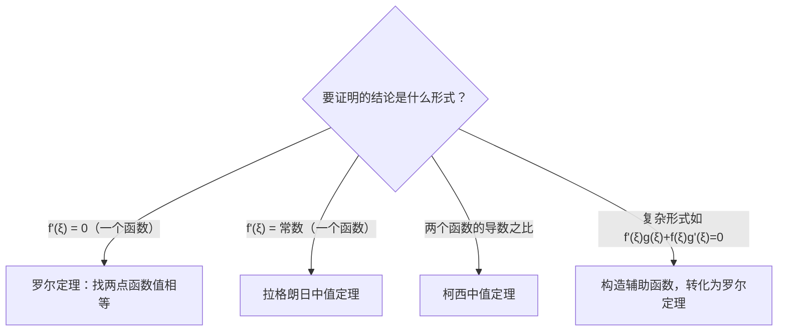
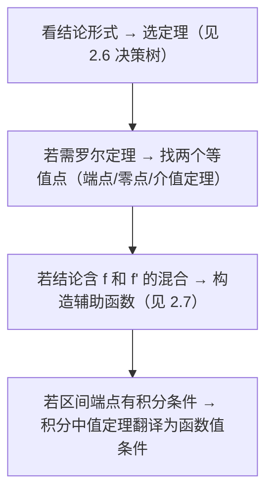

# 第 2 章：一元函数微分学

> **本章地位**：一元函数微分学是考研数学二的核心章节之一。选择填空中，求导、极值、渐近线几乎是"送分题"；解答题中，中值定理证明是公认难点，而导数工具又常与积分结合出综合大题。可以说，**微分学是连接极限与积分的桥梁**——学不好这一章，后面的积分应用、微分方程都会吃力。

本章的学习目标：
- 计算层面：熟练求导（含隐函数、参数方程、高阶导数）
- 理论层面：理解中值定理三兄弟的逻辑关系，会构造辅助函数
- 应用层面：用导数工具分析函数性态（单调、凹凸、极值、渐近线）

---

## 2.1 导数的定义与几何意义

### 核心概念

导数的本质是**变化率的精确描述**。平均变化率 $\frac{\Delta y}{\Delta x}$ 只能告诉你"一段时间内大概变了多少"，而导数告诉你"此刻正在以多快的速度变化"。

**定义**：设函数 $y = f(x)$ 在 $x_0$ 的某邻域内有定义，若极限

$$
f'(x_0) = \lim_{\Delta x \to 0} \frac{f(x_0 + \Delta x) - f(x_0)}{\Delta x}
$$

存在，则称 $f(x)$ 在 $x_0$ 处**可导**，该极限值称为 $f(x)$ 在 $x_0$ 处的导数。

等价形式（令 $x = x_0 + \Delta x$）：

$$
f'(x_0) = \lim_{x \to x_0} \frac{f(x) - f(x_0)}{x - x_0}
$$

### 几何意义

$f'(x_0)$ 是曲线 $y = f(x)$ 在点 $(x_0, f(x_0))$ 处**切线的斜率**。

- **切线方程**： $y - f(x_0) = f'(x_0)(x - x_0)$
- **法线方程**： $y - f(x_0) = -\frac{1}{f'(x_0)}(x - x_0)$ （当 $f'(x_0) \neq 0$ 时）

### 典型方法演示

**例**：求曲线 $y = x^3$ 在点 $(1, 1)$ 处的切线方程。

$f'(x) = 3x^2$ ，故 $f'(1) = 3$ 。

切线方程： $y - 1 = 3(x - 1)$ ，即 $y = 3x - 2$ 。

### 易错点

1. **可导必连续，连续未必可导**。 $f(x) = \lvert x \rvert$ 在 $x = 0$ 连续但不可导（左右导数不等）。
2. 用定义求导时， $\Delta x$ 可以从正、负两个方向趋于 0，必须两侧极限相等。
3. 切线是"在切点处"的，不要把"过某点的切线"和"在某点处的切线"混淆——前者切点未知，需要设切点再求。

---

## 2.2 基本求导公式

这些公式必须像乘法口诀一样熟练，因为后续所有求导都是它们的组合。

| 函数 | 导数 | 记忆要点 |
|------|------|----------|
| $x^\alpha$ | $\alpha x^{\alpha-1}$ | 指数下来，指数减 1 |
| $e^x$ | $e^x$ | 唯一"导数等于自身"的函数 |
| $a^x$ | $a^x \ln a$ | 多乘一个 $\ln a$ |
| $\ln x$ | $\frac{1}{x}$ | |
| $\log_a x$ | $\frac{1}{x \ln a}$ | |
| $\sin x$ | $\cos x$ | |
| $\cos x$ | $-\sin x$ | 注意负号 |
| $\tan x$ | $\sec^2 x$ | |
| $\cot x$ | $-\csc^2 x$ | |
| $\sec x$ | $\sec x \tan x$ | |
| $\csc x$ | $-\csc x \cot x$ | |
| $\arcsin x$ | $\frac{1}{\sqrt{1-x^2}}$ | |
| $\arccos x$ | $-\frac{1}{\sqrt{1-x^2}}$ | 与 $\arcsin$ 差一个负号 |
| $\arctan x$ | $\frac{1}{1+x^2}$ | |
| $\text{arccot}\, x$ | $-\frac{1}{1+x^2}$ | |

---

## 2.3 求导法则

### 四则运算法则

设 $u = u(x)$ ， $v = v(x)$ 均可导：

$$
(u \pm v)' = u' \pm v'
$$

$$
(uv)' = u'v + uv'
$$

$$
\left(\frac{u}{v}\right)' = \frac{u'v - uv'}{v^2} \quad (v \neq 0)
$$

### 链式法则（复合函数求导）

若 $y = f(u)$ ， $u = g(x)$ ，则：

$$
\frac{dy}{dx} = \frac{dy}{du} \cdot \frac{du}{dx} = f'(u) \cdot g'(x)
$$

**操作口诀**：从外到内，逐层求导，每层乘以内层的导数。

**例**：求 $y = e^{\sin(x^2)}$ 的导数。

分解层次： $y = e^u$ ， $u = \sin v$ ， $v = x^2$ 。

$$
y' = e^{\sin(x^2)} \cdot \cos(x^2) \cdot 2x
$$

### 隐函数求导

方程 $F(x, y) = 0$ 确定了 $y$ 是 $x$ 的函数，但无法（或不便）显式解出 $y = f(x)$ 。

**方法**：方程两边对 $x$ 求导，把 $y$ 看作 $x$ 的函数（每次对 $y$ 求导都要乘 $y'$ ），然后解出 $y'$ 。

**例**：设 $x^2 + y^2 = 1$ ，求 $y'$ 。

两边对 $x$ 求导： $2x + 2y \cdot y' = 0$ ，解得 $y' = -\frac{x}{y}$ 。

### 参数方程求导

设 $\begin{cases} x = \varphi(t) \\ y = \psi(t) \end{cases}$ ，则：

$$
\frac{dy}{dx} = \frac{\psi'(t)}{\varphi'(t)}
$$

**二阶导数**（高频易错）：

$$
\frac{d^2 y}{dx^2} = \frac{\frac{d}{dt}\left(\frac{dy}{dx}\right)}{\varphi'(t)}
$$

注意：二阶导数不是 $\frac{\psi''(t)}{\varphi''(t)}$ ！必须把 $\frac{dy}{dx}$ 看作 $t$ 的函数再对 $t$ 求导，最后除以 $\varphi'(t)$ 。

**例**：设 $x = t - \sin t$ ， $y = 1 - \cos t$ （摆线），求 $\frac{dy}{dx}$ 。

$$
\frac{dy}{dx} = \frac{\sin t}{1 - \cos t}
$$

### 对数求导法

适用于**幂指函数** $y = u(x)^{v(x)}$ 或多个函数连乘/连除的情形。

步骤：两边取对数 $\ln y = v(x) \ln u(x)$ ，再对 $x$ 求导。

**例**：求 $y = x^x$ （ $x > 0$ ）的导数。

$\ln y = x \ln x$ ，两边求导： $\frac{y'}{y} = \ln x + 1$ ，故 $y' = x^x(\ln x + 1)$ 。

### 易错点

1. 链式法则中**不要漏层**。 $f(g(h(x)))$ 的导数是 $f'(g(h(x))) \cdot g'(h(x)) \cdot h'(x)$ ，三层都要乘。
2. 参数方程二阶导数的分母是 $\varphi'(t)$ ，不是 $\varphi''(t)$ 。
3. 隐函数求导时， $y^2$ 对 $x$ 求导是 $2y \cdot y'$ ，不是 $2y$ 。

---

## 2.4 高阶导数

### 基本概念

$n$ 阶导数就是"对导数再求 $n-1$ 次导"： $f^{(n)}(x) = [f^{(n-1)}(x)]'$ 。

### 常用高阶导数公式

| 函数 | $n$ 阶导数 |
|------|-----------|
| $e^x$ | $e^x$ |
| $e^{ax}$ | $a^n e^{ax}$ |
| $\sin x$ | $\sin\left(x + \frac{n\pi}{2}\right)$ |
| $\cos x$ | $\cos\left(x + \frac{n\pi}{2}\right)$ |
| $x^m$ （ $n \leq m$ ） | $\frac{m!}{(m-n)!} x^{m-n}$ |
| $\ln(1+x)$ | $\frac{(-1)^{n-1}(n-1)!}{(1+x)^n}$ |
| $\frac{1}{ax+b}$ | $\frac{(-1)^n n! \cdot a^n}{(ax+b)^{n+1}}$ |

### 莱布尼茨公式

两个函数乘积的 $n$ 阶导数：

$$
(uv)^{(n)} = \sum_{k=0}^{n} \binom{n}{k} u^{(k)} v^{(n-k)}
$$

形式上与二项式定理完全一致。

**使用技巧**：当其中一个函数的高阶导数很快变为 0 时（如多项式），莱布尼茨公式特别好用。

**例**：求 $y = x^2 e^x$ 的 $n$ 阶导数。

令 $u = x^2$ ， $v = e^x$ 。由于 $u''' = 0$ ，求和只需取 $k = 0, 1, 2$ ：

$$
y^{(n)} = \binom{n}{0} x^2 e^x + \binom{n}{1} \cdot 2x \cdot e^x + \binom{n}{2} \cdot 2 \cdot e^x
$$

$$
= e^x \left[ x^2 + 2nx + n(n-1) \right]
$$

### 易错点

- 莱布尼茨公式中 $u^{(0)} = u$ （不是 0）， $v^{(0)} = v$ 。
- 用莱布尼茨公式时，选"高阶导数简单"的那个做 $u$ （通常是多项式）。

---

## 2.5 微分

### 核心概念

**微分**是函数增量的**线性主部**。当 $\Delta x$ 很小时：

$$
\Delta y = f(x_0 + \Delta x) - f(x_0) = f'(x_0) \Delta x + o(\Delta x)
$$

其中线性部分 $f'(x_0) \Delta x$ 就是微分，记为：

$$
dy = f'(x) dx
$$

**通俗理解**：微分就是"用切线近似曲线"。 $\Delta y$ 是曲线的真实变化量， $dy$ 是切线上的变化量，两者之差是高阶无穷小。

### 微分与导数的关系

- 可导 $\Leftrightarrow$ 可微（一元函数中两者等价）
- $f'(x) = \frac{dy}{dx}$ （导数就是"微分之商"）

### 微分的运算法则

与求导法则一一对应，只需在导数后面乘 $dx$ ：

$$
d(u \pm v) = du \pm dv, \quad d(uv) = v\,du + u\,dv, \quad d\left(\frac{u}{v}\right) = \frac{v\,du - u\,dv}{v^2}
$$

### 易错点

- 微分形式具有**不变性**：无论 $u$ 是自变量还是中间变量， $dy = f'(u)\,du$ 的形式不变。这是换元积分法的理论基础。
- 数二中微分主要作为工具出现（如微分方程中分离变量），单独考微分概念的题目较少。

---

## 2.6 微分中值定理

> **本节是本章理论核心，也是证明题的主要来源。务必理解三个定理之间的逻辑递进关系。**

### 费马引理（预备）

若 $f(x)$ 在 $x_0$ 处取极值且可导，则 $f'(x_0) = 0$ 。

这是罗尔定理证明的基础：连续函数在闭区间上必有最值，若最值在内部取到，则该点导数为 0。

### 罗尔定理（Rolle）

**条件**： $f(x)$ 满足
1. 在 $[a, b]$ 上连续
2. 在 $(a, b)$ 内可导
3. $f(a) = f(b)$

**结论**：至少存在 $\xi \in (a, b)$ ，使得 $f'(\xi) = 0$ 。

**几何意义**：两端等高的光滑曲线，中间必有水平切线。

### 拉格朗日中值定理（Lagrange）

**条件**： $f(x)$ 满足
1. 在 $[a, b]$ 上连续
2. 在 $(a, b)$ 内可导

**结论**：至少存在 $\xi \in (a, b)$ ，使得

$$
f'(\xi) = \frac{f(b) - f(a)}{b - a}
$$

**几何意义**：光滑曲线上必存在一点，其切线平行于两端点的连线（割线）。

**与罗尔的关系**：当 $f(a) = f(b)$ 时，拉格朗日退化为罗尔。罗尔是拉格朗日的特殊情况。

**常用推论**：
- 若 $f'(x) \equiv 0$ 在区间 $I$ 上，则 $f(x)$ 在 $I$ 上为常数。
- 若 $f'(x) > 0$ 在 $(a,b)$ 上，则 $f(x)$ 在 $[a,b]$ 上严格递增。

### 柯西中值定理（Cauchy）

**条件**： $f(x)$ 、 $g(x)$ 满足
1. 在 $[a, b]$ 上连续
2. 在 $(a, b)$ 内可导
3. $g'(x) \neq 0$ （ $x \in (a,b)$ ）

**结论**：至少存在 $\xi \in (a, b)$ ，使得

$$
\frac{f'(\xi)}{g'(\xi)} = \frac{f(b) - f(a)}{g(b) - g(a)}
$$

**与拉格朗日的关系**：取 $g(x) = x$ ，柯西退化为拉格朗日。

**主要用途**：柯西中值定理是**洛必达法则的理论基础**，也用于证明涉及两个函数的等式。

### 三定理的逻辑关系（决策树）



### 典型方法演示

**例 1**（拉格朗日）：证明当 $x > 0$ 时， $\frac{x}{1+x} < \ln(1+x) < x$ 。

**证明**：对 $f(t) = \ln(1+t)$ 在 $[0, x]$ 上用拉格朗日中值定理：

$$
\ln(1+x) - \ln 1 = \frac{1}{1+\xi} \cdot x, \quad \xi \in (0, x)
$$

因为 $0 < \xi < x$ ，所以 $1 < 1+\xi < 1+x$ ，从而：

$$
\frac{1}{1+x} < \frac{1}{1+\xi} < 1
$$

乘以 $x > 0$ ： $\frac{x}{1+x} < \ln(1+x) < x$ 。 $\blacksquare$

**例 2**（罗尔）：设 $f(x)$ 在 $[0, 1]$ 上连续，在 $(0, 1)$ 内可导， $f(0) = 0$ ， $f(1) = 1$ 。证明存在 $\xi \in (0, 1)$ 使得 $f'(\xi) = 2\xi$ 。

**证明**：结论 $f'(\xi) = 2\xi$ 即 $f'(\xi) - 2\xi = 0$ 。

构造辅助函数 $F(x) = f(x) - x^2$ ，则 $F'(x) = f'(x) - 2x$ 。

只需证 $F'(\xi) = 0$ ，即对 $F(x)$ 用罗尔定理。

$F(0) = f(0) - 0 = 0$ ， $F(1) = f(1) - 1 = 0$ 。

$F(0) = F(1)$ ，由罗尔定理，存在 $\xi \in (0, 1)$ 使 $F'(\xi) = 0$ ，即 $f'(\xi) = 2\xi$ 。 $\blacksquare$

### 易错点

1. 中值定理的 $\xi$ 是**存在性**结论，不能求出具体值。
2. 罗尔定理要求**闭区间连续 + 开区间可导**，缺一不可。
3. 拉格朗日中值定理中 $\xi$ 的位置一般无法确定，只能知道 $\xi \in (a, b)$ 。

---

## 2.7 构造辅助函数的技巧

> **这是中值定理证明题的核心难点。** 大多数证明题的本质都是：把复杂结论转化为"某个辅助函数满足罗尔定理"。

### 方法一：原函数法（最常用）

**核心思想**：观察要证的结论 $f'(\xi) \cdot A + f(\xi) \cdot B = 0$ 的形式，把它看作某个 $F(x)$ 的导数 $F'(\xi) = 0$ ，反推出 $F(x)$ 。

**操作口诀**：把 $\xi$ 换成 $x$ ，把 $f'(x)$ 的部分积分回去。

**常见模式**：

| 要证的结论 | 对应的辅助函数 $F(x)$ | 识别方法 |
|-----------|---------------------|---------|
| $f'(\xi) = 0$ | $F(x) = f(x)$ | 直接罗尔 |
| $f'(\xi) + f(\xi) = 0$ | $F(x) = e^x f(x)$ | 乘积求导 $(e^x f)' = e^x(f' + f)$ |
| $f'(\xi) - f(\xi) = 0$ | $F(x) = e^{-x} f(x)$ | $(e^{-x} f)' = e^{-x}(f' - f)$ |
| $f'(\xi)\cos\xi + f(\xi)\sin\xi = 0$ | $F(x) = f(x)\sin x$ | 乘积求导 |
| $f'(\xi)\sin\xi - f(\xi)\cos\xi = 0$ | $F(x) = \frac{f(x)}{\sin x}$ | 商的求导 $\left(\frac{f}{\sin x}\right)' = \frac{f'\sin x - f\cos x}{\sin^2 x}$ |
| $f'(\xi)g(\xi) + f(\xi)g'(\xi) = 0$ | $F(x) = f(x)g(x)$ | 乘积求导 |
| $f'(\xi)g(\xi) - f(\xi)g'(\xi) = 0$ | $F(x) = \frac{f(x)}{g(x)}$ | 商的求导 |

### 方法二：积分因子法

当结论形如 $f'(\xi) + p(\xi) f(\xi) = 0$ 时，这恰好是一阶线性方程 $y' + p(x)y = 0$ 的形式。

其积分因子为 $e^{\int p(x) dx}$ ，令：

$$
F(x) = f(x) \cdot e^{\int p(x) dx}
$$

则 $F'(x) = e^{\int p(x)dx}[f'(x) + p(x)f(x)]$ 。

**例**：证存在 $\xi$ 使 $f'(\xi) + 2\xi f(\xi) = 0$ 。

这里 $p(x) = 2x$ ，积分因子 $e^{\int 2x\,dx} = e^{x^2}$ 。

令 $F(x) = f(x) e^{x^2}$ ，则 $F'(x) = e^{x^2}[f'(x) + 2xf(x)]$ 。

只需对 $F(x)$ 验证罗尔定理条件即可。

### 方法三：利用已知等式构造

有时题目给出的条件本身就能构造辅助函数。例如：

- 条件" $f(0) = 0$ 且 $\int_0^1 f(x)dx = 0$ "→ 由积分中值定理或构造 $F(x) = \int_0^x f(t)dt$ 。
- 条件" $nf(1) = \int_0^1 f(x)dx$ "→ 考虑 $F(x) = x^n f(x)$ 之类。

### 证明题的通用解题流程

```
第 1 步：把结论中的 ξ 换成 x，写成 F'(x) = 0 的形式
第 2 步：反推 F(x)（用原函数法或积分因子法）
第 3 步：验证 F(x) 满足罗尔定理（找两个点使 F 值相等）
第 4 步：如果罗尔条件不直接满足，考虑：
         - 用介值定理/零点定理找等值点
         - 用积分中值定理转化条件
         - 对 F(x) 再用一次中值定理（多次罗尔）
```

### 典型方法演示

**例**：设 $f(x)$ 在 $[0, 1]$ 上连续，在 $(0, 1)$ 内可导， $f(0) = 0$ ， $f(1) = 1$ 。证明存在不同的 $\xi_1, \xi_2 \in (0, 1)$ 使得 $\frac{1}{f'(\xi_1)} + \frac{1}{f'(\xi_2)} = 2$ 。

**分析**：结论涉及两个不同的点，需要**两次**拉格朗日中值定理。

**证明**：由介值定理，存在 $c \in (0, 1)$ 使 $f(c) = \frac{1}{2}$ 。

在 $[0, c]$ 上用拉格朗日： $f'(\xi_1) = \frac{f(c) - f(0)}{c - 0} = \frac{1}{2c}$ ， $\xi_1 \in (0, c)$ 。

在 $[c, 1]$ 上用拉格朗日： $f'(\xi_2) = \frac{f(1) - f(c)}{1 - c} = \frac{1}{2(1-c)}$ ， $\xi_2 \in (c, 1)$ 。

因此：

$$
\frac{1}{f'(\xi_1)} + \frac{1}{f'(\xi_2)} = 2c + 2(1-c) = 2 \quad \blacksquare
$$

---

## 2.8 泰勒公式

> **泰勒公式是求极限的"终极武器"，也是近似计算和理论证明的基础工具。数二中，泰勒展开求极限几乎是必考内容。**

### 核心思想

用多项式逼近函数。 $n$ 阶泰勒多项式在 $x_0$ 附近与 $f(x)$ 的误差不超过 $(x-x_0)^n$ 的高阶无穷小。

### 泰勒公式（带佩亚诺余项）

$$
f(x) = f(x_0) + f'(x_0)(x - x_0) + \frac{f''(x_0)}{2!}(x-x_0)^2 + \cdots + \frac{f^{(n)}(x_0)}{n!}(x-x_0)^n + o((x-x_0)^n)
$$

当 $x_0 = 0$ 时称为**麦克劳林公式**。

### 必须熟记的麦克劳林展开

$$
e^x = 1 + x + \frac{x^2}{2!} + \frac{x^3}{3!} + \cdots + \frac{x^n}{n!} + o(x^n)
$$

$$
\sin x = x - \frac{x^3}{3!} + \frac{x^5}{5!} - \cdots + \frac{(-1)^n x^{2n+1}}{(2n+1)!} + o(x^{2n+2})
$$

$$
\cos x = 1 - \frac{x^2}{2!} + \frac{x^4}{4!} - \cdots + \frac{(-1)^n x^{2n}}{(2n)!} + o(x^{2n+1})
$$

$$
\ln(1+x) = x - \frac{x^2}{2} + \frac{x^3}{3} - \cdots + \frac{(-1)^{n-1} x^n}{n} + o(x^n)
$$

$$
(1+x)^\alpha = 1 + \alpha x + \frac{\alpha(\alpha-1)}{2!}x^2 + \cdots + \frac{\alpha(\alpha-1)\cdots(\alpha-n+1)}{n!}x^n + o(x^n)
$$

$$
\frac{1}{1-x} = 1 + x + x^2 + \cdots + x^n + o(x^n)
$$

$$
\frac{1}{1+x} = 1 - x + x^2 - \cdots + (-1)^n x^n + o(x^n)
$$

$$
\tan x = x + \frac{x^3}{3} + \frac{2x^5}{15} + o(x^5)
$$

$$
\arctan x = x - \frac{x^3}{3} + \frac{x^5}{5} - \cdots + o(x^{2n+1})
$$

### 泰勒展开求极限的方法

**核心原则**：展开到分子分母中**第一个不为零的项**为止。

**操作步骤**：
1. 判断 $x \to 0$ （或做换元使变量趋于 0）
2. 确定需要展开到几阶（看分母的阶数）
3. 逐个展开，合并同类项
4. 取第一个非零项之比

**例 1**：求 $\lim_{x \to 0} \frac{e^x - 1 - x}{x^2}$ 。

分母是 $x^2$ 阶，所以 $e^x$ 展开到二阶：

$$
e^x = 1 + x + \frac{x^2}{2} + o(x^2)
$$

$$
e^x - 1 - x = \frac{x^2}{2} + o(x^2)
$$

$$
\lim_{x \to 0} \frac{\frac{x^2}{2} + o(x^2)}{x^2} = \frac{1}{2}
$$

**例 2**：求 $\lim_{x \to 0} \frac{\sin x - x\cos x}{x^3}$ 。

$$
\sin x = x - \frac{x^3}{6} + o(x^3)
$$

$$
x\cos x = x\left(1 - \frac{x^2}{2} + o(x^2)\right) = x - \frac{x^3}{2} + o(x^3)
$$

$$
\sin x - x\cos x = \left(x - \frac{x^3}{6}\right) - \left(x - \frac{x^3}{2}\right) + o(x^3) = \frac{x^3}{3} + o(x^3)
$$

$$
\lim_{x \to 0} \frac{\frac{x^3}{3} + o(x^3)}{x^3} = \frac{1}{3}
$$

**例 3**：求 $\lim_{x \to 0} \frac{\ln(1+x) - x + \frac{x^2}{2}}{x^3}$ 。

$$
\ln(1+x) = x - \frac{x^2}{2} + \frac{x^3}{3} + o(x^3)
$$

$$
\ln(1+x) - x + \frac{x^2}{2} = \frac{x^3}{3} + o(x^3)
$$

极限为 $\frac{1}{3}$ 。

### 泰勒公式用于证明

泰勒公式带**拉格朗日余项**的形式：

$$
f(x) = \sum_{k=0}^{n} \frac{f^{(k)}(x_0)}{k!}(x-x_0)^k + \frac{f^{(n+1)}(\xi)}{(n+1)!}(x-x_0)^{n+1}
$$

其中 $\xi$ 在 $x_0$ 与 $x$ 之间。这个形式在证明不等式时非常有用。

**例**：证明 $e^x \geq 1 + x$ （对所有 $x$ ）。

由泰勒公式： $e^x = 1 + x + \frac{e^\xi}{2}x^2$ （ $\xi$ 在 0 与 $x$ 之间）。

因为 $e^\xi > 0$ ， $x^2 \geq 0$ ，所以 $e^x \geq 1 + x$ 。 $\blacksquare$

### 易错点

1. **展开阶数要一致**：分子中所有项展开到同一阶，不要有的展到二阶有的展到三阶。
2. **$o(x^n)$ 的运算**： $o(x^2) + o(x^3) = o(x^2)$ （取低阶）； $x \cdot o(x^2) = o(x^3)$ 。
3. **不能对 $o$ 做除法**： $\frac{o(x^2)}{x} = o(x)$ 是对的，但 $\frac{o(x^2)}{o(x)}$ 无意义。
4. 泰勒展开求极限只适用于 $x \to 0$ （或可换元为趋于 0 的情形）。 $x \to \infty$ 时一般用其他方法。
5. 等价无穷小替换本质上是泰勒展开取第一项，当第一项相消时必须展开更多项。

---

## 2.9 函数的单调性与极值

### 单调性判别

**定理**：设 $f(x)$ 在 $[a, b]$ 上连续，在 $(a, b)$ 内可导。
- 若 $f'(x) > 0$ （ $x \in (a,b)$ ），则 $f(x)$ 在 $[a,b]$ 上**严格递增**。
- 若 $f'(x) < 0$ （ $x \in (a,b)$ ），则 $f(x)$ 在 $[a,b]$ 上**严格递减**。

注意： $f'(x) \geq 0$ 且等号只在有限个点取到，仍可判定严格递增（如 $f(x) = x^3$ ， $f'(0) = 0$ 但仍严格递增）。

### 极值的判定

**第一充分条件（一阶导数变号）**：

设 $f'(x_0) = 0$ （或 $f'(x_0)$ 不存在），观察 $x_0$ 两侧 $f'$ 的符号：
- 左正右负 → 极大值
- 左负右正 → 极小值
- 不变号 → 非极值点

**第二充分条件（二阶导数）**：

设 $f'(x_0) = 0$ ， $f''(x_0)$ 存在：
- $f''(x_0) < 0$ → 极大值
- $f''(x_0) > 0$ → 极小值
- $f''(x_0) = 0$ → 此法失效，回到第一充分条件

### 最值问题

闭区间 $[a, b]$ 上连续函数的最值求法：
1. 求 $(a, b)$ 内所有驻点（ $f'(x) = 0$ ）和不可导点
2. 计算这些点及端点 $a$ 、 $b$ 处的函数值
3. 比较大小，最大者为最大值，最小者为最小值

### 利用单调性证明不等式

**方法**：要证 $f(x) > g(x)$ （ $x > a$ ），令 $F(x) = f(x) - g(x)$ ，证 $F(a) = 0$ （或 $F(a) \geq 0$ ）且 $F'(x) > 0$ （ $x > a$ ）。

**例**：证明当 $x > 0$ 时， $e^x > 1 + x$ 。

令 $F(x) = e^x - 1 - x$ 。 $F(0) = 0$ ， $F'(x) = e^x - 1 > 0$ （ $x > 0$ ）。

故 $F(x)$ 在 $[0, +\infty)$ 上严格递增， $F(x) > F(0) = 0$ ，即 $e^x > 1 + x$ 。 $\blacksquare$

### 易错点

1. 极值点不一定是驻点（如 $f(x) = \lvert x \rvert$ 在 $x = 0$ 取极小值但不可导）。
2. 驻点不一定是极值点（如 $f(x) = x^3$ 在 $x = 0$ ， $f'(0) = 0$ 但非极值）。
3. 求最值时**不要漏掉端点和不可导点**。

---

## 2.10 函数的凹凸性与拐点

### 定义与判别

**凹凸性**（本教材采用"下凸为凹"的定义）：
- $f''(x) > 0$ ：曲线**凹**（下凸），图像"开口朝上"，如 $y = x^2$
- $f''(x) < 0$ ：曲线**凸**（上凸），图像"开口朝下"，如 $y = -x^2$

**几何意义**：凹函数的切线在曲线下方，凸函数的切线在曲线上方。

### 拐点

**定义**：曲线凹凸性发生改变的点称为拐点。

**求法**：
1. 求 $f''(x) = 0$ 的点和 $f''(x)$ 不存在的点
2. 检查这些点两侧 $f''$ 是否变号
3. 变号 → 拐点；不变号 → 非拐点

**注意**：拐点是曲线上的**点** $(x_0, f(x_0))$ ，不是 $x = x_0$ 。

### 典型方法演示

**例**：求 $f(x) = x^3 - 3x$ 的凹凸区间和拐点。

$f'(x) = 3x^2 - 3$ ， $f''(x) = 6x$ 。

$f''(x) = 0 \Rightarrow x = 0$ 。

- $x < 0$ ： $f''(x) < 0$ ，曲线凸（上凸）
- $x > 0$ ： $f''(x) > 0$ ，曲线凹（下凸）

拐点为 $(0, f(0)) = (0, 0)$ 。

### 易错点

1. $f''(x_0) = 0$ 不一定是拐点（如 $f(x) = x^4$ ， $f''(0) = 0$ 但 $x = 0$ 不是拐点）。
2. 凹凸性的定义在不同教材中可能相反（"上凹"vs"下凹"），考研以同济教材为准： $f'' > 0$ 为凹。

---

## 2.11 渐近线

### 三种渐近线

| 类型 | 条件 | 求法 |
|------|------|------|
| 水平渐近线 | $\lim_{x \to \infty} f(x) = A$ | $y = A$ |
| 铅直渐近线 | $\lim_{x \to x_0} f(x) = \infty$ | $x = x_0$ |
| 斜渐近线 | $\lim_{x \to \infty} \frac{f(x)}{x} = a \neq 0$ 且 $\lim_{x \to \infty}[f(x) - ax] = b$ | $y = ax + b$ |

### 注意事项

1. 水平渐近线和斜渐近线**互斥**：若 $x \to +\infty$ 时有水平渐近线，则同方向不会有斜渐近线。但 $x \to +\infty$ 和 $x \to -\infty$ 可以分别有不同渐近线。
2. 铅直渐近线通常在**分母为零而分子不为零**的点处寻找。
3. 求斜渐近线时， $x \to +\infty$ 和 $x \to -\infty$ 要**分别讨论**。

### 典型方法演示

**例**：求 $f(x) = \frac{x^2 + 1}{x - 1}$ 的所有渐近线。

**铅直渐近线**： $x = 1$ 处分母为零， $\lim_{x \to 1} f(x) = \infty$ ，故 $x = 1$ 是铅直渐近线。

**水平渐近线**： $\lim_{x \to \infty} f(x) = \lim_{x \to \infty} \frac{x^2+1}{x-1} = \infty$ ，无水平渐近线。

**斜渐近线**：

$$
a = \lim_{x \to \infty} \frac{f(x)}{x} = \lim_{x \to \infty} \frac{x^2+1}{x(x-1)} = 1
$$

$$
b = \lim_{x \to \infty} [f(x) - x] = \lim_{x \to \infty} \frac{x^2+1 - x(x-1)}{x-1} = \lim_{x \to \infty} \frac{x+1}{x-1} = 1
$$

斜渐近线为 $y = x + 1$ 。

### 易错点

- 多项式除法可以快速判断： $\frac{x^2+1}{x-1} = x + 1 + \frac{2}{x-1}$ ，直接读出斜渐近线 $y = x + 1$ 。
- 不要遗漏 $x \to -\infty$ 方向的讨论。

---

## 2.12 函数作图

### 综合步骤

函数作图是单调性、凹凸性、渐近线的综合应用，步骤固定：

1. **定义域**：确定函数的定义范围
2. **奇偶性/周期性**：简化分析（偶函数只画右半部分）
3. **求 $f'(x)$**：确定单调区间和极值点
4. **求 $f''(x)$**：确定凹凸区间和拐点
5. **求渐近线**：水平、铅直、斜
6. **列表**：将以上信息整理成表格
7. **描点连线**：标出极值点、拐点、与坐标轴交点，按单调性和凹凸性画出曲线

### 列表示例

以 $f(x) = xe^{-x}$ 为例：

- 定义域： $(-\infty, +\infty)$
- $f'(x) = (1-x)e^{-x}$ ： $x < 1$ 时 $f' > 0$ （递增）， $x > 1$ 时 $f' < 0$ （递减）
- 极大值： $f(1) = e^{-1}$
- $f''(x) = (x-2)e^{-x}$ ： $x < 2$ 时凸， $x > 2$ 时凹
- 拐点： $(2, 2e^{-2})$
- 水平渐近线： $\lim_{x \to +\infty} xe^{-x} = 0$ ，即 $y = 0$ （右侧）
- $x \to -\infty$ 时 $f(x) \to -\infty$ ，无渐近线

---

## 2.13 曲率与曲率半径

> 数二大纲要求"了解"，出题频率低，但公式要记住。

### 曲率公式

曲线 $y = f(x)$ 在点 $x$ 处的曲率：

$$
K = \frac{\lvert y'' \rvert}{(1 + y'^2)^{3/2}}
$$

### 曲率半径

$$
R = \frac{1}{K} = \frac{(1 + y'^2)^{3/2}}{\lvert y'' \rvert}
$$

**几何意义**：曲率越大，曲线弯曲得越厉害；曲率半径就是"最贴合的那段圆弧的半径"。

### 参数方程形式

若 $x = \varphi(t)$ ， $y = \psi(t)$ ：

$$
K = \frac{\lvert \varphi'(t)\psi''(t) - \psi'(t)\varphi''(t) \rvert}{[\varphi'^2(t) + \psi'^2(t)]^{3/2}}
$$

### 特殊情形

- 圆的曲率 $K = \frac{1}{R}$ （常数），曲率半径就是圆的半径。
- 直线的曲率 $K = 0$ 。

---

## 2.14 中值定理证明题专题

> **本节汇总中值定理证明题的常见题型和应对策略，是本章最难也最重要的部分。**



### 题型一：证明 $f'(\xi) = k$ （常数）

**策略**：构造 $F(x) = f(x) - kx$ ，转化为证 $F'(\xi) = 0$ ，用罗尔定理。

关键：从条件中找到 $F(a) = F(b)$ 的两个点。

### 题型二：证明含 $f'(\xi)$ 和 $f(\xi)$ 的等式

**策略**：原函数法构造辅助函数（见 2.7 节）。

**例**：设 $f(x)$ 在 $[0, 1]$ 上连续， $(0, 1)$ 内可导， $f(1) = 0$ 。证明存在 $\xi \in (0, 1)$ 使 $\xi f'(\xi) + f(\xi) = 0$ 。

**分析**： $\xi f'(\xi) + f(\xi) = 0$ 即 $[xf(x)]'\big|_{x=\xi} = 0$ 。

**证明**：令 $F(x) = xf(x)$ 。

$F(0) = 0 \cdot f(0) = 0$ ， $F(1) = 1 \cdot f(1) = 0$ 。

$F(0) = F(1)$ ，由罗尔定理，存在 $\xi \in (0, 1)$ 使 $F'(\xi) = 0$ ，即 $\xi f'(\xi) + f(\xi) = 0$ 。 $\blacksquare$

### 题型三：证明含两个不同中值点的等式

**策略**：对区间进行分割，在不同子区间上分别用中值定理。

（见 2.7 节例 2 的方法）

### 题型四：与积分结合

**策略**：
- 条件含积分 → 用积分中值定理把积分转化为函数值
- 构造 $F(x) = \int_a^x f(t)dt$ ，则 $F'(x) = f(x)$ ，对 $F$ 用中值定理

**例**：设 $f(x)$ 在 $[0, 1]$ 上连续， $(0, 1)$ 内可导， $f(1) = 2\int_0^{1/2} f(x)dx$ 。证明存在 $\xi \in (0, 1)$ 使 $f'(\xi) = 0$ 。

**证明**：由积分中值定理， $\int_0^{1/2} f(x)dx = \frac{1}{2}f(c)$ ， $c \in (0, \frac{1}{2})$ 。

故 $f(1) = 2 \cdot \frac{1}{2} f(c) = f(c)$ 。

$f(c) = f(1)$ ， $c \in (0, \frac{1}{2}) \subset (0, 1)$ ，由罗尔定理，存在 $\xi \in (c, 1) \subset (0, 1)$ 使 $f'(\xi) = 0$ 。 $\blacksquare$

### 题型五：证明不等式

**常用工具**：
1. 拉格朗日中值定理（把函数值之差转化为导数值）
2. 泰勒公式（展开后利用余项的符号）
3. 单调性（构造辅助函数证其单调）

### 证明题的"救命"检查清单

做完一道证明题后，检查：
- [ ] 辅助函数 $F(x)$ 的导数确实等于要证的结论？
- [ ] 罗尔定理的三个条件（闭区间连续、开区间可导、两端等值）都验证了？
- [ ] $\xi$ 的范围确实在题目要求的区间内？
- [ ] 如果用了两次中值定理，两个中值点确实不同？（需要在不同子区间上使用）

---

## 本章小结

### 知识框架

```
一元函数微分学
├── 计算工具
│   ├── 求导（基本公式 + 链式法则 + 隐函数 + 参数方程）
│   ├── 高阶导数（莱布尼茨公式）
│   └── 微分（dy = f'(x)dx）
├── 理论核心
│   ├── 中值定理（罗尔 → 拉格朗日 → 柯西）
│   ├── 泰勒公式（多项式逼近）
│   └── 辅助函数构造（原函数法、积分因子法）
└── 应用
    ├── 单调性与极值
    ├── 凹凸性与拐点
    ├── 渐近线与函数作图
    └── 曲率（了解）
```

### 核心方法决策树

```
题目类型？
│
├─ 求导/求微分 → 基本公式 + 链式法则（注意隐函数、参数方程）
│
├─ 求极限（0/0 型，含 e^x, sin x, ln 等）
│   ├─ 简单 → 等价无穷小
│   └─ 相消 → 泰勒展开（展到第一个非零项）
│
├─ 证明等式（含 f'(ξ)）
│   ├─ f'(ξ) = 常数 → 拉格朗日
│   ├─ f'(ξ) = 0 → 罗尔
│   ├─ 含 f'(ξ) 和 f(ξ) → 构造辅助函数 + 罗尔
│   └─ 含两个函数 → 柯西
│
├─ 证明不等式
│   ├─ 构造 F(x) = 左 - 右，证单调性
│   ├─ 拉格朗日中值定理
│   └─ 泰勒展开（取余项符号）
│
├─ 求极值/最值 → f'(x) = 0 找驻点 + 比较
│
├─ 求渐近线 → 三种分别求
│
└─ 函数作图 → 定义域 → 奇偶 → f' → f'' → 渐近线 → 列表 → 画图
```

### 高频考点提醒

1. **选择填空**：求导计算、极值点/拐点判断、渐近线条数
2. **解答题**：中值定理证明（几乎每年一道）、利用导数分析函数性态
3. **跨章综合**：变限积分 + 中值定理、微分方程 + 极值问题

### 复习建议

- 基本求导公式和泰勒展开必须**默写级别**熟练
- 中值定理证明题至少练 20 道，重点练"构造辅助函数"的感觉
- 渐近线和函数作图是"送分题"，不要丢分
- 泰勒展开求极限比洛必达更快更不容易出错，优先使用
