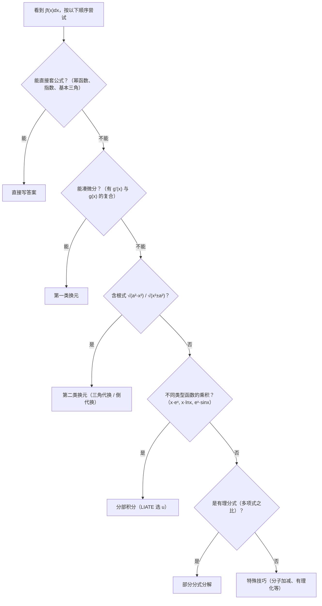

# 第 3 章：一元函数积分学

> **本章是数二分值最高的章节，大题主力。** 一张数二试卷中，积分相关的题目通常占 30-40 分：不定积分计算是基本功，定积分应用（面积、体积）几乎每年必出大题，变限积分求导是选择填空的超高频考点，积分中值定理则是证明题的常客。可以说，**积分学掌握的程度，直接决定数二的分数上限。**

本章分为三大板块：

1. **不定积分** — 求原函数的技术（计算基本功）
2. **定积分** — 从黎曼和到牛顿-莱布尼茨公式（理论核心）
3. **定积分的应用** — 面积、体积、弧长、侧面积（大题主战场）

---

## 一、不定积分

### 1.1 原函数与不定积分的概念

**核心思想：积分是微分的逆运算。**

如果 $F'(x) = f(x)$ ，则称 $F(x)$ 是 $f(x)$ 的一个**原函数**。

$f(x)$ 的全体原函数称为 $f(x)$ 的**不定积分**，记作：

$$
\int f(x)\,dx = F(x) + C
$$

其中 $C$ 是任意常数。

**两个关键事实：**

- 若 $F(x)$ 是 $f(x)$ 的一个原函数，则 $F(x) + C$ （ $C$ 为任意常数）也是原函数，且 $f(x)$ 的任意原函数都可以写成这种形式。
- 原函数存在定理：若 $f(x)$ 在区间 $I$ 上连续，则 $f(x)$ 在 $I$ 上一定存在原函数。

**易错点：**

- 不定积分的结果**必须加 $C$**。考试中漏写 $C$ 是常见扣分点。
- $\int f(x)\,dx$ 表示的是一族函数，不是某一个函数。
- 验证方法：对结果求导，看是否回到被积函数。养成"积完求导验一下"的习惯。

### 1.2 基本积分公式

以下公式必须**烂熟于心**，它们是所有积分计算的基石。建议按"幂指对 → 三角 → 反三角"的顺序分组记忆：

**幂函数与指数函数：**

$$
\int x^\alpha\,dx = \frac{x^{\alpha+1}}{\alpha+1} + C \quad (\alpha \neq -1)
$$

$$
\int \frac{1}{x}\,dx = \ln\lvert x\rvert + C
$$

$$
\int e^x\,dx = e^x + C
$$

$$
\int a^x\,dx = \frac{a^x}{\ln a} + C \quad (a > 0,\, a \neq 1)
$$

**三角函数：**

$$
\int \sin x\,dx = -\cos x + C
$$

$$
\int \cos x\,dx = \sin x + C
$$

$$
\int \sec^2 x\,dx = \tan x + C
$$

$$
\int \csc^2 x\,dx = -\cot x + C
$$

$$
\int \sec x \tan x\,dx = \sec x + C
$$

$$
\int \csc x \cot x\,dx = -\csc x + C
$$

$$
\int \tan x\,dx = -\ln\lvert\cos x\rvert + C
$$

$$
\int \cot x\,dx = \ln\lvert\sin x\rvert + C
$$

$$
\int \sec x\,dx = \ln\lvert\sec x + \tan x\rvert + C
$$

$$
\int \csc x\,dx = \ln\lvert\csc x - \cot x\rvert + C
$$

**反三角函数型（极其常用）：**

$$
\int \frac{1}{1+x^2}\,dx = \arctan x + C
$$

$$
\int \frac{1}{\sqrt{1-x^2}}\,dx = \arcsin x + C
$$

**两个重要补充公式（由三角代换或配方得到）：**

$$
\int \frac{1}{\sqrt{a^2 - x^2}}\,dx = \arcsin\frac{x}{a} + C
$$

$$
\int \frac{1}{a^2 + x^2}\,dx = \frac{1}{a}\arctan\frac{x}{a} + C
$$

$$
\int \frac{1}{\sqrt{x^2 \pm a^2}}\,dx = \ln\lvert x + \sqrt{x^2 \pm a^2}\rvert + C
$$

> **老师提醒：** 最后这组公式在考试中经常以"配方后套用"的形式出现。比如 $\int \frac{1}{\sqrt{x^2 - 2x + 5}}\,dx$ ，先配方得 $\int \frac{1}{\sqrt{(x-1)^2 + 4}}\,dx$ ，再令 $u = x - 1$ ，套用公式。

### 1.3 换元积分法

换元法是积分计算中**最核心、最常用**的方法。分为两类：

#### 第一类换元法（凑微分法）

**原理：** 若 $\int f(u)\,du = F(u) + C$ ，则

$$
\int f(\varphi(x))\,\varphi'(x)\,dx = \int f(\varphi(x))\,d\varphi(x) = F(\varphi(x)) + C
$$

**核心思维：从 $dx$ 中"凑"出 $d(\text{某个表达式})$ ，把该表达式作为新的变量。**

这是最需要"题感"的部分。下面总结**凑微分的决策思路**：

**看到什么，就凑什么：**

| 被积函数中出现 | 凑微分方向 | 说明 |
|--------------|-----------|------|
| $f(ax+b)$ | $d(ax+b) = a\,dx$ | 最简单的情形 |
| $f(x^2) \cdot x$ | $d(x^2) = 2x\,dx$ | 外面多一个 $x$ |
| $f(\sin x) \cdot \cos x$ | $d(\sin x) = \cos x\,dx$ | 外面多一个 $\cos x$ |
| $f(\cos x) \cdot \sin x$ | $d(\cos x) = -\sin x\,dx$ | 外面多一个 $\sin x$ |
| $f(\ln x) \cdot \frac{1}{x}$ | $d(\ln x) = \frac{1}{x}\,dx$ | 外面多一个 $\frac{1}{x}$ |
| $f(e^x) \cdot e^x$ | $d(e^x) = e^x\,dx$ | 外面多一个 $e^x$ |
| $f(\tan x) \cdot \sec^2 x$ | $d(\tan x) = \sec^2 x\,dx$ | 外面多一个 $\sec^2 x$ |
| $f(\arctan x) \cdot \frac{1}{1+x^2}$ | $d(\arctan x) = \frac{1}{1+x^2}\,dx$ | 外面多一个 $\frac{1}{1+x^2}$ |

**方法演示：**

**例 1：** 求 $\int x\,e^{x^2}\,dx$

**分析：** 被积函数中有 $e^{x^2}$ （复合函数），外面多一个 $x$ 。而 $d(x^2) = 2x\,dx$ ，所以：

$$
\int x\,e^{x^2}\,dx = \frac{1}{2}\int e^{x^2}\,d(x^2) = \frac{1}{2}e^{x^2} + C
$$

**例 2：** 求 $\int \frac{\ln x}{x}\,dx$

**分析：** 有 $\ln x$ ，外面多一个 $\frac{1}{x}$ ，而 $d(\ln x) = \frac{1}{x}\,dx$ ：

$$
\int \frac{\ln x}{x}\,dx = \int \ln x\,d(\ln x) = \frac{(\ln x)^2}{2} + C
$$

**例 3：** 求 $\int \tan x\,dx$

**分析：** $\tan x = \frac{\sin x}{\cos x}$ ，分子 $\sin x\,dx = -d(\cos x)$ ：

$$
\int \tan x\,dx = \int \frac{\sin x}{\cos x}\,dx = -\int \frac{d(\cos x)}{\cos x} = -\ln\lvert\cos x\rvert + C
$$

**例 4（需要变形才能凑）：** 求 $\int \frac{1}{1+e^x}\,dx$

**分析：** 直接凑不出来。技巧：分子分母同乘 $e^{-x}$ ，或者"加 1 减 1"：

$$
\int \frac{1}{1+e^x}\,dx = \int \frac{1+e^x - e^x}{1+e^x}\,dx = \int 1\,dx - \int \frac{e^x}{1+e^x}\,dx = x - \ln(1+e^x) + C
$$

> **凑微分的本质：** 不是死记硬背，而是观察"被积函数中是否有一个因子，恰好是另一个因子的导数（或差一个常数倍）"。这个观察能力只能通过大量练习来培养。

#### 第二类换元法（变量代换）

**原理：** 令 $x = \varphi(t)$ （ $\varphi$ 单调可导且 $\varphi'(t) \neq 0$ ），则

$$
\int f(x)\,dx = \int f(\varphi(t))\,\varphi'(t)\,dt
$$

积出后再用 $t = \varphi^{-1}(x)$ 回代。

**什么时候用第二类换元？** 当被积函数中含有根式，凑微分凑不动时，用代换**消去根号**。

**三大经典三角代换（必须记住）：**

| 被积函数含有 | 令 | 利用的恒等式 | 代换后根号变为 |
|------------|---|------------|-------------|
| $\sqrt{a^2 - x^2}$ | $x = a\sin t$ | $1 - \sin^2 t = \cos^2 t$ | $a\cos t$ |
| $\sqrt{a^2 + x^2}$ | $x = a\tan t$ | $1 + \tan^2 t = \sec^2 t$ | $a\sec t$ |
| $\sqrt{x^2 - a^2}$ | $x = a\sec t$ | $\sec^2 t - 1 = \tan^2 t$ | $a\tan t$ |

**记忆口诀：** "减号正弦，加号正切， $x$ 在前正割。"

**方法演示：**

**例 5：** 求 $\int \frac{1}{\sqrt{4-x^2}}\,dx$

这个可以直接套公式，但用三角代换演示过程：令 $x = 2\sin t$ ， $dx = 2\cos t\,dt$ ：

$$
\int \frac{2\cos t}{\sqrt{4 - 4\sin^2 t}}\,dt = \int \frac{2\cos t}{2\cos t}\,dt = \int dt = t + C = \arcsin\frac{x}{2} + C
$$

**例 6：** 求 $\int \frac{x^2}{\sqrt{x^2 + 9}}\,dx$

**分析：** 含 $\sqrt{x^2 + 9} = \sqrt{x^2 + 3^2}$ ，"加号正切"，令 $x = 3\tan t$ ：

$$
dx = 3\sec^2 t\,dt, \quad \sqrt{x^2+9} = 3\sec t
$$

$$
\int \frac{9\tan^2 t}{3\sec t} \cdot 3\sec^2 t\,dt = 9\int \tan^2 t \sec t\,dt = 9\int (\sec^2 t - 1)\sec t\,dt
$$

$$
= 9\int \sec^3 t\,dt - 9\int \sec t\,dt
$$

其中 $\int \sec^3 t\,dt = \frac{1}{2}\sec t \tan t + \frac{1}{2}\ln\lvert\sec t + \tan t\rvert + C$ （分部积分可得），最终回代：

$$
= \frac{x}{2}\sqrt{x^2+9} - \frac{9}{2}\ln\lvert x + \sqrt{x^2+9}\rvert + C
$$

> **老师提醒：** 三角代换的计算量往往较大，回代时画一个直角三角形辅助记忆各三角函数值。比如令 $x = 3\tan t$ ，则对边 $= x$ ，邻边 $= 3$ ，斜边 $= \sqrt{x^2+9}$ 。

**其他常用代换：**

- 含 $\sqrt[n]{ax+b}$ 时，令 $t = \sqrt[n]{ax+b}$ （根式代换）
- 含 $\sqrt[n]{\frac{ax+b}{cx+d}}$ 时，令 $t = \sqrt[n]{\frac{ax+b}{cx+d}}$
- 倒数代换：令 $x = \frac{1}{t}$ ，适用于分母中 $x$ 的幂次较高的情形

**例 7（根式代换）：** 求 $\int \frac{1}{1+\sqrt{x}}\,dx$

令 $t = \sqrt{x}$ ，则 $x = t^2$ ， $dx = 2t\,dt$ ：

$$
\int \frac{2t}{1+t}\,dt = 2\int \frac{t+1-1}{1+t}\,dt = 2\int\left(1 - \frac{1}{1+t}\right)dt = 2t - 2\ln(1+t) + C
$$

回代 $t = \sqrt{x}$ ：

$$
= 2\sqrt{x} - 2\ln(1+\sqrt{x}) + C
$$

### 1.4 分部积分法

**公式：**

$$
\int u\,dv = uv - \int v\,du
$$

**本质：** 把"难积的"积分转化为"好积的"积分。关键在于**如何选取 $u$ 和 $dv$**。

#### LIATE 优先级法则

选取 $u$ 的优先顺序（越靠前越优先选为 $u$ ）：

| 优先级 | 类型 | 英文 | 例子 |
|-------|------|------|------|
| 1（最优先） | 对数函数 | **L**ogarithmic | $\ln x$ |
| 2 | 反三角函数 | **I**nverse trig | $\arctan x$ ， $\arcsin x$ |
| 3 | 代数函数（幂函数） | **A**lgebraic | $x$ ， $x^2$ ，多项式 |
| 4 | 三角函数 | **T**rigonometric | $\sin x$ ， $\cos x$ |
| 5（最后） | 指数函数 | **E**xponential | $e^x$ ， $2^x$ |

**口诀：** "对反幂三指"——谁排在前面，谁就当 $u$ 。

**为什么这样选？** 因为 $u$ 要被求导（ $du$ ），排在前面的函数求导后会变简单（ $\ln x \to \frac{1}{x}$ ， $x^n \to nx^{n-1}$ ），而 $dv$ 要被积分，指数和三角函数积分后形式不变。

#### 方法演示

**例 8（对数函数做 $u$ ）：** 求 $\int x\ln x\,dx$

按 LIATE， $\ln x$ （对数）优先于 $x$ （代数），所以 $u = \ln x$ ， $dv = x\,dx$ ：

$$
du = \frac{1}{x}\,dx, \quad v = \frac{x^2}{2}
$$

$$
\int x\ln x\,dx = \frac{x^2}{2}\ln x - \int \frac{x^2}{2}\cdot\frac{1}{x}\,dx = \frac{x^2}{2}\ln x - \frac{1}{2}\int x\,dx = \frac{x^2}{2}\ln x - \frac{x^2}{4} + C
$$

**例 9（幂函数做 $u$ ，需多次分部）：** 求 $\int x^2 e^x\,dx$

$u = x^2$ （代数）， $dv = e^x\,dx$ （指数）：

$$
\int x^2 e^x\,dx = x^2 e^x - 2\int x\,e^x\,dx
$$

对 $\int x\,e^x\,dx$ 再次分部： $u = x$ ， $dv = e^x\,dx$ ：

$$
\int x\,e^x\,dx = xe^x - \int e^x\,dx = xe^x - e^x + C
$$

合并：

$$
\int x^2 e^x\,dx = x^2 e^x - 2xe^x + 2e^x + C = e^x(x^2 - 2x + 2) + C
$$

> **规律：** 多项式 $P_n(x)$ 乘以 $e^x$ （或 $\sin x$ 、 $\cos x$ ），分部积分 $n$ 次后多项式降为常数。

**例 10（循环分部——超高频考点）：** 求 $\int e^x \sin x\,dx$

**分析：** $e^x$ 和 $\sin x$ 在 LIATE 中分别排第 5 和第 4，谁做 $u$ 都可以，但**必须前后一致**。设 $u = \sin x$ ， $dv = e^x\,dx$ ：

$$
I = \int e^x \sin x\,dx = e^x \sin x - \int e^x \cos x\,dx
$$

对后一项再分部， $u = \cos x$ ， $dv = e^x\,dx$ ：

$$
\int e^x \cos x\,dx = e^x \cos x + \int e^x \sin x\,dx = e^x \cos x + I
$$

代回：

$$
I = e^x \sin x - e^x \cos x - I
$$

$$
2I = e^x(\sin x - \cos x)
$$

$$
I = \frac{e^x(\sin x - \cos x)}{2} + C
$$

> **关键：** 循环分部中，两次分部积分的 $u$ 和 $dv$ 的选取**必须保持同一类型**。如果第一次令 $u = \sin x$ ，第二次就必须令 $u = \cos x$ （都是三角函数做 $u$ ），否则会出现 $I = I$ 的恒等式，什么也得不到。

**例 11（反三角函数做 $u$ ）：** 求 $\int \arctan x\,dx$

看起来没有两个因子相乘？写成 $\int \arctan x \cdot 1\,dx$ ，令 $u = \arctan x$ ， $dv = dx$ ：

$$
\int \arctan x\,dx = x\arctan x - \int \frac{x}{1+x^2}\,dx = x\arctan x - \frac{1}{2}\ln(1+x^2) + C
$$

### 1.5 有理函数的积分

**有理函数** = 两个多项式之比 $\frac{P(x)}{Q(x)}$ 。

**总策略：**

1. 若为**假分式**（ $\deg P \geq \deg Q$ ），先做多项式除法，化为"多项式 + 真分式"。
2. 对**真分式**做**部分分式分解**（拆项）。
3. 拆成最简分式后逐项积分。

#### 部分分式分解

将 $Q(x)$ 在实数范围内分解为一次因式和不可约二次因式的乘积，然后按以下规则拆：

| $Q(x)$ 中的因式 | 对应的部分分式 |
|----------------|-------------|
| $(x-a)$ | $\frac{A}{x-a}$ |
| $(x-a)^k$ | $\frac{A_1}{x-a} + \frac{A_2}{(x-a)^2} + \cdots + \frac{A_k}{(x-a)^k}$ |
| $(x^2+px+q)$ （不可约） | $\frac{Ax+B}{x^2+px+q}$ |
| $(x^2+px+q)^k$ | $\frac{A_1 x+B_1}{x^2+px+q} + \cdots + \frac{A_k x+B_k}{(x^2+px+q)^k}$ |

**方法演示：**

**例 12：** 求 $\int \frac{x+3}{x^2-5x+6}\,dx$

分母分解： $x^2-5x+6 = (x-2)(x-3)$ ，设：

$$
\frac{x+3}{(x-2)(x-3)} = \frac{A}{x-2} + \frac{B}{x-3}
$$

通分比较： $x+3 = A(x-3) + B(x-2)$ 。

令 $x = 2$ ： $5 = -A$ ， $A = -5$ 。令 $x = 3$ ： $6 = B$ ， $B = 6$ 。

$$
\int \frac{x+3}{x^2-5x+6}\,dx = -5\ln\lvert x-2\rvert + 6\ln\lvert x-3\rvert + C
$$

**例 13（含不可约二次因式）：** 求 $\int \frac{1}{x(x^2+1)}\,dx$

$$
\frac{1}{x(x^2+1)} = \frac{A}{x} + \frac{Bx+C}{x^2+1}
$$

通分： $1 = A(x^2+1) + (Bx+C)x = (A+B)x^2 + Cx + A$

比较系数： $A = 1$ ， $C = 0$ ， $A + B = 0 \Rightarrow B = -1$ 。

$$
\int \frac{1}{x(x^2+1)}\,dx = \int \frac{1}{x}\,dx - \int \frac{x}{x^2+1}\,dx = \ln\lvert x\rvert - \frac{1}{2}\ln(x^2+1) + C
$$

> **老师提醒：** 部分分式分解中，**待定系数法**（通分后比较系数）和**赋值法**（令 $x$ 取特殊值）可以结合使用。一次因式用赋值法最快，二次因式通常需要比较系数。

### 1.6 三角函数的积分

三角函数积分没有统一算法，但有几条实用路线：

#### 路线一：利用三角恒等式降幂/化积

- $\sin^2 x = \frac{1-\cos 2x}{2}$ ， $\cos^2 x = \frac{1+\cos 2x}{2}$ （降幂）
- $\sin x\cos x = \frac{1}{2}\sin 2x$
- 积化和差、和差化积公式

**例 14：** 求 $\int \sin^2 x\,dx$

$$
\int \sin^2 x\,dx = \int \frac{1-\cos 2x}{2}\,dx = \frac{x}{2} - \frac{\sin 2x}{4} + C
$$

#### 路线二：奇次幂拆出一个一次因子凑微分

- $\sin^m x\cos^n x$ 中，若 $m$ 为奇数，拆出一个 $\sin x$ ，凑 $d(\cos x) = -\sin x\,dx$ 。
- 若 $n$ 为奇数，拆出一个 $\cos x$ ，凑 $d(\sin x) = \cos x\,dx$ 。
- 若 $m$ 、 $n$ 都是偶数，用降幂公式。

**例 15：** 求 $\int \sin^3 x\cos^2 x\,dx$

$m = 3$ 为奇数，拆出一个 $\sin x$ ：

$$
\int \sin^2 x \cos^2 x \cdot \sin x\,dx = -\int (1-\cos^2 x)\cos^2 x\,d(\cos x)
$$

令 $u = \cos x$ ：

$$
= -\int (u^2 - u^4)\,du = -\frac{u^3}{3} + \frac{u^5}{5} + C = -\frac{\cos^3 x}{3} + \frac{\cos^5 x}{5} + C
$$

#### 路线三：万能代换（通用但计算量大）

令 $t = \tan\frac{x}{2}$ ，则：

$$
\sin x = \frac{2t}{1+t^2}, \quad \cos x = \frac{1-t^2}{1+t^2}, \quad dx = \frac{2}{1+t^2}\,dt
$$

**任何** $\sin x$ 、 $\cos x$ 的有理函数都可以化为 $t$ 的有理函数，然后用部分分式法积分。

> **老师提醒：** 万能代换是"万能"的，但**不是首选**。计算量通常很大，只在其他方法都不奏效时才用。考试中如果一道三角积分题你用了万能代换，先想想有没有更简单的路线。

**例 16（万能代换）：** 求 $\int \frac{1}{1+\sin x + \cos x}\,dx$

令 $t = \tan\frac{x}{2}$ ：

$$
\int \frac{1}{1 + \frac{2t}{1+t^2} + \frac{1-t^2}{1+t^2}} \cdot \frac{2}{1+t^2}\,dt = \int \frac{2}{(1+t^2) + 2t + (1-t^2)}\,dt = \int \frac{2}{2+2t}\,dt = \ln\lvert 1+t\rvert + C
$$

$$
= \ln\left\lvert 1+\tan\frac{x}{2}\right\rvert + C
$$

### 1.7 不定积分的易错点汇总

1. **漏写 $+C$**：不定积分的结果是一族函数，必须加任意常数 $C$ 。
2. **凑微分时系数搞错**： $\int x\,e^{x^2}\,dx = \frac{1}{2}e^{x^2} + C$ ，那个 $\frac{1}{2}$ 不能丢。
3. **三角代换后忘记回代**：第二类换元法最终必须把 $t$ 换回 $x$ 。
4. **循环分部中 $u$ 、 $dv$ 选取不一致**：导致 $I = I$ ，白算一圈。
5. **分部积分中 $v$ 的常数**：取 $v$ 时不需要加常数（取最简单的一个即可）。
6. **$\int \frac{1}{x}\,dx = \ln\lvert x\rvert + C$**：绝对值不能丢。

---

## 二、定积分

### 2.1 定积分的定义与性质

#### 黎曼和的定义

设 $f(x)$ 在 $[a,b]$ 上有定义。将 $[a,b]$ 任意分成 $n$ 个小区间，第 $i$ 个小区间长度为 $\Delta x_i$ ，在其中任取一点 $\xi_i$ ，作和式：

$$
S_n = \sum_{i=1}^{n} f(\xi_i)\,\Delta x_i
$$

若当 $\lambda = \max\{\Delta x_i\} \to 0$ 时， $S_n$ 的极限存在且与分法和取点方式无关，则称此极限为 $f(x)$ 在 $[a,b]$ 上的**定积分**：

$$
\int_a^b f(x)\,dx = \lim_{\lambda \to 0} \sum_{i=1}^{n} f(\xi_i)\,\Delta x_i
$$

**几何意义：** 当 $f(x) \geq 0$ 时， $\int_a^b f(x)\,dx$ 表示曲线 $y = f(x)$ 与 $x$ 轴、 $x = a$ 、 $x = b$ 围成的曲边梯形面积。当 $f(x) < 0$ 时，积分为负值（"有向面积"）。

#### 可积条件（了解即可）

- 连续函数在闭区间上一定可积。
- 有有限个间断点的有界函数可积。
- 单调有界函数可积。

#### 定积分的基本性质

**线性性：**

$$
\int_a^b [\alpha f(x) + \beta g(x)]\,dx = \alpha\int_a^b f(x)\,dx + \beta\int_a^b g(x)\,dx
$$

**区间可加性：**

$$
\int_a^b f(x)\,dx = \int_a^c f(x)\,dx + \int_c^b f(x)\,dx
$$

（对任意 $c$ 成立，不要求 $a < c < b$ 。）

**保序性：** 若在 $[a,b]$ 上 $f(x) \leq g(x)$ ，则 $\int_a^b f(x)\,dx \leq \int_a^b g(x)\,dx$ 。

**估值定理：** 设 $m \leq f(x) \leq M$ ，则 $m(b-a) \leq \int_a^b f(x)\,dx \leq M(b-a)$ 。

**奇偶性（极其常用）：**

- 若 $f(x)$ 为**偶函数**： $\int_{-a}^{a} f(x)\,dx = 2\int_0^a f(x)\,dx$
- 若 $f(x)$ 为**奇函数**： $\int_{-a}^{a} f(x)\,dx = 0$

> **老师提醒：** 看到积分区间关于原点对称（ $[-a, a]$ ），**第一反应**就是检查被积函数的奇偶性。这能省掉大量计算。比如 $\int_{-1}^{1} x^3 \cos x\,dx = 0$ （奇函数），不用算。

**周期性：** 若 $f(x)$ 以 $T$ 为周期，则 $\int_a^{a+T} f(x)\,dx = \int_0^T f(x)\,dx$ （与 $a$ 无关）。

#### 用定积分定义求和式极限（常考题型）

若和式能凑成 $\dfrac{1}{n}\displaystyle\sum_{i=1}^{n} f\!\left(\dfrac{i}{n}\right)$ 的形式，则其极限就是 $f(x)$ 在 $[0,1]$ 上的定积分：

$$
\lim_{n \to \infty}\frac{1}{n}\sum_{i=1}^{n}f\!\left(\frac{i}{n}\right)=\int_0^1 f(x)\,dx
$$

**例（定义法求和式极限）**：求 $\lim\limits_{n \to \infty}\displaystyle\sum_{i=1}^{n}\dfrac{1}{n}e^{i/n}$ 。

**解**：和式正是 $\dfrac{1}{n}\displaystyle\sum_{i=1}^{n} e^{i/n}$ ，其中 $f(x) = e^x$ ：

$$
\lim_{n \to \infty}\frac{1}{n}\sum_{i=1}^{n}e^{i/n}=\int_0^1 e^x\,dx = e-1
$$

> 💡 **识别信号**：看到"$n$ 项和"且每项形如 $\dfrac{1}{n}f\!\left(\dfrac{i}{n}\right)$ ，就往定积分定义上想。如果每项凑不成 $f\!\left(\dfrac{i}{n}\right)$ （如含 $\sqrt{n^2+i}$ ），改用夹逼准则（见第 1 章 1.9 节）。两类 $n$ 项和极限是数二的固定考点。

### 2.2 牛顿-莱布尼茨公式

**定理（微积分基本定理）：** 若 $f(x)$ 在 $[a,b]$ 上连续， $F(x)$ 是 $f(x)$ 的一个原函数，则

$$
\int_a^b f(x)\,dx = F(b) - F(a) = \Big[F(x)\Big]_a^b
$$

**这个公式的伟大之处：** 把"求极限和"（定积分定义）的问题转化为"求原函数再代入"（不定积分）的问题。定积分的计算从此有了可操作的算法。

**方法演示：**

**例 17：** 求 $\int_0^{\pi} x\sin x\,dx$

先求不定积分（分部积分）： $u = x$ ， $dv = \sin x\,dx$ ：

$$
\int x\sin x\,dx = -x\cos x + \int \cos x\,dx = -x\cos x + \sin x + C
$$

代入上下限：

$$
\int_0^{\pi} x\sin x\,dx = \Big[-x\cos x + \sin x\Big]_0^{\pi} = (-\pi\cos\pi + \sin\pi) - (0 + 0) = \pi
$$

### 2.3 定积分的换元法与分部积分法

#### 定积分的换元法

$$
\int_a^b f(x)\,dx \xlongequal{x = \varphi(t)} \int_{\alpha}^{\beta} f(\varphi(t))\,\varphi'(t)\,dt
$$

其中 $\varphi(\alpha) = a$ ， $\varphi(\beta) = b$ 。

**核心原则：换元必换限，换限不回代。**

- 换了变量 $x = \varphi(t)$ 之后，积分上下限必须从 $x$ 的值换成对应的 $t$ 的值。
- 换限之后，直接用 $t$ 的上下限算出数值结果，**不需要**把 $t$ 换回 $x$ 。

**方法演示：**

**例 18：** 求 $\int_0^1 \sqrt{1-x^2}\,dx$

令 $x = \sin t$ ， $dx = \cos t\,dt$ 。换限： $x = 0 \Rightarrow t = 0$ ， $x = 1 \Rightarrow t = \frac{\pi}{2}$ 。

$$
\int_0^{\pi/2} \cos t \cdot \cos t\,dt = \int_0^{\pi/2} \cos^2 t\,dt = \int_0^{\pi/2} \frac{1+\cos 2t}{2}\,dt = \frac{\pi}{4}
$$

（这正是半径为 1 的四分之一圆面积，验证正确。）

**一个重要的对称性公式（华里士公式/点火公式）：**

$$
\int_0^{\pi/2} \sin^n x\,dx = \int_0^{\pi/2} \cos^n x\,dx = \begin{cases} \dfrac{(n-1)!!}{n!!} \cdot \dfrac{\pi}{2}, & n \text{ 为偶数} \\[8pt] \dfrac{(n-1)!!}{n!!}, & n \text{ 为奇数} \end{cases}
$$

其中 $n!!$ 表示双阶乘。例如：

$$
\int_0^{\pi/2} \sin^4 x\,dx = \frac{3!!}{4!!}\cdot\frac{\pi}{2} = \frac{3 \cdot 1}{4 \cdot 2}\cdot\frac{\pi}{2} = \frac{3\pi}{16}
$$

#### 定积分的分部积分法

$$
\int_a^b u\,dv = \Big[uv\Big]_a^b - \int_a^b v\,du
$$

与不定积分的分部完全一样，只是最后要代入上下限。

**例 19：** 求 $\int_0^1 x\,e^x\,dx$

$$
\int_0^1 x\,e^x\,dx = \Big[xe^x\Big]_0^1 - \int_0^1 e^x\,dx = e - \Big[e^x\Big]_0^1 = e - (e-1) = 1
$$

### 2.4 变限积分函数（超高频考点）

#### 基本概念

设 $f(x)$ 在 $[a,b]$ 上连续，定义：

$$
\Phi(x) = \int_a^x f(t)\,dt, \quad x \in [a,b]
$$

这就是**变上限积分函数**（积分上限是变量 $x$ ）。

**核心定理：** 若 $f(x)$ 在 $[a,b]$ 上连续，则 $\Phi(x)$ 在 $[a,b]$ 上可导，且

$$
\Phi'(x) = \frac{d}{dx}\int_a^x f(t)\,dt = f(x)
$$

**这就是微积分基本定理的另一面：** 连续函数一定存在原函数，而变限积分就是它的一个原函数。

#### 各种形式的求导公式（必须熟练掌握）

**形式 1：上限是 $x$**

$$
\frac{d}{dx}\int_a^x f(t)\,dt = f(x)
$$

**形式 2：下限是 $x$**

$$
\frac{d}{dx}\int_x^b f(t)\,dt = -f(x)
$$

（交换上下限变号。）

**形式 3：上限是 $\varphi(x)$**

$$
\frac{d}{dx}\int_a^{\varphi(x)} f(t)\,dt = f(\varphi(x))\cdot\varphi'(x)
$$

（链式法则。）

**形式 4：上下限都是 $x$ 的函数（最一般的形式）**

$$
\boxed{\frac{d}{dx}\int_{\varphi(x)}^{\psi(x)} f(t)\,dt = f(\psi(x))\cdot\psi'(x) - f(\varphi(x))\cdot\varphi'(x)}
$$

**推导：** 拆成两个变上限积分：

$$
\int_{\varphi(x)}^{\psi(x)} f(t)\,dt = \int_a^{\psi(x)} f(t)\,dt - \int_a^{\varphi(x)} f(t)\,dt
$$

分别对 $x$ 求导即得。

**形式 5：被积函数中也含 $x$ （最复杂的情形）**

$$
F(x) = \int_{\varphi(x)}^{\psi(x)} f(x, t)\,dt
$$

此时不能直接套公式！需要把 $x$ 提到积分号外面（如果可以），或者用莱布尼茨公式：

$$
F'(x) = f(x, \psi(x))\cdot\psi'(x) - f(x, \varphi(x))\cdot\varphi'(x) + \int_{\varphi(x)}^{\psi(x)} \frac{\partial f}{\partial x}(x,t)\,dt
$$

> **考试中的处理技巧：** 如果被积函数中 $x$ 和 $t$ 可以分离（比如 $f(x,t) = x \cdot g(t)$ ），先把 $x$ 提出来： $F(x) = x\int_{\varphi(x)}^{\psi(x)} g(t)\,dt$ ，然后用乘积求导法则。这比直接套莱布尼茨公式简单得多。

#### 方法演示

**例 20（基本形式）：** 求 $F'(x)$ ，其中 $F(x) = \int_0^{x^2} e^{-t^2}\,dt$

上限 $\psi(x) = x^2$ ， $\psi'(x) = 2x$ ：

$$
F'(x) = e^{-(x^2)^2}\cdot 2x = 2x\,e^{-x^4}
$$

**例 21（上下限都是函数）：** 求 $F'(x)$ ，其中 $F(x) = \int_{\sin x}^{\cos x} t^3\,dt$

$$
F'(x) = (\cos x)^3 \cdot (-\sin x) - (\sin x)^3 \cdot \cos x = -\sin x\cos^3 x - \sin^3 x\cos x
$$

$$
= -\sin x\cos x(\cos^2 x + \sin^2 x) = -\sin x\cos x = -\frac{1}{2}\sin 2x
$$

**例 22（被积函数不含 $x$ ，直接套公式）：** 求 $F'(x)$ ，其中 $F(x) = \int_0^x t\,f(t)\,dt$

这里被积函数是 $t\,f(t)$ ，不含 $x$ （ $t$ 是积分变量），直接套公式：

$$
F'(x) = x\,f(x)
$$

**例 23（被积函数含 $x$ ，需要分离）：** 求 $F'(x)$ ，其中 $F(x) = \int_0^x (x-t)\,f(t)\,dt$

被积函数中既有 $x$ 又有 $t$ ，先分离：

$$
F(x) = x\int_0^x f(t)\,dt - \int_0^x t\,f(t)\,dt
$$

对两项分别求导：

$$
F'(x) = \int_0^x f(t)\,dt + x\,f(x) - x\,f(x) = \int_0^x f(t)\,dt
$$

> **老师提醒：** 这类题是数二选择填空的超高频考点。看到 $\int_0^x (x-t)^n f(t)\,dt$ 的形式，**先把 $(x-t)^n$ 展开，把含 $x$ 的因子提到积分号外**，再逐项求导。

#### 变限积分与洛必达法则结合求极限（超高频题型）

**例 24：** 求 $\lim_{x \to 0} \frac{\int_0^x \sin(t^2)\,dt}{x^3}$

$x \to 0$ 时，分子 $\to 0$ ，分母 $\to 0$ ， $\frac{0}{0}$ 型，用洛必达：

$$
\lim_{x \to 0} \frac{\sin(x^2)}{3x^2} = \lim_{x \to 0} \frac{x^2}{3x^2} = \frac{1}{3}
$$

（其中 $\sin(x^2) \sim x^2$ ， $x \to 0$ 。）

**例 25：** 求 $\lim_{x \to 0} \frac{\int_0^{x^2} \ln(1+t)\,dt}{x^4}$

$\frac{0}{0}$ 型，洛必达。注意上限是 $x^2$ ：

$$
\lim_{x \to 0} \frac{\ln(1+x^2)\cdot 2x}{4x^3} = \lim_{x \to 0} \frac{\ln(1+x^2)}{2x^2} = \lim_{x \to 0} \frac{x^2}{2x^2} = \frac{1}{2}
$$

### 2.5 积分中值定理

**定理（积分第一中值定理）：** 若 $f(x)$ 在 $[a,b]$ 上连续，则至少存在一点 $\xi \in [a,b]$ ，使得

$$
\int_a^b f(x)\,dx = f(\xi)(b-a)
$$

**几何意义：** 曲边梯形的面积等于以 $[a,b]$ 为底、以某个 $f(\xi)$ 为高的矩形面积。 $f(\xi)$ 就是 $f(x)$ 在 $[a,b]$ 上的**平均值**。

**推广形式（加权中值定理）：** 若 $f(x)$ 在 $[a,b]$ 上连续， $g(x)$ 在 $[a,b]$ 上可积且不变号，则存在 $\xi \in [a,b]$ ，使得

$$
\int_a^b f(x)\,g(x)\,dx = f(\xi)\int_a^b g(x)\,dx
$$

**在证明题中的应用：**

积分中值定理是证明题的利器。常见用法：

- 题目中出现 $\int_a^b f(x)\,dx$ 与 $f(\xi)$ 的关系时，考虑用积分中值定理"把积分号去掉"。
- 与罗尔定理、拉格朗日中值定理联合使用。

**例 26（证明题）：** 设 $f(x)$ 在 $[0,1]$ 上连续，且 $\int_0^1 f(x)\,dx = 0$ 。证明：存在 $\xi \in (0,1)$ ，使得 $f(\xi) = 0$ 。

**证明：** 构造 $F(x) = \int_0^x f(t)\,dt$ ，则 $F(x)$ 在 $[0,1]$ 上可导，且 $F'(x) = f(x)$ 。

注意到 $F(0) = 0$ ， $F(1) = \int_0^1 f(t)\,dt = 0$ ，即 $F(0) = F(1)$ 。

由**罗尔定理**，存在 $\xi \in (0,1)$ ，使得 $F'(\xi) = 0$ ，即 $f(\xi) = 0$ 。 $\blacksquare$

> **老师提醒：** 本题若直接用积分中值定理，只能得到 $\xi \in [0,1]$ （闭区间），无法保证开区间。构造原函数 + 罗尔定理是处理"开区间内存在零点"问题的标准方法。

### 2.6 反常积分（广义积分）

普通定积分要求：积分区间有限、被积函数有界。放宽这两个限制，就得到**反常积分**。

#### 无穷限反常积分

$$
\int_a^{+\infty} f(x)\,dx = \lim_{b \to +\infty} \int_a^b f(x)\,dx
$$

$$
\int_{-\infty}^b f(x)\,dx = \lim_{a \to -\infty} \int_a^b f(x)\,dx
$$

$$
\int_{-\infty}^{+\infty} f(x)\,dx = \int_{-\infty}^c f(x)\,dx + \int_c^{+\infty} f(x)\,dx
$$

（右边两个极限**都必须存在**，才算收敛。不能合并成一个极限。）

若极限存在，称反常积分**收敛**；否则称**发散**。

**方法演示：**

**例 27：** 判断 $\int_1^{+\infty} \frac{1}{x^2}\,dx$ 的敛散性。

$$
\int_1^{+\infty} \frac{1}{x^2}\,dx = \lim_{b \to +\infty}\left[-\frac{1}{x}\right]_1^b = \lim_{b \to +\infty}\left(-\frac{1}{b}+1\right) = 1
$$

收敛，值为 1。

**例 28：** 判断 $\int_1^{+\infty} \frac{1}{x}\,dx$ 的敛散性。

$$
\int_1^{+\infty} \frac{1}{x}\,dx = \lim_{b \to +\infty}[\ln x]_1^b = \lim_{b \to +\infty}\ln b = +\infty
$$

发散。

**$p$-积分（必须记住的结论）：**

$$
\int_1^{+\infty} \frac{1}{x^p}\,dx \begin{cases} \text{收敛}, & p > 1 \\ \text{发散}, & p \leq 1 \end{cases}
$$

#### 无界函数的反常积分（瑕积分）

若 $f(x)$ 在 $x = a$ 的右邻域内无界（ $x = a$ 称为**瑕点**），则：

$$
\int_a^b f(x)\,dx = \lim_{\epsilon \to 0^+} \int_{a+\epsilon}^b f(x)\,dx
$$

类似地，瑕点在右端点或区间内部时：

$$
\int_a^b f(x)\,dx = \lim_{\epsilon \to 0^+} \int_a^{b-\epsilon} f(x)\,dx \quad (\text{瑕点在 } b)
$$

若瑕点 $c \in (a,b)$ ，则必须拆成两段：

$$
\int_a^b f(x)\,dx = \int_a^c f(x)\,dx + \int_c^b f(x)\,dx
$$

两段都收敛才算收敛。

**瑕积分的 $p$-判别：**

$$
\int_0^1 \frac{1}{x^p}\,dx \begin{cases} \text{收敛}, & p < 1 \\ \text{发散}, & p \geq 1 \end{cases}
$$

> **注意与无穷限 $p$-积分的对比：** 无穷限是 $p > 1$ 收敛，瑕积分是 $p < 1$ 收敛，**方向相反**，不要搞混。

**方法演示：**

**例 29：** 求 $\int_0^1 \frac{1}{\sqrt{x}}\,dx$

$x = 0$ 是瑕点：

$$
\int_0^1 x^{-1/2}\,dx = \lim_{\epsilon \to 0^+}\Big[2\sqrt{x}\Big]_\epsilon^1 = 2 - 0 = 2
$$

收敛。

**例 30：** 判断 $\int_0^1 \frac{1}{x}\,dx$ 的敛散性。

$x = 0$ 是瑕点：

$$
\int_0^1 \frac{1}{x}\,dx = \lim_{\epsilon \to 0^+}[\ln x]_\epsilon^1 = 0 - \lim_{\epsilon \to 0^+}\ln\epsilon = +\infty
$$

发散。

#### 反常积分的敛散性判别（比较判别法）

当反常积分算不出精确值时，用**比较判别法**判断敛散性：

- **比较判别法：** 若在 $[a, +\infty)$ 上 $0 \leq f(x) \leq g(x)$ ，则 $\int_a^{+\infty} g(x)\,dx$ 收敛 $\Rightarrow$ $\int_a^{+\infty} f(x)\,dx$ 收敛； $\int_a^{+\infty} f(x)\,dx$ 发散 $\Rightarrow$ $\int_a^{+\infty} g(x)\,dx$ 发散。
- **极限形式：** 若 $\lim_{x \to +\infty} \frac{f(x)}{g(x)} = L$ （ $0 < L < +\infty$ ），则 $\int_a^{+\infty} f(x)\,dx$ 与 $\int_a^{+\infty} g(x)\,dx$ 同敛散。

实际操作中，通常与 $\frac{1}{x^p}$ 比较。

**例 31：** 判断 $\int_1^{+\infty} \frac{1}{x^2+1}\,dx$ 的敛散性。

$x \to +\infty$ 时， $\frac{1}{x^2+1} \sim \frac{1}{x^2}$ ，而 $\int_1^{+\infty} \frac{1}{x^2}\,dx$ 收敛（ $p = 2 > 1$ ），故原积分收敛。

### 2.7 定积分部分的易错点汇总

1. **换元不换限**：定积分换元后，上下限必须跟着换。换了限就不用回代了。
2. **变限积分求导时，把积分变量 $t$ 和上限变量 $x$ 搞混**： $\frac{d}{dx}\int_0^x f(t)\,dt = f(x)$ ，不是 $f(t)$ 。
3. **被积函数含 $x$ 时直接套变限积分求导公式**：必须先分离 $x$ 和 $t$ 。
4. **反常积分忘记取极限**： $\int_1^{+\infty} \frac{1}{x^2}\,dx$ 不能直接写 $\left[-\frac{1}{x}\right]_1^{+\infty}$ ，严格来说要写 $\lim_{b \to +\infty}$ 。
5. **瑕点没找对**：先看被积函数在积分区间内是否有无界点。比如 $\int_0^2 \frac{1}{x-1}\,dx$ ，瑕点在 $x = 1$ （区间内部），必须拆成两段。
6. **$(-\infty, +\infty)$ 上的反常积分**：必须拆成两段分别判断，不能直接算 $\lim_{a \to +\infty}\int_{-a}^{a}$ 。
7. **物理应用微元写错**：做功是"力 $\times$ 位移"沿运动方向积分；水压力微元是"压强（随深度变）$\times$ 面积微元"，压强不能当成常数提出积分号。

---

## 三、定积分的应用

> 定积分的应用是数二**大题的固定出题点**，几乎每年至少一道。核心思想只有一个：**微元法（元素法）**——把整体量拆成无穷多个微小量，写出微元 $dU$ ，然后积分。

### 3.1 平面图形的面积

#### 直角坐标下

**情形 1：上下型（ $x$ 型区域）**

由 $y = f(x)$ （上）、 $y = g(x)$ （下）、 $x = a$ 、 $x = b$ 围成的区域（ $f(x) \geq g(x)$ ）：

$$
S = \int_a^b [f(x) - g(x)]\,dx
$$

**情形 2：左右型（ $y$ 型区域）**

由 $x = \varphi(y)$ （右）、 $x = \psi(y)$ （左）、 $y = c$ 、 $y = d$ 围成的区域（ $\varphi(y) \geq \psi(y)$ ）：

$$
S = \int_c^d [\varphi(y) - \psi(y)]\,dy
$$

**方法演示：**

**例 32：** 求 $y = x^2$ 与 $y = x$ 围成的面积。

先求交点： $x^2 = x \Rightarrow x = 0$ 或 $x = 1$ 。在 $[0,1]$ 上 $x \geq x^2$ ：

$$
S = \int_0^1 (x - x^2)\,dx = \left[\frac{x^2}{2} - \frac{x^3}{3}\right]_0^1 = \frac{1}{2} - \frac{1}{3} = \frac{1}{6}
$$

**例 33：** 求 $y = e^x$ 、 $y = e^{-x}$ 与 $x = 1$ 围成的面积。

交点： $e^x = e^{-x} \Rightarrow x = 0$ 。在 $[0,1]$ 上 $e^x \geq e^{-x}$ ：

$$
S = \int_0^1 (e^x - e^{-x})\,dx = \Big[e^x + e^{-x}\Big]_0^1 = (e + e^{-1}) - 2 = e + \frac{1}{e} - 2
$$

#### 极坐标下

由极坐标曲线 $r = r(\theta)$ 与射线 $\theta = \alpha$ 、 $\theta = \beta$ 围成的扇形区域：

$$
S = \frac{1}{2}\int_{\alpha}^{\beta} r^2(\theta)\,d\theta
$$

两条极坐标曲线 $r = r_1(\theta)$ （外）和 $r = r_2(\theta)$ （内）之间：

$$
S = \frac{1}{2}\int_{\alpha}^{\beta} [r_1^2(\theta) - r_2^2(\theta)]\,d\theta
$$

**例 34：** 求心形线 $r = 1 + \cos\theta$ 围成的面积。

$$
S = \frac{1}{2}\int_0^{2\pi} (1+\cos\theta)^2\,d\theta = \frac{1}{2}\int_0^{2\pi} (1 + 2\cos\theta + \cos^2\theta)\,d\theta
$$

$$
= \frac{1}{2}\left[\theta + 2\sin\theta + \frac{\theta}{2} + \frac{\sin 2\theta}{4}\right]_0^{2\pi} = \frac{1}{2}\cdot\frac{3}{2}\cdot 2\pi = \frac{3\pi}{2}
$$

### 3.2 旋转体的体积（大题核心考点）

#### 方法一：圆盘法（截面法）

**核心思想：** 用垂直于旋转轴的平面去截旋转体，截面是一个圆（或圆环），面积为 $\pi r^2$ ，体积微元 $dV = \pi r^2\,dx$ （或 $\pi r^2\,dy$ ）。

**绕 $x$ 轴旋转：**

由 $y = f(x)$ 、 $x = a$ 、 $x = b$ 、 $y = 0$ 围成的区域绕 $x$ 轴旋转：

$$
V = \pi\int_a^b [f(x)]^2\,dx
$$

由 $y = f(x)$ （上）和 $y = g(x)$ （下）围成的区域绕 $x$ 轴旋转（ $f(x) \geq g(x) \geq 0$ ）：

$$
V = \pi\int_a^b \{[f(x)]^2 - [g(x)]^2\}\,dx
$$

（大圆盘减小圆盘，即"垫圈法"。）

**绕 $y$ 轴旋转（用圆盘法时，对 $y$ 积分）：**

需要把曲线写成 $x = \varphi(y)$ 的形式：

$$
V = \pi\int_c^d [\varphi(y)]^2\,dy
$$

#### 方法二：柱壳法

**核心思想：** 用平行于旋转轴的平面去截，得到薄壁圆柱壳。壳的半径为到旋转轴的距离，壳的高为曲线值，壳的厚度为 $dx$ （或 $dy$ ）。

体积微元： $dV = 2\pi \cdot (\text{半径}) \cdot (\text{高}) \cdot (\text{厚度})$

**绕 $y$ 轴旋转（柱壳法，对 $x$ 积分）：**

由 $y = f(x)$ 、 $x = a$ 、 $x = b$ 、 $y = 0$ 围成的区域绕 $y$ 轴旋转：

$$
V = 2\pi\int_a^b x\,f(x)\,dx
$$

（半径 $= x$ ，高 $= f(x)$ ，厚度 $= dx$ 。）

**绕 $x$ 轴旋转（柱壳法，对 $y$ 积分）：**

$$
V = 2\pi\int_c^d y\,\varphi(y)\,dy
$$

#### 圆盘法 vs 柱壳法：如何选用？

这是考试中的**关键决策**：

| 旋转轴 | 圆盘法（截面 ⊥ 旋转轴） | 柱壳法（截面 ∥ 旋转轴） |
|-------|----------------------|----------------------|
| 绕 $x$ 轴 | 对 $x$ 积分： $V = \pi\int_a^b y^2\,dx$ | 对 $y$ 积分： $V = 2\pi\int_c^d y\cdot x\,dy$ |
| 绕 $y$ 轴 | 对 $y$ 积分： $V = \pi\int_c^d x^2\,dy$ | 对 $x$ 积分： $V = 2\pi\int_a^b x\cdot y\,dx$ |

**选用原则：**

- **看哪个积分变量更方便。** 如果曲线方程是 $y = f(x)$ 的形式，绕 $y$ 轴旋转时：
  - 圆盘法需要把 $y = f(x)$ 反解为 $x = \varphi(y)$ ，可能很麻烦。
  - 柱壳法直接用 $x$ 积分， $V = 2\pi\int_a^b x\,f(x)\,dx$ ，通常更简单。
- **一般经验：** 绕 $x$ 轴优先用圆盘法（对 $x$ 积分），绕 $y$ 轴优先用柱壳法（对 $x$ 积分）。这样都可以保持原来的 $y = f(x)$ 形式，不用反解。
- **如果区域由两条曲线围成**，两种方法都可能需要分段或做差，此时选计算量小的。

**方法演示：**

**例 35（圆盘法，绕 $x$ 轴）：** $y = \sqrt{x}$ （ $0 \leq x \leq 1$ ）与 $x$ 轴围成的区域绕 $x$ 轴旋转。

$$
V = \pi\int_0^1 (\sqrt{x})^2\,dx = \pi\int_0^1 x\,dx = \frac{\pi}{2}
$$

**例 36（柱壳法，绕 $y$ 轴）：** 同一区域绕 $y$ 轴旋转。

用柱壳法（对 $x$ 积分）：

$$
V = 2\pi\int_0^1 x\cdot\sqrt{x}\,dx = 2\pi\int_0^1 x^{3/2}\,dx = 2\pi\cdot\frac{2}{5} = \frac{4\pi}{5}
$$

如果用圆盘法（对 $y$ 积分），需要反解 $x = y^2$ ：

$$
V = \pi\int_0^1 (1^2 - y^4)\,dy = \pi\left[y - \frac{y^5}{5}\right]_0^1 = \pi\cdot\frac{4}{5} = \frac{4\pi}{5}
$$

两种方法结果一致，但柱壳法这里更直接。

**例 37（两条曲线围成的区域旋转）：** $y = x^2$ 与 $y = \sqrt{x}$ 围成的区域绕 $x$ 轴旋转。

交点： $x^2 = \sqrt{x} \Rightarrow x^4 = x \Rightarrow x = 0$ 或 $x = 1$ 。在 $[0,1]$ 上 $\sqrt{x} \geq x^2$ 。

用圆盘法（垫圈法）：

$$
V = \pi\int_0^1 [(\sqrt{x})^2 - (x^2)^2]\,dx = \pi\int_0^1 (x - x^4)\,dx = \pi\left[\frac{x^2}{2} - \frac{x^5}{5}\right]_0^1 = \frac{3\pi}{10}
$$

### 3.3 平面曲线的弧长

**弧微分公式：**

- 直角坐标 $y = f(x)$ ： $ds = \sqrt{1 + [f'(x)]^2}\,dx$

$$
L = \int_a^b \sqrt{1 + [f'(x)]^2}\,dx
$$

- 参数方程 $x = x(t)$ ， $y = y(t)$ ， $t \in [\alpha, \beta]$ ：

$$
L = \int_{\alpha}^{\beta} \sqrt{[x'(t)]^2 + [y'(t)]^2}\,dt
$$

- 极坐标 $r = r(\theta)$ ， $\theta \in [\alpha, \beta]$ ：

$$
L = \int_{\alpha}^{\beta} \sqrt{r^2(\theta) + [r'(\theta)]^2}\,d\theta
$$

**方法演示：**

**例 38：** 求 $y = \frac{2}{3}x^{3/2}$ 从 $x = 0$ 到 $x = 3$ 的弧长。

$y' = x^{1/2}$ ， $(y')^2 = x$ ：

$$
L = \int_0^3 \sqrt{1+x}\,dx = \left[\frac{2}{3}(1+x)^{3/2}\right]_0^3 = \frac{2}{3}(8 - 1) = \frac{14}{3}
$$

**例 39（参数方程）：** 求摆线 $x = a(t - \sin t)$ ， $y = a(1 - \cos t)$ 一拱（ $t \in [0, 2\pi]$ ）的弧长。

$x'(t) = a(1-\cos t)$ ， $y'(t) = a\sin t$ ：

$$
[x'(t)]^2 + [y'(t)]^2 = a^2[(1-\cos t)^2 + \sin^2 t] = a^2[2 - 2\cos t] = 4a^2\sin^2\frac{t}{2}
$$

$$
L = \int_0^{2\pi} 2a\sin\frac{t}{2}\,dt = 2a\left[-2\cos\frac{t}{2}\right]_0^{2\pi} = 2a(2+2) = 8a
$$

### 3.4 旋转体的侧面积

曲线 $y = f(x)$ （ $f(x) \geq 0$ ）在 $[a,b]$ 上绕 $x$ 轴旋转一周所得旋转体的**侧面积**：

$$
S = 2\pi\int_a^b f(x)\sqrt{1 + [f'(x)]^2}\,dx
$$

**理解：** 弧微元 $ds = \sqrt{1+[f'(x)]^2}\,dx$ 绕 $x$ 轴旋转形成一个"细带"，其面积为 $2\pi y\,ds$ （周长 $\times$ 宽度）。

参数方程形式：

$$
S = 2\pi\int_{\alpha}^{\beta} y(t)\sqrt{[x'(t)]^2 + [y'(t)]^2}\,dt
$$

**例 40：** 求 $y = \sqrt{x}$ （ $1 \leq x \leq 4$ ）绕 $x$ 轴旋转的侧面积。

$y' = \frac{1}{2\sqrt{x}}$ ， $1 + (y')^2 = 1 + \frac{1}{4x} = \frac{4x+1}{4x}$ ：

$$
S = 2\pi\int_1^4 \sqrt{x}\cdot\frac{\sqrt{4x+1}}{2\sqrt{x}}\,dx = \pi\int_1^4 \sqrt{4x+1}\,dx
$$

令 $u = 4x+1$ ， $du = 4\,dx$ ：

$$
= \frac{\pi}{4}\int_5^{17} u^{1/2}\,du = \frac{\pi}{4}\cdot\frac{2}{3}\left[u^{3/2}\right]_5^{17} = \frac{\pi}{6}(17\sqrt{17} - 5\sqrt{5})
$$

## 3.5 定积分的物理应用（数二特有考点）

> 数二大纲明确要求："会用定积分表达和计算……平行截面面积为已知的立体体积、功、水压力、引力、质心、形心等及函数的平均值。"这是数二**特有**的考点范围（数一数三要求不同），出现频率低于几何应用，但一旦出现就是一道完整大题。所有公式都不必死背——用**微元法**现场推导才是根本。

### 平行截面面积为已知的立体体积

立体位于 $x = a$ 与 $x = b$ 之间，垂直于 $x$ 轴的截面面积已知为 $A(x)$ ，则体积微元 $dV = A(x)\,dx$ ：

$$
V = \int_a^b A(x)\,dx
$$

旋转体是它的特例（绕 $x$ 轴旋转时截面是圆盘，$A(x) = \pi[f(x)]^2$ ，即圆盘法）。

**例（截面体积）**：一立体介于 $x = 0$ 与 $x = 1$ 之间，过点 $x$ 且垂直于 $x$ 轴的截面是边长为 $x$ 的等边三角形，求体积。

$$
A(x) = \frac{\sqrt{3}}{4}x^2 \implies V = \int_0^1 \frac{\sqrt{3}}{4}x^2\,dx = \frac{\sqrt{3}}{12}
$$

### 变力做功

物体在变力 $F(x)$ 作用下沿直线从 $a$ 移动到 $b$ ，位移微元对应的功微元 $dW = F(x)\,dx$ ：

$$
W = \int_a^b F(x)\,dx
$$

**例（抽水做功，经典模型）**：半球形水池半径为 $R$ ，池中灌满水，把水全部抽到池口，需做多少功？（水密度 $\rho$ ，重力加速度 $g$ ）

**分析**：以池口为原点、竖直向下为 $x$ 轴（$0 \le x \le R$ ）。深度 $x$ 处水层的半径为 $r = \sqrt{R^2 - x^2}$ ，厚度 $dx$ 的水层重 $\rho g \pi (R^2 - x^2)\,dx$ ，把它提升到池口需移动距离 $x$ ：

$$
W = \int_0^R \rho g \pi (R^2 - x^2)\,x\,dx = \rho g \pi \left[\frac{R^2 x^2}{2} - \frac{x^4}{4}\right]_0^R = \frac{\rho g \pi R^4}{4}
$$

### 水压力

深度 $h$ 处的压强为 $p = \rho g h$ 。竖直平板一侧所受压力：在深度 $h$ 处取高度微元 $dh$ ，设该处平板宽度为 $w(h)$ ，则 $dP = \rho g h \cdot w(h)\,dh$ ：

$$
P = \int \rho g h \cdot w(h)\,dh
$$

**例**：竖直矩形闸门宽 $a$ 、高 $b$ ，上缘与水面齐平，求一侧所受的水压力。

$$
P = \int_0^b \rho g h \cdot a\,dh = \frac{\rho g a b^2}{2}
$$

### 质心与形心

密度均匀的平面薄片（取密度为 1）的形心公式。曲边梯形 $0 \le y \le f(x)$ （ $a \le x \le b$ ）的形心：

$$
\bar{x} = \frac{\displaystyle\int_a^b x f(x)\,dx}{\displaystyle\int_a^b f(x)\,dx}, \qquad
\bar{y} = \frac{\dfrac{1}{2}\displaystyle\int_a^b [f(x)]^2\,dx}{\displaystyle\int_a^b f(x)\,dx}
$$

**例**：求半圆盘 $x^2 + y^2 \le R^2$ （ $y \ge 0$ ）的形心。

由对称性 $\bar{x} = 0$ 。取 $f(x) = \sqrt{R^2 - x^2}$ ，分母为半圆面积 $\dfrac{\pi R^2}{2}$ ，分子：

$$
\frac{1}{2}\int_{-R}^{R}(R^2 - x^2)\,dx = \frac{1}{2}\left(2R^3 - \frac{2R^3}{3}\right) = \frac{2R^3}{3}
$$

$$
\bar{y} = \frac{2R^3/3}{\pi R^2/2} = \frac{4R}{3\pi}
$$

### 函数的平均值

$f(x)$ 在 $[a, b]$ 上的平均值：

$$
\bar{f} = \frac{1}{b-a}\int_a^b f(x)\,dx
$$

这正是积分中值定理中 $f(\xi)$ 的含义（见 2.5 节）。

> 💡 **引力问题**：大纲也列了引力，处理思路与水压力一致——对质点微元写引力微元 $dF$（万有引力定律 + 方向分解），再积分。真题频率极低，理解微元法即可。

### 3.6 定积分应用的易错点汇总

1. **面积计算中搞错上下（左右）关系**：一定要先画图或代入特殊点判断谁在上、谁在下。被积函数必须是"上减下"或"右减左"，保证非负。
2. **旋转体体积中，圆盘法和柱壳法搞混**：记住圆盘法的微元是 $\pi r^2\,d(\text{沿轴方向})$ ，柱壳法的微元是 $2\pi r \cdot h \cdot d(\text{垂直轴方向})$ 。
3. **绕 $y$ 轴旋转时，用圆盘法忘记反解 $x = \varphi(y)$**：如果用圆盘法绕 $y$ 轴，积分变量是 $y$ ，必须把曲线写成 $x$ 关于 $y$ 的表达式。
4. **弧长公式中忘记平方**： $\sqrt{1 + [f'(x)]^2}$ ，是 $[f'(x)]^2$ ，不是 $f'(x)$ 。
5. **极坐标面积公式的 $\frac{1}{2}$**： $S = \frac{1}{2}\int r^2\,d\theta$ ，那个 $\frac{1}{2}$ 不能丢。
6. **侧面积和体积公式搞混**：体积用 $\pi r^2$ （圆盘面积），侧面积用 $2\pi r\,ds$ （圆周长乘弧微元）。

### 3.7 跨章综合例题

**例 41（介值定理 + 两次拉格朗日中值定理，第 2 章 §2.7 例题的跨章回收）：**

**题目：** 设 $f(x)$ 在 $[0, 1]$ 上连续，在 $(0, 1)$ 内可导，且 $f(0) = 0$ ， $f(1) = 1$ 。证明：存在不同的 $\xi_1, \xi_2 \in (0, 1)$ ，使得 $\frac{1}{f'(\xi_1)} + \frac{1}{f'(\xi_2)} = 2$ 。

**分析：** 结论含 $f'$ 的倒数之和，需要两次拉格朗日中值定理。关键是找到中间点 $c$ 使得 $f(c) = 1/2$ （介值定理），然后在 $[0, c]$ 和 $[c, 1]$ 上分别用拉格朗日。

**解：**

由介值定理， $f(0) = 0 < 1/2 < 1 = f(1)$ ，故存在 $c \in (0, 1)$ 使 $f(c) = 1/2$ 。

在 $[0, c]$ 上用拉格朗日中值定理：存在 $\xi_1 \in (0, c)$ 使

$$f'(\xi_1) = \frac{f(c) - f(0)}{c - 0} = \frac{1/2}{c} = \frac{1}{2c}$$

在 $[c, 1]$ 上用拉格朗日中值定理：存在 $\xi_2 \in (c, 1)$ 使

$$f'(\xi_2) = \frac{f(1) - f(c)}{1 - c} = \frac{1/2}{1 - c} = \frac{1}{2(1-c)}$$

由于 $\xi_1 \in (0, c)$ ， $\xi_2 \in (c, 1)$ ，故 $\xi_1 \neq \xi_2$ 。

因此：

$$\frac{1}{f'(\xi_1)} + \frac{1}{f'(\xi_2)} = 2c + 2(1-c) = 2$$

**关键：** 介值定理找中间点 + 两次拉格朗日，这是"存在两个不同 $\xi$"类证明题的标准套路。

**例 42（微分方程 + 定积分应用）：**

**题目：** 设曲线 $y = y(x)$ （ $x \geq 0$ ）过原点，且在点 $(x, y)$ 处的切线斜率等于 $2x + y$ 。求该曲线与 $x$ 轴、直线 $x = 1$ 所围图形的面积。

**分析：** 切线斜率 = $y'$ ，建立微分方程 $y' = 2x + y$ ，即 $y' - y = 2x$ ，一阶线性方程。解出 $y(x)$ 后再求定积分。

**解：**

**第一步：解微分方程。**

$y' - y = 2x$ ， $P(x) = -1$ ， $Q(x) = 2x$ 。

$$\int P\,dx = -x, \quad e^{\int P\,dx} = e^{-x} \text{（积分因子）}$$

$$(e^{-x} y)' = 2xe^{-x}$$

$$e^{-x} y = \int 2xe^{-x}\,dx = -2(x+1)e^{-x} + C$$

（分部积分： $u = 2x$ ， $dv = e^{-x}dx$ ）

$$y = -2(x+1) + Ce^{x}$$

由 $y(0) = 0$ ： $0 = -2 + C$ ，故 $C = 2$ 。

$$y = 2e^x - 2x - 2$$

**第二步：求围成面积。**

$$S = \int_0^1 y\,dx = \int_0^1 (2e^x - 2x - 2)\,dx$$

$$= \left[2e^x - x^2 - 2x\right]_0^1 = (2e - 1 - 2) - 2 = 2e - 5$$

**关键：** 本题是"微分方程 + 定积分几何应用"的经典组合。第一步建模解方程，第二步用定积分求面积。考场上两步各占约 5 分。

---

## 本章小结

### 知识框架

```
一元函数积分学
├── 不定积分（求原函数的技术）
│   ├── 基本积分公式（基石，必须熟练）
│   ├── 第一类换元法（凑微分）——最常用
│   ├── 第二类换元法（三角代换、根式代换）
│   ├── 分部积分法（LIATE 选 u）
│   ├── 有理函数积分（部分分式分解）
│   └── 三角函数积分（恒等式 + 万能代换）
├── 定积分（理论核心）
│   ├── 定义（黎曼和的极限）
│   ├── 牛顿-莱布尼茨公式（连接不定积分与定积分）
│   ├── 换元法（换元必换限）与分部积分
│   ├── 变限积分函数（超高频：求导 + 求极限）
│   ├── 积分中值定理（证明题利器）
│   └── 反常积分（无穷限 + 瑕积分）
└── 定积分的应用（大题主战场）
    ├── 面积（直角坐标、极坐标）
    ├── 旋转体体积（圆盘法 vs 柱壳法）
    ├── 弧长（直角坐标、参数方程、极坐标）
    ├── 物理应用（功、水压力、质心/形心、平均值）——数二特有
    └── 旋转体侧面积
```

### 核心方法决策树



**旋转体体积，圆盘法还是柱壳法？**

- 绕 $x$ 轴 → 优先圆盘法（对 $x$ 积分， $V = \pi\int y^2\,dx$ ）
- 绕 $y$ 轴 → 优先柱壳法（对 $x$ 积分， $V = 2\pi\int xy\,dx$ ）
- 原则：**尽量保持 $y = f(x)$ 的形式，避免反解**

### 高频考点优先级

| 优先级 | 考点 | 题型 |
|-------|------|------|
| ★★★ | 变限积分求导（含复合上下限） | 选择/填空，几乎每年 |
| ★★★ | 定积分应用（面积 + 旋转体体积） | 大题，几乎每年 |
| ★★★ | 不定积分计算（换元 + 分部） | 大题中的计算步骤 |
| ★★☆ | 变限积分 + 洛必达求极限 | 选择/填空/大题 |
| ★★☆ | 反常积分敛散性 | 选择/填空 |
| ★☆☆ | 积分中值定理证明题 | 大题（证明题） |
| ★☆☆ | 弧长、侧面积 | 大题（偶尔出现） |
| ★☆☆ | 定积分物理应用（功/水压力/形心/平均值） | 选择/填空/大题（低频，数二特有） |

### 必须记住的公式清单

1. **变限积分求导**： $\frac{d}{dx}\int_{\varphi(x)}^{\psi(x)} f(t)\,dt = f(\psi(x))\psi'(x) - f(\varphi(x))\varphi'(x)$
2. **分部积分**： $\int u\,dv = uv - \int v\,du$
3. **三角代换三件套**： $\sqrt{a^2-x^2} \to x = a\sin t$ ； $\sqrt{a^2+x^2} \to x = a\tan t$ ； $\sqrt{x^2-a^2} \to x = a\sec t$
4. **圆盘法**： $V = \pi\int_a^b [f(x)]^2\,dx$ （绕 $x$ 轴）
5. **柱壳法**： $V = 2\pi\int_a^b x\,f(x)\,dx$ （绕 $y$ 轴）
6. **弧长**： $L = \int_a^b \sqrt{1+[f'(x)]^2}\,dx$
7. **侧面积**： $S = 2\pi\int_a^b f(x)\sqrt{1+[f'(x)]^2}\,dx$
8. **$p$-积分**： $\int_1^{+\infty} \frac{1}{x^p}\,dx$ 在 $p > 1$ 时收敛； $\int_0^1 \frac{1}{x^p}\,dx$ 在 $p < 1$ 时收敛
9. **华里士公式**： $\int_0^{\pi/2} \sin^n x\,dx = \int_0^{\pi/2} \cos^n x\,dx$ ，偶数乘 $\frac{\pi}{2}$ ，奇数不乘
10. **函数平均值**： $\bar{f} = \dfrac{1}{b-a}\displaystyle\int_a^b f(x)\,dx$ ；形心 $\bar{y} = \dfrac{\frac{1}{2}\int_a^b [f(x)]^2 dx}{\int_a^b f(x)\,dx}$

> **最后的叮嘱：** 积分学没有捷径，就是**算**。每天至少手算 3-5 道不定积分 + 1 道定积分应用题，坚持两周，手感就来了。考场上积分题拼的不是聪明，是熟练。

---

## 📝 动手练习

> **要求**：独立完成，每题限时 6-10 分钟；积完求导验一遍。**预期效果**：凑微分与分部积分能"条件反射"选对方法，应用题先画微元示意图再写公式。

**练习 1**：求 $\displaystyle\int \dfrac{\ln x}{x^2}\,dx$ 。

- 💡 提示：分部积分，按 LIATE 取 $u = \ln x$ ， $dv = x^{-2}\,dx$ 。
- ✅ 参考答案： $-\dfrac{\ln x}{x} - \dfrac{1}{x} + C$ （求导验证： $-\dfrac{1/x \cdot x - (\ln x + 1)}{x^2} = \dfrac{\ln x}{x^2}$ ✓）。

**练习 2**：求 $\displaystyle\int_0^{\pi/2} \sin^4 x\,dx$ 。

- 💡 提示：华里士公式， $n = 4$ 为偶数，乘 $\dfrac{\pi}{2}$ 。
- ✅ 参考答案： $\dfrac{3!!}{4!!} \cdot \dfrac{\pi}{2} = \dfrac{3\pi}{16}$ 。

**练习 3**：求 $y = x^2$ 与 $y = x$ 围成的区域绕 $x$ 轴旋转一周所得旋转体的体积。

- 💡 提示：垫圈法，外半径 $x$ 、内半径 $x^2$ ， $V = \pi\displaystyle\int_0^1 (x^2 - x^4)\,dx$ 。
- ✅ 参考答案： $\pi\left(\dfrac{1}{3} - \dfrac{1}{5}\right) = \dfrac{2\pi}{15}$ 。

**练习 4**：用定积分定义求 $\lim\limits_{n \to \infty}\displaystyle\sum_{i=1}^{n}\dfrac{i}{n^2 + i^2}$ 。

- 💡 提示：改写为 $\dfrac{1}{n}\displaystyle\sum_{i=1}^{n}\dfrac{i/n}{1 + (i/n)^2}$ ，凑成黎曼和。
- ✅ 参考答案： $\displaystyle\int_0^1 \dfrac{x}{1+x^2}\,dx = \dfrac{1}{2}\ln 2$ 。