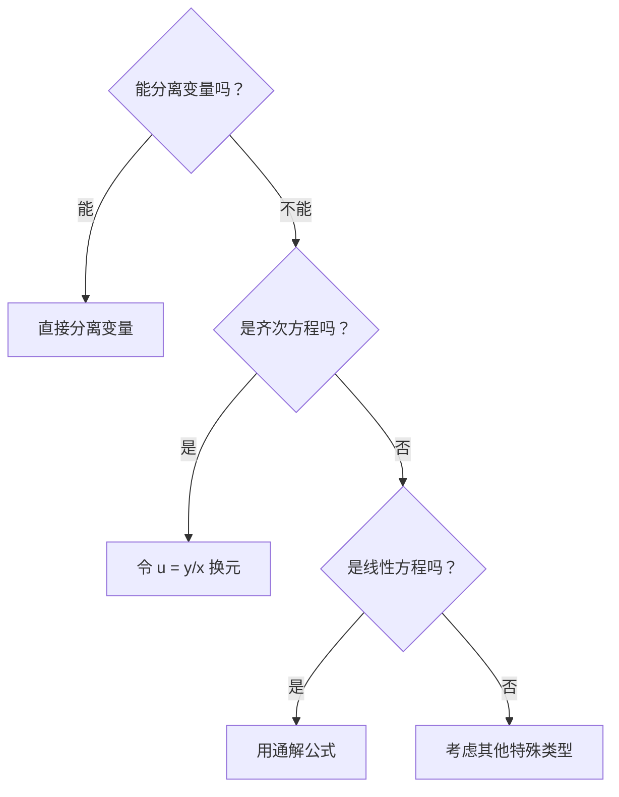

# 第 5 章：常微分方程

> 常微分方程是数二解答题的"固定节目"——几乎每年必出一道大题（10-12 分），且常与定积分应用、变限积分联合出题。好消息是：**题型极其固定**，本质上就是"识别方程类型 → 套对应解法"的算法化流程。把本章的几种方程类型和解法练到条件反射，这 10 分就是白送的。

**本章核心思维**：拿到一个微分方程，第一步永远是**分类**——它属于哪种类型？分类决定了你用哪种解法。不要拿到方程就盲目积分，先花 10 秒钟判断类型。

---

## 微分方程的基本概念

在正式解题之前，先统一几个术语。这些概念本身不考大题，但选择题、填空题会直接问。

### 核心定义

| 概念 | 定义 | 示例 |
|------|------|------|
| **阶** | 方程中出现的未知函数的最高阶导数的阶数 | $y'' + 3y' + 2y = 0$ 是**二阶**方程 |
| **线性** | 未知函数 $y$ 及其各阶导数都是一次的（不含 $y^2$ 、 $(y')^2$ 、 $yy'$ 等） | $y' + xy = e^x$ 是线性的； $y' + y^2 = 0$ 是非线性的 |
| **通解** | 含有与方程阶数相同个数的独立任意常数的解 | 二阶方程的通解含 2 个常数 $C_1, C_2$ |
| **特解** | 不含任意常数的解（由初值条件确定常数后得到） | 由 $y(0)=1, y'(0)=2$ 确定 $C_1, C_2$ |
| **初值条件** | 给定未知函数及其导数在某点的值 | $y(0) = 1$ ， $y'(0) = 0$ |

### 一个关键判断

> **怎么判断线性与非线性？** 把方程看成关于 $y, y', y'', \ldots$ 的"多项式"——如果每一项中 $y$ 及其导数的总次数都是 1，就是线性的。

- $y'' + (\sin x)y' + e^x y = x$ → **线性**（ $y'', y', y$ 都是一次的，系数可以是 $x$ 的任意函数）
- $y'' + yy' = 0$ → **非线性**（ $yy'$ 是二次的）
- $(y')^2 + y = 0$ → **非线性**（ $(y')^2$ 是二次的）

---

## 一阶微分方程

一阶方程是数二的基础题型，包括三种核心类型：**可分离变量方程**、**齐次方程**、**一阶线性方程**。拿到一阶方程，按以下顺序判断：



### 1. 可分离变量方程

#### 概念

形如

$$g(y)\,dy = f(x)\,dx$$

的方程，即含 $y$ 的项和含 $x$ 的项可以完全分到等号两边。

#### 解法（算法化步骤）

1. **分离变量**：把所有含 $y$ 的项移到左边（与 $dy$ 在一起），含 $x$ 的项移到右边（与 $dx$ 在一起）
2. **两边积分**： $\int g(y)\,dy = \int f(x)\,dx$
3. **写出通解**：注意只在一边加常数 $C$
4. **代入初值条件**（如果有）：确定 $C$ ，得到特解

#### 典型例题

**例 1**：求 $y' = \frac{x}{y}$ 的通解。

**解**：

分离变量：

$$y\,dy = x\,dx$$

两边积分：

$$\int y\,dy = \int x\,dx$$

$$\frac{y^2}{2} = \frac{x^2}{2} + C_1$$

整理（令 $C = 2C_1$ ）：

$$y^2 - x^2 = C$$

> ⚠️ **易错点**：分离变量时，如果 $g(y)$ 中有因子 $y$ （比如 $y\,dy = x\,dx$ 中除以了 $y$ ），需要单独检查 $y = 0$ 是否是解。本例中 $y = 0$ 代入原方程得 $0 = x$ ，不是恒等式，所以 $y = 0$ 不是解，不丢失。但如果方程是 $y' = xy$ ，分离变量时除以 $y$ ，而 $y = 0$ 确实是解——此时通解 $y = Ce^{x^2/2}$ 中令 $C = 0$ 恰好包含 $y = 0$ ，所以不丢失。**经验法则**：如果通解中的任意常数取某个值能覆盖被除掉的解，就不丢失；否则需要补上。

**例 2**：求 $y' = 1 + x + y + xy$ 的通解。

**解**：

观察右边： $1 + x + y + xy = (1+x)(1+y)$ ，可以分离变量！

$$\frac{dy}{1+y} = (1+x)\,dx$$

两边积分：

$$\ln\lvert 1+y\rvert = x + \frac{x^2}{2} + C_1$$

$$1+y = \pm e^{C_1} \cdot e^{x + x^2/2}$$

令 $C = \pm e^{C_1}$ （ $C \neq 0$ ），再注意 $y = -1$ 也是解（对应 $C = 0$ ），合并得：

$$y = Ce^{x + x^2/2} - 1, \quad C \in \mathbb{R}$$

> ⚠️ **易错点**：对 $\ln\lvert 1+y\rvert$ 去绝对值时， $\pm e^{C_1}$ 只能取非零值。要检查被分离掉的 $y = -1$ 是否是解，如果是，令 $C = 0$ 合并进通解。

#### 易错点汇总

- 分离变量后忘记积分，或两边都加常数（只需一边加 $C$ ）
- 除以含 $y$ 的因子时，忘记检查被除掉的常数解
- 积分后忘记加绝对值（如 $\int \frac{dy}{y} = \ln\lvert y\rvert$ ）

---

### 2. 一阶齐次方程

#### 概念

形如

$$\frac{dy}{dx} = \varphi\!\left(\frac{y}{x}\right)$$

的方程，即右边是 $\frac{y}{x}$ 的函数。

> **怎么识别？** 把方程整理成 $\frac{dy}{dx} = \frac{M(x,y)}{N(x,y)}$ 的形式，如果 $M$ 和 $N$ 都是 $x, y$ 的同次齐次函数（比如都是二次的），那它们的比值就是 $\frac{y}{x}$ 的函数。

#### 解法（算法化步骤）

1. **令 $u = \frac{y}{x}$** ，即 $y = ux$
2. **求导替换**： $y' = u + xu'$ （乘积求导法则）
3. **代入原方程**： $u + xu' = \varphi(u)$ ，整理得 $xu' = \varphi(u) - u$
4. **分离变量**： $\frac{du}{\varphi(u) - u} = \frac{dx}{x}$
5. **两边积分**，得到 $u$ 与 $x$ 的关系
6. **回代 $u = \frac{y}{x}$** ，得到原方程的通解

#### 典型例题

**例 3**：求 $xy' - y = \sqrt{x^2 + y^2}$ （ $x > 0$ ）的通解。

**解**：

整理： $y' = \frac{y + \sqrt{x^2+y^2}}{x} = \frac{y}{x} + \sqrt{1 + \left(\frac{y}{x}\right)^2}$

这是齐次方程， $\varphi(u) = u + \sqrt{1+u^2}$ 。

令 $u = \frac{y}{x}$ ， $y' = u + xu'$ ，代入：

$$u + xu' = u + \sqrt{1+u^2}$$

$$xu' = \sqrt{1+u^2}$$

分离变量：

$$\frac{du}{\sqrt{1+u^2}} = \frac{dx}{x}$$

两边积分（左边是标准积分公式）：

$$\ln\left(u + \sqrt{1+u^2}\right) = \ln x + \ln C_1 \quad (C_1 > 0)$$

$$u + \sqrt{1+u^2} = C_1 x \quad (C_1 > 0)$$

回代 $u = \frac{y}{x}$ ：

$$\frac{y}{x} + \sqrt{1 + \frac{y^2}{x^2}} = C_1 x$$

因为 $x > 0$ ， $\sqrt{1 + \frac{y^2}{x^2}} = \frac{\sqrt{x^2+y^2}}{x}$ ，所以：

$$\frac{y + \sqrt{x^2+y^2}}{x} = C_1 x$$

$$y + \sqrt{x^2+y^2} = C_1 x^2$$

令 $C = C_1$ （ $C > 0$ ），通解为：

$$y + \sqrt{x^2+y^2} = Cx^2, \quad C > 0$$

#### 易错点汇总

- 忘记 $y = ux$ 求导时要用乘积法则： $y' = u + xu'$ ，而不是 $y' = u'$
- 积分完成后忘记回代 $u = \frac{y}{x}$
- 对 $\sqrt{x^2+y^2}$ 的处理中忘记 $x > 0$ 或 $x < 0$ 的条件

---

### 3. 一阶线性微分方程（重点）

#### 概念

形如

$$y' + p(x)\,y = q(x)$$

的方程。其中 $p(x)$ 和 $q(x)$ 是 $x$ 的已知函数。

- 当 $q(x) \equiv 0$ 时，称为**一阶线性齐次方程**
- 当 $q(x) \not\equiv 0$ 时，称为**一阶线性非齐次方程**

> **识别技巧**：方程中 $y$ 和 $y'$ 都是一次的，且 $y'$ 的系数可以化为 1（除以系数后），就是线性方程。

#### 通解公式（必须背熟）

一阶线性方程 $y' + p(x)y = q(x)$ 的通解为：

$$\boxed{y = e^{-\int p(x)\,dx}\left[\int q(x)\,e^{\int p(x)\,dx}\,dx + C\right]}$$

这个公式**必须背到条件反射**。考场上没有时间推导，直接套。

#### 公式推导（理解记忆）

推导过程帮助你理解公式的结构，也帮助你万一忘了公式时现场推出来。

**第一步**：先解对应的齐次方程 $y' + p(x)y = 0$ 。

分离变量： $\frac{dy}{y} = -p(x)\,dx$ ，积分得：

$$y = Ce^{-\int p(x)\,dx}$$

**第二步**：用**常数变易法**——把齐次通解中的常数 $C$ 换成 $x$ 的函数 $u(x)$ ：

$$y = u(x)\,e^{-\int p(x)\,dx}$$

**第三步**：代入非齐次方程。求导：

$$y' = u'(x)\,e^{-\int p(x)\,dx} - u(x)\,p(x)\,e^{-\int p(x)\,dx}$$

代入 $y' + p(x)y = q(x)$ ：

$$u'(x)\,e^{-\int p(x)\,dx} - u(x)\,p(x)\,e^{-\int p(x)\,dx} + p(x)\,u(x)\,e^{-\int p(x)\,dx} = q(x)$$

后两项恰好抵消（这就是常数变易法的精妙之处）：

$$u'(x)\,e^{-\int p(x)\,dx} = q(x)$$

$$u'(x) = q(x)\,e^{\int p(x)\,dx}$$

积分：

$$u(x) = \int q(x)\,e^{\int p(x)\,dx}\,dx + C$$

代回即得通解公式。

#### 使用公式的算法化步骤

1. **化为标准形式**：确保 $y'$ 的系数为 1，写成 $y' + p(x)y = q(x)$
2. **识别 $p(x)$ 和 $q(x)$**
3. **计算 $\int p(x)\,dx$** （注意：这里不加常数！）
4. **计算 $e^{\int p(x)\,dx}$ 和 $e^{-\int p(x)\,dx}$**
5. **计算 $\int q(x)\,e^{\int p(x)\,dx}\,dx$** （这个积分也不加常数）
6. **套公式**，最后加 $C$

> ⚠️ **关键**：公式中的 $\int p(x)\,dx$ 和 $\int q(x)e^{\int p(x)\,dx}\,dx$ 都只取一个原函数，**不加常数**。常数 $C$ 只在最外层出现一次。

#### 典型例题

**例 4**：求 $y' + \frac{1}{x}y = x^2$ （ $x > 0$ ）的通解。

**解**：

标准形式已满足。 $p(x) = \frac{1}{x}$ ， $q(x) = x^2$ 。

$$\int p(x)\,dx = \int \frac{1}{x}\,dx = \ln x \quad (x > 0)$$

$$e^{\int p(x)\,dx} = e^{\ln x} = x, \quad e^{-\int p(x)\,dx} = \frac{1}{x}$$

$$\int q(x)\,e^{\int p(x)\,dx}\,dx = \int x^2 \cdot x\,dx = \int x^3\,dx = \frac{x^4}{4}$$

套公式：

$$y = \frac{1}{x}\left(\frac{x^4}{4} + C\right) = \frac{x^3}{4} + \frac{C}{x}$$

**例 5**：求 $y' - y\tan x = \sec x$ 的通解。

**解**：

$p(x) = -\tan x$ ， $q(x) = \sec x$ 。

$$\int p(x)\,dx = \int (-\tan x)\,dx = \ln\lvert\cos x\rvert$$

$$e^{\int p(x)\,dx} = \lvert\cos x\rvert, \quad e^{-\int p(x)\,dx} = \frac{1}{\lvert\cos x\rvert}$$

在 $\cos x > 0$ 的区间上（去掉绝对值不影响通解形式）：

$$\int q(x)\,e^{\int p(x)\,dx}\,dx = \int \sec x \cdot \cos x\,dx = \int 1\,dx = x$$

$$y = \frac{1}{\cos x}(x + C) = (x + C)\sec x$$

> ⚠️ **易错点**： $\int (-\tan x)\,dx = \ln\lvert\cos x\rvert$ ，不是 $-\ln\lvert\cos x\rvert$ ！因为 $\int \tan x\,dx = -\ln\lvert\cos x\rvert$ ，所以 $\int (-\tan x)\,dx = \ln\lvert\cos x\rvert$ 。符号搞反是最常见的错误。

**例 6**（交换自变量与因变量）：求 $(y^2 - 6x)y' + 2y = 0$ 的通解。

**解**：

这个方程如果看成 $y$ 是 $x$ 的函数，既不能分离变量，也不是线性的（有 $y^2 y'$ 项）。

**关键思路**：把 $x$ 看成 $y$ 的函数！由 $y' = \frac{dy}{dx}$ ，得 $\frac{dx}{dy} = \frac{1}{y'}$ 。

原方程改写：

$$(y^2 - 6x)\frac{dy}{dx} + 2y = 0$$

$$\frac{dx}{dy} = \frac{y^2 - 6x}{-2y} = -\frac{y}{2} + \frac{3x}{y}$$

$$\frac{dx}{dy} - \frac{3}{y}x = -\frac{y}{2}$$

这是关于 $x(y)$ 的一阶线性方程！ $p(y) = -\frac{3}{y}$ ， $q(y) = -\frac{y}{2}$ 。

$$\int p(y)\,dy = -3\ln\lvert y\rvert = \ln\lvert y\rvert^{-3}$$

$$e^{\int p(y)\,dy} = \lvert y\rvert^{-3}, \quad e^{-\int p(y)\,dy} = \lvert y\rvert^{3}$$

在 $y > 0$ 上：

$$\int q(y)\,e^{\int p(y)\,dy}\,dy = \int \left(-\frac{y}{2}\right) \cdot y^{-3}\,dy = -\frac{1}{2}\int y^{-2}\,dy = \frac{1}{2y}$$

$$x = y^3\left(\frac{1}{2y} + C\right) = \frac{y^2}{2} + Cy^3$$

> 💡 **技巧总结**：当方程对 $y(x)$ 不是线性的，但对 $x(y)$ 是线性的时，交换自变量和因变量。识别信号：方程中出现 $y^2$ 、 $y^3$ 等与 $y'$ 相乘的项。

#### 易错点汇总

- 没有把方程化为标准形式（ $y'$ 系数为 1）就直接套公式
- $\int p(x)\,dx$ 的符号搞错（特别是 $p(x)$ 本身带负号时）
- 公式中 $\int p(x)\,dx$ 加了常数 $C$ （不应该加， $C$ 只在最外层出现）
- 该交换自变量时没有意识到（看到 $y^2 y'$ 之类的项要警觉）

---

## 可降阶的高阶方程

### 概念

有些高阶方程不直接包含 $y$ （或不直接包含 $x$ ），可以通过换元降低阶数，化为一阶方程来解。数二主要考两种类型：

| 类型 | 形式 | 特征 |
|------|------|------|
| **缺 $y$ 型** | $y'' = f(x, y')$ | 方程中不出现 $y$ 本身 |
| **缺 $x$ 型** | $y'' = f(y, y')$ | 方程中不出现 $x$ 本身 |

### 类型一： $y'' = f(x, y')$ （缺 $y$ ）

#### 解法

令 $p = y'$ ，则 $y'' = p' = \frac{dp}{dx}$ ，原方程化为：

$$p' = f(x, p)$$

这是关于 $p(x)$ 的**一阶方程**！解出 $p$ 后，再积分一次： $y = \int p\,dx$ 。

#### 典型例题

**例 7**：求 $xy'' + y' = 0$ 的通解。

**解**：

方程中不含 $y$ ，属于缺 $y$ 型。令 $p = y'$ ， $y'' = p'$ ：

$$xp' + p = 0$$

$$\frac{dp}{p} = -\frac{dx}{x}$$

$$\ln\lvert p\rvert = -\ln\lvert x\rvert + \ln\lvert C_1\rvert$$

$$p = \frac{C_1}{x}$$

即 $y' = \frac{C_1}{x}$ ，再积分：

$$y = C_1 \ln\lvert x\rvert + C_2$$

> 注意：二阶方程的通解必须含**两个**独立常数。

### 类型二： $y'' = f(y, y')$ （缺 $x$ ）

#### 解法

令 $p = y'$ ，但此时把 $p$ 看成 $y$ 的函数： $p = p(y)$ 。

利用链式法则：

$$y'' = \frac{dp}{dx} = \frac{dp}{dy} \cdot \frac{dy}{dx} = p\frac{dp}{dy}$$

原方程化为：

$$p\frac{dp}{dy} = f(y, p)$$

这是关于 $p(y)$ 的**一阶方程**！解出 $p = p(y, C_1)$ 后，由 $\frac{dy}{dx} = p(y)$ 分离变量再积分。

#### 典型例题

**例 8**：求 $yy'' + (y')^2 = 0$ 的通解。

**解**：

方程中不含 $x$ ，属于缺 $x$ 型。令 $p = y'$ ， $y'' = p\frac{dp}{dy}$ ：

$$y \cdot p\frac{dp}{dy} + p^2 = 0$$

$$p\left(y\frac{dp}{dy} + p\right) = 0$$

**情况一**： $p = 0$ ，即 $y' = 0$ ， $y = C$ （常数解）。

**情况二**： $p \neq 0$ ，则：

$$y\frac{dp}{dy} + p = 0$$

$$\frac{dp}{p} = -\frac{dy}{y}$$

$$\ln\lvert p\rvert = -\ln\lvert y\rvert + \ln\lvert C_1\rvert$$

$$p = \frac{C_1}{y}$$

即 $\frac{dy}{dx} = \frac{C_1}{y}$ ，分离变量：

$$y\,dy = C_1\,dx$$

$$\frac{y^2}{2} = C_1 x + C_2'$$

$$y^2 = 2C_1 x + C_2$$

令 $A = 2C_1$ ， $B = C_2$ ，通解为 $y^2 = Ax + B$ 。当 $A = 0$ 时， $y^2 = B$ ，即 $y = \pm\sqrt{B}$ （常数），包含了情况一。

> ⚠️ **易错点**：缺 $x$ 型中， $y'' = p\frac{dp}{dy}$ ，不是 $y'' = \frac{dp}{dy}$ ！链式法则中的 $\frac{dy}{dx} = p$ 不能丢。

#### 易错点汇总

- 缺 $y$ 型和缺 $x$ 型的换元方式搞混（前者 $p = y'$ 是 $x$ 的函数，后者 $p = y'$ 是 $y$ 的函数）
- 缺 $x$ 型中忘记链式法则的 $p$ 因子
- 解完一阶方程后忘记第二次积分（二阶方程要积分两次）
- 通解中常数个数不对（ $n$ 阶方程必须有 $n$ 个独立常数）

---

## 二阶常系数线性方程（核心重点）

这是数二微分方程大题的**最高频考点**，必须练到滚瓜烂熟。分为齐次和非齐次两部分。

### 1. 二阶常系数齐次线性方程

#### 概念

形如

$$y'' + py' + qy = 0$$

其中 $p, q$ 是**常数**。

#### 特征方程法（算法化步骤）

1. **写出特征方程**： $r^2 + pr + q = 0$ （把 $y''$ 换成 $r^2$ ， $y'$ 换成 $r$ ， $y$ 换成 $1$ ）
2. **求特征根**：解一元二次方程， $r = \frac{-p \pm \sqrt{p^2 - 4q}}{2}$
3. **根据根的类型写通解**（见下表）

#### 三种根对应的通解（必须背熟）

| 特征根类型 | 条件 | 通解形式 |
|-----------|------|---------|
| **两个不等实根** $r_1 \neq r_2$ | $\Delta = p^2 - 4q > 0$ | $y = C_1 e^{r_1 x} + C_2 e^{r_2 x}$ |
| **二重实根** $r_1 = r_2 = r$ | $\Delta = 0$ | $y = (C_1 + C_2 x)e^{rx}$ |
| **共轭复根** $r = \alpha \pm \beta i$ | $\Delta < 0$ | $y = e^{\alpha x}(C_1 \cos\beta x + C_2 \sin\beta x)$ |

> **记忆口诀**：实根给指数，重根多乘 $x$ ，复根给振荡（ $e^{\alpha x}$ 控制衰减/增长， $\cos/\sin$ 控制振荡）。

#### 典型例题

**例 9**：求 $y'' - 5y' + 6y = 0$ 的通解。

**解**：

特征方程： $r^2 - 5r + 6 = 0$ ，即 $(r-2)(r-3) = 0$ 。

两个不等实根 $r_1 = 2$ ， $r_2 = 3$ 。

$$y = C_1 e^{2x} + C_2 e^{3x}$$

**例 10**：求 $y'' - 4y' + 4y = 0$ 的通解。

**解**：

特征方程： $r^2 - 4r + 4 = 0$ ，即 $(r-2)^2 = 0$ 。

二重实根 $r = 2$ 。

$$y = (C_1 + C_2 x)e^{2x}$$

> ⚠️ 重根时通解中必须有一个 $xe^{rx}$ 项，不能写成 $C_1 e^{2x} + C_2 e^{2x}$ （这不是两个独立解）。

**例 11**：求 $y'' + 2y' + 5y = 0$ 的通解。

**解**：

特征方程： $r^2 + 2r + 5 = 0$ 。

$$r = \frac{-2 \pm \sqrt{4-20}}{2} = \frac{-2 \pm 4i}{2} = -1 \pm 2i$$

共轭复根 $\alpha = -1$ ， $\beta = 2$ 。

$$y = e^{-x}(C_1 \cos 2x + C_2 \sin 2x)$$

---

### 2. 二阶常系数非齐次线性方程（重点中的重点）

#### 概念

形如

$$y'' + py' + qy = f(x)$$

其中 $p, q$ 是常数， $f(x) \not\equiv 0$ 。

#### 核心定理：解的结构

非齐次方程的通解 = 对应齐次方程的通解 + 非齐次方程的一个特解：

$$\boxed{y = Y(x) + y^*(x)}$$

其中 $Y(x)$ 是 $y'' + py' + qy = 0$ 的通解（含 $C_1, C_2$ ）， $y^*(x)$ 是 $y'' + py' + qy = f(x)$ 的任意一个特解（不含常数）。

> **解题策略**：先求齐次通解 $Y$ （特征方程法），再用待定系数法求特解 $y^*$ ，最后相加。

#### 待定系数法：特解设法的完整决策表

数二主要考 $f(x) = P_m(x)e^{\lambda x}$ 型（ $P_m(x)$ 是 $m$ 次多项式），偶尔也涉及 $f(x) = e^{\lambda x}\big[P_m(x)\cos\beta x + Q_n(x)\sin\beta x\big]$ 型（右端含三角函数）。先掌握多项式-指数型，三角函数型的特解设法为 $y^* = x^k e^{\lambda x}\big[R_l^{(1)}(x)\cos\beta x + R_l^{(2)}(x)\sin\beta x\big]$ （ $l = \max(m,n)$ ， $k$ 的取法同理）。

**多项式-指数型**的特解设法取决于 $\lambda$ 与特征根的关系：

| $f(x)$ 的形式 | $\lambda$ 与特征根的关系 | 特解设法 | 说明 |
|--------------|------------------------|---------|------|
| $P_m(x)e^{\lambda x}$ | $\lambda$ **不是**特征根 | $y^* = Q_m(x)e^{\lambda x}$ | $Q_m$ 是与 $P_m$ 同次的待定多项式 |
| $P_m(x)e^{\lambda x}$ | $\lambda$ 是**单**特征根 | $y^* = xQ_m(x)e^{\lambda x}$ | 多乘一个 $x$ |
| $P_m(x)e^{\lambda x}$ | $\lambda$ 是**重**特征根 | $y^* = x^2 Q_m(x)e^{\lambda x}$ | 多乘 $x^2$ |

其中 $Q_m(x) = a_0 x^m + a_1 x^{m-1} + \cdots + a_m$ ，系数 $a_0, a_1, \ldots, a_m$ 待定。

> **口诀**： $\lambda$ 不是根就不乘 $x$ ，是单根乘 $x$ ，是重根乘 $x^2$ 。乘的 $x$ 的幂次 = $\lambda$ 作为特征根的重数（0、1、2）。

#### 常见特殊情形

| $f(x)$ | 等价形式 | $\lambda$ | $P_m(x)$ 的次数 |
|--------|---------|-----------|----------------|
| $P_m(x)$ （纯多项式） | $P_m(x) \cdot e^{0 \cdot x}$ | $\lambda = 0$ | $m$ |
| $ae^{\lambda x}$ （纯指数） | $a \cdot e^{\lambda x}$ （ $a$ 是 0 次多项式） | $\lambda$ | $m = 0$ |
| $P_m(x)e^{\lambda x}$ | 一般形式 | $\lambda$ | $m$ |

> ⚠️ 当 $f(x)$ 是纯多项式（如 $f(x) = 3x + 1$ ）时， $\lambda = 0$ ！要检查 $r = 0$ 是否是特征根。

#### 算法化步骤（求特解）

1. **写出特征方程，求出特征根**
2. **识别 $f(x) = P_m(x)e^{\lambda x}$ 中的 $\lambda$ 和 $m$**
3. **判断 $\lambda$ 是特征根的几重根**（0 重 = 不是根，1 重 = 单根，2 重 = 重根）
4. **设出特解形式**： $y^* = x^k Q_m(x)e^{\lambda x}$ ， $k$ = 重数
5. **把 $y^*$ 、 $(y^*)'$ 、 $(y^*)''$ 代入原方程**
6. **比较同次幂系数**，解出 $Q_m$ 的各系数
7. **写出通解** $y = Y + y^*$

#### 典型例题

**例 12**（ $\lambda$ 非特征根）：求 $y'' - 3y' + 2y = xe^{3x}$ 的通解。

**解**：

**第一步**：求齐次通解。

特征方程： $r^2 - 3r + 2 = 0$ ， $(r-1)(r-2) = 0$ ， $r_1 = 1$ ， $r_2 = 2$ 。

$$Y = C_1 e^x + C_2 e^{2x}$$

**第二步**：求特解。

$f(x) = xe^{3x}$ ，所以 $\lambda = 3$ ， $P_m(x) = x$ （ $m = 1$ ）。

$\lambda = 3$ 不是特征根（特征根是 1 和 2），所以 $k = 0$ 。

设 $y^* = (ax + b)e^{3x}$ 。

求导：

$$(y^*)' = ae^{3x} + 3(ax+b)e^{3x} = (3ax + 3b + a)e^{3x}$$

$$(y^*)'' = 3ae^{3x} + 3(3ax+3b+a)e^{3x} = (9ax + 9b + 6a)e^{3x}$$

代入 $y'' - 3y' + 2y = xe^{3x}$ ：

$$(9ax + 9b + 6a)e^{3x} - 3(3ax + 3b + a)e^{3x} + 2(ax + b)e^{3x} = xe^{3x}$$

提取 $e^{3x}$ ，合并同类项：

$$[(9a - 9a + 2a)x + (9b + 6a - 9b - 3a + 2b)]e^{3x} = xe^{3x}$$

$$(2ax + 3a + 2b)e^{3x} = xe^{3x}$$

比较系数：

- $x$ 的系数： $2a = 1 \Rightarrow a = \frac{1}{2}$
- 常数项： $3a + 2b = 0 \Rightarrow b = -\frac{3}{4}$

$$y^* = \left(\frac{1}{2}x - \frac{3}{4}\right)e^{3x}$$

**第三步**：通解。

$$y = C_1 e^x + C_2 e^{2x} + \left(\frac{x}{2} - \frac{3}{4}\right)e^{3x}$$

**例 13**（ $\lambda$ 是重特征根）：求 $y'' - 2y' + y = e^x$ 的通解。

**解**：

特征方程： $r^2 - 2r + 1 = 0$ ， $(r-1)^2 = 0$ ， $r = 1$ （二重根）。

$$Y = (C_1 + C_2 x)e^x$$

$f(x) = e^x = 1 \cdot e^{1 \cdot x}$ ， $\lambda = 1$ ， $m = 0$ 。

$\lambda = 1$ 是**二重**特征根， $k = 2$ 。

设 $y^* = ax^2 e^x$ 。

求导：

$$(y^*)' = a(2x + x^2)e^x$$

$$(y^*)'' = a(2 + 4x + x^2)e^x$$

代入 $y'' - 2y' + y = e^x$ ：

$$a(2 + 4x + x^2)e^x - 2a(2x + x^2)e^x + ax^2 e^x = e^x$$

$$a(2 + 4x + x^2 - 4x - 2x^2 + x^2)e^x = e^x$$

$$2a \cdot e^x = e^x$$

$$a = \frac{1}{2}$$

$$y^* = \frac{x^2}{2}e^x$$

通解：

$$y = (C_1 + C_2 x)e^x + \frac{x^2}{2}e^x$$

> ⚠️ 本例中 $\lambda = 1$ 是**重**特征根，所以乘 $x^2$ 。如果只乘 $x$ （设 $y^* = axe^x$ ），代入后会发现方程左边恒为 0，无法匹配右边——这就是为什么必须乘正确的幂次。

**例 14**（ $f(x)$ 是纯多项式， $\lambda = 0$ ）：求 $y'' + y' = x$ 的通解。

**解**：

特征方程： $r^2 + r = 0$ ， $r(r+1) = 0$ ， $r_1 = 0$ ， $r_2 = -1$ 。

$$Y = C_1 + C_2 e^{-x}$$

$f(x) = x = x \cdot e^{0 \cdot x}$ ， $\lambda = 0$ ， $m = 1$ 。

$\lambda = 0$ 是**单**特征根， $k = 1$ 。

设 $y^* = x(ax + b) = ax^2 + bx$ 。

$$(y^*)' = 2ax + b, \quad (y^*)'' = 2a$$

代入 $y'' + y' = x$ ：

$$2a + 2ax + b = x$$

比较系数：

- $x$ ： $2a = 1 \Rightarrow a = \frac{1}{2}$
- 常数： $2a + b = 0 \Rightarrow b = -1$

$$y^* = \frac{x^2}{2} - x$$

通解：

$$y = C_1 + C_2 e^{-x} + \frac{x^2}{2} - x$$

> ⚠️ **高频陷阱**： $f(x) = x$ 时， $\lambda = 0$ ，不是"没有指数"就不用判断！ $r = 0$ 恰好是本题的单特征根，必须乘 $x$ 。如果不乘（设 $y^* = ax + b$ ），代入后 $y'' = 0$ ， $y' = a$ ，方程变成 $a = x$ ，矛盾。

#### 易错点汇总

- 忘记先求齐次通解就直接求特解
- $\lambda$ 的重数判断错误（特别是 $\lambda = 0$ 的情形）
- 设特解时 $Q_m(x)$ 的次数写错（ $P_m$ 是几次， $Q_m$ 就是几次，系数全部待定）
- 代入求导时计算错误（这是纯计算量问题，只能多练）
- 最终通解中忘记加齐次通解部分

---

## 微分方程的应用

应用题是数二大题的常见出题方式，通常给出一个几何或物理条件，要求你建立微分方程并求解。难点不在解方程（解法是固定的），而在**建模**——把文字条件翻译成方程。

### 建模的通用思路

```
第一步：确定未知函数（通常题目会暗示，如"求曲线 y = y(x)"）
第二步：把题目条件翻译成数学表达式
        - 几何条件 → 切线斜率 = y'，截距，面积，弧长等
        - 物理条件 → 变化率 = 导数，牛顿第二定律等
第三步：整理成标准微分方程形式
第四步：识别方程类型，选择解法
第五步：利用初始条件确定常数
```

### 常见几何条件的翻译

| 几何条件 | 数学表达 |
|---------|---------|
| 曲线在 $(x, y)$ 处的切线斜率为 $k$ | $y' = k$ （ $k$ 可能是 $x, y$ 的表达式） |
| 切线在 $x$ 轴上的截距为 $\frac{x}{2}$ | 切线方程 $Y - y = y'(X - x)$ ，令 $Y = 0$ 得 $X = x - \frac{y}{y'}$ ，所以 $x - \frac{y}{y'} = \frac{x}{2}$ |
| 切线在 $y$ 轴上的截距为 $\frac{y}{2}$ | 令 $X = 0$ 得 $Y = y - xy'$ ，所以 $y - xy' = \frac{y}{2}$ |
| 法线斜率为 $k$ | $-\frac{1}{y'} = k$ |
| 曲线过点 $(x_0, y_0)$ | 初值条件 $y(x_0) = y_0$ |
| 曲线与某直线相切 | 函数值相等 + 导数值相等 |

### 典型例题

**例 15（应用题——切线截距条件）**

**题目**：设曲线 $y = y(x)$ （ $x > 0$ ）过点 $(1, 0)$ ，且曲线上任一点 $(x, y)$ 处的切线在 $y$ 轴上的截距等于 $x^2$ 。求该曲线方程。

**分析**：切线在 $y$ 轴上的截距 = $y - xy'$ （切线方程 $Y - y = y'(X - x)$ ，令 $X = 0$ 得 $Y = y - xy'$ ）。条件给出 $y - xy' = x^2$ 。

**解**：

由截距条件：

$$y - xy' = x^2$$

整理为标准形式：

$$y' - \frac{1}{x}y = -x$$

这是一阶线性方程， $P(x) = -\frac{1}{x}$ ， $Q(x) = -x$ 。

$$\int P(x)\,dx = -\ln x$$

$$e^{\int P\,dx} = e^{-\ln x} = \frac{1}{x} \quad (x > 0)$$

$$\left(\frac{y}{x}\right)' = \frac{1}{x} \cdot (-x) = -1$$

$$\frac{y}{x} = -x + C$$

$$y = Cx - x^2$$

由 $y(1) = 0$ ： $0 = C - 1$ ，故 $C = 1$ 。

$$\boxed{y = x - x^2}$$

**关键**：切线截距条件的翻译是本题核心： $y$ 轴截距 = $y - xy'$ 。翻译后得到一阶线性方程，直接套公式。注意积分因子是 $e^{\int P\,dx}$ （不是 $e^{-\int P\,dx}$ ），且 $x > 0$ 时 $\ln|x| = \ln x$ 。

**例 16**（几何应用）：设曲线 $y = y(x)$ 过原点，且在任一点处的切线斜率等于该点横坐标与纵坐标之和。求曲线方程。

**解**：

**建模**：切线斜率 = $y'$ ，横坐标与纵坐标之和 = $x + y$ 。

$$y' = x + y$$

$$y' - y = x$$

这是**一阶线性方程**！ $p(x) = -1$ ， $q(x) = x$ 。

$$\int p(x)\,dx = -x$$

$$e^{\int p(x)\,dx} = e^{-x}, \quad e^{-\int p(x)\,dx} = e^x$$

$$\int q(x)\,e^{\int p(x)\,dx}\,dx = \int xe^{-x}\,dx = -(x+1)e^{-x}$$

（分部积分： $u = x$ ， $dv = e^{-x}dx$ ）

$$y = e^x\left[-(x+1)e^{-x} + C\right] = -(x+1) + Ce^x$$

代入 $y(0) = 0$ ： $0 = -1 + C$ ， $C = 1$ 。

$$y = e^x - x - 1$$

**例 17**（物理应用）：一物体从静止开始下落，受到的阻力与速度成正比（比例系数为 $k$ ），重力加速度为 $g$ 。求速度 $v(t)$ 。

**解**：

**建模**：由牛顿第二定律（设质量为 $m$ ）：

$$m\frac{dv}{dt} = mg - kv$$

$$\frac{dv}{dt} + \frac{k}{m}v = g$$

一阶线性方程！ $p(t) = \frac{k}{m}$ ， $q(t) = g$ 。

$$\int p(t)\,dt = \frac{k}{m}t$$

$$v = e^{-kt/m}\left[\int g \cdot e^{kt/m}\,dt + C\right] = e^{-kt/m}\left[\frac{mg}{k}e^{kt/m} + C\right]$$

$$v = \frac{mg}{k} + Ce^{-kt/m}$$

初值条件： $v(0) = 0$ （从静止开始）：

$$0 = \frac{mg}{k} + C \Rightarrow C = -\frac{mg}{k}$$

$$v = \frac{mg}{k}\left(1 - e^{-kt/m}\right)$$

> 物理意义：当 $t \to \infty$ 时， $v \to \frac{mg}{k}$ （终端速度），符合物理直觉。

#### 易错点汇总

- 切线截距公式记错：切线 $Y - y = y'(X - x)$ ， $x$ 轴截距令 $Y = 0$ ， $y$ 轴截距令 $X = 0$
- 建模后没有识别方程类型，盲目求解
- 忘记代入初始条件（题目说"过某点"、"从静止开始"等都是初值条件）
- 物理题中搞错正方向（重力、阻力的符号）

### 跨章综合例题

> 微分方程常与定积分应用、变限积分联合出题。以下例题模拟真实考场的跨章组合。

**例 18（微分方程 + 旋转体体积）**

**题目**：设曲线 $y = y(x)$ 过原点，且在点 $(x, y)$ 处的切线斜率为 $y + e^x$ 。求该曲线与 $x$ 轴、直线 $x = 1$ 所围图形绕 $x$ 轴旋转一周所得旋转体的体积。

**分析**：先解微分方程 $y' = y + e^x$ （一阶线性），再用圆盘法 $V = \pi\int_0^1 y^2\,dx$ 求体积。

**解**：

**第一步：解微分方程。**

$y' - y = e^x$ ， $P(x) = -1$ ， $Q(x) = e^x$ 。

$$\int P\,dx = -x, \quad e^{\int P\,dx} = e^{-x} \text{（积分因子）}$$

$$(e^{-x} y)' = e^{-x} \cdot e^x = 1$$

$$e^{-x} y = x + C$$

$$y = (x+C)e^x$$

由 $y(0) = 0$ ： $0 = C$ ，故 $C = 0$ 。

$$y = xe^x$$

**第二步：求旋转体体积。**

$$V = \pi\int_0^1 y^2\,dx = \pi\int_0^1 x^2 e^{2x}\,dx$$

两次分部积分（ $\int x^2 e^{2x}\,dx = \frac{e^{2x}}{4}(2x^2 - 2x + 1) + C$ ）：

$$V = \pi\left[\frac{e^{2x}}{4}(2x^2 - 2x + 1)\right]_0^1 = \pi\left(\frac{e^2}{4} - \frac{1}{4}\right) = \frac{\pi(e^2 - 1)}{4}$$

**关键**：本题是"微分方程 + 旋转体体积"的经典组合。第一步解方程得 $y = xe^x$ ，第二步圆盘法求 $\pi\int_0^1 x^2 e^{2x}\,dx$ （两次分部积分）。注意积分因子是 $e^{\int P\,dx}$ （不是 $e^{-\int P\,dx}$ ），符号写反会导致全题皆错。

---

## 本章小结

### 解题总流程

拿到任何微分方程题，按以下流程走：

```
1. 判断阶数（一阶？二阶？）
2. 判断类型：
   一阶 → 可分离变量？齐次？线性？
   二阶 → 可降阶（缺 y 或缺 x）？常系数线性？
3. 选择对应解法
4. 求解（注意初值条件）
5. 验证（把解代回原方程，考场时间够的话一定要验）
```

### 方程类型 → 解法 快速查找表

| 方程类型 | 识别特征 | 解法 | 关键公式/步骤 |
|---------|---------|------|-------------|
| 可分离变量 | $g(y)\,dy = f(x)\,dx$ | 两边积分 | $\int g(y)\,dy = \int f(x)\,dx + C$ |
| 一阶齐次 | $y' = \varphi(y/x)$ | 令 $u = y/x$ | $y' = u + xu'$ ，化为可分离变量 |
| 一阶线性 | $y' + p(x)y = q(x)$ | 通解公式 | $y = e^{-\int p\,dx}\left[\int q\,e^{\int p\,dx}\,dx + C\right]$ |
| 缺 $y$ 型 | $y'' = f(x, y')$ ，无 $y$ | 令 $p = y'$ （ $p$ 是 $x$ 的函数） | 化为一阶方程，解两次积分 |
| 缺 $x$ 型 | $y'' = f(y, y')$ ，无 $x$ | 令 $p = y'$ （ $p$ 是 $y$ 的函数） | $y'' = p\frac{dp}{dy}$ ，化为一阶方程 |
| 二阶常系数齐次 | $y'' + py' + qy = 0$ （ $p, q$ 常数） | 特征方程法 | $r^2 + pr + q = 0$ ，按根的类型写通解 |
| 二阶常系数非齐次 | $y'' + py' + qy = f(x)$ | 齐次通解 + 待定系数特解 | $y = Y + y^*$ ，特解乘 $x^k$ （ $k$ = $\lambda$ 的重数） |

### 特解设法速记

$$f(x) = P_m(x)e^{\lambda x} \quad \Longrightarrow \quad y^* = x^k Q_m(x)e^{\lambda x}$$

- $k = 0$ ： $\lambda$ 不是特征根
- $k = 1$ ： $\lambda$ 是单特征根
- $k = 2$ ： $\lambda$ 是重特征根

### 考场时间分配建议

- 识别方程类型：10 秒
- 一阶方程求解：3-5 分钟
- 二阶常系数方程求解：5-8 分钟
- 应用题建模 + 求解：8-12 分钟
- 验证：1-2 分钟

> 微分方程大题是数二中**性价比最高**的题目之一——题型固定、解法机械、计算量可控。把本章的例题全部独立做一遍（不是看一遍），考场上这 10 分就是稳拿的。
