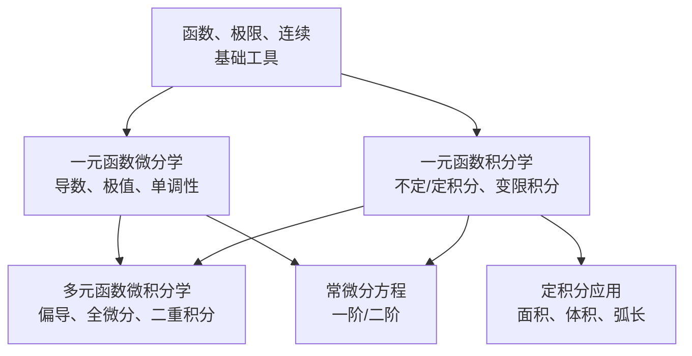

# 高等数学（微积分）学习大纲

> 面向 **考研数学二** 的高等数学学习路径。数二高等数学约占 80%（约 120 分），是复习的绝对主体。

---

## 📌 元信息

| 项目 | 说明 |
|------|------|
| **考试定位** | 考研数学二，高等数学约占 80%（约 120 分） |
| **分值分布** | 整卷结构：选择题 10×5=50 分 + 填空题 6×5=30 分 + 解答题 6 题共 70 分；高数部分约 120 分（各题型内的高数分值为按占比估算） |
| **大纲依据** | 全国硕士研究生招生考试数学考试大纲（2021 年试卷结构改革后口径） |
| **核心能力** | 计算能力（求极限、求积分、解微分方程）> 证明能力 |
| **学习周期** | 约 8-10 周（基础阶段） |
| **教材推荐** | 同济大学《高等数学》第七版 / 汤家凤《高等数学辅导讲义》 |
| **数二特有** | ⚠️ 不考空间解析几何与向量代数、三重积分、曲线曲面积分、无穷级数、概率统计 |

---

## 🧠 知识体系总览

> ⚠️ **大题组合模式**：数二解答题常跨章联合出题——"微分方程 + 定积分应用"、"变限积分 + 中值定理证明"、"二重积分 + 极坐标换元"是三种固定搭配，复习时需刻意练习跨章综合题。

**数二考试结构**（按分值排序）：
1. **一元函数积分学** — 分值最高，大题主力
2. **一元函数微分学** — 选择填空多，大题常与积分结合
3. **多元函数微积分学** — 二重积分必考大题
4. **常微分方程** — 一道大题，常与积分结合
5. **函数、极限、连续** — 贯穿所有章节的基础

---

## 📚 学习内容

### 第 1 章：函数、极限、连续

| 知识点 | 要求 | 说明 |
|--------|------|------|
| 函数的概念与性质 | **掌握** | 奇偶性、周期性、有界性 |
| 反函数、复合函数、初等函数 | **掌握** | 分段函数要特别注意 |
| 极限的定义与性质 | 理解 | $\epsilon-\delta$ 语言了解即可，重应用 |
| 极限运算法则 | **掌握** | 四则运算、复合运算极限 |
| 数列极限与极限存在准则 | **掌握** | 夹逼准则（$n$ 项和放缩）、单调有界准则（递推数列） |
| 两个重要极限 | **掌握** | $\lim_{x \to 0} \frac{\sin x}{x}=1$ 、 $\lim_{x \to \infty}(1+\frac{1}{x})^x = e$ |
| 无穷小与无穷大 | **掌握** | 无穷小的比较（高阶/低阶/同阶/等价） |
| 等价无穷小替换 | **掌握** | $x \to 0$ 时 $\sin x \sim x$ 、 $\ln(1+x) \sim x$ 、 $e^x-1 \sim x$ 等 |
| 洛必达法则 | **掌握** | $\frac{0}{0}$ 和 $\frac{\infty}{\infty}$ 时的极限 |
| 函数的连续性与间断点 | **掌握** | 第一类（可去/跳跃）、第二类（无穷/振荡） |
| 闭区间上连续函数的性质 | **掌握** | 最值定理、介值定理、零点定理 |

**极限计算是数二的基本功**：一张试卷至少有 5-8 处涉及极限计算。

### 第 2 章：一元函数微分学

| 知识点 | 要求 | 说明 |
|--------|------|------|
| 导数的定义与几何意义 | **掌握** | 切线斜率、瞬时变化率 |
| 基本求导公式 | **掌握** | 幂/指/对/三角/反三角 |
| 求导法则 | **掌握** | 四则运算、链式法则、隐函数求导、参数方程求导 |
| 高阶导数 | 掌握 | 莱布尼茨公式 |
| 微分 | 理解 | $dy = f'(x)dx$ |
| 微分中值定理 | **掌握** | 罗尔、拉格朗日、柯西中值定理 |
| 泰勒公式 | **掌握** | 麦克劳林展开（ $e^x$ 、 $\sin x$ 、 $\ln(1+x)$ ） |
| 函数的单调性与极值 | **掌握** | 一阶导数判单调、二阶导数判凹凸 |
| 函数的凹凸性与拐点 | **掌握** | $f''(x) > 0$ 凹（下凸） |
| 渐近线 | 掌握 | 水平、铅直、斜渐近线 |
| 函数作图 | 掌握 | 单调 + 凹凸 + 渐近线综合 |
| 曲率与曲率半径 | 了解 | 数二大纲有，低频 |
| 罗尔/拉格朗日/柯西证明题 | **掌握** | 构造辅助函数是难点 |

**高频题型**：
- 求切线/法线方程
- 利用单调性证明不等式
- 中值定理构造辅助函数证明
- 求函数的极值与最值

### 第 3 章：一元函数积分学

| 知识点 | 要求 | 说明 |
|--------|------|------|
| 原函数与不定积分的概念 | **掌握** | 积分是微分的逆运算 |
| 基本积分公式 | **掌握** | 20 个左右基本公式需熟练 |
| 换元积分法 | **掌握** | 第一类（凑微分）、第二类（代换） |
| 分部积分法 | **掌握** | $\int u dv = uv - \int v du$ |
| 有理函数的积分 | **掌握** | 部分分式分解 |
| 三角函数的积分 | **掌握** | 万能代换、积化和差 |
| 定积分的定义与性质 | **掌握** | 黎曼和的极限、可积条件 |
| 牛顿-莱布尼茨公式 | **掌握** | 定积分 = 原函数差值 |
| 定积分的换元与分部 | **掌握** | 换元要换限 |
| 变限积分函数 | **掌握** | $\frac{d}{dx}\int_a^x f(t)dt = f(x)$ ，复合形式求导 |
| 积分中值定理 | **掌握** | $\int_a^b f(x)dx = f(\xi)(b-a)$ ，证明题常用 |
| 反常积分 | 掌握 | 无穷限、无界函数（瑕积分） |
| 定积分的应用 | **掌握** | 面积、旋转体体积、弧长、旋转体侧面积、物理应用（功、水压力、质心/形心、平均值——数二特有） |

**常考的不定积分技巧**：
- $e^x$ 与三角函数的组合（循环分部）
- 被积函数含 $\sqrt{x^2 \pm a^2}$ 时的三角代换
- 有理函数的拆项积分

**变限积分（数二超高频考点）**：
- 求导： $\frac{d}{dx}\int_{\varphi(x)}^{\psi(x)} f(t)dt = f(\psi(x))\psi'(x) - f(\varphi(x))\varphi'(x)$
- 常与洛必达法则结合求极限（ $\frac{0}{0}$ 型）
- 常与中值定理结合出证明题

**定积分应用（数二大题常考点）**：
- 平面图形面积（直角坐标、极坐标）
- 旋转体体积（绕 $x$ 轴、绕 $y$ 轴、柱壳法）
- 平面曲线的弧长
- 旋转体的侧面积

### 第 4 章：多元函数微积分学

| 知识点 | 要求 | 说明 |
|--------|------|------|
| 多元函数的概念与极限 | 理解 | 重极限的路径相关性 |
| 偏导数 | **掌握** | 定义与计算（固定其他变量） |
| 全微分 | **掌握** | $dz = \frac{\partial z}{\partial x}dx + \frac{\partial z}{\partial y}dy$ |
| 复合函数的偏导数 | **掌握** | 链式法则 |
| 隐函数的偏导数 | **掌握** | 公式法与直接求导法 |
| 二阶偏导数 | **掌握** | $\frac{\partial^2 z}{\partial x \partial y}$ 顺序无关性 |
| 多元函数的极值 | **掌握** | 无条件极值（ $AC-B^2$ 判别法）、条件极值（拉格朗日乘数法） |
| 二重积分的概念与性质 | **掌握** | 曲顶柱体体积 |
| 直角坐标下的二重积分 | **掌握** | 先对 $x$ 还是先对 $y$ 积分、交换积分次序 |
| 极坐标下的二重积分 | **掌握** | 圆域/环域首选极坐标 |
| 二重积分的应用 | 掌握 | 求面积、体积 |

**二重积分是数二必考大题**，需要熟练掌握：
- 交换积分次序（选择/填空）
- 直角坐标与极坐标的互换
- 利用对称性化简（奇偶性、轮换对称性）

### 第 5 章：常微分方程

| 知识点 | 要求 | 说明 |
|--------|------|------|
| 微分方程的基本概念 | 理解 | 阶、通解、特解、初值条件 |
| 一阶可分离变量方程 | **掌握** | $g(y)dy = f(x)dx$ |
| 一阶齐次方程 | 掌握 | $\frac{dy}{dx} = \varphi(\frac{y}{x})$ |
| 一阶线性微分方程 | **掌握** | $y' + p(x)y = q(x)$ 的通解公式 |
| 可降阶的高阶方程 | 掌握 | $y^{(n)} = f(x)$ 型、缺 $y$ 型、缺 $x$ 型 |
| 二阶常系数齐次线性方程 | **掌握** | 特征方程法 |
| 二阶常系数非齐次线性方程 | **掌握** | 待定系数法设特解形式 |
| 微分方程的应用（几何/物理） | 掌握 | 已知切线斜率、变化率建立方程 |

**特解设法口诀（数二必考）**：

| $f(x)$ 形式 | 特解设法 |
|------------|---------|
| $P_m(x)e^{\lambda x}$ ， $\lambda$ **非**特征根 | $Q_m(x)e^{\lambda x}$ |
| $P_m(x)e^{\lambda x}$ ， $\lambda$ 是**单**特征根 | $x Q_m(x)e^{\lambda x}$ |
| $P_m(x)e^{\lambda x}$ ， $\lambda$ 是**重**特征根 | $x^2 Q_m(x)e^{\lambda x}$ |

## 🧮 常用公式速查

### 等价无穷小（ $x \to 0$ ）

| 公式 | |
|------|--|
| $\sin x \sim x$ | $\tan x \sim x$ |
| $\arcsin x \sim x$ | $\arctan x \sim x$ |
| $\ln(1+x) \sim x$ | $e^x - 1 \sim x$ |
| $a^x - 1 \sim x\ln a$ | $(1+x)^\alpha - 1 \sim \alpha x$ |
| $1 - \cos x \sim \frac{1}{2}x^2$ | $x - \sin x \sim \frac{1}{6}x^3$ |

### 常用麦克劳林展开

| 展开 | |
|------|--|
| $e^x = 1 + x + \frac{x^2}{2!} + \frac{x^3}{3!} + \cdots$ | |
| $\sin x = x - \frac{x^3}{3!} + \frac{x^5}{5!} - \cdots$ | |
| $\cos x = 1 - \frac{x^2}{2!} + \frac{x^4}{4!} - \cdots$ | |
| $\ln(1+x) = x - \frac{x^2}{2} + \frac{x^3}{3} - \cdots$ | |
| $\frac{1}{1-x} = 1 + x + x^2 + x^3 + \cdots$ | |

### 基本积分公式

| 积分 | 结果 |
|------|------|
| $\int x^\alpha dx$ | $\frac{x^{\alpha+1}}{\alpha+1} + C$ |
| $\int \frac{1}{x} dx$ | $\ln \|x\| + C$ |
| $\int e^x dx$ | $e^x + C$ |
| $\int \sin x dx$ | $-\cos x + C$ |
| $\int \cos x dx$ | $\sin x + C$ |
| $\int \frac{1}{1+x^2} dx$ | $\arctan x + C$ |
| $\int \frac{1}{\sqrt{1-x^2}} dx$ | $\arcsin x + C$ |
| $\int \tan x dx$ | $-\ln \|\cos x\| + C$ |
| $\int \sec^2 x dx$ | $\tan x + C$ |

---

## ✅ 基础阶段验收清单

- [ ] 能在 2 分钟内用等价无穷小/洛必达/泰勒展开求极限，正确率 > 90%
- [ ] 能用夹逼准则或单调有界准则求 $n$ 项和、递推数列的极限
- [ ] 熟练掌握基本求导公式，3 分钟内完成复合函数/隐函数求导
- [ ] 能正确对变限积分函数求导（含复合上下限），并用于求极限
- [ ] 能应用中值定理（罗尔、拉格朗日）完成证明题，会构造辅助函数
- [ ] 能在 5 分钟内完成不定积分（换元 + 分部），正确率 > 85%
- [ ] 能计算定积分并应用于面积、旋转体体积（8 分钟内完成一道应用题）
- [ ] 会用微元法处理物理应用（变力做功、水压力、形心、平均值）
- [ ] 能在 10 分钟内完成二重积分（含交换次序、极坐标变换、对称性化简）
- [ ] 能解一阶线性微分方程和二阶常系数线性微分方程（5 分钟内）
- [ ] 能独立完成一道跨章综合大题（如"微分方程 + 定积分应用"，15 分钟内）

---

## 🔗 关联模块

- [linear-algebra/](../linear-algebra/readme.md) — 线性代数（数二另一半，约占 20%）
- probability-statistics/ — 概率论与统计（数二不考，目录暂未创建）
- discrete-mathematics/ — 离散数学（目录暂未创建）
