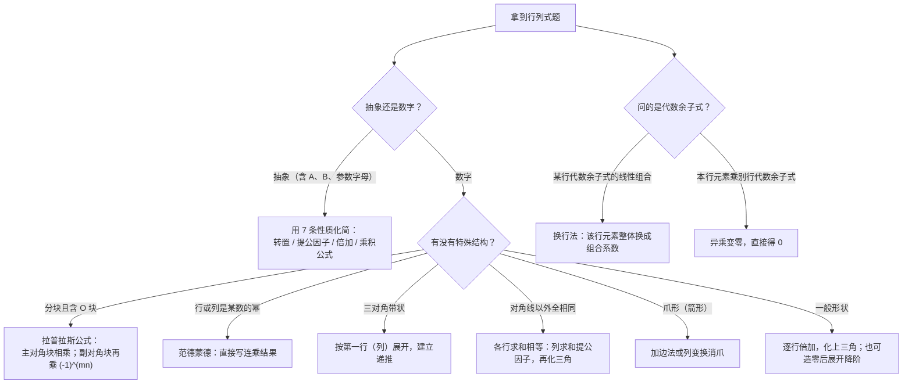

# 第 1 章：行列式

> 行列式是整本线性代数的"计算工具"——它很少单独出大题，但后面每一章都离不开它：求特征值要解特征方程 $|\lambda E - A| = 0$ ，判断矩阵可逆要算 $|A| \ne 0$ ，克莱姆法则用行列式解方程组，分块矩阵也常要算分块行列式。数二对本章的直接考查以**选择、填空**为主，核心要求是：**算得快、算得对**。

**本章学习目标**：

- 熟练运用行列式的 7 条性质，化简并计算数字型与抽象型行列式；
- 掌握按行（列）展开定理，会用"异乘变零"与"换行法"快速解决代数余子式求和问题；
- 掌握五种计算方法（化上三角、加边法、范德蒙德、递推法、分块行列式），做到 4 阶行列式 3 分钟内解决。

先明确一个观念：**行列式的本质是一个数**——矩阵是一张"表"，而行列式是按固定规则从这张表算出的一个数值。正因为它是一个数，才能充当"可逆与否""方程组解是否唯一"的判据。

---

## 1.1 二阶、三阶与 n 阶行列式

### 二阶与三阶：对角线法则

**二阶行列式**就是"主对角线之积减去副对角线之积"：

$$
\begin{vmatrix} a & b \\ c & d \end{vmatrix} = ad - bc
$$

**三阶行列式**共有 $3! = 6$ 项，3 正 3 负：主对角线方向（ $\backslash$ ）的三条"斜线乘积"取正，副对角线方向（ $/$ ）的三条取负：

$$
\begin{vmatrix} a_{11} & a_{12} & a_{13} \\ a_{21} & a_{22} & a_{23} \\ a_{31} & a_{32} & a_{33} \end{vmatrix} = a_{11}a_{22}a_{33} + a_{12}a_{23}a_{31} + a_{13}a_{21}a_{32} - a_{13}a_{22}a_{31} - a_{12}a_{21}a_{33} - a_{11}a_{23}a_{32}
$$

取正的三项是：主对角线 $a_{11}a_{22}a_{33}$ ，以及"右上方两个元素与左下角元素"的乘积 $a_{12}a_{23}a_{31}$ 、 $a_{13}a_{21}a_{32}$ ；取负的三项与它们关于主对角线"镜像对称"。记忆时抓住"每项是**不同行不同列**三个元素之积"即可。

> ⚠️ **对角线法则只对二阶、三阶成立**。四阶及以上没有对角线法则，必须用性质化简或按行（列）展开——这是初学者最常踩的坑之一。

### n 阶行列式（逆序数定义，了解即可）

$n$ 阶行列式的严格定义用**逆序数**表述。把 $1, 2, \cdots, n$ 的任一排列记为 $p_1 p_2 \cdots p_n$ ，统计每个数"后面比它小的数的个数"，总和称为该排列的**逆序数** $\tau$ ；逆序数为奇数的排列叫奇排列，为偶数叫偶排列。则

$$
D = \sum_{p_1 p_2 \cdots p_n} (-1)^{\tau(p_1 p_2 \cdots p_n)}\, a_{1p_1} a_{2p_2} \cdots a_{np_n}
$$

即：对所有"不同行不同列"的 $n$ 元乘积求和，奇排列带负号、偶排列带正号，共 $n!$ 项。

逆序数的算法只需会小案例：排列 $32514$ 中， $3$ 后面比它小的有 $2, 1$ 共 2 个； $2$ 后面有 $1$ 共 1 个； $5$ 后面有 $1, 4$ 共 2 个； $1$ 与 $4$ 后面没有更小的。合计 $\tau(32514) = 5$ ，是奇排列。

> 💡 数二对 n 阶定义的要求是"**了解即可**"，考试几乎不直接考定义本身（ $n!$ 项没法硬算），重点是后面的**性质**与**展开定理**。

### 余子式与代数余子式

在 $n$ 阶行列式中，**划去**元素 $a_{ij}$ 所在的第 $i$ 行、第 $j$ 列，剩下的 $n-1$ 阶行列式称为 $a_{ij}$ 的**余子式**，记作 $M_{ij}$ ；再带上符号因子，称为**代数余子式**：

$$
A_{ij} = (-1)^{i+j} M_{ij}
$$

符号因子只看**位置**的行号、列号之和的奇偶： $i + j$ 为偶数取正，为奇数取负。例如位置 $(2, 3)$ 处 $2 + 3 = 5$ 为奇数，取负号。

> 💡 关键性质： $M_{ij}$ 与 $A_{ij}$ 只取决于**划去后剩下的位置**，与 $a_{ij}$ 本身的数值**无关**。正因为如此，才有后面 1.3 节的"换行法"——把一整行元素换掉，该行各代数余子式保持不变。

**例 1**（对角线法则、余子式与代数余子式）：计算 $D = \begin{vmatrix} 1 & 2 & 3 \\ 4 & 5 & 6 \\ 7 & 8 & 10 \end{vmatrix}$ ，并求 $M_{23}$ 与 $A_{23}$ 。

**解**：按对角线法则展开：

$$
D = 1 \cdot 5 \cdot 10 + 2 \cdot 6 \cdot 7 + 3 \cdot 4 \cdot 8 - 3 \cdot 5 \cdot 7 - 2 \cdot 4 \cdot 10 - 1 \cdot 6 \cdot 8
$$

$$
= 50 + 84 + 96 - 105 - 80 - 48 = 230 - 233 = -3
$$

求 $M_{23}$ ：划去第 2 行、第 3 列，得

$$
M_{23} = \begin{vmatrix} 1 & 2 \\ 7 & 8 \end{vmatrix} = 8 - 14 = -6
$$

再由定义（ $2 + 3 = 5$ 为奇数，取负号）：

$$
A_{23} = (-1)^{2+3} M_{23} = -(-6) = 6
$$

> 💡 **验算**：按第 1 行展开， $A_{11} = \begin{vmatrix} 5 & 6 \\ 8 & 10 \end{vmatrix} = 2$ ， $A_{12} = -\begin{vmatrix} 4 & 6 \\ 7 & 10 \end{vmatrix} = 2$ ， $A_{13} = \begin{vmatrix} 4 & 5 \\ 7 & 8 \end{vmatrix} = -3$ ，则 $D = 1 \times 2 + 2 \times 2 + 3 \times (-3) = 2 + 4 - 9 = -3$ ，与对角线法则一致。

---

## 1.2 行列式的性质

性质是本章的灵魂——**抽象行列式的题全部靠性质，数字行列式的化简也靠性质**。设 $A$ 、 $B$ 均为 $n$ 阶方阵，逐条列出并配一个最小数值演示。

**性质 1（转置不变）**： $|A^T| = |A|$ 。它保证"行"具有的性质"列"全都有，下面对行说的每一条对列同样成立。
演示： $A = \begin{pmatrix} 1 & 2 \\ 3 & 4 \end{pmatrix}$ ， $|A| = -2$ ； $A^T = \begin{pmatrix} 1 & 3 \\ 2 & 4 \end{pmatrix}$ ， $|A^T| = 4 - 6 = -2$ ，相等。

**性质 2（换行变号）**：互换行列式的两行（列），行列式变号。
推论：若有两行相同，则 $D = -D$ ，故 $D = 0$ 。
演示： $\begin{vmatrix} 1 & 2 \\ 3 & 4 \end{vmatrix} = -2$ ；交换两行得 $\begin{vmatrix} 3 & 4 \\ 1 & 2 \end{vmatrix} = 6 - 4 = 2$ ，恰好变号。

**性质 3（提公因子）**：某一行的公因子可以提到行列式记号外面。对**整个矩阵**数乘相当于每行各提出一个 $k$ ，共提 $n$ 次：

$$
|kA| = k^n |A|
$$

特别地， $|-A| = (-1)^n |A|$ 。
演示：3 阶单位阵 $|E_3| = 1$ ，整体乘 2 后每行提出一个 2 ， $|2E_3| = 2^3 = 8$ 。

**性质 4（相同或成比例为零）**：两行相同**或对应成比例**，则行列式为 $0$ 。
演示： $\begin{vmatrix} 1 & 2 & 3 \\ 2 & 4 & 6 \\ 1 & 1 & 1 \end{vmatrix} = 0$ ，因为第 2 行是第 1 行的 2 倍。

**性质 5（倍加不变）**：把某一行加上另一行的 $k$ 倍，行列式不变。这是**计算数字行列式的主力工具**——消元全靠它，而且不改变值。
演示： $\begin{vmatrix} 1 & 2 \\ 3 & 4 \end{vmatrix} = -2$ ；把第 2 行加上第 1 行的 2 倍得 $\begin{vmatrix} 1 & 2 \\ 5 & 8 \end{vmatrix} = 8 - 10 = -2$ ，值不变。

**性质 6（单行可拆）**：若某一行的元素都是两数之和，则行列式可拆成两个行列式之和——**只拆这一行，其余各行原样保留**。
演示： $\begin{vmatrix} 1 + 2 & 0 + 4 \\ 3 & 4 \end{vmatrix} = \begin{vmatrix} 1 & 0 \\ 3 & 4 \end{vmatrix} + \begin{vmatrix} 2 & 4 \\ 3 & 4 \end{vmatrix} = 4 + (-4) = 0$ ，左边 $\begin{vmatrix} 3 & 4 \\ 3 & 4 \end{vmatrix} = 0$ ，一致。

**性质 7（乘积公式）**：

$$
|AB| = |A| \cdot |B|
$$

推论： $|A^m| = |A|^m$ ；且 $|A| \ne 0 \iff A$ 可逆（第 2 章展开）。
演示： $A = \mathrm{diag}(1, 2)$ ， $B = \mathrm{diag}(3, 4)$ ，则 $AB = \mathrm{diag}(3, 8)$ ， $|AB| = 24 = |A| \cdot |B| = 2 \times 12$ ，成立。

> ⚠️ **高频易错**： $|A + B| \ne |A| + |B|$ ！行列式没有"和的公式"。反例： $A = B = E_2$ 时， $|A + B| = |2E_2| = 4$ ，而 $|A| + |B| = 2$ 。

**例 2**（抽象行列式）：设 $A$ 、 $B$ 均为 3 阶方阵， $|A| = 2$ ， $|B| = 3$ ，求 $|2A|$ 、 $|-A|$ 、 $|A^T A|$ 、 $|2AB|$ ，并判断 $|A + B|$ 能否确定。

**解**：

- $|2A| = 2^3 |A| = 8 \times 2 = 16$ ；
- $|-A| = (-1)^3 |A| = -2$ ；
- $|A^T A| = |A^T| \cdot |A| = 2 \times 2 = 4$ （转置不变，再用乘积公式）；
- $|2AB| = 2^3 |A| \cdot |B| = 8 \times 2 \times 3 = 48$ ；
- $|A + B|$ **无法确定**。取 $A = \mathrm{diag}(1, 1, 2)$ ：若 $B = \mathrm{diag}(3, 1, 1)$ （ $|B| = 3$ ），则 $|A + B| = 4 \times 2 \times 3 = 24$ ；若 $B = \mathrm{diag}(1, 1, 3)$ （ $|B|$ 仍为 $3$ ），则 $|A + B| = 2 \times 2 \times 5 = 20$ 。两个 $|B| = 3$ 的矩阵给出不同的 $|A + B|$ ，故仅由 $|A|$ 、 $|B|$ 不能确定 $|A + B|$ 。

**易错点**：

- $|kA| = k^n|A|$ 中的 $n$ 次方别丢：3 阶方阵 $|2A| = 8|A|$ ，不是 $2|A|$ 。
- "换行变号"与"倍加不变"要分清：互换两行乘 $(-1)$ ，某行加另一行的 $k$ 倍值不变。
- 乘积公式只对**方阵**成立； $|AB| = |A||B|$ 与顺序无关，这与矩阵乘法本身不可交换形成对比。

---

## 1.3 按行（列）展开定理

### 展开定理

行列式等于它的**任一行**的各元素与**自己的**代数余子式乘积之和：

$$
D = a_{i1} A_{i1} + a_{i2} A_{i2} + \cdots + a_{in} A_{in}
$$

按列同理： $D = a_{1j} A_{1j} + a_{2j} A_{2j} + \cdots + a_{nj} A_{nj}$ 。

**为什么成立**：定义式中每一项都恰好含有第 $i$ 行的**一个**元素，把全部 $n!$ 项按"含 $a_{i1}$ 、含 $a_{i2}$ 、……"分组，第 $j$ 组提公因子后恰好剩下 $a_{ij} A_{ij}$ ，相加即得定理。

### 异乘变零（高频技巧）

若把第 $i$ 行的元素乘到**另一行**（第 $k$ 行， $k \ne i$ ）的代数余子式上，则总和为 $0$ ：

$$
a_{i1} A_{k1} + a_{i2} A_{k2} + \cdots + a_{in} A_{kn} = 0 \quad (i \ne k)
$$

**理解**：把第 $i$ 行的元素"安"到第 $k$ 行的位置再按第 $k$ 行展开，相当于构造了一个"第 $i$ 行与第 $k$ 行相同"的行列式，由性质 4 其值为 $0$ 。同一个观点也统一解释了"同乘"：第 $k$ 行元素配第 $k$ 行代数余子式，就是原行列式按第 $k$ 行展开，当然是 $D$ 。

一句话记忆：**本行元素配本行代数余子式 = 行列式本身；本行元素配别行代数余子式 = 0。**

**例 3**（异乘变零的数值验证）：设 $D = \begin{vmatrix} 1 & 2 & 3 \\ 2 & 2 & 2 \\ 4 & 5 & 7 \end{vmatrix}$ 。

**解**：先用对角线法则算出 $D$ ：

$$
D = 1 \cdot (2 \cdot 7 - 2 \cdot 5) - 2 \cdot (2 \cdot 7 - 2 \cdot 4) + 3 \cdot (2 \cdot 5 - 2 \cdot 4) = 4 - 12 + 6 = -2
$$

第 2 行各元素的余子式与代数余子式：

$$
M_{21} = \begin{vmatrix} 2 & 3 \\ 5 & 7 \end{vmatrix} = 14 - 15 = -1 \quad\Rightarrow\quad A_{21} = (-1)^{2+1} M_{21} = 1
$$

$$
M_{22} = \begin{vmatrix} 1 & 3 \\ 4 & 7 \end{vmatrix} = 7 - 12 = -5 \quad\Rightarrow\quad A_{22} = (-1)^{2+2} M_{22} = -5
$$

$$
M_{23} = \begin{vmatrix} 1 & 2 \\ 4 & 5 \end{vmatrix} = 5 - 8 = -3 \quad\Rightarrow\quad A_{23} = (-1)^{2+3} M_{23} = 3
$$

**同乘求和**（第 2 行元素配第 2 行代数余子式）：

$$
2 \cdot 1 + 2 \cdot (-5) + 2 \cdot 3 = -2 = D
$$

恰好等于行列式本身，符合展开定理。

**异乘求和**（第 1 行元素配第 2 行代数余子式）：

$$
1 \cdot 1 + 2 \cdot (-5) + 3 \cdot 3 = 1 - 10 + 9 = 0
$$

第 3 行同理： $4 \cdot 1 + 5 \cdot (-5) + 7 \cdot 3 = 4 - 25 + 21 = 0$ 。两种"异乘"都归零，验证了异乘变零定理。

### 换行法：代数余子式求和的通法

> 💡 **换行法**：要计算某一行代数余子式的线性组合 $k_1 A_{i1} + k_2 A_{i2} + \cdots + k_n A_{in}$ ，就把原行列式的第 $i$ 行元素**整体换成组合系数** $(k_1, k_2, \cdots, k_n)$ ，新行列式的值就是所求的和。原理：第 $i$ 行的代数余子式与第 $i$ 行自己的元素无关。若问的是**余子式**之和，先按 $M_{ij} = (-1)^{i+j} A_{ij}$ 翻成代数余子式再换行。

**例 4**（代数余子式求和，经典真题模型）：设

$$
D = \begin{vmatrix} 3 & 0 & 4 & 0 \\ 2 & 2 & 2 & 2 \\ 0 & -7 & 0 & 0 \\ 5 & 3 & -2 & 2 \end{vmatrix}
$$

求 $A_{41} + A_{42} + A_{43} + A_{44}$ 与 $M_{41} + M_{42} + M_{43} + M_{44}$ 。

**解**：

（1）由换行法， $A_{41} + A_{42} + A_{43} + A_{44}$ 等于"把第 4 行换成 $(1, 1, 1, 1)$"后的行列式：

$$
D_1 = \begin{vmatrix} 3 & 0 & 4 & 0 \\ 2 & 2 & 2 & 2 \\ 0 & -7 & 0 & 0 \\ 1 & 1 & 1 & 1 \end{vmatrix}
$$

此时第 2 行 $= 2 \times$ 第 4 行，两行成比例，故 $D_1 = 0$ ，即

$$
A_{41} + A_{42} + A_{43} + A_{44} = 0
$$

（2）先做符号转换： $M_{41} = -A_{41}$ ， $M_{42} = A_{42}$ ， $M_{43} = -A_{43}$ ， $M_{44} = A_{44}$ ，于是

$$
M_{41} + M_{42} + M_{43} + M_{44} = -A_{41} + A_{42} - A_{43} + A_{44}
$$

由换行法，它等于"把第 4 行换成 $(-1, 1, -1, 1)$"后的行列式：

$$
D_2 = \begin{vmatrix} 3 & 0 & 4 & 0 \\ 2 & 2 & 2 & 2 \\ 0 & -7 & 0 & 0 \\ -1 & 1 & -1 & 1 \end{vmatrix}
$$

按第 3 行展开（该行只有 $a_{32} = -7$ 非零）：

$$
D_2 = -7 \cdot A_{32} = -7 \cdot (-1)^{3+2} M_{32} = 7 M_{32}
$$

其中

$$
M_{32} = \begin{vmatrix} 3 & 4 & 0 \\ 2 & 2 & 2 \\ -1 & -1 & 1 \end{vmatrix} = 3(2 + 2) - 4(2 + 2) + 0 = 12 - 16 = -4
$$

故

$$
M_{41} + M_{42} + M_{43} + M_{44} = 7 \times (-4) = -28
$$

> 💡 **验算**：直接算四个余子式： $M_{41} = -56$ ， $M_{42} = 0$ （划去第 4 行第 2 列后第 3 行全为零）， $M_{43} = 42$ ， $M_{44} = -14$ ，和恰为 $-56 + 0 + 42 - 14 = -28$ ，两种方法一致。

**易错点**：从"代数余子式之和"换成"余子式之和"时，**符号只翻转一次**（每个 $A_{ij} \to M_{ij}$ 各自带 $(-1)^{i+j}$ ），别把"换行"和"翻符号"两步搞混——这是本题最大的失分点。

---

## 1.4 计算方法

### ① 化上三角：逐行倍加

**适用信号**：一般的数字行列式，没有明显特殊结构。

**步骤**：

1. 用第 1 行（首元不为 0）通过倍加把第 1 列消成只剩一个非零元；
2. 再用第 2 行消第 2 列的下方元素，依此类推；
3. 化成上三角后，值 $=$ 主对角线元素之积；若中途换过 $s$ 次行，最终乘 $(-1)^s$ 。

**例 5**（数字型 4 阶）：计算 $D = \begin{vmatrix} 1 & 2 & 3 & 4 \\ 2 & 3 & 4 & 1 \\ 3 & 4 & 1 & 2 \\ 4 & 1 & 2 & 3 \end{vmatrix}$ 。

**解**：逐行倍加消元（倍加不变，值始终是 $D$ ）。第一步消第 1 列：

$$
r_2 - 2r_1 \Rightarrow (0, -1, -2, -7), \quad r_3 - 3r_1 \Rightarrow (0, -2, -8, -10), \quad r_4 - 4r_1 \Rightarrow (0, -7, -10, -13)
$$

$$
D = \begin{vmatrix} 1 & 2 & 3 & 4 \\ 0 & -1 & -2 & -7 \\ 0 & -2 & -8 & -10 \\ 0 & -7 & -10 & -13 \end{vmatrix}
$$

第二步消第 2 列： $r_3 - 2r_2 \Rightarrow (0, 0, -4, 4)$ ， $r_4 - 7r_2 \Rightarrow (0, 0, 4, 36)$ ：

$$
D = \begin{vmatrix} 1 & 2 & 3 & 4 \\ 0 & -1 & -2 & -7 \\ 0 & 0 & -4 & 4 \\ 0 & 0 & 4 & 36 \end{vmatrix}
$$

第三步： $r_4 + r_3 \Rightarrow (0, 0, 0, 40)$ ，得上三角：

$$
D = 1 \times (-1) \times (-4) \times 40 = 160
$$

> 💡 **验算一（行和技巧）**：本题每行元素之和都是 $10$ ，先做列加法 $c_1 \to c_1 + c_2 + c_3 + c_4$ 提出公因子 $10$ ，再消元，同样得 $10 \times 1 \times 1 \times (-4) \times (-4) = 160$ ，两条路互相印证。
>
> 💡 **验算二（造零展开降阶）**：消完第 1 列后按第 1 列展开， $D = 1 \cdot \begin{vmatrix} -1 & -2 & -7 \\ -2 & -8 & -10 \\ -7 & -10 & -13 \end{vmatrix}$ ，按第 1 行展开算得 $(-1)(104 - 100) + 2(26 - 70) - 7(20 - 56) = -4 - 88 + 252 = 160$ ，一致。**高阶行列式"先倍加造零、再展开降阶"往往比一路化三角更省力。**

### ② 全 1 列型与爪形：加边法

**适用信号**：对角线以外元素**全相同**（如全为 1），或已呈"爪形"（第 1 行、第 1 列非零，内部是对角）。

**步骤**：加一行一列把行列式"升阶"（新行列式按新列展开恰还原为原行列式，值不变）→ 行（列）倍加化成爪形 → 消爪成上三角。

**爪形行列式公式**（ $d_i \ne 0$ ）：

$$
\begin{vmatrix} a_0 & c_1 & \cdots & c_n \\ b_1 & d_1 & & \\ \vdots & & \ddots & \\ b_n & & & d_n \end{vmatrix} = \left( a_0 - \sum_{i=1}^{n} \frac{b_i c_i}{d_i} \right) d_1 d_2 \cdots d_n
$$

先看一个"行和相等"的快速演示：对角线全为 $3$ 、其余全为 $1$ 的 4 阶行列式，每行之和都是 $6$ ，列求和提出公因子 $6$ 后消元，值为 $6 \times 1 \times 2 \times 2 \times 2 = 48$ 。一般地，"对角 $\lambda$ 、其余 1"的 $n$ 阶行列式等于 $(\lambda + n - 1)(\lambda - 1)^{n-1}$ ，这个结论在例 10 中还会用到。

**例 6**（加边法）：计算 $D = \begin{vmatrix} 2 & 1 & 1 & 1 \\ 1 & 3 & 1 & 1 \\ 1 & 1 & 4 & 1 \\ 1 & 1 & 1 & 5 \end{vmatrix}$ 。

**解**：第一步，加边升阶（第 1 列只有顶端一个 $1$ ，按该列展开恰好还原为原行列式，值不变）：

$$
D = \begin{vmatrix} 1 & 1 & 1 & 1 & 1 \\ 0 & 2 & 1 & 1 & 1 \\ 0 & 1 & 3 & 1 & 1 \\ 0 & 1 & 1 & 4 & 1 \\ 0 & 1 & 1 & 1 & 5 \end{vmatrix}
$$

第二步， $r_i - r_1$ （ $i = 2, 3, 4, 5$ ），化成爪形：

$$
D = \begin{vmatrix} 1 & 1 & 1 & 1 & 1 \\ -1 & 1 & 0 & 0 & 0 \\ -1 & 0 & 2 & 0 & 0 \\ -1 & 0 & 0 & 3 & 0 \\ -1 & 0 & 0 & 0 & 4 \end{vmatrix}
$$

第三步，消爪： $c_1 \to c_1 + c_2 + \frac{1}{2}c_3 + \frac{1}{3}c_4 + \frac{1}{4}c_5$ 。第 1 列变为 $\left(\frac{37}{12}, 0, 0, 0, 0\right)^T$ ，其中 $1 + 1 + \frac{1}{2} + \frac{1}{3} + \frac{1}{4} = \frac{37}{12}$ ，其余各行 $-1 + d_i \cdot \frac{1}{d_i} = 0$ ：

$$
D = \frac{37}{12} \times 1 \times 1 \times 2 \times 3 \times 4 = \frac{37}{12} \times 24 = 74
$$

> 💡 本题也可不加边：直接 $r_i - r_1$ （ $i = 2, 3, 4$ ）得 4 阶爪形（首元 $2$ ，对角 $2, 3, 4$ ），套爪形公式得 $\left(2 + \frac{1}{2} + \frac{1}{3} + \frac{1}{4}\right) \times 2 \times 3 \times 4 = \frac{37}{12} \times 24 = 74$ ，结果一致。

### ③ 范德蒙德行列式

**适用信号**：某一行（列）的元素是另一行（列）元素的幂——行（列）呈 $1, x, x^2, x^3, \cdots$ 结构。

**结论**（直接背）：

$$
\begin{vmatrix} 1 & 1 & \cdots & 1 \\ x_1 & x_2 & \cdots & x_n \\ \vdots & \vdots & & \vdots \\ x_1^{n-1} & x_2^{n-1} & \cdots & x_n^{n-1} \end{vmatrix} = \prod_{1 \le i < j \le n} (x_j - x_i)
$$

先用小尺寸验证结论的可靠性：

- $n = 2$ ： $\begin{vmatrix} 1 & 1 \\ x_1 & x_2 \end{vmatrix} = x_2 - x_1$ ，公式给出 $(x_2 - x_1)$ ，一致；
- $n = 3$ ：取 $x_1 = 1$ ， $x_2 = 2$ ， $x_3 = 3$ ，直接算 $\begin{vmatrix} 1 & 1 & 1 \\ 1 & 2 & 3 \\ 1 & 4 & 9 \end{vmatrix} = 1(18 - 12) - 1(9 - 3) + 1(4 - 2) = 2$ ，公式给出 $(2-1)(3-1)(3-2) = 2$ ，一致。

> ⚠️ 连乘因子是 $(x_j - x_i)$ （ $j > i$ ，"大减小"）；若把行（列）的次序倒置，要补符号因子 $(-1)^{\frac{n(n-1)}{2}}$ 。识别时数清楚幂次：幂从上到下依次为 $0, 1, 2, \cdots, n-1$ 次才算范德蒙德结构。

**例 7**（范德蒙德应用）：计算 $D = \begin{vmatrix} 1 & 1 & 1 & 1 \\ 2 & 3 & 4 & 5 \\ 4 & 9 & 16 & 25 \\ 8 & 27 & 64 & 125 \end{vmatrix}$ 。

**解**：每一列恰好是某个数的 $0, 1, 2, 3$ 次幂： $x_1 = 2$ ， $x_2 = 3$ ， $x_3 = 4$ ， $x_4 = 5$ 。这正是范德蒙德行列式，直接套结论：

$$
D = \prod_{1 \le i < j \le 4} (x_j - x_i) = (3-2)(4-2)(5-2)(4-3)(5-3)(5-4) = 1 \cdot 2 \cdot 3 \cdot 1 \cdot 2 \cdot 1 = 12
$$

> 💡 **验算**（消元法）： $r_2 - 2r_1$ ， $r_3 - 4r_1$ ， $r_4 - 8r_1$ 后再对第 2 列消元（ $r_3 - 5r_2$ ， $r_4 - 19r_2$ ），最后 $r_4 - 9r_3$ ，得上三角 $\mathrm{diag}(1, 1, 2, 6)$ ，行列式 $= 12$ ，一致。

### ④ 递推法：三对角型

**适用信号**：非零元素集中在主对角线及上下两条副对角线（三对角带状）。

**步骤**：按第一行（或第一列）展开，把 $D_n$ 用 $D_{n-1}$ 、 $D_{n-2}$ 表示 → 解递推关系 → 用 $D_1$ 、 $D_2$ 定初值，必要时用归纳法收尾。

**例 8**（三对角递推）：设 $n$ 阶行列式

$$
D_n = \begin{vmatrix} 2 & 1 & & & \\ 1 & 2 & 1 & & \\ & 1 & 2 & \ddots & \\ & & \ddots & \ddots & 1 \\ & & & 1 & 2 \end{vmatrix}
$$

求 $D_n$ 。

**解**：按第 1 行展开： $a_{11} = 2$ 配 $A_{11} = D_{n-1}$ ； $a_{12} = 1$ 配 $A_{12} = -M_{12}$ ，而 $M_{12}$ 的第 1 列只有顶端一个 $1$ ，按该列展开恰为 $D_{n-2}$ ，故

$$
D_n = 2D_{n-1} - D_{n-2} \quad (n \ge 3)
$$

初值： $D_1 = 2$ ， $D_2 = \begin{vmatrix} 2 & 1 \\ 1 & 2 \end{vmatrix} = 3$ 。

由递推式得 $D_n - D_{n-1} = D_{n-1} - D_{n-2} = \cdots = D_2 - D_1 = 1$ ，即 $\{D_n\}$ 是公差为 $1$ 的等差数列，故

$$
D_n = n + 1
$$

> 💡 **验算**： $D_3 = 2D_2 - D_1 = 4$ ，直接算 $\begin{vmatrix} 2 & 1 & 0 \\ 1 & 2 & 1 \\ 0 & 1 & 2 \end{vmatrix} = 2(4-1) - 1(2-0) = 4$ ，一致； $D_4 = 5$ 亦同。严格起见可对 $n$ 归纳：设 $D_{n-1} = n$ 、 $D_{n-2} = n-1$ ，则 $D_n = 2n - (n-1) = n+1$ ，成立。

### ⑤ 分块行列式（拉普拉斯）

**适用信号**：行列式能分成四块，且**至少一对子块是零块**。设 $A$ 为 $m$ 阶方阵、 $B$ 为 $n$ 阶方阵：

$$
\begin{vmatrix} A & O \\ C & B \end{vmatrix} = \begin{vmatrix} A & C \\ O & B \end{vmatrix} = |A| \cdot |B|
$$

零块在**副对角**位置时，要多乘一个符号因子 $(-1)^{mn}$ ：

$$
\begin{vmatrix} O & A \\ B & O \end{vmatrix} = (-1)^{mn} |A| \cdot |B|
$$

套公式的前提： $A$ 、 $B$ 都是**方阵**，零块位置与公式一致（可对块行列做换行调整，每换一行记一次符号）。

> ⚠️ **符号 $(-1)^{mn}$ 是高频易错点**。快速验证： $m = n = 1$ 时 $\begin{vmatrix} 0 & a \\ b & 0 \end{vmatrix} = -ab$ ，而 $(-1)^{1 \times 1} ab = -ab$ ，一致； $m = n = 2$ 时两个单位块拼成的 4 阶行列式按定义是偶排列，值为 $+1 = (-1)^4$ ，一致。可见 $mn$ 为奇数时才变号。

**例 9**（分块行列式）：计算 $D = \begin{vmatrix} 1 & 2 & 0 & 0 \\ 3 & 4 & 0 & 0 \\ 5 & 6 & 1 & 1 \\ 7 & 8 & 0 & 1 \end{vmatrix}$ 。

**解**：按 $2 + 2$ 分块， $A = \begin{pmatrix} 1 & 2 \\ 3 & 4 \end{pmatrix}$ ， $B = \begin{pmatrix} 1 & 1 \\ 0 & 1 \end{pmatrix}$ ， $C = \begin{pmatrix} 5 & 6 \\ 7 & 8 \end{pmatrix}$ ，属 $\begin{vmatrix} A & O \\ C & B \end{vmatrix}$ 型：

$$
|A| = 1 \times 4 - 2 \times 3 = -2, \qquad |B| = 1 \times 1 - 1 \times 0 = 1
$$

$$
D = |A| \cdot |B| = -2 \times 1 = -2
$$

> 💡 **验算**（消元法）： $r_2 - 3r_1$ ， $r_3 - 5r_1$ ， $r_4 - 7r_1$ 后，再 $r_3 - 2r_2$ ， $r_4 - 3r_2$ ，得上三角 $\mathrm{diag}(1, -2, 1, 1)$ ，行列式 $= -2$ ，一致。

### ⑥ 含参数行列式

**适用信号**：行列式含字母参数且已知行列式为 $0$ （或要求矩阵可逆），求参数。

**步骤**：先用性质把行列式因式分解（常用"每行之和相等 → 列求和提公因子"）→ 令各因式为零 → 写出全部参数取值（注意重根）。

**例 10**（含参数）：已知 $D = \begin{vmatrix} \lambda & 1 & 1 & 1 \\ 1 & \lambda & 1 & 1 \\ 1 & 1 & \lambda & 1 \\ 1 & 1 & 1 & \lambda \end{vmatrix} = 0$ ，求 $\lambda$ 的所有取值。

**解**：每行元素之和均为 $\lambda + 3$ ，做 $c_1 \to c_1 + c_2 + c_3 + c_4$ 后第 1 列全为 $\lambda + 3$ ，提出公因子：

$$
D = (\lambda + 3) \begin{vmatrix} 1 & 1 & 1 & 1 \\ 1 & \lambda & 1 & 1 \\ 1 & 1 & \lambda & 1 \\ 1 & 1 & 1 & \lambda \end{vmatrix}
$$

再 $r_i - r_1$ （ $i = 2, 3, 4$ ）化成上三角：

$$
D = (\lambda + 3) \begin{vmatrix} 1 & 1 & 1 & 1 \\ 0 & \lambda - 1 & 0 & 0 \\ 0 & 0 & \lambda - 1 & 0 \\ 0 & 0 & 0 & \lambda - 1 \end{vmatrix} = (\lambda + 3)(\lambda - 1)^3
$$

这正是 1.4② 演示过的"对角 $\lambda$ 、其余 1"型在 $n = 4$ 时的结论。令 $D = 0$ ，得

$$
\lambda = 1 \quad \text{（三重根）} \qquad \text{或} \qquad \lambda = -3
$$

> ⚠️ 因式 $(\lambda - 1)^3$ 是三重因式， $\lambda = 1$ 对应三重根。求"行列式为 0 的全部参数"时，不同取值要写全，并心里有数重根的次数（第 5 章讨论相似对角化时会用到这一信息）。
>
> 💡 **验算**： $\lambda = 0$ 时公式给出 $(0+3)(0-1)^3 = -3$ ，直接算 $\begin{vmatrix} 0 & 1 & 1 & 1 \\ 1 & 0 & 1 & 1 \\ 1 & 1 & 0 & 1 \\ 1 & 1 & 1 & 0 \end{vmatrix}$ （各行之和为 3，同法消元）也得 $3 \times (-1)^3 = -3$ ，一致。

---

## 本章小结

### 一、知识框架

```text
行列式
├── 定义
│   ├── 二、三阶：对角线法则（仅此两阶可用）
│   ├── n 阶：逆序数展开式（了解即可）
│   └── 余子式 M_ij 与代数余子式 A_ij = (-1)^(i+j)·M_ij
├── 性质（7 条）
│   ├── 转置不变 |A^T| = |A|
│   ├── 换行变号（推论：两行相同 → 0）
│   ├── 提公因子（整体数乘 |kA| = k^n·|A|）
│   ├── 两行相同或成比例 → 0
│   ├── 倍加不变（消元主力）
│   ├── 单行可拆（只拆一行）
│   └── |AB| = |A|·|B|（方阵）
├── 按行（列）展开定理
│   ├── 同乘求和 = 行列式本身
│   ├── 异乘变零（配别行代数余子式 = 0）
│   └── 换行法（代数余子式求和 → 该行元素换成组合系数）
├── 计算方法
│   ├── ① 化上三角（逐行倍加）
│   ├── ② 加边法（全 1 列型 / 爪形）
│   ├── ③ 范德蒙德（连乘 (x_j - x_i), j > i）
│   ├── ④ 递推法（三对角型）
│   ├── ⑤ 分块行列式（拉普拉斯，副对角块乘 (-1)^(mn)）
│   └── ⑥ 含参数（行和相等 → 提公因子 → 因式分解）
└── 应用
    ├── 判断矩阵可逆（|A| ≠ 0）
    ├── 克莱姆法则（D ≠ 0 ⟺ 唯一解，了解）
    └── 特征多项式 |λE - A|（第 5 章入口）
```

### 二、必背公式清单

- 三条运算公式： $|kA| = k^n|A|$ ， $|A^T| = |A|$ ， $|AB| = |A||B|$ （推论 $|A^m| = |A|^m$ ）；
- 符号转换： $A_{ij} = (-1)^{i+j} M_{ij}$ ；同乘求和 $= D$ ，异乘求和 $= 0$ ；
- 上三角（下三角）行列式 $=$ 主对角线元素之积；
- 爪形公式（见 1.4②）： $\left(a_0 - \sum \frac{b_i c_i}{d_i}\right) d_1 \cdots d_n$ ；
- 范德蒙德（见 1.4③）： $\prod_{i < j} (x_j - x_i)$ ；
- "对角 $\lambda$ 、其余 1"的 $n$ 阶行列式： $(\lambda + n - 1)(\lambda - 1)^{n-1}$ ；
- 分块两条（见 1.4⑤）：主对角块直接相乘，副对角块乘 $(-1)^{mn}$ ；
- 三对角（对角 2、副对角 1）： $D_n = n + 1$ 。

### 三、方法决策流程图



### 四、易错点汇总表

| 易错点 | 正确认识 |
|--------|----------|
| $\|A + B\| = \|A\| + \|B\|$ | ❌ 一般不成立，行列式没有"和的公式"，只能按"单行可拆"拆某一行 |
| $\|kA\| = k\|A\|$ | ❌ 应为 $\|kA\| = k^n\|A\|$ ，每一行各提出一个 $k$ ，共 $n$ 个 |
| 四阶以上用对角线法则 | ❌ 对角线法则只对二、三阶成立 |
| 互换两行忘变号 | 一次换行乘一次 $(-1)$ ，用换行凑结构时记得计数 |
| 余子式与代数余子式混用 | $A_{ij} = (-1)^{i+j} M_{ij}$ ，求 $M$ 之和要先翻符号再换行（例 4） |
| 异乘不认识 | 本行元素配本行代数余子式 $= D$ ，配别行的 $= 0$ |
| 拉普拉斯漏符号 | 零块在副对角位置时乘 $(-1)^{mn}$ ， $m$ 、 $n$ 为两个方阵的阶数 |
| 范德蒙德方向写反 | 连乘因子是 $(x_j - x_i)$ （ $j > i$ ，大减小） |
| 重根漏写 | 因式 $(\lambda - 1)^3$ 对应三重根 $\lambda = 1$ ，参数取值别只写一次 |

### 五、考试重点：选择 / 填空 / 大题分别怎么考

- **选择题**：抽象行列式性质辨析（给 $|A| = 2$ 问 $|2A|$ 、 $|A^T A|$ 、 $|2AB|$ 哪些能确定，见例 2 模式）；"行列式为 0"的条件判断（两行相同 / 成比例 / 有一行全零）；分块符号 $(-1)^{mn}$ 的辨析。
- **填空题**：3、4 阶数字行列式计算（化上三角 + 行和技巧）；**代数余子式求和**（换行法 + 异乘变零，例 4 模式，高频中的高频）；含参数（例 10 模式）；范德蒙德（例 7 模式）。
- **大题**：行列式从不单独命题，但它是大题的第一块跳板——第 5 章求特征值要解 $|\lambda E - A| = 0$ （"对角 $\lambda$ 其余 1"型和三对角型是常客）；判断矩阵可逆、求逆之前要先确认 $|A| \ne 0$ ；克莱姆法则（了解）的" $D \ne 0 \iff$ 唯一解"思想会在第 4 章用秩重新表述。

**复习建议**：把例 5（化上三角）、例 4（换行法）、例 6（加边法）各再做一遍并限时，做到 4 阶行列式 3 分钟内收工；性质 7 条与"同乘 / 异乘"两个结论要能默写——它们是后面所有章节的计算地基。

---

## 📝 动手练习

> **要求**：独立完成，先判断题型再动笔，每题限时 8-10 分钟。**预期效果**：看到行列式 10 秒内选对方法；代数余子式求和问题 1 分钟内出答案。

**练习 1**：计算 $D = \begin{vmatrix} 1 & 2 & 0 & 1 \\ 1 & 3 & 5 & 0 \\ 0 & 1 & 5 & 6 \\ 1 & 2 & 3 & 4 \end{vmatrix}$ 。

- 💡 提示：逐行倍加化上三角—— $r_2 - r_1$ 、 $r_4 - r_1$ 先消第 1 列，继续消元；若主对角出现"上零下非零"需要换行，换一次行变一次号。
- ✅ 参考答案： $-21$ 。消元并交换第 3、4 行后得上三角 $\begin{vmatrix} 1 & 2 & 0 & 1 \\ 0 & 1 & 5 & -1 \\ 0 & 0 & 3 & 3 \\ 0 & 0 & 0 & 7 \end{vmatrix}$ ，值 $= -(1 \times 1 \times 3 \times 7) = -21$ 。

**练习 2**：已知 $D = \begin{vmatrix} 1 & 1 & 1 & 1 \\ 1 & 2 & 3 & x \\ 1 & 4 & 9 & x^2 \\ 1 & 8 & 27 & x^3 \end{vmatrix} = 0$ ，求所有满足条件的 $x$ 。

- 💡 提示：每一列都是某个数的 $0, 1, 2, 3$ 次幂——转置不变，按范德蒙德处理， $x_1 = 1$ ， $x_2 = 2$ ， $x_3 = 3$ ， $x_4 = x$ 。
- ✅ 参考答案： $D = (2-1)(3-1)(x-1)(3-2)(x-2)(x-3) = 2(x-1)(x-2)(x-3) = 0$ ，故 $x = 1$ 或 $x = 2$ 或 $x = 3$ 。

**练习 3**：设 $D = \begin{vmatrix} 1 & 2 & 3 \\ 3 & 1 & 2 \\ 2 & 3 & 1 \end{vmatrix}$ （ $D = 18$ ），求 $A_{21} + A_{22} + A_{23}$ 与 $a_{11} A_{31} + a_{12} A_{32} + a_{13} A_{33}$ 。

- 💡 提示：第一问用换行法——把第 2 行换成 $(1, 1, 1)$ 再算行列式；第二问是"第 1 行元素配第 3 行代数余子式"，想异乘变零。
- ✅ 参考答案： $A_{21} + A_{22} + A_{23} = \begin{vmatrix} 1 & 2 & 3 \\ 1 & 1 & 1 \\ 2 & 3 & 1 \end{vmatrix} = 1(1-3) - 2(1-2) + 3(3-2) = -2 + 2 + 3 = 3$ ； $a_{11} A_{31} + a_{12} A_{32} + a_{13} A_{33} = 0$ （异乘变零）。

**练习 4**：计算 $D = \begin{vmatrix} 0 & 0 & 1 & 2 \\ 0 & 0 & 3 & 4 \\ 5 & 6 & 0 & 0 \\ 7 & 8 & 0 & 0 \end{vmatrix}$ 。

- 💡 提示：零块在副对角位置，用 $\begin{vmatrix} O & A \\ B & O \end{vmatrix} = (-1)^{mn}|A||B|$ ，这里 $m = n = 2$ ， $|A| = 1 \times 4 - 2 \times 3$ ， $|B| = 5 \times 8 - 6 \times 7$ 。
- ✅ 参考答案： $(-1)^{2 \times 2} \times (-2) \times (-2) = 4$ 。验算：把第 3、4 行换到前两行需两次换行（不变号），得 $\begin{vmatrix} 5 & 6 & 0 & 0 \\ 7 & 8 & 0 & 0 \\ 0 & 0 & 1 & 2 \\ 0 & 0 & 3 & 4 \end{vmatrix} = (-2) \times (-2) = 4$ ，一致。
