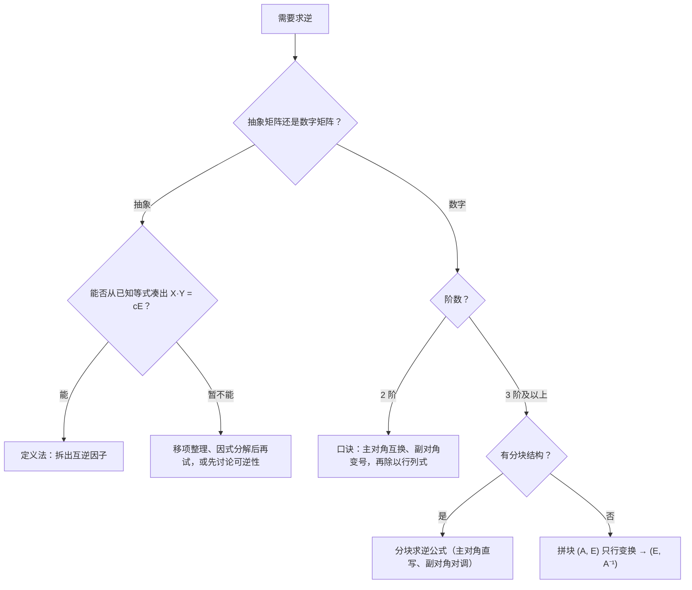
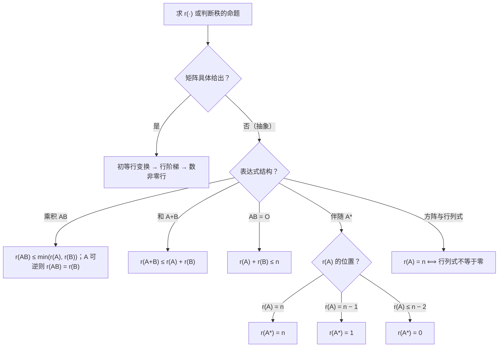

# 第 2 章：矩阵

> 矩阵是线代的核心研究对象与运算载体，第 3 章的秩、第 4 章的方程组、第 5 章的特征值全部建立在它上面。数二卷中本章以选择、填空高频出现，**抽象矩阵运算**（由方程凑逆、伴随公式）与**分块技巧**是特色考点，分值不高但几乎每年必考。

**本章学习目标**：

- 牢记矩阵运算与数的运算的两大差异——**不可交换**、**无消去律**，会正确展开 $(A + B)^2$ 类表达式，熟练处理方阵的幂与行列式混合运算；
- 打通"可逆性"一条线：可逆的充要条件链、伴随矩阵公式体系、三种求逆方法及各自适用场景；
- 熟练用初等变换求逆与求秩，会解数值型与抽象型矩阵方程，会用分块技巧处理高阶矩阵。

---

## 2.1 矩阵的运算

### 1. 基本概念

**矩阵**： $m \times n$ 个数排成的 $m$ 行 $n$ 列数表，记作 $A_{m \times n}$ ；行数与列数都等于 $n$ 的矩阵称为 $n$ 阶**方阵**。两个矩阵**同型**指行数相同且列数相同。

> ⚠️ 矩阵是**数表**，行列式是**数**。 $n$ 阶方阵 $A$ 对应一个行列式，记作 $|A|$ 或 $\det A$ 。这个区分是理解本章全部运算规则的根源： $A + B$ 要求同型，而 $|A + B| \ne |A| + |B|$ 一般不成立——"表不能加出数"。

**加法与数乘**：同型矩阵对应元素相加；数 $k$ 乘矩阵等于乘每个元素。运算律（交换律、结合律、分配律）与数的运算一致。

### 2. 矩阵乘法

**可乘条件**： $A_{m \times s}$ 左乘 $B_{s \times n}$ 才有意义，即**左矩阵的列数 = 右矩阵的行数**，结果为 $C_{m \times n}$ 。口诀："中间相等，两头定形"。

**定义**（行乘列）：

$$
(AB)_{ij} = \sum_{k=1}^{s} a_{ik} b_{kj} \qquad (i = 1, \ldots, m;\ j = 1, \ldots, n)
$$

即 $AB$ 的第 $i$ 行第 $j$ 列元素 = $A$ 的第 $i$ 行与 $B$ 的第 $j$ 列对应相乘再相加。

**成立的运算律**：结合律 $(AB)C = A(BC)$ ；分配律 $A(B + C) = AB + AC$ 、 $(B + C)D = BD + CD$ ；数乘结合 $k(AB) = (kA)B = A(kB)$ 。

### 3. 与数的运算的三大差异（考试核心）

**差异一：乘法不可交换。** 一般 $AB \ne BA$ ，甚至可能出现 $AB$ 有意义而 $BA$ 无意义。因此：

- $(A + B)^2 = A^2 + AB + BA + B^2$ ，**不能**写成 $A^2 + 2AB + B^2$ ；
- $(A + B)(A - B) = A^2 - AB + BA - B^2$ ，**不能**写成 $A^2 - B^2$ 。

只有当 $AB = BA$ 时才退化成熟悉公式。常用可交换情形：任何矩阵与数量矩阵 $kE$ 可交换； $A$ 与自己的多项式可交换（如 $(A - E)(A - 2E) = A^2 - 3A + 2E$ 恒成立）。

**差异二：无消去律。**

$$
AB = O \not\Rightarrow A = O \ \text{或}\ B = O
$$

因此由 $AB = AC$ 且 $A \ne O$ **推不出** $B = C$ ；消去只有在 $A$ **可逆**时才合法。

**差异三：行列式没有"和的分配律"。** 方阵的行列式运算规则（连接第 1 章）：

$$
|AB| = |A| \cdot |B|, \qquad |A^m| = |A|^m, \qquad |kA| = k^n |A|
$$

> ⚠️ $|kA| = k^n |A|$ 而不是 $k|A|$ ： $n$ 阶方阵每个元素都带因子 $k$ ，按行列式性质每行提出一个 $k$ ， $n$ 行共提出 $k^n$ 。

**方阵的幂**： $A^k$ 表示 $k$ 个 $A$ 相乘，满足 $A^k A^l = A^{k+l}$ 、 $(A^k)^l = A^{kl}$ 。由于 $A$ 与自身可交换，矩阵多项式可以像普通多项式一样因式分解——只需把常数项写成常数乘 $E$ 。

**例 1**（不可交换与无消去律）：设 $A = \begin{pmatrix} 1 & 1 \\ 0 & 1 \end{pmatrix}$ ， $B = \begin{pmatrix} 1 & 0 \\ 1 & 1 \end{pmatrix}$ 。计算 $AB$ 与 $BA$ ；再构造两个非零矩阵使乘积为 $O$ 。

**解**：按"行乘列"：

$$
AB = \begin{pmatrix} 1 \cdot 1 + 1 \cdot 1 & 1 \cdot 0 + 1 \cdot 1 \\ 0 \cdot 1 + 1 \cdot 1 & 0 \cdot 0 + 1 \cdot 1 \end{pmatrix} = \begin{pmatrix} 2 & 1 \\ 1 & 1 \end{pmatrix}
$$

$$
BA = \begin{pmatrix} 1 \cdot 1 + 0 \cdot 0 & 1 \cdot 1 + 0 \cdot 1 \\ 1 \cdot 1 + 1 \cdot 0 & 1 \cdot 1 + 1 \cdot 1 \end{pmatrix} = \begin{pmatrix} 1 & 1 \\ 1 & 2 \end{pmatrix}
$$

故 $AB \ne BA$ 。

再取 $C = \begin{pmatrix} 1 & 0 \\ 0 & 0 \end{pmatrix}$ ， $D = \begin{pmatrix} 0 & 0 \\ 0 & 1 \end{pmatrix}$ ，则 $C \ne O$ 、 $D \ne O$ ，但 $CD = O$ 。若消去律成立，由 $CD = C \cdot O$ 消去 $C$ 应得 $D = O$ ，矛盾——这就是"无消去律"的反例，选择题直接可用。

**例 2**（方阵的幂）：设 $A = \begin{pmatrix} \lambda & 1 \\ 0 & \lambda \end{pmatrix}$ （ $\lambda \ne 0$ ），求 $A^n$ ，并写出 $\lambda = 2$ 时的 $A^2$ 加以验证。

**解**：把 $A$ 拆成"数量矩阵 + 幂零矩阵"： $A = \lambda E + B$ ，其中 $B = \begin{pmatrix} 0 & 1 \\ 0 & 0 \end{pmatrix}$ ，直接计算得 $B^2 = O$ 。**关键一步**： $\lambda E$ 与一切矩阵可交换，故二项式定理可用（拆成的两部分若不可交换则不能用）：

$$
A^n = (\lambda E + B)^n = \sum_{k=0}^{n} \binom{n}{k} (\lambda E)^{n-k} B^k = \lambda^n E + n \lambda^{n-1} B
$$

（ $k \ge 2$ 的项全为 $O$ 。）于是

$$
A^n = \begin{pmatrix} \lambda^n & n \lambda^{n-1} \\ 0 & \lambda^n \end{pmatrix}
$$

$\lambda = 2$ 时 $A^2 = \begin{pmatrix} 4 & 4 \\ 0 & 4 \end{pmatrix}$ ，与公式中 $n \lambda^{n-1} = 2 \times 2 = 4$ 一致；直接相乘验算：左上 $2 \times 2 + 1 \times 0 = 4$ ，右上 $2 \times 1 + 1 \times 2 = 4$ ✓。

> 💡 "数量矩阵 + 幂零矩阵"的拆分是求高次幂的通用手法：先算出幂零部分的较低次幂为零，二项式立刻截断，避免硬乘。

---

## 2.2 转置与特殊矩阵

### 1. 转置

把 $A$ 的第 $i$ 行第 $j$ 列元素放到第 $j$ 行第 $i$ 列，得到 $A^T$ 。四条性质：

$$
(A^T)^T = A, \qquad (A + B)^T = A^T + B^T, \qquad (kA)^T = k A^T, \qquad (AB)^T = B^T A^T
$$

> 💡 最后一条是"穿脱原则"：先穿后脱，顺序要反过来，推广为 $(ABC)^T = C^T B^T A^T$ 。它与 $(AB)^{-1} = B^{-1} A^{-1}$ 是同款结构，务必一起记。

### 2. 对称矩阵与反对称矩阵

**定义**： $A^T = A$ 的方阵叫**对称矩阵**； $A^T = -A$ 的方阵叫**反对称矩阵**。反对称矩阵的对角元满足 $a_{ii} = -a_{ii} = 0$ ，即**对角元全为零**。

**运算封闭性**：

| 运算 | 对称矩阵 | 反对称矩阵 |
|------|----------|------------|
| 加法、数乘 | 仍对称 | 仍反对称 |
| 乘积 $AB$ | 不封闭： $AB$ 对称 $\iff AB = BA$ | 不封闭 |
| 幂 $A^m$ | 仍对称 | $m$ 为偶数时对称， $m$ 为奇数时反对称 |

### 3. 分解定理

**定理**：任意 $n$ 阶方阵 $A$ 都可以唯一地写成一个对称矩阵与一个反对称矩阵之和：

$$
A = \underbrace{\frac{A + A^T}{2}}_{\text{对称}} + \underbrace{\frac{A - A^T}{2}}_{\text{反对称}}
$$

**例 3**（对称性判别）： (1) 证明上述分解定理；(2) 设 $A$ 、 $B$ 都是 $n$ 阶对称矩阵，讨论 $AB + BA$ 、 $AB - BA$ 、 $AB$ 的对称性。

**解**： (1) 记 $S = \dfrac{A + A^T}{2}$ ， $K = \dfrac{A - A^T}{2}$ ，则

$$
S^T = \frac{(A + A^T)^T}{2} = \frac{A^T + A}{2} = S \ \text{（对称）}, \qquad K^T = \frac{(A - A^T)^T}{2} = \frac{A^T - A}{2} = -K \ \text{（反对称）}
$$

且 $S + K = A$ ，存在性得证。唯一性：若另有 $A = S_1 + K_1$ （ $S_1$ 对称、 $K_1$ 反对称），转置得 $A^T = S_1 - K_1$ ，与原式相加得 $S_1 = S$ ，相减得 $K_1 = K$ 。

(2) 由 $A^T = A$ 、 $B^T = B$ ：

$$
(AB + BA)^T = B^T A^T + A^T B^T = BA + AB = AB + BA
$$

故 $AB + BA$ **恒对称**；同理

$$
(AB - BA)^T = BA - AB = -(AB - BA)
$$

故 $AB - BA$ **恒反对称**。而 $(AB)^T = B^T A^T = BA$ ，于是

$$
AB \ \text{对称} \iff (AB)^T = AB \iff BA = AB
$$

即**两个对称矩阵的乘积对称 ⟺ 它们可交换**。反例： $A = \begin{pmatrix} 0 & 1 \\ 1 & 0 \end{pmatrix}$ 、 $B = \begin{pmatrix} 1 & 0 \\ 0 & 2 \end{pmatrix}$ 都对称，但 $AB = \begin{pmatrix} 0 & 2 \\ 1 & 0 \end{pmatrix} \ne BA$ ， $AB$ 不对称。

---

## 2.3 逆矩阵

### 1. 定义与充要条件

**定义**：对 $n$ 阶方阵 $A$ ，若存在 $n$ 阶方阵 $B$ 使

$$
AB = BA = E
$$

则称 $A$ **可逆**， $B$ 为 $A$ 的**逆矩阵**，记作 $B = A^{-1}$ 。逆矩阵若存在必唯一：若 $B$ 、 $C$ 都是 $A$ 的逆，则 $B = BE = B(AC) = (BA)C = EC = C$ 。只有方阵才谈逆矩阵。

**可逆的充要条件链**（贯穿第 3~5 章，必须一体记忆）：

$$
|A| \ne 0 \iff r(A) = n \iff \text{行（列）向量组线性无关} \iff Ax = 0 \text{ 只有零解} \iff A \text{ 的特征值全不为 } 0
$$

其中"向量组线性无关"是第 3 章语言， "$Ax = 0$ 只有零解"是第 4 章语言，"特征值全不为 0"是第 5 章视角（届时由 $|A| = \prod \lambda_i$ 立刻回看）。

### 2. 逆矩阵的性质（5 条）

设 $A$ 、 $B$ 为同阶可逆矩阵， $k \ne 0$ ：

1. $(A^{-1})^{-1} = A$ ；
2. $(kA)^{-1} = \dfrac{1}{k} A^{-1}$ ；
3. $(AB)^{-1} = B^{-1} A^{-1}$ ——**顺序相反**，推广为 $(A_1 A_2 \cdots A_s)^{-1} = A_s^{-1} \cdots A_2^{-1} A_1^{-1}$ ；
4. $(A^T)^{-1} = (A^{-1})^T$ ；
5. $|A^{-1}| = |A|^{-1}$ 。

> ⚠️ $(A + B)^{-1}$ **没有**公式：既不等于 $A^{-1} + B^{-1}$ ，且 $A + B$ 本身可能不可逆（如 $B = -A$ 时 $A + B = O$ ）。

### 3. 求逆的三种方法

**方法一（2 阶专属·伴随口诀）**： $A = \begin{pmatrix} a & b \\ c & d \end{pmatrix}$ ， $|A| = ad - bc \ne 0$ 时

$$
A^{-1} = \frac{1}{ad - bc} \begin{pmatrix} d & -b \\ -c & a \end{pmatrix}
$$

口诀：**主对角互换、副对角变号，再除以行列式**。

**方法二（初等变换法，3 阶以上数值求逆首选）**：

$$
(A \mid E) \xrightarrow{\ \text{只作初等行变换}\ } (E \mid A^{-1})
$$

原理见 2.6。

**方法三（定义凑因子法，抽象矩阵的唯一武器）**：从已知等式凑出 $XY = cE$ （ $c \ne 0$ ），则 $X$ 、 $Y$ 都可逆（两边取行列式得 $|X| \cdot |Y| = c^n \ne 0$ ），且 $X^{-1} = \dfrac{Y}{c}$ 、 $Y^{-1} = \dfrac{X}{c}$ 。操作口诀：**移项 → 因式分解（看清公因子在左还是在右）→ 补常数凑出非零数量矩阵**。

**例 4**（抽象矩阵凑逆）：设 $n$ 阶矩阵 $A$ 满足 $A^2 - 3A - 2E = O$ ，证明 $A$ 与 $A - 4E$ 都可逆，并求 $A^{-1}$ 、 $(A - 4E)^{-1}$ 。

**解**：**凑 $A$ 的逆**：把已知式写成 $A^2 - 3A = 2E$ ，左边提出公因子 $A$ （放在左侧）：

$$
A(A - 3E) = 2E
$$

即 $A \cdot \dfrac{A - 3E}{2} = E$ 。取行列式得 $|A| \cdot |A - 3E| = |2E| = 2^n \ne 0$ ，故 $A$ 可逆，且

$$
A^{-1} = \frac{1}{2}(A - 3E)
$$

**凑 $A - 4E$ 的逆**：目标是凑出含 $(A - 4E)$ 的乘积等于非零数量矩阵。试算：

$$
(A - 4E)(A + E) = A^2 + A - 4A - 4E = A^2 - 3A - 4E
$$

代入 $A^2 - 3A = 2E$ 得

$$
(A - 4E)(A + E) = 2E - 4E = -2E
$$

取行列式知 $|A - 4E| \cdot |A + E| = (-2)^n \ne 0$ ，故 $A - 4E$ （同时 $A + E$ ）可逆，且

$$
(A - 4E)^{-1} = -\frac{1}{2}(A + E)
$$

> 💡 凑因子时先猜"缺哪块"：想求 $(A - kE)^{-1}$ ，就试算 $(A - kE)(A + mE)$ ，再用已知关系消去二次项；系数的选择以乘积恰为**非零数量矩阵**为准。

**例 5**（数值求逆）： (1) 求 $A = \begin{pmatrix} 2 & 1 \\ 3 & 2 \end{pmatrix}$ 的逆；(2) 用初等变换法求 $B = \begin{pmatrix} 2 & 1 & 1 \\ 1 & 2 & 1 \\ 1 & 1 & 2 \end{pmatrix}$ 的逆。

**解**： (1) $|A| = 2 \times 2 - 1 \times 3 = 1$ ，口诀直接写：

$$
A^{-1} = \begin{pmatrix} 2 & -1 \\ -3 & 2 \end{pmatrix}
$$

验算： $AA^{-1} = \begin{pmatrix} 4 - 3 & -2 + 2 \\ 6 - 6 & -3 + 4 \end{pmatrix} = E$ ✓

(2) 构造 $(B \mid E)$ ，只作行变换：

$$
\left(\begin{array}{ccc|ccc}
2 & 1 & 1 & 1 & 0 & 0 \\
1 & 2 & 1 & 0 & 1 & 0 \\
1 & 1 & 2 & 0 & 0 & 1
\end{array}\right)
\xrightarrow{r_1 \leftrightarrow r_2}
\left(\begin{array}{ccc|ccc}
1 & 2 & 1 & 0 & 1 & 0 \\
2 & 1 & 1 & 1 & 0 & 0 \\
1 & 1 & 2 & 0 & 0 & 1
\end{array}\right)
\xrightarrow[r_3 - r_1]{r_2 - 2r_1}
\left(\begin{array}{ccc|ccc}
1 & 2 & 1 & 0 & 1 & 0 \\
0 & -3 & -1 & 1 & -2 & 0 \\
0 & -1 & 1 & 0 & -1 & 1
\end{array}\right)
$$

$$
\xrightarrow{r_2 \leftrightarrow r_3}
\left(\begin{array}{ccc|ccc}
1 & 2 & 1 & 0 & 1 & 0 \\
0 & -1 & 1 & 0 & -1 & 1 \\
0 & -3 & -1 & 1 & -2 & 0
\end{array}\right)
\xrightarrow{r_2 \times (-1)}
\left(\begin{array}{ccc|ccc}
1 & 2 & 1 & 0 & 1 & 0 \\
0 & 1 & -1 & 0 & 1 & -1 \\
0 & -3 & -1 & 1 & -2 & 0
\end{array}\right)
\xrightarrow{r_3 + 3r_2}
\left(\begin{array}{ccc|ccc}
1 & 2 & 1 & 0 & 1 & 0 \\
0 & 1 & -1 & 0 & 1 & -1 \\
0 & 0 & -4 & 1 & 1 & -3
\end{array}\right)
$$

$$
\xrightarrow{r_3 \times \left(-\frac{1}{4}\right)}
\left(\begin{array}{ccc|ccc}
1 & 2 & 1 & 0 & 1 & 0 \\
0 & 1 & -1 & 0 & 1 & -1 \\
0 & 0 & 1 & -\frac{1}{4} & -\frac{1}{4} & \frac{3}{4}
\end{array}\right)
\xrightarrow{r_2 + r_3}
\left(\begin{array}{ccc|ccc}
1 & 2 & 1 & 0 & 1 & 0 \\
0 & 1 & 0 & -\frac{1}{4} & \frac{3}{4} & -\frac{1}{4} \\
0 & 0 & 1 & -\frac{1}{4} & -\frac{1}{4} & \frac{3}{4}
\end{array}\right)
\xrightarrow{r_1 - 2r_2 - r_3}
\left(\begin{array}{ccc|ccc}
1 & 0 & 0 & \frac{3}{4} & -\frac{1}{4} & -\frac{1}{4} \\
0 & 1 & 0 & -\frac{1}{4} & \frac{3}{4} & -\frac{1}{4} \\
0 & 0 & 1 & -\frac{1}{4} & -\frac{1}{4} & \frac{3}{4}
\end{array}\right)
$$

故

$$
B^{-1} = \frac{1}{4} \begin{pmatrix} 3 & -1 & -1 \\ -1 & 3 & -1 \\ -1 & -1 & 3 \end{pmatrix}
$$

验算一处即可： $BB^{-1}$ 的 $(1,1)$ 元 $= 2 \times \frac{3}{4} + 1 \times \left(-\frac{1}{4}\right) + 1 \times \left(-\frac{1}{4}\right) = \frac{6 - 1 - 1}{4} = 1$ ✓。

> 💡 3 阶以上用伴随矩阵法要算 $n^2$ 个 $n - 1$ 阶行列式，工作量爆炸；**初等变换法是数值求逆的首选**，且全程只许行变换。

---

## 2.4 伴随矩阵

### 1. 定义与核心恒等式

$n$ 阶方阵 $A = (a_{ij})$ 的**伴随矩阵** $A^*$ 由 $|A|$ 的 $n^2$ 个代数余子式**转置排列**而成：

$$
A^* = \begin{pmatrix}
A_{11} & A_{21} & \cdots & A_{n1} \\
A_{12} & A_{22} & \cdots & A_{n2} \\
\vdots & \vdots & & \vdots \\
A_{1n} & A_{2n} & \cdots & A_{nn}
\end{pmatrix}
$$

> ⚠️ 元素 $A_{ij}$ 放在 $A^*$ 的**第 $j$ 行第 $i$ 列**——行与列互换，这是伴随矩阵最阴的坑。2 阶情形由定义直接验证： $\begin{pmatrix} a & b \\ c & d \end{pmatrix}^* = \begin{pmatrix} d & -b \\ -c & a \end{pmatrix}$ ，正是 2.3 口诀"主对角互换、副对角变号"的来源。

**核心恒等式**（对**任意** $n$ 阶方阵成立，不要求可逆）：

$$
AA^* = A^*A = |A|E
$$

它由第 1 章展开定理直接得到： $\sum\limits_{k=1}^{n} a_{ik} A_{jk} = |A| \delta_{ij}$ （ $i = j$ 是按行展开， $i \ne j$ 是"异行展开为零"）。

**推论**：当 $|A| \ne 0$ 时， $A$ 可逆，且

$$
A^{-1} = \frac{1}{|A|} A^*, \qquad A^* = |A| A^{-1}
$$

这两个式子是"伴随 ↔ 逆 ↔ 行列式"三角关系的桥梁：凡见 $A^*$ 与 $A^{-1}$ 、 $|A|$ 混合的式子，第一反应就是 $AA^* = |A|E$ 。

### 2. 伴随矩阵公式表（n ≥ 2）

| 公式 | 条件 | 记忆线索 |
|------|------|----------|
| $AA^* = A^*A = \|A\|E$ | 恒成立 | 一切伴随公式之母 |
| $A^* = \|A\| A^{-1}$ | $A$ 可逆 | 恒等式两边除以 $\|A\|$ |
| $(A^*)^{-1} = \dfrac{A}{\|A\|}$ | $A$ 可逆 | 对上式反解 |
| $\|A^*\| = \|A\|^{n-1}$ | 恒成立 | 对 $A^* = \|A\|A^{-1}$ 两边取行列式 |
| $(A^*)^* = \|A\|^{n-2} A$ | 恒成立 | 对 $A^*$ 再用一次定义； $n = 2$ 时 $(A^*)^* = A$ |
| $(kA)^* = k^{n-1} A^*$ | 恒成立 | $A^*$ 的元素是 $n - 1$ 阶行列式，每行提一个 $k$ |
| $(A^T)^* = (A^*)^T$ | 恒成立 | 转置与伴随可交换 |
| $(A^{-1})^* = (A^*)^{-1} = \dfrac{A}{\|A\|}$ | $A$ 可逆 | 逆与伴随可交换 |

### 3. $r(A^*)$ 的三种情形

$$
r(A^*) = \begin{cases} n, & r(A) = n \\ 1, & r(A) = n - 1 \\ 0, & r(A) \le n - 2 \end{cases}
$$

**理由**：

- $r(A) = n$ ： $|A^*| = |A|^{n-1} \ne 0$ ，故 $A^*$ 满秩；
- $r(A) = n - 1$ ：一方面 $|A| = 0$ ，由 $AA^* = O$ 及"$AB = O \Rightarrow r(A) + r(B) \le n$ （见 2.7 性质 5，第 4 章证明）"得 $r(A^*) \le 1$ ；另一方面 $r(A) = n - 1$ 说明存在非零的 $n - 1$ 阶子式，即某个代数余子式非零，故 $A^* \ne O$ ， $r(A^*) \ge 1$ 。夹逼得 $r(A^*) = 1$ ；
- $r(A) \le n - 2$ ：所有 $n - 1$ 阶子式全为零，每个 $A_{ij} = 0$ ，故 $A^* = O$ 。

**例 6**（伴随公式综合）：设 $A$ 为 3 阶矩阵， $|A| = \dfrac{1}{2}$ ，且 $A^{-1} = \begin{pmatrix} 1 & 1 & 0 \\ 0 & 1 & 1 \\ 0 & 0 & 1 \end{pmatrix}$ ，求 $(A^*)^{-1}$ 、 $|A^*|$ 、 $(A^*)^*$ 。

**解**：先反解出 $A$ 。记 $A^{-1} = E + N$ ，其中 $N = \begin{pmatrix} 0 & 1 & 0 \\ 0 & 0 & 1 \\ 0 & 0 & 0 \end{pmatrix}$ 满足 $N^3 = O$ ，故 $A = (E + N)^{-1} = E - N + N^2$ ，即

$$
A = \begin{pmatrix} 1 & -1 & 1 \\ 0 & 1 & -1 \\ 0 & 0 & 1 \end{pmatrix}
$$

（逐行验算 $AA^{-1} = E$ 成立。）

由 $(A^*)^{-1} = \dfrac{A}{|A|} = 2A$ ：

$$
(A^*)^{-1} = \begin{pmatrix} 2 & -2 & 2 \\ 0 & 2 & -2 \\ 0 & 0 & 2 \end{pmatrix}
$$

由 $|A^*| = |A|^{n-1}$ （ $n = 3$ ）： $|A^*| = \left(\dfrac{1}{2}\right)^2 = \dfrac{1}{4}$ 。由 $(A^*)^* = |A|^{n-2} A = \dfrac{1}{2} A$ ：

$$
(A^*)^* = \begin{pmatrix} \frac{1}{2} & -\frac{1}{2} & \frac{1}{2} \\ 0 & \frac{1}{2} & -\frac{1}{2} \\ 0 & 0 & \frac{1}{2} \end{pmatrix}
$$

> 💡 本题也可从 $A^* = |A| A^{-1} = \dfrac{1}{2} A^{-1}$ 出发： $|A^*| = \left(\dfrac{1}{2}\right)^3 \left|A^{-1}\right| = \dfrac{1}{8} \times 2 = \dfrac{1}{4}$ ，两条路互相印证。

---

## 2.5 分块矩阵

### 1. 分块运算

用横线、竖线把高阶矩阵切成小块，把每块当作"元素"参与运算：

- **加法、数乘**：分法相同即可，块内对应运算；
- **乘法**：左矩阵的**列分法**必须与右矩阵的**行分法**一致，然后按"行乘列"规则乘块（块内维度自然匹配）：

$$
\begin{pmatrix} A_{11} & A_{12} \\ A_{21} & A_{22} \end{pmatrix}
\begin{pmatrix} B_{11} & B_{12} \\ B_{21} & B_{22} \end{pmatrix}
=
\begin{pmatrix} A_{11}B_{11} + A_{12}B_{21} & A_{11}B_{12} + A_{12}B_{22} \\ A_{21}B_{11} + A_{22}B_{21} & A_{21}B_{12} + A_{22}B_{22} \end{pmatrix}
$$

### 2. 分块对角矩阵

$A = \mathrm{diag}(A_1, A_2, \ldots, A_s)$ （主对角线上是方块，其余为 $O$ ）：

$$
A^k = \mathrm{diag}(A_1^k, \ldots, A_s^k), \qquad |A| = |A_1| \cdots |A_s|, \qquad A^{-1} = \mathrm{diag}(A_1^{-1}, \ldots, A_s^{-1})
$$

（各块均可逆时 $A$ 才可逆。）

### 3. 四种特殊分块行列式

设 $A$ 为 $m$ 阶、 $B$ 为 $n$ 阶方阵， $C$ 、 $D$ 为任意矩阵：

$$
\begin{vmatrix} A & O \\ O & B \end{vmatrix} = \begin{vmatrix} A & C \\ O & B \end{vmatrix} = \begin{vmatrix} A & O \\ C & B \end{vmatrix} = |A| \cdot |B|
$$

$$
\begin{vmatrix} O & A \\ B & O \end{vmatrix} = \begin{vmatrix} C & A \\ B & O \end{vmatrix} = \begin{vmatrix} O & A \\ B & C \end{vmatrix} = (-1)^{mn} |A| \cdot |B|
$$

> ⚠️ 副对角型多出的符号 $(-1)^{mn}$ 来自把 $n$ 行（列）整体穿过 $m$ 列（行）——拉普拉斯展开（第 1 章）的结论，考试直接用，但**符号千万别丢**。

### 4. 副对角分块求逆

若 $A$ （ $m$ 阶）、 $B$ （ $n$ 阶）都可逆：

$$
\begin{pmatrix} O & A \\ B & O \end{pmatrix}^{-1} = \begin{pmatrix} O & B^{-1} \\ A^{-1} & O \end{pmatrix}
$$

> ⚠️ 两个逆要**对调位置**：原来在右上块的 $A$ ，其逆出现在左下块。

配套的三角分块求逆公式（ $A$ 、 $B$ 可逆，验证：相乘对角块得 $E$ 、右上块 $-AA^{-1}CB^{-1} + CB^{-1} = O$ ）：

$$
\begin{pmatrix} A & C \\ O & B \end{pmatrix}^{-1} = \begin{pmatrix} A^{-1} & -A^{-1}CB^{-1} \\ O & B^{-1} \end{pmatrix}
$$

**例 7**（分块行列式与分块求逆）：设 $B = \begin{pmatrix} 1 & 2 \\ 0 & 1 \end{pmatrix}$ ， $C = \begin{pmatrix} 1 & 1 \\ 3 & 2 \end{pmatrix}$ ，

$$
M = \begin{pmatrix} B & O \\ O & C \end{pmatrix} = \begin{pmatrix} 1 & 2 & 0 & 0 \\ 0 & 1 & 0 & 0 \\ 0 & 0 & 1 & 1 \\ 0 & 0 & 3 & 2 \end{pmatrix}, \qquad N = \begin{pmatrix} O & B \\ C & O \end{pmatrix} = \begin{pmatrix} 0 & 0 & 1 & 2 \\ 0 & 0 & 0 & 1 \\ 1 & 1 & 0 & 0 \\ 3 & 2 & 0 & 0 \end{pmatrix}
$$

求 $|M|$ 、 $|N|$ 、 $M^{-1}$ 、 $N^{-1}$ 。

**解**： $|B| = 1$ ， $|C| = 2 - 3 = -1$ 。分块对角直接相乘： $|M| = |B| \cdot |C| = -1$ ；副对角型补符号（ $m = n = 2$ ， $(-1)^{mn} = 1$ ）： $|N| = (-1)^{mn} |B| \cdot |C| = -1$ 。

小块的逆（2 阶口诀）： $B^{-1} = \begin{pmatrix} 1 & -2 \\ 0 & 1 \end{pmatrix}$ ， $C^{-1} = \dfrac{1}{-1} \begin{pmatrix} 2 & -1 \\ -3 & 1 \end{pmatrix} = \begin{pmatrix} -2 & 1 \\ 3 & -1 \end{pmatrix}$ 。于是

$$
M^{-1} = \begin{pmatrix} B^{-1} & O \\ O & C^{-1} \end{pmatrix} = \begin{pmatrix} 1 & -2 & 0 & 0 \\ 0 & 1 & 0 & 0 \\ 0 & 0 & -2 & 1 \\ 0 & 0 & 3 & -1 \end{pmatrix}
$$

副对角分块求逆，**位置对调**：

$$
N^{-1} = \begin{pmatrix} O & C^{-1} \\ B^{-1} & O \end{pmatrix} = \begin{pmatrix} 0 & 0 & -2 & 1 \\ 0 & 0 & 3 & -1 \\ 1 & -2 & 0 & 0 \\ 0 & 1 & 0 & 0 \end{pmatrix}
$$

分块验算 $NN^{-1}$ 的四个块：左上 $O \cdot O + B B^{-1} = E$ ，右上 $O \cdot C^{-1} + B \cdot O = O$ ，左下 $C \cdot O + O \cdot B^{-1} = O$ ，右下 $C C^{-1} = E$ ，故 $NN^{-1} = E$ ✓。

---

## 2.6 初等变换与初等矩阵

### 1. 三种初等变换与三类初等矩阵

对矩阵可作三种**初等行变换**（列变换同理）：① 交换两行（ $r_i \leftrightarrow r_j$ ）；② 非零常数 $k$ 乘某行（ $r_i \times k$ ）；③ 某行的 $k$ 倍加到另一行（ $r_j + k r_i$ ）。

单位矩阵经过**一次**初等变换得到的方阵叫**初等矩阵**，与三种变换一一对应：

| 记号 | 怎么来的 | 逆矩阵 |
|------|----------|--------|
| $E_{ij}$ | 交换 $E$ 的 $i$ 、 $j$ 两行 | $E_{ij}^{-1} = E_{ij}$ |
| $E_i(k)$ | 第 $i$ 行乘非零常数 $k$ | $E_i(k)^{-1} = E_i\!\left(\dfrac{1}{k}\right)$ |
| $E_{ij}(k)$ | 第 $j$ 行的 $k$ 倍加到第 $i$ 行 | $E_{ij}(k)^{-1} = E_{ij}(-k)$ |

**初等矩阵都可逆，且逆仍是同类型的初等矩阵**——对初等矩阵再作一次"逆变换"就回去了。

### 2. 左乘行变、右乘列变（核心定理）

$$
\text{对 } A \text{ 作一次初等行变换} \iff \text{用相应的初等矩阵} \ \textbf{左乘} \ A
$$

$$
\text{对 } A \text{ 作一次初等列变换} \iff \text{用相应的初等矩阵} \ \textbf{右乘} \ A
$$

**例 8**（左乘与右乘）：设 $A = \begin{pmatrix} 1 & 2 \\ 3 & 4 \end{pmatrix}$ ， $P = \begin{pmatrix} 1 & 0 \\ 2 & 1 \end{pmatrix}$ ， $Q = \begin{pmatrix} 1 & 2 \\ 0 & 1 \end{pmatrix}$ 。计算 $PA$ 、 $AQ$ 、 $P^{-1}$ ，并说明各自对应什么变换。

**解**：

$$
PA = \begin{pmatrix} 1 & 2 \\ 2 + 3 & 4 + 4 \end{pmatrix} = \begin{pmatrix} 1 & 2 \\ 5 & 8 \end{pmatrix}, \qquad AQ = \begin{pmatrix} 1 & 2 \times 1 + 2 \\ 3 & 2 \times 3 + 4 \end{pmatrix} = \begin{pmatrix} 1 & 4 \\ 3 & 10 \end{pmatrix}
$$

- $PA$ 恰是"把 $A$ 的第 1 行的 2 倍加到第 2 行"（ $r_2 + 2r_1$ ）： $P = E_{21}(2)$ 是单位阵作同一变换的产物，**左乘实施行变换**；
- $AQ$ 恰是"把 $A$ 的第 1 列的 2 倍加到第 2 列"（ $c_2 + 2c_1$ ）：**右乘实施列变换**；
- $P^{-1} = E_{21}(-2) = \begin{pmatrix} 1 & 0 \\ -2 & 1 \end{pmatrix}$ ，对应逆变换 $r_2 - 2r_1$ ，验算 $PP^{-1} = E$ ✓。

### 3. 两个重要定理与标准流程

**定理 1**： $A$ 可逆 $\iff$ $A$ 可以写成若干个初等矩阵的乘积。

**定理 2**：初等变换不改变矩阵的秩。

由定理 1：若一串初等矩阵满足 $P_s \cdots P_1 A = E$ ，则 $A^{-1} = P_s \cdots P_1$ ，即**同一串行变换**把 $E$ 变成 $A^{-1}$ ——这就是 $(A \mid E) \to (E \mid A^{-1})$ 的原理。三个标准流程：

- **求逆**： $(A \mid E)$ 只行变换 $\to (E \mid A^{-1})$ ；
- **求秩**： $A$ 只行变换 $\to$ 行阶梯形，**非零行的行数**即 $r(A)$ ；
- **解 $AX = B$**： $(A \mid B)$ 只行变换 $\to (E \mid A^{-1}B)$ （见 2.8）。

---

## 2.7 矩阵的秩

### 1. 定义与求法

$A_{m \times n}$ 中任取 $k$ 行 $k$ 列交叉处的 $k^2$ 个元素按原次序构成的 $k$ 阶行列式叫 $A$ 的 **$k$ 阶子式**。若 $A$ 有非零的 $r$ 阶子式，且所有 $r + 1$ 阶子式（若存在）全为零，则规定 $r(A) = r$ 。零矩阵的秩为 0 ，且

$$
0 \le r(A_{m \times n}) \le \min\{m, n\}
$$

**求法**：初等行变换化为**行阶梯形**，非零行数就是秩（定理 2 保证有效）。演示：

$$
\begin{pmatrix} 1 & 2 & 3 & 1 \\ 2 & 4 & 6 & 2 \\ 1 & 0 & 1 & 1 \end{pmatrix}
\xrightarrow[r_3 - r_1]{r_2 - 2r_1}
\begin{pmatrix} 1 & 2 & 3 & 1 \\ 0 & 0 & 0 & 0 \\ 0 & -2 & -2 & 0 \end{pmatrix}
\xrightarrow{r_2 \leftrightarrow r_3}
\begin{pmatrix} 1 & 2 & 3 & 1 \\ 0 & -2 & -2 & 0 \\ 0 & 0 & 0 & 0 \end{pmatrix}
$$

两个非零行， $r(A) = 2$ 。

### 2. 秩的性质（考研选择题题库）

1. $r(A) = r(A^T) = r(kA)$ （ $k \ne 0$ ）；
2. $r(AB) \le \min\{r(A), r(B)\}$ ——**乘法不增秩**；
3. $r(A + B) \le r(A) + r(B)$ ；
4. $A$ 可逆时： $r(AB) = r(B)$ 、 $r(CA) = r(C)$ ——可逆矩阵乘上去不改变秩（由 $r(B) = r(A^{-1}AB) \le r(AB) \le r(B)$ 夹逼即证）；
5. $A_{m \times n} B = O \Rightarrow r(A) + r(B) \le n$ （ $B$ 的每个列向量都是 $Ax = 0$ 的解，第 4 章证明）；
6. $A$ 为 $n$ 阶方阵时： $r(A) = n \iff |A| \ne 0$ ， $r(A) < n \iff |A| = 0$ ；
7. $r(A^*)$ 三种情形： $r(A) = n$ 时为 $n$ ， $r(A) = n - 1$ 时为 $1$ ， $r(A) \le n - 2$ 时为 $0$ （见 2.4）。

> 💡 证 $r(\cdot) = k$ 用**夹逼**（证 $\ge k$ 且 $\le k$ 两条）；证 $r(\cdot) = 0$ 就是证该矩阵为 $O$ 。判断 "$r(AB) \ge \cdots$" 类命题时，先用性质 2 检查上界。

**例 9**（含参数求秩）：求矩阵 $A$ 的秩，其中

$$
A = \begin{pmatrix} 1 & 1 & 1 \\ 1 & 2 & a \\ 1 & 4 & a^2 \end{pmatrix} \qquad (a \text{ 为参数})
$$

**解**：只作行变换：

$$
A = \begin{pmatrix} 1 & 1 & 1 \\ 1 & 2 & a \\ 1 & 4 & a^2 \end{pmatrix}
\xrightarrow[r_3 - r_1]{r_2 - r_1}
\begin{pmatrix} 1 & 1 & 1 \\ 0 & 1 & a - 1 \\ 0 & 3 & a^2 - 1 \end{pmatrix}
\xrightarrow{r_3 - 3r_2}
\begin{pmatrix} 1 & 1 & 1 \\ 0 & 1 & a - 1 \\ 0 & 0 & a^2 - 3a + 2 \end{pmatrix}
$$

末位元素 $a^2 - 3a + 2 = (a - 1)(a - 2)$ ，讨论：

- $a \ne 1$ 且 $a \ne 2$ ：三行全非零， $r(A) = 3$ ；
- $a = 1$ 或 $a = 2$ ：第三行全零， $r(A) = 2$ 。

> 💡 交叉验证： $|A| = (2 - 1)(a - 1)(a - 2) = (a - 1)(a - 2)$ （范德蒙德行列式，第 1 章），与行变换结论一致。**含参数方阵先算行列式定满秩与否，不满秩再行变换细化**，是标准套路。

---

## 2.8 矩阵方程

### 1. 两种基本型（A 可逆）

$$
AX = B \ \Rightarrow\ X = A^{-1}B \ \text{（左乘 } A^{-1}\text{）}, \qquad XA = B \ \Rightarrow\ X = BA^{-1} \ \text{（右乘 } A^{-1}\text{）}
$$

初等变换实现：解 $AX = B$ 时对 $(A \mid B)$ 只作行变换，变成 $(E \mid A^{-1}B)$ 一步到位；解 $XA = B$ 时转置化为 $A^T X^T = B^T$ 再用行变换。

> ⚠️ $A^{-1}$ 乘在左还是右由 $X$ 的位置决定： $X$ 在左边（ $XA = B$ ）就右乘 $A^{-1}$ 。两问答案一般不同，见例 10。

### 2. 抽象方程三步法

1. **移项**：把含 $X$ 的项集中到一边；
2. **因式分解**：注意公因子的**左右位置**不可随意交换，凑出 "$f(\cdot)\, g(\cdot) = cE$" 结构以判定可逆；
3. **除过去**：按位置左乘或右乘相应的逆解出 $X$ ，最后回代验算。

**例 10**（数值矩阵方程）：设 $A = \begin{pmatrix} 1 & 2 \\ 1 & 3 \end{pmatrix}$ ， $B = \begin{pmatrix} 0 & 1 \\ 1 & 2 \end{pmatrix}$ ，分别解 (1) $AX = B$ ；(2) $XA = B$ 。

**解**： $|A| = 3 - 2 = 1$ ， $A^{-1} = \begin{pmatrix} 3 & -2 \\ -1 & 1 \end{pmatrix}$ （口诀）。

(1) $X$ 在右侧，**左乘** $A^{-1}$ ：

$$
X = A^{-1}B = \begin{pmatrix} 3 & -2 \\ -1 & 1 \end{pmatrix}\begin{pmatrix} 0 & 1 \\ 1 & 2 \end{pmatrix} = \begin{pmatrix} -2 & -1 \\ 1 & 1 \end{pmatrix}
$$

验算： $AX = \begin{pmatrix} -2 + 2 & -1 + 2 \\ -2 + 3 & -1 + 3 \end{pmatrix} = \begin{pmatrix} 0 & 1 \\ 1 & 2 \end{pmatrix} = B$ ✓

(2) $X$ 在左侧，改**右乘** $A^{-1}$ ：

$$
X = BA^{-1} = \begin{pmatrix} 0 & 1 \\ 1 & 2 \end{pmatrix}\begin{pmatrix} 3 & -2 \\ -1 & 1 \end{pmatrix} = \begin{pmatrix} -1 & 1 \\ 1 & 0 \end{pmatrix}
$$

验算： $XA = \begin{pmatrix} -1 + 1 & -2 + 3 \\ 1 & 2 \end{pmatrix} = \begin{pmatrix} 0 & 1 \\ 1 & 2 \end{pmatrix} = B$ ✓

两问答案不同——方向错了全盘皆输。

**例 11**（抽象矩阵方程）：设 $A$ 、 $B$ 均为 $n$ 阶方阵，满足 $AB = A + 2B$ 。证明 $A - 2E$ 、 $B - E$ 都可逆，并求 $(A - 2E)^{-1}$ 、 $(B - E)^{-1}$ 。

**解**：移项得 $AB - A - 2B = O$ 。凑因子： $AB - A = A(B - E)$ （公因子 $A$ 在左），把 $2B$ 写成 $2(B - E)$ 需补上 $2E$ ，即

$$
A(B - E) - 2(B - E) = AB - A - 2B + 2E = 2E, \qquad (A - 2E)(B - E) = 2E
$$

取行列式： $|A - 2E| \cdot |B - E| = |2E| = 2^n \ne 0$ ，故两因子均可逆，且

$$
(A - 2E)^{-1} = \frac{1}{2}(B - E), \qquad (B - E)^{-1} = \frac{1}{2}(A - 2E)
$$

> 💡 两个逆互为"倒数对偶"：方阵情形 $XY = cE \Rightarrow YX = cE$ （由 $|X| \cdot |Y| = c^n \ne 0$ 知 $X$ 可逆，代入得 $Y = cX^{-1}$ ，故 $YX = cE$ ），所以一个等式同时给出两个逆。

---

## 本章小结

### 一、知识框架

```text
矩阵（第 2 章）
├── 2.1 运算
│   ├── 乘法：中间相等两头定形；不可交换；无消去律（AB = O 推不出 A = O）
│   ├── (A+B)^2 = A^2 + AB + BA + B^2（勿丢交叉项）
│   └── |AB| = |A||B|；|kA| = k^n|A|；|A+B| ≠ |A|+|B|
├── 2.2 转置与特殊矩阵
│   ├── (AB)^T = B^T·A^T（穿脱原则）
│   └── 任意方阵 = 对称 + 反对称（唯一分解）
├── 2.3 逆矩阵
│   ├── 可逆链：|A|≠0 ⇔ r(A)=n ⇔ 向量组无关 ⇔ Ax=0 仅零解
│   └── 三种求法：2 阶口诀 / (A|E) 行变换 / 定义凑因子
├── 2.4 伴随矩阵
│   ├── 核心：AA* = A*A = |A|E（任意方阵恒成立）
│   └── |A*| = |A|^(n-1)；(A*)* = |A|^(n-2)·A；r(A*) = n / 1 / 0
├── 2.5 分块矩阵
│   ├── 块乘法维度匹配；分块对角的幂、逆、行列式
│   └── 四种分块行列式；副对角求逆位置对调
├── 2.6 初等变换与初等矩阵
│   ├── 左乘行变、右乘列变；初等矩阵皆可逆且逆仍初等
│   └── (A|E) → (E|A⁻¹)；行阶梯非零行数 = 秩
├── 2.7 秩
│   ├── r(AB) ≤ min{r(A), r(B)}；r(A+B) ≤ r(A) + r(B)
│   └── A 可逆 ⟹ r(AB) = r(B)；AB = O ⟹ r(A) + r(B) ≤ n
└── 2.8 矩阵方程
    ├── AX = B ⟹ X = A⁻¹·B（左乘）
    └── XA = B ⟹ X = B·A⁻¹（右乘）
```

### 二、方法决策流程图

求逆走哪条路：



秩的性质怎么选：



### 三、易错点汇总表

| # | 常见错误 | 正确结论 |
|---|----------|----------|
| 1 | 由 $AB = O$ 断言 $A = O$ 或 $B = O$ ，或随意消去公因子 | 无消去律；只有 $A$ 可逆时才能由 $AB = O$ 得 $B = O$ |
| 2 | $(A + B)^2 = A^2 + 2AB + B^2$ | 应为 $A^2 + AB + BA + B^2$ ，除非 $AB = BA$ |
| 3 | $\|kA\| = k \|A\|$ | $\|kA\| = k^n \|A\|$ （ $n$ 阶方阵，每行提一个 $k$ ） |
| 4 | $\|A + B\| = \|A\| + \|B\|$ | 一般不成立，行列式没有加法分配律 |
| 5 | $(AB)^{-1} = A^{-1} B^{-1}$ | $(AB)^{-1} = B^{-1} A^{-1}$ ，顺序相反 |
| 6 | $(AB)^T = A^T B^T$ | $(AB)^T = B^T A^T$ ，顺序相反 |
| 7 | 把代数余子式按原位排进 $A^*$ | $A_{ij}$ 要**转置放置**： $A^*$ 的 $(i, j)$ 元是 $A_{ji}$ |
| 8 | $(kA)^* = k A^*$ | $(kA)^* = k^{n-1} A^*$ （ $A^*$ 的元素是 $n - 1$ 阶行列式） |
| 9 | $(A^*)^* = A$ | $(A^*)^* = \|A\|^{n-2} A$ ，仅 $n = 2$ 时等于 $A$ |
| 10 | 副对角分块求逆时两个逆放回原位 | 位置**对调**：右上块的逆跑到左下块 |
| 11 | 用 $(A \mid E)$ 求逆时混入列变换 | 求逆全程**只作行变换** |
| 12 | 抽象题没证可逆就直接写 $A^{-1}$ | 先凑出 $XY = cE$ （ $c \ne 0$ ）再下结论 |

### 四、考试重点

- **选择题**：抽象命题判断（可逆性、伴随公式、秩的不等式、初等矩阵左右乘对应关系）是数二线代选择的常客，核心武器是本页公式表 + 反例思维（例 1 的 $C$ 、 $D$ 随手可用）；
- **填空题**： $|kA|$ 、 $|A^*|$ 、 $(A^*)^*$ 、分块行列式、由矩阵方程解出 $A^{-1}$ 的表达式，都是"一分钟题"，公式背熟即得分；
- **大题衔接**：求逆与求秩是第 4 章解方程组、第 5 章对角化的基本功；含参数矩阵方程与秩的讨论在真题解答题中反复出现，务必按"化简 → 判可逆 → 解出 → 验算"四步走。

---

## 📝 动手练习

> **要求**：独立完成，每题限时 8~12 分钟，写出完整过程再对照答案。**预期效果**：抽象凑逆、伴随公式、分块求逆、矩阵方程四类题形成条件反射，数字运算零失误。

**练习 1**：设 $n$ 阶矩阵 $A$ 满足 $A^2 - 2A + 4E = O$ ，证明 $A$ 与 $A - 3E$ 都可逆，并求 $A^{-1}$ 与 $(A - 3E)^{-1}$ 。

- 💡 提示：移项得 $A(A - 2E) = -4E$ ；对 $A - 3E$ 试算 $(A - 3E)(A + E)$ ，用已知式消去 $A^2 - 2A$ 。
- ✅ 参考答案：由 $A(A - 2E) = -4E$ 得 $|A| \cdot |A - 2E| = (-4)^n \ne 0$ ， $A$ 可逆且 $A^{-1} = -\dfrac{1}{4}(A - 2E)$ ；由 $(A - 3E)(A + E) = A^2 - 2A - 3E = -7E$ 得 $A - 3E$ 可逆且 $(A - 3E)^{-1} = -\dfrac{1}{7}(A + E)$ 。

**练习 2**：设 $A$ 为 3 阶矩阵， $|A| = 2$ ，求 $|3A^* - 2A^{-1}|$ 。

- 💡 提示： $A$ 可逆时 $A^* = |A|A^{-1}$ ，先把两个矩阵合并成一个再取行列式。
- ✅ 参考答案： $A^* = 2A^{-1}$ ，故 $3A^* - 2A^{-1} = 4A^{-1}$ ， $|3A^* - 2A^{-1}| = |4A^{-1}| = 4^3 \cdot |A|^{-1} = 64 \times \dfrac{1}{2} = 32$ 。

**练习 3**：设 $M = \begin{pmatrix} 2 & 1 & 0 & 0 \\ 1 & 1 & 0 & 0 \\ 0 & 0 & 2 & 5 \\ 0 & 0 & 1 & 3 \end{pmatrix}$ ，求 $M^{-1}$ 。

- 💡 提示： $M = \mathrm{diag}(B, C)$ 分块对角，两块都用 2 阶口诀，别忘除以各自的行列式。
- ✅ 参考答案： $B^{-1} = \begin{pmatrix} 1 & -1 \\ -1 & 2 \end{pmatrix}$ （ $|B| = 1$ ）， $C^{-1} = \begin{pmatrix} 3 & -5 \\ -1 & 2 \end{pmatrix}$ （ $|C| = 1$ ），故

$$
M^{-1} = \begin{pmatrix} 1 & -1 & 0 & 0 \\ -1 & 2 & 0 & 0 \\ 0 & 0 & 3 & -5 \\ 0 & 0 & -1 & 2 \end{pmatrix}
$$

**练习 4**：设 $A = \begin{pmatrix} 3 & 2 \\ 1 & 2 \end{pmatrix}$ ，矩阵 $X$ 满足 $AX = A + 2X$ ，求 $X$ 。

- 💡 提示：移项 $AX - 2X = (A - 2E)X$ ，方程即 $(A - 2E)X = A$ （ $X$ 在右侧，公因子从右提），先验证 $A - 2E$ 可逆再左乘其逆。
- ✅ 参考答案： $A - 2E = \begin{pmatrix} 1 & 2 \\ 1 & 0 \end{pmatrix}$ ， $|A - 2E| = -2 \ne 0$ ， $(A - 2E)^{-1} = \begin{pmatrix} 0 & 1 \\ \frac{1}{2} & -\frac{1}{2} \end{pmatrix}$ ，

$$
X = (A - 2E)^{-1}A = \begin{pmatrix} 0 & 1 \\ \frac{1}{2} & -\frac{1}{2} \end{pmatrix}\begin{pmatrix} 3 & 2 \\ 1 & 2 \end{pmatrix} = \begin{pmatrix} 1 & 2 \\ 1 & 0 \end{pmatrix}
$$

验算： $AX = \begin{pmatrix} 5 & 6 \\ 3 & 2 \end{pmatrix} = A + 2X$ ✓。
