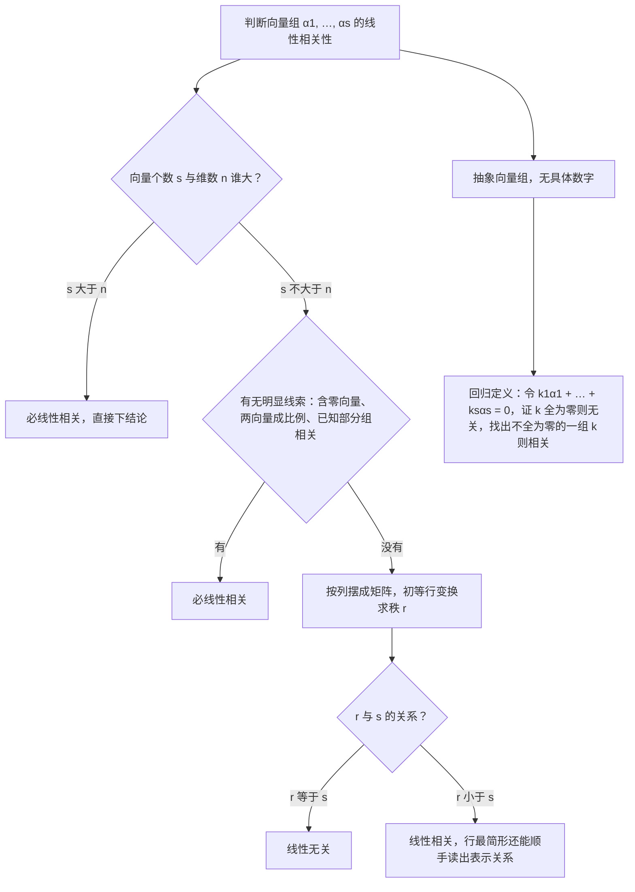

# 第 3 章：向量组与线性相关性

> 本章是线性代数最抽象的一章，也是第 4 章（线性方程组）与第 5 章（对角化判定）的语言基础——"解的结构""能否对角化"本质上都是线性相关问题。数二对本章的考查特点是：**选择题高频考概念辨析，大题常与方程组结合**。学好本章只有一条主线：把"向量语言"与"方程组语言"自由互译，两种语言背后是同一个东西——矩阵的秩。

**本章学习目标**：

- 建立两座等价桥梁："线性表示 $\iff$ 非齐次方程组有解 $\iff$ 秩相等"与"线性相关 $\iff$ 齐次方程组有非零解 $\iff r < s$"，做到向量问题与方程组问题自由互译；
- 熟练用初等行变换求极大无关组，并把其余向量用极大无关组表示（大题标准动作，要求 2 分钟内完成）；
- 掌握内积、施密特正交化与正交矩阵的性质，为第 5/6 章的正交对角化备好全部工具。

---

## 3.1 n 维向量与线性组合

### 1. n 维向量

**定义**： $n$ 个有次序的数 $a_1, a_2, \ldots, a_n$ 组成的数组称为 $n$ 维向量，记作

$$
\alpha = (a_1, a_2, \ldots, a_n)^T \quad \text{或} \quad \alpha = (a_1, a_2, \ldots, a_n)
$$

前者是**列向量**，后者是**行向量**。向量一旦与矩阵打通，就是一个 $n \times 1$ （或 $1 \times n$ ）矩阵，第 2 章的秩、初等变换全部可以搬过来用。

> 💡 **考研约定**：不特别说明时，向量默认指**列向量**；行向量写成转置形式 $(a_1, \ldots, a_n)^T$ 表示列向量。本篇中向量一律按列向量处理，"把向量按列摆成矩阵"是全章最核心的动作。

### 2. 线性组合与线性表示

**定义**：给定向量组 $\alpha_1, \alpha_2, \ldots, \alpha_s$ 与数 $k_1, k_2, \ldots, k_s$ ，称

$$
k_1\alpha_1 + k_2\alpha_2 + \cdots + k_s\alpha_s
$$

为向量组的一个**线性组合**；若存在一组数使 $\beta = k_1\alpha_1 + \cdots + k_s\alpha_s$ ，则称 $\beta$ **可由该向量组线性表示**。

**核心等价（第一座桥梁）**：

$$
\beta \text{ 可由 } \alpha_1, \ldots, \alpha_s \text{ 线性表示} \iff \text{非齐次方程组 } (\alpha_1, \ldots, \alpha_s)x = \beta \text{ 有解} \iff r(\alpha_1, \ldots, \alpha_s) = r(\alpha_1, \ldots, \alpha_s, \beta)
$$

三步互译的逻辑：把 $\beta = k_1\alpha_1 + \cdots + k_s\alpha_s$ 按分量展开，就是以 $k_1, \ldots, k_s$ 为未知量的非齐次方程组，其中系数矩阵的各列正是 $\alpha_1, \ldots, \alpha_s$ 。于是"能否表示"这个几何问题，变成了"方程组有无解"这个代数问题，而后者用第 2 章的秩立刻判定。

**表示的唯一性**：若 $\alpha_1, \ldots, \alpha_s$ **线性无关**且 $\beta$ 可由其线性表示，则表示式**唯一**；若 $\alpha_1, \ldots, \alpha_s$ 线性相关，则表示式要么不存在，要么有无穷多个。

**例 1**（判断能否线性表示）：设 $\alpha_1 = (1, 1, 1)^T$ ， $\alpha_2 = (2, 3, 4)^T$ ， $\alpha_3 = (3, 5, 7)^T$ 。判断 $\beta_1 = (1, 2, 3)^T$ 与 $\beta_2 = (1, 2, 4)^T$ 能否由向量组 $\alpha_1, \alpha_2, \alpha_3$ 线性表示；若能，写出一组表示式。

**解**：先观察组内关系： $\alpha_3 = 2\alpha_2 - \alpha_1$ （验证： $2(2, 3, 4) - (1, 1, 1) = (3, 5, 7)$ ✓），故三个向量线性相关，整个向量组只"撑起"一张平面，秩为 $2$ 。

**(1)** 讨论 $\beta_1$ 。对增广矩阵 $(\alpha_1, \alpha_2, \alpha_3 \mid \beta_1)$ 作初等行变换：

$$
\left(\begin{array}{ccc|c}
1 & 2 & 3 & 1 \\
1 & 3 & 5 & 2 \\
1 & 4 & 7 & 3
\end{array}\right)
\xrightarrow{r_2 - r_1,\ r_3 - r_1}
\left(\begin{array}{ccc|c}
1 & 2 & 3 & 1 \\
0 & 1 & 2 & 1 \\
0 & 2 & 4 & 2
\end{array}\right)
\xrightarrow{r_3 - 2r_2}
\left(\begin{array}{ccc|c}
1 & 2 & 3 & 1 \\
0 & 1 & 2 & 1 \\
0 & 0 & 0 & 0
\end{array}\right)
$$

$r(\alpha_1, \alpha_2, \alpha_3) = r(\alpha_1, \alpha_2, \alpha_3, \beta_1) = 2$ ，方程组有解，故 $\beta_1$ **能**由向量组线性表示。继续化为行最简形：

$$
\xrightarrow{r_1 - 2r_2}
\left(\begin{array}{ccc|c}
1 & 0 & -1 & -1 \\
0 & 1 & 2 & 1 \\
0 & 0 & 0 & 0
\end{array}\right)
$$

取 $x_3 = t$ ，得 $x_1 = -1 + t$ ， $x_2 = 1 - 2t$ ，即

$$
\beta_1 = (t - 1)\alpha_1 + (1 - 2t)\alpha_2 + t\alpha_3, \qquad t \in \mathbb{R}
$$

取 $t = 0$ 得一组表示式 $\beta_1 = -\alpha_1 + \alpha_2$ （验证： $-(1, 1, 1) + (2, 3, 4) = (1, 2, 3)$ ✓）。由于 $\alpha_1, \alpha_2, \alpha_3$ 线性相关，**表示式不唯一**——这与"表示唯一 $\iff$ 向量组无关"完全吻合。

**(2)** 讨论 $\beta_2$ 。增广矩阵前三列相同，只需重看最后一列：

$$
\left(\begin{array}{ccc|c}
1 & 2 & 3 & 1 \\
1 & 3 & 5 & 2 \\
1 & 4 & 7 & 4
\end{array}\right)
\xrightarrow{r_2 - r_1,\ r_3 - r_1}
\left(\begin{array}{ccc|c}
1 & 2 & 3 & 1 \\
0 & 1 & 2 & 1 \\
0 & 2 & 4 & 3
\end{array}\right)
\xrightarrow{r_3 - 2r_2}
\left(\begin{array}{ccc|c}
1 & 2 & 3 & 1 \\
0 & 1 & 2 & 1 \\
0 & 0 & 0 & 1
\end{array}\right)
$$

最后一行出现 $0 = 1$ ，即 $r(\alpha_1, \alpha_2, \alpha_3) = 2 \ne 3 = r(\alpha_1, \alpha_2, \alpha_3, \beta_2)$ ，方程组无解，故 $\beta_2$ **不能**由该向量组线性表示。

**易错点**：

- 只回答"能/不能"不给理由不得分，必须写明秩的等式 $r(\alpha_1, \ldots, \alpha_s) = r(\alpha_1, \ldots, \alpha_s, \beta)$ （或写出 $0 = 1$ 型矛盾行）。
- 向量组线性相关时，能表示也不代表唯一——答题时若题目问"一组表示式"，写出最简的那组即可。

---

## 3.2 线性相关与线性无关

### 1. 定义与等价刻画

**定义**：对向量组 $\alpha_1, \alpha_2, \ldots, \alpha_s$ ，若存在**不全为零**的数 $k_1, k_2, \ldots, k_s$ 使

$$
k_1\alpha_1 + k_2\alpha_2 + \cdots + k_s\alpha_s = 0
$$

则称向量组**线性相关**；否则（即上式仅当 $k_1 = \cdots = k_s = 0$ 时成立）称**线性无关**。

**核心等价（第二座桥梁）**：

$$
\alpha_1, \ldots, \alpha_s \text{ 线性相关} \iff \text{齐次方程组 } (\alpha_1, \ldots, \alpha_s)x = 0 \text{ 有非零解} \iff r(\alpha_1, \ldots, \alpha_s) < s
$$

相应地，线性无关 $\iff$ 齐次方程组只有零解 $\iff r(\alpha_1, \ldots, \alpha_s) = s$ ——秩恰好等于向量个数。

两个最常用的速判结论：

- 两个向量线性相关 $\iff$ 对应分量**成比例**；
- 单个向量 $\alpha$ 线性相关 $\iff \alpha = 0$ 。

### 2. 判定性质（六条，选择题全部弹药）

1. **部分相关 $\Rightarrow$ 整体相关**；逆否：**整体无关 $\Rightarrow$ 部分无关**。注意方向唯一：部分无关推不出整体无关。
2. **$n + 1$ 个 $n$ 维向量必线性相关**。理由：齐次方程组 $(\alpha_1, \ldots, \alpha_{n+1})x = 0$ 中方程个数 $n$ 少于未知量个数 $n + 1$ ，必有自由未知量，必有非零解。
3. **无关组的延伸组仍无关**：把无关组每个向量**添加分量**（变长），所得组仍无关。理由（反证）：若延伸组相关，则存在不全为零的 $k_i$ 使长向量组合为零，看前 $n$ 个分量即知短向量组也相关，矛盾。
4. **含零向量的向量组必线性相关**：取零向量系数为 $1$ 、其余为 $0$ ，即得不全为零的组合。
5. **线性无关组中，任一向量都不能由其余向量线性表示**；等价说法：若某向量可由其余表示，则整体必相关。
6. **相关性等价刻画（ $s \ge 2$ ）**：向量组线性相关 $\iff$ **至少存在一个**向量可由其余 $s - 1$ 个向量线性表示。⚠️ 只能推出"存在一个"，不能推出"任一个都能被表示"。

> **定理（添加向量判相关）**：若 $\alpha_1, \ldots, \alpha_s$ 线性无关，而 $\alpha_1, \ldots, \alpha_s, \beta$ 线性相关，则 $\beta$ 可由 $\alpha_1, \ldots, \alpha_s$ 线性表示，且**表示式唯一**。这是 3.1 节"表示唯一性"的完整版，选择题常考。

### 3. 例题

**例 2**（数字向量组判相关并求秩）：设 $\alpha_1 = (1, 1, 1)^T$ ， $\alpha_2 = (1, 2, 3)^T$ ， $\alpha_3 = (2, 3, 4)^T$ ，判断其线性相关性，并求秩。

**解**：按列摆成矩阵并作初等行变换：

$$
\begin{pmatrix}
1 & 1 & 2 \\
1 & 2 & 3 \\
1 & 3 & 4
\end{pmatrix}
\xrightarrow{r_2 - r_1,\ r_3 - r_1}
\begin{pmatrix}
1 & 1 & 2 \\
0 & 1 & 1 \\
0 & 2 & 2
\end{pmatrix}
\xrightarrow{r_3 - 2r_2}
\begin{pmatrix}
1 & 1 & 2 \\
0 & 1 & 1 \\
0 & 0 & 0
\end{pmatrix}
\xrightarrow{r_1 - r_2}
\begin{pmatrix}
1 & 0 & 1 \\
0 & 1 & 1 \\
0 & 0 & 0
\end{pmatrix}
$$

秩 $r = 2 < 3 = s$ ，故向量组**线性相关**。由行最简形第 3 列 $(1, 1)^T$ 直接读出关系： $\alpha_3 = \alpha_1 + \alpha_2$ （验证： $(1, 1, 1) + (1, 2, 3) = (2, 3, 4)$ ✓）。

**例 3**（含参数的线性相关性）：设 $\alpha_1 = (1, 1, 1)^T$ ， $\alpha_2 = (1, 2, 3)^T$ ， $\alpha_3 = (1, 3, t)^T$ ，讨论 $t$ 取何值时向量组线性相关。

**解**：三个 $3$ 维向量的相关性看行列式：

$$
\begin{vmatrix}
1 & 1 & 1 \\
1 & 2 & 3 \\
1 & 3 & t
\end{vmatrix}
= 1 \cdot (2t - 9) - 1 \cdot (t - 3) + 1 \cdot (3 - 2) = t - 5
$$

- **$t = 5$ 时**，行列式为 $0$ ，向量组线性相关。此时行变换得行最简形

$$
\begin{pmatrix}
1 & 0 & -1 \\
0 & 1 & 2 \\
0 & 0 & 0
\end{pmatrix}
$$

秩为 $2$ ，且 $\alpha_3 = 2\alpha_2 - \alpha_1$ （验证： $2(1, 2, 3) - (1, 1, 1) = (1, 3, 5)$ ✓）。
- **$t \ne 5$ 时**，行列式不为 $0$ ，三个向量线性无关。

**小结**： $n$ 个 $n$ 维向量判相关性，优先算行列式（快）；个数与维数不等时，老老实实行变换求秩对参数分类。

**例 4**（概念辨析，选择题模式）：判断下列命题的真假。

**(1)** 若 $\alpha_1, \ldots, \alpha_s$ （ $s \ge 2$ ）线性相关，则其中**任一**向量都可由其余向量线性表示。

**假**。只能保证"**存在**一个"。反例： $\alpha_1 = (1, 0)^T$ ， $\alpha_2 = (2, 0)^T$ ， $\alpha_3 = (0, 1)^T$ 线性相关（ $\alpha_2 = 2\alpha_1$ ），但 $\alpha_3$ 无法由 $\alpha_1, \alpha_2$ 表示（它们的第二分量恒为 $0$ ）。

**(2)** 若 $\alpha_1, \ldots, \alpha_s$ 线性无关， $\alpha_1, \ldots, \alpha_s, \beta$ 线性相关，则 $\beta$ 可由 $\alpha_1, \ldots, \alpha_s$ 唯一线性表示。

**真**。这正是"添加向量判相关"定理的标准表述。

**(3)** 若 $\alpha_1, \alpha_2, \alpha_3$ 线性无关，则 $\alpha_1 + \alpha_2$ ， $\alpha_2 + \alpha_3$ ， $\alpha_3 + \alpha_1$ 也线性无关。

**真**。设 $k_1(\alpha_1 + \alpha_2) + k_2(\alpha_2 + \alpha_3) + k_3(\alpha_3 + \alpha_1) = 0$ ，整理得

$$
(k_1 + k_3)\alpha_1 + (k_1 + k_2)\alpha_2 + (k_2 + k_3)\alpha_3 = 0
$$

由 $\alpha_1, \alpha_2, \alpha_3$ 无关，系数全为零，系数行列式

$$
\begin{vmatrix}
1 & 0 & 1 \\
1 & 1 & 0 \\
0 & 1 & 1
\end{vmatrix}
= 1 + 1 = 2 \ne 0
$$

故 $k_1 = k_2 = k_3 = 0$ ，新组无关。💡 一般结论：无关组经"系数行列式不为零"的线性替换后仍无关。

**(4)** 若 $\alpha_1, \alpha_2$ 线性相关， $\beta_1, \beta_2$ 线性相关，则 $\alpha_1 + \beta_1$ ， $\alpha_2 + \beta_2$ 线性相关。

**假**。反例：取 $\alpha_1 = (1, 0)^T$ ， $\alpha_2 = (2, 0)^T$ ； $\beta_1 = (0, 1)^T$ ， $\beta_2 = (0, -1)^T$ ，两组各自相关。但 $\alpha_1 + \beta_1 = (1, 1)^T$ ， $\alpha_2 + \beta_2 = (2, -1)^T$ ，行列式 $-1 - 2 = -3 \ne 0$ ，新组**无关**。

---

## 3.3 极大无关组与向量组的秩

### 1. 极大无关组的定义（两个条件）

设向量组 $T$ 的部分组 $\alpha_1, \ldots, \alpha_r$ 满足：

1. $\alpha_1, \ldots, \alpha_r$ **线性无关**；
2. $T$ 中**任一向量**都可由 $\alpha_1, \ldots, \alpha_r$ 线性表示（等价说法：再往里添 $T$ 中任何向量，新组必相关）。

则称 $\alpha_1, \ldots, \alpha_r$ 为 $T$ 的一个**极大无关组**，其所含向量个数 $r$ 称为向量组 $T$ 的**秩**，记作 $r(T)$ 。

**与矩阵秩的统一**：把向量组按列摆成矩阵 $A$ ，则**向量组的秩 = 矩阵列向量组的秩 = $r(A)$** 。这是"行变换求秩"合法性的根基。

> ⚠️ 极大无关组**不唯一**（例如 $\{e_1, e_2\}$ 与 $\{e_2, e_1 + e_2\}$ 都是同一组的极大无关组），但**所含向量个数唯一**，这个个数就是秩。

### 2. 用初等行变换求极大无关组（大题标准流程）

**步骤**：

1. 把向量组 $\alpha_1, \ldots, \alpha_s$ **按列**摆成矩阵 $A$ ；
2. 对 $A$ 作**初等行变换**，化为**行最简形**；
3. **主元（每行首个非零元）所在列**对应的原向量构成一个极大无关组；
4. 行最简形中第 $j$ 列的数字，就是 $\alpha_j$ 用主元列向量表示时的系数（按分量逐行读）。

**原理**：行变换不改变列向量之间的线性关系——行最简形中主元列是标准单位向量，其余列的数字恰好给出它由主元列表示的系数，而这一关系在原矩阵中同样成立。

**例 5**（求极大无关组并表示其余向量）：设 $\alpha_1 = (1, 1, 1)^T$ ， $\alpha_2 = (0, 1, 2)^T$ ， $\alpha_3 = (1, 3, 5)^T$ ， $\alpha_4 = (2, 1, 0)^T$ 。求一个极大无关组，并把其余向量用该组线性表示。

**解**：按列摆成 $3 \times 4$ 矩阵，作初等行变换：

$$
\begin{pmatrix}
1 & 0 & 1 & 2 \\
1 & 1 & 3 & 1 \\
1 & 2 & 5 & 0
\end{pmatrix}
\xrightarrow{r_2 - r_1,\ r_3 - r_1}
\begin{pmatrix}
1 & 0 & 1 & 2 \\
0 & 1 & 2 & -1 \\
0 & 2 & 4 & -2
\end{pmatrix}
\xrightarrow{r_3 - 2r_2}
\begin{pmatrix}
1 & 0 & 1 & 2 \\
0 & 1 & 2 & -1 \\
0 & 0 & 0 & 0
\end{pmatrix}
$$

已是行最简形，主元位于第 $1$ 、 $2$ 列，故 $\alpha_1, \alpha_2$ 构成一个极大无关组，向量组的秩为 $2$ 。

读第 $3$ 列 $(1, 2)^T$ 与第 $4$ 列 $(2, -1)^T$ 的系数：

$$
\alpha_3 = \alpha_1 + 2\alpha_2, \qquad \alpha_4 = 2\alpha_1 - \alpha_2
$$

**验算**： $\alpha_1 + 2\alpha_2 = (1, 1 + 2, 1 + 4) = (1, 3, 5)$ ✓； $2\alpha_1 - \alpha_2 = (2 - 0, 2 - 1, 2 - 2) = (2, 1, 0)$ ✓。

> 💡 极大无关组不唯一：本例中 $\{\alpha_1, \alpha_3\}$ 、 $\{\alpha_2, \alpha_4\}$ 等也都是极大无关组（只要无关且个数等于秩 $2$ ）。考试写"主元列"那组即可，最省事且不会错。

### 3. 向量组等价

**定义**：若向量组 (I) 中每个向量都可由 (II) 线性表示，且 (II) 中每个向量都可由 (I) 线性表示，称两组**等价**。

**判定**：记 (I)、(II) 摆成的矩阵合并为 $(A, B)$ ，则

$$
\text{(I) 与 (II) 等价} \iff r(A) = r(B) = r(A, B)
$$

（比"互相可表示"好用得多——三个秩一算便知。）

### 4. 核心定理（抽象题的引擎）

1. **秩的界**：对 $m \times n$ 矩阵 $A$ ，有 $r(A) \le \min(m, n)$ 。 $n$ 维空间里再多的向量，秩也不会超过 $n$ 。
2. **表示不增秩**：若向量组 $A$ 可由向量组 $B$ 线性表示，则 $r(A) \le r(B)$ 。直观理解： $A$ 全部装在 $B$ 张成的空间里，"承载空间"的维数不会更小。推论： $A$ 可由 $B$ 表示、 $B$ 可由 $A$ 表示（即等价） $\Rightarrow r(A) = r(B)$ 。
3. **等价向量组同秩**：由 2 立得。

**例 6**（抽象秩问题）：设向量组 (I) $: \alpha_1, \alpha_2, \alpha_3$ ；向量组 (II) $: \alpha_1, \alpha_2, \alpha_3, \alpha_4$ ，且 $r(\text{I}) = r(\text{II}) = 3$ 。

**(1)** 证明： $\alpha_4$ 可由 (I) 唯一线性表示。

**(2)** 若另有向量组 (III) $: \alpha_1, \alpha_2, \alpha_3, \alpha_5$ 满足 $r(\text{III}) = 4$ ，判断 $\alpha_4 + \alpha_5$ 能否由 (I) 线性表示。

**解**：

**(1)** 因 $r(\text{II}) = 3 = r(\text{I})$ ，往 (I) 中添加 $\alpha_4$ 秩不变。若 $\alpha_4$ 不能由 (I) 表示，则秩至少增加 $1$ ，得 $r(\text{II}) \ge 4$ ，矛盾。故 $\alpha_4$ 可由 (I) 表示。又 $r(\text{I}) = 3$ 等于向量个数，知 $\alpha_1, \alpha_2, \alpha_3$ 线性无关，由表示唯一性定理，表示式**唯一**。

**(2)** **不能**。反证：若 $\alpha_4 + \alpha_5$ 可由 (I) 表示，由 (1) 知 $\alpha_4$ 也可由 (I) 表示，则

$$
\alpha_5 = (\alpha_4 + \alpha_5) - \alpha_4
$$

也可由 (I) 表示，于是 (III) 整组可由 (I) 表示，得 $r(\text{III}) \le r(\text{I}) = 3$ ，与 $r(\text{III}) = 4$ 矛盾。故 $\alpha_4 + \alpha_5$ 不能由 (I) 线性表示。

> 💡 这类题的全部工具就是"表示 $\Rightarrow$ 秩不增"这一条不等式，正反两个方向反复使用。考试遇到抽象向量组证明题，先问自己：谁被谁表示？秩怎么比较？

---

## 3.4 内积、正交与施密特正交化

本节是数二大纲明确要求的内容，更是第 5 章（实对称矩阵正交对角化）与第 6 章（正交变换化二次型）大题的**固定前置步骤**，必须练到零失误。

### 1. 内积、长度与正交

**内积**：对两个 $n$ 维实向量 $\alpha = (a_1, \ldots, a_n)^T$ ， $\beta = (b_1, \ldots, b_n)^T$ ，定义

$$
(\alpha, \beta) = \alpha^T\beta = a_1b_1 + a_2b_2 + \cdots + a_nb_n
$$

即"对应分量相乘再相加"。内积满足交换律与对第一变元的线性性。

**长度（范数）**：

$$
\lVert \alpha \rVert = \sqrt{(\alpha, \alpha)} = \sqrt{a_1^2 + a_2^2 + \cdots + a_n^2}
$$

长度为 $1$ 的向量称**单位向量**；任何非零向量除以自身长度即单位化： $\dfrac{\alpha}{\lVert \alpha \rVert}$ 。

**夹角**： $\cos \theta = \dfrac{(\alpha, \beta)}{\lVert \alpha \rVert \lVert \beta \rVert}$ （由柯西不等式 $\lvert (\alpha, \beta) \rvert \le \lVert \alpha \rVert \lVert \beta \rVert$ 保证分母不为零且余弦值合法）。

**正交**： $(\alpha, \beta) = 0$ 时称 $\alpha$ 与 $\beta$ **正交**。零向量与任何向量正交。若向量组中任意两个不同向量都正交（且均非零），称**正交向量组**。

**定理（正交必无关）**：正交向量组必线性无关。

**证**： 设 $(\alpha_i, \alpha_j) = 0\ (i \ne j)$ 且 $(\alpha_i, \alpha_i) \ne 0$ 。令 $k_1\alpha_1 + \cdots + k_s\alpha_s = 0$ ，两边与 $\alpha_j$ 作内积： $k_j(\alpha_j, \alpha_j) = 0$ ，故 $k_j = 0$ ，对每个 $j$ 成立。∎

### 2. 施密特（Schmidt）正交化

**目标**：把线性无关组 $\alpha_1, \alpha_2, \alpha_3$ 改造成**两两正交**的 $\beta_1, \beta_2, \beta_3$ （再单位化）。思想：从新向量中**减去它在已正交方向上的投影**。

$$
\beta_1 = \alpha_1, \qquad
\beta_2 = \alpha_2 - \frac{(\alpha_2, \beta_1)}{(\beta_1, \beta_1)}\beta_1, \qquad
\beta_3 = \alpha_3 - \frac{(\alpha_3, \beta_1)}{(\beta_1, \beta_1)}\beta_1 - \frac{(\alpha_3, \beta_2)}{(\beta_2, \beta_2)}\beta_2
$$

每个系数 $\dfrac{(\alpha_i, \beta_j)}{(\beta_j, \beta_j)}$ 的含义： $\alpha_i$ 在 $\beta_j$ 方向上的投影占比，**分母 $(\beta_j, \beta_j)$ 不要丢**。

**正交化完成后单位化**： $\eta_i = \dfrac{\beta_i}{\lVert \beta_i \rVert}$ ，得到**标准正交向量组**（两两正交且都是单位向量）。

**例 7**（施密特正交化完整计算）：设 $\alpha_1 = (1, 1, 0)^T$ ， $\alpha_2 = (1, 0, 1)^T$ ， $\alpha_3 = (0, 1, 1)^T$ ，用施密特正交化将其标准正交化。

**解**：先验证无关（行列式 $-2 \ne 0$ ，亦可直接看出任两个都不成比例）。

**第一步**： $\beta_1 = \alpha_1 = (1, 1, 0)^T$ 。

**第二步**： $(\alpha_2, \beta_1) = 1$ ， $(\beta_1, \beta_1) = 2$ ，

$$
\beta_2 = \alpha_2 - \frac{1}{2}\beta_1 = (1, 0, 1)^T - \frac{1}{2}(1, 1, 0)^T = \left(\frac{1}{2}, -\frac{1}{2}, 1\right)^T
$$

💡 为避免后续出现分数，可取 $\gamma_2 = 2\beta_2 = (1, -1, 2)^T$ 继续计算——对正交中间结果作**数乘不破坏正交性**，且单位化结果不变。

**第三步**： $(\alpha_3, \beta_1) = 1$ ，系数 $\dfrac{1}{2}$ ； $(\alpha_3, \gamma_2) = 0 - 1 + 2 = 1$ ， $(\gamma_2, \gamma_2) = 6$ ，系数 $\dfrac{1}{6}$ ，于是

$$
\beta_3 = \alpha_3 - \frac{1}{2}\beta_1 - \frac{1}{6}\gamma_2 = (0, 1, 1)^T - \frac{1}{2}(1, 1, 0)^T - \frac{1}{6}(1, -1, 2)^T = \left(-\frac{2}{3}, \frac{2}{3}, \frac{2}{3}\right)^T
$$

取 $\gamma_3 = \dfrac{3}{2}\beta_3 = (-1, 1, 1)^T$ 。

**验算正交性**： $(1, 1, 0) \cdot (1, -1, 2) = 0$ ✓； $(1, 1, 0) \cdot (-1, 1, 1) = 0$ ✓； $(1, -1, 2) \cdot (-1, 1, 1) = -1 - 1 + 2 = 0$ ✓。

**单位化**： $\lVert \gamma_1 \rVert = \sqrt{2}$ ， $\lVert \gamma_2 \rVert = \sqrt{6}$ ， $\lVert \gamma_3 \rVert = \sqrt{3}$ ，得

$$
\eta_1 = \frac{1}{\sqrt{2}}\begin{pmatrix} 1 \\ 1 \\ 0 \end{pmatrix}, \qquad
\eta_2 = \frac{1}{\sqrt{6}}\begin{pmatrix} 1 \\ -1 \\ 2 \end{pmatrix}, \qquad
\eta_3 = \frac{1}{\sqrt{3}}\begin{pmatrix} -1 \\ 1 \\ 1 \end{pmatrix}
$$

### 3. 正交矩阵

**定义**：若 $n$ 阶实方阵 $A$ 满足

$$
A^TA = E
$$

则称 $A$ 为**正交矩阵**。

**等价刻画**： $A$ 为正交矩阵 $\iff$ $A$ 的**列**向量组（同样地，**行**向量组）是标准正交向量组——每个列（行）向量都是单位向量，且两两正交。

**核心性质**：

1. $\lvert A \rvert = \pm 1$ （对 $A^TA = E$ 两边取行列式即得 $\lvert A \rvert^2 = 1$ ）；
2. $A^{-1} = A^T$ （正交矩阵的逆不必硬求，转置即得）；
3. $A^{-1}$ 、 $A^T$ 也是正交矩阵；两个正交矩阵之积仍正交；
4. **保持内积与长度**： $(Ax, Ay) = x^TA^TAy = (x, y)$ ，特别地 $\lVert Ax \rVert = \lVert x \rVert$ ——正交变换不改变向量的长度与夹角，这正是第 6 章用正交变换化二次型时"曲线形状不变"的原因。

**例 8**（正交矩阵求参数）：设 $A = \begin{pmatrix} \dfrac{3}{5} & a \\[2pt] \dfrac{4}{5} & b \end{pmatrix}$ 为正交矩阵，求 $a, b$ 与 $\lvert A \rvert$ 。

**解**：正交矩阵的列向量组是标准正交组。第一列 $\left(\dfrac{3}{5}, \dfrac{4}{5}\right)^T$ 已是单位向量，于是第二列 $(a, b)^T$ 需满足：

$$
\begin{cases}
a^2 + b^2 = 1 & \text{（单位长度）} \\
\dfrac{3}{5}a + \dfrac{4}{5}b = 0 & \text{（两列正交）}
\end{cases}
$$

由第二式 $3a = -4b$ ，设 $a = 4k$ ， $b = -3k$ ，代入第一式： $25k^2 = 1$ ， $k = \pm \dfrac{1}{5}$ ，故

$$
(a, b) = \left(\frac{4}{5}, -\frac{3}{5}\right) \quad \text{或} \quad \left(-\frac{4}{5}, \frac{3}{5}\right)
$$

对应行列式： $k = \dfrac{1}{5}$ 时 $\lvert A \rvert = \dfrac{3}{5} \cdot \left(-\dfrac{3}{5}\right) - \dfrac{4}{5} \cdot \dfrac{4}{5} = -1$ ； $k = -\dfrac{1}{5}$ 时 $\lvert A \rvert = 1$ 。两解都满足 $\lvert A \rvert = \pm 1$ ，与性质 1 吻合。

附带一提： $k = \dfrac{1}{5}$ 时 $A = \begin{pmatrix} \frac{3}{5} & \frac{4}{5} \\[2pt] \frac{4}{5} & -\frac{3}{5} \end{pmatrix}$ 是对称矩阵，此时 $A^{-1} = A^T = A$ ，验证： $A^2 = E$ ✓。

> 💡 **说明**：向量空间（基、维数、基变换、坐标变换、过渡矩阵）为**数一专属内容**，数二大纲不要求，本文不展开。数二考生在真题中看到"过渡矩阵""基"字样可直接跳过，把精力集中在相关性、秩与正交化上即可。

---

## 本章小结

### 一、知识框架

```text
向量组与线性相关性
├── 3.1 线性组合与表示
│     β 可由 α 组表示 ⟺ (α₁,…,αs)x = β 有解 ⟺ r(α组) = r(α组, β)
│     α 组无关 ⇒ 表示唯一；相关 ⇒ 不存在或无穷多
├── 3.2 线性相关性
│     相关 ⟺ 存在不全为零的 kᵢ 使 Σkᵢαᵢ = 0 ⟺ 齐次方程组有非零解 ⟺ r < s
│     六大性质：部分相关⇒整体相关；整体无关⇒部分无关；
│     n+1 个 n 维必相关；延伸组仍无关；无关组任一向量不可由其余表示；
│     含零向量必相关
├── 3.3 极大无关组与秩
│     定义两条件：① 无关 ② 能表示组内所有向量
│     求法：列摆矩阵 → 行最简形 → 主元列即极大无关组 → 读系数表示其余
│     核心定理：r(A) ≤ min(m,n)；可表示 ⇒ 秩不增；等价向量组同秩
└── 3.4 内积与正交
      内积 (α,β) = αᵀβ → 长度 → 单位化 → 正交
      正交向量组必线性无关
      施密特正交化：减去已正交方向上的投影，最后单位化
      正交矩阵 AᵀA = E：|A| = ±1、A⁻¹ = Aᵀ、保持内积与长度
```

### 二、方法决策流程图（判断线性相关性走哪条路）



### 三、易错点汇总表

| 易错点 | 正确认识 |
|--------|----------|
| 认为"相关组中任一向量都能由其余表示" | 只能保证**存在**一个。反例： $\alpha_1 = (1, 0)^T$ ， $\alpha_2 = (2, 0)^T$ ， $\alpha_3 = (0, 1)^T$ 相关，但 $\alpha_3$ 不能由前两个表示 |
| 从"部分无关"推"整体无关" | 方向只有一条：整体无关 $\Rightarrow$ 部分无关；部分无关推不出整体无关 |
| 求极大无关组时用列变换 | ⚠️ 必须**行变换**；列变换会破坏列向量之间的表示关系 |
| 读主元列系数时错位 | 行最简形第 $j$ 列的数字（自上而下）就是 $\alpha_j$ 用主元列表示的系数，与主元列的排列顺序一一对应 |
| 施密特公式漏掉分母 $(\beta_j, \beta_j)$ | 系数是投影比例 $\dfrac{(\alpha_i, \beta_j)}{(\beta_j, \beta_j)}$ ，分母不能丢 |
| 认为正交矩阵行列式必为 $1$ | $\lvert A \rvert = \pm 1$ ，旋转类矩阵取 $1$ ，反射类取 $-1$ |
| 认为线性表示式总是唯一 | 仅当被表示者所在的**系数向量组无关**时才唯一（见例 1） |

### 四、考试重点

1. **概念辨析选择题**：相关性命题真假判断（例 4 模式），数二几乎每年以某种形式出现，六大性质 + 反例库要烂熟；
2. **含参数讨论**：行列式（ $n$ 个 $n$ 维向量 ）或秩（个数与维数不等）对参数分类，如例 3；
3. **极大无关组大题**：行最简形 + 表示其余向量（例 5），与第 4 章解方程组是同一套动作，务必合并练习；
4. **抽象秩推理**： $r(A) \le r(B)$ 正反两用（例 6），是证明题的核心引理；
5. **施密特正交化 + 正交矩阵**（例 7、例 8）：第 5/6 章正交对角化大题的固定步骤，本章练熟，后面直接调用。

---

## 📝 动手练习

> **要求**：先独立完成再对答案，每题限时 6-8 分钟；涉及施密特正交化的题目，务必逐步验算内积为零、长度为一。
> **预期效果**：拿到具体向量组，能不假思索地完成"列摆矩阵 → 行变换 → 读秩 → 读极大无关组 → 读表示关系"全流程；抽象命题能迅速调用六大性质或构造反例。

**练习 1**：设 $\alpha_1 = (1, 0, 1)^T$ ， $\alpha_2 = (0, 1, 1)^T$ ， $\alpha_3 = (1, 1, 3)^T$ ， $\beta = (1, 1, 2)^T$ 。判断 $\beta$ 能否由 $\alpha_1, \alpha_2, \alpha_3$ 线性表示；若能，写出表示式并说明是否唯一。

- 💡 提示：对增广矩阵 $(\alpha_1, \alpha_2, \alpha_3 \mid \beta)$ 作行变换；先看系数矩阵是否无关（ $3$ 个 $3$ 维向量可算行列式 ），无关则解唯一。
- ✅ 参考答案：行列式 $= 1 \ne 0$ ，系数矩阵满秩， $\beta$ **能**表示且**唯一**。行变换解得 $x_1 = 1$ ， $x_2 = 1$ ， $x_3 = 0$ ，即 $\beta = \alpha_1 + \alpha_2$ （验证： $(1, 0, 1) + (0, 1, 1) = (1, 1, 2)$ ✓）。

**练习 2**：设 $\alpha_1 = (1, 1, 1)^T$ ， $\alpha_2 = (1, 2, 3)^T$ ， $\alpha_3 = (1, 4, t)^T$ ，讨论 $t$ 取何值时向量组线性相关；相关时写出一个线性关系式。

- 💡 提示： $3$ 个 $3$ 维向量，算行列式对 $t$ 分类；相关时对矩阵化行最简形读系数。
- ✅ 参考答案：行列式 $= t - 7$ 。 $t = 7$ 时线性相关（秩为 $2$ ），且 $\alpha_3 = 3\alpha_2 - 2\alpha_1$ （验证： $3(1, 2, 3) - 2(1, 1, 1) = (1, 4, 7)$ ✓）； $t \ne 7$ 时线性无关。

**练习 3**：设 $\alpha_1 = (1, 1, 2)^T$ ， $\alpha_2 = (2, 1, 1)^T$ ， $\alpha_3 = (4, 3, 5)^T$ ， $\alpha_4 = (3, 1, 0)^T$ 。求一个极大无关组，并把其余向量用该组线性表示。

- 💡 提示： $4$ 个 $3$ 维向量必相关；列摆矩阵化行最简形，主元列选极大无关组，其余列按分量读系数。
- ✅ 参考答案：行最简形为 $\begin{pmatrix} 1 & 0 & 2 & -1 \\ 0 & 1 & 1 & 2 \\ 0 & 0 & 0 & 0 \end{pmatrix}$ ，极大无关组取 $\{\alpha_1, \alpha_2\}$ ，秩为 $2$ ，且 $\alpha_3 = 2\alpha_1 + \alpha_2$ ， $\alpha_4 = 2\alpha_2 - \alpha_1$ （验算： $2(1, 1, 2) + (2, 1, 1) = (4, 3, 5)$ ✓； $2(2, 1, 1) - (1, 1, 2) = (3, 1, 0)$ ✓）。

**练习 4**：设 $\alpha_1 = (1, 1, 1)^T$ ， $\alpha_2 = (0, 1, 2)^T$ ，用施密特正交化将其标准正交化。

- 💡 提示：先正交化 $\beta_2 = \alpha_2 - \dfrac{(\alpha_2, \beta_1)}{(\beta_1, \beta_1)}\beta_1$ ，本题系数恰好是整数；再各自除以长度。
- ✅ 参考答案： $\beta_1 = (1, 1, 1)^T$ ； $(\alpha_2, \beta_1) = 3 = (\beta_1, \beta_1)$ ，故 $\beta_2 = \alpha_2 - \beta_1 = (-1, 0, 1)^T$ 。单位化得 $\eta_1 = \dfrac{1}{\sqrt{3}}(1, 1, 1)^T$ ， $\eta_2 = \dfrac{1}{\sqrt{2}}(-1, 0, 1)^T$ （验算：内积 $-1 + 0 + 1 = 0$ ✓）。
