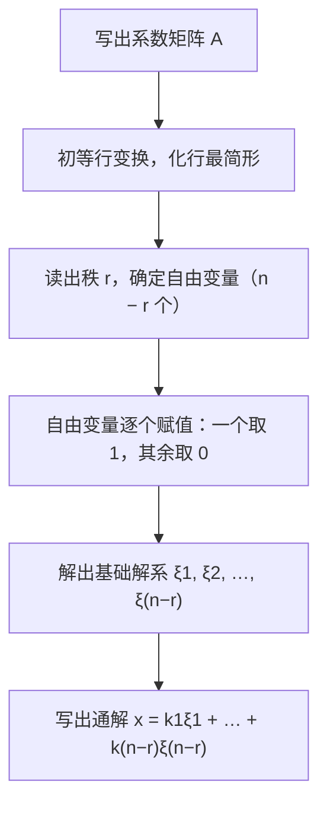
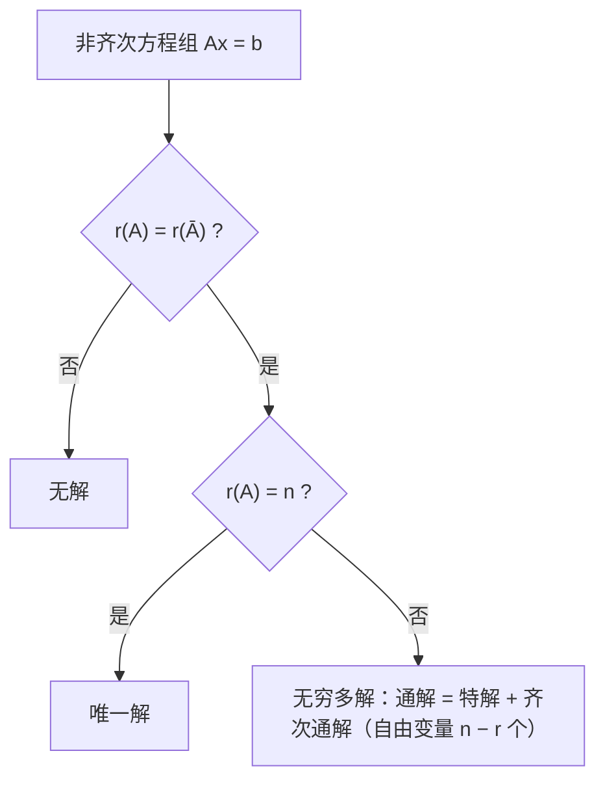

# 第 4 章：线性方程组

> 线性方程组是数二线代**解答题的两大高频方向之一**（另一个是特征值与二次型），几乎隔年出一道大题，选择题、填空题也常年围绕"解的判定与结构"命题。本章的工具全部来自前两章：**第 2 章的秩**负责"判定有没有解、有多少解"，**第 3 章的线性相关性**负责"把解描述清楚（基础解系、通解结构）"。学完本章你会发现：解方程组，本质上就是"用秩说话、用相关性写解"。

**本章学习目标**：

- 熟练用 $r(A)$ 与 $r(\bar{A})$ 判定方程组解的情况，掌握基础解系与"通解 = 特解 + 齐次通解"的结构，能完整求解含参数方程组；
- 掌握数二大题的三大固定套路：**含参数讨论通解**、**公共解**、**同解**；
- 会处理抽象方程组问题：由解的性质做构造与证明，掌握核心不等式 $AB = O \Rightarrow r(A) + r(B) \le n$ 。

---

## 4.1 齐次线性方程组

### 4.1.1 基本形式与非零解的判定

含 $n$ 个未知数、 $m$ 个方程的齐次线性方程组可写成矩阵形式

$$
Ax = 0
$$

其中 $A$ 是 $m \times n$ 系数矩阵， $x = (x_1, x_2, \cdots, x_n)^T$ 。

齐次方程组**永远有零解** $x = 0$ ，所以核心问题只有一个：**什么时候有非零解？**

> **定理**：齐次方程组 $Ax = 0$ 有非零解 $\iff r(A) < n$ （即秩小于未知数个数）。

两条等价说法（选择题常用）：

- $m < n$ （方程个数少于未知数个数） $\Rightarrow$ 必有非零解（因为 $r(A) \le m < n$ ）；
- $m = n$ 时，有非零解 $\iff |A| = 0$ （4.3 节克莱姆法则的推论）。

**为什么**：把 $A$ 化为行最简形后，非零行的行数就是 $r(A)$ ，剩下的 $n - r(A)$ 个变量是**自由变量**。只要自由变量存在（即 $r(A) < n$ ），给它赋一组不全为零的值，就得到一个非零解。

### 4.1.2 解的性质

齐次方程组的解有两条性质（各用一行即证）：

1. 若 $\xi_1, \xi_2$ 是 $Ax = 0$ 的解，则 $\xi_1 + \xi_2$ 也是解（ $A(\xi_1 + \xi_2) = 0 + 0 = 0$ ）；
2. 若 $\xi$ 是 $Ax = 0$ 的解， $k$ 为任意常数，则 $k\xi$ 也是解（ $A(k\xi) = k \cdot 0 = 0$ ）。

合起来：**任意解的线性组合仍是解**。于是解的全体对线性运算封闭（构成一个向量空间，称为**解空间**），基础解系就是它的一组基。

### 4.1.3 基础解系与通解结构

> **定义（基础解系）**：若向量组 $\xi_1, \xi_2, \cdots, \xi_s$ 满足
>
> 1. 每一个 $\xi_i$ 都是 $Ax = 0$ 的解；
> 2. $\xi_1, \xi_2, \cdots, \xi_s$ 线性无关；
> 3. $Ax = 0$ 的任一解都可由它们线性表示；
>
> 则称 $\xi_1, \xi_2, \cdots, \xi_s$ 为 $Ax = 0$ 的一个**基础解系**。

> **核心结论**：若 $r(A) = r < n$ ，则 $Ax = 0$ 存在基础解系，且**每个基础解系恰含 $n - r$ 个向量**，即解空间维数 $= n - r$ 。通解为
>
> $$
> x = k_1\xi_1 + k_2\xi_2 + \cdots + k_{n-r}\xi_{n-r} \quad (k_1, k_2, \cdots, k_{n-r} \text{ 为任意常数})
> $$

**个数为什么是 $n - r$**（两句话证明）：行最简形下，解由自由变量唯一决定——让自由变量"轮流取 $1$ 、其余取 $0$"，得到的 $n - r$ 个解以自由变量为"标识"，必线性无关（条件 2）；另一方面任一解的自由变量取值都可写成这 $n - r$ 个"标识向量"取值的组合，故可被它们线性表示（条件 3）。

⚠️ **注意**：基础解系**不唯一**（自由变量换一组赋值就换一组基础解系），但**向量个数唯一**，都是 $n - r$ 个。判卷只认"是解、无关、能表示"三条，怎么取都对。

### 4.1.4 求解流程



**例 1**（求基础解系与通解）：解方程组

$$
\begin{cases}
x_1 + x_2 + 2x_4 = 0 \\
x_1 - x_2 + 2x_3 - 2x_4 = 0 \\
2x_1 + x_2 + x_3 + 2x_4 = 0
\end{cases}
$$

**解**：对系数矩阵做初等行变换：

$$
A = \begin{pmatrix} 1 & 1 & 0 & 2 \\ 1 & -1 & 2 & -2 \\ 2 & 1 & 1 & 2 \end{pmatrix}
\xrightarrow[r_3 - 2r_1]{r_2 - r_1}
\begin{pmatrix} 1 & 1 & 0 & 2 \\ 0 & -2 & 2 & -4 \\ 0 & -1 & 1 & -2 \end{pmatrix}
\xrightarrow[r_3 \times (-1)]{r_2 \times (-\frac{1}{2})}
\begin{pmatrix} 1 & 1 & 0 & 2 \\ 0 & 1 & -1 & 2 \\ 0 & 1 & -1 & 2 \end{pmatrix}
$$

$$
\xrightarrow{r_3 - r_2}
\begin{pmatrix} 1 & 1 & 0 & 2 \\ 0 & 1 & -1 & 2 \\ 0 & 0 & 0 & 0 \end{pmatrix}
\xrightarrow{r_1 - r_2}
\begin{pmatrix} 1 & 0 & 1 & 0 \\ 0 & 1 & -1 & 2 \\ 0 & 0 & 0 & 0 \end{pmatrix}
$$

行最简形对应的同解方程组为

$$
\begin{cases}
x_1 = -x_3 \\
x_2 = x_3 - 2x_4
\end{cases}
$$

$r(A) = 2 < 4 = n$ ，自由变量为 $x_3, x_4$ ，基础解系含 $4 - 2 = 2$ 个向量：

- 取 $x_3 = 1,\ x_4 = 0$ ： $\xi_1 = (-1,\ 1,\ 1,\ 0)^T$ ；
- 取 $x_3 = 0,\ x_4 = 1$ ： $\xi_2 = (0,\ -2,\ 0,\ 1)^T$ 。

故通解为

$$
x = k_1\begin{pmatrix} -1 \\ 1 \\ 1 \\ 0 \end{pmatrix} + k_2\begin{pmatrix} 0 \\ -2 \\ 0 \\ 1 \end{pmatrix} \quad (k_1, k_2 \text{ 为任意常数})
$$

**回代验证**： $\xi_1$ 代入三式得 $-1 + 1 = 0$ 、 $-1 - 1 + 2 = 0$ 、 $-2 + 1 + 1 = 0$ ； $\xi_2$ 代入得 $-2 + 2 = 0$ 、 $2 - 2 = 0$ 、 $-2 + 2 = 0$ ，均成立 ✓。

**易错点**：

- 行最简形每一行的主元位置对应哪个变量要认准，别把同解方程组写错位；
- 自由变量赋值"一次只让一个取 $1$ ，其余取 $0$"，这是保证基础解系线性无关的标准做法；
- 通解末尾必须注明" $k_1, k_2$ 为任意常数"，漏写会扣分。

---

## 4.2 非齐次线性方程组

### 4.2.1 有解的判定

记增广矩阵 $\bar{A} = (A \mid b)$ ，即在系数矩阵右侧拼上常数列。

> **定理**： $Ax = b$ 有解 $\iff r(A) = r(\bar{A})$ 。

从第 3 章的视角看： $Ax = b$ 有解 $\iff$ $b$ 能由 $A$ 的列向量组线性表示 $\iff$ 添加向量 $b$ 后秩不增加。这正是"秩判定线性表示"的直接应用。

### 4.2.2 解的情况判定表

综合秩的三种关系，解的情况完全确定（与本库 readme 判定表一致）：

| 条件 | 齐次方程组 $Ax = 0$ | 非齐次方程组 $Ax = b$ |
|------|---------------------|-----------------------|
| $r(A) = n$ | 唯一零解 | 唯一解 |
| $r(A) < n$ | 无穷多解（基础解系含 $n - r$ 个向量） | 无穷多解或**无解** |
| $r(A) \ne r(\bar{A})$ | — | 无解 |

> 说明：齐次方程组的常数列为零，恒有 $r(A) = r(\bar{A})$ ，故第三行对齐次方程组不存在；非齐次在 $r(A) < n$ 时究竟是无解还是无穷多解，就用 $r(A)$ 是否等于 $r(\bar{A})$ 来分辨。

### 4.2.3 解的性质与通解结构

1. 若 $\eta_1, \eta_2$ 都是 $Ax = b$ 的解，则 $\eta_1 - \eta_2$ 是导出组 $Ax = 0$ 的解（ $A(\eta_1 - \eta_2) = b - b = 0$ ），即**两解之差为齐次解**；
2. 若 $\eta^*$ 是 $Ax = b$ 的某个解（称为**特解**）， $\xi$ 是 $Ax = 0$ 的解，则 $\eta^* + \xi$ 仍是 $Ax = b$ 的解；
3. **通解结构**：设 $r(A) = r < n$ ，若 $\eta^*$ 是 $Ax = b$ 的特解， $\xi_1, \xi_2, \cdots, \xi_{n-r}$ 是导出组 $Ax = 0$ 的基础解系，则 $Ax = b$ 的全部解为

$$
x = \eta^* + k_1\xi_1 + k_2\xi_2 + \cdots + k_{n-r}\xi_{n-r}
$$

💡 **一句话记忆**：非齐次通解 = **特解 + 齐次通解**。"齐次管方向，特解管平移"。

再补一条选择、填空高频结论：非齐次解的线性组合 $k_1\eta_1 + k_2\eta_2$ 仍是 $Ax = b$ 的解 $\iff k_1 + k_2 = 1$ ；是 $Ax = 0$ 的解 $\iff k_1 + k_2 = 0$ 。（因为 $A(k_1\eta_1 + k_2\eta_2) = (k_1 + k_2)b$ 。）

### 4.2.4 求法：先特解，再补齐次

对增广矩阵 $\bar{A}$ 化行最简形，然后分两步走：

1. **先写特解**：令所有自由变量为 $0$ ，从行最简形直接读出一个特解 $\eta^*$ ；
2. **再补齐次**：去掉常数列，按 4.1 节流程求导出组的基础解系；
3. 拼成通解 $x = \eta^* + k_1\xi_1 + \cdots + k_{n-r}\xi_{n-r}$ 。

**例 2**（求非齐次方程组的通解）：解方程组

$$
\begin{cases}
x_1 + x_2 + 2x_4 = 3 \\
x_1 - x_2 + 2x_3 - 2x_4 = 1 \\
2x_1 + x_2 + x_3 + 2x_4 = 5
\end{cases}
$$

**解**：对增广矩阵做初等行变换：

$$
\bar{A} = \left(\begin{array}{cccc|c}
1 & 1 & 0 & 2 & 3 \\
1 & -1 & 2 & -2 & 1 \\
2 & 1 & 1 & 2 & 5
\end{array}\right)
\xrightarrow[r_3 - 2r_1]{r_2 - r_1}
\left(\begin{array}{cccc|c}
1 & 1 & 0 & 2 & 3 \\
0 & -2 & 2 & -4 & -2 \\
0 & -1 & 1 & -2 & -1
\end{array}\right)
\xrightarrow[r_3 \times (-1)]{r_2 \times (-\frac{1}{2})}
\left(\begin{array}{cccc|c}
1 & 1 & 0 & 2 & 3 \\
0 & 1 & -1 & 2 & 1 \\
0 & 1 & -1 & 2 & 1
\end{array}\right)
$$

$$
\xrightarrow{r_3 - r_2}
\left(\begin{array}{cccc|c}
1 & 1 & 0 & 2 & 3 \\
0 & 1 & -1 & 2 & 1 \\
0 & 0 & 0 & 0 & 0
\end{array}\right)
\xrightarrow{r_1 - r_2}
\left(\begin{array}{cccc|c}
1 & 0 & 1 & 0 & 2 \\
0 & 1 & -1 & 2 & 1 \\
0 & 0 & 0 & 0 & 0
\end{array}\right)
$$

$r(A) = r(\bar{A}) = 2 < 4$ ，方程组有无穷多解。同解方程组为

$$
\begin{cases}
x_1 = 2 - x_3 \\
x_2 = 1 + x_3 - 2x_4
\end{cases}
$$

**特解**：令自由变量 $x_3 = x_4 = 0$ ，得 $\eta^* = (2,\ 1,\ 0,\ 0)^T$ 。

**齐次部分**：去掉常数列后与例 1 完全相同，故基础解系为 $\xi_1 = (-1,\ 1,\ 1,\ 0)^T$ ， $\xi_2 = (0,\ -2,\ 0,\ 1)^T$ 。

故通解为

$$
x = \begin{pmatrix} 2 \\ 1 \\ 0 \\ 0 \end{pmatrix} + k_1\begin{pmatrix} -1 \\ 1 \\ 1 \\ 0 \end{pmatrix} + k_2\begin{pmatrix} 0 \\ -2 \\ 0 \\ 1 \end{pmatrix} \quad (k_1, k_2 \text{ 为任意常数})
$$

**回代验证**：把通解写成 $x = (2 - k_1,\ 1 + k_1 - 2k_2,\ k_1,\ k_2)^T$ 代入三式，左边分别化简为常数 $3$ 、 $1$ 、 $5$ ，与右端恒等 ✓。

**例 3**（解的性质，选择填空高频）：设 $\eta_1, \eta_2$ 是 $Ax = b$ （ $b \ne 0$ ）的两个解，判断下列说法的对错：

(1) $\eta_1 - \eta_2$ 是 $Ax = 0$ 的解；

(2) $3\eta_1 - 2\eta_2$ 是 $Ax = b$ 的解；

(3) $\dfrac{\eta_1 + \eta_2}{2}$ 是 $Ax = b$ 的解；

(4) $\eta_1 + \eta_2$ 是 $Ax = b$ 的解。

**解**：一律用矩阵 $A$ 直接作用一次：

(1) $A(\eta_1 - \eta_2) = b - b = 0$ ，是齐次解 ✓；

(2) $A(3\eta_1 - 2\eta_2) = 3b - 2b = b$ ，是解 ✓（组合系数和 $3 - 2 = 1$ ）；

(3) $A\left(\dfrac{\eta_1 + \eta_2}{2}\right) = \dfrac{b + b}{2} = b$ ，是解 ✓（系数和 $\dfrac{1}{2} + \dfrac{1}{2} = 1$ ）；

(4) $A(\eta_1 + \eta_2) = 2b \ne b$ ，不是解 ✗（系数和 $2 \ne 1$ ）。

**易错点**：

- 非齐次解**相加、或系数和不为一的数乘之后一般不再是解**，这与齐次解"任意线性组合仍是解"截然不同；
- 无穷多解时只写特解、不补基础解系（或反之），通解不完整直接扣分；
- 判断"某向量是不是解"，最稳的办法是让 $A$ 作用一次看结果等于 $b$ 还是 $0$ ，别死背结论。

---

## 4.3 克莱姆法则

### 4.3.1 定理内容

> **定理**： $n$ 个方程 $n$ 个未知数的线性方程组 $Ax = b$ ，若系数行列式 $D = |A| \ne 0$ ，则它有**唯一解**，且
>
> $$
> x_i = \frac{D_i}{D} \quad (i = 1, 2, \cdots, n)
> $$
>
> 其中 $D_i$ 是把 $D$ 的第 $i$ 列换成常数列 $b$ 所得的行列式。

> **齐次情形推论**： $n$ 个方程 $n$ 个未知数的齐次方程组 $Ax = 0$ 有非零解 $\iff |A| = 0$ 。（ $|A| \ne 0$ 时只有唯一零解。）

### 4.3.2 考试定位

💡 克莱姆法则在数二中是**低频考点**：它要求"方程个数 = 未知数个数"，且要算 $n + 1$ 个行列式，计算量随 $n$ 增长极快，只适合**方程个数少（二、三元）**的场合或理论推导。实际求解方程组一律用**初等行变换**（4.1、4.2 节的流程才是主力工具）。克莱姆法则更常见的用法是**反向用**：由"齐次有非零解 $\iff |A| = 0$"来定参数、证行列式为零。

**例 4**（克莱姆法则求解）：解方程组

$$
\begin{cases}
2x_1 + x_2 + x_3 = 4 \\
x_1 + 2x_2 + x_3 = 4 \\
x_1 + x_2 + 2x_3 = 4
\end{cases}
$$

**解**：系数行列式

$$
D = \begin{vmatrix} 2 & 1 & 1 \\ 1 & 2 & 1 \\ 1 & 1 & 2 \end{vmatrix} = 2(4 - 1) - 1(2 - 1) + 1(1 - 2) = 6 - 1 - 1 = 4 \ne 0
$$

故有唯一解。把常数列 $(4, 4, 4)^T$ 依次替换第 $1, 2, 3$ 列（每个行列式都可先从对应列提出公因子 $4$ 再展开）：

$$
D_1 = \begin{vmatrix} 4 & 1 & 1 \\ 4 & 2 & 1 \\ 4 & 1 & 2 \end{vmatrix} = 4, \qquad
D_2 = \begin{vmatrix} 2 & 4 & 1 \\ 1 & 4 & 1 \\ 1 & 4 & 2 \end{vmatrix} = 4, \qquad
D_3 = \begin{vmatrix} 2 & 1 & 4 \\ 1 & 2 & 4 \\ 1 & 1 & 4 \end{vmatrix} = 4
$$

由克莱姆法则， $x_1 = \dfrac{D_1}{D} = 1$ ， $x_2 = \dfrac{D_2}{D} = 1$ ， $x_3 = \dfrac{D_3}{D} = 1$ ，即 $x = (1, 1, 1)^T$ 。

**回代验证**： $2 + 1 + 1 = 4$ 、 $1 + 2 + 1 = 4$ 、 $1 + 1 + 2 = 4$ ✓。

**顺带看齐次情形**：把右端换成 $0$ ，因 $|A| = 4 \ne 0$ ，对应齐次方程组只有零解；反之，若系数改成使 $|A| = 0$ ，则必有非零解——这就是" $|A| = 0 \iff$ 有非零解"的正反两面。

---

## 4.4 含参数方程组

### 4.4.1 标准套路（数二解答题的固定流程）

**第一步**：方程个数与未知数个数相等时，写出系数行列式，利用行列式性质对参数**因式分解**；

**第二步**：令每个因式为零，得到所有候选参数值—— $|A| \ne 0$ 的参数范围直接给**唯一解**；

**第三步**：对每个候选值**代回原方程组**做行变换，分别比较 $r(A)$ 与 $r(\bar{A})$ ；

**第四步**：按"唯一解 / 无解 / 无穷多解"三情形写结论，无穷多解时**写出通解**。

⚠️ **两条纪律**：

- 因式分解出现**重因式**（如 $(\lambda - 1)^2$ ）时，重根也要单独代回讨论，不能只登记一次；
- 行变换中**不要对含参数的行做"除以含参式"**（参数取 $0$ 时该变换非法），只做倍加、交换，或先按参数分类再化简。

💡 若方程个数与未知数个数不相等（系数矩阵不是方阵），跳过行列式，直接对增广矩阵行变换、按行秩讨论。

### 4.4.2 完整示范

**例 5**（含参数讨论，三情形）： $\lambda$ 取何值时，方程组

$$
\begin{cases}
\lambda x_1 + x_2 + x_3 = 1 \\
x_1 + \lambda x_2 + x_3 = \lambda \\
x_1 + x_2 + \lambda x_3 = \lambda^2
\end{cases}
$$

无解、有唯一解、有无穷多解？并在有无穷多解时求出通解。

**解**：第一步，系数行列式因式分解（把第 $1$ 列换成三列之和，提出公因子 $\lambda + 2$ ）：

$$
|A| = \begin{vmatrix} \lambda & 1 & 1 \\ 1 & \lambda & 1 \\ 1 & 1 & \lambda \end{vmatrix}
= \begin{vmatrix} \lambda + 2 & 1 & 1 \\ \lambda + 2 & \lambda & 1 \\ \lambda + 2 & 1 & \lambda \end{vmatrix}
= (\lambda + 2)\begin{vmatrix} 1 & 1 & 1 \\ 1 & \lambda & 1 \\ 1 & 1 & \lambda \end{vmatrix}
= (\lambda + 2)(\lambda - 1)^2
$$

（最后一步：对后一个行列式做 $r_2 - r_1$ 、 $r_3 - r_1$ 化为上三角，主对角线乘积为 $(\lambda - 1)^2$ 。）

**情形一： $\lambda \ne 1$ 且 $\lambda \ne -2$**（唯一解）。此时 $|A| \ne 0$ ，由克莱姆法则（计算得 $D_1 = -(\lambda - 1)^2(\lambda + 1)$ ， $D_2 = (\lambda - 1)^2$ ， $D_3 = (\lambda - 1)^2(\lambda + 1)^2$ ， $D = (\lambda + 2)(\lambda - 1)^2$ ）得

$$
x_1 = -\frac{\lambda + 1}{\lambda + 2}, \qquad x_2 = \frac{1}{\lambda + 2}, \qquad x_3 = \frac{(\lambda + 1)^2}{\lambda + 2}
$$

（抽查验证：取 $\lambda = 0$ ，解为 $\left(-\dfrac{1}{2},\ \dfrac{1}{2},\ \dfrac{1}{2}\right)^T$ ，代入三式： $\dfrac{1}{2} + \dfrac{1}{2} = 1$ 、 $-\dfrac{1}{2} + \dfrac{1}{2} = 0 = \lambda$ 、 $-\dfrac{1}{2} + \dfrac{1}{2} = 0 = \lambda^2$ ✓。）

**情形二： $\lambda = 1$**（无穷多解）。方程组三式的左端全为 $x_1 + x_2 + x_3$ ，右端为 $(1, 1, 1)$ ，故

$$
r(A) = r(\bar{A}) = 1 < 3
$$

有无穷多解，同解方程为 $x_1 + x_2 + x_3 = 1$ 。取特解 $\eta^* = (1, 0, 0)^T$ ，基础解系 $\xi_1 = (-1, 1, 0)^T$ ， $\xi_2 = (-1, 0, 1)^T$ ，通解为

$$
x = (1, 0, 0)^T + k_1(-1, 1, 0)^T + k_2(-1, 0, 1)^T \quad (k_1, k_2 \text{ 为任意常数})
$$

**情形三： $\lambda = -2$**（无解）。此时常数列为 $(1, -2, 4)^T$ ，对增广矩阵行变换：

$$
\bar{A} = \left(\begin{array}{ccc|c}
-2 & 1 & 1 & 1 \\
1 & -2 & 1 & -2 \\
1 & 1 & -2 & 4
\end{array}\right)
\xrightarrow{r_1 \leftrightarrow r_2}
\left(\begin{array}{ccc|c}
1 & -2 & 1 & -2 \\
-2 & 1 & 1 & 1 \\
1 & 1 & -2 & 4
\end{array}\right)
\xrightarrow[r_3 - r_1]{r_2 + 2r_1}
\left(\begin{array}{ccc|c}
1 & -2 & 1 & -2 \\
0 & -3 & 3 & -3 \\
0 & 3 & -3 & 6
\end{array}\right)
\xrightarrow{r_3 + r_2}
\left(\begin{array}{ccc|c}
1 & -2 & 1 & -2 \\
0 & -3 & 3 & -3 \\
0 & 0 & 0 & 3
\end{array}\right)
$$

最后一行出现 $0 = 3$ ，故 $r(A) = 2 < r(\bar{A}) = 3$ ，**无解**。（速查：三式相加，左端为零、右端 $1 - 2 + 4 = 3$ ，立刻矛盾。）

**结论**： $\lambda \ne 1$ 且 $\lambda \ne -2$ 时有唯一解； $\lambda = 1$ 时有无穷多解（通解如上）； $\lambda = -2$ 时无解。

**易错点**：

- 把 $\lambda = 1$ 与 $\lambda = -2$ 混成" $|A| = 0$ 的一种情况"笼统讨论——重根与单根的表现完全不同（一个无穷多解、一个无解）；
- 情形二中秩为 $1$ 、自由变量有 $2$ 个，别按习惯只留 $1$ 个自由变量；
- 唯一解情形若题目要求"求出解"，必须用克莱姆法则或消元把解写出来，只答"有唯一解"不得分。

---

## 4.5 公共解与同解

### 4.5.1 公共解

> **定义**：同时满足方程组 (I) 与方程组 (II) 的解，称为两个方程组的**公共解**。

两种基本方法：

1. **联立法**：把两个方程组的全部方程联立成一个大方程组求解，其解即为公共解。适合两个方程组都已具体给出的情形。
2. **代入法**：先解出其中一个方程组的通解（含自由变量），代入另一个方程组确定自由变量的取值。适合其中一个方程组以"通解 / 基础解系"形式给出的情形（真题常这样考）。

公共解可能只有零解、有限个或无穷多个，取决于联立后的秩。

**例 6**（求公共解）：已知两个方程组

$$
\text{(I)}\ \begin{cases} x_1 + x_2 = 1 \\ x_2 + x_3 = 2 \end{cases}
\qquad
\text{(II)}\ \begin{cases} x_1 + x_3 = 3 \\ x_2 - x_3 = -2 \end{cases}
$$

求它们的公共解。

**解（代入法）**：解 (I) ，取 $x_2 = t$ 为自由变量，得 $x_1 = 1 - t$ ， $x_3 = 2 - t$ ，即 (I) 的全部解为

$$
(1 - t,\ t,\ 2 - t)^T
$$

代入 (II) ：

$$
(1 - t) + (2 - t) = 3 \implies t = 0; \qquad t - (2 - t) = -2 \implies t = 0
$$

两个方程给出一致的结果 $t = 0$ ，故公共解为 $x = (1, 0, 2)^T$ ，是唯一的。

**回代验证**： $1 + 0 = 1$ 、 $0 + 2 = 2$ 、 $1 + 2 = 3$ 、 $0 - 2 = -2$ ，四个方程全部满足 ✓。

（若用联立法：四个方程联立，行变换后系数秩为 $3$ ，解恰为 $(1, 0, 2)^T$ ，两条路一致。）

### 4.5.2 同解

> **定义**：若两个方程组的**解集合完全相同**，则称它们**同解**。

> **判定定理**：齐次方程组 $Ax = 0$ 与 $Bx = 0$ 同解 $\iff r(A) = r(B) = r\begin{pmatrix} A \\ B \end{pmatrix}$ ，其中 $\begin{pmatrix} A \\ B \end{pmatrix}$ 表示把 $B$ 的各行拼接到 $A$ 下方所得的矩阵。

**一句话证明思路**： $r\begin{pmatrix} A \\ B \end{pmatrix} = r(A)$ 说明 $B$ 的行都可由 $A$ 的行线性表示，于是行空间相同，从而零空间（即解集）相同；反过来的拼接同理。三秩相等把"互相表示"两头都锁死了。

💡 **快捷判定**：两个齐次方程组同解 $\iff$ 化成**行最简形后完全相同**（行最简形被解集唯一决定）。

⚠️ **注意**：只验证 $r(A) = r(B)$ **不能**判定同解！反例： $x_1 = 0$ 与 $x_2 = 0$ 的系数矩阵秩都是 $1$ ，但解集分别是两个不同的平面。必须三秩相等（或直接比较解集 / 行最简形）。

**例 7**（判断同解）：判断方程组

$$
\text{(I)}\ \begin{cases} x_1 + x_2 - x_3 = 0 \\ x_1 - x_2 + x_3 = 0 \end{cases}
\qquad
\text{(II)}\ \begin{cases} x_1 = 0 \\ x_2 - x_3 = 0 \end{cases}
$$

是否同解；若同解，写出公共的通解。

**解**：分别化行最简形。

(I) 的系数矩阵：

$$
\begin{pmatrix} 1 & 1 & -1 \\ 1 & -1 & 1 \end{pmatrix}
\xrightarrow{r_2 - r_1}
\begin{pmatrix} 1 & 1 & -1 \\ 0 & -2 & 2 \end{pmatrix}
\xrightarrow{r_2 \times (-\frac{1}{2})}
\begin{pmatrix} 1 & 1 & -1 \\ 0 & 1 & -1 \end{pmatrix}
\xrightarrow{r_1 - r_2}
\begin{pmatrix} 1 & 0 & 0 \\ 0 & 1 & -1 \end{pmatrix}
$$

(II) 的系数矩阵本身就是行最简形 $\begin{pmatrix} 1 & 0 & 0 \\ 0 & 1 & -1 \end{pmatrix}$ 。

两者行最简形完全相同，故 (I) 与 (II) **同解**，公共的通解为

$$
x = k(0,\ 1,\ 1)^T \quad (k \text{ 为任意常数})
$$

**秩条件复核**： $r(A) = 2$ ， $r(B) = 2$ ，且 (I) 的两行可由 (II) 的两行表示（ $(1, 1, -1) = (1, 0, 0) + (0, 1, -1)$ ， $(1, -1, 1) = (1, 0, 0) - (0, 1, -1)$ ），故 $r\begin{pmatrix} A \\ B \end{pmatrix} = 2$ ，三秩相等，同解 ✓。

---

## 4.6 抽象方程组与解的构造证明

这一节没有具体数字，全部靠"解的性质 + 秩的不等式"推理，是选择题与证明题的高频素材。

### 4.6.1 重要定理： $AB = O \Rightarrow r(A) + r(B) \le n$

> **定理**：设 $A$ 为 $m \times n$ 矩阵， $B$ 为 $n \times s$ 矩阵，若 $AB = O$ ，则
>
> $$
> r(A) + r(B) \le n
> $$

**证明**：把 $B$ 按列分块 $B = (\beta_1, \beta_2, \cdots, \beta_s)$ 。由 $AB = O$ 得 $A\beta_j = 0$ （ $j = 1, 2, \cdots, s$ ），即 **$B$ 的每一列都是齐次方程组 $Ax = 0$ 的解**。于是 $B$ 的列向量组可由 $Ax = 0$ 的基础解系（含 $n - r(A)$ 个向量）线性表示，故

$$
r(B) \le n - r(A) \implies r(A) + r(B) \le n \qquad \blacksquare
$$

看到 $AB = O$ ，条件反射应当是："$B$ 的列都落在 $Ax = 0$ 的解空间里"，从而用解空间维数 $n - r(A)$ 去压制 $r(B)$ 。

### 4.6.2 配套不等式： $r(A) + r(B) \ge r(A + B)$

**证明**： $A + B$ 的每一列都是"$A$ 的对应列与 $B$ 的对应列之和"，故 $A + B$ 的列向量组可由 $A$ 的列向量组与 $B$ 的列向量组合并后的向量组线性表示，于是

$$
r(A + B) \le r(A,\ B) \le r(A) + r(B) \qquad \blacksquare
$$

💡 这两条常配对出现： $AB = O$ 给**上界** $r(A) + r(B) \le n$ ， $A + B$ 给**下界关系** $r(A + B) \le r(A) + r(B)$ ，配合具体条件即可夹出中间的秩。

### 4.6.3 典型抽象题

**例 8**（ $AB = O$ 定秩）：设 $A$ 为 $3$ 阶**非零**矩阵， $B = \begin{pmatrix} 1 & 0 & 1 \\ 1 & 0 & 1 \\ 0 & 1 & 1 \end{pmatrix}$ ，且 $AB = O$ 。求 $r(A)$ ，并写出一个满足条件的 $A$ 。

**解**：先算 $r(B)$ 。 $B$ 的列向量为 $\beta_1 = (1, 1, 0)^T$ ， $\beta_2 = (0, 0, 1)^T$ ， $\beta_3 = \beta_1 + \beta_2$ ，故 $r(B) = 2$ 。

由 $AB = O$ ， $B$ 的每一列都是 $Ax = 0$ 的解，其中已有 $2$ 个线性无关解，故解空间维数

$$
3 - r(A) \ge 2 \implies r(A) \le 1
$$

又 $A$ 非零， $r(A) \ge 1$ ，所以 $r(A) = 1$ 。

再构造一个 $A$ ： $Ax = 0$ 须以 $(1, 1, 0)^T$ 与 $(0, 0, 1)^T$ 为解，即 $A$ 的行向量要与它们都正交，取 $(1, -1, 0)$ ，令

$$
A = \begin{pmatrix} 1 & -1 & 0 \\ 0 & 0 & 0 \\ 0 & 0 & 0 \end{pmatrix}
$$

**验证**： $A$ 的行向量 $(1, -1, 0)$ 与 $B$ 的三个列向量分别作内积： $(1, -1, 0) \cdot (1, 1, 0) = 0$ ， $(1, -1, 0) \cdot (0, 0, 1) = 0$ ， $(1, -1, 0) \cdot (1, 1, 1) = 0$ ，故 $AB = O$ ✓，且 $r(A) + r(B) = 1 + 2 = 3 = n$ ，不等式恰好取等。

**例 9**（构造通解，真题原型）：设 $A$ 为 $n$ 阶矩阵（ $n \ge 2$ ）， $r(A) = n - 1$ ，且 $A$ 的每一行元素之和都等于 $0$ 。求 $Ax = 0$ 的通解。

**解**："每行元素之和为 $0$"翻译成矩阵语言，就是

$$
A\begin{pmatrix} 1 \\ 1 \\ \vdots \\ 1 \end{pmatrix} = \begin{pmatrix} 0 \\ 0 \\ \vdots \\ 0 \end{pmatrix}
$$

（乘积的第 $i$ 个分量恰好是第 $i$ 行元素之和。）故 $\xi = (1, 1, \cdots, 1)^T$ 是 $Ax = 0$ 的一个**非零解**。

由 $r(A) = n - 1$ ，解空间维数为 $n - r(A) = 1$ ，基础解系恰含 $1$ 个向量； $\xi$ 非零，可作基础解系。故通解为

$$
x = k(1, 1, \cdots, 1)^T \quad (k \text{ 为任意常数})
$$

**例 10**（解的无关性讨论）：设 $\eta_1, \eta_2, \eta_3$ 是 $Ax = b$ （ $b \ne 0$ ）的三个**线性无关**的解。证明： $\eta_2 - \eta_1$ 与 $\eta_3 - \eta_1$ 线性无关，且都是 $Ax = 0$ 的解，从而 $r(A) \le n - 2$ 。

**证**：第一步，转为齐次解： $A(\eta_2 - \eta_1) = b - b = 0$ ， $A(\eta_3 - \eta_1) = b - b = 0$ ，故两者都是 $Ax = 0$ 的解。

第二步，证无关：设 $k_1(\eta_2 - \eta_1) + k_2(\eta_3 - \eta_1) = 0$ ，整理得

$$
-(k_1 + k_2)\eta_1 + k_1\eta_2 + k_2\eta_3 = 0
$$

由 $\eta_1, \eta_2, \eta_3$ 线性无关，比较系数得 $k_1 + k_2 = 0$ ， $k_1 = 0$ ， $k_2 = 0$ ，故 $k_1 = k_2 = 0$ ，线性无关。

第三步，定秩： $Ax = 0$ 至少有两个线性无关的解，故解空间维数 $n - r(A) \ge 2$ ，即 $r(A) \le n - 2$ 。∎

（这个证明的三个动作——**作差转齐次**、**用无关性定系数**、**用解空间维数压秩**——是抽象大题的标准语言，值得逐句模仿。）

---

## 本章小结

### 一、知识框架

```text
第 4 章 线性方程组
├── 4.1 齐次 Ax = 0
│   ├── 有非零解 ⟺ r(A) < n（方程个数 < 未知数个数时必有非零解）
│   ├── 基础解系：n − r 个线性无关的解（个数唯一，取法不唯一）
│   ├── 解空间维数 = n − r
│   └── 通解 x = k1ξ1 + … + k(n−r)ξ(n−r)
├── 4.2 非齐次 Ax = b
│   ├── 有解 ⟺ r(A) = r(Ā)
│   ├── 判定表：唯一解 / 无解 / 无穷多解（由 r 与 n 定）
│   ├── 解的性质：两解之差是齐次解；组合系数和为 1 仍是解
│   └── 通解 = 特解 + 齐次通解
├── 4.3 克莱姆法则（低频）
│   ├── n 方程 n 未知数且 |A| ≠ 0 ⇒ 唯一解 xi = Di/D
│   └── 齐次有非零解 ⟺ |A| = 0
├── 4.4 含参数方程组（大题高频）
│   └── 行列式因式分解 → 逐根代回讨论 r(A) 与 r(Ā) → 写通解
├── 4.5 公共解与同解（大题高频）
│   ├── 公共解：联立求解 / 解出通解再代入
│   └── 同解 ⟺ r(A) = r(B) = r(两矩阵上下拼接)（齐次 ⟺ 行最简形相同）
└── 4.6 抽象方程组
    ├── AB = O ⇒ B 的列都是 Ax = 0 的解 ⇒ r(A) + r(B) ≤ n
    ├── r(A + B) ≤ r(A) + r(B)
    └── 套路：作差转齐次、组合系数定和、解空间维数压秩
```

### 二、判解流程图

对非齐次方程组 $Ax = b$ （ $n$ 为未知数个数）：



齐次方程组 $Ax = 0$ 更简单： $r(A) = n$ 时只有零解， $r(A) < n$ 时有无穷多解。

### 三、易错点汇总表

| 编号 | 易错点 | 正确姿势 |
|:----:|--------|----------|
| 1 | 认为基础解系唯一 | 基础解系不唯一，但向量个数唯一，都是 $n - r$ 个 |
| 2 | 非齐次解随意做线性组合当解 | 系数和为 $1$ 才是 $Ax = b$ 的解，系数和为 $0$ 才是 $Ax = 0$ 的解 |
| 3 | 含参行列式只登记单根、漏掉重根 | 每个因式为零的根都要单独代回讨论 |
| 4 | 对含参数的行做"除以含参式"的行变换 | 参数可能取 $0$ ，变换非法；只做倍加交换，或先分类 |
| 5 | 无穷多解时只写特解或只写基础解系 | 通解必须完整：特解 + 基础解系的全部线性组合 + 任意常数 |
| 6 | 用 $r(A) = r(B)$ 判定同解 | 必须三秩相等 $r(A) = r(B) = r\begin{pmatrix} A \\ B \end{pmatrix}$ ，或比较行最简形 |
| 7 | 由 $AB = O$ 推出 $A = O$ 或 $B = O$ | 只能推出 $r(A) + r(B) \le n$ ，矩阵乘法无零因子 |
| 8 | 求公共解只代回一个方程组 | 代入后两个方程组的条件都要逐一检验 |

### 四、考试重点

数二线代解答题在本章几乎**固定**考三类：**含参数方程组的讨论与通解**（4.4）、**公共解**（4.5）、**同解**（4.5），并常与第 3 章（线性表示、秩）交叉命题。选择题、填空题则集中在：解的判定（判定表）、解的性质（例 3 型）、 $AB = O$ 秩不等式（例 8 型）。把例 5 的四步流程练到肌肉记忆，是本章性价比最高的一件事。

---

## 📝 动手练习

> **要求**：独立完成，每题限时 10-15 分钟；凡写通解，必须写全"特解 + 基础解系 + 任意常数"，并养成回代检验的收尾习惯。**预期效果**：拿到含参方程组能在 2 分钟内完成因式分解并列出全部讨论分支；看到 $AB = O$ 能立刻写出秩的不等式。

**练习 1**（齐次）：求方程组

$$
\begin{cases}
x_1 + x_3 - x_4 = 0 \\
x_1 + x_2 + x_4 = 0 \\
x_2 - x_3 + 2x_4 = 0
\end{cases}
$$

的基础解系与通解。

- 💡 提示：行变换得行最简形 $\begin{pmatrix} 1 & 0 & 1 & -1 \\ 0 & 1 & -1 & 2 \\ 0 & 0 & 0 & 0 \end{pmatrix}$ ， $r(A) = 2$ ，自由变量取 $x_3, x_4$ ；求出基础解系后逐个回代验证。
- ✅ 参考答案： $\xi_1 = (-1,\ 1,\ 1,\ 0)^T$ ， $\xi_2 = (1,\ -2,\ 0,\ 1)^T$ ，通解 $x = k_1\xi_1 + k_2\xi_2$ （ $k_1, k_2$ 为任意常数）。

**练习 2**（非齐次）：解方程组

$$
\begin{cases}
x_1 + x_2 = 3 \\
x_1 - x_2 + 2x_3 = 1 \\
2x_1 + 2x_3 = 4
\end{cases}
$$

- 💡 提示： $r(A) = r(\bar{A}) = 2 < 3$ ，无穷多解；特解取自由变量 $x_3 = 0$ 时的解，再补一个向量的基础解系。
- ✅ 参考答案： $x = (2,\ 1,\ 0)^T + k(-1,\ 1,\ 1)^T$ （ $k$ 为任意常数）。

**练习 3**（含参数）： $\lambda$ 取何值时，方程组

$$
\begin{cases}
x_1 + x_2 + \lambda x_3 = 1 \\
x_1 + \lambda x_2 + x_3 = \lambda \\
\lambda x_1 + x_2 + x_3 = \lambda
\end{cases}
$$

无解、有唯一解、有无穷多解？并在有无穷多解时写出通解。

- 💡 提示： $|A| = -(\lambda - 1)^2(\lambda + 2)$ （同样用"第 $1$ 列换三列之和"提公因子），候选值为 $\lambda = 1$ 与 $\lambda = -2$ ，逐个代回比较 $r(A)$ 与 $r(\bar{A})$ 。
- ✅ 参考答案： $\lambda \ne 1$ 且 $\lambda \ne -2$ 时有唯一解 $x = \left(\dfrac{\lambda + 1}{\lambda + 2},\ \dfrac{\lambda + 1}{\lambda + 2},\ -\dfrac{1}{\lambda + 2}\right)^T$ ； $\lambda = 1$ 时有无穷多解 $x = (1, 0, 0)^T + k_1(-1, 1, 0)^T + k_2(-1, 0, 1)^T$ ； $\lambda = -2$ 时无解（三式相加得 $0 = -3$ ，矛盾）。

**练习 4**（公共解）：已知两个方程组

$$
\text{(I)}\ \begin{cases} x_1 - x_2 = 1 \\ x_2 + x_3 = 3 \end{cases}
\qquad
\text{(II)}\ \begin{cases} x_1 + 2x_3 = 7 \\ x_2 - x_3 = -3 \end{cases}
$$

求它们的公共解。

- 💡 提示：解 (I) 得通解 $(1 + t,\ t,\ 3 - t)^T$ ，代入 (II) 的两个方程解出 $t$ ；也可以直接四式联立。
- ✅ 参考答案：公共解为 $x = (1,\ 0,\ 3)^T$ （唯一）。验证： $1 - 0 = 1$ 、 $0 + 3 = 3$ 、 $1 + 6 = 7$ 、 $0 - 3 = -3$ ✓。
