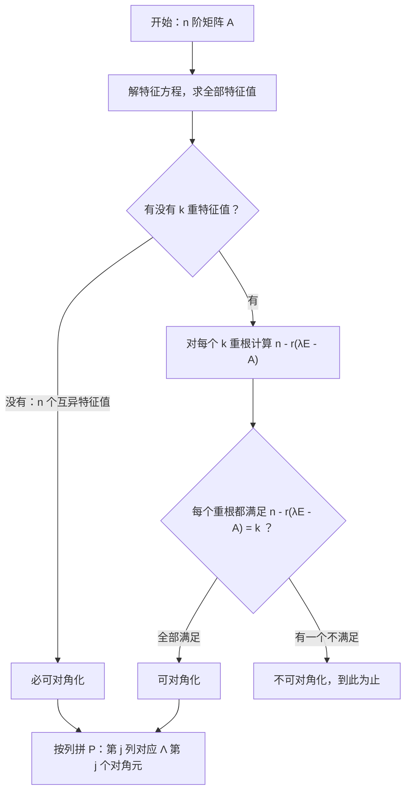
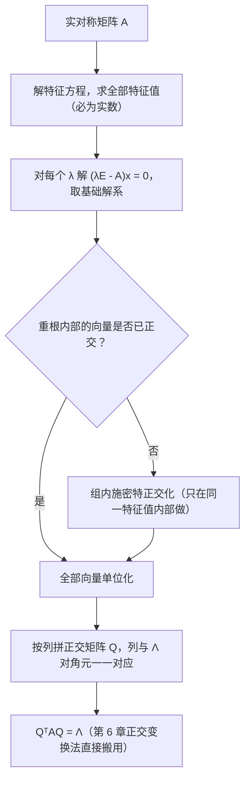

# 第 5 章：特征值与特征向量

> 本章与第 6 章联合构成数二线性代数解答题的**固定大题**（13 分），命题模式高度稳定："求特征值 → （正交）相似对角化 → 化二次型为标准形"。第 5 章就是这条流水线的"发动机"——特征值求不准，后面全盘皆输。把本章的计算流程练到条件反射，大题的分数就稳了一半。
>
> **前置知识**：第 1 章（行列式展开，用于算特征多项式）、第 2 章（矩阵的秩，用于数特征向量的个数）、第 3 章（线性无关的判断、施密特正交化，用于拼 $P$ 和构造正交矩阵 $Q$ ）。三块不熟请先回炉。

**本章学习目标**：

- **会求**：3 分钟内完成 3 阶矩阵（含含参矩阵）的全部特征值与特征向量；
- **会判**：用 $n - r(\lambda E - A) = k$ 判断矩阵能否相似对角化，并写出对应的 $P$ 与 $\Lambda$ ；
- **会用**：独立完成实对称矩阵的正交对角化全流程（含施密特正交化），为第 6 章正交变换法化二次型铺路。

---

## 5.1 特征值与特征向量的定义与求法

### 定义与特征方程

设 $A$ 是 $n$ 阶矩阵，若存在**数** $\lambda$ 和**非零**列向量 $\xi$ ，使得

$$
A\xi = \lambda\xi \quad (\xi \neq 0)
$$

则称 $\lambda$ 是 $A$ 的**特征值**， $\xi$ 是 $A$ 的属于特征值 $\lambda$ 的**特征向量**。

把定义改写为 $(\lambda E - A)\xi = 0$ ： $\xi \neq 0$ 是这个齐次方程组的**非零解**，而齐次方程组有非零解 $\iff$ 系数矩阵不可逆，即

$$
|\lambda E - A| = 0
$$

这就是**特征方程**，左端是 $\lambda$ 的 $n$ 次多项式，称为 $A$ 的**特征多项式**。解这个方程，得到 $A$ 的全部特征值（在复数范围内恰有 $n$ 个根，计重数；数二考题中特征值总为实数，不必担心复数情形）。

**求特征值与特征向量的标准流程**：

1. 解特征方程 $|\lambda E - A| = 0$ ，得全部特征值；
2. 对每个特征值 $\lambda$ ，解齐次方程组 $(\lambda E - A)x = 0$ ，其**基础解系**就是极大无关的特征向量组，通解的非零倍数都是特征向量。

**三个必须刻在脑子里的要点**：

- 特征向量 $\xi \neq 0$ ： $\lambda = 0$ 时 $Ax = 0$ 的解就是特征向量，零向量永远不算；
- 特征向量不唯一： $\xi$ 是特征向量，则 $c\xi \ (c \neq 0)$ 都是，所以 $P$ 的取法不唯一，答案不唯一；
- **$k$ 重特征值至多 $k$ 个线性无关的特征向量**（几何重数 ≤ 代数重数）。这一条是 5.4 节判断能否对角化的命门：到底"至多"还是"恰好" $k$ 个，要靠解方程组数一数。

**例 1**（求数字矩阵的全部特征值与特征向量）：设 $A = \begin{pmatrix} 1 & 1 & 0 \\ 0 & 2 & 0 \\ -2 & 2 & 3 \end{pmatrix}$ ，求 $A$ 的全部特征值与特征向量。

**第一步：求特征值。** 写出特征多项式并按第三列展开（第三列只有两个非零元）：

$$
|\lambda E - A| = \begin{vmatrix} \lambda - 1 & -1 & 0 \\ 0 & \lambda - 2 & 0 \\ 2 & -2 & \lambda - 3 \end{vmatrix} = (\lambda - 3)\begin{vmatrix} \lambda - 1 & -1 \\ 0 & \lambda - 2 \end{vmatrix} = (\lambda - 1)(\lambda - 2)(\lambda - 3)
$$

特征值为 $\lambda_1 = 1$ ， $\lambda_2 = 2$ ， $\lambda_3 = 3$ 。

**第二步：逐个求特征向量。**

当 $\lambda_1 = 1$ 时，解 $(E - A)x = 0$ ：

$$
E - A = \begin{pmatrix} 0 & -1 & 0 \\ 0 & -1 & 0 \\ 2 & -2 & -2 \end{pmatrix} \to \begin{pmatrix} 1 & 0 & -1 \\ 0 & 1 & 0 \\ 0 & 0 & 0 \end{pmatrix}
$$

得 $x_1 = x_3$ ， $x_2 = 0$ ，基础解系为 $\xi_1 = (1, 0, 1)^T$ ，属于 $\lambda_1 = 1$ 的全部特征向量为 $k_1(1, 0, 1)^T \ (k_1 \neq 0)$ 。

当 $\lambda_2 = 2$ 时，解 $(2E - A)x = 0$ ：

$$
2E - A = \begin{pmatrix} 1 & -1 & 0 \\ 0 & 0 & 0 \\ 2 & -2 & -1 \end{pmatrix} \to \begin{pmatrix} 1 & -1 & 0 \\ 0 & 0 & 1 \\ 0 & 0 & 0 \end{pmatrix}
$$

得 $x_1 = x_2$ ， $x_3 = 0$ ，基础解系为 $\xi_2 = (1, 1, 0)^T$ ，全部特征向量为 $k_2(1, 1, 0)^T \ (k_2 \neq 0)$ 。

当 $\lambda_3 = 3$ 时，解 $(3E - A)x = 0$ ：由第二行得 $x_2 = 0$ ，代入第一行得 $x_1 = 0$ ， $x_3$ 任意，基础解系为 $\xi_3 = (0, 0, 1)^T$ ，全部特征向量为 $k_3(0, 0, 1)^T \ (k_3 \neq 0)$ 。

**验算**（考场上花 10 秒，买一份保险）： $A\xi_1 = (1, 0, 1)^T = 1 \cdot \xi_1$ ， $A\xi_2 = (2, 2, 0)^T = 2\xi_2$ ， $A\xi_3 = (0, 0, 3)^T = 3\xi_3$ ，全部吻合。

> 💡 **验算技巧**：不需要重算行列式，把每个特征向量代回 $A\xi = \lambda\xi$ 检查即可。另外本题可顺手用 5.2 的两条性质自检： $\mathrm{tr}(A) = 1 + 2 + 3 = 6$ 恰为特征值之和， $|A| = 6$ 恰为特征值之积。

**例 2**（已知特征值反求参数）：设 $A = \begin{pmatrix} a & 1 & 1 \\ 1 & a & 1 \\ 1 & 1 & a \end{pmatrix}$ ，已知 $\lambda_1 = 1$ 是 $A$ 的一个特征值，求常数 $a$ ，并求 $A$ 的全部特征值。

**第一步：代特征值入特征方程。** $\lambda_1 = 1$ 是特征值 $\iff |E - A| = 0$ ：

$$
|E - A| = \begin{vmatrix} 1 - a & -1 & -1 \\ -1 & 1 - a & -1 \\ -1 & -1 & 1 - a \end{vmatrix}
$$

把第二、三行都加到第一行，第一行变为 $(1 - a - 2, \ 1 - a - 2, \ 1 - a - 2) = -(1 + a)(1, 1, 1)$ ，提出公因子后再消元：

$$
|E - A| = -(1 + a)\begin{vmatrix} 1 & 1 & 1 \\ -1 & 1 - a & -1 \\ -1 & -1 & 1 - a \end{vmatrix} = -(1 + a)(2 - a)^2
$$

（第二步中将第二行加第一行、第三行加第一行，化为上三角。）令其为零，得

$$
a = -1 \quad \text{或} \quad a = 2
$$

⚠️ **两解都要讨论，不能只取其一**——这是含参特征值题最常见的丢分点。

**第二步：用迹与行列式求其余特征值。** 设另两个特征值为 $\lambda_2, \lambda_3$ ，则

$$
\lambda_2 + \lambda_3 = \mathrm{tr}(A) - \lambda_1, \qquad \lambda_2 \lambda_3 = \frac{|A|}{\lambda_1}
$$

**情形一： $a = 2$ 。** $\mathrm{tr}(A) = 3a = 6$ ， $|A| = (a + 2)(a - 1)^2 = 4 \cdot 1 = 4$ ，于是 $\lambda_2 + \lambda_3 = 5$ ， $\lambda_2 \lambda_3 = 4$ ，解 $t^2 - 5t + 4 = 0$ 得 $t = 1$ 或 $4$ 。全部特征值为

$$
\lambda_1 = 1, \quad \lambda_2 = 1, \quad \lambda_3 = 4
$$

**情形二： $a = -1$ 。** $\mathrm{tr}(A) = -3$ ， $|A| = (a + 2)(a - 1)^2 = 1 \cdot 4 = 4$ ，于是 $\lambda_2 + \lambda_3 = -4$ ， $\lambda_2 \lambda_3 = 4$ ，解 $t^2 + 4t + 4 = 0$ 得 $t = -2$ （二重）。全部特征值为

$$
\lambda_1 = 1, \quad \lambda_2 = \lambda_3 = -2
$$

> 💡 **为什么恰好是这两个 $a$ ？** 观察到 $A$ 的每一行元素之和都是 $a + 2$ ，故 $(1, 1, 1)^T$ 必是 $A$ 对应特征值 $a + 2$ 的特征向量；而对任何满足 $x_1 + x_2 + x_3 = 0$ 的向量，有 $Ax = (a - 1)x$ 。所以 $A$ 的特征值本来就只能从 $\{a + 2, \ a - 1\}$ 里出： $a - 1 = 1$ 给 $a = 2$ ， $a + 2 = 1$ 给 $a = -1$ 。"每行元素之和相等"是考研真题的高频结构，见到就要想到 $(1, 1, \cdots, 1)^T$ 。

---

## 5.2 特征值的性质

### 两条核心公式（必须秒答）

**性质 1**： $A$ 的全部特征值之和等于主对角线元素之和（迹）：

$$
\sum_{i=1}^{n} \lambda_i = \mathrm{tr}(A) = a_{11} + a_{22} + \cdots + a_{nn}
$$

**性质 2**： $A$ 的全部特征值之积等于行列式：

$$
\prod_{i=1}^{n} \lambda_i = |A|
$$

来由看特征多项式的首尾两项即可（韦达定理）：

$$
|\lambda E - A| = \lambda^n - \mathrm{tr}(A)\lambda^{n-1} + \cdots + (-1)^n |A|
$$

对 3 阶矩阵，中间一次项系数是三个二阶主子式之和（了解即可，偶尔用于反求参数）。

### 特征值对照表（选择、填空的弹药库）

设 $\lambda$ 是 $A$ 的特征值， $\xi$ 是对应的特征向量，则：

| 矩阵 | 特征值 | 特征向量 |
|------|--------|----------|
| $A$ | $\lambda$ | $\xi$ |
| $kA$ | $k\lambda$ | 不变（仍是 $\xi$ ） |
| $A^2$ | $\lambda^2$ | 不变（仍是 $\xi$ ） |
| $A^m$ | $\lambda^m$ | 不变（仍是 $\xi$ ） |
| $A^{-1}$ （要求 $A$ 可逆） | $\dfrac{1}{\lambda}$ | 不变（仍是 $\xi$ ） |
| $A^*$ （要求 $A$ 可逆） | $\dfrac{\|A\|}{\lambda}$ | 不变（仍是 $\xi$ ） |
| $f(A)$ （多项式） | $f(\lambda)$ | 不变（仍是 $\xi$ ） |
| $A^T$ | $\lambda$ | **一般改变** |

前三条的证明是一句话的事： $A\xi = \lambda\xi$ 两边反复左乘 $A$ ，得 $A^m\xi = \lambda^m\xi$ ；多项式逐项作用得 $f(A)\xi = f(\lambda)\xi$ 。 $A^{-1}$ 的情形：先由 $|A| = \prod \lambda_i \neq 0$ 知 $\lambda \neq 0$ ，在 $A\xi = \lambda\xi$ 两边左乘 $A^{-1}$ 得 $\dfrac{1}{\lambda}\xi = A^{-1}\xi$ 。 $A^*$ 的情形：直接用公式 $A^* = |A|A^{-1}$ 。 $A^T$ 的特征值之所以相同，是因为

$$
|\lambda E - A^T| = |(\lambda E - A)^T| = |\lambda E - A|
$$

但 $A^T$ 与 $A$ 的特征向量一般没有直接关系（行变换与列变换的方向不同）。

### 两个推论

- **可逆判定**： $A$ 可逆 $\iff |A| \neq 0 \iff$ 特征值全不为零 $\iff$ $0$ 不是 $A$ 的特征值。反过来， $A$ 不可逆 $\iff$ $0$ 是特征值 $\iff Ax = 0$ 有非零解。
- **反求特征值技巧**： $n$ 个特征值中知道 $n - 1$ 个，用**迹**求最后一个；只知道部分时，联立"和 = 迹、积 = 行列式"解二次方程。例 2 已经完整示范。

**例 3**（性质综合）：设 3 阶矩阵 $A$ 的特征值为 $1, \ 2, \ -3$ ，求 $\mathrm{tr}(A^2)$ 、 $A^*$ 的特征值，以及 $|A^* + E|$ 。

**解**：先备好基础量： $\mathrm{tr}(A) = 1 + 2 - 3 = 0$ ， $|A| = 1 \cdot 2 \cdot (-3) = -6 \neq 0$ （故 $A$ 可逆， $A^{-1}$ 与 $A^*$ 的特征值公式可用）。

- $A^2$ 的特征值为 $1^2, \ 2^2, \ (-3)^2$ ，即 $1, \ 4, \ 9$ ，故 $\mathrm{tr}(A^2) = 14$ 。
- $A^*$ 的特征值为 $\dfrac{|A|}{\lambda_i}$ ，即 $\dfrac{-6}{1} = -6$ ， $\dfrac{-6}{2} = -3$ ， $\dfrac{-6}{-3} = 2$ ，即 $-6, \ -3, \ 2$ 。
- $A^* + E$ 的特征值为 $-6 + 1, \ -3 + 1, \ 2 + 1$ ，即 $-5, \ -2, \ 3$ ，行列式等于特征值之积：

$$
|A^* + E| = (-5) \times (-2) \times 3 = 30
$$

> 💡 **一般结论**：若 $B$ 的特征值为 $\mu_1, \cdots, \mu_n$ ，则 $B + \mu E$ 的特征值为 $\mu_i + \mu$ ，故 $|B + \mu E| = \prod(\mu_i + \mu)$ 。"求含 $A$ 的矩阵的行列式"几乎总走这条路：**先翻译特征值，再连乘**。

**例 4**（抽象矩阵的特征值）：设 $A$ 为 3 阶矩阵，满足 $A^2 - 3A + 2E = O$ ，且 $|A| = 2$ ，求 $A$ 的全部特征值。

**解**：设 $\lambda$ 是 $A$ 的任一特征值， $\xi \neq 0$ 是对应特征向量，则 $A^2\xi = \lambda^2\xi$ ，代入矩阵方程：

$$
(\lambda^2 - 3\lambda + 2)\xi = 0
$$

由 $\xi \neq 0$ 得 $\lambda^2 - 3\lambda + 2 = 0$ ，即 $(\lambda - 1)(\lambda - 2) = 0$ ，故每个特征值只能取 $1$ 或 $2$ 。再由 $|A| = \lambda_1\lambda_2\lambda_3 = 2$ ，三个取值于 $\{1, 2\}$ 的数之积为 $2$ ，只能是一组：

$$
\lambda_1 = \lambda_2 = 1, \quad \lambda_3 = 2
$$

> 💡 进阶：由 $(A - E)(A - 2E) = O$ 还能进一步证明 $A$ 必可对角化（最小多项式无重根），数二不要求证明过程，但"这类 $A$ 一定可对角化"的结论值得记住。

---

## 5.3 相似矩阵

### 定义

设 $A, B$ 都是 $n$ 阶矩阵，若存在**可逆**矩阵 $P$ ，使得

$$
P^{-1}AP = B
$$

则称 $A$ 与 $B$ **相似**，记作 $A \sim B$ 。相似是等价关系（满足反身、对称、传递），其几何背景是同一线性变换在不同基下的矩阵（数二不展开）。本章的主线就是：**研究什么样的 $A$ 相似于对角矩阵**。

### 相似的必要性质

若 $A \sim B$ ，即 $B = P^{-1}AP$ ，则下列性质全部成立：

1. **特征多项式相同**：

$$
|\lambda E - B| = |\lambda E - P^{-1}AP| = |P^{-1}(\lambda E - A)P| = |P^{-1}| \cdot |\lambda E - A| \cdot |P| = |\lambda E - A|
$$

2. 由特征多项式相同立即得到：**特征值相同、 $|B| = |A|$ 、 $\mathrm{tr}(B) = \mathrm{tr}(A)$** ；
3. **秩相同**： $r(B) = r(P^{-1}AP) = r(A)$ （可逆矩阵乘法不改变秩，见第 2 章）；
4. **幂相似**： $B^m = P^{-1}A^mP$ ，一般地 $f(B) = P^{-1}f(A)P$ ；
5. 若 $A$ 可逆则 $B$ 可逆，且 $B^{-1} = P^{-1}A^{-1}P$ ，即 $A^{-1} \sim B^{-1}$ 。

⚠️ 注意方向：这些都是**必要条件**，用来"判定不相似"非常锋利——**只要迹、行列式、秩、特征值中有一个对不上，立即不相似**。

### ⚠️ 特征多项式相同 ⇏ 相似（高频反例）

$$
E = \begin{pmatrix} 1 & 0 \\ 0 & 1 \end{pmatrix}, \qquad B = \begin{pmatrix} 1 & 1 \\ 0 & 1 \end{pmatrix}
$$

两者的特征多项式都是 $(\lambda - 1)^2$ ，特征值都是 $1, 1$ 。但 $E$ 不可能相似于任何其他矩阵——因为 $P^{-1}EP = E$ 对一切可逆 $P$ 成立。所以 $B \nsim E$ 。

**根源**：相似不仅保持特征值，还保持"每个特征值有多少个线性无关特征向量"这一深层结构。 $E$ 的 $\lambda = 1$ 有 $2$ 个无关特征向量， $B$ 的只有 $1$ 个。数二不引入若尔当标准形，记住这个反例与这句解释即可。

**例 5**（相似关系辨析）：判断下列说法的正误，并说明理由。

（1）若 $A \sim B$ ，则 $A$ 与 $B$ 的特征多项式、特征值、行列式、迹、秩都相同。

**正确**。特征多项式相同是 5.3 的推导；特征值、行列式、迹由韦达定理接棒；秩由可逆乘法保秩。

（2）若 $A$ 与 $B$ 的特征值相同，则 $A \sim B$ 。

**错误**。反例即上面的 $E$ 与 $\begin{pmatrix} 1 & 1 \\ 0 & 1 \end{pmatrix}$ ：特征值同为 $1, 1$ ，但不相似。

（3）若 $A, B$ 都可对角化，且特征值相同，则 $A \sim B$ 。

**正确**。设 $A = P\Lambda P^{-1}$ ， $B = Q\Lambda Q^{-1}$ （对角阵 $\Lambda$ 在排列一致时可取同一个），则 $\Lambda = P^{-1}AP = Q^{-1}BQ$ ，于是

$$
B = QP^{-1} \cdot A \cdot PQ^{-1} = (PQ^{-1})^{-1} A (PQ^{-1})
$$

取 $S = PQ^{-1}$ 即得 $B = S^{-1}AS$ ，故 $A \sim B$ 。

（4）若 $A \sim B$ ，则 $A^T \sim B^T$ 。

**正确**。对 $B = P^{-1}AP$ 两边取转置： $B^T = P^TA^T(P^{-1})^T = P^TA^T(P^T)^{-1}$ ，取 $S = (P^T)^{-1}$ 即得 $B^T = S^{-1}A^TS$ 。

---

## 5.4 相似对角化

### 定义与充要条件

若存在可逆矩阵 $P$ ，使 $P^{-1}AP = \Lambda$ 为**对角矩阵**，则称 $A$ 可**相似对角化**。把 $P$ 按列分块 $P = (\xi_1, \xi_2, \cdots, \xi_n)$ ，则

$$
AP = P\Lambda \iff (A\xi_1, \cdots, A\xi_n) = (\lambda_1\xi_1, \cdots, \lambda_n\xi_n)
$$

也就是说：**$P$ 的每一列都必须是 $A$ 的特征向量， $\Lambda$ 的对角元就是对应的特征值**。于是可对角化等价于"凑得出 $n$ 个线性无关的特征向量"。

**定理（充要条件）**： $n$ 阶矩阵 $A$ 可相似对角化

$$
\iff A \text{ 有 } n \text{ 个线性无关的特征向量}
$$

$$
\iff \text{对 } A \text{ 的每个 } k \text{ 重特征值 } \lambda, \text{ 都有 } n - r(\lambda E - A) = k
$$

第三个等价条件的翻译： $(\lambda E - A)x = 0$ 的基础解系含 $n - r(\lambda E - A)$ 个向量，这就是 $\lambda$ 的无关特征向量个数。**要求它与重数 $k$ 相等**。依据是：属于不同特征值的特征向量必线性无关，所以只需在每个特征值内部凑够重数个。

**定理（充分条件）**：若 $A$ 有 $n$ 个**互异**特征值，则 $A$ 必可对角化（每个特征值都是单根， $k = 1$ 自动满足）。⚠️ 这是充分不必要：有重根的矩阵也可能可对角化（5.5 的实对称矩阵就是铁证），不能反过来用。

**判断能否对角化的操作顺序**：先求特征值看有没有重根；无重根直接判"能"；有重根就逐个重根验证 $n - r(\lambda E - A) = k$ 。

**对角化的标准步骤**：

1. 解 $|\lambda E - A| = 0$ ，求全部特征值；
2. 对每个特征值 $\lambda$ 解 $(\lambda E - A)x = 0$ ，求基础解系；
3. 若所有特征向量的总数恰为 $n$ （可对角化），把它们**按列**拼成 $P$ ；
4. 写出 $\Lambda$ ，对角元与 $P$ 的列**一一对应**。

⚠️ **对应关系是硬性要求**： $P$ 的第 $j$ 列必须对应 $\Lambda$ 的第 $j$ 个对角元。排列顺序可以任意换，但换列必须同步换对角元，否则 $P^{-1}AP \neq \Lambda$ 。

**例 6**（判断能否对角化，重根讨论的完整过程）：设 $A = \begin{pmatrix} -1 & 1 & 0 \\ -4 & 3 & 0 \\ 1 & 0 & 2 \end{pmatrix}$ ，判断 $A$ 能否相似对角化。

**第一步：求特征值。** 特征多项式按第三列展开：

$$
|\lambda E - A| = \begin{vmatrix} \lambda + 1 & -1 & 0 \\ 4 & \lambda - 3 & 0 \\ -1 & 0 & \lambda - 2 \end{vmatrix} = (\lambda - 2)\left[(\lambda + 1)(\lambda - 3) + 4\right] = (\lambda - 2)(\lambda - 1)^2
$$

特征值为 $\lambda_1 = 2$ （单根）， $\lambda_2 = 1$ （二重根）。单根自动提供恰好 $1$ 个无关特征向量，**只需检查二重根 $\lambda = 1$ 是否提供 $2$ 个**。

**第二步：检查重根。** 解 $(E - A)x = 0$ ：

$$
E - A = \begin{pmatrix} 2 & -1 & 0 \\ 4 & -2 & 0 \\ -1 & 0 & -1 \end{pmatrix} \to \begin{pmatrix} 1 & 0 & 1 \\ 0 & 1 & 2 \\ 0 & 0 & 0 \end{pmatrix}
$$

$r(E - A) = 2$ ，故基础解系含 $n - r = 3 - 2 = 1$ 个向量（解得 $\xi = (1, 2, -1)^T$ ，可验算 $A\xi = \xi$ ）。而重数 $k = 2$ ，

$$
n - r(\lambda E - A) = 1 < 2 = k
$$

**结论**：二重根只贡献 $1$ 个无关特征向量，全矩阵只有 $2$ 个线性无关特征向量，少于 $n = 3$ ，故 $A$ **不能**相似对角化。

**例 7**（含参数 + 对角化综合大题标准形态）：设 $A = \begin{pmatrix} 1 & -1 & 1 \\ 2 & 4 & -2 \\ -3 & -3 & a \end{pmatrix}$ ，已知 $\lambda = 2$ 是 $A$ 的二重特征值，求常数 $a$ ；并求可逆矩阵 $P$ ，使 $P^{-1}AP$ 为对角阵。

**第一步：用"重根要有重数个向量"定 $a$ 。** $\lambda = 2$ 是二重特征值且 $A$ 待对角化，需要它有 $2$ 个线性无关特征向量，即 $r(2E - A) = 3 - 2 = 1$ ：

$$
2E - A = \begin{pmatrix} 1 & 1 & -1 \\ -2 & -2 & 2 \\ 3 & 3 & 2 - a \end{pmatrix} \xrightarrow{r_2 + 2r_1, \ r_3 - 3r_1} \begin{pmatrix} 1 & 1 & -1 \\ 0 & 0 & 0 \\ 0 & 0 & 5 - a \end{pmatrix}
$$

要使秩为 $1$ ，必须 $5 - a = 0$ ，即 $a = 5$ 。

**第二步：用迹求第三个特征值。** $\mathrm{tr}(A) = 1 + 4 + 5 = 10$ ，设第三个特征值为 $\lambda_3$ ，则 $2 + 2 + \lambda_3 = 10$ ，得 $\lambda_3 = 6$ 。全部特征值： $2, \ 2, \ 6$ 。

**第三步：求特征向量。**

当 $\lambda = 2$ （二重）时，由上面的行化简结果，只剩方程 $x_1 + x_2 - x_3 = 0$ ，取 $x_2, x_3$ 为自由变量，基础解系：

$$
\xi_1 = (1, 0, 1)^T, \qquad \xi_2 = (0, 1, 1)^T
$$

（验算： $A\xi_1 = (2, 0, 2)^T = 2\xi_1$ ， $A\xi_2 = (0, 2, 2)^T = 2\xi_2$ ✓）

当 $\lambda = 6$ 时，解 $(6E - A)x = 0$ ：

$$
\begin{cases} 5x_1 + x_2 - x_3 = 0 \\ -2x_1 + 2x_2 + 2x_3 = 0 \\ 3x_1 + 3x_2 + x_3 = 0 \end{cases}
$$

由第二式 $x_2 = x_1 - x_3$ ，代入第一式得 $6x_1 = 2x_3$ ，即 $x_3 = 3x_1$ ，从而 $x_2 = -2x_1$ ，取 $x_1 = 1$ 得

$$
\xi_3 = (1, -2, 3)^T
$$

（验算： $A\xi_3 = (6, -12, 18)^T = 6\xi_3$ ✓）

**第四步：拼 $P$ 与 $\Lambda$ 。**

$$
P = (\xi_1, \xi_2, \xi_3) = \begin{pmatrix} 1 & 0 & 1 \\ 0 & 1 & -2 \\ 1 & 1 & 3 \end{pmatrix}, \qquad \Lambda = \begin{pmatrix} 2 & 0 & 0 \\ 0 & 2 & 0 \\ 0 & 0 & 6 \end{pmatrix}
$$

则 $P^{-1}AP = \Lambda$ 。 $|P| = 4 \neq 0$ ， $P$ 可逆 ✓。若把 $\xi_3$ 放在第一列，则 $\Lambda$ 的对角元必须同步写成 $6, 2, 2$ ——**列与对角元一一对应，顺序成套换**。

**例 8**（利用对角化求 $A^n$ ）：设 $A = \begin{pmatrix} 3 & -2 \\ 1 & 0 \end{pmatrix}$ ，求 $A^n$ 。

**解**：先对角化。特征方程 $\lambda^2 - 3\lambda + 2 = 0$ （二阶矩阵直接用 $\lambda^2 - \mathrm{tr}(A)\lambda + |A|$ 快速写出），得 $\lambda_1 = 1$ ， $\lambda_2 = 2$ 。

- $\lambda_1 = 1$ ： $(E - A)x = 0$ 给出 $-2x_1 + 2x_2 = 0$ ， $\xi_1 = (1, 1)^T$ ；
- $\lambda_2 = 2$ ： $(2E - A)x = 0$ 给出 $-x_1 + 2x_2 = 0$ ， $\xi_2 = (2, 1)^T$ 。

（验算： $A\xi_1 = (1, 1)^T$ ✓， $A\xi_2 = (4, 2)^T = 2\xi_2$ ✓）于是 $A = P\Lambda P^{-1}$ ，其中

$$
P = \begin{pmatrix} 1 & 2 \\ 1 & 1 \end{pmatrix}, \qquad \Lambda = \begin{pmatrix} 1 & 0 \\ 0 & 2 \end{pmatrix}, \qquad P^{-1} = \begin{pmatrix} -1 & 2 \\ 1 & -1 \end{pmatrix}
$$

关键一步——中间的 $P^{-1}P$ 成对相消：

$$
A^n = (P\Lambda P^{-1})^n = P\Lambda^n P^{-1} = P\begin{pmatrix} 1 & 0 \\ 0 & 2^n \end{pmatrix}P^{-1}
$$

$$
A^n = \begin{pmatrix} 1 & 2^{n+1} \\ 1 & 2^n \end{pmatrix}\begin{pmatrix} -1 & 2 \\ 1 & -1 \end{pmatrix} = \begin{pmatrix} 2^{n+1} - 1 & 2 - 2^{n+1} \\ 2^n - 1 & 2 - 2^n \end{pmatrix}
$$

**验算**： $n = 1$ 时得 $\begin{pmatrix} 3 & -2 \\ 1 & 0 \end{pmatrix} = A$ ✓； $n = 2$ 时得 $\begin{pmatrix} 7 & -6 \\ 3 & -2 \end{pmatrix}$ ，与直接相乘 $A^2 = \begin{pmatrix} 7 & -6 \\ 3 & -2 \end{pmatrix}$ 一致 ✓； $n = 0$ 时得 $E$ ✓。

> ⚠️ 求 $A^n$ 的对角化方法的前提是 $A$ **可对角化**。若不可对角化（如例 6 那类），此路不通，只能改用归纳法或拆分技巧。

---

## 5.5 实对称矩阵

实对称矩阵（ $A^T = A$ ）是本章的"VIP 客户"：它的特征值理论最干净，而且**第 6 章大题（正交变换法化二次型）用的正是它**。三条性质必须烂熟。

### 三条核心性质

**性质 1**：实对称矩阵的特征值**全为实数**（证明用共轭运算取转置共轭，数二不要求掌握过程）。

**性质 2（本章最重要的一条）**：实对称矩阵的**不同特征值**对应的特征向量**相互正交**。

证明值得看一遍，只用两行：设 $A\xi_1 = \lambda_1\xi_1$ ， $A\xi_2 = \lambda_2\xi_2$ ， $\lambda_1 \neq \lambda_2$ ，利用 $A^T = A$ ：

$$
\lambda_1 \xi_1^T\xi_2 = (A\xi_1)^T\xi_2 = \xi_1^TA^T\xi_2 = \xi_1^TA\xi_2 = \lambda_2\xi_1^T\xi_2
$$

移项得 $(\lambda_1 - \lambda_2)\xi_1^T\xi_2 = 0$ ，而 $\lambda_1 \neq \lambda_2$ ，故 $\xi_1^T\xi_2 = 0$ ，即正交。

**性质 3**：实对称矩阵**必可（正交）相似对角化**：存在**正交矩阵** $Q$ （ $Q^TQ = E$ ，即列向量组是标准正交组），使

$$
Q^TAQ = \Lambda
$$

比一般矩阵强在哪里？一般矩阵只保证"可能"对角化，实对称矩阵保证"必定"对角化，而且过渡矩阵还能要求是正交的。原因：性质 2 让不同特征值的特征向量自动正交；同一重根内部只要再做一次施密特正交化即可。

### 正交对角化标准流程（第 6 章大题的直接前置）

1. 解 $|\lambda E - A| = 0$ ，求全部特征值（必为实数）；
2. 对每个特征值解 $(\lambda E - A)x = 0$ ，求基础解系；
3. **只对同一个重根内部的多个向量做施密特正交化**（不同特征值之间已经自动正交，千万不要跨特征值做，否则会破坏 $A\xi = \lambda\xi$ 的关系）；
4. **全部单位化**；
5. 按列拼成正交矩阵 $Q$ ，列与 $\Lambda$ 的对角元一一对应。

⚠️ **单位化不能省**：若列向量只正交不单位， $Q^TAQ$ 仍是对角阵，但对角元是 $\lambda_i \|\eta_i\|^2$ 而不是 $\lambda_i$ ，就得不到 $\Lambda$ 了。此外第 6 章用正交变换 $x = Qy$ 化二次型，前提 $Q$ 是正交矩阵，也要求单位化。

**例 9**（实对称矩阵正交对角化完整例）：设 $A = \begin{pmatrix} 2 & 0 & 0 \\ 0 & 3 & 1 \\ 0 & 1 & 3 \end{pmatrix}$ ，求正交矩阵 $Q$ ，使 $Q^TAQ$ 为对角阵。

**第一步：求特征值。** 特征多项式按第一行展开：

$$
|\lambda E - A| = \begin{vmatrix} \lambda - 2 & 0 & 0 \\ 0 & \lambda - 3 & -1 \\ 0 & -1 & \lambda - 3 \end{vmatrix} = (\lambda - 2)\left[(\lambda - 3)^2 - 1\right] = (\lambda - 2)^2(\lambda - 4)
$$

特征值为 $\lambda_1 = \lambda_2 = 2$ （二重）， $\lambda_3 = 4$ 。

**第二步：求特征向量。**

当 $\lambda = 2$ 时，解 $(2E - A)x = 0$ ：

$$
2E - A = \begin{pmatrix} 0 & 0 & 0 \\ 0 & -1 & -1 \\ 0 & -1 & -1 \end{pmatrix} \to \begin{pmatrix} 0 & 1 & 1 \\ 0 & 0 & 0 \\ 0 & 0 & 0 \end{pmatrix}
$$

只有一个方程 $x_2 + x_3 = 0$ ， $n - r = 3 - 1 = 2$ 个自由变量，基础解系：

$$
\xi_1 = (1, 0, 0)^T, \qquad \xi_2 = (0, 1, -1)^T
$$

当 $\lambda = 4$ 时，解 $(4E - A)x = 0$ ：由第一行 $x_1 = 0$ ，第二行 $x_2 = x_3$ ，基础解系：

$$
\xi_3 = (0, 1, 1)^T
$$

**第三步：正交化。** 属于 $\lambda = 2$ 的两个向量： $\xi_1^T\xi_2 = 1 \cdot 0 + 0 \cdot 1 + 0 \cdot (-1) = 0$ ，**已经正交**，无需施密特。再检查跨特征值的正交性： $\xi_1^T\xi_3 = 0$ ， $\xi_2^T\xi_3 = 1 - 1 = 0$ ✓（性质 2 的体现）。

**第四步：单位化。**

$$
\eta_1 = (1, 0, 0)^T, \qquad \eta_2 = \frac{1}{\sqrt 2}(0, 1, -1)^T, \qquad \eta_3 = \frac{1}{\sqrt 2}(0, 1, 1)^T
$$

**第五步：拼 $Q$ 。**

$$
Q = \begin{pmatrix} 1 & 0 & 0 \\ 0 & \frac{1}{\sqrt 2} & \frac{1}{\sqrt 2} \\ 0 & -\frac{1}{\sqrt 2} & \frac{1}{\sqrt 2} \end{pmatrix}, \qquad Q^TAQ = \Lambda = \begin{pmatrix} 2 & 0 & 0 \\ 0 & 2 & 0 \\ 0 & 0 & 4 \end{pmatrix}
$$

**复核** $Q^TAQ = \Lambda$ ：只需验证 $AQ = Q\Lambda$ 。 $A\eta_1 = (2, 0, 0)^T = 2\eta_1$ ✓； $A\eta_2 = (0, \frac{2}{\sqrt 2}, -\frac{2}{\sqrt 2})^T = 2\eta_2$ ✓； $A\eta_3 = (0, \frac{4}{\sqrt 2}, \frac{4}{\sqrt 2})^T = 4\eta_3$ ✓。且 $Q^TQ = E$ ✓。

**例 10**（重根内部必须施密特正交化的情形）：设 $B = \begin{pmatrix} 1 & 2 & 2 \\ 2 & 1 & 2 \\ 2 & 2 & 1 \end{pmatrix}$ ，求正交矩阵 $Q$ ，使 $Q^TBQ$ 为对角阵。

**第一步：求特征值。** 把第二、三行加到第一行，第一行变为 $(\lambda - 5)(1, 1, 1)$ ，提出后消元：

$$
|\lambda E - B| = \begin{vmatrix} \lambda - 1 & -2 & -2 \\ -2 & \lambda - 1 & -2 \\ -2 & -2 & \lambda - 1 \end{vmatrix} = (\lambda - 5)(\lambda + 1)^2
$$

特征值为 $\lambda_1 = 5$ （单根）， $\lambda_2 = \lambda_3 = -1$ （二重）。（自检： $\mathrm{tr}(B) = 3 = 5 - 1 - 1$ ✓， $|B| = 5 = 5 \times (-1) \times (-1)$ ✓）

**第二步：求特征向量。**

当 $\lambda = 5$ 时， $(B - 5E)x = 0$ 的三个方程化简后都是 $2x_i = x_j + x_k$ 的形式，三式相减得 $x_1 = x_2 = x_3$ ，基础解系 $\xi_1 = (1, 1, 1)^T$ 。

当 $\lambda = -1$ 时， $B + E$ 的三行全为 $(2, 2, 2)$ ，只有一个方程 $x_1 + x_2 + x_3 = 0$ ，基础解系：

$$
\xi_2 = (1, -1, 0)^T, \qquad \xi_3 = (1, 0, -1)^T
$$

**第三步：重根内部施密特正交化。** 本题与例 9 不同： $\xi_2^T\xi_3 = 1 \neq 0$ ，**不正交**，必须做施密特。取

$$
\beta_2 = \xi_2 = (1, -1, 0)^T
$$

$$
\beta_3 = \xi_3 - \frac{\xi_3^T\beta_2}{\beta_2^T\beta_2}\beta_2 = (1, 0, -1)^T - \frac{1}{2}(1, -1, 0)^T = \left(\frac{1}{2}, \frac{1}{2}, -1\right)^T
$$

为避免分数，取与 $\beta_3$ 平行的整向量 $(1, 1, -2)^T$ 。检查： $(1, -1, 0)^T$ 与 $(1, 1, -2)^T$ 的内积为 $1 - 1 + 0 = 0$ ✓。

**第四步：全部单位化。**

$$
\eta_1 = \frac{1}{\sqrt 3}(1, 1, 1)^T, \qquad \eta_2 = \frac{1}{\sqrt 2}(1, -1, 0)^T, \qquad \eta_3 = \frac{1}{\sqrt 6}(1, 1, -2)^T
$$

**第五步：拼 $Q$ 。**

$$
Q = \begin{pmatrix} \frac{1}{\sqrt 3} & \frac{1}{\sqrt 2} & \frac{1}{\sqrt 6} \\ \frac{1}{\sqrt 3} & -\frac{1}{\sqrt 2} & \frac{1}{\sqrt 6} \\ \frac{1}{\sqrt 3} & 0 & -\frac{2}{\sqrt 6} \end{pmatrix}, \qquad Q^TBQ = \begin{pmatrix} 5 & 0 & 0 \\ 0 & -1 & 0 \\ 0 & 0 & -1 \end{pmatrix}
$$

（验算： $B(1, 1, 1)^T = (5, 5, 5)^T = 5\xi_1$ ✓； $B(1, -1, 0)^T = (-1, 1, 0)^T = -\xi_2$ ✓； $B(1, 1, -2)^T = (-1, -1, 2)^T = -(1, 1, -2)^T$ ✓）

> 💡 **例 9 与例 10 的对比就是考点**：重根内部的向量可能恰好正交（例 9，直接单位化），也可能不正交（例 10，先施密特）。拿到题先算内积再决定，不要背"哪道题要正交化"。

---

## 本章小结

### 一、知识框架

```text
特征值与特征向量（第 5 章）
│
├── 5.1 定义与求法
│   ├── 定义：Aξ = λξ（ξ ≠ 0）
│   ├── 特征方程：|λE - A| = 0（特征多项式为 n 次多项式）
│   └── 特征向量：(λE - A)x = 0 的非零解（基础解系）
│       └── k 重特征值至多 k 个线性无关特征向量
│
├── 5.2 特征值的性质
│   ├── 核心：Σλi = tr(A)，∏λi = |A|
│   ├── 对照表：kλ, λ², λᵐ, 1/λ, |A|/λ, f(λ)（特征向量不变）；Aᵀ 同值不同向量
│   ├── 反求技巧：迹补最后一个 / 和积联立解二次方程
│   └── 可逆 ⟺ 特征值全非零 ⟺ 0 不是特征值
│
├── 5.3 相似矩阵
│   ├── 定义：P⁻¹AP = B（P 可逆）
│   ├── 相似 ⇒ 特征多项式/特征值/行列式/迹/秩 相同，f(A) ~ f(B)
│   └── ⚠️ 特征值相同 ⇏ 相似（E 与 [[1,1],[0,1]] 反例）
│
├── 5.4 相似对角化
│   ├── 充要：n 个线性无关特征向量 ⟺ 每个 k 重根满足 n - r(λE - A) = k
│   ├── 充分：n 个互异特征值（不可逆推）
│   └── 步骤：求值 → 求向量 → 拼 P（第 j 列 ↔ 第 j 个对角元）
│
└── 5.5 实对称矩阵
    ├── 特征值全为实数
    ├── 不同特征值的特征向量自动正交
    └── 必可正交相似对角化：重根组内施密特 → 全部单位化 → 拼 Q
```

### 二、决策流程图：能否相似对角化



### 三、决策流程图：实对称矩阵正交对角化



### 四、易错点汇总表

| 易错点 | 正确认识 |
|--------|----------|
| 见到重根就说"不可对角化" | 重根可对角化的判定标准是 $n - r(\lambda E - A) = k$ ，实对称矩阵有重根也必可对角化 |
| 用"特征值相同"判相似 | 特征值相同 $\not\Rightarrow$ 相似，反例： $E$ 与 $\begin{pmatrix} 1 & 1 \\ 0 & 1 \end{pmatrix}$ |
| $P$ 的列与 $\Lambda$ 对角元顺序错位 | 第 $j$ 列必须对应第 $j$ 个对角元，换列必须连对角元一起换 |
| 实对称矩阵重根内部漏做施密特 | 不同特征值之间自动正交，但重根**内部**必须先算内积、必要时正交化 |
| 正交化后漏单位化 | 不单位化则 $Q^TAQ$ 的对角元是 $\lambda_i\|\eta_i\|^2 \neq \lambda_i$ ，且 $Q$ 不是正交矩阵 |
| 特征向量通解漏"非零" | $\xi \neq 0$ 是定义的一部分，全部特征向量要写成 $k\xi \ (k \neq 0)$ |
| 把 $\frac{\|A\|}{\lambda}$ 用在不可逆的 $A$ 上 | $A^*, A^{-1}$ 的特征值公式都要求 $A$ 可逆（ $\|A\| \neq 0$ ） |
| 含参题只取一个解 | 代 $\lambda$ 入特征方程得到的多项式可能有多个根，**每个都要讨论**（例 2） |

### 五、考试重点：大题固定模式

数二线代解答大题（与第 6 章联合，13 分）的问法几乎固定为三段：

1. **第一问（反求参数）**：给含参矩阵 + 一个特征信息（某向量是特征向量 / 某数是特征值 / 可对角化 / 二重根），用定义或 $n - r(\lambda E - A) = k$ 反求参数——对应例 2、例 7 第一步；
2. **第二问（求特征值与特征向量）**：参数代回后完整求值求向量，流程化操作——对应例 1、例 7 第三步；
3. **第三问（对角化，常衔接第 6 章）**：求正交矩阵 $Q$ 使 $Q^TAQ = \Lambda$ ，或把 $\Lambda$ 直接搬去化二次型标准形——对应例 9、例 10。

时间预算：参数 4 分钟 + 特征值向量 6 分钟 + 对角化 5 分钟。选择、填空则重点考 5.2 的性质（迹、行列式、 $f(A)$ 的特征值）与 5.3、5.4 的判定题（相似与对角化的辨析）。**把例 7 和例 9 各限时 15 分钟独立重做一遍，是本章复习效果的最佳检验。**

---

## 📝 动手练习

> **要求**：独立完成，每题限时 10-15 分钟，做完必做两步验算（特征值代回特征方程、特征向量代回 $A\xi = \lambda\xi$ ）。**预期效果**：3 阶矩阵特征值计算零失误；给出"能否对角化"结论时能同时给出 $n - r(\lambda E - A)$ 与 $k$ 的数值；实对称正交对角化一次成型。

**练习 1**：设 $A = \begin{pmatrix} 4 & 6 & 0 \\ -3 & -5 & 0 \\ -3 & -6 & 1 \end{pmatrix}$ ，求 $A$ 的全部特征值与特征向量，并判断 $A$ 能否相似对角化；若能，求可逆矩阵 $P$ 使 $P^{-1}AP$ 为对角阵。

- 💡 提示：特征多项式按第三列展开得 $(\lambda - 1)^2(\lambda + 2)$ ；二重根 $\lambda = 1$ 处 $r(E - A) = 1$ ，别急着下"不可对角化"的结论，先数向量。
- ✅ 参考答案：特征值 $\lambda_1 = \lambda_2 = 1$ ， $\lambda_3 = -2$ ； $\lambda = 1$ 对应 $\xi_1 = (2, -1, 0)^T$ ， $\xi_2 = (0, 0, 1)^T$ ， $\lambda = -2$ 对应 $\xi_3 = (1, -1, -1)^T$ ；因 $3 - r(E - A) = 2$ 恰等于重数 $2$ ，故**可对角化**， $P = \begin{pmatrix} 2 & 0 & 1 \\ -1 & 0 & -1 \\ 0 & 1 & -1 \end{pmatrix}$ ， $P^{-1}AP = \mathrm{diag}(1, 1, -2)$ 。

**练习 2**：设 3 阶矩阵 $A$ 满足 $\mathrm{tr}(A) = 2$ ， $|A| = 4$ ，且已知 $\lambda_1 = -1$ 是 $A$ 的一个特征值，求 $A$ 的全部特征值。

- 💡 提示：设另两个特征值为 $\lambda_2, \lambda_3$ ，用"和 = 迹 − 已知值、积 = 行列式 ÷ 已知值"联立，解一个二次方程。
- ✅ 参考答案： $\lambda_2 + \lambda_3 = 2 - (-1) = 3$ ， $\lambda_2\lambda_3 = \dfrac{4}{-1} = -4$ ，解 $t^2 - 3t - 4 = 0$ 得 $t = -1$ 或 $4$ 。全部特征值为 $-1, \ -1, \ 4$ （自检：和 $= 2$ ✓，积 $= 4$ ✓）。

**练习 3**：设 $A = \begin{pmatrix} 1 & 2 \\ 2 & 1 \end{pmatrix}$ ，求 $A^n$ 。

- 💡 提示：实对称矩阵必可对角化。特征值 $3, -1$ ； $P = \begin{pmatrix} 1 & 1 \\ 1 & -1 \end{pmatrix}$ ， $P^{-1} = \frac{1}{2}\begin{pmatrix} 1 & 1 \\ 1 & -1 \end{pmatrix}$ ， $A^n = P\,\mathrm{diag}(3^n, (-1)^n)\,P^{-1}$ ，中间相消后逐项算。
- ✅ 参考答案： $A^n = \frac{1}{2}\begin{pmatrix} 3^n + (-1)^n & 3^n - (-1)^n \\ 3^n - (-1)^n & 3^n + (-1)^n \end{pmatrix}$ 。验算： $n = 1$ 时还原为 $\begin{pmatrix} 1 & 2 \\ 2 & 1 \end{pmatrix}$ ✓。

**练习 4**：设 $A = \begin{pmatrix} 1 & -2 & 2 \\ -2 & -2 & 4 \\ 2 & 4 & -2 \end{pmatrix}$ ，求正交矩阵 $Q$ ，使 $Q^TAQ$ 为对角阵。

- 💡 提示：特征多项式为 $(\lambda - 2)^2(\lambda + 7)$ ； $\lambda = 2$ 的基础解系 $(2, -1, 0)^T$ 与 $(2, 0, 1)^T$ **不正交**（内积为 $4$ ），必须先做施密特； $\lambda = -7$ 的特征向量与它们自动正交，可直接验证。
- ✅ 参考答案：施密特后重根组内取 $(2, -1, 0)^T$ 与 $(2, 4, 5)^T$ ， $\lambda = -7$ 对应 $(1, 2, -2)^T$ ，全部单位化后

$$
Q = \begin{pmatrix} \frac{2}{\sqrt 5} & \frac{2}{3\sqrt 5} & \frac{1}{3} \\ -\frac{1}{\sqrt 5} & \frac{4}{3\sqrt 5} & \frac{2}{3} \\ 0 & \frac{5}{3\sqrt 5} & -\frac{2}{3} \end{pmatrix}, \qquad Q^TAQ = \begin{pmatrix} 2 & 0 & 0 \\ 0 & 2 & 0 \\ 0 & 0 & -7 \end{pmatrix}
$$

（验算： $A(2, 4, 5)^T = (4, 8, 10)^T = 2(2, 4, 5)^T$ ✓， $A(1, 2, -2)^T = (-7, -14, 14)^T = -7(1, 2, -2)^T$ ✓）
