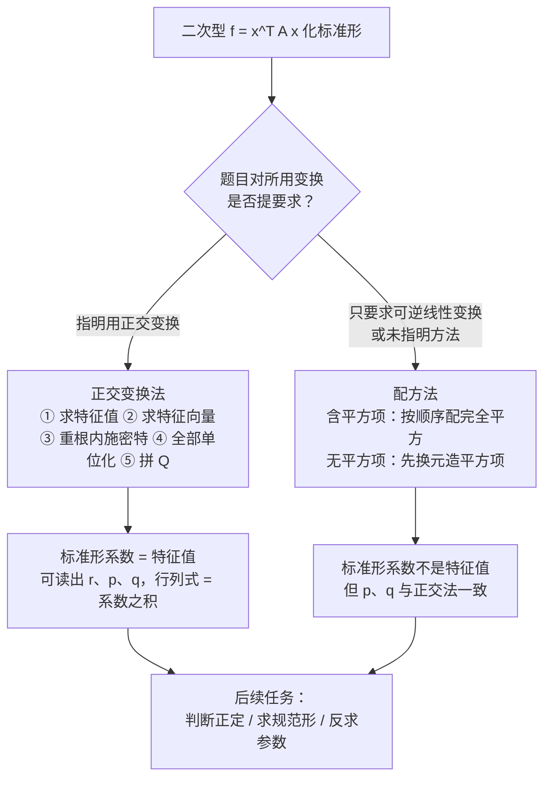
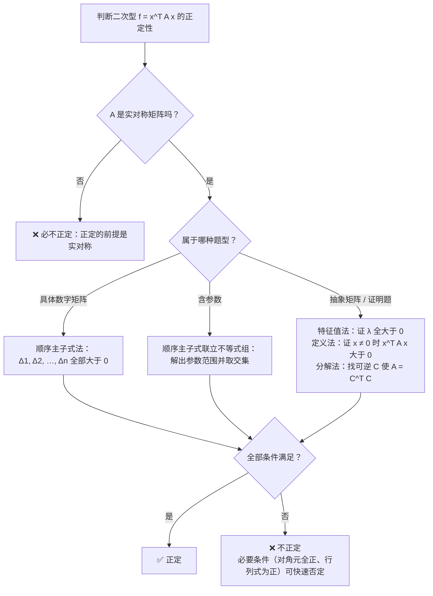

# 第 6 章：二次型

> 本章是数二线性代数**解答题的终点站**——"特征值 → 正交对角化 → 化二次型为标准形 → 判断正定"是多年稳定的 13 分大题模式（呼应大纲"大题链路"），也是第 5 章实对称矩阵正交对角化的直接应用。前置知识：第 5 章实对称矩阵的正交对角化、第 3 章施密特正交化。如果这两处还不熟，请先回头补齐——本章大题的每一步都踩在它们上面。

**本章学习目标**：

- 会由二次型写出对称矩阵 $A$ （交叉项系数除以 $2$ ），会用 $r(A)$ 求二次型的秩，掌握配方法与正交变换法两条化标准形路线及其本质区别；
- 理解惯性定理：标准形不唯一、正负惯性指数与规范形唯一，能辨析等价、相似、合同三种矩阵关系（含实对称矩阵的单向蕴含与标准反例）；
- 熟记正定充要条件链，能在具体数字、含参数、抽象证明三类题型中选对判定方法，并独立完成"求参数 → 求特征值 → 正交变换化标准形 → 判断正定"四问综合大题。

---

## 6.1 二次型及其矩阵表示

### 1. 二次型的定义

**定义**：含 $n$ 个变量 $x_1, x_2, \ldots, x_n$ 的二次齐次多项式（每一项要么是平方项 $x_i^2$ ，要么是交叉项 $x_ix_j$ ，不含一次项、常数项）称为 $n$ 元**二次型**：

$$
f(x_1, x_2, \ldots, x_n) = a_{11}x_1^2 + a_{22}x_2^2 + \cdots + a_{nn}x_n^2 + 2a_{12}x_1x_2 + 2a_{13}x_1x_3 + \cdots + 2a_{n-1,\,n}x_{n-1}x_n
$$

注意交叉项**故意写成 $2a_{ij}x_ix_j$ 的形式**——这正是为了让矩阵表示"抄下来就是"，不必再除一次，见下。

### 2. 矩阵表示： $f = x^TAx$

任何二次型都可以写成矩阵形式：

$$
f = x^TAx = (x_1, x_2, \ldots, x_n)\begin{pmatrix} a_{11} & a_{12} & \cdots & a_{1n} \\ a_{21} & a_{22} & \cdots & a_{2n} \\ \vdots & \vdots & \ddots & \vdots \\ a_{n1} & a_{n2} & \cdots & a_{nn} \end{pmatrix}\begin{pmatrix} x_1 \\ x_2 \\ \vdots \\ x_n \end{pmatrix}, \qquad A^T = A
$$

**写 $A$ 的两条规则**（考试第一动作，必须形成条件反射）：

1. 平方项 $x_i^2$ 的系数直接放进主对角线： $a_{ii} = $ 该系数；
2. 交叉项 $x_ix_j$ 的系数 $c$ **除以 $2$** ，放进一对对称位置： $a_{ij} = a_{ji} = \dfrac{c}{2}$ 。

原因：展开 $x^TAx$ 时， $a_{ij}x_ix_j$ 与 $a_{ji}x_jx_i$ 是同一项，各贡献一半，合起来恰好还原交叉项系数 $2a_{ij}$ 。

> ⚠️ **$A$ 必须对称**。只有约定 $A^T = A$ ，二次型与对称矩阵才一一对应。写完 $A$ 先自检 $A^T = A$ ，这一步出错后面全盘皆错。另外，若题目给的是 $x^TBx$ 且 $B$ 不对称，二次型真正对应的矩阵是对称部分 $\dfrac{B + B^T}{2}$ （因为恒有 $x^TBx = x^TB^Tx$ ）。

### 3. 二次型的秩

**定义**：二次型 $f = x^TAx$ 的秩就取矩阵的秩： $r(f) = r(A)$ 。

为什么合理：作可逆线性变换 $x = Cy$ 后， $f = y^T(C^TAC)y$ ，而 $C$ 可逆时 $r(C^TAC) = r(A)$ ——秩在合同变换下不变。于是反过来，**标准形中非零平方项的个数**也等于 $r(A)$ ，这是后面反复使用的读数工具。

**例 1**（写出矩阵并求秩）：写出下列二次型的矩阵 $A$ ，并求二次型的秩。

(1) $f(x_1, x_2, x_3) = 2x_1^2 + x_2^2 - 4x_1x_2 - 4x_2x_3$ ；
(2) $f(x_1, x_2, x_3) = (x_1 + x_2 + x_3)^2$ 。

**解**：

**(1)** 逐项拆系数： $a_{11} = 2$ ， $a_{22} = 1$ ， $a_{33} = 0$ ； $-4x_1x_2 \Rightarrow a_{12} = a_{21} = -2$ ； $-4x_2x_3 \Rightarrow a_{23} = a_{32} = -2$ ； $a_{13} = a_{31} = 0$ 。故

$$
A = \begin{pmatrix} 2 & -2 & 0 \\ -2 & 1 & -2 \\ 0 & -2 & 0 \end{pmatrix}
$$

自检： $A^T = A$ ✓ 。求秩： $\Delta_1 = 2 \ne 0$ ， $\Delta_2 = 2 \times 1 - (-2)^2 = -2 \ne 0$ ，再算 $|A|$ （按第一行展开）：

$$
|A| = 2\begin{vmatrix} 1 & -2 \\ -2 & 0 \end{vmatrix} - (-2)\begin{vmatrix} -2 & -2 \\ 0 & 0 \end{vmatrix} + 0 = 2 \times (0 - 4) + 2 \times 0 = -8 \ne 0
$$

故 $r(A) = 3$ ，二次型满秩。

**(2)** 先展开：

$$
f = x_1^2 + x_2^2 + x_3^2 + 2x_1x_2 + 2x_1x_3 + 2x_2x_3
$$

平方项系数全为 $1$ ；交叉项系数全为 $2$ ，除以 $2$ 得 $a_{ij} = 1$ 。故

$$
A = \begin{pmatrix} 1 & 1 & 1 \\ 1 & 1 & 1 \\ 1 & 1 & 1 \end{pmatrix}
$$

三行完全相同， $r(A) = 1$ ——这个三元二次型的秩只有 $1$ 。

**易错点**：

- (2) 说明**秩可以远小于变量个数**： $f = (x_1 + x_2 + x_3)^2$ 把三个变量的信息压缩进一个平方项。不要凭"三元"就断定秩为 $3$ 。
- 交叉项带负号时， $a_{ij} = a_{ji}$ 同取负的一半，如 (1) 中的 $-2$ ，别丢符号。

---

## 6.2 配方法化标准形

**标准形**：只含平方项、不含交叉项的二次型

$$
f = d_1y_1^2 + d_2y_2^2 + \cdots + d_ny_n^2
$$

化标准形的目标：找**可逆**线性变换 $x = Cy$ ，使 $f = x^TAx = y^T(C^TAC)y$ 变成标准形。本章有两条路线（配方法、正交变换法），得到的都是标准形，但系数的含义完全不同——这是全章最重要的对比。

### 1. 拉格朗日配方法（情形一：含平方项，按顺序配）

**步骤**：

1. 找一个系数非零的平方项（不妨设 $x_1^2$ 系数非零），把**所有含 $x_1$ 的项**集中起来配成完全平方：含 $x_1$ 的全部项 $= (x_1 + \cdots)^2 - (\text{补出来的尾巴})$ ；
2. 剩余部分不再含 $x_1$ ，对 $x_2$ 重复同样操作，直到把所有变量配完；
3. 令每个括号为 $y_i$ ，并**反解出 $x = Cy$** （务必验证 $|C| \ne 0$ ），写出标准形。

**例 2**（配方法完整例）：用配方法化 $f(x_1, x_2, x_3) = x_1^2 + 2x_2^2 + 2x_1x_2 + 2x_1x_3 + 4x_2x_3$ 为标准形，并写出所作的可逆线性变换。

**解**：第一步，集中所有含 $x_1$ 的项并配方：

$$
x_1^2 + 2x_1x_2 + 2x_1x_3 = (x_1 + x_2 + x_3)^2 - (x_2 + x_3)^2
$$

代入原式：

$$
f = (x_1 + x_2 + x_3)^2 - (x_2 + x_3)^2 + 2x_2^2 + 4x_2x_3 = (x_1 + x_2 + x_3)^2 + x_2^2 + 2x_2x_3 - x_3^2
$$

（注意：原式本没有 $x_3^2$ 项，但第一步的"尾巴"里生出了 $-x_3^2$ ，后续照常处理即可。）

第二步，剩余部分中所有含 $x_2$ 的项是 $x_2^2 + 2x_2x_3$ ，配方：

$$
x_2^2 + 2x_2x_3 = (x_2 + x_3)^2 - x_3^2
$$

于是

$$
f = (x_1 + x_2 + x_3)^2 + (x_2 + x_3)^2 - 2x_3^2
$$

第三步，令

$$
\begin{cases} y_1 = x_1 + x_2 + x_3 \\ y_2 = x_2 + x_3 \\ y_3 = x_3 \end{cases}
\qquad \Longleftrightarrow \qquad
\begin{cases} x_1 = y_1 - y_2 \\ x_2 = y_2 - y_3 \\ x_3 = y_3 \end{cases}
$$

变换矩阵

$$
C = \begin{pmatrix} 1 & -1 & 0 \\ 0 & 1 & -1 \\ 0 & 0 & 1 \end{pmatrix}, \qquad |C| = 1 \ne 0 \ ✓
$$

得**标准形**

$$
f = y_1^2 + y_2^2 - 2y_3^2
$$

顺手读数：正系数个数 $p = 2$ ，负系数个数 $q = 1$ ， $r = p + q = 3$ 。核对：本题 $A = \begin{pmatrix} 1 & 1 & 1 \\ 1 & 2 & 2 \\ 1 & 2 & -1 \end{pmatrix}$ ，三阶行列式 $|A| = -3 \ne 0$ ，故 $r(A) = 3$ ，一致 ✓ 。

### 2. 情形二：不含平方项，先换元造平方项

若二次型**一个平方项都没有**（如 $f = x_1x_2 + \cdots$ ），无法直接配方。标准动作：取某个交叉项 $x_ix_j$ ，作可逆换元

$$
x_i = y_i + y_j, \qquad x_j = y_i - y_j, \qquad \text{其余变量不变}
$$

则 $x_ix_j = y_i^2 - y_j^2$ ——平方项被"制造"出来，回到情形一。

**例 3**（无平方项的配方法）：化 $f(x_1, x_2, x_3) = x_1x_2 + x_1x_3 + x_2x_3$ 为标准形。

**解**：平方项个数为零，先换元： $x_1 = y_1 + y_2$ ， $x_2 = y_1 - y_2$ ， $x_3 = y_3$ （可逆： $y_1 = \dfrac{x_1 + x_2}{2}$ ， $y_2 = \dfrac{x_1 - x_2}{2}$ ， $y_3 = x_3$ ）。

$$
f = (y_1 + y_2)(y_1 - y_2) + (y_1 + y_2)y_3 + (y_1 - y_2)y_3 = y_1^2 - y_2^2 + 2y_1y_3
$$

有平方项了，按情形一对 $y_1$ 配方： $y_1^2 + 2y_1y_3 = (y_1 + y_3)^2 - y_3^2$ ，故

$$
f = (y_1 + y_3)^2 - y_2^2 - y_3^2
$$

令 $z_1 = y_1 + y_3$ ， $z_2 = y_2$ ， $z_3 = y_3$ ，得标准形

$$
f = z_1^2 - z_2^2 - z_3^2
$$

读数： $p = 1$ ， $q = 2$ ， $r = 3$ 。自检：本题 $A = \begin{pmatrix} 0 & \frac{1}{2} & \frac{1}{2} \\ \frac{1}{2} & 0 & \frac{1}{2} \\ \frac{1}{2} & \frac{1}{2} & 0 \end{pmatrix}$ 是"行和相等型"矩阵，特征值为 $1, -\dfrac{1}{2}, -\dfrac{1}{2}$ ，正负个数 $1, 2$ 与配方法结果一致 ✓ 。

### 3. 配方法的两个关键性质

- **标准形不唯一**：配完之后再对 $y$ 做一次可逆缩放（如令 $y_1 = 2w_1$ ），系数就全变了——所以**系数本身没有含金量**；
- **不变的是"符号结构"**：无论怎么配，正系数个数 $p$ 与负系数个数 $q$ 永远相同（惯性定理，见 6.4）。因此配方法与正交变换法得到的标准形彼此**合同**。

> ⚠️ 配方法的变换矩阵 $C$ 只是可逆、**一般不是正交矩阵**，所以配方法得到的系数**不是特征值**。考试若指明"用正交变换"，绝不能用配方法交差。

---

## 6.3 正交变换法

### 1. 核心事实：系数恰好是特征值

**定理**：设 $A$ 为 $n$ 阶实对称矩阵，则存在正交矩阵 $Q$ （ $Q^TQ = E$ ，即 $Q^{-1} = Q^T$ ），使

$$
Q^TAQ = \Lambda = \mathrm{diag}(\lambda_1, \lambda_2, \ldots, \lambda_n)
$$

其中 $\lambda_1, \ldots, \lambda_n$ 恰是 $A$ 的全部特征值。作正交变换 $x = Qy$ ，则

$$
f = x^TAx = y^T(Q^TAQ)y = \lambda_1y_1^2 + \lambda_2y_2^2 + \cdots + \lambda_ny_n^2
$$

**为什么恰好是特征值**：正交矩阵满足 $Q^T = Q^{-1}$ ，所以 $Q^TAQ$ 既是合同变换、又是相似变换——相似不变量是特征值，标准形系数只能是特征值。直觉上，正交变换保持长度与内积（第 3 章），相当于只旋转坐标系、不拉伸变形，把二次曲面"转正"到主轴上，因此这个定理也叫主轴定理。

### 2. 操作步骤（第 5 章正交对角化流程原样照搬）

1. 求 $A$ 的特征值：解 $|\lambda E - A| = 0$ ；
2. 对每个特征值解 $(\lambda E - A)x = 0$ 求特征向量；
3. **重根内部先施密特**：实对称矩阵不同特征值的特征向量天然正交，单重根只需单位化； $k$ 重根的 $k$ 个线性无关特征向量必须先用施密特公式正交化、再单位化；
4. 把单位正交特征向量**按列**拼成 $Q$ ，列的顺序与特征值一一对应；
5. 写标准形 $f = \lambda_1y_1^2 + \cdots + \lambda_ny_n^2$ 。

> ⚠️ **顺序错位**是最常见的失分点： $Q$ 的第 $j$ 列对应标准形里 $y_j^2$ 的系数 $\lambda_j$ 。调整列的顺序，标准形系数必须同步换位。

**考场自检三件套**（写完必做，各 10 秒）：

- $\operatorname{tr}(A) = \lambda_1 + \cdots + \lambda_n$ ；
- $|A|$ 等于标准形系数之积 $\lambda_1\lambda_2 \cdots \lambda_n$ （由 $|Q|^2 = 1$ 保证，仅在正交变换下成立；配方法的系数不是特征值，无此自检）；
- $r(A) = $ 非零特征值个数（实对称必可对角化）。

**例 4**（正交变换法完整例）：已知 $f(x_1, x_2, x_3) = 2x_1^2 + 5x_2^2 + 5x_3^2 + 4x_2x_3$ ，求一个正交变换 $x = Qy$ ，把它化为标准形，并写出其正负惯性指数。

**解**：

**(1) 写出矩阵**。平方项： $a_{11} = 2$ ， $a_{22} = a_{33} = 5$ ；交叉项 $4x_2x_3 \Rightarrow a_{23} = a_{32} = 2$ ：

$$
A = \begin{pmatrix} 2 & 0 & 0 \\ 0 & 5 & 2 \\ 0 & 2 & 5 \end{pmatrix}, \qquad A^T = A \ ✓
$$

**(2) 求特征值**：

$$
|\lambda E - A| = \begin{vmatrix} \lambda - 2 & 0 & 0 \\ 0 & \lambda - 5 & -2 \\ 0 & -2 & \lambda - 5 \end{vmatrix} = (\lambda - 2)\left[(\lambda - 5)^2 - 4\right] = (\lambda - 2)(\lambda - 3)(\lambda - 7)
$$

特征值 $\lambda_1 = 2$ ， $\lambda_2 = 3$ ， $\lambda_3 = 7$ （三个互异，无重根——本题施密特环节用不上）。

**(3) 求特征向量**：

- $\lambda_1 = 2$ ：由 $(2E - A)x = 0$ 得 $x_2 = x_3 = 0$ ，取 $\xi_1 = (1, 0, 0)^T$ ；
- $\lambda_2 = 3$ ：由 $(3E - A)x = 0$ 得 $x_1 = 0$ ， $x_2 + x_3 = 0$ ，取 $\xi_2 = (0, 1, -1)^T$ ；
- $\lambda_3 = 7$ ：由 $(7E - A)x = 0$ 得 $x_1 = 0$ ， $x_2 = x_3$ ，取 $\xi_3 = (0, 1, 1)^T$ 。

三个向量两两正交（不同特征值的特征向量必正交，可逐对验内积为 $0$ ✓ ），只需单位化：

$$
\eta_1 = (1, 0, 0)^T, \qquad \eta_2 = \frac{1}{\sqrt 2}(0, 1, -1)^T, \qquad \eta_3 = \frac{1}{\sqrt 2}(0, 1, 1)^T
$$

**(4) 拼正交矩阵**：

$$
Q = (\eta_1, \eta_2, \eta_3) = \begin{pmatrix} 1 & 0 & 0 \\ 0 & \frac{1}{\sqrt 2} & \frac{1}{\sqrt 2} \\ 0 & -\frac{1}{\sqrt 2} & \frac{1}{\sqrt 2} \end{pmatrix}, \qquad Q^TAQ = \Lambda = \begin{pmatrix} 2 & & \\ & 3 & \\ & & 7 \end{pmatrix}
$$

**(5) 写标准形**：作正交变换 $x = Qy$ ，

$$
f = 2y_1^2 + 3y_2^2 + 7y_3^2
$$

**自检**： $\operatorname{tr}(A) = 2 + 5 + 5 = 12 = 2 + 3 + 7$ ✓ ； $|A| = 2 \times (25 - 4) = 42 = 2 \times 3 \times 7$ ✓ 。正惯性指数 $p = 3$ ， $q = 0$ ——三个系数全正，这正是 6.5 要讲的"正定"。

> 💡 若题目追问 $f = 1$ 表示什么曲面：三个系数全正，是椭球面，半轴长与 $\dfrac{1}{\sqrt{\lambda_i}}$ 相关。数二只要求"会化标准形"，几何上记住这一句即可。

**例 5**（已知标准形反求参数）：设二次型 $f(x_1, x_2, x_3) = 2x_1^2 + 3x_2^2 + 3x_3^2 + 2ax_2x_3$ （ $a > 0$ ）经正交变换 $x = Qy$ 化为标准形 $f = y_1^2 + 2y_2^2 + 5y_3^2$ ，求常数 $a$ 与所用的正交矩阵 $Q$ 。

**解**：正交变换下标准形系数 $=$ $A$ 的特征值，故 $A$ 的特征值为 $1, 2, 5$ 。写出

$$
A = \begin{pmatrix} 2 & 0 & 0 \\ 0 & 3 & a \\ 0 & a & 3 \end{pmatrix}
$$

先用迹自检： $\operatorname{tr}(A) = 2 + 3 + 3 = 8 = 1 + 2 + 5$ ✓ ——这一步只验证题设自洽，式子里不含 $a$ ，解不出参数。真正列方程用**行列式**：

$$
|A| = 2(9 - a^2) = 1 \times 2 \times 5 = 10 \implies a^2 = 4 \implies a = \pm 2
$$

由 $a > 0$ 得 $a = 2$ 。（事实上 $a = -2$ 时特征值同为 $\{1, 2, 5\}$ ，两个根都满足特征值条件，区分它们靠题给的符号约束；若题目没给符号条件，需分情况讨论。）

代入 $a = 2$ 求 $Q$ ：

- $\lambda = 1$ ：由 $(E - A)x = 0$ 得 $x_1 = 0$ ， $x_2 + x_3 = 0$ ，取 $\xi_1 = (0, 1, -1)^T$ ；
- $\lambda = 2$ ：由 $(2E - A)x = 0$ 得 $x_2 = x_3 = 0$ ，取 $\xi_2 = (1, 0, 0)^T$ ；
- $\lambda = 5$ ：由 $(5E - A)x = 0$ 得 $x_1 = 0$ ， $x_2 = x_3$ ，取 $\xi_3 = (0, 1, 1)^T$ 。

单位化，并按 $\lambda = 1, 2, 5$ 的顺序拼列：

$$
Q = \begin{pmatrix} 0 & 1 & 0 \\ \frac{1}{\sqrt 2} & 0 & \frac{1}{\sqrt 2} \\ -\frac{1}{\sqrt 2} & 0 & \frac{1}{\sqrt 2} \end{pmatrix}, \qquad f = y_1^2 + 2y_2^2 + 5y_3^2
$$

验算： $A(0, 1, -1)^T = (0, 3 - 2, 2 - 3)^T = (0, 1, -1)^T$ ✓ ； $A(0, 1, 1)^T = (0, 3 + 2, 2 + 3)^T = 5(0, 1, 1)^T$ ✓ 。

> 💡 **反求参数的方程从哪来**：迹（常自动吻合，用于验题）、行列式 $|A| = \prod\lambda_i$ 、各阶主子式之和 $\sum_{i<j}\lambda_i\lambda_j$ 都可与标准形系数联立；挑含参数最多的那个列方程最快。

---

## 6.4 惯性定理、规范形与合同

### 1. 惯性定理：变与不变

6.2 已经看到：同一个二次型，用不同的可逆变换能得到系数不同的标准形。**惯性定理**指出其中不变的部分：

> **惯性定理**：无论用哪个可逆线性变换化标准形，标准形中**正系数个数 $p$**（正惯性指数）与**负系数个数 $q$**（负惯性指数）都是唯一确定的，且 $p + q = r(A)$ ， $p - q$ 称为符号差。

一个有用的对比：正交变换法的标准形**不计对角线顺序是唯一的**（系数恰为全部特征值）；配方法的标准形系数千变万化，但 $p, q$ 纹丝不动。

### 2. 规范形：唯一的标准形

把标准形的正系数一律调成 $1$ 、负系数一律调成 $-1$ （再做一次可逆缩放即可），得到**规范形**：

$$
f = y_1^2 + \cdots + y_p^2 - y_{p+1}^2 - \cdots - y_{p+q}^2
$$

系数只能取 $1, -1, 0$ ，且整个规范形由 $p, q$ 完全决定，故**规范形唯一**。例 2 的规范形是 $y_1^2 + y_2^2 - y_3^2$ ，例 3 的是 $z_1^2 - z_2^2 - z_3^2$ 。考试问"写出规范形"，通常先用配方法或正交变换法得标准形，再统一系数。

### 3. 合同变换

**定义**：设 $A, B$ 为 $n$ 阶矩阵，若存在**可逆**矩阵 $C$ 使

$$
B = C^TAC
$$

则称 $A$ 与 $B$ **合同**。

它的来源正是二次型换元： $x = Cy$ 时 $f = x^TAx = y^T(C^TAC)y$ 。于是对实对称矩阵有：

$$
A \text{ 与 } B \text{ 合同} \iff \text{对应二次型可互化} \iff \text{规范形相同} \iff p, q \text{ 分别相同}
$$

合同还保持三样东西：秩、对称性、正定性（ $A$ 正定 $\iff C^TAC$ 正定， $C$ 可逆）。

### 4. 三种矩阵关系辨析（选择题高频）

| 关系 | 定义 | 不变量 | 典型场景 |
|------|------|--------|---------|
| 等价 | $B = PAQ$ （ $P, Q$ 可逆） | 秩 | 初等变换、方程组 |
| 相似 | $B = P^{-1}AP$ | 特征值、迹、行列式 | 相似对角化 |
| 合同 | $B = C^TAC$ （ $C$ 可逆） | 正负惯性指数 $p, q$ | 二次型标准化 |

蕴含方向：相似 $\Rightarrow$ 等价；合同 $\Rightarrow$ 等价；一般情形下**相似与合同互不蕴含**。但对**实对称矩阵**有一条单向通道：

$$
\text{实对称矩阵：相似} \Longrightarrow \text{合同} \ (\text{特征值全同} \Rightarrow p, q \text{ 全同})， \qquad \text{合同} \ \not\Longrightarrow \ \text{相似}
$$

**例 6**（三种关系辨析）：设 $A = \begin{pmatrix} 1 & 0 \\ 0 & 2 \end{pmatrix}$ ， $B = \begin{pmatrix} 1 & 0 \\ 0 & 3 \end{pmatrix}$ 。判断 $A$ 与 $B$ 是否等价、相似、合同。

**解**：

- **等价**？两个矩阵都可逆，秩都是 $2$ ，故等价 ✓ ；
- **相似**？ $\operatorname{tr}(A) = 3 \ne 4 = \operatorname{tr}(B)$ ，迹不同必不相似 ✗ ；
- **合同**？都是对角矩阵，正惯性指数都是 $p = 2$ 、 $q = 0$ ，故合同 ✓ 。具体写出：取 $C = \mathrm{diag}\left(1, \sqrt{\tfrac{3}{2}}\right)$ ，则 $C^TAC = \mathrm{diag}\left(1, 2 \times \tfrac{3}{2}\right) = B$ 。

**结论**： $A$ 与 $B$ 合同但不相似——这就是"合同 $\not\Rightarrow$ 相似"的标准反例，请直接记住 $\mathrm{diag}(1, 2)$ 与 $\mathrm{diag}(1, 3)$ 这对组合。反过来，实对称矩阵只要相似（特征值全同），正负惯性指数必然相同，就一定合同。

---

## 6.5 正定二次型与正定矩阵

### 1. 定义

**定义**：设 $f = x^TAx$ 为实二次型（ $A^T = A$ ），若对任意 $x \ne 0$ 都有

$$
f = x^TAx > 0
$$

则称 $f$ 为**正定二次型**， $A$ 为**正定矩阵**。对应地，恒有 $x^TAx < 0$ 称为负定（ $p = 0$ ， $q = n$ ）。

从标准形看：正定 $\iff$ 规范形为 $y_1^2 + \cdots + y_n^2$ $\iff$ 正惯性指数 $p = n$ 。几何直觉： $f(x) = c \ (c > 0)$ 是一族不"塌陷"的椭球面，沿任何方向偏离原点函数值都严格为正。

### 2. 必要条件（用于快速否定）

设 $A$ 正定，则：

1. **主对角元全正**： $a_{ii} > 0$ 。取 $x = e_i$ （单位坐标向量）， $f = a_{ii} > 0$ ；
2. **行列式为正**： $|A| = \lambda_1\lambda_2\cdots\lambda_n > 0$ （特征值全正的推论）。

> ⚠️ 必要条件**只能证不正定，不能证正定**。反例： $A = \begin{pmatrix} 1 & 2 \\ 2 & 1 \end{pmatrix}$ ，对角元全为 $1 > 0$ ，但 $|A| = -3 < 0$ ，特征值 $3, -1$ ，不正定。

### 3. 充要条件链（本章核心结论）

设 $A$ 为 $n$ 阶**实对称**矩阵， $\Delta_i$ 为其第 $i$ 阶**顺序主子式**（左上角 $i$ 阶子式），下列条件**等价**：

$$
A \text{ 正定} \iff \lambda_i > 0 \ (i = 1, \ldots, n) \iff \Delta_i > 0 \ (i = 1, \ldots, n) \iff p = n \iff \exists \text{ 可逆 } C, \ A = C^TC \iff A \text{ 与 } E \text{ 合同}
$$

几条链路的一句话理由：

- 特征值 $\iff$ 正定：标准形系数就是特征值， $f = \sum \lambda_iy_i^2$ 恒正当且仅当全部 $\lambda_i > 0$ ；
- 顺序主子式 $\iff$ 正定：对前 $k$ 个变量截断所得的低阶二次型仍正定，递推可得 $\Delta_i > 0$ 全部成立，反之亦然；
- $A = C^TC \Rightarrow$ 正定： $x^TAx = (Cx)^T(Cx) = \|Cx\|^2 > 0$ （ $x \ne 0$ 且 $C$ 可逆 $\Rightarrow Cx \ne 0$ ）；反之正定 $\Rightarrow$ 规范形全为 $1$ ，存在可逆 $D$ 使 $D^TAD = E$ ，于是 $A = (D^{-1})^TD^{-1} = C^TC$ ，取 $C = D^{-1}$ 即可。

（负定一笔带过： $A$ 负定 $\iff$ 奇数阶顺序主子式 $< 0$ 、偶数阶 $> 0$ ，即 $\Delta_i$ 按 $(-1)^i$ 正负交替。）

### 4. 判定决策：哪道题用哪条

| 题型 | 首选方法 | 理由 |
|------|----------|------|
| 具体数字矩阵 | 顺序主子式 | 不用解特征方程，几个低阶行列式搞定 |
| 含参数 | 顺序主子式联立不等式 | 每阶一个不等式，联立取交集 |
| 抽象矩阵 / 证明题 | 特征值法、定义法、 $A = C^TC$ 分解 | 没有具体数字，只能走理论链 |

**例 7**（具体二次型判定）：判断 $f(x_1, x_2, x_3) = 5x_1^2 + 5x_2^2 + 5x_3^2 - 2x_1x_2 - 2x_1x_3 - 2x_2x_3$ 是否正定。

**解**：

$$
A = \begin{pmatrix} 5 & -1 & -1 \\ -1 & 5 & -1 \\ -1 & -1 & 5 \end{pmatrix}
$$

逐个算顺序主子式：

$$
\Delta_1 = 5 > 0, \qquad \Delta_2 = \begin{vmatrix} 5 & -1 \\ -1 & 5 \end{vmatrix} = 24 > 0
$$

$\Delta_3$ 按第一行展开：

$$
\Delta_3 = |A| = 5\begin{vmatrix} 5 & -1 \\ -1 & 5 \end{vmatrix} - (-1)\begin{vmatrix} -1 & -1 \\ -1 & 5 \end{vmatrix} + (-1)\begin{vmatrix} -1 & 5 \\ -1 & -1 \end{vmatrix} = 5 \times 24 - 6 - 6 = 108 > 0
$$

三个顺序主子式全正，故 $f$ **正定** ✓ 。

> 💡 特征值法也通： $A = 6E - J$ （ $J$ 为全 $1$ 矩阵，特征值 $3, 0, 0$ ），故 $A$ 的特征值为 $3, 6, 6$ 全正。但求这些特征值要用巧劲，顺序主子式三步出结果——**具体数字题永远首选顺序主子式**。

**例 8**（含参数正定判定）：求参数 $t$ 的取值范围，使 $f(x_1, x_2, x_3) = x_1^2 + x_2^2 + 5x_3^2 + 2tx_1x_2 - 2x_1x_3 + 4x_2x_3$ 为正定二次型。

**解**：

$$
A = \begin{pmatrix} 1 & t & -1 \\ t & 1 & 2 \\ -1 & 2 & 5 \end{pmatrix}
$$

逐阶列不等式：

$$
\Delta_1 = 1 > 0 \quad (\text{恒成立})
$$

$$
\Delta_2 = \begin{vmatrix} 1 & t \\ t & 1 \end{vmatrix} = 1 - t^2 > 0 \iff -1 < t < 1
$$

$$
\Delta_3 = |A| = 1 \times (1 \times 5 - 2 \times 2) - t \times (5t + 2) + (-1) \times (2t + 1) = 1 - 5t^2 - 2t - 2t - 1 = -5t^2 - 4t
$$

$$
-5t^2 - 4t > 0 \iff t(5t + 4) < 0 \iff -\frac{4}{5} < t < 0
$$

三个不等式取交集，得

$$
\boxed{-\frac{4}{5} < t < 0}
$$

> ⚠️ 各阶顺序主子式的条件必须**同时成立**，答案取交集而非并集；端点处 $\Delta = 0$ （半正定的边界），不满足"严格大于"，一律排除。

**例 9**（抽象证明）：设 $A$ 为 $n$ 阶正定矩阵，证明： $A^{-1}$ 与 $A^*$ 都是正定矩阵。

**证**： $A$ 正定 $\Rightarrow$ $A$ 实对称，且特征值 $\lambda_1, \ldots, \lambda_n$ 全大于 $0$ 。

**(1) $A^{-1}$ 正定**。对称性： $(A^{-1})^T = (A^T)^{-1} = A^{-1}$ ✓ 。特征值： $A^{-1}$ 的特征值为 $\dfrac{1}{\lambda_1}, \ldots, \dfrac{1}{\lambda_n}$ ，全大于 $0$ 。由充要条件链， $A^{-1}$ 正定。

**(2) $A^*$ 正定**。 $A$ 可逆且 $|A| = \lambda_1 \cdots \lambda_n > 0$ 。由 $A^* = |A|A^{-1}$ ：

- 对称性： $(A^*)^T = (A^T)^* = A^*$ ✓ ；
- 特征值： $A^*$ 的特征值为 $\dfrac{|A|}{\lambda_i}$ ，分子分母都为正，全大于 $0$ 。

由充要条件链， $A^*$ 正定。 $\blacksquare$

> 💡 抽象题三条路：**特征值法**（如上，最快）、**定义法**（对任意 $x \ne 0$ 验证 $x^TBx > 0$ ，常配合可逆换元）、**分解法**（凑 $B = C^TC$ ）。本题用分解法也行：设 $A = C^TC$ ，则 $A^{-1} = (C^TC)^{-1} = C^{-1}(C^{-1})^T = D^TD$ ，其中 $D = (C^{-1})^T$ 可逆；再乘正数 $|A|$ 得 $A^* = \left(\sqrt{|A|}\,D\right)^T\left(\sqrt{|A|}\,D\right)$ 。写起来稍长，推荐特征值法。

**例 10**（综合大题模拟）：设二次型 $f(x_1, x_2, x_3) = x_1^2 + x_2^2 + x_3^2 + 2ax_1x_2 + 2x_1x_3 + 2bx_2x_3$ （ $a, b$ 为常数）经正交变换 $x = Qy$ 化为标准形 $f = y_2^2 + 2y_3^2$ 。

(1) 求常数 $a, b$ 的值；
(2) 求 $A$ 的全部特征值与特征向量；
(3) 求正交矩阵 $Q$ ，并写出对角矩阵 $Q^TAQ$ ；
(4) 判断 $f$ 是否为正定二次型，说明理由。

（这是数二解答题的标准形态，建议掐表 25 分钟独立完成后再看解答。）

**解**：

**(1) 求参数**。

$$
A = \begin{pmatrix} 1 & a & 1 \\ a & 1 & b \\ 1 & b & 1 \end{pmatrix}
$$

正交变换下标准形系数 $=$ 特征值，故 $A$ 的特征值为 $0, 1, 2$ 。迹自检： $1 + 1 + 1 = 3 = 0 + 1 + 2$ ✓ （不含 $a, b$ ，只验证题设自洽）。

特征值 $0$ 在其中 $\Rightarrow |A| = 0$ ：

$$
|A| = 1 \times (1 - b^2) - a \times (a - b) + 1 \times (ab - 1) = 1 - b^2 - a^2 + ab + ab - 1 = -(a - b)^2 = 0 \implies a = b
$$

特征值 $1$ 在其中 $\Rightarrow |E - A| = 0$ 。代入 $b = a$ ：

$$
E - A = \begin{pmatrix} 0 & -a & -1 \\ -a & 0 & -a \\ -1 & -a & 0 \end{pmatrix}, \qquad |E - A| = -2a^2 = 0 \implies a = 0
$$

故 $a = b = 0$ 。

**(2) 特征值与特征向量**。 $a = b = 0$ 时

$$
A = \begin{pmatrix} 1 & 0 & 1 \\ 0 & 1 & 0 \\ 1 & 0 & 1 \end{pmatrix}
$$

特征值为 $0, 1, 2$ 。逐个解 $(\lambda E - A)x = 0$ ：

- $\lambda = 0$ ： $x_1 + x_3 = 0$ ， $x_2 = 0$ ，取 $\xi_1 = (1, 0, -1)^T$ ；
- $\lambda = 1$ ： $x_1 = 0$ ， $x_3 = 0$ ， $x_2$ 任意，取 $\xi_2 = (0, 1, 0)^T$ ；
- $\lambda = 2$ ： $x_1 - x_3 = 0$ ， $x_2 = 0$ ，取 $\xi_3 = (1, 0, 1)^T$ 。

**(3) 正交矩阵**。三个特征向量两两正交（互异特征值），单位化：

$$
\eta_1 = \frac{1}{\sqrt 2}(1, 0, -1)^T, \qquad \eta_2 = (0, 1, 0)^T, \qquad \eta_3 = \frac{1}{\sqrt 2}(1, 0, 1)^T
$$

按 $\lambda = 0, 1, 2$ 的顺序拼列：

$$
Q = \begin{pmatrix} \frac{1}{\sqrt 2} & 0 & \frac{1}{\sqrt 2} \\ 0 & 1 & 0 \\ -\frac{1}{\sqrt 2} & 0 & \frac{1}{\sqrt 2} \end{pmatrix}, \qquad Q^TAQ = \begin{pmatrix} 0 & & \\ & 1 & \\ & & 2 \end{pmatrix}
$$

验算： $A\eta_1 = 0 \cdot \eta_1 = 0$ ✓ ； $A\eta_2 = \eta_2$ ✓ ； $A\eta_3 = \left(\tfrac{2}{\sqrt 2}, 0, \tfrac{2}{\sqrt 2}\right)^T = 2\eta_3$ ✓ 。于是 $x = Qy$ 时

$$
f = y_2^2 + 2y_3^2
$$

与题给标准形一致 ✓ 。

**(4) 正定性**。**不正定**。理由任选其一：特征值含 $0$ ，不满足"全部大于 $0$ "； $|A| = 0$ ，违反必要条件 $|A| > 0$ ；正惯性指数 $p = 2 < 3$ 。（补充：三个特征值都非负， $f \ge 0$ 恒成立，称 $f$ **半正定**——存在非零的 $x = (1, 0, -1)^T$ 使 $f = 0$ ，不满足正定要求的"严格大于"。）

---

## 本章小结

### 一、知识框架

```text
二次型 f = x^T A x（A 对称，与二次型一一对应）
│
├── 基本量
│   ├── 秩：r(f) = r(A) = 标准形中非零平方项个数
│   └── 惯性指数：p（正）、q（负），p + q = r
│
├── 化标准形（两条路线）
│   ├── 配方法：可逆变换 x = Cy，系数一般不是特征值
│   │   ├── 含平方项：按顺序把含 x1 的项配成完全平方
│   │   └── 无平方项：先换元 x1 = y1 + y2，x2 = y1 − y2
│   └── 正交变换法：x = Qy，系数 = 特征值
│       └── 流程：特征值 → 特征向量 → 重根施密特 → 单位化 → 拼 Q
│
├── 惯性定理与规范形
│   ├── 标准形不唯一，p、q 唯一（合同不变量）
│   ├── 规范形唯一：y1² + … + yp² − y(p+1)² − … − y(p+q)²
│   └── 合同 B = C^T A C ⟺ p、q 相同（实对称矩阵）
│
└── 正定性
    ├── 定义：任取 x ≠ 0，x^T A x > 0
    ├── 必要条件：对角元 a_ii > 0，|A| > 0（只能用于否定）
    └── 充要链：λ 全正 ⟺ 顺序主子式全正 ⟺ p = n
                ⟺ 存在可逆 C 使 A = C^T C ⟺ 与 E 合同
```

### 二、决策流程图

化标准形怎么选路线：



正定判定怎么选方法：



### 三、高频易错点汇总

| 序号 | 易错点 | 正确做法 |
|------|--------|----------|
| 1 | 写矩阵 $A$ 时交叉项系数忘记除以 $2$ ， $A$ 不对称，后续全错 | 交叉项系数 $c$ 拆成 $a_{ij} = a_{ji} = \dfrac{c}{2}$ ，写完用 $A^T = A$ 自检 |
| 2 | 把配方法得到的系数当成特征值 | 只有正交变换法的系数才等于特征值；配方法只保证 $p$ 、 $q$ 一致 |
| 3 | $Q$ 的列与标准形系数顺序错位 | 第 $j$ 列特征向量对应第 $j$ 个特征值 $\lambda_j$ |
| 4 | 重根的特征向量不做施密特正交化直接拼 $Q$ | 同一特征值内部先正交化、再单位化，否则 $Q$ 不是正交矩阵 |
| 5 | 用 $a_{ii} > 0$ 或 $\|A\| > 0$ 证明正定 | 它们只是必要条件；证明正定必须用充要条件链 |
| 6 | 含参数时只列部分顺序主子式不等式 | $\Delta_1, \ldots, \Delta_n$ 联立，取交集 |
| 7 | 混淆合同与相似的不变量 | 合同保 $p$ 、 $q$ ；相似保特征值；实对称矩阵相似 $\Rightarrow$ 合同，反向不成立 |
| 8 | 忘记验证对称性就套正定条件 | 正定的前提是 $A$ 实对称 |

### 四、考试重点

- **大题固定模式（约 13 分，基本每年一道）**："已知二次型（常含参数）+ 一个附加条件（已知标准形、已知特征值或正定性）→ 求参数 → 求特征值与特征向量 → 求正交矩阵与标准形 → 判断正定或求规范形"。四问层层递进，**每问都有步骤分**——即使参数算错，只要特征向量求解过程规范也能拿大半分。例 10 就是完整模板，请反复练到"肌肉记忆"。
- **与第 5 章的衔接提醒**：本章大题的前半部分就是第 5 章的实对称矩阵正交对角化，新增动作只有"单位化拼 $Q$"与"写出标准形"。三个衔接点：① 特征多项式展开要快，三阶行列式优先看"行和相等"结构（每行元素之和同为 $k$ 时， $(1, 1, \ldots, 1)^T$ 就是对应 $\lambda = k$ 的特征向量）；② 施密特公式 $\beta_2 = \alpha_2 - \dfrac{(\alpha_2, \beta_1)}{(\beta_1, \beta_1)}\beta_1$ 必须默写无误——重根内部忘了正交化， $Q$ 立即作废；③ "实对称矩阵必可正交对角化"是本章一切结论的地基。
- **选择 / 填空高频**：三种关系辨析（等价 / 相似 / 合同）、规范形唯一性、正定充要条件链、由标准形反求参数或读出 $r, p, q$ 。

---

## 📝 动手练习

> **要求**：独立完成，每题限时 10-15 分钟（综合题 25 分钟）。**预期效果**：任意给一个二次型，1 分钟内写出矩阵 $A$ 并选对化标准形的路线；综合大题四问能一气呵成，顺序主子式与特征值验算成为下意识动作。

**练习 1**：写出二次型 $f(x_1, x_2, x_3) = x_1^2 + 2x_2^2 + x_3^2 - 2x_1x_2 + 2x_2x_3$ 的矩阵 $A$ ，并求该二次型的秩。

- 💡 提示：交叉项 $-2x_1x_2$ 拆成 $a_{12} = a_{21} = -1$ ；先算顺序主子式，若 $\Delta_3 = 0$ 再用低阶非零子式定秩。
- ✅ 参考答案： $A = \begin{pmatrix} 1 & -1 & 0 \\ -1 & 2 & 1 \\ 0 & 1 & 1 \end{pmatrix}$ ， $\Delta_1 = 1 \ne 0$ ， $\Delta_2 = 1 \ne 0$ ， $\Delta_3 = 0$ ，故 $r(A) = 2$ （三元二次型秩为 $2$ ，不满秩）。

**练习 2**：用配方法化 $f(x_1, x_2, x_3) = x_1^2 + 4x_2^2 + x_3^2 + 2x_1x_2 - 2x_1x_3 + 4x_2x_3$ 为标准形，写出所作的可逆线性变换，并判断正定性。

- 💡 提示：先集中所有含 $x_1$ 的项，配出 $(x_1 + x_2 - x_3)^2$ ，注意减去多出来的尾巴 $x_2^2 + x_3^2 - 2x_2x_3$ ；剩余部分对 $x_2$ 继续配。
- ✅ 参考答案： $f = (x_1 + x_2 - x_3)^2 + 3(x_2 + x_3)^2 - 3x_3^2$ 。令 $y_1 = x_1 + x_2 - x_3$ ， $y_2 = x_2 + x_3$ ， $y_3 = x_3$ （可逆），得标准形 $f = y_1^2 + 3y_2^2 - 3y_3^2$ ， $p = 2 \ne 3$ ，不正定。

**练习 3**：用正交变换法化 $f(x_1, x_2, x_3) = 2x_1x_2 + 2x_1x_3 + 2x_2x_3$ 为标准形，写出正交矩阵 $Q$ ，并判断正定性。

- 💡 提示： $A$ 是行和相等型， $\lambda = 2$ 对应 $(1, 1, 1)^T$ ； $\lambda = -1$ 为二重根，特征向量在平面 $x_1 + x_2 + x_3 = 0$ 内取，取 $(1, -1, 0)^T$ 与 $(1, 1, -2)^T$ 恰好已正交（若取 $(1, -1, 0)^T$ 与 $(0, 1, -1)^T$ 则必须先施密特）。
- ✅ 参考答案：特征值 $2, -1, -1$ ， $f = 2y_1^2 - y_2^2 - y_3^2$ ， $Q = \begin{pmatrix} \frac{1}{\sqrt 3} & \frac{1}{\sqrt 2} & \frac{1}{\sqrt 6} \\ \frac{1}{\sqrt 3} & -\frac{1}{\sqrt 2} & \frac{1}{\sqrt 6} \\ \frac{1}{\sqrt 3} & 0 & -\frac{2}{\sqrt 6} \end{pmatrix}$ ； $p = 1 \ne 3$ ，不正定。

**练习 4**：求参数 $t$ 的取值范围，使 $f(x_1, x_2, x_3) = tx_1^2 + 2x_2^2 + 3x_3^2 + 2x_1x_2 + 2x_1x_3$ 为正定二次型。

- 💡 提示：参数出现在对角线上， $\Delta_1$ 就含 $t$ ；三个顺序主子式都要大于 $0$ ，其中 $\Delta_3 = 6t - 5$ 。
- ✅ 参考答案： $\Delta_1 = t > 0$ ， $\Delta_2 = 2t - 1 > 0$ ， $\Delta_3 = 6t - 5 > 0$ ，取交集得 $t > \dfrac{5}{6}$ 。
