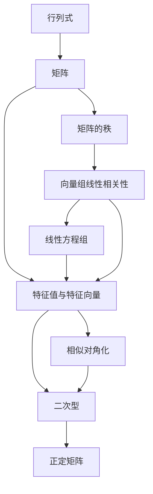

# 线性代数学习大纲

> 面向 **考研数学二 / 408 统考** 的线性代数学习路径。数二线代约占 22%（约 33 分），难度集中在特征值与二次型大题。

---

## 📌 元信息

| 项目 | 说明 |
|------|------|
| **考试定位** | 考研数学二，线性代数约占 22%（约 33 分） |
| **分值分布** | 选择题 3 道（约 15 分）+ 填空题 1 道（约 5 分）+ 解答题 1 道（约 13 分） |
| **核心能力** | 抽象计算能力（矩阵运算、特征值）、几何直观（向量空间、线性变换） |
| **学习周期** | 约 3-4 周（基础阶段） |
| **教材推荐** | 同济大学《线性代数》第六版 / 李永乐《线性代数辅导讲义》 |

---

## 🧠 知识体系总览

> ⚠️ **大题链路**：第 5 章（特征值）+ 第 6 章（二次型）联合出题是数二解答题（13 分）的固定模式，典型路径为"求特征值 → 正交对角化 → 化二次型为标准形"。复习时务必打通这两章的综合题。

**知识线**：
1. **计算线**：行列式 → 矩阵运算 → 线性方程组求解 → 特征值 → 二次型标准化
2. **几何线**：向量 → 线性表示 → 秩与线性相关性 → 特征值的几何意义

---

## 📚 学习内容

### 第 1 章：行列式

| 知识点 | 要求 | 说明 |
|--------|------|------|
| 行列式的定义（逆序数） | 理解 | 二、三阶行列式展开的规律 |
| 行列式的 7 条性质 | **掌握** | 转置、交换、倍加、提取、拆分等 |
| 行列式按行/列展开 | **掌握** | 余子式、代数余子式 |
| 范德蒙德行列式 | 了解 | 特殊结构直接出结果 |
| 拉普拉斯展开 | 了解 | 分块行列式的计算方法 |
| 克莱姆法则 | 了解 | 用于求解线性方程组的理论，低频考点 |

**高频题型**：
- 抽象行列式计算（利用性质化简）
- 参数行列式计算（含未知数）
- 递推公式求 n 阶行列式

### 第 2 章：矩阵

| 知识点 | 要求 | 说明 |
|--------|------|------|
| 矩阵的定义与运算 | **掌握** | 加法、数乘、乘法（不可交换！） |
| 转置与对称矩阵 | **掌握** | 对称矩阵的性质 |
| 逆矩阵 | **掌握** | 伴随矩阵法、初等变换法 |
| 伴随矩阵 $A^*$ | **掌握** | $A^*A=(\det A)E$、$\det(A^*)=(\det A)^{n-1}$、$(A^*)^*=(\det A)^{n-2}A$ |
| 分块矩阵 | 掌握 | 分块求逆、分块乘法 |
| 矩阵的秩 | **掌握** | 秩的定义、性质、求法 |
| 初等变换与初等矩阵 | **掌握** | 左乘行变、右乘列变 |
| 矩阵方程 | 掌握 | 化简为 $AX=B$ 或 $XA=B$ |

**易错点**：
- $AB = 0 \not\Rightarrow A = 0 \text{ 或 } B = 0$
- $(AB)^{-1} = B^{-1}A^{-1}$（顺序交换）
- 矩阵乘法不可交换， $(A+B)^2 = A^2 + AB + BA + B^2$

### 第 3 章：向量组与线性相关性

| 知识点 | 要求 | 说明 |
|--------|------|------|
| n 维向量 | 理解 | 行向量与列向量 |
| 线性组合与线性表示 | **掌握** | 线性表示 $\iff$ 非齐次方程组有解 |
| 线性相关与线性无关 | **掌握** | 核心定义、性质判断 |
| 向量组的秩与极大无关组 | **掌握** | 与矩阵秩的关系 |
| 向量空间 | 了解 | 基、维数、坐标变换 |

**核心定理**：
- $n+1$ 个 $n$ 维向量必线性相关
- 向量组 $A$ 可由 $B$ 线性表示 $\Rightarrow r(A) \le r(B)$
- 线性无关的向量组添加分量后仍无关

### 第 4 章：线性方程组

| 知识点 | 要求 | 说明 |
|--------|------|------|
| 齐次线性方程组 | **掌握** | 解的结构、基础解系、通解 |
| 非齐次线性方程组 | **掌握** | 有解判定、通解 = 齐次通解 + 特解 |
| 方程组与向量的关系 | **掌握** | 用秩判断解的情况 |

**判定表**：

| 条件 | 齐次方程组 | 非齐次方程组 |
|------|-----------|------------|
| $r(A) = n$ | 唯一零解 | 唯一解 |
| $r(A) < n$ | 无穷多解（基础解系含 $n-r$ 个向量） | 无穷多解或**无解** |
| $r(A) \ne r(\bar{A})$ | — | 无解 |

### 第 5 章：特征值与特征向量

| 知识点 | 要求 | 说明 |
|--------|------|------|
| 特征值与特征向量的定义 | **掌握** | $A\alpha = \lambda\alpha$ |
| 特征多项式 | **掌握** | $|\lambda E - A| = 0$ |
| 相似矩阵 | **掌握** | $P^{-1}AP = B$ |
| 相似对角化 | **掌握** | 充要条件： $A$ 有 $n$ 个线性无关的特征向量 |
| 实对称矩阵 | **掌握** | 必可正交相似对角化 |

**高频题型**：
- 已知特征值反求矩阵参数
- 判断矩阵能否对角化
- 实对称矩阵的正交对角化
- 特征值的性质： $\sum \lambda_i = \text{tr}(A)$， $\prod \lambda_i = |A|$

### 第 6 章：二次型

| 知识点 | 要求 | 说明 |
|--------|------|------|
| 二次型的矩阵表示 | **掌握** | $x^TAx$， $A$ 为对称矩阵 |
| 配方法化二次型为标准形 | **掌握** | 拉格朗日配方法 |
| 正交变换法 | **掌握** | 用正交矩阵化二次型 |
| 惯性定理与规范形 | **掌握** | 正负惯性指数 |
| 正定二次型 | **掌握** | 顺序主子式全 $> 0$ |
| 正定矩阵的判定 | **掌握** | 等价条件综合运用 |

**正定矩阵等价条件**（高频考点）：
1. 所有特征值 $\lambda_i > 0$
2. 各阶顺序主子式全 $> 0$
3. 正惯性指数 $= n$
4. 存在可逆矩阵 $C$，使 $A = C^TC$

**三种矩阵关系辨析**（选择题高频混淆点）：

| 关系 | 定义 | 不变量 | 典型场景 |
|------|------|--------|---------|
| 等价 | $B = PAQ$（$P, Q$ 可逆） | 秩 | 初等变换、方程组 |
| 相似 | $B = P^{-1}AP$ | 特征值、迹、行列式 | 对角化 |
| 合同 | $B = C^TAC$（$C$ 可逆） | 正负惯性指数 | 二次型标准化 |

> 关系：相似 $\Rightarrow$ 等价；合同 $\Rightarrow$ 等价；相似与合同**互不蕴含**（实对称矩阵除外）。

---

## ✅ 基础阶段验收清单

- [ ] 能在 3 分钟内完成 4 阶行列式计算，熟练运用性质化简
- [ ] 能在 5 分钟内完成矩阵求逆（初等变换法）和求秩
- [ ] 能判断向量组的线性相关性，2 分钟内求出极大无关组
- [ ] 能用秩判断线性方程组解的情况，正确写出通解（齐次 + 非齐次）
- [ ] 能在 5 分钟内完成 3 阶矩阵的特征值与特征向量计算
- [ ] 能判断矩阵是否可对角化，10 分钟内完成实对称矩阵正交对角化
- [ ] 能化二次型为标准形（配方法 + 正交变换法），能判断正定矩阵
- [ ] 能独立完成一道"特征值 → 对角化 → 二次型"综合大题（15 分钟内）

---

## 🔗 关联模块

- [calculus/](../calculus/readme.md) — 高等数学
- [probability-statistics/](../probability-statistics/readme.md) — 概率论与统计
- [discrete-mathematics/](../discrete-mathematics/readme.md) — 离散数学
