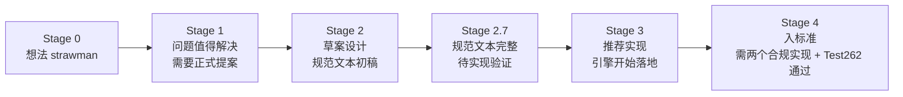

# 01 - 语言与规范演进

> 对应大纲篇目 01 | 面试可答：JavaScript 是 ECMAScript 规范的实现，TC39 按 Stage 0→4 推进提案、每年 6 月底发布新版本；能按版本说出 ES2015→ES2026 每个特性解决的痛点，并用特性检测而非 UA 嗅探做兼容

## 学习目标

- 能说清 ECMAScript 与 JavaScript 的规范/实现关系，以及 V8 / JSC / SpiderMonkey 三大引擎各自宿主
- 能画出 TC39 提案 Stage 0→4 流程，说出每个阶段的准入门槛（尤其 Stage 4 需要两个合规实现 + Test262）
- 能按版本说出 ES2023/2024/2025/2026 各 3 个以上特性及其解决的痛点
- 能说出 Decorators 降回 Stage 2.7、Record & Tuple 撤回这两个"提案会倒退"的实证案例
- 会写特性检测代码，说清 polyfill 与转译的分工

## 核心概念

### ECMAScript 是规范，JavaScript 是实现

ECMA-262（由 Ecma International 的 TC39 委员会维护）定义的是 **ECMAScript**：语法、类型、内置对象（`Array`/`Promise`/`JSON`…）、执行模型。而"JavaScript"是这门规范的实现加上**宿主环境**提供的能力：

- 浏览器补上 DOM/BOM/Fetch/setTimeout（属 HTML 规范，不是 ECMA-262）——交叉链接：front/javascript/web-apis
- Node/Bun 补上 `fs`/`process`/事件循环阶段差异——交叉链接：同目录 `../node/`、`../bun/`

一个判断技巧：**在 ECMA-262 规范文档里搜不到的 API，就不是语言本体**。`setTimeout` 搜不到，`queueMicrotask` 搜得到。

引擎格局（语言本体的规范最终由它们落地）：

| 引擎 | 宿主 | 语言 | 备注 |
|------|------|------|------|
| V8 | Chrome / Edge / Node | C++ | 市占率最高，博客（v8.dev/blog）是引擎实现细节的第一手来源 |
| JavaScriptCore (JSC) | Safari / WebKit | C++ | 唯一实现了尾调用优化（TCO）的主流引擎 |
| SpiderMonkey | Firefox | C++/Rust | 历史上第一个 JS 引擎（1995，Brendan Eich） |

引擎差异直接影响"规范有但实现没有"的问题，例如尾调用优化：规范（ES2015）要求严格模式尾调用不增长调用栈，但 V8 从未实现、JSC 实现了——这就是"规范级解释"必须带上引擎维度的原因（详见 05 篇）。

### TC39 提案流程：Stage 0 → 4

任何新特性都要走 TC39 流程。每年开 6 次左右会议，**每年 6 月底由 Ecma 大会批准一个新版本**（ES2026 即 2026-06-30 批准的第 17 版）。



各阶段一句话本质：

| Stage | 准入含义 | 对使用者的意义 |
|-------|----------|----------------|
| 0 | 任何想法都可挂上来 | 不要碰 |
| 1 | 委员会认可"这个问题值得解决" | 方向值得关注，语法随时变 |
| 2 | 有了规范文本初稿，设计基本成型 | 可以开始讨论 |
| 2.7 | 规范文本完整、等待实现验证（2024 年引入的中间档） | 语法趋稳，但仍可能降回 |
| 3 | 推荐引擎实现 | 可以配合 flag / polyfill 试用 |
| 4 | 两个合规实现 + Test262 测试全过，等下一年 6 月入标准 | 可以放心上生产（配合 Baseline 判断） |

关键认知：**Stage 只进不退是错觉**。Stage 3 的提案可以被降回（Decorators），甚至可以整体撤回（Record & Tuple），见下文"前瞻与警示"。

### ES2015 → ES2026 特性地图

记特性别记名词，记**它解决了什么问题**：

| 版本 | 代表特性 | 解决的痛点 |
|------|----------|------------|
| ES2015（ES6） | `let`/`const`、`class`、`Promise`、Generator、ESM、`Proxy`、`Symbol`、`Map`/`Set`、箭头函数 | 现代 JS 起点：块级作用域终结 `var` 提升陷阱；Promise 终结回调地狱；ESM 让语言原生模块化 |
| ES2016 | `Array.prototype.includes`、`**` 幂运算符 | `indexOf !== -1` 的意图不清；`Math.pow` 太啰嗦 |
| ES2017 | `async`/`await` | Promise 链仍然嵌套、错误处理别扭；async/await 让异步代码写成同步形状 |
| ES2018 | 对象 rest/spread、异步迭代（`for await...of`）、`Promise.prototype.finally` | 对象解构补齐数组已有的能力；异步流（如分页读取）可迭代；finally 收拢清理逻辑 |
| ES2019 | 可选 `catch` 绑定、`flat`/`flatMap`、`Object.fromEntries` | 不用的错误变量可以不写；多维数组拍平不再手写递归；`fromEntries` 与 `entries` 闭环 |
| ES2020 | 可选链 `?.`、空值合并 `??`、`BigInt`、`globalThis`、动态 `import()`、`Promise.allSettled` | 见下方代码；`??` 只在 null/undefined 时兜底，修复 `||` 误伤 0/''/false；统一全局对象引用 |
| ES2021 | `replaceAll`、`Promise.any`、`WeakRef`/`FinalizationRegistry`、逻辑赋值（`??=` 等）、数字分隔符 | `replace` 默认只换第一个；any 满足"任一成功即可"的竞速场景；弱引用支持缓存与 GC 观察 |
| ES2022 | class 公有/私有字段、私有方法、`static` 块、top-level `await`、`.at()`、`Error.cause`、`Object.hasOwn`、RegExp `d` 标志、`#x in obj` | 私有成员不再靠 `_` 约定与闭包；ESM 顶层可直接 await；`.at(-1)` 取末位；错误链可溯源 |
| ES2023 | `findLast`/`findLastIndex`、`toReversed`/`toSorted`/`toSpliced`/`with`、Hashbang、Symbol 可作 WeakMap 键 | 倒着找不用再 reverse；不可变四件套终结"原地修改污染共享数组"；脚本首行可写 `#!/usr/bin/env node` |
| ES2024 | `Object.groupBy`/`Map.groupBy`、`Promise.withResolvers`、`isWellFormed`/`toWellFormed`、`Atomics.waitAsync`、RegExp `v` 标志 | groupBy 进入标准库；withResolvers 解耦 promise 的创建与 resolve；安全处理孤立代理对 |
| ES2025 | Set 集合运算 7 方法、Iterator Helpers（惰性）、`Promise.try`、`RegExp.escape`、Import Attributes（`with { type: 'json' }`）、`Float16Array` + `Math.f16round`、正则内联标志 `(?i:...)`、重复命名捕获组 | 集合运算不再手写 filter/has；惰性迭代避免中间数组；`try` 统一同步/异步函数的包裹 |
| ES2026（第 17 版，2026-06-30 批准，标准库补强年） | `Array.fromAsync`、`Error.isError`、`Math.sumPrecise`、Uint8Array base64/hex、`Iterator.concat`、JSON.parse source text access、Upsert（`getOrInsert`/`getOrInsertComputed`） | 见下方逐项代码 |

ES2020 的可选链与空值合并解决的真实问题：

```js
const user = undefined
// 旧写法：层层防御，漏一层就 TypeError
const city = user && user.address && user.address.city

// ?. 只在 null/undefined 时短路返回 undefined
const city2 = user?.address?.city
console.log(city2) // undefined（user 为 undefined 也不炸）

// ?? 与 || 的关键差异：?? 只认 null/undefined
const port = 0
console.log(port || 3000) // 3000 —— 0 被误伤
console.log(port ?? 3000) // 0 —— 语义正确
```

ES2026 标准库补强逐项看"解决什么"：

```js
// 注：块内 Math.sumPrecise / getOrInsertComputed / Error.isError / Iterator.concat 为 ES2026 新增 API，
// 当前 bun 1.1.38 尚未实现（运行会 TypeError），需支持 ES2026 的较新环境；Uint8Array base64 与 Array.fromAsync 已可用
// Math.sumPrecise：浮点累加误差终结
console.log([0.1, 0.2, 0.3].reduce((a, b) => a + b, 0)) // 0.6000000000000001
console.log(Math.sumPrecise([0.1, 0.2, 0.3])) // 0.6

// Upsert：Map 取值带默认插入，省掉 if (!map.has(k)) 三连
const counts = new Map()
const list = counts.getOrInsertComputed('key', () => [])
list.push(1)
console.log(counts.get('key')) // [1]

// Error.isError：跨 realm（iframe/worker）下 instanceof Error 会失效，它是规范级判断
console.log(Error.isError(new Error('x'))) // true
console.log(Error.isError({ message: 'fake' })) // false

// Uint8Array 原生 base64/hex：不再手写编解码
const bytes = Uint8Array.fromBase64('aGVsbG8=')
console.log(bytes.toHex()) // 68656c6c6f
console.log(bytes.toBase64()) // aGVsbG8=

// Iterator.concat：迭代器拼接（Iterator Sequencing）
const seq = Iterator.concat([1, 2].values(), [3].values())
console.log([...seq]) // [1, 2, 3]

// Array.fromAsync：异步可迭代对象 → 数组，等价 await Promise.all 但语义更直接
const arr = await Array.fromAsync((async function* () { yield 1; yield 2 })())
console.log(arr) // [1, 2]
```

JSON.parse source text access（含 `JSON.rawJSON`）解决"parse 后丢失原始文本形态"：

```js
// 注：JSON source text access 与 JSON.rawJSON 当前 bun 1.1.38 未实现，此处演示 API 形状
// reviver 上下文可通过 this.source 拿到该值的原始源文本
const data = JSON.parse('{"n": 1.10}', function (key, value) {
  if (key === 'n') console.log(this.source) // 1.10 —— 尾部的 0 在数值化后已丢失
  return value
})

// JSON.rawJSON 让 stringify 原样透传一段已验证的 JSON 文本（保留精度/形态）
console.log(JSON.stringify({ raw: JSON.rawJSON('1.10') })) // {"raw":1.10}
console.log(JSON.isRawJSON(JSON.rawJSON('1'))) // true
```

### 前瞻与警示：提案会倒退

按 2026-08 的时点，以下都**不在** ES2026，属于 ES2027 候选：

| 提案 | 状态（2026-08） | 说明 |
|------|----------------|------|
| Temporal | 2026-03 达 Stage 4，收录 ES2027 | 替代 Date 的现代日期时间 API；Chrome 144+ / Firefox 139+ 已原生可用，过渡期用官方 polyfill（`@js-temporal/polyfill`） |
| `using` / `await using`（显式资源管理） | ES2027 候选 | 类比 Python with / C# using，作用域结束自动 dispose |
| `import defer`（延迟导入） | ES2027 候选 | 把模块求值推迟到首次访问，优化启动路径 |
| Decorators | **Stage 2.7（2026-05 从 Stage 3 降级）** | 与 TS 5.0 已实现的旧版装饰器语义不同步，规范侧仍在返工 |
| Pattern Matching | 推进中 | `match` 表达式的结构化模式匹配 |
| Record & Tuple | **2026-05 已撤回** | 不可变数据结构提案终止 |

教训直接给结论：

1. **Stage 3 不等于稳了**——Decorators 从 Stage 3 降回 2.7，Record & Tuple 直接撤回。生产代码依赖未入标准的语法，等于把重构成本记在将来。
2. **TypeScript 提前实现的特性也可能与规范分叉**——TS 装饰器与 TC39 装饰器就是活例子，选型时看规范进度而不是"TS 支持了没有"。
3. 想跟进度的权威来源是 tc39.es/proposals 与 Baseline，而不是框架博客。

### 兼容策略：特性检测优先于 UA 嗅探

```js
// ✅ 特性检测：能力存在就用，不存在就降级
const last = (arr) => (Array.prototype.at ? arr.at(-1) : arr[arr.length - 1])

// 带降级的检测模板
const groupBy = (items, keyFn) => {
  if (typeof Object.groupBy === 'function') {
    return Object.groupBy(items, keyFn)
  }
  // polyfill 分支
  const out = Object.create(null)
  for (const item of items) {
    const key = keyFn(item)
    ;(out[key] ??= []).push(item)
  }
  return out
}

// ❌ UA 嗅探：UA 可伪造、浏览器会伪装（历史上 Safari/Chrome 互相伪装），
//    且"浏览器 X 版本"与"是否支持特性 Y"之间没有可靠映射
const bad = /Chrome\/(\d+)/.test(navigator.userAgent)
```

分工结论：

- **转译（Babel/SWC）**：解决**语法**问题——新语法转旧语法（`?.`、class 字段）。
- **polyfill**：解决 **API** 问题——运行期补齐缺失的内置对象/方法（`Promise.withResolvers`、`Object.groupBy`）。语法无法 polyfill，API 一般不必转译。
- **Baseline**：web.dev 的跨浏览器可用性标注（Baseline Widely Available ≈ 四大浏览器 30 个月以上均支持），是"敢不敢裸用"的第一判据；精细到版本看 compat-table。
- 工程化细节（browserslist、polyfill 服务、构建配置）——交叉链接：front/javascript/engineering。

## 常见踩坑点

### 1. 把 Stage 3 当"已定稿"写进生产

```js
// 某项目 2025 年按 TC39 Stage 3 装饰器语法写了一套框架
// 2026-05 该提案降回 Stage 2.7，语义返工
// 结果：升级路径被锁死，Babel/TS 的装饰器实现与最终规范分叉
```

实际结果：装饰器代码无法平滑跟进规范，要么冻结工具链版本，要么推倒重写。规则：**Stage 4 之前一律隔离在实验分支**。

### 2. `??` 与 `||` 混用导致默认值语义漂移

```js
const retry = 0
console.log(retry || 3) // 3 —— 0 是合法值却被替换
console.log(retry ?? 3) // 0 —— 只有 null/undefined 才走默认
```

实际结果：用 `||` 给数值/字符串默认值时，`0`、`''`、`false` 全部被误伤；判空兜底默认用 `??`。

### 3. `replaceAll` 在旧引擎上是 SyntaxError 级别的缺失

```js
// 运行在不支持 ES2021 的旧环境
'a-b-c'.replaceAll('-', '_') // TypeError: replaceAll is not a function
```

实际结果：API 缺失是**运行期**报错，构建期发现不了。这是 polyfill（API 层）与转译（语法层）必须分工的原因；发布前用 Baseline/compat-table 核对目标浏览器。

### 4. 顶层 await 的传染性没搞清楚就乱用

```js
// esm 模块 a.mjs（fetch 是宿主 API；'/config.json' 为相对 URL 示意，实际解析取决于浏览器/服务端环境）
export const data = await fetch('/config.json').then((r) => r.json())

// 任何 import 了 a.mjs 的模块，整条依赖链都变成异步求值
// 在循环依赖或同步入口场景会直接卡死或报错
```

实际结果：top-level await（ES2022，仅 ESM）会让依赖它的模块全部延迟求值；CJS 里写顶层 await 直接 SyntaxError。用前先确认模块系统与依赖图。

### 5. 用 `instanceof Error` 判断跨 realm 错误

```js
// iframe / worker / vm 里创建的 Error，原型链与当前 realm 不同
// err instanceof Error === false
// 注：Error.isError 为 ES2026 API，当前 bun 1.1.38 未实现
console.log(Error.isError(new Error('x'))) // true —— ES2026 的规范级判断
```

实际结果：`instanceof` 是原型链查找，跨 realm 必失败；ES2026 起用 `Error.isError`（03 篇展开）。

## 面试高频问题

- ECMAScript 和 JavaScript 什么关系？——规范与实现；宿主 API（DOM/Node API）不在 ECMA-262 内
- 三大引擎分别跑在哪里？V8/JSC/SpiderMonkey 与 Chrome/Safari/Firefox 的对应
- TC39 流程各阶段的准入门槛？Stage 4 的硬性条件是什么？
- 为什么 ES 每年发一版而不像 ES6 那样憋大招？（年度火车模型：到点发车，特性自己赶车）
- ES2015 最重要的三个特性？（let/const、Promise、ESM，能各自说出解决的痛点）
- async/await 是哪个版本？它和 Promise 的关系？（ES2017；语法糖，编译/引擎层由 Promise + 状态机实现，见 07 篇）
- 可选链和 `&&` 链的区别？`??` 和 `||` 的区别？
- ES2023 的不可变数组四件套解决什么？（toReversed/toSorted/toSpliced/with 避免原地修改共享数组）
- ES2026 有哪些特性？（标准库补强年：Math.sumPrecise、Upsert、base64/hex、Iterator.concat、Array.fromAsync、Error.isError、JSON source text access）
- Decorators 现在什么阶段？Record & Tuple 呢？（2.7 降级 / 已撤回——考察是否真跟进社区）
- 如何做新特性兼容？（Baseline 判断 → 语法转译 + API polyfill + 特性检测，禁止 UA 嗅探）

## 面试回答模板

> **问：ECMAScript 和 JavaScript 是什么关系？**
>
> ECMAScript 是 Ecma International 的 TC39 委员会维护的语言规范（ECMA-262），定义语法、类型系统和内置对象；JavaScript 是这门规范的实现加宿主环境能力。浏览器补 DOM/BOM，Node/Bun 补 fs、process，这些都不在 ECMA-262 里。判断一个 API 是不是语言本体，就看它能不能在 ECMA-262 规范文本里搜到——比如 queueMicrotask 在，setTimeout 不在。

> **问：说说 TC39 的提案流程。**
>
> 提案分五个阶段：Stage 0 是想法收集；Stage 1 要论证问题值得解决；Stage 2 给出规范文本初稿；Stage 2.7 是规范文本完整、等待实现验证的中间档；Stage 3 推荐引擎实现；Stage 4 入标准，硬性条件是两个合规实现加 Test262 测试全部通过。每年 6 月底 Ecma 大会批准一个新版本，比如 ES2026 是 2026-06-30 批准的第 17 版。要注意阶段可逆：Decorators 2026 年从 Stage 3 降回了 2.7，Record & Tuple 直接撤回。

> **问：ES2026 有什么新特性？**
>
> ES2026 是标准库补强年。Math.sumPrecise 解决浮点累加误差；Map/WeakMap 的 getOrInsert/getOrInsertComputed 终结 has+set 三连；Uint8Array 原生 base64/hex 编解码；Iterator.concat 拼接迭代器；Array.fromAsync 把异步可迭代对象收成数组；Error.isError 提供跨 realm 的规范级错误判断；JSON.parse source text access 让 reviver 能拿到源文本，配合 JSON.rawJSON 可以原样透传数值精度。

> **问：项目里怎么安全地使用新语法和新 API？**
>
> 三步：第一看 Baseline 和 compat-table 确认目标浏览器支持面；第二分工处理——语法问题交给转译（Babel/SWC 把 ?. 这类语法降级），API 问题交给 polyfill（运行期补齐 Object.groupBy 这类内置对象）；第三代码里用特性检测而不是 UA 嗅探，因为 UA 可伪造且版本映射不可靠。Stage 4 之前的提案一律不上生产，Decorators 降级和 Record & Tuple 撤回都是教训。

## 练习

### 1. 特性检测工具

**要求**：实现 `detect(paths)`，输入全局路径列表（如 `'Array.prototype.at'`、`'Object.groupBy'`），返回 `{ [path]: boolean }` 支持表；访问任何不存在的路径都不能抛异常。

**提示**：按 `.` 分段逐层访问，中间节点必须是对象或函数才能继续；叶子节点只判断非 null/undefined（函数也是有效特性）。

**预期效果**：detect() 返回 `{ [path]: boolean }`（Record<string, boolean>）支持表，探测任何路径都不抛异常；`'Array.prototype.notExist'` 恒为 false；`'Math.sumPrecise'` 等 ES2026 项取决于环境（当前 bun 1.1.38 为 false）。

```ts
// ex01-detect.test.ts
import { expect, test } from 'bun:test'

// 参考实现
const detect = (paths: string[]): Record<string, boolean> => {
  const result: Record<string, boolean> = {}
  for (const path of paths) {
    let current: unknown = globalThis
    let alive = true
    for (const part of path.split('.')) {
      if (current == null || (typeof current !== 'object' && typeof current !== 'function')) {
        alive = false
        break
      }
      current = (current as Record<string, unknown>)[part]
    }
    result[path] = alive && current != null
  }
  return result
}

test('detects ES features without throwing', () => {
  const table = detect([
    'Array.prototype.at', // ES2022
    'Object.groupBy', // ES2024
    'Promise.withResolvers', // ES2024
    'Math.sumPrecise', // ES2026
    'Array.prototype.notExist' // 对照组
  ])
  expect(table['Array.prototype.at']).toBe(true)
  expect(table['Object.groupBy']).toBe(true)
  expect(table['Promise.withResolvers']).toBe(true)
  expect(table['Math.sumPrecise']).toBe((Math as Record<string, unknown>).sumPrecise != null) // ES2026 项随环境而定（当前 bun 1.1.38 为 false）
  expect(table['Array.prototype.notExist']).toBe(false)
})
```

### 2. 手写 Object.groupBy polyfill

**要求**：实现 `groupBy(items, keyFn)`，行为对齐 `Object.groupBy`：返回**空原型对象**，键为 keyFn 结果转属性键，值为保持原顺序的数组。

**提示**：`Object.create(null)` 创建空原型对象；判重不能用 `hasOwnProperty`（空原型对象没有），用 `key in out`；keyFn 签名是 `(value, index)`。

**预期效果**：

```ts
// ex02-groupby.test.ts
import { expect, test } from 'bun:test'

// 参考实现
const groupBy = (items: Iterable<unknown>, keyFn: (value: unknown, index: number) => PropertyKey) => {
  const out = Object.create(null)
  let index = 0
  for (const item of items) {
    const key = String(keyFn(item, index++))
    if (key in out) {
      out[key].push(item)
    } else {
      out[key] = [item]
    }
  }
  return out
}

test('groupBy polyfill matches native semantics', () => {
  const out = groupBy([1, 2, 3, 4], (n) => ((n as number) % 2 === 0 ? 'even' : 'odd'))
  expect(out.odd).toEqual([1, 3])
  expect(out.even).toEqual([2, 4])
  expect(Object.getPrototypeOf(out)).toBeNull()
})
```

### 3. ES2026 支持度报告脚本

**要求**：写 `es2026-report.mjs`，用 top-level await + 特性检测，逐项输出 ES2026 七个特性的支持布尔值，末尾输出 `x/7` 汇总。

**提示**：复用练习 1 的 detect；`Iterator.concat` 用 `'concat' in Iterator` 判断（Bun 旧版本可能未实现，正好作为降级案例）。

**预期效果**：新版 Bun 输出 `7/7`；缺项环境对应行为 false 且汇总数下降——脚本本身不抛错。

## 本模块完成标准

- [ ] 能说清 ECMAScript 与 JavaScript 的规范/实现关系，会判断一个 API 是否属于语言本体
- [ ] 能画出 TC39 Stage 0→4 流程，说出 Stage 4 准入条件（两个合规实现 + Test262）与每年 6 月发版的节奏
- [ ] 能按版本说出 ES2023/2024/2025/2026 各 3 个以上特性及其解决的痛点
- [ ] 能举出"提案会倒退"的实证（Decorators 降回 2.7、Record & Tuple 撤回）并说明生产启示
- [ ] 会写带降级的特性检测代码，说清 Baseline / 转译 / polyfill 的分工