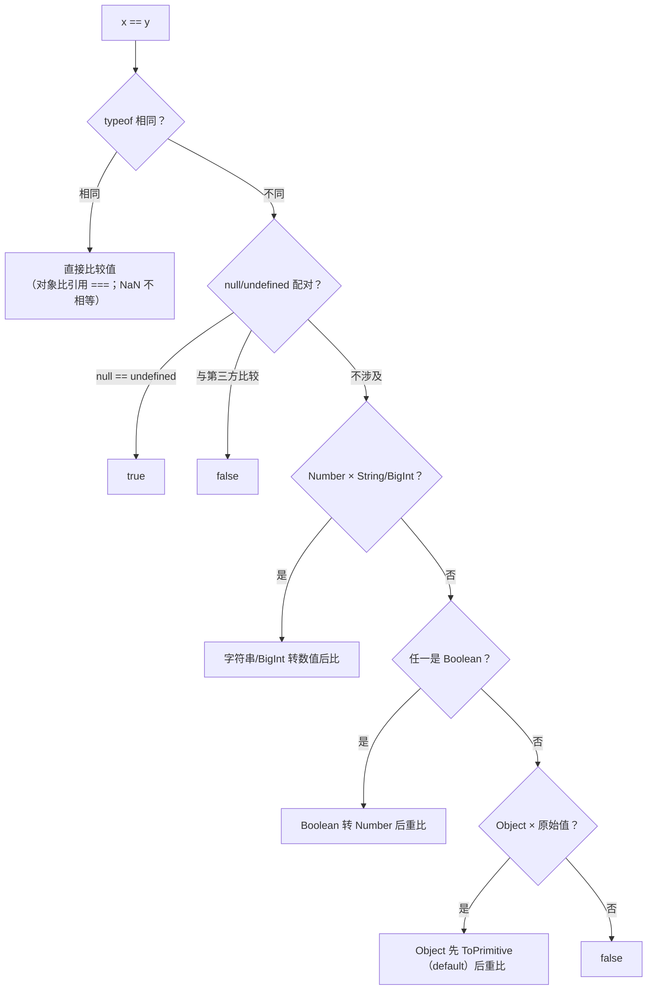

# 02 - 类型与转换

> 对应大纲篇目 02 | 面试可答：JS 是动态类型而非弱类型，8 种类型（7 原始 + Object）加三套显式转换（ToBoolean/ToNumber/ToString）与一套抽象相等算法；typeof null === 'object' 是 1995 年的 tag 位 bug，Object.is 是 ES2015 的 SameValue，能现场推导 [] + {} 与 {} + [] 的每一步

## 学习目标

- 能列出 8 种类型并说全 typeof 的全部返回串，解释 `typeof null === 'object'` 的历史成因与 typeof 对未声明变量、TDZ 变量的差异
- 能说清装箱拆箱的临时包装机制，以及 ToPrimitive 的三种 hint 下 Symbol.toPrimitive > valueOf/toString 的优先级矩阵
- 能默写 ToBoolean/ToNumber/ToString 对 ''、0、-0、NaN、null、undefined、'0'、' '、[]、{}、[1]、[1,2] 的转换结果
- 能按规范步骤推导 `[] + {}` 与 `{} + []`，说清 `==`/`===`/`Object.is` 在 NaN 与 +0/-0 上的差异
- 能说清 Symbol 唯一性与全局注册表、BigInt 与 Number 的互操作边界（混算 TypeError、JSON.stringify 报错与 toJSON 解法）

## 核心概念

### 8 种类型与 typeof 全家桶

规范（ECMA-262 §6.1）定义 8 种类型：7 个原始类型（Undefined、Null、Boolean、Number、BigInt、String、Symbol）加 Object。注意"动态类型"与"弱类型"是两回事：JS 是动态类型（变量无类型、值有类型），隐式转换发生在**运算符对值做抽象操作**时，而不是变量层面。

```js
console.log(typeof undefined) // 'undefined'
console.log(typeof null) // 'object' —— 历史性 bug，见下
console.log(typeof true) // 'boolean'
console.log(typeof 42) // 'number'
console.log(typeof 42n) // 'bigint'
console.log(typeof 'str') // 'string'
console.log(typeof Symbol()) // 'symbol'
console.log(typeof {}) // 'object'
console.log(typeof []) // 'object' —— typeof 分不出数组
console.log(typeof function () {}) // 'function' —— 规范上函数是 Object 的子类（[[Call]]）
```

typeof 的返回串只有这 8 个：`'undefined'`、`'object'`、`'boolean'`、`'number'`、`'bigint'`、`'string'`、`'symbol'`、`'function'`，没有 `'null'`、也没有 `'array'`。精确类型判断用组合拳：

```js
const typeOf = (v) =>
  v === null ? 'null'
  : Array.isArray(v) ? 'array'
  : typeof v

console.log(typeOf(null)) // 'null'
console.log(typeOf([1])) // 'array'
console.log(typeOf(new Date())) // 'object' —— 细分内置类用 Object.prototype.toString
console.log(Object.prototype.toString.call(new Date())) // '[object Date]'
console.log(Object.prototype.toString.call(null)) // '[object Null]'
```

**typeof null === 'object' 的历史成因**：1995 年 JS 第一版实现里，值以 32 位存储，类型标签在低位（tag bits），对象的标签是 0。null 被表示为空指针（0x00），类型标签恰好也是 0，于是 typeof null 落进了 'object' 分支。ES6 时期曾有提案修正为 'null'，因会破坏存量代码（典型如 `typeof x === 'object' && x !== null` 的守卫写法）被否决，永久保留。

```js
// 判 null 的正确姿势
const isNull = (v) => v === null
console.log(isNull(null)) // true
// typeof null === 'object' 永远成立，别指望 typeof 判 null
```

**typeof 对未声明变量的特殊行为**：访问未声明的标识符会抛 ReferenceError，但 `typeof` 对未声明变量返回 'undefined' 而不抛错——这是它历史上被用作"安全特性检测"的原因。但要区分 TDZ：`let` 声明的变量在初始化前 typeof 会抛错（绑定已存在但未初始化），真正"未声明"的才返回 'undefined'。

```js
console.log(typeof neverDeclared) // 'undefined' —— 不抛 ReferenceError

// typeof 曾用于检测可选全局（DOM 时代遗留）
if (typeof window !== 'undefined') { /* 浏览器环境 */ }

// 反例：TDZ 内 typeof 会抛
// let x
// console.log(typeof x) // ❌ ReferenceError: Cannot access 'x' before initialization
```

### 装箱拆箱：原始值如何调用方法

原始值没有属性，但 `'str'.toUpperCase()` 能用。机制：引擎在访问属性的一瞬间创建一个**临时包装对象**（String/Number/Boolean 包装器），取完属性立即丢弃。每次访问都是新包装，所以给原始值挂属性永远无效：

```js
const s = 'abc'
try {
  s.custom = 1 // ESM 是严格模式：给原始值挂属性直接抛 TypeError（非严格模式才是静默失败：临时包装挂上属性后被丢弃）
} catch (e) {
  console.log(e.constructor.name) // 'TypeError'
}
console.log(s.custom) // undefined —— 这次访问又是全新的包装

// 包装对象与原始值不是同一回事
console.log(typeof new String('a')) // 'object'
console.log(new String('a') === 'a') // false（对象与原始值，=== 不转换）
console.log(new String('a') == 'a') // true（对象一侧先 ToPrimitive 成 'a'）
```

symbol 与 bigint 也有对应包装，同样支持方法调用（`Symbol('x').toString()`、`(1n).toString(2)`）。

### ToPrimitive：hint 与优先级矩阵

对象出现在"需要原始值"的位置（`+`、模板字符串、比较运算符、`Number()`…）时，规范走 OrdinaryToPrimitive(input, hint) 把它转成原始值。hint 有三种：

- `'number'`：`Number(obj)`、比较运算符、`+obj`（一元加）
- `'string'`：模板字符串、`String(obj)`
- `'default'`：二元 `+`、`==`（大多数对象按 number 顺序处理；Date 重写为 string 顺序）

查找顺序：**Symbol.toPrimitive 方法存在就独占**；否则 number/default 按 valueOf → toString，string 按 toString → valueOf。

```js
const obj = {
  [Symbol.toPrimitive](hint) {
    return hint === 'number' ? 42 : hint === 'string' ? 'str' : 'default'
  }
}
console.log(+obj) // 42 —— hint 'number'
console.log(`${obj}`) // 'str' —— hint 'string'
console.log(obj + '') // 'default' —— hint 'default'
console.log(obj + 1) // 'default1' —— 'default' 拼串
console.log(obj > 0) // true —— 42 > 0
```

同时定义三个钩子，观察谁赢：

```js
const both = {
  valueOf() { return 'valueOf' },
  toString() { return 'toString' },
  [Symbol.toPrimitive](hint) { return `toPrimitive:${hint}` }
}
console.log(+both) // NaN —— Symbol.toPrimitive 独占（hint 'number' 返回 'toPrimitive:number'），一元 + 再 ToNumber 得 NaN
console.log(`${both}`) // 'toPrimitive:string'

const noToPrimitive = {
  valueOf() { return 'valueOf' },
  toString() { return 'toString' }
}
console.log(+noToPrimitive) // NaN —— number/default：valueOf 先（返回 'valueOf'），一元 + 再 ToNumber 得 NaN
console.log(`${noToPrimitive}`) // 'toString' —— string：toString 先

// Date 的特例：default hint 走 string 顺序
console.log(new Date(0) + '') // 'Thu Jan 01 1970 08:00:00 GMT+0800 (China Standard Time)'（本地 toString 串，因时区而异；不是 NaN）
```

优先级矩阵（✓ 表示该位置被调用）：

| hint | Symbol.toPrimitive | valueOf | toString |
|------|:--:|:--:|:--:|
| number | ✓（独占） | 次选 | 兜底 |
| string | ✓（独占） | 兜底 | 首选 |
| default | ✓（独占） | 首选（Date 除外） | 兜底（Date 首选） |

Symbol.toPrimitive 的元编程用法（自定义对象参与运算）留到 08 篇迭代器与元编程展开。

### ToBoolean / ToNumber / ToString 转换矩阵

三个抽象操作是隐式转换的底层。先记一条总纲：**ToBoolean 只看 falsy 清单**（false、0、-0、0n、NaN、''、null、undefined 共 8 个），其余一切转 true——包括 `'false'`、`[]`、`{}`。对象永远是 truthy，但对象的 ToString 结果可以是 ''（如空数组），这是后面 `[] == false` 的伏笔。

```js
// 打印全部 falsy：只有 8 个
console.log([false, 0, -0, 0n, NaN, '', null, undefined].filter((v) => !v).length) // 8
console.log(Boolean('false')) // true —— 非空字符串
console.log(Boolean([])) // true
console.log(Boolean({})) // true
```

| 值 | ToBoolean | ToNumber | ToString |
|----|:--:|:--:|:--:|
| `''` | false | 0 | `''` |
| `0` | false | 0 | `'0'` |
| `-0` | false | -0 | `'0'` |
| `NaN` | false | NaN | `'NaN'` |
| `null` | false | 0 | `'null'` |
| `undefined` | false | NaN | `'undefined'` |
| `'0'` | true | 0 | `'0'` |
| `' '` | true | 0（空白被 trim） | `' '` |
| `[]` | true | 0（先 ToPrimitive 得 `''`） | `''` |
| `{}` | true | NaN（先 ToPrimitive 得 `'[object Object]'`） | `'[object Object]'` |
| `[1]` | true | 1（ToPrimitive 得 `'1'`） | `'1'` |
| `[1,2]` | true | NaN（`'1,2'` 非数值） | `'1,2'`（join） |

关键机制：对象转数值是两步——先 ToPrimitive（default hint，数组的 valueOf 返回自身故走 toString/join），再对结果字符串 ToNumber。空串与纯空白串转数值都是 0；null 转 0、undefined 转 NaN，这对不对称贯穿所有隐式转换。

```js
console.log(Number('')) // 0
console.log(Number(' ')) // 0
console.log(Number(null)) // 0
console.log(Number(undefined)) // NaN
console.log(Number([])) // 0
console.log(Number([1])) // 1
console.log(Number([1, 2])) // NaN
console.log(Number({})) // NaN
console.log(String([])) // ''
console.log(String([1])) // '1'
console.log(String([1, 2])) // '1,2'
console.log(String({})) // '[object Object]'
```

常用触发入口：`+x` 与 `Number(x)` 走 ToNumber；`String(x)` 与模板字符串走 ToString；`!!x` 与 `Boolean(x)` 走 ToBoolean；`x + ''` 走 ToString（对象一侧先 ToPrimitive）。

### == 抽象相等算法

规范（ECMA-262 IsLooselyEqual）浓缩成一张图：



按此推导几个经典式子：

```js
// null/undefined 自成一对，与任何第三方都不等
console.log(null == undefined) // true
console.log(null == 0) // false —— null 只和 undefined 互等
console.log(undefined == '') // false
console.log(undefined == NaN) // false

// '2' == 2：字符串转数值 → 2 == 2
console.log('2' == 2) // true

// true == '2'：Boolean 先转 Number → 1 == '2' → 1 == 2
console.log(true == '2') // false

// [1] == true：对象先 ToPrimitive → '1' == true → 1 == 1
console.log([1] == true) // true

// [] == false：[] → '' → 0，false → 0
console.log([] == false) // true
// [] == null：null 只和 undefined 互等
console.log([] == null) // false
```

**=== 与 Object.is 的差异**：`===`（严格相等）类型不同直接 false、类型相同比值，但 NaN 与自身比较也返回 false、且把 +0 与 -0 视为相等。Object.is（ES2015 引入，SameValue 算法）修正了这两点：Object.is(NaN, NaN) 为 true，Object.is(+0, -0) 为 false。另有 SameValueZero（NaN 相等、+0 与 -0 也相等）用于 Set/Map 的键去重与 `Array.prototype.includes`。

| 比较 | `===` | `Object.is` |
|------|:--:|:--:|
| NaN 与 NaN | false | true |
| +0 与 -0 | true | false |

```js
console.log(NaN === NaN) // false
console.log(Object.is(NaN, NaN)) // true（ES2015）
console.log(+0 === -0) // true
console.log(Object.is(+0, -0)) // false
// SameValueZero 的实际体现：
console.log([NaN].includes(NaN)) // true
console.log(new Set([NaN, NaN]).size) // 1
```

Object.is 的典型用途：`Object.is` 是 React useState 判断 state 是否变化的基准；判 NaN 的标准写法是 `Number.isNaN(x)`（先确认是 number 再判 NaN，不触发转换）而不是 `x !== x` 技巧。

### 完整推导：[] + {} 与 {} + []

这两道题考的是"运算符语义 + 语句/表达式解析"两件事。

```js
console.log([] + {}) // '[object Object]'
console.log({} + []) // '[object Object]' —— console.log 实参是表达式位置，{} 是对象字面量
console.log(([] + {})) // '[object Object]'
console.log(({} + [])) // '[object Object]' —— 括号同样是表达式位置；只有独立语句 {} + [] 才得 0（见下方推导）
```

推导 `[] + {}`：二元 `+` 两侧先 ToPrimitive（default hint）。`[]` 的 valueOf 返回自身（非原始值）→ 走 toString/join → `''`；`{}` 的 valueOf 返回自身 → toString → `'[object Object]'`。`'' + '[object Object]'` 得 `'[object Object]'`。

推导脚本顶层的 `{} + []`：这不是一个表达式，而是**两个语句**——解析器在语句位置看到开头的 `{`，把它解析为空的块语句（Block），`{}` 不参与求值；剩下 `+ []` 是一元加号表达式，`+[]` 走 ToNumber：`[]` → ToPrimitive → `''` → 0。所以整个"表达式"的值就是 `+[]` 的值 0。加括号写成 `({} + [])` 后整体成为括号表达式（对象字面量位置），才得到与 `[] + {}` 相同的 `'[object Object]'`。注意不同宿主 REPL（浏览器控制台 vs node）对 `{} + []` 的处理可能不同，这里以脚本/模块顶层解析为准。

```js
// 拆开验证每一环
console.log([].valueOf() === []) // false（valueOf 返回自身，但此处 [] 是新的字面量，引用不同）
console.log([].toString()) // ''
console.log(({}).toString()) // '[object Object]'
console.log(+'') // 0 —— +[] 的最后一环
console.log(+[]) // 0
// 验证解析差异：赋值语境强制表达式位置
const a = {} + []
console.log(a) // '[object Object]'
```

### Symbol：唯一性与全局注册表

Symbol（ES2015）的核心语义：**每次 Symbol() 调用都产生全局唯一值**，描述串（description）只是调试标签，不参与相等判断。

```js
const s1 = Symbol('id')
const s2 = Symbol('id')
console.log(s1 === s2) // false —— 描述串相同也不相等
console.log(s1.description) // 'id'

// 作属性键：天然防冲突（但非真正私有，可被遍历到）
const ID = Symbol('id')
const user = { [ID]: 7, name: 'kai' }
console.log(user[ID]) // 7
console.log(Object.keys(user)) // ['name'] —— Symbol 键不进 Object.keys
console.log(Reflect.ownKeys(user)) // ['name', Symbol(id)]
```

`Symbol.for(key)` 走**全局注册表**：已注册则返回同一 symbol，否则创建并登记；`Symbol.keyFor` 只反查注册表内的 key。

```js
console.log(Symbol.for('app.id') === Symbol.for('app.id')) // true —— 注册表复用
console.log(Symbol.for('app.id') === Symbol('app.id')) // false —— 普通 Symbol 不入注册表
console.log(Symbol.keyFor(Symbol.for('app.id'))) // 'app.id'
console.log(Symbol.keyFor(Symbol('app.id'))) // undefined
```

内置 Symbol（well-known symbols，ES2015 起陆续引入）是引擎钩子：`Symbol.iterator`、`Symbol.toPrimitive`、`Symbol.hasInstance`、`Symbol.species`、`Symbol.isConcatSpreadable`、`Symbol.toStringTag`、`Symbol.asyncIterator` 等——它们如何用 Proxy/元编程手段覆写，见 08 篇迭代器与元编程。

### BigInt：与 Number 的互操作边界

BigInt（ES2020）表示任意精度整数。与 Number 的边界规则：**相等比较可以混，算术运算不能混**。

```js
console.log(1n == 1) // true —— 抽象相等按数学值比较
console.log(1n === 1) // false —— 类型不同
console.log(2n == 2.0) // true

// 混算一律 TypeError
try {
  1n + 1
} catch (e) {
  console.log(e.constructor.name) // TypeError
}
try {
  1n + 1n // ✅ 同为 BigInt 没问题；Math.* 不接受 BigInt
  Math.max(1n)
} catch (e) {
  console.log(e instanceof TypeError) // true
}

// 字面量与构造：BigInt(1) === 1n
console.log(BigInt(1) === 1n) // true
console.log(BigInt('9007199254740993')) // 9007199254740993n —— 字符串走精确值
console.log(9007199254740993) // 9007199254740992 —— Number 已丢精度
// BigInt(1.5) 抛 RangeError；BigInt 不能带小数
```

`JSON.stringify` 遇到 BigInt 直接抛 TypeError（JSON 规范没有整数之外的数型保护），解法是挂 `toJSON`：

```js
try {
  JSON.stringify({ id: 10n })
} catch (e) {
  console.log(e instanceof TypeError) // true
}

BigInt.prototype.toJSON = function () { return this.toString() }
console.log(JSON.stringify({ id: 10n })) // {"id":"10"}
```

## 常见踩坑点

### 1. 'b' + 'a' + +'a' + 'a' 输出 'baNaNa'

```js
console.log('b' + 'a' + +'a' + 'a') // 'baNaNa'
```

实际结果：一元 `+` 优先级高于二元 `+`，`+'a'` 先求值——ToNumber('a') 得 NaN；随后 `'ba' + NaN` 触发 ToString 拼串得 `'baNaN'`，再拼 `'a'` 得 `'baNaNa'`。考点是运算符优先级 + NaN 的拼串形态（ToString(NaN) 是 `'NaN'`）。

### 2. [] == false 为 true，但 [] == null 为 false

```js
console.log([] == false) // true
console.log([] == null) // false
```

实际结果：`[] == false` 两侧都转数值——Boolean 转 Number 得 0，`[]` 经 ToPrimitive 得 `''` 再转 0，0 == 0。而 `[] == null` 中 null 只与 undefined 互等，对象不会参与这条规则，直接 false。教训：`==` 里 Boolean 一侧永远先变数值，null/undefined 一侧永远不转换。

### 3. {} == {} 为 false：对象比较的是引用

```js
console.log({} == {}) // false
console.log([] == []) // false
const a = []
console.log(a == a) // true —— 同一引用才相等
```

实际结果：对象之间的 ==/=== 都走引用比较，不做 ToPrimitive，字面量每次都是新对象。深比较必须逐字段或用 `structuredClone` 后对比（交叉链接：06 篇拷贝语义）。

### 4. +'Infinity' 是合法 Infinity，与 parseInt('Infinity') 的 NaN 对照

```js
console.log(+'Infinity') // Infinity —— 'Infinity' 是合法数值字面量
console.log(+'infinity') // NaN —— ToNumber 区分大小写，只有 'Infinity' 是合法数值字面量
console.log(1 / +'Infinity') // 0
console.log(parseInt('Infinity')) // NaN —— parseInt 逐字符扫描，首字符非数字即止
```

实际结果：一元加走 ToNumber，`'Infinity'` 按规范是合法数值；parseInt 是"前缀解析器"，遇到非数字字符即停。两者语义完全不同，见下一条。

### 5. parseInt 与隐式转换（Number/+）的差异

```js
console.log(parseInt('12px')) // 12 —— 扫到 'px' 停
console.log(+'12px') // NaN —— 整体必须是合法数值
console.log(parseInt('0.5')) // 0 —— 停在 '.'
console.log(+'0.5') // 0.5
console.log(parseInt(0.0000001)) // 1 —— 陷阱：先 ToString 得 '1e-7'，parseInt 取 '1'
console.log(parseInt('  42  ')) // 42 —— 首尾空白忽略
console.log(Number('  42  ')) // 42
```

实际结果：parseInt/parseFloat 是**宽容前缀解析**（从首个非空白字符开始取合法前缀），Number()/一元加是**整体严格转换**（整串必须是合法数值文法，否则 NaN）。`parseInt(0.0000001)` 返回 1 是因为参数先被 ToString 成 `'1e-7'`——永远给 parseInt 传字符串。

### 6. BigInt 混算与序列化：TypeError 两连

```js
try {
  const total = 1n + 2 // ❌ TypeError: Cannot mix BigInt and other types
  console.log(total)
} catch (e) {
  console.log(e instanceof TypeError) // true —— 显式 Number()/BigInt() 转换后再算
}
try {
  JSON.stringify({ id: 1n }) // ❌ TypeError: Do not know how to serialize a BigInt
} catch (e) {
  console.log(e instanceof TypeError) // true —— 用 toJSON 解决（见核心概念）
}
```

实际结果：规范刻意禁止 BigInt 与 Number 隐式混算（避免精度错觉），跨类型运算必须显式转换；任何走 JSON 的链路（接口序列化、postMessage 除外）都要先处理 BigInt。

## 面试高频问题

- JS 有几种类型？——8 种：7 原始（undefined/null/boolean/number/bigint/string/symbol）+ Object；typeof 返回串只有 8 个（含 'function'，无 'null'/'array'）
- 为什么 typeof null 是 'object'？——1995 年实现的 tag bits：对象标签 0，null 是空指针 0x00，标签撞车；ES6 修正提案因兼容性被否
- 原始值为什么能调方法？——属性访问瞬间创建临时包装对象（装箱），取完即弃；所以给原始值挂属性无效
- ToPrimitive 的 hint 和优先级？——number/string/default 三种；Symbol.toPrimitive 独占，否则 number/default 走 valueOf → toString、string 走 toString → valueOf；Date 的 default 走 string 顺序
- 哪些值是 falsy？——8 个：false、0、-0、0n、NaN、''、null、undefined；对象永远 truthy
- [] + {} 与 {} + [] 分别是什么？——'[object Object]' 与 0；后者是空块语句 + 一元加号，不是表达式
- == 的算法？——同类型直比；null/undefined 互等且不与第三方等；Number×String 转数值；Boolean 先转数值；Object 先 ToPrimitive 再重比
- === 与 Object.is 的差异？——Object.is（ES2015，SameValue）使 NaN 与自身相等、+0 与 -0 不等；SameValueZero 用于 Set/Map/includes
- Symbol.for 与 Symbol() 的区别？——前者查/建全局注册表并复用同一值，后者每次唯一；keyFor 只反查注册表
- BigInt 能与 Number 混算吗？——不能，TypeError；相等比较可以（1n == 1 为 true）；JSON.stringify 报错，用 toJSON 转字符串

## 面试回答模板

> **问：JavaScript 有哪些数据类型？typeof null 为什么是 'object'？**
>
> 规范定义 8 种：7 个原始类型 undefined、null、boolean、number、bigint、string、symbol，加上 Object；typeof 的返回串有 8 个，其中函数返回 'function'，因为它规范上是带 [[Call]] 的对象子类，而 null 没有自己的返回串。typeof null 返回 'object' 是 1995 年第一版实现的 bug：值用 32 位存储、类型标签在低位，对象标签是 0，而 null 实现为空指针 0x00，标签恰好也是 0。ES6 时有提案改成 'null'，因破坏存量代码被否决。判 null 一律用 v === null。

> **问：讲讲 ToPrimitive 和它的优先级。**
>
> 对象出现在需要原始值的位置时走 OrdinaryToPrimitive，hint 分 number、string、default 三种：Number() 和比较运算符给 number，模板字符串给 string，二元加号和 == 给 default。查找顺序是 Symbol.toPrimitive 存在就独占；否则 number 和 default 按 valueOf 再到 toString，string 反过来先 toString；valueOf 返回非原始值会被跳过。特例是 Date 把 default 重写成了 string 顺序，所以 new Date() + '' 得到日期字符串。

> **问：[] + {} 和 {} + [] 分别输出什么？**
>
> [] + {} 输出 '[object Object]'：二元加号两侧先 ToPrimitive，空数组 valueOf 返回自身于是走 toString 得空串，普通对象走 toString 得 '[object Object]'，拼串即结果。脚本顶层的 {} + [] 输出 0：解析器在语句位置把开头的 {} 解析成空块语句，不参与求值，剩下的是 +[] 一元加号表达式——数组转空串再转数值 0。写成 ({} + []) 放进表达式位置，结果就和前者一样是 '[object Object]'。这道题一半考 ToPrimitive，一半考语句与表达式的解析边界。

> **问：==、===、Object.is 有什么区别？**
>
> === 是严格相等：类型不同直接 false，类型相同比值，但 NaN 不等于自身、+0 等于 -0。Object.is 是 ES2015 引入的 SameValue 算法，修正了这两点：Object.is(NaN, NaN) 为 true，Object.is(+0, -0) 为 false。== 是抽象相等，会按规范做隐式转换：null 只和 undefined 互等，字符串与数值比先转数值，Boolean 先转数值，对象先 ToPrimitive。另外 Set、Map 键比较和 Array.prototype.includes 用的是 SameValueZero：NaN 相等、+0 与 -0 也相等。

> **问：BigInt 和 Number 怎么互操作？序列化怎么处理？**
>
> BigInt 是 ES2020 的任意精度整数。相等比较可以跨类型：1n == 1 为 true，因为按数学值比；但 1n === 1 为 false。算术运算一律禁止混用，1n + 1 抛 TypeError，必须显式 Number() 或 BigInt() 转换，这是规范刻意防止精度错觉。序列化方面 JSON.stringify 遇到 BigInt 抛 TypeError，标准解法是给 BigInt.prototype 挂 toJSON 返回字符串。另外 BigInt(1) 与字面量 1n 完全等价，大整数字面量超过 2^53 时必须走 BigInt 或字符串才不会丢精度。

## 练习

### 1. 手写 toPrimitive：复刻规范的转换顺序

**要求**：实现 `toPrimitive(input, hint)`，行为对齐规范 OrdinaryToPrimitive：原始值直接返回；hint 只接受 'number' | 'string' | 'default'；`Symbol.toPrimitive` 存在则独占调用；否则 number/default 依次尝试 valueOf → toString，string 依次尝试 toString → valueOf；候选方法返回值必须是原始值才采纳；全部失败抛 TypeError。

**提示**：方法存在性用 `typeof obj[fnName] === 'function'`，调用时用 `fn.call(obj)`；用 `typeof result !== 'object' && typeof result !== 'function'` 判断原始值（注意 typeof null === 'object' 恰好被排除）。

**预期效果**：优先级矩阵在测试里逐条复现——Symbol.toPrimitive 压过 valueOf/toString；无 toPrimitive 时 number hint 取 valueOf、string hint 取 toString。

```ts
// ex01-to-primitive.test.ts
import { expect, test } from 'bun:test'

const isPrimitive = (v: unknown) => v !== Object(v)

const toPrimitive = (input: unknown, hint: 'number' | 'string' | 'default'): unknown => {
  if (isPrimitive(input)) return input
  const obj = input as Record<PropertyKey, unknown>
  const exotic = obj[Symbol.toPrimitive]
  if (typeof exotic === 'function') return (exotic as (h: string) => unknown).call(obj, hint)
  const order =
    hint === 'string' ? ['toString', 'valueOf'] : ['valueOf', 'toString']
  for (const name of order) {
    const fn = obj[name]
    if (typeof fn === 'function') {
      const result = (fn as () => unknown).call(obj)
      if (isPrimitive(result)) return result
    }
  }
  throw new TypeError('Cannot convert object to primitive value')
}

test('Symbol.toPrimitive wins over valueOf/toString', () => {
  const obj = {
    valueOf: () => 'valueOf',
    toString: () => 'toString',
    [Symbol.toPrimitive]: (hint: string) => `tp:${hint}`
  }
  expect(toPrimitive(obj, 'number')).toBe('tp:number')
  expect(toPrimitive(obj, 'string')).toBe('tp:string')
  expect(toPrimitive(obj, 'default')).toBe('tp:default')
})

test('without toPrimitive, hint decides the order', () => {
  const both = { valueOf: () => 'valueOf', toString: () => 'toString' }
  expect(toPrimitive(both, 'number')).toBe('valueOf')
  expect(toPrimitive(both, 'default')).toBe('valueOf')
  expect(toPrimitive(both, 'string')).toBe('toString')
})

test('skips non-primitive results and throws when exhausted', () => {
  const onlyObj = { valueOf: () => ({}), toString: () => ({}) }
  expect(() => toPrimitive(onlyObj, 'number')).toThrow(TypeError)
  expect(toPrimitive(42, 'number')).toBe(42) // 原始值直通
})
```

### 2. 手写 looseEqual：复刻 == 抽象相等算法

**要求**：实现 `looseEqual(x, y)`，按 IsLooselyEqual 顺序处理：同类型直比（对象比引用）→ null/undefined 互等 → Number×String 与 BigInt×Number/String 转数值比 → Boolean 先转数值重比 → Object×原始值先 ToPrimitive（default）重比 → 其余 false。

**提示**：复用练习 1 的 toPrimitive；转换可以偷懒用 `Number(v)` / `String(v)`（它们就是规范 ToNumber/ToString 的入口）；对象转换后**递归**调用 looseEqual 而不是再转一轮数值。

**预期效果**：经典陷阱全部复现：`[] == false` 为 true、`[] == null` 为 false、`'2' == 2` 为 true、`true == '2'` 为 false、`NaN == NaN` 为 false。

```ts
// ex02-loose-equal.test.ts
import { expect, test } from 'bun:test'

const isPrimitive = (v: unknown) => v !== Object(v)

const looseEqual = (x: unknown, y: unknown): boolean => {
  const tx = typeof x
  const ty = typeof y
  if (tx === ty) return x === y
  if ((x === null && y === undefined) || (x === undefined && y === null)) return true
  const numeric = (v: unknown) => typeof v === 'number' || typeof v === 'bigint'
  if (numeric(x) && (ty === 'string' || ty === 'bigint')) {
    return looseEqual(Number(x), Number(y))
  }
  if ((tx === 'string' || tx === 'bigint') && numeric(y)) {
    return looseEqual(Number(x), Number(y))
  }
  if (tx === 'boolean') return looseEqual(Number(x), y)
  if (ty === 'boolean') return looseEqual(x, Number(y))
  if (!isPrimitive(x) && isPrimitive(y)) return looseEqual(toPrimitiveDefault(x), y)
  if (isPrimitive(x) && !isPrimitive(y)) return looseEqual(x, toPrimitiveDefault(y))
  return false
}

// 简化版 ToPrimitive（default hint）：valueOf → toString
const toPrimitiveDefault = (obj: object): unknown => {
  for (const name of ['valueOf', 'toString'] as const) {
    const fn = (obj as Record<string, unknown>)[name]
    if (typeof fn === 'function') {
      const result = (fn as () => unknown).call(obj)
      if (isPrimitive(result)) return result
    }
  }
  throw new TypeError('Cannot convert object to primitive value')
}

test('matches native == on the classic traps', () => {
  expect(looseEqual([], false)).toBe(true) // [] → '' → 0，false → 0
  expect(looseEqual([], null)).toBe(false) // null 只和 undefined 互等
  expect(looseEqual('2', 2)).toBe(true)
  expect(looseEqual(true, '2')).toBe(false) // true → 1，1 != 2
  expect(looseEqual(null, undefined)).toBe(true)
  expect(looseEqual(NaN, NaN)).toBe(false) // NaN 任何比较都不等
  expect(looseEqual([1], '1')).toBe(true) // [1] → '1'
})
```

### 3. BigInt 安全的 JSON 序列化器

**要求**：实现 `stringifySafe(value)`，用 `JSON.stringify` 的 replacer 参数把 BigInt 转成字符串输出，其余行为与原生一致；并给出配对的还原约定说明（解析侧如何区分"本来就是字符串"与"BigInt 转出的字符串"不是本题要求，点出即可）。

**提示**：replacer 拿到的 this 是当前对象，`this[key]` 能拿到**转换前**的原始值——这正是判断 BigInt 的位置；直接返回 `value`（replacer 参数）会把 BigInt 原样带进 stringify 从而抛错。

**预期效果**：含 BigInt 的对象序列化不再抛 TypeError；普通值输出与 `JSON.stringify` 完全一致。

```ts
// ex03-bigint-json.test.ts
import { expect, test } from 'bun:test'

const stringifySafe = (value: unknown): string =>
  JSON.stringify(value, function (key) {
    const raw = (this as Record<string, unknown>)[key]
    return typeof raw === 'bigint' ? raw.toString() : raw
  })

test('serializes BigInt without throwing', () => {
  expect(stringifySafe({ id: 10n, name: 'kai' })).toBe('{"id":"10","name":"kai"}')
  expect(stringifySafe([1n, 2n])).toBe('["1","2"]')
})

test('behaves like native JSON.stringify for other values', () => {
  expect(stringifySafe({ a: 1, b: null, c: undefined })).toBe('{"a":1,"b":null}')
  expect(stringifySafe('plain')).toBe('"plain"')
})
```

## 本模块完成标准

- [ ] 能列出 8 种类型与 typeof 全部返回串，解释 typeof null 的 tag bits 成因、未声明变量与 TDZ 下 typeof 的差异
- [ ] 能说清装箱拆箱的临时包装机制，并画出 ToPrimitive 三种 hint 下 Symbol.toPrimitive > valueOf/toString 的优先级矩阵
- [ ] 能默写 ToBoolean/ToNumber/ToString 对 12 个典型值（''、0、-0、NaN、null、undefined、'0'、' '、[]、{}、[1]、[1,2]）的转换结果
- [ ] 能按抽象相等算法逐步推导 `[] + {}`、`{} + []`、`[] == false`、`true == '2'`，说清语句位置与表达式位置的解析差异
- [ ] 能区分 `==`/`===`/`Object.is`/SameValueZero 四者，说出 Object.is 是 ES2015 及 Set/Map/includes 用的算法
- [ ] 能解释 Symbol 唯一性与 Symbol.for 全局注册表、BigInt 混算 TypeError 与 JSON.stringify 的 toJSON 解法

---

参考：MDN [数据类型与结构](https://developer.mozilla.org/zh-CN/docs/Web/JavaScript/Data_structures)、[等值比较与相等判断](https://developer.mozilla.org/zh-CN/docs/Web/JavaScript/Equality_comparisons_and_sameness)、[类型转换](https://developer.mozilla.org/zh-CN/docs/Web/JavaScript/Reference/Operators/Type_conversion)；规范 ECMA-262 §6.1（类型）、§7.1（类型转换抽象操作）、IsLooselyEqual。
