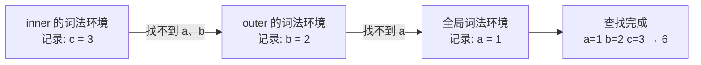

# 04 - 作用域与闭包

> 对应大纲篇目 04 | 面试可答：闭包是"函数 + 创建时的词法环境"；作用域链由书写位置在定义时决定，被捕获的变量存活在堆上的环境记录里，所以函数返回后依然不销毁。

## 学习目标

- 能用词法环境/环境记录两件套画出任意变量的查找路径
- 能说清 var/let/const 的本质差异：都提升，差别在初始化时机与作用域；TDZ 是"已提升未初始化"的表现
- 能从内存视角解释闭包：被捕获变量存在堆上环境记录中，随闭包函数实例存活
- 能预测 for + var/let + setTimeout 的输出并给出至少两种修复
- 能辩证回答"闭包会不会造成内存泄漏、如何避免"

## 核心概念

### 词法环境与环境记录

规范模型（ECMA-262 §9.1）：**词法环境（Lexical Environment）= 环境记录（Environment Record，存放绑定）+ 外部词法环境引用（outer）**。作用域通过 outer 引用层层嵌套形成作用域链，链的形态**由代码书写位置在编写时决定**，与运行时调用位置无关——这正是"词法"二字的含义。

环境记录的几种关键类型：

- **声明式环境记录（Declarative Environment Record）**：承载 let/const/var/function/class，函数调用和块各建一个
- **对象环境记录（Object Environment Record）**：把标识符绑定到对象属性上（全局环境的对象记录对应全局对象，`with` 也用这种）
- **全局环境记录**：复合结构——最外层的 var/function 挂到全局对象上，let/const 挂在独立的声明式记录里（所以 `let x` 不会成为 `globalThis.x` 的属性）

```js
const a = 1
function outer () {
  const b = 2
  function inner () {
    const c = 3
    console.log(a + b + c)
  }
  inner()
}
outer() // 6
```

`inner` 内查找 `a + b + c` 的过程：



机制细节：函数**创建时**，内部槽 `[[Environment]]` 记录当时的词法环境；函数**调用时**，为新执行上下文创建新环境记录，其 outer 指向 `[[Environment]]`。所以作用域链在函数定义那一刻就定死了，与在哪儿被调用无关。

### var/let/const：都提升，命运不同

三种声明都会**提升**（绑定在环境记录初始化阶段就被创建），差别在三处：

| | var | let | const |
|---|---|---|---|
| 作用域 | 函数 | 块 | 块 |
| 初始化时机 | 提升时即初始化为 undefined | 声明语句执行到时初始化 | 声明语句执行到时初始化（必须带初始值） |
| TDZ | 无 | 有 | 有 |
| 重新赋值 | 允许 | 允许 | 禁止（绑定不可变，指向的值可变） |

```js
console.log(x) // undefined（var：提升且已初始化）
var x = 1
```

```js
function f () {
  return typeof leaked
  let leaked = 1
}
try {
  f()
} catch (e) {
  console.log(e.constructor.name) // 'ReferenceError'
}
```

这个例子是「let 也提升」的铁证：如果 `leaked` 完全没提升，`typeof` 对未声明标识符会安全返回 `'undefined'`，而不是抛错。`let` 的绑定已存在但**未初始化**，从块开始到声明语句执行之间的区域就是 **TDZ（暂时性死区）**，访问即抛 `ReferenceError`。

TDZ 里连 `typeof` 都不豁免：

```js
try {
  console.log(typeof tdzVar)
} catch (e) {
  console.log(e.constructor.name) // 'ReferenceError'（TDZ 内 typeof 也抛）
}
let tdzVar = 1
```

const 的"不可变"约束的是绑定本身：

```js
const obj = { n: 1 }
obj.n = 2 // 允许：绑定指向的对象内部可以改
console.log(obj.n) // 2
// obj = {} // ❌ 重新赋值 const 绑定：运行期抛 TypeError
// 注：这句直接写出来会被 Bun 在编译期拒绝（整个文件无法运行），故以注释展示
```

### 闭包 = 函数 + 词法环境

规范定义：闭包 = 函数 + **创建时所引用的词法环境**。函数在创建时捕获 `[[Environment]]`，调用时以它为作用域链的外层——于是无论函数被带到哪里执行，都能访问定义处的变量。

**内存视角**（理解"函数返回后变量为何不销毁"的关键）：

- 正常情况下函数调用结束，执行上下文出栈，其环境记录失去引用后被 GC 回收
- 若返回的内部函数仍引用外层环境记录，该记录必须继续存活在堆上，生命周期与内部函数实例绑定
- V8 中，被捕获变量存放在堆上的 Context 对象里；解析器按变量分析，**只有被闭包真实引用过的变量才会被捕获**，没被引用的局部变量留在栈帧上随出栈回收

```js
function makeCounter () {
  let count = 0 // 被捕获，存活在堆上的环境记录里
  return () => {
    count += 1
    return count
  }
}

const inc = makeCounter() // makeCounter 上下文出栈，但 count 所在的环境记录仍被 inc 引用
console.log(inc()) // 1
console.log(inc()) // 2

const inc2 = makeCounter() // 每次调用都创建全新的环境记录
console.log(inc2()) // 1（与 inc 互相独立）
```

### 闭包应用：私有状态与模块模式

闭包是 JS 最早实现**私有状态**的手段（早于 ES2022 的 class 私有字段 `#x`）：

```js
function createCounter (initial = 0) {
  let count = initial // 私有，外部无法直接触达
  return {
    increment: () => ++count,
    decrement: () => --count,
    value: () => count
  }
}

const counter = createCounter(10)
console.log(counter.increment()) // 11
console.log(counter.increment()) // 12
console.log(counter.value()) // 12
console.log(counter.count) // undefined（状态不暴露）
```

模块模式是它的放大版——IIFE 一次性执行，返回对象定义模块的公开 API：

```js
const bankAccount = (() => {
  let balance = 0
  return {
    deposit (amount) {
      if (amount <= 0) throw new RangeError('amount must be positive')
      balance += amount
    },
    getBalance () {
      return balance
    }
  }
})()

bankAccount.deposit(100)
console.log(bankAccount.getBalance()) // 100
console.log(bankAccount.balance) // undefined
```

交叉链接：模块模式的"私有状态 + 暴露 API"正是 ESM 在语言层面解决的问题（文件为模块单位、静态可分析、单例缓存），两者的差异与演进见 09 模块系统（doc/09-module-system.md）。

## 常见踩坑点

### 坑 1：for + var + setTimeout，全部打出同一个值

```js
for (var i = 0; i < 3; i++) {
  setTimeout(() => console.log(i), 0)
}
// 输出：3 3 3
```

实际结果解释：`var` 是函数作用域（此处即全局），整个循环共享一个 `i`；三个回调捕获的是**同一个绑定**，定时回调触发时循环早已结束，`i === 3`。

```js
for (let j = 0; j < 3; j++) {
  setTimeout(() => console.log(j), 0)
}
// 输出：0 1 2
```

实际结果解释：`let` 的循环在规范上每轮迭代都执行 CreatePerIterationEnvironment——新建一个绑定并把当前值复制进去，三个回调各自捕获独立的 `j`。

var 版的两种修复：

```js
// 修复一：IIFE 快照当前值
for (var k = 0; k < 3; k++) {
  ;((v) => {
    setTimeout(() => console.log(v), 0)
  })(k)
}
// 输出：0 1 2

// 修复二：setTimeout 第三个参数把当前值作为实参传入
for (var n = 0; n < 3; n++) {
  setTimeout((v) => console.log(v), 0, n)
}
// 输出：0 1 2
```

说明：四段循环若放在同一脚本里，定时回调按注册顺序触发，总输出依次为 `3 3 3` → `0 1 2` → `0 1 2` → `0 1 2`。

### 坑 2：闭包捕获的是"绑定"，不是"值的快照"

```js
const handlers = []
let status = 'idle'
handlers.push(() => console.log(status))
status = 'running'
handlers[0]() // 'running'
```

实际结果解释：闭包持有变量的**活引用**，不是创建时刻的值的拷贝。变量在外部被改写，闭包内立刻可见——这也是坑 1 中 var 版共享变量出问题的根因。需要快照时，在创建时把值固化：用参数（`(s) => () => s`）或局部 const。

### 坑 3：switch 的所有 case 共享一个块作用域

```js
try {
  eval('switch (1) { case 1: let v = 1; break; case 2: let v = 2; break }')
} catch (e) {
  console.log(e.constructor.name) // 'SyntaxError'
}
```

实际结果解释：整个 `switch` 是一个块，两个 case 里的同名 `let` 是重复声明，在**解析阶段**直接语法错误。修复：给每个 case 体加块 `{}`。

### 坑 4：闭包无意中捕获大对象

```js
function createHandler () {
  const huge = new Array(1e6).fill('x') // 大数组
  return () => huge.length // huge 被捕获，生命周期延长到与返回函数相同
}
const handler = createHandler() // 只要 handler 活着，大数组就不会被回收
```

实际结果解释：只要 `handler` 可达（注册为事件监听、塞进全局数组等），huge 就常驻内存——这是"闭包导致内存泄漏"的典型形态。修复：只捕获需要的值——

```js
function createHandlerFixed () {
  const huge = new Array(1e6).fill('x')
  const length = huge.length // 只捕获原始值
  return () => length
}
```

注意：闭包体里写 `huge.length` 就算引用了 huge；V8 按变量粒度决定捕获，但判定标准是"被闭包引用过"。泄漏排查工具（Memory 面板）交叉链接 10 内存与 GC（doc/10-memory-and-gc.md）。

### 坑 5：参数默认值也在 TDZ 射程内

```js
function f (a = b, b = 1) {}
try {
  f()
} catch (e) {
  console.log(e.constructor.name) // 'ReferenceError'
}
```

实际结果解释：参数从左到右初始化，求值 `a = b` 时 `b` 已声明（已提升）但尚未初始化，正处 TDZ。参数作用域本身就是一个独立的声明式环境记录，这道题同时考察提升、TDZ 与参数作用域三个知识点。

## 面试高频问题

- JS 变量查找是怎么进行的？（沿环境记录的 outer 链逐级向上）
- let/const 有提升吗？如何用代码证明？
- 什么是 TDZ？为什么 `typeof` 在 TDZ 里也会抛错？
- 全局 `let x` 为什么不是 `globalThis.x`？（全局环境记录的复合结构）
- 闭包的定义是什么？被捕获变量为什么在函数返回后还存活？
- V8 里哪些变量会被捕获进闭包？（被闭包真实引用的，按变量粒度分析）
- let 循环为什么每轮都是新绑定？（CreatePerIterationEnvironment）
- 闭包和内存泄漏是什么关系？
- 模块模式解决了什么问题？它和 ESM 是什么关系？

## 面试回答模板

> **问：什么是闭包？请从内存角度解释。**
>
> 规范定义上，闭包是函数加上它创建时所引用的词法环境。函数创建时把当时的词法环境记入内部槽 [[Environment]]，调用时新环境的 outer 就指向它，所以函数能访问定义处的变量，与调用位置无关。内存上：函数返回后执行上下文出栈，环境记录本可被回收，但只要返回的函数仍引用它，这份记录就必须存活在堆上（V8 里是 Context 对象），被捕获变量的生命周期与闭包函数绑定。这就是计数器这类私有状态能工作的原因：外部拿不到环境记录，只能通过闭包暴露的方法读写。

> **问：闭包为什么会造成内存泄漏？如何避免？**
>
> 闭包本身不是泄漏，它是一种**保留机制**：被闭包捕获的环境记录及其中的对象，只要闭包可达就不会被 GC 回收。问题出在"长生命周期的闭包无意中捕获了大对象"——注册后不清理的事件监听器、定时器回调、常驻全局的缓存，都会让它们引用的整个环境图常驻内存。避免手段：一，只捕获需要的值，比如把 `huge.length` 先取出再进闭包，而不是闭包体里引用整个 huge；二，及时解绑监听器、清理定时器（宿主侧行为，交叉链接 web-apis 模块）；三，不再使用的引用主动置空解除持有；四，用 DevTools Memory 面板的 Heap snapshot 对比验证（工具细节交叉链接 10 内存与 GC）。关键表述：不是"闭包会泄漏"，而是"意外长存的引用 + 捕获大对象"才会泄漏。

> **问：var、let、const 的本质区别是什么？**
>
> 三者都提升——绑定在环境记录初始化时就创建了，差别在三处。作用域：var 是函数作用域，let/const 是块级作用域，每个块都有独立的词法环境。初始化时机：var 提升时立即初始化为 undefined，所以声明前访问得到 undefined；let/const 提升后处于未初始化状态，从块起点到声明语句之间的 TDZ 内访问抛 ReferenceError。可变性：const 的绑定不可重新赋值（否则 TypeError），但指向的对象内部依然可改。另外 let 在 for 循环中每轮迭代会创建新绑定（CreatePerIterationEnvironment），这是它能正确配合异步回调的关键。

> **问：for + setTimeout 用 let 为什么输出 0 1 2？var 版怎么修？**
>
> var 声明的循环变量是函数作用域（顶层循环即全局），所有回调捕获同一个绑定，等定时回调执行时循环已结束，变量已是终值，所以全打 3。let 版本中规范为每轮迭代执行 CreatePerIterationEnvironment：新建绑定并复制当前值，每个回调捕获各自独立的变量，所以输出 0 1 2。var 版修复有两种：用 IIFE 把当前值固化为参数，或用 setTimeout 第三个参数把当前值作为实参传入；当然最直接的修复是换成 let。

> **问：JS 的变量查找过程是怎样的？**
>
> 每个执行上下文关联一个词法环境，由环境记录（存绑定）和外部词法环境引用组成。查找变量时从当前环境记录开始，找不到就沿 outer 链逐级向上，直到全局环境，仍找不到抛 ReferenceError。这条链由代码书写位置在定义时决定，与运行时调用位置无关，所以叫词法作用域。一个细节：全局环境记录是复合结构，var 和函数声明挂在全局对象上，let/const 挂在独立的声明式记录里，所以 let 声明的变量访问不到 window.x。

## 练习

### 练习 1：once——只执行一次的函数

要求：实现 `once(fn)`，返回一个新函数：首次调用时执行 `fn` 并返回结果，后续调用直接返回首次结果，不再执行 `fn`。

提示：用闭包捕获两个私有变量——`called` 标志位与 `result` 缓存；这是"私有状态"的最小应用，外部无法重置。

预期效果：bun test 通过——

```ts
import { expect, test } from 'bun:test'

const once = (fn: (...args: any[]) => any) => {
  let called = false
  let result: any
  return (...args: any[]) => {
    if (!called) {
      called = true
      result = fn(...args)
    }
    return result
  }
}

test('只执行一次', () => {
  let calls = 0
  const init = once((n: number) => {
    calls += 1
    return n * 2
  })
  expect(init(2)).toBe(4)
  expect(init(99)).toBe(4)
  expect(calls).toBe(1)
})
```

### 练习 2：createCounter——私有状态与实例独立性

要求：实现 `createCounter(initial = 0)`，返回 `increment` / `decrement` / `reset` / `value` 四个方法；`count` 对外不可达；多次调用创建的计数器实例互不影响。

提示：`count` 是被闭包捕获的局部变量；`reset` 回到创建时的 `initial`（它同样是被捕获的值）；每次调用 `createCounter` 都会生成全新的环境记录。

预期效果：bun test 通过——

```ts
import { expect, test } from 'bun:test'

const createCounter = (initial = 0) => {
  let count = initial
  return {
    increment: () => ++count,
    decrement: () => --count,
    reset: () => {
      count = initial
    },
    value: () => count
  }
}

test('实例独立且状态私有', () => {
  const a = createCounter()
  const b = createCounter(10)
  a.increment()
  a.increment()
  expect(a.value()).toBe(2)
  expect(b.value()).toBe(10)
  expect((a as any).count).toBeUndefined()
})

test('reset 回到初始值', () => {
  const c = createCounter(5)
  c.increment()
  c.reset()
  expect(c.value()).toBe(5)
})
```

### 练习 3：memoize——闭包缓存

要求：为单参 number 函数实现 `memoize(fn)`，返回 `{ wrapped, countCalls }`：`wrapped` 对相同入参返回缓存结果，`countCalls` 返回原函数被真实执行的次数。

提示：闭包内用 `Map` 做缓存、用计数器记录真实调用；缓存对象在 `memoize` 返回后依然存活，正好验证"被捕获对象在堆上续命"。

预期效果：bun test 通过——

```ts
import { expect, test } from 'bun:test'

const memoize = (fn: (n: number) => number) => {
  const cache = new Map<number, number>()
  let calls = 0
  const wrapped = (n: number) => {
    if (!cache.has(n)) {
      calls += 1
      cache.set(n, fn(n))
    }
    return cache.get(n)!
  }
  return { wrapped, countCalls: () => calls }
}

test('缓存命中不再调用原函数', () => {
  const { wrapped, countCalls } = memoize((n) => n * n)
  expect(wrapped(3)).toBe(9)
  expect(wrapped(3)).toBe(9)
  expect(wrapped(4)).toBe(16)
  expect(countCalls()).toBe(2)
})
```

## 本模块完成标准

- [ ] 能用 Mermaid 画出作用域链，并用环境记录 + outer 引用解释查找过程
- [ ] 能用代码证明 let 会提升但未初始化（TDZ），说出 var/let/const 的三处差异
- [ ] 能从内存视角解释"被捕获变量存活在堆上"，并用计数器示例演示
- [ ] 能预测 for + var/let + setTimeout 的输出，给出 IIFE / 传参 / let 三种修复
- [ ] 能回答"闭包为什么会造成内存泄漏、如何避免"（保留机制 + 只捕获必要值 + 及时清理）
