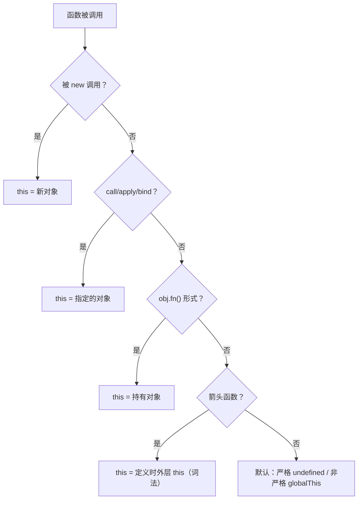

# 05 - 函数与 this

> 对应大纲篇目 05 | 面试可答：函数是带 length/name 的一等对象，this 按「new > 显式 > 隐式 > 默认」在调用点决定（箭头函数例外，取定义时词法 this）；bind 被 new 时忽略绑定 this；new 分四步执行；TCO 是 ES2015 规范要求但仅 JSC 实现

## 学习目标

- 能说清 `length`/`name` 的计数语义，并用代码证明默认参数作用域介于外层与函数体之间
- 能枚举 this 四条绑定规则与优先级，解释隐式丢失（赋值/传参）的发生场景
- 手写完整 `bind`，正确处理被 `new` 调用时忽略绑定 this 的边界行为并通过测试
- 能口述 `new` 的四步执行流程，解释构造函数返回对象/原始值时的差异
- 能说明尾调用优化（TCO）的规范地位与引擎现实：ES2015 严格模式要求、仅 JavaScriptCore（Safari）实现、V8 与 SpiderMonkey 至今未实现

## 核心概念

### 函数是一等对象：length / name / 剩余参数

函数是「可调用的对象」：可以作为值传递、挂载属性、被继承（`Function.prototype`）。两个自带属性有精确的规范语义：

- `length`：**第一个有默认值的形参之前**的形参个数，剩余参数不计入
- `name`：函数名；绑定函数带 `bound ` 前缀；匿名函数的词法名推断（赋值/属性场景）

```js
function f(a, b = 1, c) {}
console.log(f.length) // 1，b 有默认值后，c 也不计入

function g(a, ...rest) {}
console.log(g.length) // 1，rest 不计入

const inc = (n) => n + 1
console.log(inc.name) // inc（变量赋值时的名称推断）
console.log(inc.bind(null).name) // bound inc

function sum(first, ...rest) {
  return first + rest.reduce((acc, n) => acc + n, 0)
}
console.log(sum(1, 2, 3)) // 6
```

剩余参数是真正的 `Array`（不是类数组的 `arguments`），可直接用数组方法；箭头函数没有 `arguments` 绑定，需要可变实参时只能用剩余参数。

### 默认参数的独立作用域（介于外层与函数体之间）

规范上，函数调用时会分别创建 **参数环境**（Parameters Environment，形参与默认值表达式在此求值）与**函数体环境**。默认值表达式能看到外层作用域，但看不到函数体内的声明——它处在一个「夹层」里：

```js
// 证明 1：默认值表达式看不到函数体内的声明
function f(x = y) {
  var y = 2
  return x
}
try {
  f()
} catch (e) {
  console.log(e.message) // ReferenceError，文案因引擎而异（var y 在函数体环境，默认值在参数环境）
}

// 证明 2：形参名遮蔽外层变量，且默认值表达式解析到形参本身（处于 TDZ）
var x = 'outer'
function g(x = x) {
  return x
}
try {
  g()
} catch (e) {
  console.log(e.name) // ReferenceError：默认值的 x 指向形参 x，尚未初始化
}

// 证明 3：默认值在调用时对外层作用域求值，与函数体内部的同名变量无关
let a = 1
function h(b = a) {
  const a = 2
  return b
}
console.log(h()) // 1，不是 2
```

结论：作用域链在这里是三层——**外层作用域 ← 参数作用域 ← 函数体作用域**，参数作用域单向可见外层、对函数体不可见。这是面试区分「背过」和「理解过」的细节。

### this 的四条绑定规则与优先级

this 在**调用点**决定（箭头函数除外），规则如下：

1. **new 绑定**：`new Fn()`，this 指向新创建的对象
2. **显式绑定**：`call` / `apply` / `bind`，this 指向指定对象（传 `null`/`undefined` 时非严格模式落到 globalThis）
3. **隐式绑定**：`obj.fn()`，this 指向调用点最近的持有对象
4. **默认绑定**：独立调用，严格模式 `undefined`，非严格模式 globalThis

优先级：**new > 显式 > 隐式 > 默认**（箭头函数不参与比较，直接取定义时的词法 this）。



```js
function show() {
  return this.v
}
const obj = { v: 'implicit', show }

// 隐式绑定
console.log(obj.show()) // implicit

// 显式 > 隐式
const o2 = { v: 'implicit2', show }
console.log(show.call({ v: 'explicit' })) // explicit
console.log(o2.show.call({ v: 'explicit' })) // explicit（显式压过隐式）

// bind 后，隐式调用点也压不过显式绑定
const bound = show.bind({ v: 'bind' })
console.log(o2.bound ? o2.bound() : bound()) // bind

// new > bind：new 一个绑定函数时，忽略 bind 的 this
function make(name) {
  this.name = name
}
const Bound = make.bind({ name: 'ignored' })
const inst = new Bound('real')
console.log(inst.name) // real
```

### 箭头函数的词法 this

箭头函数（ES2015）**没有自己的 this 与 arguments**，不能被 new（没有 `[[Construct]]`）；`super` 也不是它自己的绑定，而是沿外层 `[[HomeObject]]` 查找。它的 this 在**定义时**捕获外层词法环境的 this，之后 call/apply/bind 都无法改变：

```js
const timer = {
  seconds: 0,
  start() {
    // 箭头函数捕获 start 调用时的 this（即 timer）
    const tick = () => {
      this.seconds += 1
      console.log(this.seconds)
    }
    tick()
    tick()
  }
}
timer.start() // 1 然后 2

const arrow = () => this
console.log(arrow.call({ a: 1 }) === arrow()) // true（call 的 thisArg 被忽略）
try {
  new arrow()
} catch (e) {
  console.log(e.name) // TypeError：箭头函数不是构造器
}
```

典型用途：回调里保持外层 this；典型反例：给箭头函数当「方法」——它拿不到调用对象。

### 隐式绑定的丢失（赋值 / 传参）

`obj.fn` 这个表达式只取出了**函数引用**，调用点和对象的关系断了，退化为默认绑定。ESM（bun/node 跑 .js 的默认形态）整体是严格代码，this 为 `undefined`，访问其属性会直接 TypeError——这比「静默指向 globalThis」更容易暴露问题：

```js
const user = {
  name: 'kai',
  greet() {
    return `hi, ${this?.name ?? '(this 丢失)'}`
  }
}

// 场景 1：赋值丢失
const loose = user.greet
console.log(loose()) // hi, (this 丢失)：ESM 严格模式下 this 为 undefined（非严格则落到 globalThis）

// 场景 2：作为参数传递丢失（setTimeout 等宿主 API 只是转交了函数引用）
setTimeout(user.greet, 0) // 无输出：回调的返回值被宿主丢弃；且 this 丢失，回调里 this 不再是 user

// 场景 3：解构同样丢失
const { greet } = user
console.log(greet()) // hi, (this 丢失)

// 修复：bind 固化或箭头函数包一层
const fixed = user.greet.bind(user)
console.log(fixed()) // hi, kai
setTimeout(() => console.log(user.greet()), 0) // hi, kai
```

### 手写 bind（含 new 场景）

原生 `bind` 的关键边界：**绑定函数被 new 调用时，忽略绑定的 this，this 是新对象**，且 `new boundFn() instanceof Fn` 仍为 true。手写版用 `this instanceof boundFn` 判断是否被 new，并把 `boundFn.prototype` 链接到原函数原型以支持 instanceof 判断：

```js
Function.prototype.myBind = function (thisArg, ...presetArgs) {
  const target = this
  function boundFn(...args) {
    // 被 new 调用时 this 是 boundFn 的实例，此时忽略 thisArg
    const isNew = this instanceof boundFn
    return target.apply(isNew ? this : thisArg, [...presetArgs, ...args])
  }
  // 让 new boundFn() 的实例能 instanceof 原函数、访问原函数原型上的方法
  // 箭头函数没有 prototype 属性，需跳过
  if (target.prototype) {
    boundFn.prototype = Object.create(target.prototype)
  }
  Object.defineProperty(boundFn, 'length', {
    value: Math.max(0, target.length - presetArgs.length)
  })
  return boundFn
}
```

测试（Bun）：

```ts
import { expect, test } from 'bun:test'

// 与正文同构的独立版本，便于在测试文件中运行
function myBind(fn: (...args: unknown[]) => unknown, thisArg: unknown, ...presetArgs: unknown[]) {
  function boundFn(this: unknown, ...args: unknown[]) {
    const isNew = this instanceof boundFn
    return fn.apply(isNew ? this : thisArg, [...presetArgs, ...args])
  }
  if (fn.prototype) {
    boundFn.prototype = Object.create(fn.prototype)
  }
  return boundFn as (...args: unknown[]) => unknown
}

function makePoint(this: { x?: number, y?: number }, x: number, y: number) {
  this.x = x
  this.y = y
  return this // 显式返回 this，普通调用与 new 调用都能拿到对象
}
makePoint.prototype.toString = function (this: { x: number, y: number }) {
  return `${this.x},${this.y}`
}

test('普通调用：绑定 this + 预置参数', () => {
  const bound = myBind(makePoint, {}, 10) as (y: number) => { x?: number, y?: number }
  const r = bound(20)
  expect(r.x).toBe(10) // 预置参数生效
  expect(r.y).toBe(20)
})

test('new 场景：忽略绑定 this，实例落在新对象上', () => {
  type PointLike = { x: number, y: number, ignored?: boolean, toString(): string }
  const Bound = myBind(makePoint, { ignored: true }) as unknown as (new (x: number, y: number) => PointLike) & { prototype: PointLike }
  const p = new Bound(1, 2)
  expect(p.x).toBe(1)
  expect(p.y).toBe(2)
  expect(p.ignored).toBeUndefined() // 绑定的 this 被忽略
  expect(p instanceof Bound).toBe(true) // 原型链已链接
  expect(Bound.prototype.toString.call(p)).toBe('1,2')
})
```

局限说明：该实现对 ES class 无效（class 构造器不允许经 `apply` 调用，原生 `bind` 通过绑定函数异质对象转发 `[[Construct]]` 才能 `new (C.bind(null))`）。面试主动说出这一条是加分项。

### new 的完整执行流程（四步）

`new Fn(...args)` 的规范级流程：

1. **创建**一个全新的普通对象
2. **链接原型**：该对象的 `[[Prototype]]` 指向 `Fn.prototype`（为 06 篇原型链铺垫）
3. **绑定 this 执行**构造器 `Fn`
4. **判断返回值**：构造器返回对象（含函数）则用它，否则返回第 1 步的对象（返回原始值被忽略）

```js
function myNew(Ctor, ...args) {
  const obj = Object.create(Ctor.prototype) // 第 1、2 步合一
  const result = Ctor.apply(obj, args) // 第 3 步
  if (result !== null && (typeof result === 'object' || typeof result === 'function')) {
    return result // 第 4 步：返回对象则接管
  }
  return obj
}

function User(name) {
  this.name = name
}
User.prototype.hello = function () {
  return `hello, ${this.name}`
}

const u = myNew(User, 'kai')
console.log(u.hello()) // hello, kai
console.log(u instanceof User) // true
```

边界：箭头函数与声明为方法语法的函数没有 `[[Construct]]`，`new` 直接 TypeError；ES class 必须经 new 调用，普通调用 TypeError。

### 尾调用优化（TCO）：规范要求 vs 引擎现实

**Proper Tail Call**：严格模式下，若 `return` 位置**只有**一次函数调用（调用结果直接作为返回值，无任何后续运算），规范要求复用当前栈帧而不是压新帧——递归可改写为常量栈空间。这是 **ES2015 的规范要求**，但现实中**只有 JavaScriptCore（Safari）实现，V8 与 SpiderMonkey 至今未实现**（权衡包括：栈帧被复用导致错误堆栈/调试信息丢失、引擎实现复杂度等）。

```js
'use strict'

// 标准 TCO 写法：return 位置只有一次调用，累加器走参数
function factorial(n, acc = 1) {
  if (n <= 1) return acc
  return factorial(n - 1, n * acc) // 尾位置
}
console.log(factorial(5)) // 120

// 反例：return 后还要乘 n，调用返回后必须回到本帧，无法优化
function factorialNoTco(n) {
  if (n <= 1) return 1
  return n * factorialNoTco(n - 1)
}
```

在 Chrome/Node/Bun（V8/JavaScriptCore 之外的运行栈以 V8 为主）深递归依旧爆栈，跨环境安全写法是循环或 trampoline：

```js
'use strict'
const trampoline = (fn) => (...args) => {
  let result = fn(...args)
  while (typeof result === 'function') result = result()
  return result
}
const factStep = (n, acc) => (n <= 1 ? acc : () => factStep(n - 1, n * acc))
console.log(trampoline(factStep)(10000, 1) > 0) // true，不爆栈（结果为 Infinity 但无栈溢出）
```

## 常见踩坑点

### 1. 隐式绑定被赋值/传参静默丢失

```js
const counter = {
  count: 0,
  inc() {
    this.count += 1
  }
}
const inc = counter.inc
try {
  inc() // ESM 严格模式下 this 为 undefined，读 this.count 直接抛错
} catch (e) {
  console.log(e.name) // TypeError（非严格模式下不抛错但 counter.count 仍是 0）
}
console.log(counter.count) // 0
```

解释：`counter.inc` 求值结果是函数引用，`inc()` 是独立调用，走默认绑定。事件回调、数组方法回调、Promise 回调全是重灾区。

### 2. 箭头函数当对象方法

```js
const obj = {
  v: 42,
  get: () => this?.v // 箭头 this = 定义时外层（模块顶层），与 obj 无关
}
console.log(obj.get()) // undefined（ESM 模块顶层 this 为 undefined）
```

解释：箭头函数 this 在定义时固定，`obj.get()` 的隐式规则对它无效。

### 3. 默认参数 TDZ

```js
function f(x = x) {
  return x
}
try {
  f()
} catch (e) {
  console.log(e.name) // ReferenceError
}
```

解释：默认值表达式中的 `x` 解析到形参自身，而形参此时尚未初始化（TDZ），不会回落到外层同名变量。

### 4. 构造器返回对象会「劫持」new 的产物

```js
function F() {
  this.a = 1
  return { hijack: true } // 返回对象，new 出来的对象被丢弃
}
const f = new F()
console.log(f.a) // undefined
console.log(f.hijack) // true
console.log(f instanceof F) // false（原型链没接上）
```

解释：new 的第 4 步以返回对象为准；返回原始值（含 `return undefined`）则被忽略。

### 5. bind 不能叠加

```js
function show() {
  return this.v
}
const once = show.bind({ v: 1 })
const twice = once.bind({ v: 2 })
console.log(twice()) // 1（第二次 bind 的 thisArg 被忽略，绑定函数 this 已固化）
```

解释：绑定函数是异质对象，`[[Call]]` 时直接使用首次绑定的 this，后续 bind 只影响参数。

## 面试高频问题

- this 四条绑定规则及优先级？（new > 显式 > 隐式 > 默认，箭头函数词法捕获）
- 隐式丢失的常见场景与修复手段？（赋值、传参、解构；bind / 箭头函数包装）
- 箭头函数没有哪些东西？（自己的 this、arguments；无 `[[Construct]]` 不能 new；super 沿外层 HomeObject 找）
- 手写 bind 如何处理 new 场景？（`this instanceof boundFn` 判断 + 原型链接）
- new 的四步流程？构造器返回对象/原始值分别怎样？
- `f.length` 怎么计数？（第一个有默认值的形参之前，rest 不计）
- 默认参数作用域在哪一层？为什么 `function f(x = x)` 报错？
- TCO 各引擎支持情况？为什么 V8 不实现？

## 面试回答模板

> **问：说说 this 的绑定规则与优先级？**
>
> this 在普通函数的调用点决定，共四条规则：new 绑定指向新对象；显式绑定（call/apply/bind）指向指定对象；隐式绑定 `obj.fn()` 指向持有对象；默认绑定在严格模式为 undefined，否则为 globalThis。优先级 new > 显式 > 隐式 > 默认。箭头函数例外——它没有自己的 this，this 是定义时捕获的外层词法 this，之后无法被 call/bind/new 改变。隐式绑定在赋值或传参时会丢失，退化为默认绑定。

> **问：手写一个 bind，并说明如何处理被 new 的情况？**
>
> 实现要点三条：一是返回的绑定函数调用时用 `target.apply(thisArg, 合并后的参数)` 转发，支持预置参数；二是用 `this instanceof boundFn` 判断是否被 new 调用，是则忽略 thisArg、把 this 指向新对象，这与原生语义一致；三是把 `boundFn.prototype` 设为 `Object.create(target.prototype)`，保证 `new boundFn() instanceof Fn` 成立。已知局限：对 ES class 无效，因为 class 构造器不允许经 apply 调用，原生 bind 是靠绑定函数异质对象转发 [[Construct]] 做到的。

> **问：new 一个构造函数时发生了什么？**
>
> 四步：创建一个新对象；把它的 [[Prototype]] 链接到构造函数的 prototype；以该对象为 this 执行构造器；检查返回值——若返回对象或函数则用它，否则返回新对象（返回原始值被忽略）。由此可以解释两个细节：构造函数 return 一个普通对象会劫持实例，instanceof 会失败；箭头函数没有 [[Construct]]，new 它直接 TypeError。

> **问：箭头函数的 this 和普通函数有什么本质区别？**
>
> 普通函数的 this 是动态的，由调用点的四条规则决定；箭头函数没有自己的 this 和 arguments，this 在定义时从外层词法环境静态捕获，call/apply/bind 的 thisArg 会被忽略，也不能被 new。所以箭头函数适合回调里保持外层 this，不适合做对象方法；它访问可变实参要用剩余参数。class 方法中的箭头函数 super 也不属于自己，是沿外层 [[HomeObject]] 查找。

> **问：什么是尾调用优化？V8 实现了吗？**
>
> 严格模式下，如果 return 位置只有一次函数调用（proper tail call），ES2015 规范要求引擎复用当前栈帧而非压新帧，从而让尾递归只占常量栈空间。但这是规范与现实的落差：目前只有 JavaScriptCore（Safari）实现，V8 和 SpiderMonkey 至今未实现，主要顾虑是栈帧复用会破坏调试堆栈与实现复杂度。所以跨环境代码不应依赖 TCO，深递归应改循环或用 trampoline。

## 练习

### 1. 手写 myNew

**要求**：实现 `myNew(Ctor, ...args)`，行为与 `new` 一致——处理原型链接、this 绑定、构造器返回对象的接管。

**提示**：`Object.create(Ctor.prototype)` 一步完成「建对象 + 链接原型」；返回值判断用 `typeof result === 'object' || typeof result === 'function'` 且非 null。

**预期效果**：以下测试全部通过。

```ts
import { expect, test } from 'bun:test'

function myNew(Ctor: new (...args: unknown[]) => unknown, ...args: unknown[]) {
  // TODO：实现四步流程
}

function Person(this: { name?: string }, name: string) {
  this.name = name
}
Person.prototype.sayHi = function (this: { name: string }) {
  return `hi, ${this.name}`
}

test('原型链接与 this 绑定', () => {
  const p = myNew(Person, 'kai') as Person
  expect(p.name).toBe('kai')
  expect(p.sayHi()).toBe('hi, kai')
  expect(p instanceof Person).toBe(true)
})

test('构造器返回对象时接管返回值', () => {
  function Hijack(this: unknown) {
    return { custom: true }
  }
  const h = myNew(Hijack as new () => unknown) as { custom: boolean }
  expect(h.custom).toBe(true)
  expect(h instanceof Hijack).toBe(false)
})
```

### 2. this 优先级判定

**要求**：先不运行，写出每行的预期输出，再实际运行验证。

```js
function who() {
  return this?.name ?? 'default'
}
const a = { name: 'a', who }
const b = { name: 'b', who: who.bind({ name: 'bind' }) }
const arrowWho = () => this?.name ?? 'arrow-default'
console.log(who()) // 你的答案？
console.log(a.who()) // 你的答案？
console.log(b.who()) // 你的答案？
console.log(who.call({ name: 'call' })) // 你的答案？
console.log(arrowWho.call({ name: 'ignored' })) // 你的答案？
```

**提示**：逐个走决策图；`b.who` 是绑定函数，隐式规则对它无效；箭头函数 call 的 thisArg 被忽略。

**预期效果**：运行输出依次为 `default`（ESM 严格模式下独立调用 this 为 undefined，取不到 name）、`a`、`bind`、`call`、`arrow-default`（箭头函数取定义时的词法 this，即模块顶层 this，其上没有 name）。若与你的预判不符，定位错在哪条规则。

### 3. 尾调用改写

**要求**：把下面的朴素递归改写为尾调用形式（累加器参数化），并回答：改写后在 V8 中跑 `fibTco(100000)` 会爆栈吗？为什么？

```js
function fib(n) {
  if (n <= 1) return n
  return fib(n - 1) + fib(n - 2)
}
```

**提示**：`fibTco(n, a = 0, b = 1)`，尾位置只做 `return fibTco(n - 1, b, a + b)`；引擎现实回顾正文 TCO 小节。

**预期效果**：`fibTco(10, 0, 1) === 55`；在 Safari（JSC）下大 n 不爆栈，在 Chrome/Node/Bun（V8）下依旧爆栈——因为 V8 未实现 TCO，这正是「规范要求 ≠ 引擎现实」。

## 本模块完成标准

- [ ] 能解释 `length`/`name` 计数规则，并用三段代码证明默认参数作用域是「外层与函数体之间的夹层」
- [ ] 能按优先级判定任意调用点的 this，包括赋值/传参导致的隐式丢失
- [ ] 手写 bind 通过「普通调用 + 预置参数 + new 忽略绑定 this」三类测试，能说出对 class 无效的局限
- [ ] 能口述 new 的四步流程，解释返回对象劫持与 `f instanceof F === false` 的成因
- [ ] 能说明 TCO 的规范要求（ES2015 严格模式）与引擎现实（仅 JSC，V8/SpiderMonkey 未实现）及应对写法
