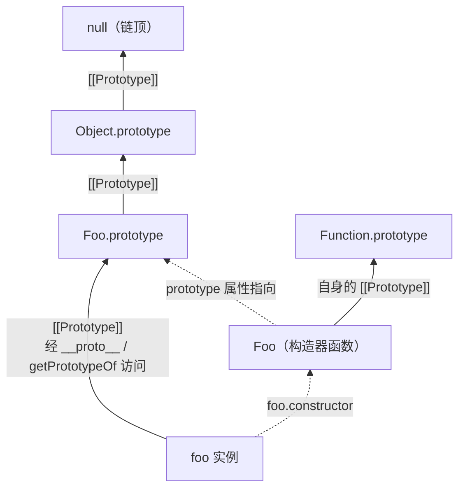

# 06 - 对象与原型

> 对应大纲篇目 06 | 面试可答：对象的本质是内部方法的集合，属性行为由描述符决定；原型链沿 [[Prototype]] 逐级查找；instanceof 就是沿链找 prototype；class 是语法糖，私有字段靠内部槽位实现、反射不可见；继承从原型链演进到 class，组合优于继承

## 学习目标

- 能列出对象的关键内部方法（`[[Get]]`/`[[Set]]`/`[[GetPrototypeOf]]` 等）及其对应的 Object/Reflect API
- 掌握数据描述符与访问器描述符的语义差异，会用 `Object.defineProperty` 控制 writable/configurable/enumerable
- 能画出 `[[Prototype]]`、`__proto__`、`prototype` 三者的关系图，解释查找算法与属性遮蔽
- 能说明 instanceof 原理与 `Symbol.hasInstance` 定制，知道 ES2022 `Object.hasOwn` 替代 `hasOwnProperty` 的理由
- 能解释 class 语法糖背后的机制：方法不可枚举、私有字段实现原理、static 块、extends 派生类必须先 super()，并说清继承模式演进与组合优于继承

## 核心概念

### 对象的本质：内部方法的集合

规范里对象不是「键值对袋子」，而是**内部方法（internal methods）的集合**——每个属性读写、原型操作都是一次内部方法调用。代理（Proxy）之所以能拦截一切，就是因为它可以重写这些方法（详见 08 篇元编程）。

| 内部方法 | 触发场景 | 用户级 API |
|---------|---------|-----------|
| `[[Get]]` | 读属性 `obj.x` | `Reflect.get(obj, 'x')` |
| `[[Set]]` | 写属性 `obj.x = v` | `Reflect.set(obj, 'x', v)` |
| `[[HasProperty]]` | `in` 运算符、`with` | `Reflect.has(obj, 'x')`、`Object.hasOwn` |
| `[[Delete]]` | `delete obj.x` | `Reflect.deleteProperty(obj, 'x')` |
| `[[DefineOwnProperty]]` | 定义/重配属性 | `Object.defineProperty` / `Reflect.defineProperty` |
| `[[GetPrototypeOf]]` | 取原型 | `Object.getPrototypeOf` / `Reflect.getPrototypeOf` |
| `[[SetPrototypeOf]]` | 改原型 | `Object.setPrototypeOf` / `Reflect.setPrototypeOf` |
| `[[OwnPropertyKeys]]` | 枚举自身键 | `Object.keys` / `Object.getOwnPropertyNames` / `Reflect.ownKeys` |
| `[[IsExtensible]]` / `[[PreventExtensions]]` | 密封控制 | `Object.isExtensible` / `Object.preventExtensions` |
| `[[Call]]` / `[[Construct]]` | 函数调用 / `new`（仅函数对象） | 见 05 篇 new 四步 |

### 属性描述符：数据 vs 访问器

每个属性关联一个描述符。**数据描述符**：`value` + `writable`；**访问器描述符**：`get` + `set`。两者共有 `enumerable`（可枚举）与 `configurable`（可重配/可删）。`writable`/`configurable`/`enumerable` 默认都是 `false`（defineProperty 创建时）。

```js
const config = {}
Object.defineProperty(config, 'host', {
  value: 'localhost',
  writable: false, // 不可写
  enumerable: true,
  configurable: false // 不可删除、不可再改 enumerable/configurable
})

try {
  config.host = 'other' // ESM/严格模式下给 writable:false 赋值直接抛错
} catch (e) {
  console.log(e.name) // TypeError（非严格模式静默失败）
}
console.log(config.host) // localhost
try {
  delete config.host // configurable:false 不可删，严格模式抛错（非严格返回 false）
} catch (e) {
  console.log(e.name) // TypeError
}

try {
  Object.defineProperty(config, 'host', { writable: true })
} catch (e) {
  console.log(e.name) // TypeError：configurable false 后不能再改 writable
}

// 访问器描述符：value/writable 与 get/set 互斥
let backing = 10
Object.defineProperty(config, 'port', {
  get() {
    return backing
  },
  set(v) {
    if (!Number.isInteger(v)) throw new TypeError('port must be int')
    backing = v
  },
  enumerable: true,
  configurable: true
})
config.port = 3000
console.log(config.port) // 3000
```

`configurable: false` 的唯一例外：允许把 `writable: true` 改为 `false`（单向收紧）。

### 原型链：[[Prototype]]、__proto__、prototype 三者关系

三个概念严格区分：

- **`[[Prototype]]`**：每个对象都有的内部槽位，指向它的原型对象
- **`__proto__`**：`Object.prototype` 上的历史遗留访问器属性，是读写 `[[Prototype]]` 的老接口（ES2015 作为 Web 遗留特性收进规范附录，仅为兼容而存在）；现代代码用 `Object.getPrototypeOf` / `Object.setPrototypeOf`
- **`prototype`**：只有函数（构造器）才有的**普通属性**，指向「用它 new 出来的实例们」共享的原型对象



**查找算法**：读 `obj.x` 时先查自身，没有则沿 `[[Prototype]]` 逐级上溯，直到命中或到达 `null`；**写**只发生在自身对象上，若链上已有同名属性则发生**遮蔽（shadowing）**：

```js
function Foo() {}
Foo.prototype.hello = function () {
  return 'from prototype'
}
const foo = new Foo()

console.log(foo.hello()) // from prototype（自身没有，沿链找到）
console.log(Object.getPrototypeOf(foo) === Foo.prototype) // true
console.log(foo.__proto__ === Foo.prototype) // true（__proto__ 只是老式读法）
console.log(Foo.prototype.constructor === Foo) // true

// 遮蔽：写操作落在实例自身，原型上的同名属性不受影响
foo.hello = function () {
  return 'shadowed'
}
console.log(foo.hello()) // shadowed
console.log(foo.hasOwnProperty('hello')) // true
console.log(Foo.prototype.hasOwnProperty('hello')) // true（原型的没被改动）
```

### instanceof 原理与 Symbol.hasInstance

`obj instanceof Ctor` 的语义：取 `Ctor.prototype`，沿 `obj` 的原型链查找，命中即 true。它检查的是**原型链关系而非构造关系**——所以改原型链就能伪造结果，跨 realm（不同 iframe/worker）的 `Array` 也会失配。

```js
const arr = [1, 2]
console.log(arr instanceof Array) // true：arr 链上有 Array.prototype

// Symbol.hasInstance（ES2015）可完全接管 instanceof
class Even {
  static [Symbol.hasInstance](value) {
    return Number.isInteger(value) && value % 2 === 0
  }
}
console.log(4 instanceof Even) // true
console.log(3 instanceof Even) // false

// 手写 instanceof
function myInstanceof(left, right) {
  if (right === null || (typeof right !== 'function' && typeof right !== 'object')) {
    throw new TypeError('Right-hand side must be an object')
  }
  // 规范会先检查右侧的 Symbol.hasInstance，这里实现原型链主干
  const hasInstance = right[Symbol.hasInstance]
  if (typeof hasInstance === 'function') return hasInstance.call(right, left)
  const target = right.prototype
  let proto = Object.getPrototypeOf(left)
  while (proto !== null) {
    if (proto === target) return true
    proto = Object.getPrototypeOf(proto)
  }
  return false
}
console.log(myInstanceof([], Array)) // true
console.log(myInstanceof('str', Array)) // false
```

配套 API：`Object.create(proto)` 以指定原型创建对象（原型链继承的最小工具）；`Object.getPrototypeOf(obj)` 是读 `[[Prototype]]` 的标准方式。判断自身属性用 ES2022 的 **`Object.hasOwn`** 替代 `hasOwnProperty`：

```js
const bare = Object.create(null) // 无原型的裸对象
bare.x = 1
// bare.hasOwnProperty('x') 会抛 TypeError：裸对象没有 hasOwnProperty
console.log(Object.hasOwn(bare, 'x')) // true
console.log(Object.hasOwn(bare, 'toString')) // false

// hasOwn 也免疫原型链上被污染的 hasOwnProperty
```

### class 是语法糖（ES2015）：方法、static、私有字段、extends

class 声明做的事可以用原型链等价复刻，但有几个不可忽略的语义差异：

```js
class Animal {
  constructor(name) {
    this.name = name
  }
  speak() {
    return `${this.name} makes a sound`
  }
}

// 等价的原型写法 + class 的隐藏语义
console.log(typeof Animal) // function（class 本质是构造器函数）
const a = new Animal('rex')
console.log(Animal.prototype.hasOwnProperty('speak')) // true（方法挂在 prototype 上）
console.log(Object.keys(Animal.prototype)) // []（class 方法不可枚举，手写原型写法默认可枚举）

try {
  Animal('rex')
} catch (e) {
  console.log(e.name) // TypeError：class 构造器必须经 new 调用
}
```

差异清单：方法定义在 `prototype` 上且**不可枚举**；类体隐式严格模式；class 声明有 TDZ；静态成员挂在构造器自身（`static x` / `static method`）。

**ES2022：私有字段、私有方法、static 块、品牌检查**：

```js
class Counter {
  #count = 0 // 私有字段（ES2022）
  static #instances = 0
  static {
    // static 块（ES2022）：类求值时执行一次，可访问私有静态
    Counter.#instances = 0
    console.log('Counter class evaluated')
  }
  constructor() {
    Counter.#instances += 1
  }
  increment() {
    this.#count += 1 // 类体内可自由访问私有字段
    return this
  }
  get value() {
    return this.#count
  }
  static hasCount(value) {
    return #count in value // 品牌检查（ES2022）：#x in obj 只能在类体内写
  }
}

const c = new Counter()
c.increment().increment()
console.log(c.value) // 2
console.log(Object.keys(c)) // []：私有字段对 keys/getOwnPropertyNames/Reflect.ownKeys 全部不可见
console.log(Counter.hasCount(c)) // true
console.log(Counter.hasCount({})) // false
// 外部写 c.#count 或 #count in c 都是 SyntaxError：私有名只在类体内合法
```

私有字段的实现原理：规范层面每个对象有 `[[PrivateElements]]` 内部槽位，私有名解析绑定到**定义它的类**的词法环境（PrivateEnvironment），与普通属性名是两个命名空间；引擎实现（如 V8）将其存为只有该类代码路径能访问的内部属性。**概念上等价于以类为键域、对象为键的 WeakMap**——这也曾是 polyfill 方案。关键推论：

- 反射手段（`Object.keys`、`Reflect.ownKeys`、Proxy 的 `ownKeys`）一律看不到私有字段
- **instanceof 无法「穿透」判断私有字段存在**（instanceof 只看原型链），跨类型的结构识别要用类体内的 `#x in obj` 品牌检查

```js
class Wallet {
  #balance = 0
  deposit(n) {
    this.#balance += n
  }
  static isWallet(value) {
    return value instanceof Wallet // 原型链判断
  }
  static hasBalance(value) {
    // 真正的品牌检查：只有「本类定义域内」的对象才返回 true
    return #balance in value // 仅类体内合法
  }
}
```

**extends 与 super 约束**：派生类的构造器里，`this` 不是自己创建的——规范上派生类构造器没有初始 this 绑定，必须先调用 `super(...)` 由父类的 `[[Construct]]` 分配 this，之后才能使用 this，否则 ReferenceError。`new.target` 记录真正被 new 的类，保证父类构造器里 `new.target.prototype` 指向正确的子类原型。

```js
class Animal {
  constructor(name) {
    this.name = name
  }
  speak() {
    return `${this.name} makes a sound`
  }
}

class Dog extends Animal {
  constructor(name, breed) {
    // this.breed = breed // ReferenceError：super() 之前不能用 this
    super(name) // 由 Animal 的 [[Construct]] 创建 this
    this.breed = breed
  }
  speak() {
    return `${super.speak()} from Dog` // super 方法调用走 [[HomeObject]]
  }
}
const d = new Dog('rex', 'husky')
console.log(d.speak()) // rex makes a sound from Dog
console.log(d instanceof Dog && d instanceof Animal) // true
```

### 继承模式演进：原型链 → 寄生组合 → class

**原型链继承**的问题——引用类型属性被所有实例共享：

```js
function Parent() {
  this.colors = ['red']
}
function Child() {}
Child.prototype = new Parent()

const c1 = new Child()
const c2 = new Child()
c1.colors.push('blue')
console.log(c2.colors) // ['red', 'blue']：共享了同一个 colors，污染
```

**寄生组合继承**——父类构造器借调用（只执行一次、作用在实例上），原型用 `Object.create` 链接（不执行父类构造器）：

```js
function Parent(name) {
  this.name = name
  this.colors = ['red']
}
Parent.prototype.sayName = function () {
  return this.name
}

function Child(name, age) {
  Parent.call(this, name) // 实例属性各自独立
  this.age = age
}
Child.prototype = Object.create(Parent.prototype) // 原型链链接，不重复执行 Parent
Child.prototype.constructor = Child // 修复 constructor 指向
Child.prototype.sayAge = function () {
  return this.age
}

const k1 = new Child('kai', 30)
const k2 = new Child('lee', 25)
k1.colors.push('blue')
console.log(k2.colors) // ['red']：互不干扰
console.log(k1.sayName()) // kai
```

class 就是这套组合的标准化语法。

**组合优于继承**：继承是强耦合的「is-a」静态结构，层级一深就脆弱；组合是运行期装配能力片段，粒度更细、可替换：

```js
const withLogger = (target) => ({
  ...target,
  log(msg) {
    console.log(`[${target.name}] ${msg}`)
  }
})
const withCooldown = (target, ms) => ({
  ...target,
  cooldown: ms,
  isReady: (elapsed) => elapsed >= ms
})

const skill = withCooldown(withLogger({ name: 'fireball' }), 3000)
skill.log('cast') // [fireball] cast
console.log(skill.isReady(3000)) // true
```

需要多继承式能力混入时，mixin 函数（接收 class 返回增强 class）比多层 extends 干净得多。

### 拷贝语义：浅拷贝 vs 深拷贝

```js
const src = { name: 'kai', meta: { level: 1 } }

// 浅拷贝：Object.assign / 展开，只复制第一层，嵌套对象仍共享引用
const shallow = { ...src }
shallow.meta.level = 99
console.log(src.meta.level) // 99（嵌套被共享修改）

// 深拷贝：structuredClone（宿主 API，HTML 规范，不属于 ECMA-262 语言本体）
const deep = structuredClone(src)
deep.meta.level = 1
console.log(src.meta.level) // 99（deep 与 src 完全独立，且能处理循环引用）
```

`structuredClone` 的可用类型、错误类型与宿主差异见宿主 API 篇目（DOM/BOM/Web API 归 front/javascript 目录），本模块不展开。

## 常见踩坑点

### 1. 给继承来的只读属性赋值会静默失败

```js
const proto = {}
Object.defineProperty(proto, 'x', { value: 1, writable: false })
const obj = Object.create(proto)
try {
  obj.x = 2 // ESM/严格模式直接抛错；非严格模式静默失败
} catch (e) {
  console.log(e.name) // TypeError
}
console.log(obj.x) // 1（[[Set]] 发现链上有只读数据属性，拒绝在自身创建遮蔽属性）
```

解释：`[[Set]]` 沿链找到只读数据属性时终止且不落盘，这是规范行为而非 bug。

### 2. for...in 会枚举继承的可枚举属性

```js
const base = { inherited: 1 }
const obj = Object.create(base)
obj.own = 2
for (const key in obj) {
  console.log(key) // own 和 inherited 都会被枚举
}
```

解释：`for...in` 含原型链上所有可枚举属性（不含 Symbol）。只想要自身属性时用 `Object.keys(obj)` 或 `Object.hasOwn(obj, key)` 过滤。

### 3. Object.create(null) 的对象调不了 hasOwnProperty

```js
const bare = Object.create(null)
bare.x = 1
try {
  bare.hasOwnProperty('x')
} catch (e) {
  console.log(e.name) // TypeError：裸字典对象根本没有 Object.prototype
}
console.log(Object.hasOwn(bare, 'x')) // true（ES2022，静态调用免疫此问题）
```

解释：`obj.hasOwnProperty(...)` 还怕原型链上同名方法被覆盖/污染，`Object.hasOwn` 一并解决。

### 4. 派生类 constructor 里 super() 之前用 this

```js
class Base {}
class Derived extends Base {
  constructor() {
    this.ready = true // ReferenceError: Must call super constructor...
    super()
  }
}
try {
  new Derived()
} catch (e) {
  console.log(e.name) // ReferenceError
}
```

解释：派生类构造器没有初始 this 绑定，this 由 `super()` 内的 `[[Construct]]` 分配。

### 5. 从外部访问私有字段是 SyntaxError，instanceof 也探测不到

```js
class Box {
  #value = 1
}
const b = new Box()
// b.#value —— SyntaxError：私有名只在类体内合法，不是运行时错误
console.log(Object.keys(b).length) // 0：反射 API 全部不可见
console.log(Object.getPrototypeOf(b) === Box.prototype) // true
```

解释：私有字段走独立命名空间 + 内部槽位，外部无任何反射途径；跨类型识别「有没有某私有字段」只能在类内部用 `#value in obj` 品牌检查（ES2022），instanceof 只看原型链，无法穿透到字段层面。

## 面试高频问题

- 对象的本质是什么？（内部方法集合；Proxy 为什么能拦截一切）
- 数据描述符与访问器描述符的区别？`configurable: false` 后还能做什么？
- `[[Prototype]]`、`__proto__`、`prototype` 三者关系？（内部槽位 / 遗留访问器 / 构造器的普通属性）
- 属性查找与遮蔽的规则？给原型上只读属性赋值会发生什么？
- instanceof 的原理？如何用 Symbol.hasInstance 定制？
- class 相对手写原型多了哪些语义？（方法不可枚举、必须 new、TDZ、隐式严格）
- 私有字段怎么实现的？为什么反射看不到、instanceof 探测不到？品牌检查怎么写？
- extends 为什么必须先 super()？new.target 的作用？
- 继承模式演进路线？为什么说组合优于继承？
- Object.hasOwn 相对 hasOwnProperty 的优势？（ES2022）
- 浅拷贝与深拷贝的边界？structuredClone 属于哪层规范？

## 面试回答模板

> **问：`__proto__`、`prototype`、`[[Prototype]]` 有什么区别？**
>
> 三个不同层面的东西：`[[Prototype]]` 是每个对象都有的内部槽位，指向原型对象，是原型链的真正骨架；`prototype` 是构造器函数上的普通属性，保存「实例们共享的原型对象」，`new Fn()` 时用它初始化实例的 [[Prototype]]；`__proto__` 只是挂在 Object.prototype 上的历史遗留访问器，用来读写 [[Prototype]]，ES2015 为兼容才收进规范附录，现代代码应使用 Object.getPrototypeOf / Object.setPrototypeOf。

> **问：instanceof 的原理是什么？怎么定制？**
>
> `obj instanceof Ctor` 先查右侧的 `Symbol.hasInstance` 方法，有的话完全由它决定；默认行为是取 `Ctor.prototype`，沿 obj 的 `[[Prototype]]` 链逐级查找，命中返回 true，到 null 返回 false。因为它检查的是原型链关系而非构造关系，所以手工改原型链可以伪造结果，跨 realm 的同名构造器也会失配。ES2015 起可用 `static [Symbol.hasInstance]` 完全接管判断逻辑，比如按值语义判断。

> **问：class 是语法糖吗？私有字段是怎么实现的？**
>
> class 等价于「构造器函数 + prototype 方法」的组合，但多了真实语义：方法挂在 prototype 上且不可枚举、类体隐式严格模式、声明有 TDZ、构造器必须经 new 调用。私有字段（ES2022）不是普通属性：规范上对象的 `[[PrivateElements]]` 内部槽位按私有名存储值，私有名绑定到定义类的词法环境，与公共属性是两个命名空间；概念上等价于以对象为键的 WeakMap。因此 Object.keys、Reflect.ownKeys、Proxy 一律不可见，instanceof 也无法探测私有字段——类内部用 `#x in obj` 品牌检查才是正解，外部访问 `#x` 直接是 SyntaxError。

> **问：extends 的派生类为什么必须先调用 super()？**
>
> 规范上派生类的构造器没有初始 this 绑定——实例对象是在 `super()` 调用时由父类的 `[[Construct]]` 用 `new.target.prototype` 创建的，this 才绑定到该对象；所以 super() 之前访问 this 会抛 ReferenceError。这也是 `new.target` 的存在意义：父类构造器里能知道真正被 new 的子类是谁，保证原型链接正确。

> **问：继承模式是怎么演进的？为什么说组合优于继承？**
>
> 三阶段：早期原型链继承直接 `Child.prototype = new Parent()`，引用类型属性被所有实例共享；寄生组合继承用 `Parent.call(this)` 拿实例属性、`Object.create(Parent.prototype)` 链接原型，避免父构造器重复执行，是 ES5 的标准答案；ES2015 的 class extends 把它语法化。组合优于继承是因为继承是静态的 is-a 强耦合，层级深了改基类会波及全链；组合在运行期装配能力片段（mixin、对象增强），粒度细、可替换、没有脆弱的基类问题。

> **问：Object.assign 和 structuredClone 的区别？**
>
> Object.assign 与展开运算符都是浅拷贝：只复制第一层自有可枚举属性，嵌套对象复制的是引用，改嵌套会互相影响。深拷贝需要 structuredClone，它能处理循环引用与大多数内置类型。注意 structuredClone 是 HTML 规范的宿主 API，不属于 ECMA-262 语言本体，这也是它不在语言核心讨论范围的原因。

## 练习

### 1. 手写 myInstanceof 并通过边界测试

**要求**：实现 `myInstanceof(left, right)`，与原生 instanceof 行为一致：沿原型链查找、尊重 `Symbol.hasInstance`。

**提示**：先检查 `right[Symbol.hasInstance]` 是否为函数；链上遍历用 `Object.getPrototypeOf` 直到 `null`。

**预期效果**：以下测试全部通过。

```ts
import { expect, test } from 'bun:test'

function myInstanceof(left: unknown, right: unknown): boolean {
  // TODO：Symbol.hasInstance 优先，否则沿原型链查找 right.prototype
  return false
}

test('基本原型链判断', () => {
  expect(myInstanceof([], Array)).toBe(true)
  expect(myInstanceof(new Map(), Map)).toBe(true)
  expect(myInstanceof('str', Array)).toBe(false)
})

test('Object.create 构造的链', () => {
  const proto = { tag: 'p' }
  const child = Object.create(proto)
  function P() {}
  P.prototype = proto
  expect(myInstanceof(child, P)).toBe(true)
})

test('尊重 Symbol.hasInstance', () => {
  class Positive {
    static [Symbol.hasInstance](value: unknown) {
      return typeof value === 'number' && value > 0
    }
  }
  expect(myInstanceof(3, Positive)).toBe(true)
  expect(myInstanceof(-1, Positive)).toBe(false)
})
```

### 2. 用寄生组合实现 class 之前的继承

**要求**：不借助 class，实现 `Animal`/`Dog`：Dog 继承 Animal 的实例属性与方法，实例间引用类型互不污染，`constructor` 指向正确，`instanceof` 双成立。

**提示**：构造器借调 `Animal.call(this, ...)` + `Dog.prototype = Object.create(Animal.prototype)` + 修复 `constructor`。

**预期效果**：以下测试全部通过。

```ts
import { expect, test } from 'bun:test'

function Animal(this: { name?: string, traits?: string[] }, name: string) {
  this.name = name
  this.traits = ['alive']
}
Animal.prototype.speak = function (this: { name: string }) {
  return `${this.name} speaks`
}

function Dog(this: { breed?: string }, name: string, breed: string) {
  // TODO：寄生组合继承
}

type DogLike = { name: string, breed: string, traits: string[], speak(): string }
const NewDog = Dog as unknown as new (n: string, b: string) => DogLike

test('继承与隔离', () => {
  const d1 = new NewDog('rex', 'husky')
  const d2 = new NewDog('lee', 'corgi')
  expect(d1.speak()).toBe('rex speaks')
  expect(d1 instanceof Dog).toBe(true)
  expect(d1 instanceof Animal).toBe(true)
  expect((d1 as unknown as { constructor: unknown }).constructor).toBe(Dog)
  d1.traits.push('loyal')
  expect(d2.traits).toEqual(['alive']) // 引用类型不共享
})
```

### 3. 组合式能力装配

**要求**：实现两个 mixin 函数 `withLogger(target)` 与 `withTimestamps(target)`，将「日志」与「created/updated 时间戳」能力装配到任意普通对象上，不得改变原对象。

**提示**：返回新对象（展开 + 追加方法）；时间戳方法里用闭包私有变量而不是公开属性，体会「组合 + 闭包」表达私有状态。

**预期效果**：以下测试全部通过。

```ts
import { expect, test } from 'bun:test'

function withLogger<T extends object>(target: T) {
  // TODO：返回带 log(msg) 的新对象，log 前缀为 target 的 name（若有）
  return target
}

function withTimestamps<T extends object>(target: T) {
  // TODO：返回带 createdAt(): number 的新对象，闭包保存时间
  return target
}

test('能力装配且不可变', () => {
  const base = { name: 'task' }
  const enhanced = withTimestamps(withLogger(base)) as {
    name: string
    log(msg: string): string
    createdAt(): number
  }
  expect(enhanced.name).toBe('task')
  expect(enhanced.log('done')).toBe('[task] done')
  expect(typeof enhanced.createdAt()).toBe('number')
  expect('log' in base).toBe(false) // 原对象未被修改
})
```

## 本模块完成标准

- [ ] 能默写关键内部方法表（[[Get]]/[[Set]]/[[GetPrototypeOf]] 等）并说出对应 API
- [ ] 能用 defineProperty 演示数据/访问器描述符差异，说清 configurable false 的后果与只读属性赋值的 [[Set]] 行为
- [ ] 能画出 [[Prototype]]/__proto__/prototype 关系图并解释查找与遮蔽
- [ ] 能手写 instanceof（含 Symbol.hasInstance），说清 Object.hasOwn（ES2022）的三点优势
- [ ] 能解释 class 的隐藏语义、私有字段的内部槽位实现与品牌检查、extends 必须先 super() 的原因
- [ ] 能复述继承模式演进（原型链 → 寄生组合 → class）并给出组合优于继承的实例
- [ ] 能说清浅拷贝/深拷贝边界，知道 structuredClone 属宿主 API
