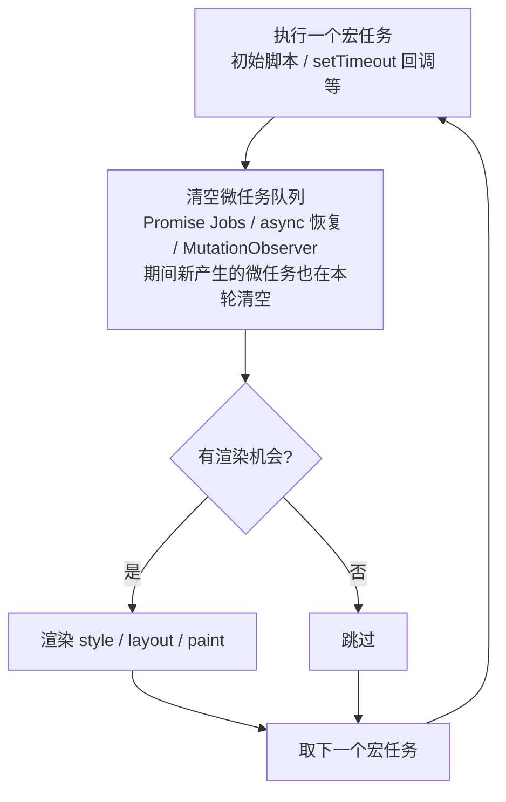
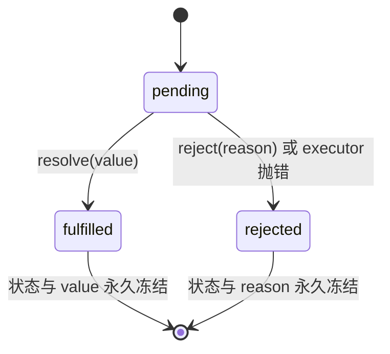

# 07 - 事件循环与异步

> 对应大纲篇目 07（★ 面试最重）| 面试可答：事件循环是宿主（HTML 规范）的调度机制，ECMA-262 只定义 Jobs；Promise 是三态不可逆状态机，then 按规范返回新 Promise 并递归解包，async/await 是 generator + 自动执行器的语法糖，其恢复是语言级微任务。

## 学习目标

- 能说清三层任务归属：语言级微任务（Promise Jobs / async 恢复，ECMA-262 Jobs）vs 宿主层微任务（MutationObserver）vs 宏任务（setTimeout，HTML 规范），并画出单轮事件循环流程
- 能逐行解释任意 async/await + Promise.then + setTimeout 混合代码的输出顺序
- 能白板手写 mini Promise：状态机、then 链、值穿透、resolvePromise 解包、queueMicrotask 调度
- 能说清 all/race/allSettled/any 四种并发语义，会用 Promise.withResolvers（ES2024）、Promise.try（ES2025）
- 掌握异步迭代：async generator、for await...of、Array.fromAsync（ES2026）

## 核心概念

### 调用栈 + 任务队列模型：三层归属澄清

一个最常见的误解是把「微任务」当成一个整体。实际上要分清三层归属：

| 层级 | 规范归属 | 例子 | 调度时机 |
|------|---------|------|---------|
| 语言级微任务（Job） | ECMA-262（Jobs 抽象操作） | Promise reaction（then/catch 回调）、async 函数 await 后的恢复 | 当前任务结束后、下一个宏任务前，整队清空 |
| 宿主层微任务 | HTML 规范注册进同一个微任务队列 | MutationObserver 回调、queueMicrotask() | 同上，与语言级微任务混在同一队列按入队顺序执行 |
| 宏任务（Task） | HTML 规范 | setTimeout/setInterval、I/O、UI 事件、MessageChannel | 每轮事件循环取一个，之后先清空微任务队列 |

关键事实：

- **事件循环本身由 HTML 规范定义**，ECMA-262 里没有 event loop 一词，只定义 Job（宿主塞进微任务队列）与 Agent。Promise.then 回调、await 后的续体都是语言级 Job，是纯 ECMAScript 语义，不依赖浏览器也不依赖 Node。
- MutationObserver 是**宿主注册的微任务**，与 Promise Jobs 共享同一队列 FIFO 竞争，先后只取决于入队顺序，没有类型优先级。
- setTimeout 是 HTML 层宏任务（嵌套有 4ms 最小钳制，宿主细节见交叉链接）。Node 特有：process.nextTick 队列先于微任务清空（详见 `src/programming-languages/javascript/node/` 目录的事件循环笔记）。



### 经典输出顺序题（逐行解释）

**例 1：同步 → 微任务 → 宏任务**

```js
console.log('1')                                        // ① 同步代码，立即执行
setTimeout(() => console.log('2'), 0)                   // ④ setTimeout 回调是宏任务，最后执行
Promise.resolve().then(() => console.log('3'))          // ③ then 回调是语言级微任务
console.log('4')                                        // ② 同步代码先于一切异步回调
// 输出: 1 → 4 → 3 → 2
```

**例 2：async/await 混入后，微任务之间也有先后**

```js
async function async1() {
  console.log('async1 start')   // ② async1() 被同步调用，函数体同步执行到 await
  await async2()                // async2() 同步调用；await 后的代码打包成一个微任务入队
  console.log('async1 end')     // ⑤ 第一个微任务（await 续体）
}
async function async2() {
  console.log('async2')         // ③ await 右侧表达式同步求值
}
console.log('script start')     // ① 初始脚本（第一个宏任务）
setTimeout(() => console.log('setTimeout'), 0) // ⑦ 下一轮宏任务
async1()
Promise.resolve().then(() => console.log('promise1')) // ⑥ 第二个微任务，晚于 await 续体入队
console.log('script end')       // ④ 同步代码最后执行
// 输出: script start → async1 start → async2 → script end → async1 end → promise1 → setTimeout
```

解释要点：`await async2()` 语义上等价于 `Promise.resolve(async2()).then(续体)`——await 右侧同步求值，之后的代码作为 Promise reaction Job 入队；因为入队早于 `Promise.resolve().then(...)` 的注册，所以 `async1 end` 先于 `promise1`。现代 V8 已把 await 优化为只产生一个微任务。

### Promise 状态机：三态不可逆



- 状态迁移只有一次：一旦离开 pending，后续 resolve/reject 调用全部无效（静默忽略，不报错）；状态本身没有 API 可查（无 p.state），只能通过 then/catch 间接观察。

**then 的规范要求**（ECMA-262 Promise.prototype.then + Promise/A+ 要点）：

1. **返回新 Promise**：`p.then(f)` 的返回值 promise2 ≠ p，其状态由回调的返回值/抛错决定。
2. **值穿透**：onFulfilled/onRejected 不是函数时，分别用恒等函数 `v => v` 与「重抛函数」`e => { throw e }` 替代，所以 `.then()` 能把值/错误原样传到下一个 then/catch。
3. **resolvePromise 递归解包**：回调返回 thenable（有 then 方法的对象/Promise）时，按该 thenable 的状态递归 adopt——返回 Promise 会等它落定；`x === promise2` 时直接 TypeError（防循环等待）。

### 手写 mini Promise（本篇核心，白板可写）

```js
class MiniPromise {
  constructor(executor) {
    this.state = 'pending'
    this.value = undefined
    this.reason = undefined
    this.onFulfilledCallbacks = []
    this.onRejectedCallbacks = []
    const resolve = (value) => {
      if (this.state !== 'pending') return    // 状态机不可逆
      if (value !== null && (typeof value === 'object' || typeof value === 'function')) {
        const then = value.then
        if (typeof then === 'function') {     // resolve 一个 thenable：递归 adopt
          then.call(value, resolve, reject)   // 按其落定结果接入当前 promise
          return
        }
      }
      this.state = 'fulfilled'
      this.value = value
      this.onFulfilledCallbacks.forEach((fn) => fn())
    }
    const reject = (reason) => {
      if (this.state !== 'pending') return
      this.state = 'rejected'
      this.reason = reason
      this.onRejectedCallbacks.forEach((fn) => fn())
    }
    try {
      executor(resolve, reject)               // executor 抛错 → 直接 reject
    } catch (err) {
      reject(err)
    }
  }

  then(onFulfilled, onRejected) {
    // 值穿透：非函数回调替换为恒等 / 重抛
    onFulfilled = typeof onFulfilled === 'function' ? onFulfilled : (v) => v
    onRejected = typeof onRejected === 'function' ? onRejected : (e) => { throw e }
    const promise2 = new MiniPromise((resolve, reject) => {
      const handle = (fn, arg) => {
        queueMicrotask(() => {                // 规范要求异步执行回调（微任务）
          try {
            const x = fn(arg)
            resolvePromise(promise2, x, resolve, reject)
          } catch (err) {
            reject(err)
          }
        })
      }
      if (this.state === 'fulfilled') handle(onFulfilled, this.value)
      else if (this.state === 'rejected') handle(onRejected, this.reason)
      else {                                  // pending：先缓存，落定时触发
        this.onFulfilledCallbacks.push(() => handle(onFulfilled, this.value))
        this.onRejectedCallbacks.push(() => handle(onRejected, this.reason))
      }
    })
    return promise2                           // then 永远返回新 Promise
  }

  catch(onRejected) {                         // catch 只是 then 的语法糖
    return this.then(undefined, onRejected)
  }
}

function resolvePromise(promise2, x, resolve, reject) {
  if (x === promise2) {                       // 循环引用防御
    return reject(new TypeError('Chaining cycle detected'))
  }
  if (x !== null && (typeof x === 'object' || typeof x === 'function')) {
    let called = false
    try {
      const then = x.then                     // 只取一次 then（防 getter 副作用）
      if (typeof then === 'function') {
        then.call(
          x,
          // called 保证 resolve/reject 只生效一次；成功值递归解包嵌套 thenable
          (y) => { if (!called) { called = true; resolvePromise(promise2, y, resolve, reject) } },
          (r) => { if (!called) { called = true; reject(r) } }
        )
        return
      }
    } catch (err) {
      if (!called) reject(err)
      return
    }
  }
  resolve(x)                                  // 普通值直接落定
}
```

运行演示（bun/node 直接跑）：

```js
new MiniPromise((resolve) => setTimeout(() => resolve('hello'), 10))  // 宏任务里落定
  .then((v) => {
    console.log(v)                            // hello
    return v + ' world'
  })
  .then((v) => console.log(v))                // hello world

new MiniPromise((resolve) => resolve(42)).then().then((v) => console.log(v))   // 42 —— 值穿透

new MiniPromise((resolve) => resolve(new MiniPromise((r) => r('nested'))))
  .then((v) => console.log(v))                // nested —— resolve 时 adopt 递归展开
// 输出顺序: 42 → nested → hello → hello world
// 42/nested 注册时即已落定，回调先进微任务队列；hello 要等 setTimeout 宏任务落定后才入队
```

### async/await 本质：generator + 自动执行器

async 函数 = generator 语法 + 内建的自动执行器（隐式 yield Promise、隐式恢复）。手写运行时还原这个等价关系：

```js
// 自动执行器：递归消费 generator，每个 yield 值都先 Promise.resolve 包装
function run(genFn) {
  return new Promise((resolve, reject) => {
    const gen = genFn()
    const step = (nextFn) => {
      let result
      try { result = nextFn() } catch (err) { return reject(err) }
      if (result.done) return resolve(result.value)   // generator return → resolve
      Promise.resolve(result.value).then(
        (v) => step(() => gen.next(v)),               // fulfilled → next(v) 恢复
        (e) => step(() => gen.throw(e))               // rejected → throw(e) 恢复
      )
    }
    step(() => gen.next(undefined))
  })
}

const result = run(function* () {
  const a = yield Promise.resolve(1)                  // 等价于 await Promise.resolve(1)
  const b = yield Promise.resolve(2)
  return a + b
})
result.then((v) => console.log(v))                    // 3
```

两个推论：每次 await 的恢复就是一次 generator 的 next() 调用，由 Promise reaction Job 驱动——「await 后代码是微任务」由此有了机制解释；generator 里被 throw 的错误出现在 yield 表达式处，与「await 处抛错」一一对应。

**错误传播路径**：

```js
async function inner() {
  throw new Error('boom')                 // async 内 throw → 返回的 Promise reject
}
async function outer() {
  try {
    await inner()                         // rejected Promise 在 await 处变成 throw
  } catch (err) {
    console.log('caught:', err.message)   // caught: boom
  }
}
outer()

// 不捕获时：async 函数返回 rejected Promise，仍可外挂 catch
async function unsafe() { await inner() }
unsafe().catch((e) => console.log('via catch:', e.message)) // via catch: boom
// 连 catch 都没有 → 宿主触发 unhandledrejection（浏览器）/ unhandledRejection（Node）
```

### 并发模式与新 API

| 方法 | 落定条件 | 成功结果 | 失败情形 |
|------|---------|---------|---------|
| Promise.all | 全部 fulfilled | 按入参顺序的结果数组 | 任一 rejected → 立即以首个 reason 拒绝（fail-fast） |
| Promise.race | 任意一个落定 | 首个落定的 value/reason | 首个是 rejected 则拒绝 |
| Promise.allSettled | 全部落定（永不拒绝） | `[{status, value}, {status, reason}]` | 无 |
| Promise.any | 任意一个 fulfilled | 首个 fulfilled 的 value | 全部 rejected → AggregateError |

```js
Promise.allSettled([
  Promise.resolve(1),
  Promise.reject(new Error('bad')),
  new Promise((r) => setTimeout(() => r(3), 20))
]).then((rs) => console.log(rs.map((r) => r.status)))   // ['fulfilled', 'rejected', 'fulfilled']

Promise.any([Promise.reject('x'), Promise.resolve('first')]).then((v) => console.log(v)) // first
```

**Promise.withResolvers（ES2024）**——把 resolve/reject 的句柄提到构造器外：

```js
function delay(ms, value) {
  const { promise, resolve } = Promise.withResolvers()
  setTimeout(() => resolve(value), ms)
  return promise
}
delay(10, 'tick').then((v) => console.log(v))   // tick
// ES2024 之前只能这样写：let resolve; const p = new Promise((res) => { resolve = res })
```

**Promise.try（ES2025）**——统一「可能是同步、可能是异步」的函数入口，同步抛错也变成 rejection：

```js
Promise.try(() => JSON.parse('{"a":1}'))
  .then((obj) => console.log(obj.a))            // 1
Promise.try(() => JSON.parse('not json'))
  .catch((err) => console.log(err.name))        // SyntaxError（同步异常被转成 reject）
// 支持透传参数：Promise.try(fn, ...args)；也接受 async 函数，语义统一
Promise.try((raw) => JSON.parse(raw), '{"b":2}').then((obj) => console.log(obj.b)) // 2
```

### 异步迭代：async generator 与 Array.fromAsync

同步迭代器一次只能「同步地」产出一个值；async generator 的 next() 返回 `Promise<{value, done}>`，配合 for await...of 消费：

```js
async function* countdown(from) {
  for (let i = from; i > 0; i--) {
    await new Promise((r) => setTimeout(r, 10))   // 每次 yield 前可以真正异步等待
    yield i
  }
}
for await (const n of countdown(3)) console.log(n) // 3、2、1（依次）

// Array.fromAsync（ES2026）：把异步可迭代对象 / 含 Promise 的可迭代对象收集为数组
const collected = await Array.fromAsync(countdown(3))
console.log(collected)                            // [3, 2, 1]
// 顶层 await 需在 ESM / bun 环境；for await...of 背后是异步迭代协议（Symbol.asyncIterator + next 返回 Promise），同步迭代协议见 08 篇
```

### 交叉链接（本篇不展开）

- Node/Bun 事件循环差异（process.nextTick 队列先于微任务、libuv 各阶段、Bun 的调度实现）→ `src/programming-languages/javascript/node/` 目录的事件循环笔记
- setTimeout/setInterval 的钳制行为、MutationObserver 具体用法、AbortSignal/AbortController 取消模式 → `src/front/javascript/web-apis/` 目录

## 常见踩坑点

### 坑 1：then 回调里忘 return，链条拿到 undefined

```js
Promise.resolve(1)
  .then((v) => {
    Promise.resolve(v + 1)          // 没有 return：这个 Promise 与链条无关
  })
  .then((v) => console.log(v))      // undefined
// 回调没 return 等价于 return undefined，promise2 直接以 undefined fulfilled
```

### 坑 2：forEach + async 不是串行

```js
const results = []
const ids = [1, 2, 3]
const fetchId = (id) => new Promise((r) => setTimeout(() => r(id * 10), 10))
ids.forEach(async (id) => {
  results.push(await fetchId(id))   // forEach 不会等 await，三个 async 立即全部并发启动
})
console.log(results)                // [] —— forEach 同步返回时没有任何 await 完成
// 串行用 for...of + await；并发收集用 Promise.all(arr.map(async ...))
```

### 坑 3：延迟挂 catch，挡不住 unhandledrejection 上报

```js
// 直接运行本段会让进程崩溃（bun/node 实测），"late catch" 永远打印不出来
const p = Promise.reject(new Error('boom'))
setTimeout(() => {
  p.catch((e) => console.log('late catch:', e.message))  // 走不到这里：进程已先崩溃
}, 0)
// reject 发生后本轮微任务清空时仍无 handler → 判定 unhandled rejection，bun/node 直接使进程崩溃，
// 之后补挂的 catch 救不回来。宿主策略不同：浏览器只上报 unhandledrejection 事件，进程不会退出
```

### 坑 4：微任务饥饿——递归微任务饿死宏任务

```js
function starve() {
  Promise.resolve().then(starve)    // 微任务执行中又产生微任务，本轮队列永远清不空
}
starve()
// 渲染、setTimeout、用户事件全部得不到执行：页面冻结 / Node I/O 停摆；而递归 setTimeout 每轮只跑一个宏任务，不会饿死
```

### 坑 5：Promise.all 的 fail-fast 丢失其余结果

```js
const jobs = () => [Promise.resolve(1), Promise.reject(new Error('bad')), new Promise((r) => setTimeout(() => r(3), 50))]

Promise.all(jobs()).catch((e) => console.log('all:', e.message))   // all: bad（其余结果全丢）

Promise.allSettled(jobs()).then((rs) => console.log(rs.map((r) => r.status)))
// ['fulfilled', 'rejected', 'fulfilled'] —— 需要部分成功语义时选 allSettled
```

## 面试高频问题

- 微任务和宏任务的执行顺序？为什么微任务能插队？（当前任务结束 → 清空微任务队列 → 渲染 → 下一个宏任务）
- async/await 后的代码什么时候执行？与 Promise.then 谁先？（按入队顺序比较，都是微任务）
- Promise 有几种状态？能否从 fulfilled 变回 pending？（三态不可逆）
- then 的第二个参数和 catch 的区别？（catch 挂在更后面，能捕获前面 then 回调抛出的错误）
- 手写 Promise 时为什么回调要用微任务调度而不是同步执行？（规范语义 + pending 与已落定路径行为对齐）
- await 一个非 Promise 值会发生什么？（Promise.resolve 包装，续体仍是下一轮微任务）
- Node 里 process.nextTick 与 Promise.then 谁先？（nextTick 队列优先，细节归 node 模块）

## 面试回答模板

> **问：说说事件循环，微任务和宏任务的区别**
>
> 先澄清归属：事件循环本身是 HTML 规范定义的宿主机制，ECMA-262 只定义 Jobs。一轮循环是「执行一个宏任务 → 清空微任务队列（本轮新产生的也一并清空）→ 视情况渲染 → 取下一个宏任务」。微任务分两种来源：语言级的 Promise reaction 与 async 恢复（ECMA-262 的 Job），以及宿主注册的如 MutationObserver，它们共享同一个微任务队列按 FIFO 执行；setTimeout 这类属于 HTML 层宏任务。微任务插队的本质是「宏任务结束后的检查点」，而不是优先级抢占。

> **问：Promise 的状态机制和 then 的规范要求**
>
> Promise 是 pending/fulfilled/rejected 三态状态机，迁移不可逆，落定后 value/reason 冻结。then 的规范要点有三：一是永远返回一个新的 Promise，其状态由回调结果决定；二是值穿透，非函数的 onFulfilled/onRejected 会被替换为恒等函数与重抛函数；三是 resolvePromise 递归解包，回调返回 thenable 时递归 adopt 其状态，并对 `x === promise2` 的循环引用抛 TypeError。

> **问：async/await 的本质是什么**
>
> 它是 generator + 自动执行器的语法糖。可以用手写运行时还原：执行器驱动 generator，每个 yield 值先 Promise.resolve 包装，fulfilled 就用 next(v) 恢复、rejected 就用 throw(e) 恢复，直到 done 时 resolve。async 函数隐式做了这一切，所以每次 await 后的续体是一个 Promise reaction Job，即语言级微任务；错误传播上，async 内 throw 使返回 Promise reject，await 处 rejected Promise 会变成 throw，可被 try/catch 捕获。

> **问：Promise.all、race、allSettled、any 怎么选**
>
> all 是「全成才成」，任一 reject 立即以首个 reason 拒绝，适合全部依赖必须成功的聚合请求；race 是「首个落定者赢」，常用于超时竞赛；allSettled 永不拒绝，返回每项的 status 加 value/reason，适合允许部分失败、需要汇总上报的批处理；any 是「首个 fulfilled 赢」，全 reject 时抛 AggregateError，适合多源竞速取最快成功者。ES2024 的 Promise.withResolvers 解决构造器外拿 resolve 句柄的问题，ES2025 的 Promise.try 统一同步/异步函数入口，同步异常也能转成 rejection。

> **问：为什么微任务会"插队"？MutationObserver 回调和 Promise.then 谁先**
>
> 微任务不是插队，而是当前宏任务结束后的固定检查点：HTML 规范要求每个任务结束后清空微任务队列，期间新入队的微任务也在本轮清空。Promise.then 与 MutationObserver 共享同一个队列，谁先谁后只取决于入队顺序，没有类型优先级；Node 中唯一的例外是 process.nextTick 队列先于微任务清空。

## 练习

### 练习 1：并发限制调度器

**要求**：实现 `Scheduler` 类，构造参数为 `maxConcurrency`；`add(taskFn)` 接收返回 Promise 的工厂函数，返回该任务结果的 Promise；任意时刻并行执行的任务不超过上限，超出的排队等待，任务完成后按 FIFO 补位。将实现保存为 `./scheduler.ts`。

**提示**：维护 `running` 计数与等待队列；`add` 时把 `{ task, resolve, reject }` 入队并尝试 `run()`；`run()` 里 `while (running < max && queue.length)` 取任务执行，`finally` 中递减并再次 `run()`。注意任务工厂要延迟调用（进队时不能执行）。

**预期效果**：`bun test` 通过——并行峰值不超过 2，四个任务结果按提交顺序返回：

```ts
import { describe, expect, test } from 'bun:test'
import { Scheduler } from './scheduler'

describe('Scheduler', () => {
  test('并发不超过 maxConcurrency 且结果有序', async () => {
    const scheduler = new Scheduler(2)
    let running = 0
    let maxRunning = 0
    const makeTask = (ms: number, id: number) => () => new Promise<number>((resolve) => {
      running++
      maxRunning = Math.max(maxRunning, running)
      setTimeout(() => { running--; resolve(id) }, ms)
    })
    const results = await Promise.all([
      scheduler.add(makeTask(30, 1)),
      scheduler.add(makeTask(10, 2)),
      scheduler.add(makeTask(20, 3)),
      scheduler.add(makeTask(5, 4))
    ])
    expect(maxRunning).toBeLessThanOrEqual(2)
    expect(results).toEqual([1, 2, 3, 4])
  })
})
```

### 练习 2：mini Promise 单元测试

**要求**：把「核心概念」中的 mini Promise 移植为 `./mini-promise.ts` 模块（可先用 `any` 弱化类型），用测试验证状态机语义。

**提示**：重点覆盖四件事——链式传值、值穿透、错误沿链传播直到被捕获、resolve 一个 thenable 会被递归解包。`await` 一个 MiniPromise 能生效，是因为 then 方法符合 thenable 协议。

**预期效果**：`bun test` 四个用例全绿：

```ts
import { describe, expect, test } from 'bun:test'
import { MiniPromise } from './mini-promise'

describe('MiniPromise', () => {
  test('then 链逐级传值', async () => {
    const value = await new MiniPromise((resolve: any) => resolve(1)).then((v: number) => v + 1).then((v: number) => v * 2)
    expect(value).toBe(4)
  })
  test('值穿透：then 不传参', async () => {
    const value = await new MiniPromise((resolve: any) => resolve(7)).then()
    expect(value).toBe(7)
  })
  test('错误沿链传播直到被捕获', async () => {
    const reason = await new MiniPromise((resolve: any) => resolve(1))
      .then(() => { throw new Error('boom') })
      .then((v: number) => v + 1)
      .catch((e: Error) => e.message)
    expect(reason).toBe('boom')
  })
  test('resolve 一个 thenable 会递归解包', async () => {
    const value = await new MiniPromise((resolve: any) => resolve(new MiniPromise((r: any) => r(99))))
    expect(value).toBe(99)
  })
})
```

### 练习 3：withTimeout 超时竞赛

**要求**：实现 `withTimeout(promise, ms)`——用 Promise.race 与 Promise.withResolvers（ES2024）组合：原 Promise 在时限内落定则透传结果，否则以 `Error('timeout')` 拒绝。

**提示**：`const { promise: guard, reject } = Promise.withResolvers()`，setTimeout 到期调 `reject(new Error('timeout'))`，返回 `Promise.race([promise, guard])`。思考题：超时后原 Promise 还在跑吗？race 能真正取消它吗？（不能——取消需要 AbortSignal，见 web-apis 交叉链接。）

**预期效果**：

```ts
import { describe, expect, test } from 'bun:test'
import { withTimeout } from './with-timeout'

describe('withTimeout', () => {
  test('限时内完成则透传结果', async () => {
    const value = await withTimeout(new Promise((r) => setTimeout(() => r('ok'), 10)), 100)
    expect(value).toBe('ok')
  })
  test('超时则拒绝', async () => {
    await expect(withTimeout(new Promise((r) => setTimeout(r, 100)), 10)).rejects.toThrow('timeout')
  })
})
```

## 本模块完成标准

- [ ] 能画出「宏任务 → 清空微任务 → 渲染 → 下一个宏任务」的单轮循环图，并说清语言级微任务 / 宿主微任务 / 宏任务的三层归属
- [ ] 能不看答案逐行解释本篇两道输出顺序题，并自造一道变形题验证
- [ ] 能白板手写 mini Promise，跑通练习 2 的全部测试用例
- [ ] 能手写 generator 自动执行器，说清 async/await 与它的对应关系及错误传播路径
- [ ] 能按落定条件、结果、失败情形对比 all/race/allSettled/any，说出 withResolvers（ES2024）、Promise.try（ES2025）、Array.fromAsync（ES2026）各自解决的痛点，完成练习 1 的并发限制调度器且 bun test 全绿
