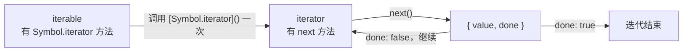

# 08 - 迭代器与元编程

> 对应大纲篇目 08 | 面试可答：迭代协议是 iterable → [Symbol.iterator]() → iterator → next() 的两层结构，Generator 用可暂停的执行上下文实现惰性生产；Iterator Helpers（ES2025）惰性求值消灭中间数组；Proxy 的 13 个陷阱必须与 Reflect 配对以保证 receiver 语义与陷阱不变量。

## 学习目标

- 能画出 iterable 与 iterator 的两层关系，说清 for...of / 展开 / 解构如何消费迭代协议
- 能解释 Generator 执行上下文的暂停/恢复模型，演示 yield 双向通信（next 传值、return/throw）与 yield* 委托
- 能对比 Iterator Helpers（ES2025）与数组方法的惰性差异，用 take + 无限生成器写出安全代码
- 能背出 Proxy 的 13 个陷阱并解释为什么与 Reflect 配对（receiver、陷阱不变量）
- 掌握 toPrimitive / hasInstance / isConcatSpreadable / species 四个 Symbol 元钩子的定制行为

## 核心概念

### 迭代协议：iterable vs iterator

迭代协议是两个角色的协作——**iterable**（可迭代对象，拥有 `Symbol.iterator` 方法）负责「开工厂」，**iterator**（迭代器，拥有 `next` 方法）负责「逐个产出」：



关键区分：iterable 可以**反复迭代**（每次调用 `[Symbol.iterator]()` 得到全新迭代器），iterator 通常**一次性消费**（耗尽后永远 `done: true`）。

内置 iterable：Array、String、Map、Set、arguments、NodeList、TypedArray。内置迭代器（如 `array.entries()` 返回的 Array Iterator）绝大多数也实现了 `Symbol.iterator` 返回自身，因此既是 iterator 也是 iterable。

手写一个 iterable，看清两层结构：

```js
const range = {
  from: 1,
  to: 3,
  [Symbol.iterator]() {                       // iterable：每次迭代都从这里开工厂
    let current = this.from
    const last = this.to
    return {
      next() {                                // iterator：状态保存在这个闭包里
        return current <= last
          ? { value: current++, done: false }
          : { value: undefined, done: true }
      },
      [Symbol.iterator]() { return this }     // 让迭代器自身也是 iterable（内置迭代器的惯例）
    }
  }
}

for (const n of range) console.log(n)         // 1、2、3
for (const n of range) console.log(n)         // 1、2、3 —— iterable 可重复迭代
console.log([...range])                       // [1, 2, 3] —— 展开也走同一协议
```

**谁在消费迭代协议**：for...of、展开运算符 `[...x]`、数组/参数解构 `const [a, b] = x`、`Array.from`、`new Map/Set/WeakMap(iterable)`、`Promise.all/allSettled/any/race`、`yield*`——它们内部都执行「GetIterator：取 `obj[Symbol.iterator]()` → 循环调 `next()` 直到 `done`」。

```js
const map = new Map([['a', 1], ['b', 2]])
for (const [k, v] of map) console.log(k, v)   // a 1 / b 2 —— Map 迭代产出 [key, value] 数组，再被解构

const [first, second] = 'hello'
console.log(first, second)                    // h e —— 字符串也是 iterable

// 反例：普通对象没有 Symbol.iterator，for...of 直接 TypeError
try {
  for (const v of { a: 1 }) console.log(v)
} catch (e) {
  console.log(e.message)                      // 报错：普通对象不可迭代（文案因引擎而异）
}
```

### Generator：可暂停的执行上下文

调用 generator 函数**不执行函数体**，而是创建一个 generator 对象（既是 iterator 也是 iterable）。每次 `next()` 恢复执行直到遇到 `yield`——yield 把表达式的值作为 `{ value, done: false }` 抛给调用方并**挂起当前执行上下文**（局部变量、执行位置全部冻结）；函数 return 或执行完毕时产出 `{ value, done: true }`。

**yield 双向通信**：`next(v)` 的实参成为「上一个 yield 表达式」的求值结果；`return(v)` 强制结束（相当于在挂起点插入 return）；`throw(e)` 在挂起点抛错（可被函数体内 try/catch 接住）。

```js
function* calc() {
  const a = yield 'give me a'                 // 第一次 next 只是启动，不会把值送到这里
  const b = yield 'give me b'                 // a 在这里才被赋值：来自第二次 next 的实参
  return a + b
}

const g = calc()
console.log(g.next())                         // { value: 'give me a', done: false }
console.log(g.next(2))                        // { value: 'give me b', done: false }，2 → a
console.log(g.next(3))                        // { value: 5, done: true }，3 → b
console.log(g.next(100))                      // { value: undefined, done: true } —— 耗尽后继续 next 永远是这个结果，参数无效（bun/node 实测一致）

const g2 = calc()
g2.next()
console.log(g2.return(99))                    // { value: 99, done: true } —— 强制终止

function* guarded() {
  try {
    yield 1
  } catch (err) {
    console.log('caught inside:', err.message)
    yield 'recovered'
  }
}
const g3 = guarded()
g3.next()                                     // { value: 1, done: false }
console.log(g3.throw(new Error('injected')))  // caught inside: injected
// throw 从挂起点注入异常，被 catch 接住后继续执行到下一个 yield；
// throw 的返回值就是这次恢复遇到的 yield 结果：{ value: 'recovered', done: false }
console.log(g3.next())                        // { value: undefined, done: true } —— 错误处理完毕，正常耗尽
```

**yield\* 委托**：把生产工作转交给另一个可迭代对象，其求值结果是内层迭代器的 **return 值**（普通 for...of 拿不到这个值，yield\* 能）。

```js
function* inner() {
  yield 1
  yield 2
  return 'inner-return'                       // for...of 会丢弃它，yield* 会捕获它
}

function* outer() {
  const innerResult = yield* inner()          // 逐个转发 1、2，最后拿到 return 值
  console.log('delegated return:', innerResult)
  yield* [3, 4]                               // 委托给任何 iterable 都行
}

console.log([...outer()])
// 委托过程中打印: delegated return: inner-return
// [1, 2, 3, 4]
```

Generator 对象同时是 iterable：`g[Symbol.iterator]() === g`，所以能直接 `for...of g`、`[...g]`。async generator（next 返回 Promise）与 for await...of 见 07 篇异步迭代一节。

### Iterator Helpers（ES2025）：惰性求值

ES2025 把迭代器升级为一等公民：`Iterator` 构造器 + 一组链式辅助方法，全部**惰性**——不产生中间数组，拉一个算一个。完整方法清单：`map`、`filter`、`take`、`drop`、`flatMap`、`forEach`、`reduce`、`toArray`、`some`、`every`、`find`。

对比数组方法的代价：`arr.map(f).filter(p)` 在百万元素上意味着两次遍历 + 两个临时数组（GC 压力）；Helpers 链在 O(1) 额外内存下完成，且遇到 `take` 等短路操作可以**提前停止**，这让「无限序列」第一次可以安全地链式处理：

```js
function* naturals() {
  let n = 1
  while (true) {                              // 无限生成器
    yield n++
  }
}

const oddSquares = naturals()
  .map((n) => n * n)                          // 不会真的算完所有平方
  .filter((n) => n % 2 === 1)
  .take(5)                                    // 短路：只要 5 个就停
  .toArray()
console.log(oddSquares)                       // [1, 9, 25, 49, 81]

// drop / flatMap / reduce 同样惰性
const result = Iterator.from([1, 2, 3, 4, 5])
  .drop(2)
  .flatMap((n) => [n, n * 10])
  .reduce((acc, n) => acc + n, 0)
console.log(result)                           // 3+30+4+40+5+50 = 132

// 自定义迭代器接入：Iterator.from 接受任何 iterable / iterator
const custom = {
  [Symbol.iterator]() {
    let i = 1
    return {
      next: () => (i <= 3 ? { value: i++, done: false } : { value: undefined, done: true })
    }
  }
}
console.log(Iterator.from(custom).map((n) => n * 2).toArray()) // [2, 4, 6]
```

注意：`forEach`、`reduce`、`toArray`、`some`、`every`、`find` 是**急切的终结操作**（开始拉取并消费）；`map`、`filter`、`take`、`drop`、`flatMap` 只是组装管道，不消费。

**Iterator.concat（ES2026）**：惰性拼接多个可迭代对象，无需先收成数组。ES2026 刚收录，引擎尚在跟进（Bun 1.1.x 未实现），运行前先做能力检测：

```js
if (typeof Iterator.concat === 'function') {
  const merged = Iterator.concat([1, 2], ['a', 'b'])
  console.log([...merged])                    // [1, 2, 'a', 'b']
}
// 惰性：内层迭代器按需逐个推进，而不是 concat 出一个大数组
```

### Proxy / Reflect：13 个陷阱与配对原则

Proxy 拦截的是对象的**基本操作**（内部方法的外部表现），共 13 个陷阱：

| # | 陷阱（trap） | 对应 Reflect 方法 | 拦截的操作 |
|---|-------------|------------------|-----------|
| 1 | get | Reflect.get | 属性读取 `obj.x`、`obj[x]` |
| 2 | set | Reflect.set | 属性写入 |
| 3 | has | Reflect.has | `in` 运算符 |
| 4 | deleteProperty | Reflect.deleteProperty | `delete` 运算符 |
| 5 | ownKeys | Reflect.ownKeys | Object.keys / for...in / Object.getOwnPropertyNames 的键源 |
| 6 | getOwnPropertyDescriptor | Reflect.getOwnPropertyDescriptor | Object.getOwnPropertyDescriptor |
| 7 | defineProperty | Reflect.defineProperty | Object.defineProperty |
| 8 | preventExtensions | Reflect.preventExtensions | Object.preventExtensions |
| 9 | isExtensible | Reflect.isExtensible | Object.isExtensible |
| 10 | getPrototypeOf | Reflect.getPrototypeOf | Object.getPrototypeOf、`instanceof` 链 |
| 11 | setPrototypeOf | Reflect.setPrototypeOf | Object.setPrototypeOf |
| 12 | apply | Reflect.apply | 函数调用（仅函数目标） |
| 13 | construct | Reflect.construct | `new`（仅构造器目标） |

**为什么必须与 Reflect 配对**，而不是在陷阱里直接操作 target：

1. **receiver 一致性**：`Reflect.get(target, key, receiver)` 的第三个参数决定 getter 里的 `this`。陷阱收到的 receiver 通常是 proxy 自身，把它原样传给 Reflect，才能保证「通过 proxy 读属性」与「直接读属性」在 getter/继承场景下语义一致；写 `target[key]` 会悄悄丢失 receiver。
2. **陷阱不变量（invariants）**：规范对陷阱返回值有硬性约束（如 ownKeys 必须包含 target 上所有不可配置属性；对不可扩展 target 必须精确匹配），违反直接抛 TypeError。Reflect 方法提供的就是「合规的默认行为」，陷阱只在其前后加料，天然满足不变量。
3. **Reflect 与内部方法一一对应**：每个陷阱对应一个 `[[内部方法]]`，Reflect 是唯一以函数形式暴露这些内部方法的标准 API——配对使用即「拦截 + 忠实转发」的标准写法。

**应用 1：观察器（访问日志）**

```js
function observe(target, log) {
  return new Proxy(target, {
    get(t, key, receiver) {
      log.push(`get:${String(key)}`)
      return Reflect.get(t, key, receiver)    // 转发时保留 receiver
    },
    set(t, key, value, receiver) {
      log.push(`set:${String(key)}=${String(value)}`)
      return Reflect.set(t, key, value, receiver)
    }
  })
}

const log = []
const user = observe({ name: 'ada', age: 36 }, log)
user.name = 'grace'
console.log(user.age)
console.log(log)   // ['set:name=grace', 'get:age']
```

**应用 2：负索引数组**

```js
function negativeIndex(arr) {
  const normalize = (key, len) => {
    const idx = Number(key)
    return Number.isInteger(idx) && idx < 0 ? String(len + idx) : key
  }
  return new Proxy(arr, {
    get(t, key, receiver) {
      return Reflect.get(t, normalize(key, t.length), receiver)
    },
    set(t, key, value, receiver) {
      return Reflect.set(t, normalize(key, t.length), value, receiver)
    }
  })
}

const a = negativeIndex([10, 20, 30])
console.log(a[-1])                            // 30
console.log(a[-2])                            // 20
a[-1] = 99
console.log(a[2])                             // 99 —— 负索引写回了真实位置
```

**应用 3：校验代理**

```js
function validated(target, validators) {
  return new Proxy(target, {
    set(t, key, value, receiver) {
      const check = validators[key]
      if (check && !check(value)) {
        throw new TypeError(`invalid value for ${String(key)}: ${String(value)}`)
      }
      return Reflect.set(t, key, value, receiver)
    }
  })
}

const config = validated({ port: 8080 }, {
  port: (v) => Number.isInteger(v) && v > 0 && v < 65536
})
config.port = 3000
console.log(config.port)                      // 3000
try {
  config.port = -1
} catch (e) {
  console.log(e.message)                      // invalid value for port: -1
}
```

### Symbol 元钩子：定制语言内置行为

**Symbol.toPrimitive**——对象转原始值的最高优先级钩子（优先于 valueOf/toString，细节回扣 02 篇 ToPrimitive）：

```js
const money = {
  [Symbol.toPrimitive](hint) {
    if (hint === 'number') return 42          // +money、money * 2
    if (hint === 'string') return '$42'       // `${money}`、String(money)
    return '42'                               // default：money + 1、money == '42'
  }
}
console.log(money + 1)                        // 421 —— default hint 返回字符串 '42'，+ 走字符串拼接
console.log(money * 2)                        // 84  —— number hint
console.log(`${money}`)                       // $42 —— string hint
```

**Symbol.hasInstance**——自定义 instanceof：

```js
class ArrayLike {
  static [Symbol.hasInstance](inst) {
    return Array.isArray(inst) || typeof inst?.length === 'number'
  }
}
console.log([1, 2] instanceof ArrayLike)      // true
console.log('abc' instanceof ArrayLike)       // true —— 字符串有 length
console.log({} instanceof ArrayLike)          // false
```

**Symbol.isConcatSpreadable**——控制 Array.prototype.concat 是否展开：

```js
const a = [1, 2]
const b = [3, 4]
b[Symbol.isConcatSpreadable] = false
console.log(a.concat(b))                      // [1, 2, [3, 4]] —— b 被整体保留
console.log(a.concat([5, 6]))                 // [1, 2, 5, 6] —— 新数组没有标记，照常展开
```

标记是**实例级**的：只影响 `b` 这一个数组，其他数组（包括类数组对象）不受影响。

**Symbol.species**——控制派生类方法返回值的构造器：

```js
class MyArray extends Array {
  static get [Symbol.species]() { return Array }   // 让 map/filter 等返回普通 Array
}

const m = new MyArray(1, 2, 3)
const mapped = m.map((x) => x * 2)
console.log(mapped instanceof MyArray)        // false —— 默认 species 会返回 MyArray
console.log(mapped instanceof Array)          // true
console.log(mapped)                           // [2, 4, 6]
```

## 常见踩坑点

### 坑 1：迭代器是一次性的，iterable 才可重复

```js
const arr = [1, 2, 3]
const it = arr[Symbol.iterator]()
console.log([...it])                          // [1, 2, 3]
console.log([...it])                          // [] —— 迭代器耗尽，永远是 done: true
console.log([...arr])                         // [1, 2, 3] —— 数组是 iterable，每次拿新迭代器
// 推论：缓存「迭代器」做数据源是错的，要缓存「iterable」或先 toArray
```

### 坑 2：generator 第一次 next 的实参被丢弃

```js
function* echo() {
  const first = yield 'ready'                 // 第一个 next 只负责启动，参数无处可送
  console.log(first)
}
const g = echo()
g.next('ignored')                             // 启动，输出 { value: 'ready', done: false }
g.next('hello')                               // hello —— 参数在第二次 next 才生效
// 想给第一个 yield 前传参，只能走函数参数：function* echo(init) { ... }
```

### 坑 3：Proxy 包裹含私有字段的实例会爆品牌检查

```js
class Counter {
  #count = 0
  inc() {
    this.#count++                             // 私有字段有品牌（brand）检查
  }
}
const c = new Proxy(new Counter(), {})        // 连空陷阱都不行
try {
  c.inc()                                     // this 是 proxy，不是原始实例
} catch (e) {
  console.log(e.constructor.name)             // TypeError
}
// 私有字段访问时 this 必须是「真正的」实例对象；proxy 无法通过品牌检查
// 需要代理这类对象时，代理业务属性、避开私有字段方法，或改用闭包封装
```

### 坑 4：违反陷阱不变量直接抛 TypeError

```js
const frozen = Object.freeze({ a: 1, b: 2 })
const p = new Proxy(frozen, {
  ownKeys() { return ['a'] }                  // 漏掉了不可配置属性 b
})
try {
  Object.keys(p)
} catch (e) {
  console.log(e.message)                      // TypeError：ownKeys 结果漏掉不可配置属性 b（文案因引擎而异）
}
// 不变量还有：non-extensible target 的 ownKeys 必须精确匹配；
// get 陷阱不能对不可配置、无 getter 的只读属性返回与 target 不同的值
```

### 坑 5：在惰性管道上用终结操作处理无限序列

```js
function* naturals() {
  let n = 1
  while (true) {
    yield n++
  }
}
// naturals().toArray()      // ❌ 永远不会结束：toArray 是急切的，无限序列直接卡死
const safe = naturals().map((n) => n * 2).take(3).toArray()
console.log(safe)                             // [2, 4, 6] —— take 提供短路边界才安全
// 经验：无限序列的链条里必须有 take/find/some/every（可短路）这类能停下来的操作
```

## 面试高频问题

- for...of 能遍历什么？普通对象为什么不行？（依赖 Symbol.iterator；可手写使其可迭代）
- Generator 的原理？为什么说它是协程？（可暂停/恢复的执行上下文，yield 双向通信）
- Iterator Helpers 相比数组方法的优势？（惰性、无中间数组、可处理无限序列）
- Proxy 能拦截哪些操作？为什么用 Reflect 而不是直接操作 target？（receiver、不变量）
- Proxy 与 Object.defineProperty 的差异？（整对象拦截 vs 逐属性定义；新增属性、数组索引、delete 的差异——也是 Vue2/Vue3 响应式切换的原因）
- Symbol.toPrimitive 的三种 hint？与 valueOf/toString 的优先级？（回扣 02 篇）
- 如何自定义 instanceof？（Symbol.hasInstance）
- Iterator.concat（ES2026）解决什么问题？（惰性拼接，避免先收集成数组）

## 面试回答模板

> **问：说说迭代协议，for...of 是怎么工作的**
>
> 迭代协议是两层结构：iterable 拥有 Symbol.iterator 方法，调用一次返回一个全新的 iterator；iterator 拥有 next 方法，每次返回 `{ value, done }`，直到 done 为 true。for...of、展开、解构、Array.from、Map/Set 构造器内部都走 GetIterator 这套流程。关键区分是 iterable 可重复迭代而 iterator 一次性消费。Generator 是协议的「原生实现器」：它返回的对象既是 iterator 又是 iterable。

> **问：Generator 的原理是什么**
>
> 调用 generator 函数不执行函数体，而是返回一个 generator 对象，内部对应一个可暂停的执行上下文。每次 next 恢复执行到下一个 yield，yield 表达式把值作为 `{ value, done: false }` 交出去并挂起上下文，局部状态全部冻结。它还是双向通道：next 的实参成为上一个 yield 的求值结果，return 强制终止，throw 在挂起点注入异常、可被函数体内 try/catch 捕获。yield* 把生产委托给另一个 iterable，并捕获其 return 值。async/await 正是「generator + 自动执行器」的语法糖，细节在 07 篇。

> **问：Iterator Helpers 相比数组的 map/filter 好在哪**
>
> 核心是惰性。数组方法每一步都产生一个完整的中间数组，`arr.map(f).filter(p)` 在百万元素上是两次遍历加两个临时数组；Iterator Helpers 只在拉取时逐个元素流过整条管道，O(1) 额外内存。配合 take 这类短路操作，它第一次让无限生成器可以安全链式处理——比如自然数流 map 后 filter 再 take(5)。ES2025 收录了 map、filter、take、drop、flatMap、forEach、reduce、toArray、some、every、find；ES2026 又加了 Iterator.concat 做惰性拼接。

> **问：Proxy 为什么总是和 Reflect 一起用**
>
> Proxy 的 13 个陷阱一一对应对象的内部方法。在陷阱里转发操作时应该调 Reflect 对应方法而不是直接 `target[key]`，原因有三：第一，Reflect.get/set 的 receiver 参数能把 proxy 作为 getter 的 this 正确传递，直接读 target 会丢 receiver、破坏继承与 getter 语义；第二，陷阱有规范不变量，比如 ownKeys 必须覆盖不可配置属性、non-extensible 目标必须精确匹配，违反直接 TypeError，Reflect 提供的就是合规的默认行为；第三，Reflect 本身就是内部方法的函数化暴露，配对使用即「拦截加忠实转发」的标准写法。

> **问：Symbol 有哪些影响语言内置行为的元钩子**
>
> 四个高频的：Symbol.toPrimitive 是对象转原始值的最高优先级钩子，按 number/string/default 三种 hint 返回不同值，优先级高于 valueOf/toString；Symbol.hasInstance 让我们自定义 instanceof 的判定逻辑；Symbol.isConcatSpreadable 控制数组在 concat 中是否被展开；Symbol.species 控制 map、slice 这类派生方法返回值的构造器。它们共同的思路是：把原本写死在规范算法里的「询问步骤」开放给对象自己定制。

## 练习

### 练习 1：无限 Generator + Iterator Helpers 取前 N 项

**要求**：实现 `fibonacci()` 无限生成器（产出斐波那契数列），再实现 `firstFibs(n)`——用 Iterator Helpers（ES2025）从无限流中安全取前 n 项返回数组。测试代码用 `bun test` 运行。

**提示**：生成器内 `let a = 0, b = 1`，循环 `yield a` 后更新 `[a, b] = [b, a + b]`；取数链是 `fibonacci().take(n).toArray()`。思考：为什么不能用数组方法实现同样的「无限流取前 n 项」？

**预期效果**：

```ts
import { describe, expect, test } from 'bun:test'
import { fibonacci, firstFibs } from './fibonacci'

describe('fibonacci', () => {
  test('无限生成器可被 take 安全截断', () => {
    expect(firstFibs(1)).toEqual([0])
    expect(firstFibs(7)).toEqual([0, 1, 1, 2, 3, 5, 8])
  })

  test('管道是惰性的：map 不会先算完无限项', () => {
    const doubled = fibonacci().map((n: number) => n * 2).take(4).toArray()
    expect(doubled).toEqual([0, 2, 2, 4])
  })
})
```

### 练习 2：Proxy 实现响应式对象（get/set 追踪）

**要求**：实现 `reactive(target)` 返回代理对象：任意属性被读取时记录 `get:key`，被写入时记录 `set:key=value` 并通知已注册的副作用函数；提供 `effect(fn)` 注册副作用、`logs` 数组暴露追踪记录。这是 Vue3 响应式的最小骨架。

**提示**：get 陷阱里 `Reflect.get(t, key, receiver)` 前记日志；set 陷阱里先 `Reflect.set` 再触发回调；用模块级数组存 effect 列表。陷阱中必须保留 receiver 参数转发。思考题：如果属性值是对象，嵌套对象的读写能被追踪吗？（不能——需要在 get 时递归包裹，即 Vue3 的 lazy reactive 思路。）

**预期效果**：

```ts
import { describe, expect, test } from 'bun:test'
import { reactive, effect, logs } from './reactive'

describe('reactive', () => {
  test('get/set 均被追踪', () => {
    logs.length = 0
    const state = reactive({ count: 0 })
    state.count++
    expect(logs).toEqual(['get:count', 'set:count=1'])
  })

  test('set 触发已注册的副作用', () => {
    logs.length = 0
    const calls: number[] = []
    effect((state) => calls.push(state.count))
    const state = reactive({ count: 1 })
    state.count = 2
    state.count = 3
    expect(calls).toEqual([2, 3])
  })
})
```

### 练习 3（加分）：让普通对象可迭代

**要求**：给对象实现 `Symbol.iterator`，使 `for...of` 按 `values()` 的顺序产出值；再实现一个 `entriesIterable` 版本产出 `[key, value]` 对，验证 `new Map(obj)` 与解构都能工作。

**提示**：方法里返回一个闭包迭代器，用 `Object.keys(this)` 加索引推进；也可以直接 `yield*` 委托给已有的数组迭代器来偷懒。

**预期效果**：

```ts
import { describe, expect, test } from 'bun:test'
import { makeIterable } from './iterable-object'

describe('makeIterable', () => {
  test('for...of 与展开均可用', () => {
    const obj = makeIterable({ a: 1, b: 2, c: 3 })
    expect([...obj]).toEqual([1, 2, 3])
    const collected: number[] = []
    for (const v of obj) collected.push(v)
    expect(collected).toEqual([1, 2, 3])      // iterable 可重复迭代
  })
})
```

## 本模块完成标准

- [ ] 能画出 iterable → iterator → next 的两层结构图，解释 for...of / 展开 / 解构的共同消费路径
- [ ] 能演示 generator 的 next 传值、return 终止、throw 注入，说清第一次 next 实参被丢弃的原因
- [ ] 能说出 Iterator Helpers（ES2025）的 11 个方法中哪些惰性、哪些急切，跑通 take + 无限生成器示例
- [ ] 能背出 13 个陷阱并解释 receiver 与陷阱不变量，跑通观察器 / 负索引 / 校验三个代理示例
- [ ] 能说出 toPrimitive 三种 hint 并回扣 02 篇 ToPrimitive 流程
- [ ] 完成练习 1、2，bun test 全绿
