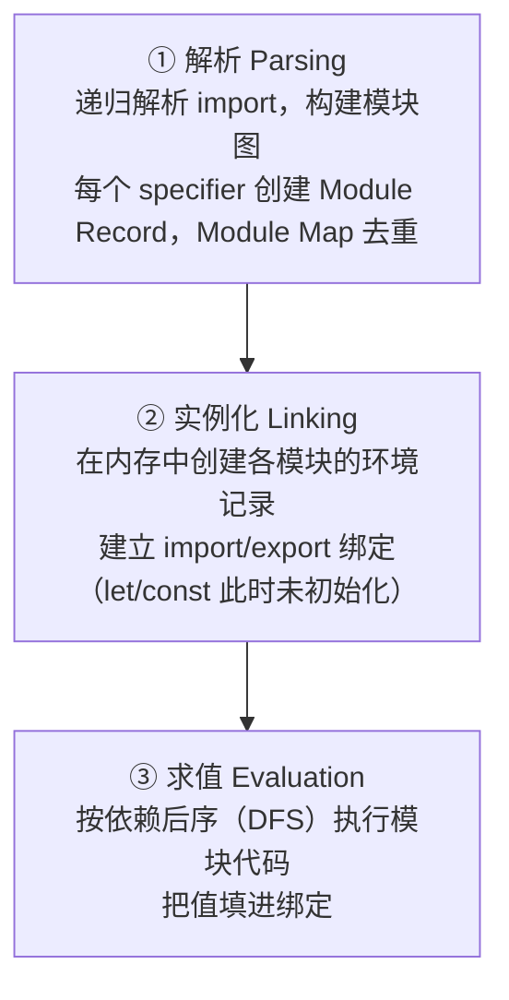

# 09 - 模块系统

> 对应大纲篇目 09 | 面试可答：ESM 是静态分析 + 三阶段加载（解析 → 实例化 → 求值），绑定先于求值建立，所以循环依赖能拿到"活的绑定"；CJS 是运行时值拷贝，循环依赖只能拿到半加载对象；顶层 await 会挂起依赖方求值；ES2025 起 Import Attributes（with { type: 'json' }）与 JSON 模块正式入标准，import defer 仍是前瞻提案

## 学习目标

- 能从"值拷贝 vs 活绑定、静态 vs 动态、缓存、加载时机、this 指向"五个维度对比 ESM 与 CJS，并各给一个可运行反例
- 能画出 ESM 加载三阶段（解析 → 实例化 → 求值）流程图，解释循环依赖为何能拿到活绑定、何时会撞 TDZ
- 能写出 ESM TDZ 崩溃与 CJS 半加载对象两个最小复现，并解释输出
- 能解释顶层 await 的传播语义，会用 import.meta 定位模块自身资源
- 能写出 ES2025 的 JSON 模块导入，说清 import defer 的状态（前瞻提案，未入标准）

## 核心概念

### ESM vs CJS：五维对比

| 维度 | CJS（require/module.exports） | ESM（import/export） |
|------|-------------------------------|----------------------|
| 导出语义 | **值拷贝**：`require` 时把当前求值结果拷贝/快照出去 | **活绑定**（live binding）：导入的是绑定的引用，随导出模块变化 |
| 语法分析 | 动态：`require()` 是函数调用，可写在条件分支里 | 静态：`import`/`export` 只能出现在顶层，解析期即可确定模块图 |
| 缓存 | `require.cache`，按解析后的文件路径去重 | Module Map，按解析后的 URL/specifier 去重；**与 CJS 缓存互相独立（双份缓存）** |
| 加载时机 | 运行时同步加载，执行到 `require` 那一行才加载 | import 声明提升：无论写在文件哪里，模块体执行前所有静态依赖已完成链接与求值 |
| 顶层 this | `this === module.exports` | `undefined`（ESM 默认严格模式） |

**值拷贝 vs 活绑定**，一个对偶例子说清：

```js
// counter.cjs
let count = 0
module.exports = {
  count, // 导出此刻的值拷贝：0
  add() { count++ }
}

// main.cjs
const m = require('./counter.cjs')
m.add()
m.add()
console.log(m.count) // 0 —— 导出的是快照，add() 改的是模块内部的 count，与快照无关
```

```js
// counter.mjs
export let count = 0
export const add = () => { count++ }

// main.mjs
import { count, add } from './counter.mjs'
add()
add()
console.log(count) // 2 —— 活绑定：导入方看到的是导出模块里那个 count 本身
```

ESM 的绑定对导入方**只读**：规范上导入绑定是 immutable binding，试图赋值抛 `TypeError`，只有导出方自己能改。

**加载时机**——ESM 的 import 声明提升：

```js
// dep.mjs
console.log('dep evaluated')
export const v = 1

// hoist.mjs
console.log('main body')
import { v } from './dep.mjs' // 写在最底部也没用：静态 import 全部先于模块体执行
console.log(v)

// bun hoist.mjs 输出：
// dep evaluated
// main body
// 1
```

**顶层 this**：

```js
// who.cjs
console.log(this === module.exports) // true

// who.mjs
console.log(this) // undefined —— ESM 顶层是严格模式
// 注：Bun 1.1.38 实测为 {}，属实现偏差；Node 符合规范返回 undefined
```

**双份缓存**：CJS 与 ESM 各有独立的模块缓存；同一份依赖经两种格式加载就是两个实例。典型事故是 dual-package hazard：

```js
// 某包同时提供 require 与 import 入口时（Node）：
const a = require('some-lib')      // 走 CJS 入口，进 require.cache
const b = await import('some-lib') // 走 ESM 入口，进 Module Map
// a 与 b 可能是两个独立实例：内部单例状态、=== 比较、instanceof 全部失效
```

同理，CJS 里 specifier 不同（如 `./lib` 与 `./lib.js`）也可能解析出两条缓存记录；ESM 以解析后的 URL 为键，`./lib.mjs` 与 `./lib.mjs?inline` 是两个模块。

### ESM 加载三阶段：解析 → 实例化 → 求值

CJS 是"加载即执行"，ESM 把加载拆成三阶段（规范术语：Parsing / Linking / Evaluation）：



- **解析**：不执行代码，只做语法分析与依赖收集，产出模块图。这就是 tree-shaking 可行的根基——依赖关系是静态的（细节见 front/javascript/engineering）。
- **实例化**：为每个模块创建环境记录，把每个 `export` 名字与 `import` 名字接成**同一根绑定的两端**。此时函数声明的绑定已初始化（函数提升），而 `let`/`const` 绑定处于未初始化状态（TDZ，见 04 篇）。
- **求值**：按依赖后序执行模块体，把值填进绑定。每个模块只求值一次，Module Map 记录状态。

**为什么循环依赖能拿到"活的绑定"**：因为绑定在第 ② 步就已建立，第 ③ 步才填值。A、B 互相 import 时，双方拿到的都是"指向同一绑定的引用"——哪怕值还没填，引用关系已经接好；等求值完成后，读到的自然是最新值。CJS 没有这个"先建绑定"的步骤，`require` 直接返回"此刻已求值部分的 exports 拷贝"，所以循环时只能拿到半成品。

### 循环依赖实战

**能跑的 ESM 循环依赖**（函数声明在实例化阶段就完成初始化）：

```js
// even.mjs
import { odd } from './odd.mjs'
export function even(n) {
  return n === 0 || odd(n - 1)
}

// odd.mjs
import { even } from './even.mjs'
export function odd(n) {
  return n !== 0 && even(n - 1)
}

// main.mjs
import { even } from './even.mjs'
console.log(even(4)) // true
console.log(even(5)) // false
```

求值顺序：入口 main 依赖 even，even 依赖 odd → 先求值 odd，再 even，最后 main。odd 求值时虽然 import 了 even，但**函数调用发生在求值全部完成之后**，且函数声明绑定在实例化时已可用，所以没事。

**会崩的 ESM 循环依赖**——TDZ 式崩溃（`let`/`const` 绑定未求值就被读取）：

```js
// a.mjs
import { b } from './b.mjs'
export const a = 'A(' + b + ')'

// b.mjs
import { a } from './a.mjs'
export const b = 'B'
console.log('b 求值期读 a：', a) // 💥 ReferenceError: Cannot access 'a' before initialization

// bun a.mjs：入口 a 依赖 b，后序求值先跑 b；
// 此刻 a.mjs 尚未求值，const a 的绑定存在但未初始化（TDZ），读取即抛错
```

**CJS 的半加载对象**：

```js
// a.cjs
console.log('a start')
exports.done = false
const b = require('./b.cjs')
console.log('a 看到 b.done =', b.done) // true
exports.done = true
console.log('a done')

// b.cjs
console.log('b start')
exports.done = false
const a = require('./a.cjs') // a 正在加载中 → require.cache 命中，返回"此刻的半成品 exports"
console.log('b 看到 a.done =', a.done) // false —— 半加载对象实锤
exports.done = true
console.log('b done')

// main.cjs
const a = require('./a.cjs')
console.log('main 看到 a.done =', a.done) // true
```

实际输出：

```text
a start
b start
b 看到 a.done = false
b done
a 看到 b.done = true
a done
main 看到 a.done = true
```

一句话对比：**CJS 给你"加载到哪算哪"的快照，ESM 给你"先接线后通电"的绑定**。循环依赖在两种体系里都不是好设计，但 ESM 至少把失败变成了可预测的 TDZ 报错，CJS 则是悄无声息的错误值。

### 顶层 await 与 import.meta

顶层 `await`（top-level await，ES2022 入标准，仅 ESM 可用）让模块求值变成异步的：**含顶层 await 的模块，其求值返回一个 promise；所有 import 它的模块都会被挂起，直到它完成**——挂起沿模块图向上传播，但不影响无依赖关系的兄弟模块并行求值：

```js
// slow.mjs
const config = await new Promise((resolve) => {
  setTimeout(() => resolve({ port: 8080 }), 50)
})
export const port = config.port

// main.mjs
import { port } from './slow.mjs'
console.log('能看到这行，说明 slow.mjs 已求值完成')
console.log(port) // 8080

// bun main.mjs：入口的求值被 slow.mjs 挂起 50ms，不需要任何 async 包装
```

`import.meta` 是模块的自描述元信息，最常用的是 `import.meta.url`（当前模块的 file:// URL，替代 CJS 的 `__filename`）：

```js
// meta.mjs（bun meta.mjs 运行）
console.log(import.meta.url) // file:///…/meta.mjs
console.log(import.meta.resolve('./dep.mjs')) // 把相对 specifier 解析成绝对 URL

// 典型用法：以模块自身位置定位资源，不受 process.cwd() 影响
const cfgUrl = new URL('./config.json', import.meta.url)
console.log(cfgUrl.href) // file:///…/config.json
```

### Import Attributes 与 JSON 模块（ES2025）

ES2025 把 **Import Attributes** 与 **JSON Modules** 正式收入标准。导入 JSON 必须声明 `with { type: 'json' }`：

```js
// config.json 内容：{ "name": "kb-vault", "version": 1 }

// app.mjs
import config from './config.json' with { type: 'json' }
console.log(config.name) // kb-vault
console.log(config.version) // 1

// 动态形式：attributes 放在第二个参数里
const dyn = await import('./config.json', { with: { type: 'json' } })
console.log(dyn.default.name) // kb-vault
```

规范要点：

- `with` 取代了早期的 `assert` 关键字（assert 语义是"校验不过就抛错"，with 语义是"向宿主声明类型，由宿主决定怎么处理"），`assert` 已废弃
- attribute 只是声明性元数据，**不改变模块的解析行为**；`type: 'json'` 是目前唯一被广泛支持的类型
- JSON 模块只有 `default` 导出，且命名空间对象是冻结的（named import 会报错；注：Bun 非标准地支持 JSON named import）
- 浏览器/Node 中不带 attribute 直接把 JSON 当模块导入会报错；Bun 作为运行时扩展允许省略，但跨环境请始终写标准写法

### import defer 前瞻（延迟求值模块）

Deferred Import Evaluation 是前瞻提案（**未入标准，语法与语义仍可能变**），目标是把大依赖的求值推迟到首次使用：

```js
// 前瞻提案语法，生产代码请勿使用
import defer * as utils from './utils.mjs'

// utils.mjs 在解析期正常链接，但模块体直到第一次访问才求值
utils.heavy() // ← 求值发生在这里，而不是程序启动时
```

它解决的问题是"启动期加载了大模块但很晚才用"。与动态 `import()` 的区别：defer 保持同步写法、无需 async 上下文。提案落地前，同样的效果可以用动态 `import()` + 惰性初始化手动模拟。

> 交叉链接：打包器的模块解析（Vite/webpack 的 resolve 规则、alias、dual-package 处理、tree-shaking 工程落地）属于工程化范畴，见 front/javascript/engineering 模块；本篇只覆盖语言层面的加载语义。

## 常见踩坑点

1. **条件里写静态 import 直接语法错误**。静态 import 是声明不是语句：

   ```js
   // bad.mjs
   if (process.env.DEBUG) {
     import { logger } from './logger.mjs' // SyntaxError：静态 import 不能出现在语句位置（文案因引擎而异）
   }
   // 条件加载只能用动态 import()
   if (process.env.DEBUG) {
     const { logger } = await import('./logger.mjs')
   }
   ```

2. **给导入绑定赋值 → TypeError**。绑定只读，改状态要导出函数：

   ```js
   // main.mjs
   import { count } from './counter.mjs'
   count = 1 // TypeError: Assignment to constant variable（或 "read-only" 语义报错）
   ```

3. **CJS 导出原始值后以为能"联动"**。导出的是拷贝：

   ```js
   // flag.cjs
   let ready = false
   module.exports = { ready, mark() { ready = true } }

   // main.cjs
   const f = require('./flag.cjs')
   f.mark()
   console.log(f.ready) // false —— 内部 ready 变了，导出的快照没变
   ```

4. **浏览器里 ESM specifier 不带扩展名 → 404**。浏览器没有 Node 式的补全解析，`import './foo'` 找不到文件；Node 的 ESM 同样要求完整路径（`./foo.js`）。打包环境能省扩展名是打包器帮你解析的。

5. **JSON 模块忘了 attribute**。标准环境下 `import cfg from './cfg.json'`（不带 `with { type: 'json' }`）会报错；且 JSON 模块没有命名导出，`import { name } from './cfg.json' with { type: 'json' }` 同样失败，只能 `import cfg from ...` 后取 `cfg.name`。（Bun 例外：非标准地支持 JSON named import，且可省略 attribute）

6. **同一库被 require 又被 import，单例失效**（dual-package hazard）。两个缓存各持一份状态，`instanceof`/`===` 跨实例全部失真；解法是统一项目内的模块格式，或让库作者把状态放到共享的底层。

## 面试高频问题

- ESM 与 CJS 的核心差异？→ 五维表格（活绑定 vs 值拷贝、静态 vs 动态、缓存独立、加载时机、this）
- ESM 循环依赖为什么能拿到活绑定？→ 三阶段加载，绑定在实例化阶段建立，先于求值
- ESM 循环依赖什么时候会崩？→ 求值期读取未初始化的 let/const 绑定，TDZ ReferenceError
- CJS 循环依赖拿到什么？→ require.cache 里"加载到一半的 exports 半成品"
- 顶层 await 的传播语义？→ 含 TLA 模块的求值是 promise，挂起沿模块图向上传播，兄弟模块不受影响
- import 语句与 import() 的区别？→ 前者静态、提升、返回绑定；后者动态、返回 namespace 的 promise
- 什么是 dual-package hazard？→ 同一包被 CJS/ESM 两种格式加载产生两个实例
- Import Attributes 解决什么？→ 向宿主声明模块类型（type: 'json'），ES2025 入标准，取代 assert
- 为什么 tree-shaking 只对 ESM 可靠？→ ESM 依赖图静态可知，CJS 的 require 是运行时调用无法静态分析

## 面试回答模板

> **问：ESM 和 CJS 有什么区别？**
>
> 我会从五个维度答。第一，导出语义：CJS 是值拷贝，require 时把当前结果快照出去；ESM 是活绑定，导入方与导出方共享同一绑定，导出方修改后导入方立刻可见，但绑定对导入方只读。第二，分析时机：CJS 的 require 是运行时函数调用，可以写在条件里；ESM 是静态语法，解析期就能构建完整模块图，这也是 tree-shaking 的前提。第三，缓存：require.cache 与 ESM 的 Module Map 互相独立，同一包跨格式加载会出现两个实例，即 dual-package hazard。第四，加载时机：ESM 的 import 声明提升，所有静态依赖先于模块体执行；CJS 执行到 require 那一行才同步加载。第五，顶层 this：CJS 里是 module.exports，ESM 里是 undefined。

> **问：为什么 ESM 循环依赖能拿到"活的绑定"，CJS 只能拿到半成品？**
>
> 因为两者的加载模型不同。ESM 是三阶段加载：先解析构建模块图，再实例化——在内存中创建环境记录并把 import/export 接成同一绑定的两端，最后才按依赖后序求值填值。绑定在第二阶段就已建立，所以循环依赖双方拿到的引用永远指向同一个绑定，求值完成后读到的就是最新值。CJS 没有"先建绑定"这一步，require 直接返回"该模块此刻已求值部分的 exports 拷贝"，循环时命中 require.cache 拿到的就是半成品。这也是为什么 ESM 里函数声明的循环依赖天然可用（函数提升），而 let/const 在求值前读取会触发 TDZ 报错——失败是显式且可预测的。

> **问：顶层 await 的语义是什么？会不会阻塞？**
>
> 顶层 await 是 ES2022 进入标准的 ESM 特性。含顶层 await 的模块，其求值相当于返回一个 promise：所有静态 import 它的模块都会被挂起，直到这个 promise 完成，挂起沿模块图向上传播——如果入口链上有一个模块 await 很久，整个入口的求值都会被推迟。但它只挂起"依赖它的那条链"，没有依赖关系的兄弟模块照常求值。它只存在于 ESM，CJS 没有对应能力；典型用途是入口模块里先 await 配置/数据再导出，省掉一层 IIFE 包装。

> **问：import.meta 是什么？有什么用？**
>
> import.meta 是模块的自描述元信息对象。最核心的是 import.meta.url，即当前模块自身的 file:// URL，它是 ESM 世界里 __filename/__dirname 的替代；配合 new URL('./config.json', import.meta.url) 可以基于模块自身位置定位资源，不受 process.cwd() 影响。宿主还可以扩展字段，比如 Bun 提供 import.meta.main 判断是否为入口，Node/Bun 都提供 import.meta.resolve() 做 specifier 解析。

> **问：JSON 模块和 Import Attributes 是怎么回事？**
>
> ES2025 把 Import Attributes 与 JSON Modules 正式收入标准。静态写法是 import config from './config.json' with { type: 'json' }，动态写法把 attributes 放在 import() 的第二个参数里。要点有三：with 取代了早期语义不同的 assert 关键字；attribute 是给宿主的声明性元数据，不改变解析行为；JSON 模块只有冻结的 default 导出，没有命名导出。另外 import defer（延迟求值模块）目前还是前瞻提案，没有入标准，生产代码不应使用。

## 练习

### 练习 1：活绑定 vs 值拷贝

**要求**：创建两个 fixture 模块（一个 ESM、一个 CJS），用 bun test 验证 ESM 的 `count` 随 `add()` 变化而 CJS 的 `count` 永远不变。

**提示**：fixture 文件如下；测试里用 `createRequire` 在 ESM 环境中加载 CJS。

```js
// fixtures/counter.mjs
export let count = 0
export const add = () => { count++ }

// fixtures/counter.cjs
let count = 0
module.exports = {
  count,
  add() { count++ }
}
```

```ts
// live-binding.test.ts
import { describe, expect, test } from 'bun:test'
import { createRequire } from 'node:module'
import { count, add } from './fixtures/counter.mjs'

const require = createRequire(import.meta.url)

describe('活绑定 vs 值拷贝', () => {
  test('ESM：count 随 add() 变化', () => {
    expect(count).toBe(0)
    add()
    add()
    expect(count).toBe(2) // 活绑定
  })

  test('CJS：快照纹丝不动', () => {
    const m = require('./fixtures/counter.cjs')
    expect(m.count).toBe(0)
    m.add()
    expect(m.count).toBe(0) // 值拷贝
  })
})
```

**预期效果**：`bun test live-binding.test.ts` 全部通过；把 CJS 用例中的断言改成 `toBe(2)` 可以亲眼看到它失败。

### 练习 2：循环依赖最小复现（ESM vs CJS）

**要求**：用 `Bun.spawnSync` 跑子进程，分别验证三件事——ESM 函数循环依赖正常运行；ESM 读 `const` 绑定撞 TDZ 崩溃；CJS 循环依赖打印出半加载对象。

**提示**：fixture 就是正文的三个案例（esm-cycle/、esm-tdz/、cjs-cycle/），断言子进程的 stdout/stderr 与退出码即可。

```ts
// cycle.test.ts
import { describe, expect, test } from 'bun:test'
import { spawnSync } from 'node:child_process'
import { fileURLToPath } from 'node:url'

const dir = fileURLToPath(new URL('./fixtures', import.meta.url))

describe('循环依赖 ESM vs CJS', () => {
  test('ESM：函数声明循环依赖正常工作', () => {
    const r = spawnSync(['bun', 'run', `${dir}/esm-cycle/main.mjs`], { encoding: 'utf8' })
    expect(r.status).toBe(0)
    expect(r.stdout).toContain('true') // even(4) = true
  })

  test('ESM：求值期读 const 绑定触发 TDZ 崩溃', () => {
    const r = spawnSync(['bun', 'run', `${dir}/esm-tdz/a.mjs`], { encoding: 'utf8' })
    expect(r.status).not.toBe(0)
    expect(r.stderr).toContain('before initialization')
  })

  test('CJS：拿到的是半加载对象', () => {
    const r = spawnSync(['node', `${dir}/cjs-cycle/main.cjs`], { encoding: 'utf8' })
    expect(r.stdout).toContain('b 看到 a.done = false')
  })
})
```

**预期效果**：三个用例通过；把 `esm-cycle` 里的函数改成求值期立即调用（如 `console.log(even(4))` 写在模块顶层），观察 TDZ 报错如何出现。

### 练习 3：JSON 模块与 import.meta（可选）

**要求**：写一个 `fixtures/config.json`，用带 attribute 的动态 `import()` 加载并断言字段；再用 `import.meta.url` 构造该文件的绝对 URL 并断言以 `config.json` 结尾。

**提示**：动态 import 的第二参数是 `{ with: { type: 'json' } }`；JSON 模块只有 `default` 导出。

```ts
// json-module.test.ts
import { describe, expect, test } from 'bun:test'

describe('JSON 模块（ES2025）', () => {
  test('with { type: \'json\' } 动态导入', async () => {
    const mod = await import('./fixtures/config.json', { with: { type: 'json' } })
    expect(mod.default.name).toBe('kb-vault')
  })

  test('import.meta.url 定位资源', () => {
    const url = new URL('./fixtures/config.json', import.meta.url)
    expect(url.href.endsWith('config.json')).toBe(true)
  })
})
```

**预期效果**：`bun test json-module.test.ts` 通过；去掉 `with` 属性观察 Bun 与 Node/浏览器行为的差异。

## 本模块完成标准

- [ ] 能不看表说出 ESM vs CJS 五个维度的差异，并各举一个可运行反例
- [ ] 能画出三阶段加载流程图，解释"绑定先于求值"如何让循环依赖拿到活绑定
- [ ] 能手写 ESM TDZ 崩溃与 CJS 半加载对象两个最小复现，并逐行解释输出
- [ ] 能说清顶层 await 的挂起传播范围与 import.meta.url 的典型用法
- [ ] 能写出 `with { type: 'json' }` 的 JSON 模块导入，说出 import defer 尚未入标准
