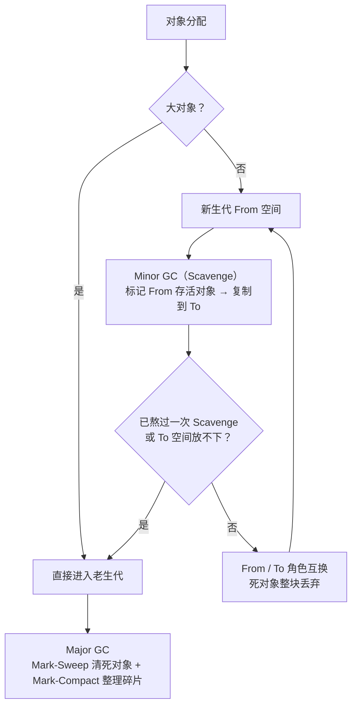

# 10 - 内存与 GC

> 对应大纲篇目 10 | 面试可答：JS 内存靠可达性（reachability）判生死；V8 分代回收——新生代 Scavenge（Semi-space From/To 复制）处理短命对象，老生代 Mark-Sweep + Mark-Compact 处理长命对象；四种经典泄漏（全局引用、未清理定时器/监听器、闭包持有大对象、分离 DOM）都能用"谁还引用着它"定位；WeakMap 键必须是对象（GC 可达性语义），ES2023 起 symbol 可作键；WeakRef/FinalizationRegistry 的回收与回调都不保证

## 学习目标

- 能画出 V8 堆的新老生代结构与对象晋升路径，解释为什么新生代用复制、老生代用标记
- 能列举四种经典泄漏模式并各给最小代码与修复方式
- 能用可达性解释 WeakMap/WeakSet 键为何必须是对象，说出 ES2023 的 symbol 例外
- 能写 WeakRef + FinalizationRegistry 缓存，并解释"不保证执行"语义为什么不能依赖
- 能说出 DevTools Memory 面板三种快照各自的适用场景

## 核心概念

### 内存生命周期：分配 → 使用 → 释放

所有语言的内存生命周期都是三段：**分配**（声明变量、字面量、`new` 时由引擎隐式完成）→ **使用**（读写、传参）→ **释放**（不再需要时归还）。高级语言把第三段自动化了：栈内存随作用域弹出自动释放，堆内存交给 GC。GC 的判断标准是**可达性**：从根（roots）出发沿引用链能走到的对象都是活的，走不到的就是垃圾。

```js
let list = new Array(1_000_000).fill(0) // 分配：堆上一块大数组
list.length // 使用
list = null // 释放：程序员唯一能做的——切断引用，剩下交给 GC
```

根包括：全局对象（globalThis）、当前执行栈上的局部变量与参数、引擎内部句柄。"局部变量置 null 就能回收"只在它是**最后一根**引用链时成立；闭包、定时器、全局容器都可能让对象继续可达。

### V8 堆结构：分代假说与对象晋升

分代假说：绝大多数对象朝生暮死，熬过第一次 GC 的对象大概率长寿。据此 V8 把堆分成两代，用不同算法：

- **新生代**：空间小（通常几 MB），等分为 From、To 两个 Semi-space。Minor GC 用 **Scavenge**（Cheney 复制算法）：从根标记 From 中的存活对象，复制到 To，然后 From/To 角色互换。复制成本只与存活对象成正比，而新生代存活对象极少，所以又快又顺带整理碎片。
- **老生代**：空间大、对象存活率高，复制不再划算。Major GC 用 **Mark-Sweep** 标记并清除死对象，再用 **Mark-Compact** 把存活对象向一端移动整理碎片。增量标记（把标记切碎插入执行间隙）、并发标记/清扫（借助后台线程）是 V8 为减少主线程停顿做的工程优化——面试按此口径回答即可。



晋升条件记住三条：**熬过一次 Scavenge**、**To 空间放不下（复制时空间利用率过高）**、**大对象直接进老生代**（避免在两个半区间来回复制）。

### 四种经典泄漏模式

泄漏的本质：**对象逻辑上已无用，但仍有一条引用链从根可达**。

**1. 全局引用 / 无界容器**。模块级容器只进不出：

```js
const cache = new Map() // 模块级 Map：只要进程活着就可达

function handle(request) {
  cache.set(request.id, buildHeavyResult(request)) // 只增不减 → 持续泄漏
}
```

修复：键是对象时改用 WeakMap（见下文弱引用家族）；键是字符串等原始值时给缓存加上限（LRU）或 TTL。

**2. 未清理的定时器 / 监听器**（宿主侧 API，清理时机与框架生命周期的配合细节交叉链接 front/javascript 与 front/javascript/web-apis）：

```js
function startPolling() {
  const huge = new Array(1_000_000).fill('*')
  // 闭包持有 huge；组件卸载后若没人 clearInterval，
  // timer 由宿主调度器持有 → 回调可达 → huge 永远可达
  setInterval(() => {
    report(huge.length)
  }, 1000)
}
```

修复：启动者负责清理——拿到 timer id，在卸载/销毁路径上 `clearInterval`；事件监听同理，`addEventListener` 与 `removeEventListener` 必须成对。

**3. 闭包持有大对象**。闭包捕获的是词法环境中的变量，只要闭包引用了它，整个对象就保持可达：

```js
// bad：返回的小闭包引用了 history → 百万级数组常驻
function createLoggerBad() {
  const history = new Array(1_000_000).fill('log')
  return () => history.length
}

// good：先把需要的值提取成局部量，闭包不再引用 history
function createLoggerGood() {
  const history = new Array(1_000_000).fill('log')
  const len = history.length
  return () => len // history 失去最后的引用链，可被回收
}
```

注意：现代引擎只捕获闭包实际引用的变量，所以修复手段就是"让闭包别引用大对象"——提取标量、置空、缩小作用域。

**4. 分离 DOM（Detached DOM）**（前端侧，DOM 细节交叉链接 front/javascript）：节点已从文档树移除，但 JS 仍持有引用，整个子树跟着常驻：

```js
// 浏览器环境伪代码
let detached = null
function replaceTree() {
  const old = document.getElementById('tree')
  detached = old // old 已被新树替换，但 JS 变量拽着整棵旧子树
  old.replaceWith(buildNewTree())
}
// 修复：用完即弃 detached = null，或只在弱引用场景保留 WeakRef
```

Heap snapshot 里这类对象通常显示为 `Detached HTMLDivElement`，是"分离 DOM"的直接证据。

### 弱引用家族

**WeakMap / WeakSet**：条目不阻止键被回收——键失去其他所有引用后，条目会在之后的某次 GC 中被移除。正因如此：

- **键必须是对象**：可达性语义只对对象成立。原始值没有独立的 GC 身份（字符串驻留、数字无身份），无法"被回收"，弱语义无从谈起。同时 WeakMap 不可迭代、没有 `size`——条目随时可能消失，枚举语义不成立。
- **ES2023 例外**：Symbols as WeakMap keys 入标准，symbol（包括 `Symbol.for` 创建的注册 symbol）也可以作 WeakMap 键。注意注册 symbol 常驻全局注册表、本身不会被回收，所以这类条目事实上不会被清理；实践上更常用非注册 symbol 作键。
- **值仍是强引用**：WeakMap 弱化的只是"键 → 条目"这一侧。

```js
const wm = new WeakMap()
// wm.set('str', 1) // TypeError: Invalid value used as weak map key
const key = { id: 1 }
wm.set(key, { heavy: new Array(1000).fill(0) })
// key 失去其他引用并被 GC 后，条目随之消失
```

典型用途：给对象挂私有数据/缓存而不改变其生命周期（DOM 节点 ↔ 视图状态、对象 ↔ 昂贵计算结果）。

**WeakRef + FinalizationRegistry（ES2021 入标准）**。WeakRef 持有一个对象的弱引用，`deref()` 在对象存活时返回它、被回收后返回 `undefined`；FinalizationRegistry 在对象被回收后调度一个清理回调。合起来可以做"对象活着就复用、死了就清理外围资源"的缓存：

```js
const registry = new FinalizationRegistry((heldValue) => {
  // 时机不确定：可能几毫秒后、可能几分钟后、也可能进程退出前根本不执行
  console.log(`[finalizer] ${heldValue} 已被回收`)
})

const cache = new Map()
function loadResource(key) {
  const alive = cache.get(key)?.deref()
  if (alive) return alive // 命中：对象还活着，直接复用
  const resource = { key, data: new Array(1000).fill('#') }
  cache.set(key, new WeakRef(resource)) // 只存弱引用，不阻止回收
  registry.register(resource, key)
  return resource
}
```

**不保证语义**（面试必答）：`deref()` 在任意一次 GC 后就可能返回 `undefined`，不要假设缓存"至少活多久"；finalizer 回调的时机由宿主决定——可能延迟很久，页面关闭/进程退出时未执行的回调会被直接丢弃；因此 finalizer **只能做锦上添花的清理（日志、清缓存条目），绝不能承担正确性**（如释放锁、持久化状态）。

### 排查工具：DevTools Memory 面板的三种快照

三种快照解决三类问题（面板操作细节见 front/javascript/web-apis 模块，此处只讲选型）：

| 快照类型 | 记录什么 | 适用场景 |
|----------|----------|----------|
| Heap snapshot | 某一刻堆中全部对象及引用关系 | 查泄漏主力：操作前后各拍一张，对比两次快照的 Δ Size，找只增不减的构造器 |
| Allocation instrumentation on timeline | 一段时间内分配了哪些对象、哪些后来被回收 | 查"持续分配不回收"的节奏性问题，如每帧都在 new 的渲染循环 |
| Allocation sampling | 按调用栈统计分配的采样数据 | 开销最低，适合长时间运行场景，定位"分配热点在哪个函数" |

经验流程：snapshot 对比定位到可疑构造器 → 点开 Retainers 看"谁还引用着它" → 顺着引用链找到那根该断没断的线。

## 常见踩坑点

1. **以为循环引用就是泄漏**。可达性 GC 下，互相引用的孤岛只要从根不可达就会被回收：

   ```js
   function cycle() {
     const a = {}
     const b = {}
     a.ref = b
     b.ref = a
   }
   cycle() // 函数返回后 a、b 均不可达，下次 GC 正常回收——不是泄漏
   ```

   "循环引用导致泄漏"是引用计数时代（以及旧 IE 的 JScript 与 DOM 跨语言循环）的历史问题。

2. **把 FinalizationRegistry 当析构函数用**。它不保证执行：

   ```js
   const registry = new FinalizationRegistry((id) => {
     console.log('清理', id) // 进程先退出？这行可能永远不打印
   })
   registry.register({}, 'temp')
   // 脚本立即结束：没有任何机制等待 finalizer，回调被丢弃
   ```

   依赖它做数据落盘/释放外部资源 = 生产事故；它只适合清缓存条目、打诊断日志。

3. **console.log 造成的"伪泄漏"**。DevTools 的 Console 会保留你打印过的对象引用，排查时明明置了 null 却在快照里看到对象还活着——先清空 Console 再拍快照，否则结论失真。

4. **把无界缓存当性能优化**。`Map` 缓存命中率确实高，但"只增不减的强引用缓存"在语义上就是泄漏；缓存必须有淘汰策略（LRU/TTL/容量上限），或者键是对象时改用 WeakMap。

## 面试高频问题

- V8 为什么分代？→ 分代假说：短命对象多，新生代用复制算法只与存活量成正比，快；老对象多且存活率高，用标记类算法
- Scavenge 的流程？→ From/To 两个半区，Minor GC 把 From 存活对象复制到 To，互换角色；晋升条件（熬过一次 / To 放不下 / 大对象直达）
- Mark-Sweep 与 Mark-Compact 的分工？→ 前者清死对象但产生碎片，后者移动存活对象整理碎片；增量/并发标记是 V8 减少停顿的工程优化
- 怎么判断泄漏？→ Heap snapshot 前后对比 Δ Size + Retainers 引用链
- WeakMap 键为什么必须是对象？→ 弱语义依赖键可被 GC，原始值无 GC 身份；ES2023 起 symbol 例外
- WeakRef/FinalizationRegistry 能保证什么？→ 什么都不保证：deref 随时可能 undefined，finalizer 时机不定且进程退出即丢弃
- 闭包泄漏怎么修？→ 让闭包不引用大对象：提取标量、置空、缩小作用域

## 面试回答模板

> **问：讲讲 V8 的垃圾回收机制。**
>
> V8 基于分代假说把堆分成两代。新生代空间小，等分为 From 和 To 两个 Semi-space，Minor GC 用 Scavenge 复制算法：把 From 中的存活对象复制到 To，然后两区角色互换——因为新生代绝大多数对象朝生暮死，复制成本只跟存活对象成正比，所以非常快。熬过一次 Scavenge、或者 To 空间放不下、或者本来就是大对象，都会晋升到老生代。老生代用 Major GC：Mark-Sweep 从根标记可达对象、清除死对象，Mark-Compact 再把存活对象向一端移动整理碎片。为了减少主线程停顿，V8 还做了增量标记和并发标记/清扫这些工程优化。

> **问：JavaScript 里常见的内存泄漏有哪些？怎么排查？**
>
> 四种经典模式，本质都是"逻辑无用但引用链还在"。一是全局引用和无界缓存，模块级 Map 只进不出；二是未清理的定时器和监听器，setInterval 的闭包拽着大对象，组件卸载没清理；三是闭包意外持有大对象，返回的小函数引用了百万级数组；四是分离 DOM，节点移出文档树但 JS 变量还拽着整棵子树。排查用 DevTools Memory 面板：操作前后各拍一张 Heap snapshot，对比 Δ Size 找只增不减的构造器，再顺着 Retainers 引用链找到那根该断没断的引用。注意先清空 Console，避免 console.log 保留引用造成伪泄漏。

> **问：WeakMap 的键为什么必须是对象？**
>
> 因为 WeakMap 的核心语义是"条目不阻止键被回收"，这依赖 GC 的可达性判断，而可达性只对对象成立：原始值没有独立的 GC 身份，字符串可能驻留、数字根本没有"同一个"的概念，无法谈"被回收"。ES2023 的 Symbols as WeakMap keys 提案把例外给了 symbol——symbol 有唯一身份，可以作键；但注册 symbol 常驻全局注册表不会被回收，所以实践中常用非注册 symbol。另外 WeakMap 的值仍是强引用，且因为条目可能随时消失，它不可迭代、没有 size。

> **问：WeakRef 和 FinalizationRegistry 怎么用？有什么坑？**
>
> 它们是 ES2021 入标准的弱引用工具：WeakRef 弱引用一个对象，deref() 在对象存活时返回它、被回收后返回 undefined；FinalizationRegistry 在对象被回收后调度一个回调。典型场景是缓存：Map 里存 WeakRef，命中就 deref 复用，没命中就重建并注册 finalizer 清理过期条目。最大的坑是"不保证"语义：deref 在任意一次 GC 后都可能失效，不要假设缓存存活时长；finalizer 的时机完全由宿主决定，进程或页面退出时未执行的回调直接丢弃，所以它只适合做日志、清缓存这类锦上添花的事，绝不能承担正确性逻辑，不能当析构函数用。

> **问：新生代为什么用复制算法而不是标记清除？**
>
> 因为新生代对象的存活率极低。复制算法的成本与存活对象数量成正比，而不是堆大小：把少量存活对象从 From 复制到 To，顺手就完成了内存整理，没有碎片问题，Minor GC 因此又快又频繁。代价是浪费一半空间，所以新生代只给几 MB、切成两个半区。反过来，老生代对象存活率高，复制大半堆太亏，才换成 Mark-Sweep + Mark-Compact。这就是"按对象生命周期选算法"的分代设计。

## 练习

### 练习 1：WeakMap 缓存 + FinalizationRegistry 日志

**要求**：实现 `expensive(key)`：用 WeakMap 缓存计算结果，同一键只计算一次；同时用 FinalizationRegistry 注册键，回收时打日志。测试只断言确定性的部分（缓存命中），finalizer 输出不做断言。

**提示**：`Bun.gc(true)` 可以触发一次强制 GC，便于观察；但规范层面回收时机仍不保证，测试写法要容错。

```ts
// weak-cache.test.ts
import { describe, expect, test } from 'bun:test'

describe('WeakMap 缓存 + FinalizationRegistry', () => {
  test('同一键只计算一次（确定性断言）', () => {
    const cache = new WeakMap<object, number>()
    let computes = 0
    const expensive = (key: object) => {
      if (!cache.has(key)) {
        computes++
        cache.set(key, Math.random())
      }
      return cache.get(key)
    }
    const key = { id: 42 }
    expensive(key)
    expensive(key)
    expect(computes).toBe(1)
  })

  test('WeakRef：断引用 + 强制 GC 后可被回收', () => {
    const registry = new FinalizationRegistry((id: string) => {
      // 不保证输出：这行可能延迟很久才打印，也可能永远不打印，所以不做断言
      console.log(`[finalizer] ${id} 已被回收`)
    })
    let target: { data: number[] } | null = { data: new Array(100_000).fill(1) }
    const ref = new WeakRef(target)
    registry.register(target, 'target-1')
    target = null
    for (let i = 0; i < 3 && ref.deref() !== undefined; i++) {
      Bun.gc(true) // 强制 GC 便于演示；规范层面时机仍不保证
    }
    expect(ref.deref()).toBeUndefined()
  })
})
```

**预期效果**：`bun test weak-cache.test.ts` 通过；finalizer 日志可能打印也可能不打印——这正是"不保证执行"语义的现场演示，跑几次观察差异。

### 练习 2：闭包持有大对象的复现与修复

**要求**：写 bad/good 两个版本的 `createLogger`（正文案例），用 WeakRef 分别持有大数组，强制 GC 后验证：bad 版本的大数组仍可达，good 版本的已被回收。

**提示**：bad 版本里 WeakRef 的 deref 应仍然存在；good 版本先提取 `history.length` 再返回闭包。

```ts
// closure-leak.test.ts
import { describe, expect, test } from 'bun:test'

describe('闭包持有大对象', () => {
  test('bad：闭包引用大数组，GC 后仍可达', () => {
    let bigRef!: WeakRef<string[]>
    const createLoggerBad = () => {
      const history = new Array(1_000_000).fill('x')
      bigRef = new WeakRef(history)
      return () => history.length // 闭包持有 history
    }
    const log = createLoggerBad()
    expect(log()).toBe(1_000_000)
    Bun.gc(true)
    expect(bigRef.deref()).toBeDefined() // 泄漏：数组仍可达
  })

  test('good：提取标量后大数组可回收', () => {
    let bigRef!: WeakRef<string[]>
    const createLoggerGood = () => {
      const history = new Array(1_000_000).fill('x')
      bigRef = new WeakRef(history)
      const len = history.length
      return () => len // 不再引用 history
    }
    const log = createLoggerGood()
    expect(log()).toBe(1_000_000)
    for (let i = 0; i < 3 && bigRef.deref() !== undefined; i++) {
      Bun.gc(true)
    }
    expect(bigRef.deref()).toBeUndefined() // 已回收
  })
})
```

**预期效果**：`bun test closure-leak.test.ts` 通过；把 good 版本改回引用 `history` 观察第二条用例失败。

### 练习 3：给无界缓存加上限（可选）

**要求**：把泄漏的全局 `Map` 缓存改造成容量上限为 N 的 LRU（用 Map 的插入顺序实现：命中时删除再 set，超限时删除最早插入的键），写测试验证容量永不超限。

**提示**：`Map` 迭代顺序即插入顺序，`map.keys().next().value` 就是最老的键。

```ts
// lru.test.ts
import { describe, expect, test } from 'bun:test'

describe('有界 LRU 缓存', () => {
  test('容量永不超限', () => {
    const lru = new Map<string, number>()
    const cap = 3
    const set = (k: string, v: number) => {
      if (lru.has(k)) lru.delete(k) // 命中：刷新为新近使用
      lru.set(k, v)
      if (lru.size > cap) lru.delete(lru.keys().next().value as string) // 淘汰最老
    }
    for (let i = 0; i < 100; i++) set(`k${i}`, i)
    expect(lru.size).toBe(cap)
    expect(lru.has('k99')).toBe(true)
    expect(lru.has('k0')).toBe(false)
  })
})
```

**预期效果**：`bun test lru.test.ts` 通过；体会"缓存必须有淘汰策略"与练习 1 中 WeakMap"按键的生死自动淘汰"的分工。

## 本模块完成标准

- [ ] 能画出 V8 堆的分代结构与对象晋升路径，说清新老生代各自的算法与选择原因
- [ ] 能列举四种泄漏模式并各给最小复现与修复方式
- [ ] 能用可达性解释 WeakMap 键的约束与 ES2023 的 symbol 例外
- [ ] 能跑通 WeakMap 缓存 + FinalizationRegistry 日志练习，并说清"不保证执行"语义
- [ ] 能说出 DevTools Memory 三种快照的选型依据（Heap snapshot / Allocation timeline / Allocation sampling）
