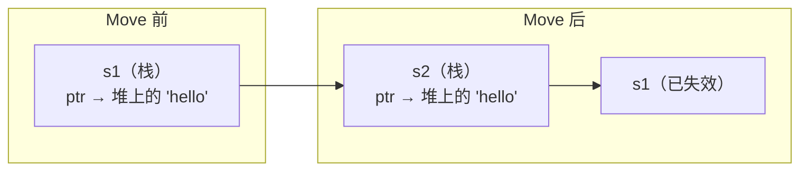

# 第 2 章：所有权、借用与引用（Rust 核心难点）

> 这一章是 Rust **最重要**也 **最不同** 的部分。如果你用 Java/JS/Python，垃圾回收帮你管理内存。Rust 则通过**编译器静态检查**来确保内存安全 —— 没有 GC，没有手动 free，一切在编译期确定。

[[outline|← 返回目录]]

---

## 2.1 所有权规则（三条黄金法则）

1. Rust 中每个值都有且只有一个**所有者（Owner）**
2. 当所有者离开作用域，值被自动释放
3. 值在同一时刻只能有一份所有权（可通过 move/clone 转移）

```rust
// 类比理解：JS 的引用赋值是"共享引用"（多个变量指向同一对象）
// Rust 的所有权是"独占引用"（一个值只有一个主人）

let s1 = String::from("hello");
let s2 = s1;           // s1 的所有权 moved 到 s2
// println!("{}", s1); // ❌ 编译错误：s1 已失效

// 对比 JS: let s1 = "hello"; let s2 = s1; // 都可用（值类型拷贝）
// 对比 JS: let s1 = [1,2,3]; let s2 = s1; // 引用共享，s1 仍可用
// Rust 的行为更像：s1 被"移动"到 s2，s1 不再有效
```

**为什么会这样？** Rust 的目标是避免双重释放（double free）—— 每个内存在被释放时只能有一个所有者。

### 所有权转移的底层理解



- `String` 在栈上存储（ptr, len, capacity），堆上存储实际字符串数据
- `let s2 = s1` 时，Rust **移动**了栈上的三个字段，而不是拷贝堆数据
- 移动后，编译器标记 `s1` 为无效，防止双重释放

## 2.2 克隆（Clone）和拷贝（Copy）

```rust
// Clone —— 深度拷贝（堆数据）
let s1 = String::from("hello");
let s2 = s1.clone();
println!("{} {}", s1, s2); // 都可用 ✅

// Copy —— 栈数据的自动拷贝
let x = 5;
let y = x;
println!("{} {}", x, y); // 都可用 ✅（整数实现了 Copy trait）
```

- 标量类型、元组（仅包含 Copy 类型时）默认是 Copy 语义
- String、Vec、自定义结构体默认是 Move 语义

**判断规则**：实现了 `Copy` trait 的类型在赋值/传参时自动拷贝；未实现的就是 Move。

## 2.3 借用（Borrowing）与引用

> 如果每次传参都要 move，代码就没法写了。**借用**允许你引用一个值而不获取它的所有权。

```rust
// & 表示不可变引用（可以理解为"只读借用"，类比 Java 的 const 引用）
fn calculate_length(s: &String) -> usize {  // s 是借用，不是所有者
    s.len()
}  // s 离开作用域，但不释放值（不是所有者）

let s = String::from("hello");
let len = calculate_length(&s);
println!("{} {}", s, len); // s 仍然可用 ✅
```

## 2.4 借用规则（面试必考）

**同时只能有两种情况之一：**
1. 任意多个不可变引用（`&T`）
2. 最多一个可变引用（`&mut T`）

```rust
let mut s = String::from("hello");

let r1 = &s;      // ✅
let r2 = &s;      // ✅（多个不可变引用 OK）
// let r3 = &mut s; // ❌ 编译错误：已有不可变引用时不能有可变引用
println!("{} {}", r1, r2); // 引用使用结束

let r3 = &mut s;  // ✅ 之前的引用已用完
r3.push_str(" world");
```

**类比理解：**
- 多个读者（不可变引用）可以同时读一本书 ✅
- 一个写者（可变引用）可以写书 ✅
- 不能同时有人读又有人写 ❌ —— 这就是**数据竞争**的根源

### 借用规则的 NLL（Non-Lexical Lifetimes）

Rust 2018 引入了 NLL，引用的有效期到"最后一次使用"而不是"离开作用域"：

```rust
let mut s = String::from("hello");

let r1 = &s;
let r2 = &s;
println!("{} {}", r1, r2);  // r1, r2 最后一次使用在这里
// 到这一行，r1 和 r2 的生命周期就结束了

let r3 = &mut s;            // ✅ 因为前面的引用已经不再使用
r3.push_str(" world");
```

## 2.5 悬垂引用（Dangling References）

Rust 编译器保证**不存在悬垂引用**：

```rust
fn dangle() -> &String {
    let s = String::from("hello");
    &s  // ❌ 编译错误：s 离开函数就被释放，返回的引用会悬垂
}
// 应返回 String 本身，让所有权转移出去
fn no_dangle() -> String {
    let s = String::from("hello");
    s  // ✅ 所有权转移给调用者
}
```

## 2.6 生命周期（Lifetimes）入门

> 生命周期是 Rust 最让人头疼的概念。这里只讲入门场景，高级用法可以在第 6 章深入。

```rust
// 核心概念：生命周期标注告诉编译器"引用 a 和引用 b 存活多久"
// 最常见的场景：函数参数和返回值存在引用关系时

// 最简单的例子：&'a str 表示"这个引用至少存活 'a 这么长时间"
fn longest<'a>(x: &'a str, y: &'a str) -> &'a str {
    if x.len() > y.len() { x } else { y }
}
```

**生命周期入门原则：**
- 每个引用都有生命周期（编译器可以自动推断大部分情况）
- 生命周期标注不会改变引用的存活时间，只是让编译器能检查正确性
- 99% 的日常代码中生命周期会自动推断（**生命周期省略规则**），你只需在少数复杂场景下手动标注

**一次直观理解**：生命周期就是告诉编译器"这个入参和返回值是有关联的，它们的存活时间一致"。

### 常见的生命周期省略规则

以下场景不需要手动标注：

| 场景 | 省略规则 | 等价写法 |
|------|---------|---------|
| 函数只有一个引用参数 | `fn foo(x: &str) -> &str` | `fn foo<'a>(x: &'a str) -> &'a str` |
| 方法中 &self 引用 | `fn get(&self) -> &str` | `fn get<'a>(&'a self) -> &'a str` |
| 函数有多个参数但只有一个引用 | `fn foo(x: i32, y: &str) -> &str` | `fn foo<'a>(x: i32, y: &'a str) -> &'a str` |

---

## 练习

1. **理解 Move**：写一段代码，创建一个 `String`，赋值给另一个变量，然后尝试使用原变量。观察编译错误，并解释为什么。

2. **借用的边界**：写一个函数，接收 `&mut String` 和一个 `&String`，尝试同时使用它们。先在 `println!` 中同时传入这两个参数，再从 `println!` 中移除一个，看编译器何时放行。

3. **悬垂引用**：写一个返回 `&String` 的函数，让它在函数体内创建一个新的 `String` 并返回引用。观察编译错误，然后改成返回 `String` 本身（转移所有权）。

---

> **下一步**：学习 Rust 的组合类型 → [[03-composite-types|第 3 章：struct、enum 与模式匹配]]
