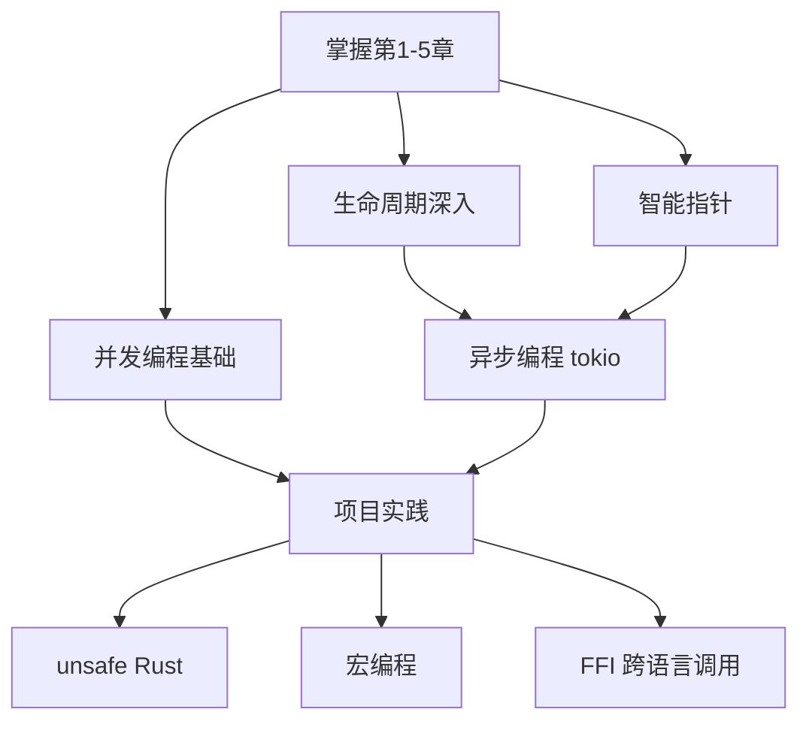

# 第 6 章：后续精进方向

> 学完前 5 章，你已经能写 Rust 实用程序了。这一章为你指明继续深入的方向，按"用得最多、回报最高"排序。

[[outline|← 返回目录]]

---

## 6.1 核心进阶

### 生命周期深入

- **多个生命周期参数**的交互
- **生命周期子类型**（subtyping）：`'a: 'b` 表示 `'a` 比 `'b` 存活得更久
- **生命周期省略规则**（lifetime elision rules）的完整理解

```rust
// 多个生命周期参数
fn longest_with_anouncement<'a, 'b>(x: &'a str, y: &'a str, ann: &'b str) -> &'a str
where
    'a: 'b,  // 'a 至少和 'b 存活一样久
{
    println!("Announcement! {}", ann);
    if x.len() > y.len() { x } else { y }
}

// 结构体中的生命周期
struct ImportantExcerpt<'a> {
    part: &'a str,  // 结构体持有引用时，必须标注生命周期
}

// 静态生命周期
let s: &'static str = "I live forever";  // 整个程序运行期间有效
```

### 智能指针

```rust
// Box<T> —— 最简单的智能指针，在堆上分配数据
// 适用场景：递归类型、在堆上存储大数据
enum List {
    Cons(i32, Box<List>),
    Nil,
}

// Rc<T> —— 引用计数（Reference Counted）
// 适用场景：多个所有者共享只读数据
// 类似 Python 引用计数 / JS 引用
use std::rc::Rc;
let a = Rc::new(String::from("hello"));
let b = Rc::clone(&a);  // 引用计数 +1
let c = Rc::clone(&a);  // 引用计数 +1
println!("count: {}", Rc::strong_count(&a)); // 3（初始 1 + 两次 clone）

// RefCell<T> —— 内部可变性
// 适用场景：需要在不可变引用下修改数据（运行时检查借用规则）
use std::cell::RefCell;
let data = RefCell::new(5);
*data.borrow_mut() += 1;
println!("{}", data.borrow()); // 6
// 注意：借用规则从编译期推迟到运行时，违反规则会 panic!
```

**智能指针对比**：

| 智能指针 | 所有权 | 可变性 | 检查时机 | 用途 |
|---------|--------|--------|---------|------|
| `Box<T>` | 单一 | 可变 | 编译期 | 堆分配、递归类型 |
| `Rc<T>` | 共享 | 不可变 | 编译期 | 多所有者只读 |
| `RefCell<T>` | 单一 | 可变或不可变 | 运行时 | 内部可变性 |
| `Rc<RefCell<T>>` | 共享 | 可变 | 运行时 | 多所有者可读写 |

### `Send` / `Sync` trait

- **`Send`**：类型可以安全地在线程间转移所有权
- **`Sync`**：类型可以安全地在线程间共享引用（`&T` 是 `Send`）
- 绝大多数类型自动实现了 `Send` 和 `Sync`
- 裸指针 `*const T` / `*mut T`、`Rc<T>` 没有实现

### `Drop` trait

```rust
// Drop —— 析构函数，值离开作用域时自动调用
// 对比 Java AutoCloseable / Python __exit__ / JS 无原生等价物
struct CustomSmartPointer {
    data: String,
}

impl Drop for CustomSmartPointer {
    fn drop(&mut self) {
        println!("Dropping CustomSmartPointer with data: {}", self.data);
    }
}

let c = CustomSmartPointer { data: String::from("hello") };
// 离开作用域时自动调用 drop
```

## 6.2 并发编程

```rust
// 1. 线程创建
use std::thread;
use std::time::Duration;

let handle = thread::spawn(|| {
    for i in 1..10 {
        println!("子线程: {}", i);
        thread::sleep(Duration::from_millis(1));
    }
});

handle.join().unwrap();  // 等待线程结束

// 2. mpsc 通道（Channel）—— 类似 Go channel / JS Worker 消息
use std::sync::mpsc;

let (tx, rx) = mpsc::channel();
thread::spawn(move || {
    tx.send(String::from("hello")).unwrap();
});

let received = rx.recv().unwrap();  // 阻塞接收
println!("收到: {}", received);

// 3. Mutex / Arc —— 共享状态
use std::sync::{Arc, Mutex};

let counter = Arc::new(Mutex::new(0));
let mut handles = vec![];

for _ in 0..10 {
    let counter = Arc::clone(&counter);
    let handle = thread::spawn(move || {
        let mut num = counter.lock().unwrap();
        *num += 1;
    });
    handles.push(handle);
}

for handle in handles {
    handle.join().unwrap();
}
println!("结果: {}", *counter.lock().unwrap()); // 10
```

### 并发原语对比

| Rust | Java | Go | 说明 |
|------|------|-----|------|
| `thread::spawn` | `new Thread().start()` | `go func()` | 创建线程 |
| `mpsc::channel` | `BlockingQueue` | `chan` | 通道通信 |
| `Mutex<T>` | `synchronized` / `ReentrantLock` | `sync.Mutex` | 互斥锁 |
| `Arc<T>` | 自动 GC 管理 | 自动 GC 管理 | 原子引用计数 |
| `RwLock<T>` | `ReentrantReadWriteLock` | `sync.RWMutex` | 读写锁 |

### async/await 异步编程

Rust 的异步模型是**零成本异步**——不分配线程，也不使用运行时 GC。

```rust
// 使用 tokio 运行时
use tokio::time::{sleep, Duration};

#[tokio::main]
async fn main() {
    let result = async_function().await;
    println!("{}", result);
}

async fn async_function() -> String {
    sleep(Duration::from_millis(100)).await;
    String::from("Hello from async")
}

// 并发执行多个异步任务（需要在新文件中）
// 不能和上面的 main 放在同一个文件中，一个 binary crate 只能有一个 main 函数
// 下面的代码演示 tokio::join! 的用法
//
// #[tokio::main]
// async fn main() {
//     let (a, b) = tokio::join!(
//         async { /* 任务 A */ },
//         async { /* 任务 B */ },
//     );
// }
```

**对比 async 模型**：

| 概念 | Rust | JS | Python |
|------|------|-----|--------|
| 运行时 | tokio / async-std | 内置 event loop | asyncio |
| async 函数 | `async fn` | `async function` | `async def` |
| await | `.await` | `await` | `await` |
| 并发执行 | `tokio::join!` / `futures::join!` | `Promise.all` | `asyncio.gather` |
| 任务类型 | Future（惰性，需 poll） | Promise（创建即执行） | Coroutine（惰性） |

## 6.3 Cargo 生态

- **`crates.io`** —— 类似 npm registry / Maven Central / PyPI

### 常用 crate

| 分类 | crate | 用途 | 类似 |
|------|-------|------|------|
| 序列化 | `serde` / `serde_json` | JSON 序列化/反序列化 | JSON.stringify / JSON.parse |
| 异步 | `tokio` | 异步运行时 | Node.js event loop、asyncio |
| CLI | `clap` | 命令行参数解析 | commander/yargs、argparse |
| HTTP | `reqwest` | HTTP 客户端 | fetch/axios、requests |
| 日志 | `tracing` / `log` | 结构化日志 | log4j、winston |
| 日期 | `chrono` | 日期时间处理 | moment.js、Joda-Time |
| 错误处理 | `thiserror` / `anyhow` | 简化自定义错误 | 无直接等价物 |
| 数据库 | `sqlx` / `diesel` | 数据库访问 | JDBC / Prisma / SQLAlchemy |
| 测试 | `rstest` | 增强测试宏 | JUnit 参数化测试 / pytest |
| 配置 | `config` | 配置文件读取 | Spring 配置 / python-decouple |

### Cargo 高级功能

```toml
# 工作空间（Workspace）：多 crate 项目管理
[workspace]
members = [
    "crates/parser",
    "crates/analyzer",
    "crates/cli",
]
```

```rust
// build.rs 构建脚本 —— 编译时执行，类似 Makefile hook
fn main() {
    println!("cargo:rerun-if-changed=build.rs");
    // 可以编译 C 代码、生成代码等
}
```

## 6.4 测试

```rust
#[cfg(test)]
mod tests {
    use super::*;

    #[test]
    fn it_works() {
        let result = 2 + 2;
        assert_eq!(result, 4);
    }

    #[test]
    fn test_with_result() -> Result<(), String> {
        if 2 + 2 == 4 {
            Ok(())
        } else {
            Err(String::from("加法出错"))
        }
    }

    #[test]
    #[should_panic(expected = "something went wrong")]
    fn test_panic() {
        panic!("something went wrong");
    }

    // 使用 ? 运算符的测试 —— 适用于 Result 返回类型
    #[test]
    fn test_file_io() -> std::io::Result<()> {
        let content = std::fs::read_to_string("test.txt")?;
        assert!(content.contains("expected"));
        Ok(())
    }
}
```

- `cargo test` —— 类似 `npm test` / `mvn test` / `pytest`
- **文档测试（doc test）**：`///` 注释中的代码示例会自动作为测试运行
- 集成测试放在 `tests/` 目录下
- 使用 `#[ignore]` 标记需要忽略的测试

### 测试组织

```
my_project/
├── src/
│   └── lib.rs              # 库代码
├── tests/                   # 集成测试
│   ├── common/              # 测试辅助模块
│   │   └── mod.rs
│   ├── integration_test.rs  # 集成测试文件
│   └── api_test.rs
└── examples/                # 示例代码（也会编译检查，但不作为测试运行）
    └── basic_usage.rs
```

## 6.5 项目架构建议

```
my_project/
├── Cargo.toml           # 类似 package.json / pom.xml / setup.py
├── src/
│   ├── main.rs          # 入口（或 lib.rs 作为库入口）
│   ├── lib.rs           # 库 crate 根
│   ├── config.rs        # 模块 —— 类似 ES Module / Java package
│   ├── models/
│   │   ├── mod.rs
│   │   ├── user.rs
│   │   └── post.rs
│   └── utils/
│       ├── mod.rs
│       └── helpers.rs
├── tests/               # 集成测试
│   └── integration_test.rs
└── examples/            # 示例代码
    └── basic_usage.rs
```

### Rust 架构原则

1. **模块即文件**：每个 `.rs` 文件就是一个模块，`mod.rs` 是目录模块入口
2. **可见性控制**：默认私有，`pub` 公开，`pub(crate)` 仅 crate 内可见
3. **关注点分离**：按功能拆分模块，每个模块职责单一
4. **trait 优先**：用 trait 定义抽象，而非继承

---

## 推荐学习路径



---

## 练习

1. **智能指针选择**：描述以下场景分别应该用什么智能指针，并写一小段代码验证：(a) 在堆上存一个大数组；(b) 多个函数共享只读数据；(c) 需要一个在运行时才决定是否可变的封装值。

2. **多线程求和**：用 `thread::spawn` + `Arc<Mutex<i32>>` 创建 8 个线程，分别给一个共享计数器加 1（每个线程加 1000 次）。验证最终结果是否为 8000。然后用 `AtomicI32` 替代 `Mutex` 重写。

3. **async/await 实验**：用 `tokio` 写一个程序，并发发起 3 个 `sleep(Duration::from_secs(1))` 任务，用 `tokio::join!` 同时等待。验证总运行时间约 1 秒（而非 3 秒），证明并发执行。

---

## 面试回答模板

> **问：Box、Rc、RefCell 分别用在什么场景？**
>
> `Box<T>`——堆分配，单一所有权，编译期检查。场景：递归类型（如 `enum List { Cons(i32, Box<List>) }`）、在堆上存大数据。`Rc<T>`——引用计数，多所有者共享只读，编译期检查。场景：多个结构需要共享同一只读数据（如 DAG 图节点）。`RefCell<T>`——内部可变性，单一所有权，**运行时**检查借用规则。场景：需要在 `&self` 方法中修改内部数据（如缓存、懒初始化）。组合：`Rc<RefCell<T>>`——多所有者 + 可修改，运行时检查。场景：图结构中节点互相引用且需要修改。

> **问：Rc 和 Arc 有什么区别？什么时候用 Arc？**
>
> `Rc<T>` 是单线程引用计数，`Arc<T>` 是**原子**引用计数（Atomic Reference Counted）。区别：`Rc` 的计数操作不是原子性的，多线程并发修改计数会导致数据竞争，所以 `Rc` 不是 `Send`/`Sync`；`Arc` 用原子操作保证计数安全，可以跨线程共享。原则：单线程用 `Rc`（更快），多线程用 `Arc`（安全）。`Arc<Mutex<T>>` 是多线程共享可变数据的标准模式。

> **问：Send 和 Sync trait 是什么？为什么大多数类型自动实现？**
>
> `Send`——类型可以安全地在线程间**转移所有权**（move 到另一个线程）；`Sync`——类型可以安全地在线程间**共享引用**（`&T` 是 Send）。绝大多数类型自动实现，因为：只包含 Send/Sync 字段的结构体自动 Send/Sync；基本类型（i32、String 等）都是 Send/Sync。不自动实现的：裸指针 `*const T`/`*mut T`（无安全保证）、`Rc<T>`（非原子计数）、`RefCell<T>`（运行时检查不适合多线程）。手动实现 unsafe，需要你保证线程安全。

> **问：Rust 的 async/await 和 JS 的有什么区别？**
>
> 核心区别：(1) **Future 是惰性的**——创建 async 函数返回的 Future 不执行，必须 `.await` 才开始 poll；JS Promise 创建即执行；(2) **需要运行时**——Rust 没有内置异步运行时，需要 tokio/async-std 等第三方；JS 有内置 event loop；(3) **零成本**——Rust async 不分配线程、不依赖 GC，状态机在编译期生成；JS async 每个 Promise 是对象分配；(4) **并发执行**——`tokio::join!` 并发等待多个 Future；JS `Promise.all` 并发等待多个 Promise。追问：为什么 Rust Future 是惰性的？为了组合——可以先构建 Future 链再执行，避免不必要的计算。

> **问：Drop trait 是什么？和 Java 的 finalize/Python 的 __del__ 有什么区别？**
>
> Drop 是 Rust 的析构机制——值离开作用域时自动调用 `drop()` 方法，用于释放资源（文件句柄、网络连接等）。区别：(1) **确定性调用**——Drop 在作用域结束时**必定**调用，时机确定；Java finalize 由 GC 决定何时调用，可能永远不调用；(2) **无 GC 依赖**——Drop 不需要垃圾回收器，栈上值离开作用域就 drop；(3) **不能手动调用**——`std::mem::drop(x)` 只是让值提前离开作用域，不是调用 `x.drop()`。Python `__del__` 类似 finalize，时机不确定。

> **返回目录**：[[outline|← 回到 Rust 教程首页]]
