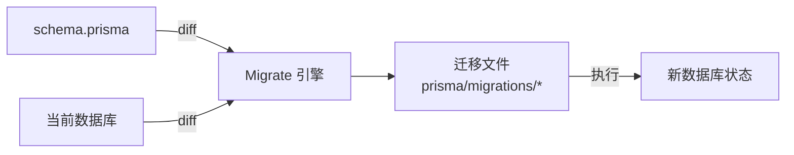

# 06 — 迁移管理：Migrations

> **本系列基于 Prisma ORM 7.x**（2026-08 编写）。

- **所属模块**：Prisma 学习大纲 · 应用层
- **预计时间**：45 min
- **面试可答**：Prisma Migrate 的本质是**"schema ↔ 数据库的 diff 工具"**：`migrate dev` 对比两边、生成迁移文件、执行并重置 as-needed；`migrate deploy` 只按顺序执行已有迁移（生产用）。两类数据库状态不一致（schema drift）要靠迁移文件与 `db pull` 复盘。

---

## 1. 一句话定位

迁移是把"改表结构"变成**可追踪、可回滚、团队一致**的过程。这篇掌握 4 个命令的使用边界 + 迁移文件机制 + drift 处理。

---

## 2. Migrate 是什么：diff 引擎

把你的 schema 和数据库当作两个状态源：



- 迁移文件是**人类可读的 SQL**，存放在 `prisma/migrations/`，按时间戳文件夹组织。
- 每次 `migrate dev` 只生成**这一次变更**的增量（`CREATE TABLE/Alter Table`…），累积起来就是**从空库到当前的完整剧本**。

> 💡 为什么不做"每次重建表"？因为生产库有数据、有约束，重建 = 丢数据。迁移文件的目的就是让生产库**平滑演进**，而不是推倒重来。

---

## 3. 四个命令的使用边界

| 命令 | 环境 | 行为 | 何时用 |
|------|------|------|--------|
| `migrate dev` | 开发 | diff → 生成迁移文件 → 执行；**可能重置数据**（v7 不再自动 `generate`/seed，需手动跑，见[官方文档](https://www.prisma.io/docs/cli/migrate/dev)） | 日常改 schema 后 |
| `migrate deploy` | 生产/CI | 只执行尚未应用的迁移文件，**不会 diff、不会重置** | 部署时 |
| `migrate reset` | 开发 | 全部回滚 + 重新应用 + 跑 seed | 数据乱了、确认可丢时 |
| `db push` | 开发（原型） | 直接按 schema `CREATE TABLE`（不生成迁移文件） | 想快速看效果、不想要历史 |

### migrate dev 的一次完整循环

```bash
# 1. 改 schema（比如给 Post 加 views Int @default(0)）
# 2. 生成 + 执行迁移（v7 不再自动 generate/seed，见官方 migrate dev 文档）
bunx prisma migrate dev --name add_views

# 3. 看到输出（v7 已无 "Generated Prisma Client" 一行）：
#   ✔ Generated migration 20260824_add_views
#   ✔ Applied migration 20260824_add_views

# 4. 手动补生成 Client（schema 变了，类型要重新生成才同步）
bunx prisma generate
```

> ⚠️ `migrate dev` 提示 reset 时（破坏性变更 / drift），**先看迁移文件再动手**。开发可以接受，但别在生产环境不小心跑 `dev`。

---

## 4. schema drift 与复盘

### drift 是什么

**数据库的实际情况 ≠ schema（迁移文件预期）**。来源多种：有人手改数据库、有分支合并冲突、有人跑了 `db push` 却不保存文件……

### 怎么发现

- `migrate dev` / `migrate deploy` 报 "database schema is not up to date"
- 想先比对，显式检查：

```bash
bunx prisma migrate status
# → Database schema is up to date!  或 → 差距明细
```

### 怎么复盘（要一条在意的路径）

```bash
# 场景：发现 dev 库被外部改了一列
# 1. 想让 schema 跟数据库看齐（数据库是真相）：
bunx prisma db pull        # 反向把库结构拉成 schema（会覆盖 schema.prisma！先备份）

# 2. 想让数据库跟 schema 看齐（schema 是真相）：
bunx prisma migrate dev    # 生成增量迁移把库补齐（有冲突会提示 reset）
```

> 💡 **一句话判断**：`db pull` 是"库 → 代码"，`migrate dev` 是"代码 → 库"。谁是对的，取决于"prod 数据是否也不能动 + 你是否信任这套迁移历史"。

### 预防 drift 的日常纪律

1. **改表只走 schema + migrate**，永不手动 DDL（开发库也一样）。
2. 分支合并且冲突时，跑 `migrate resolve` 明确"已应用/回滚"哪一边。
3. 副本：`shadow database` 让 `migrate dev` 能在影子库试跑迁移，避免污染真库——这是 migrate 引擎在背后替你做的事（`unapply` 流程）。
4. CI 里跑 `migrate deploy` + `migrate status`，让"未应用的迁移"变成部署失败而不是运行时炸。

---

## 5. migrate dev 的 shadow database 机制（理解即可）

`migrate dev` 要判断"这次改动有没有破坏性"，但它不想动你的真实数据，于是：

1. 起一个**影子库**（POSTGRES 上可配 `shadowDatabaseUrl`；Prisma Postgres/Docker 都支持）
2. 在影子库上重放全部历史迁移 → 得到"应该长这样"
3. 用新 schema 跟它 diff → 得到增量 → 生成迁移文件
4. 分两步应用到真实库（先 `--create-only` 看 SQL，再执行）

> ⚠️ 影子库没配好是"migrate 慢 / 卡 shadow database"报错的常见原因。本地用 Docker 起一个 `:5433` 端口给影子库是常见解法。

---

## 6. 练习（要求 + 提示 + 预期效果）

**要求**：① 制造一次 drift：建表后手动 `ALTER TABLE` 加一列（`docker exec psql` 或管理员库）；② 跑 `migrate status` 观察报出 drift；③ 分别用 `db pull` 和 `migrate dev` 各复盘一次，观察迁移文件/SQL 内容；④ 留下 `migrate resolve` 的用法笔记。

**提示**：先备份 `schema.prisma`；`db pull` 会覆盖 schema；复盘方向错了就用 git 恢复。

**预期效果**：你能不看文档说清"代码↔库谁是真源、怎么选择复盘方向"，并会讲 shadow database 的试跑逻辑。

---

## 7. 面试问答

> **问：migrate dev 和 db push 到底差在哪？**

**答：** `dev` 产生**迁移文件**（历史、可回滚、团队协作复用），代价是要"diff + 可能重置"；`db push` 直接按 schema 重建/改库，**不留迁移记录**，适合快速原型，但上生产前必须收敛为可复现的迁移（否则别人/ CI 拉不到变更历史）。

> **追问：那 `db push` 用在哪不坑？**

**答：** 只用在"数据无所谓、毁掉没关系"的原型/演示/本地冒烟。只要在意生产一致性，一律走 `migrate dev → deploy`。面试标准答案：`db push` 是"轻量但无历史"，正式路径要历史。

> **问：drift 是什么？drift 了怎么办？**

**答：** drift = 数据库实际状态与 schema/迁移历史的预期不一致。处理三步：① `migrate status` 定位差异；② 判断谁是真相（数据不能丢 → 保住库、用 `db pull` 重置 schema；schema 是权威 → `migrate dev` 补齐库）；③ 修复后回归正常路径并杜绝再次手动改库。关键是**别在生产库上手改结构**。

> **追问：影子库（shadow database）为什么必须存在？**

**答：** 因为 `migrate dev` 要在"不碰真实数据"的前提下试跑全部历史迁移来判断破坏性变更。没有影子库，它就只能猜（或反复 reset 你的开发库）。配置 `shadowDatabaseUrl`（PostgreSQL）让试跑发生在专门的库上，是让 migrate 又快又稳的手段。

---

## 8. 三角对比

| 维度 | **Prisma Migrate** | TypeORM migrations | 手写 SQL 脚本 |
|------|--------------------|--------------------|---------------|
| diff | 自动（schema vs 库） | 需手写 up/down | 无（纯手工） |
| 历史 | 文件夹 + 时间戳 | 表记录 | git 里人工 |
| 回滚 | 有限（revert） | up/down 成对 | 手写 backward.sql |
| 生产执行 | `migrate deploy` | `migration:run` | 手动分流 |
| 抗 drift | migrate status 检测 | 手动 | 无 |

下一篇 [07-事务与错误处理](07-事务与错误处理.md)：把"多条写入要么全成要么全败"讲透。