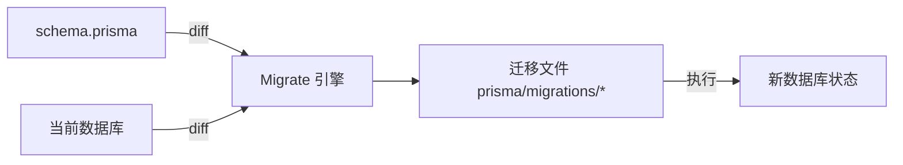

# 05 — 迁移与事务

> **本系列基于 Prisma ORM 7.x**（2026-08 编写）。合并原「Migrations」与「事务与错误处理」两篇。

- **预计时间**：60 min ｜ **前置**：04

**一句话定位**：两件「保一致性」的事——改表变成可追踪可回滚的迁移工作流；多步写入用事务保证原子性。

**面试可答**：Migrate 本质是「schema ↔ 数据库的 diff 工具」，`migrate dev` 边想边写、`migrate deploy` 照单执行；事务分交互式（回调、可带逻辑）与批量（数组）；错误按结构化错误码处理（P2002/P2025/P2003），不匹配 message。

---

## 1. 迁移：diff 引擎



迁移文件是人类可读的 SQL，按时间戳累积成「从空库到当前的完整剧本」——生产库有数据，不能推倒重来，只能平滑演进。

### 四个命令的使用边界

| 命令 | 环境 | 行为 |
|------|------|------|
| `migrate dev` | 开发 | diff → 生成迁移 → 执行；**可能提示重置**；v7 起不自动 generate（手动 `prisma generate`） |
| `migrate deploy` | 生产/CI | 只执行未应用的迁移文件，**不 diff、不重置** |
| `migrate reset` | 开发 | 全部回滚 + 重新迁移 + seed，数据可丢时用 |
| `db push` | 原型 | 直接按 schema 改库，**不留迁移记录** |

> ⚠️ `db push` 只用于「数据无所谓」的原型/演示；只要在意生产一致性，一律 `migrate dev → deploy`。`migrate dev` 提示 reset 时先看迁移文件再动手。

## 2. schema drift 与复盘

**drift = 数据库实际状态 ≠ schema/迁移历史预期**（手动改库、分支合并、有人跑过 `db push`）。

```bash
bunx prisma migrate status   # 定位差异

# 复盘二选一——谁是真相？
bunx prisma db pull          # 库 → 代码：数据库是真相（会覆盖 schema.prisma，先备份）
bunx prisma migrate dev      # 代码 → 库：schema 是真相（生成增量补齐库）
```

**预防纪律**：改表只走 schema + migrate（开发库也一样）；CI 里跑 `migrate status` + `deploy`，让「库没跟上」变成部署失败而不是运行时炸。`migrate dev` 背后用 **shadow database** 试跑迁移判断破坏性——它是自动机制，配好 `shadowDatabaseUrl` 可避免 migrate 慢/卡。

## 3. 事务：两种写法

```ts
// 交互式事务：能放任意逻辑，回调里必须用 tx
await prisma.$transaction(async (tx) => {
  const a = await tx.account.update({ where: { id: from }, data: { balance: { decrement: 100 } } })
  if (a.balance < 0) throw new Error("余额不足")   // 抛错 → 整体回滚
  await tx.account.update({ where: { id: to }, data: { balance: { increment: 100 } } })
})

// 批量事务：固定一组操作，按序执行，任一失败全回滚
await prisma.$transaction([
  prisma.user.create({ data: { email: "a@x.com" } }),
  prisma.user.create({ data: { email: "b@x.com" } }),
])
```

- 数组式适合「不依赖中间结果」的批量操作；回调式适合带判断/计算的流程（验余额、验库存）
- 回调里所有操作必须挂 **`tx`** 而不是外层 `prisma`，否则不参与事务
- **嵌套事务**（Prisma 7.5+）：内层落入 savepoint，可局部回滚后外层继续；7.5 之前整体回滚（[changelog 2026-03-11](https://www.prisma.io/changelog/2026-03-11)）
- 隔离级别透传数据库默认（PG 是 READ COMMITTED），必要时传 `{ isolationLevel }`

## 4. 错误处理：按错误码分支

```ts
import { Prisma } from "./generated/prisma/client"

try {
  await prisma.user.create({ data: { email: "dup@x.com" } })
} catch (e) {
  if (e instanceof Prisma.PrismaClientKnownRequestError) {
    switch (e.code) {
      case "P2002": return { code: 409, msg: "email already taken" }  // 唯一冲突
      case "P2025": return { code: 404, msg: "not found" }            // 记录不存在
      case "P2003": return { code: 400, msg: "fk violation" }         // 外键失败
    }
  }
  console.error(e)
  return { code: 500, msg: "internal error" }
}
```

| code | 含义 | 业务映射 |
|------|------|---------|
| `P2002` | 唯一约束冲突 | 409 |
| `P2025` | 记录不存在（where 没命中） | 404 |
| `P2003` | 外键约束失败 | 400 |
| `P2014` | 关系约束违反（如 1-1 已被占） | 409 |

> ⚠️ **高频坑**：`update/delete` 找不到行抛 `P2025`；但 `updateMany/deleteMany` **不抛错**（返回 `count: 0`）。判断「必须存在」用单对象 + catch；判断「影响了多少」用批量 + 读 count。

错误码是稳定契约（`P2002` 永远是唯一冲突），message 是给人看的文案会随版本变——用 `instanceof` + code 分支，别 `e.message.includes(...)`。

---

## 5. ✍️ 练习

**要求**：① 改表后手动 `ALTER TABLE` 制造一次 drift，用 `migrate status` 定位，分别用 `db pull` 和 `migrate dev` 各复盘一次；② 用交互式事务实现「签到奖励」（`weeklyStreak` 加 1 + 插一条 `StreakLog`，`@@unique([userId, week])`），第二次调用验证抛 `P2002` 且 streak 没变。**提示**：`db pull` 会覆盖 schema 先备份。**预期效果**：不看文档能说清「库和代码谁是真源怎么选」；错误处理用结构化 catch。

---

## 6. 💬 面试问答（本系列 4 组之三）

> **问：migrate dev 和 db push 差在哪？drift 了怎么办？**

**答**：`dev` 产生迁移文件（有历史、可协作、CI 可复现），`db push` 直接改库不留记录（只配原型）。drift 三步：`migrate status` 定位 → 判断真相（数据不能丢则 `db pull` 让 schema 向库看齐；schema 权威则 `migrate dev` 补库）→ 修复后杜绝手动改库。生产迁移只允许 `migrate deploy`（不 diff、不重置、幂等可回放）。

---

## 7. 🔗 参考资料

- Migrate 概览：https://www.prisma.io/docs/orm/prisma-migrate
- 错误码参考：https://www.prisma.io/docs/orm/reference/error-reference

---

## 📌 小结

- 四命令：dev（开发）/ deploy（生产）/ reset（重置）/ db push（原型）
- drift 复盘先定「谁是真相」：`db pull` 库→代码，`migrate dev` 代码→库
- 事务回调用 `tx`；错误处理认 code 不认 message；`updateMany` 不抛 P2025
