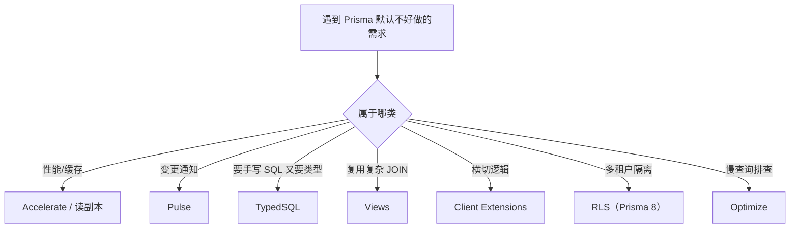

# 07 — 速查：生产要点与高级特性引子

> **本系列基于 Prisma ORM 7.x**（2026-08 编写）。合并原「Studio 与种子」「调试性能与生产部署」「生态速查」三篇——本篇性质是**随用随查的索引页**，不进主线学习。

**一句话定位**：写码时遇到「造数据、查慢查询、配连接池、上生产、高级需求」五类场景，来这里按图索骥；高级特性只留引子 + 官方链接，不背 API。

---

## 1. Studio 与 Seed（开发效率）

```bash
bunx prisma studio      # 可视化查看/编辑数据：localhost:5555
bunx prisma db seed     # 跑种子脚本（需先在 prisma.config.ts 注册）
```

- Studio = 开发期的数据检查器（比 psql 适合人眼），**不是管理后台**——生产数据改动走受控变更，不走 Studio
- seed 的意义：`migrate reset` 后一键恢复可开发状态

```ts
// prisma/seed.ts —— 幂等（先清后建），多次执行结果一致
import { PrismaPg } from "@prisma/adapter-pg"
import { PrismaClient } from "../src/generated/prisma/client"

const adapter = new PrismaPg({ connectionString: process.env.DATABASE_URL! })
const prisma = new PrismaClient({ adapter })

async function main() {
  await prisma.post.deleteMany()   // 先删子表再删父表
  await prisma.user.deleteMany()
  const alice = await prisma.user.create({ data: { email: "alice@example.com", name: "Alice" } })
  await prisma.post.create({ data: { title: "Prisma 入门", authorId: alice.id } })
  console.log("seed done")
}
main().finally(async () => { await prisma.$disconnect() })
```

```ts
// prisma.config.ts —— v7 的 seed 注册位置（v6 在 package.json 的 prisma key）
export default defineConfig({
  // ...
  migrations: { path: "prisma/migrations", seed: "bunx tsx prisma/seed.ts" },
})
```

纪律：seed 只跑 dev/staging，**绝不指向生产库**（`deleteMany` 会清真实数据）；只造「能跑起来的量」，贴近真实形状即可。

## 2. 看 SQL：一切性能讨论的前提

```ts
const prisma = new PrismaClient({ adapter, log: ["query", "warn", "error"] })
```

- **数 SQL 条数**是查 N+1 的第一招：一次「列表 + 关联」请求打出几十条 SELECT，多半是循环里逐条查询
- 修法：循环查询改 `include`/关系投影 `select` + `_count`（04 篇）；深分页改 cursor
- 终极手段：把日志里的 SQL 拿去 psql `EXPLAIN ANALYZE`，看 Seq Scan 还是 Index Scan（对齐 database 课程 05 章）
- 复合索引 `@@index([authorId, createdAt])` 对齐「某人最近文章」这类查询；**建索引是对查询的响应，不是无脑堆**

## 3. 连接池：Prisma 7 的新重点

v7 客户端是纯 TS + Driver Adapter，**连接池归底层驱动管**，与 v6 差异显著：

| 项 | v6（内置池） | v7（pg 驱动） |
|----|-------------|--------------|
| 连接超时 | 默认 5s | **默认 0（永不超时）→ 易卡死** |
| 池上限 | Prisma 默认公式 | pg 驱动默认（通常 10） |

```ts
// 显式配池，别吃默认
import { Pool } from "pg"

const pool = new Pool({ connectionString: DATABASE_URL, max: 20, connectionTimeoutMillis: 5000 })
const adapter = new PrismaPg(pool)
export const prisma = new PrismaClient({ adapter })
```

## 4. 生产迁移纪律

```bash
# CI/CD 的数据库步骤——绝不跑 migrate dev / reset
bunx prisma migrate deploy
```

- `deploy` 只按顺序执行未应用的迁移文件，幂等可回放；「库没跟上」暴露为部署失败而不是运行时炸
- 多实例部署：迁移在发布流程里**统一执行一次**（避免各 pod 竞态各跑一遍）
- 连接串走环境变量注入；高并发场景连接代理（PgBouncer / Prisma Accelerate）注意 session vs transaction 模式兼容

## 5. 生态与高级特性引子

> 引子的用途：一眼知道「Prisma 生态里有这玩意」，遇到问题能说出关键词再翻官方文档——**教程不背书版本细节**。

| 项 | 一句话定位 | 何时去看 | 状态 |
|----|-----------|---------|------|
| **Prisma Postgres** | 自家托管 PostgreSQL（池/分支/Studio） | 不想自建 PG | 托管服务 |
| **Accelerate** | 托管连接池 + 边缘缓存 | serverless / 跨区域延迟敏感 | GA |
| **Pulse** | 数据库变更事件流 | 实时通知、事件驱动 | GA |
| **Optimize** | AI 慢查询分析与建议 | 有慢查询不知从哪下手 | GA |
| **Client Extensions（`$extends`）** | 横切逻辑（审计/软删除/打点）；`$use` 中间件已移除 | 最该先学的进阶项 | GA |
| **TypedSQL** | 手写 SQL 也带编译期类型 | CTE/窗口函数等复杂查询 | preview |
| **Views** | schema 声明 SQL 视图，可查询 | 报表、复用复杂 JOIN | preview |
| **Partial Indexes** | 部分索引（只给活跃行建） | 查询命中行子集小 | preview |
| **RLS** | 行级安全（多租户隔离） | 租户数据隔离 | Prisma 8（已 GA） |
| **MongoDB** | v7 不支持；**v8 已原生支持**（early access，MySQL/SQLite 在 v8 尚未支持） | 项目确实用 Mongo | v7 缺失 / v8 支持 |

三条常用度最高的引子：

1. **`$extends`**（进阶但常用）：给 Client 加查询钩子/模型方法

```ts
const prisma = new PrismaClient({ adapter }).$extends({
  query: {
    $allModels: {
      async create({ model, args, query }) {
        const t0 = Date.now()
        const res = await query(args)   // 调用原逻辑（包住它 = 横切打点）
        console.log(`${model} create took ${Date.now() - t0}ms`)
        return res
      },
    },
  },
})
```

2. **TypedSQL**：`.sql` 文件经 `prisma generate` 编译检查后调用，类型安全的手写 SQL——「raw SQL 的生产力 + ORM 的安全感」
3. **Views**：schema 里 `view RecentPosts { ... @@sql(...) }`，之后 `prisma.recentPosts.findMany()` 直接查——报表的「虚拟表」



---

## 6. 动手建议

给 06 篇的 API 做一次体检：开 query 日志造一次 N+1 再用 select 修掉；EXPLAIN 验证一条组合查询走了索引；把 seed 跑两遍验证幂等；写一版 `migrate deploy` 的 CI 步骤。扩展：用 `$extends` 给 Post 加软删除钩子。

---

## 7. 🔗 参考资料

- 官方文档：https://www.prisma.io/docs/orm.md ｜ Changelog：https://www.prisma.io/changelog.md
- Seeding：https://www.prisma.io/docs/orm/prisma-migrate/workflows/seeding
- Connection Pool（driver adapters）：https://www.prisma.io/docs/orm/prisma-client/setup-database-connections
- Client Extensions：https://www.prisma.io/docs/orm/prisma-client/client-extensions

---

## 📌 系列结束语

7 篇主线到此走完：**上手 → 建模 → 关系 → 查询 → 迁移与事务 → 实战**，本篇是随用随查的索引层。回头看 01 篇那句「Schema 单一数据源」——它贯穿建表、查询、迁移与扩展。剩下的交给真实项目验证，遇到问题回大纲定位该翻哪篇。
