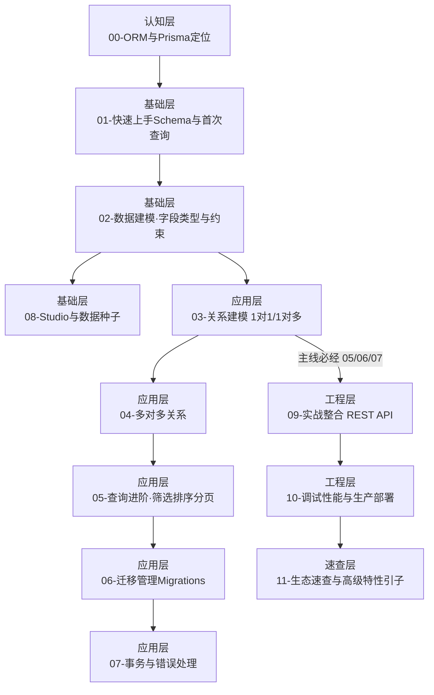

# 《Prisma ORM》学习大纲

> `src/server/db/` 系列教学大纲。定位：**偏实战、偏入门**，面向能立刻用它搭出一个带数据库的 TS 后端；高级特性只在一篇里给出引子，后续要用时再深挖。

---

## 1. 定位

| 项目 | 内容 |
|------|------|
| 目标读者 | 已掌握 JS/TS、Node/Bun 运行时的全栈工程师（按作者画像，无需基础科普） |
| 前置要求 | TypeScript 基础（类型、泛型）；SQL 基本概念（表/字段/主外键，可参考 `src/computer-science/database` 01-04）；能跑 Docker |
| 学习目标 | 会用 Prisma 完成「建模 → 迁移 → CRUD → 关系查询 → 事务」完整链路，并在 Bun 后端里搭一个可运行的 REST API |
| 面试目标 | 能解释 ORM 为什么类型安全、Prisma 架构演进、关系建模、迁移与 drift、N+1 与性能、与 Drizzle 的取舍 |

> **教程技术栈**（遵循 `agents.md` 规范）：Bun + TypeScript(strict) + oxlint/oxfmt；数据库用 **PostgreSQL 18**（docker-compose 一键起，与仓库 database 课程版本一致；SQLite 仅在 01 作零配置替代说明）。

### 版本基线

- **Prisma ORM 7.x**（当前 GA 稳定版，教程 2026-08 编写；Prisma 8 尚在 RC，未采用）
- Prisma 7 关键开启项：ESM（`type: module`）、`prisma-client` provider（需 `output`）、Driver Adapters（如 `@prisma/adapter-pg`）、`prisma.config.ts` 配置
- ⚠️ MongoDB 在 v7 暂不支持（需退回 v6），教程以 PostgreSQL 为主
- 📌 正文约定：各篇篇头统一标注「本系列基于 Prisma ORM 7.x」；01 篇须对照 v6 旧写法（`prisma-client-js`、生成到 node_modules、无 driver adapter）说明差异，避免读者照抄旧教程

---

## 2. 学习路径图



---

## 3. 篇目规划

| 序号 | 篇名 | 层 | 一句话定位 | 核心知识点 | 前置篇目 | 预计时间 |
|------|------|----|-----------|-----------|---------|---------|
| 00 | ORM与Prisma定位 | 认知层 | 为什么用 ORM、Prisma 是什么、和谁比 | ORM 解决什么（阻抗失配/N+1）；Prisma 三件套 Client/Migrate/Studio；Prisma 7 架构（Rust-free：Query Compiler 以 TS+WASM 运行、无 Rust 二进制引擎）；与 raw SQL / TypeORM / Drizzle 对比 | 无 | 30 min |
| 01 | 快速上手·Schema与首次查询 | 基础层 | 5 分钟跑通「建模→迁移→查一条数据」 | init；`schema.prisma`（datasource/generator/model）；scalar 类型；`migrate dev`；driver adapter + `PrismaClient`（Prisma 7 新写法，对照 v6 差异）；ESM 与 `config.ts` | 00 | 60 min |
| 02 | 数据建模·字段类型与约束 | 基础层 | 把表结构用 Schema 描述清楚 | 必填/可选/默认值；`@id @default @unique @updatedAt`；枚举；Json/scalar list；索引；命名规范 | 01 | 45 min |
| 03 | 关系建模·1对1与1对多 | 应用层 | 用外键把表串起来 | relation 字段、`@relation`、外键字段；1-N 与 1-1；级联删除策略与 `onDelete`；嵌套创建（`create` 内嵌关联） | 02 | 60 min |
| 04 | 多对多关系 | 应用层 | 处理 N-N 场景 | 隐式关联表 vs 显式关联表；自引用关系（如关注/好友）；联合唯一约束 | 03 | 45 min |
| 05 | 查询进阶·筛选排序分页 | 应用层 | 从「拿一条」到「复杂查询」 | where 操作符（and/or/not/contains/in）；orderBy；take/skip 与 cursor 分页；嵌套读取 `include` 与 `select/include` 取舍；聚合 `count/aggregate/groupBy`；`findFirst/findUnique` 语义 | 04 | 60 min |
| 06 | 迁移管理·Migrations | 应用层 | 让数据库变更可追踪可回滚 | `migrate dev/deploy/reset`；迁移文件机制；`db push` 适用场景；schema drift 与复盘、shadow database；`db pull` 反向 introspection | 05 | 45 min |
| 07 | 事务与错误处理 | 应用层 | 保证多步写入的一致性 | 顺序事务 vs 交互式事务；嵌套事务 savepoints（Prisma 7.5+）；错误码（P2002/P2025…）；与关系型事务理论衔接 | 05 | 45 min |
| 08 | Studio与数据种子 | 基础层 | 用可视化/脚本填充和查看数据 | Prisma Studio 查看编辑；seed 脚本与 `db seed`；`db push` 快速原型（生产迁移见 06） | 02（工具篇，仅依赖 02，可随用随读） | 30 min |
| 09 | 实战整合·REST API | 工程层 | 把前面所有知识点串成一个可跑的 API | 用 Bun+Fastify/Hono 搭 CRUD REST API；Repository/Service 分层；dto 校验；错误统一返回 | 03、05、07 | 90 min |
| 10 | 调试性能与生产部署 | 工程层 | 从能跑变成能上生产的正确姿势 | 查询日志与 Query Insights；N+1 排查与 `select` 精修；连接池与 driver adapter 默认差异；生产迁移流程（`migrate deploy`）；缓存/读副本概念 | 09 | 60 min |
| 11 | 生态速查与高级特性引子 | 速查层 | 记住「有哪些高级货、何时去查」，随用随查 | 一句话引子清单：Prisma Postgres、Accelerate（加速/缓存）、Pulse（事件流）、Optimize（查询性能）、Client extensions（`$extends`，v6.14.0 已移除旧 `$use` 中间件）、TypedSQL（preview）、views（preview）、partialIndexes（preview，初始版本以官方 Feature Status 为准）、RLS（Prisma 8）、MongoDB（需 v6）；每种标注 GA/preview 状态并附官方文档链接 | 10 | 30 min |

> 各篇内部统一含：一句话定位、头部「面试可答」摘要、核心知识点、**可运行代码示例**（依赖/声明齐全，非伪代码）、三级练习（要求+提示+预期效果）、面试问答（含追问：陷阱/对比/原理）、**文末三角对比**（Prisma + 1 同类方案 + raw SQL 基线）。

### 文档目录

```
src/server/db/
├── readme.md                 # 本文档（大纲/目录/导航）
└── doc/
    ├── 00-ORM与Prisma定位.md
    ├── 01-快速上手-Schema与首次查询.md
    ├── 02-数据建模-字段类型与约束.md
    ├── 03-关系建模-1对1与1对多.md
    ├── 04-多对多关系.md
    ├── 05-查询进阶-筛选排序分页.md
    ├── 06-迁移管理-Migrations.md
    ├── 07-事务与错误处理.md
    ├── 08-Studio与数据种子.md
    ├── 09-实战整合-REST-API.md
    ├── 10-调试性能与生产部署.md
    └── 11-生态速查与高级特性引子.md
```

---

## 4. 练习递进线

| 阶段 | 篇目 | 练习要点（难度递增） |
|------|------|--------------------|
| 基础操作 | 01 | 跑通首次 CRUD（建表、插一条、查回） |
| 基础操作 | 02 | 设计一张含约束/枚举/索引的表 |
| 组合应用 | 03、04 | 建 User/Post/Tag 关系图，做嵌套创建与联查 |
| 组合应用 | 05 | 实现关键词搜索 + 游标分页的列表接口 |
| 组合应用 | 06 | 改表结构制造一次 schema drift → 用 `migrate dev` 复盘迁移文件并修复 |
| 组合应用 | 07 | 转账/下单式多步写入，用事务保证一致 |
| 实战整合 | 09 | 完整 REST API：认证用户 + 文章增删改查 + 分页 + 关联标签 |
| 工程化 | 10 | 给 09 加慢查询日志、去 N+1、连接池调优、演示生产迁移 |

---

## 5. 面试覆盖图

| 高频面试点 | 覆盖篇目 |
|-----------|---------|
| ORM 与 raw SQL 取舍、阻抗失配 | 00、10 |
| 为什么 Prisma 类型安全 / Prisma 7 架构演进（Rust-free、driver adapter） | 00、01、10 |
| 关系建模：1-N / N-N / 自引用及映射 | 03、04 |
| Migration 工作流与 schema drift | 06 |
| 交互式事务、嵌套事务、常见错误码 | 07 |
| 性能：N+1、select vs include、游标分页、连接池 | 05、10 |
| Prisma vs Drizzle 选型 | 00、10 |
| 生产迁移与多环境部署 | 10 |

---

## 6. 自检清单

- [x] 每篇有一句话定位，篇目沿「认知→基础→应用→工程→速查」依赖链递进
- [x] 每篇规划练习（三级递进）与面试点，难度跨篇递增
- [x] 每篇规划文末三角对比（Prisma + 同类 + raw SQL）
- [x] 版本基线经官方 changelog/docs 核实（Prisma 7.x GA，未采用 RC 的 Prisma 8；MongoDB 需 v6 的注意事项已标注）
- [x] 各篇正文篇头统一标注「基于 Prisma ORM 7.x」，01 篇对照 v6 旧写法说明差异
- [x] 学习路径图为 Mermaid，遵循 `agents.md` 绘图规范
- [x] 篇目命名符合 `XX-模块名.md` 规范
- [x] 每篇在篇目表中给出预计学习时间（30~90 min 区间）
- [x] PostgreSQL 版本与 database 课程对齐（PG 18），并在版本基线标注
- [x] 高级特性收敛到单篇（11）作引子，标注 GA/preview 状态并含官方文档链接便于后续深挖