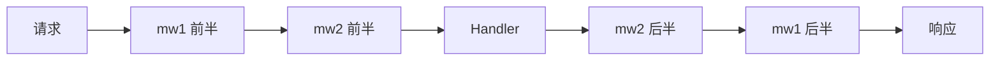

# 04 中间件机制

> 所属大纲：[readme.md](../readme.md) ｜ 预计：1.5 天 ｜ 前置：03

**一句话定位**：掌握 Hono 的核心扩展机制——洋葱模型 + 能在请求链中传值的中间件（认证/日志/Cookie 的地基）。

**面试可答**：中间件是 `(c, next) => Promise` 的函数，`app.use()` 注册，洋葱模型执行；`c.set/c.get` 在处理链中共享数据。

---

## 1. 洋葱模型



注册顺序即洋葱层级。`await next()` 之前的代码是「进」，之后的是「出」——所以一个中间件就能同时做前置（鉴权）与后置（计时）：

```ts
const timing = async (c, next) => {
  const start = performance.now()
  await next()
  c.header('X-Response-Time', `${Math.round(performance.now() - start)}ms`)
}

app.use(timing)
```

与 Express 线性模型的本质差异：Express 的中间件执行完就结束（要影响响应只能挂在 res 上回调），洋葱模型天然支持后置逻辑与统一错误捕获（06 篇）。

## 2. 注册方式与作用范围

```ts
app.use(mw)                   // 全局
app.use('/api/*', mw)         // 路径前缀
app.use('/api/*', mwA, mwB)   // 同一路径多个，按序执行
```

## 3. 自定义中间件：`hono/factory`

裸写 `(c, next) => ...` 会丢类型（Env 泛型、返回值）。用 `createMiddleware` 补全：

```ts
import { createMiddleware } from 'hono/factory'

const auth = createMiddleware(async (c, next) => {
  const token = c.req.header('Authorization')?.replace('Bearer ', '')
  if (!token) {
    return c.json({ code: 'UNAUTHORIZED', message: 'missing token' }, 401)
  }
  c.set('userId', parseToken(token))  // 传值给后续 handler（见第 5 节）
  await next()
})
```

> 💡 需要给中间件传配置时，用高阶函数包一层（`auth({ roles: ['admin'] })`），配合 `createFactory` 可保留完整类型。

## 4. 常用内置中间件

| 中间件 | 导入 | 用途 |
|--------|------|------|
| `logger` | `hono/logger` | 请求日志（dev 用） |
| `cors` | `hono/cors` | 跨域：`cors({ origin: 'https://x.com', allowHeaders: [...] })` |
| `jwt` | `hono/jwt` | JWT 校验（见下） |
| `bearerAuth` | `hono/bearer-auth` | 简单 Bearer Token（API Key 场景） |
| `secureHeaders` | `hono/secure-headers` | 安全响应头（XSS/CSP 等） |
| `bodyLimit` | `hono/body-limit` | 请求体上限：`bodyLimit({ maxSize: 1024 * 512 })` |

其余（`compress` / `etag` / `prettyJSON` 等）随查 [内置中间件文档](https://hono.dev/docs/middleware/) 即可，不占篇幅。

### 4.1 JWT 中间件：校验 + 签发配对

```ts
import { Hono } from 'hono'
import { jwt, sign } from 'hono/jwt'

const app = new Hono()

// 登录：签发
app.post('/login', async (c) => {
  const { username } = await c.req.json()
  const token = await sign({ sub: username, role: 'user', exp: Math.floor(Date.now() / 1000) + 3600 }, 'secret')
  return c.json({ token })
})

// 保护路由组：校验
const api = new Hono()
api.use('/private/*', jwt({ secret: 'secret' }))
api.get('/private/me', (c) => c.json(c.get('jwtPayload')))  // payload 自动注入
app.route('/', api)
```

> ⚠️ 生产环境 secret 从环境变量读取（07 篇 `c.env`）；Hono 4.13.x 已修复历史 JWT 时间字段校验缺陷，锁版本 ≥ 4.13。

## 5. Context 传值：`c.set` / `c.get` / `c.var`

中间件向 handler 传数据的标准姿势（认证 → 业务链路的桥）：

```ts
import { createMiddleware } from 'hono/factory'
import type { Hono } from 'hono'

type Env = { Variables: { userId: string } }

const auth = createMiddleware<Env>(async (c, next) => {
  c.set('userId', 'u_123')
  await next()
})

// handler 中：c.get('userId') 或 c.var.userId（属性式，更顺手）
app.get('/me', auth, (c) => c.json({ userId: c.var.userId }))
```

`Variables` 泛型让 `c.set/get/var` 全链路类型安全（05 篇展开 Env 体系）。

## 6. Cookie：`hono/cookie`

httpOnly Cookie 认证的基础（10 篇实战 B 的登录方案）：

```ts
import { getCookie, setCookie } from 'hono/cookie'

setCookie(c, 'session', token, {
  httpOnly: true,   // JS 不可读，防 XSS 窃取
  secure: true,     // 仅 HTTPS
  sameSite: 'Lax',  // 防 CSRF（宽松白名单跳转仍带）
  path: '/',
  maxAge: 3600,
})

const session = getCookie(c, 'session') // 读
```

| 选项 | 防什么 |
|------|--------|
| `httpOnly` | XSS 偷 token |
| `sameSite: 'Lax'/'Strict'` | CSRF 跨站携带 |
| `secure` | 明文传输截获 |

---

## 7. ✍️ 练习：耗时统计 + JWT 认证链

**要求**：① 全局耗时中间件，响应头 `X-Response-Time`；② `/login` 签发 JWT（payload 含 `userId`），`/api/me` 经 `jwt` 中间件保护，返回 `c.get('jwtPayload')` 中的 `userId`。

**提示**：签发用 `sign()`，校验交给 `jwt()` 中间件；payload 时间字段用秒级 Unix 时间戳。

**预期效果**：无 token 访问 `/api/me` 得 401；登录拿 token 后带 `Authorization: Bearer <token>` 访问返回 userId；任意响应头都带耗时。

---

## 8. 💬 面试问答

**Q1：洋葱模型与 Express 线性模型差在哪？**

Express 中间件线性执行、不天然感知「响应之后」；洋葱模型以 `next()` 为界分前后两半，后置逻辑（计时、改头、清理）与错误捕获都是一等能力，一个函数即可包裹整个请求生命周期。

（追问：`next()` 不 await 会怎样？——响应可能提前返回，中间件后半段变成 fire-and-forget；在 Serverless 环境里事件循环结束可能直接被杀，后半段丢失。）

**Q2：中间件里怎么改最终响应？**

两段式：前置改（`c.header/c.status` 在 `await next()` 前）影响工厂响应；后置改（`await next()` 之后）可读写 `c.res`——它此时已经是将要返回的 Response。返回手动 `new Response` 会绕过前者。

**Q3：JWT 中间件校验通过后，后续 handler 怎么拿到用户身份？**

`jwt()` 把解码后的 payload 写入 `c.get('jwtPayload')`；自定义认证则用 `c.set('userId', ...)` + `Variables` 类型显式声明。两种都是 Context 传值，区别只在「内置约定 vs 显式类型」。

---

## 9. 🔗 参考资料

- Middleware 指南：https://hono.dev/docs/guides/middleware
- factory（createMiddleware）：https://hono.dev/docs/api/factory
- Cookie：https://hono.dev/docs/helpers/cookie
- JWT：https://hono.dev/docs/middleware/builtin/jwt

---

## 📌 小结

- 洋葱模型 = `next()` 前后两段，是计时/鉴权/错误处理的地基
- 自定义中间件一律走 `createMiddleware` 补类型；传值用 `c.set/get` + `Variables`
- 内置中间件先记六个常用的，其余随查
- JWT 三件套：`sign` 签发、`jwt()` 校验、`jwtPayload` 取值；Cookie 认证记得 `httpOnly + sameSite + secure`
