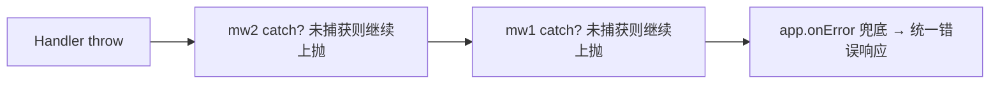

# 06 错误处理

> 所属大纲：[readme.md](../readme.md) ｜ 预计：0.5 天 ｜ 前置：05

**一句话定位**：让错误可控——统一格式、统一出口，业务代码只管 `throw`。

**面试可答**：`HTTPException` 抛标准 HTTP 异常，`app.onError` 全局兜底，`app.notFound` 处理 404；异常沿洋葱模型向外传播，最终由 onError 统一转换响应。

---

## 1. HTTPException：带状态码的异常

```ts
import { HTTPException } from 'hono/http-exception'

app.get('/users/:id', (c) => {
  const user = findUser(c.req.param('id'))
  if (!user) {
    throw new HTTPException(404, { message: 'user not found' })
  }
  return c.json(user)
})
```

比 `return c.json({ error }, 404)` 好在哪：**提前中断**——深埋在三层调用里的失败直接向上抛，不需要层层 return 判断，业务主链路保持干净。

## 2. 业务异常分层：继承 HTTPException

```ts
// lib/errors.ts
import { HTTPException } from 'hono/http-exception'

export class ValidationError extends HTTPException {
  constructor(details: unknown) {
    super(400, { message: '参数校验失败' })
    this.details = details
  }
  details: unknown
}

export class UnauthorizedError extends HTTPException {
  constructor(message = '未认证') {
    super(401, { message })
  }
}

export class ForbiddenError extends HTTPException {
  constructor(message = '无权限') {
    super(403, { message })
  }
}

export class NotFoundError extends HTTPException {
  constructor(resource: string) {
    super(404, { message: `${resource} not found` })
  }
}
```

业务代码全程 `throw new NotFoundError('Post')`，不再手写状态码。

## 3. app.onError：全局统一出口

```ts
// index.ts
import { Hono } from 'hono'
import { HTTPException } from 'hono/http-exception'
import { ValidationError } from './lib/errors'

const app = new Hono()

app.onError((err, c) => {
  if (err instanceof ValidationError) {
    return c.json({ code: 'VALIDATION_ERROR', message: err.message, details: err.details }, 400)
  }
  if (err instanceof HTTPException) {
    return c.json({ code: 'HTTP_ERROR', message: err.message }, err.status)
  }
  // 未知错误：记日志、藏细节
  console.error(err)
  return c.json({ code: 'INTERNAL_ERROR', message: 'internal server error' }, 500)
})

app.notFound((c) => c.json({ code: 'NOT_FOUND', message: `route not found: ${c.req.path}` }, 404))
```

两条纪律：

1. **onError 里按 `instanceof` 分层**：业务异常给精确信息；未知异常藏细节（内部堆栈、SQL 都不能漏出去），只留日志
2. **响应格式全局统一** `{ code, message, details? }`——这是 10 篇实战 B 直接复用的契约

## 4. 传播原理与两处兜底的分工



- 异常沿洋葱向外传播，任何一层都可以 `try/catch` 拦截后自行处理（如重试、降级）
- **不拦截就继续上抛**，最终落到 `app.onError`——所以 onError 是「最后一道防线」，不是唯一的错误处理点
- 局部特殊处理（如调用第三方 API 失败降级）用中间件/局部 try；全局格式转换交给 onError

> 💡 注意：如果某个中间件在 `await next()` 外层已经返回了响应（吞了异常），onError 拿不到它——自定义中间件捕获后应继续 `throw` 或自行返回规范错误。

---

## 5. ✍️ 练习：异常分层落地

**要求**：建 `lib/errors.ts` 四个业务异常类（400/401/403/404）；注册全局 `onError` 与 `notFound`；写一个 `/posts/:id` 接口，id 不存在时 `throw new NotFoundError('Post')`。

**提示**：onError 中 `instanceof` 判断顺序——子类（ValidationError）在前，父类（HTTPException）在后。

**预期效果**：`/posts/999` 返回 `{ code: 'HTTP_ERROR', message: 'Post not found' }` 404；`/nope` 返回 NOT_FOUND 格式；任意未捕获异常返回 INTERNAL_ERROR 且不泄露堆栈。

---

## 6. 💬 面试问答

**Q1：`throw HTTPException` 和 `return c.json(..., 400)` 怎么选？**

正常业务分支（预期内的空结果、表单回显）用 return；异常分支（调用链深处失败、中断后续逻辑）用 throw。判断标准是「失败是否需要打断主流程」——需要打断的都值得抛。

**Q2：异常是怎么穿过洋葱模型的？中间件里 throw 后会怎样？**

`next()` 内抛出的异常在中间件里表现为普通 rejection：不 catch 就继续向外传播，最后由 onError 兜底转响应。若中间件 catch 了却不重新抛出且不返回响应，请求会「消失」——这是自定义中间件最常见的 bug。

（追问：响应已经开始流式发送后抛错怎么办？——头已发出、状态码不可改，只能在流里写终止事件并关闭；这就是 03 篇 SSE 错误事件要在流内处理的原因。）

**Q3：全局 onError 里应该做什么、不该做什么？**

做：instanceof 分层转换、记结构化日志（request id + 堆栈）、返回统一格式。不做：向客户端泄露内部细节；在 onError 里再抛异常。

---

## 7. 🔗 参考资料

- Exception API：https://hono.dev/docs/api/exception
- Hono 4.13.x 安全修复清单：https://github.com/honojs/hono/releases

---

## 📌 小结

- 业务代码只 `throw`；状态码与格式转换是 errors.ts + onError 的事
- 异常沿洋葱向外传播，onError 是最后防线而非唯一出口
- 统一格式 `{ code, message, details? }` 从这篇定下来，实战 B 直接复用
