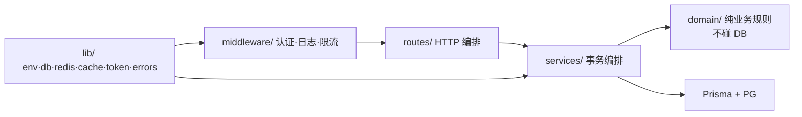
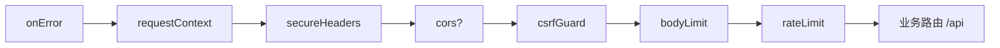

# 实战 B：企业级 REST API —— 项目搭建实录

> 配套：[PRD](../PRD.md) ｜ 任务分解 [TODO](../TODO.md) ｜ 教程 [10-实战B](../../doc/10-实战B-企业级REST-API.md)
>
> 本目录不是教程复述，而是**这个项目真实的搭建过程**：每一步做了什么、为什么这么决策、踩了什么坑。按 M0 → M9 顺序阅读，每篇对应一个可验证的里程碑。

## 项目一句话

博客域（用户 + 文章 + 评论）的 REST API：认证、RBAC、状态机、乐观锁、软删除、缓存、限流、优雅停机、OpenAPI 文档、隔离测试、Docker 部署——教程 §1~§8 的每一节都落成可运行代码。

## 技术栈

| 层面 | 选型 | 一句话理由 |
|------|------|-----------|
| 运行时 | Bun | 原生 TS、单二进制、内置 test runner |
| 框架 | Hono ≥4.13 | 轻量、Web 标准API、`@hono/zod-openapi` 三同源 |
| ORM | Prisma 7 + driver adapter | Rust-free、`prisma.config.ts` 新约定 |
| 数据库 | PostgreSQL 17 | 事务/隔离级别/部分索引能力 |
| 缓存/限流 | Redis 7 + ioredis | 集中式状态，多实例友好 |
| 校验 | Zod | env / 请求体 / OpenAPI 三处同源 |
| 风格 | oxlint + oxfmt | 提交前四件套（tsc/oxlint/oxfmt/test）全绿 |

## 架构总览

分层职责（PRD §2.1）——**routes 只做 HTTP 编排，业务规则在 domain（纯函数），碰 DB 的事务编排在 services**：



入口中间件组装顺序（教程 §7.5 模板，顺序即语义）：



## 快速起跑

```bash
bun install                                # 依赖（含 bun.lock 文本 lockfile）
# 先备好 .env（DATABASE_URL/JWT_SECRET≥32字节/REDIS_URL，缺项启动即崩——契约见 PRD §5）
docker run -d --name blog-pg -e POSTGRES_PASSWORD=postgres -e POSTGRES_DB=blog -p 5435:5432 postgres:17
docker run -d --name blog-redis -p 6379:6379 redis:7-alpine
bunx prisma migrate dev                    # 建表 + seed
bun run test:setup && bun test            # 57 个测试（独立测试库，不碰 dev 数据）
bun run dev                                # :3000
docker compose up --build                  # 或一键全栈（app+db+redis）
```

环境变量契约见 [PRD §5](../PRD.md)，缺项启动即崩并**点名缺哪项**（fail-fast）。

## 目录树

```
src/server/frame/hono/project/
├── src/
│   ├── index.ts            # 入口：中间件组装 + 优雅停机
│   ├── routes/             # HTTP 编排（auth / posts / comments）
│   ├── services/           # 碰 DB 的事务编排
│   ├── domain/             # 纯业务规则（状态机），不 import db/redis
│   ├── middleware/         # 认证 / 日志 / 限流 / CSRF
│   ├── lib/                # env·db·redis·cache·token·errors·response
│   ├── schemas/            # Zod Schema（校验与 OpenAPI 同源）
│   └── tests/              # 隔离测试（独立库 + 套件间 TRUNCATE）
├── prisma/                 # schema / migrations / seed
├── scripts/test-setup.ts   # 测试库初始化
├── Dockerfile / docker-compose.yml
└── PRD.md / TODO.md
```

## 与 Nest 的取舍（给熟 Nest 的读者）

| 维度 | 本项目（Hono 裸搭） | Nest |
|------|-------------------|------|
| 分层载体 | 目录约定 + PRD 强约束 | 装饰器 + DI 容器强制 |
| 依赖注入 | lib 单例直接导入，测试靠 env 切换 | 全局 DI，mock 面天然 |
| OpenAPI | `createRoute` 三同源（校验/类型/文档一体） | 需另接 @nestjs/swagger，双份维护 |
| 适用 | 中小 API、边缘部署、启动速度敏感 | 大团队、模块多、约定>配置 |

模块数上来、出现「测试要 mock 某个 lib 但 import 链太深」时，再把 lib factory 化注入不迟——不为小项目预付 DI 的复杂度。

## 篇目

| 篇 | 内容 | 特色踩坑 |
|----|------|---------|
| [M0](./M0-脚手架.md) | 脚手架与 fail-fast | Prisma 7 ESM 约束 |
| [M1](./M1-数据层.md) | Prisma 7 数据层 | prisma.config.ts + dotenv 的坑 |
| [M2](./M2-统一响应与错误.md) | 信封与错误分层 | ok() 重载保类型 |
| [M3](./M3-可观测与Redis.md) | 请求 ID + 结构化日志 | catch-rethrow 让 4xx 也可检索 |
| [M4](./M4-认证与RBAC.md) | 双 token + RBAC | 时序拉平防枚举；requireRole 建后删的决策 |
| [M5](./M5-文章CRUD与状态机.md) | 状态机 + 乐观锁 + OpenAPI | 0 行判定的幂等区分 |
| [M6](./M6-评论并发与Refresh吊销.md) | 评论事务 + 服务端吊销 | jti 防同秒碰撞；迁移后忘 generate |
| [M7](./M7-生产加固.md) | 缓存/限流/CSRF/停机 | hono csrf() 误杀 DELETE；exec 前置篇 |
| [M8](./M8-测试与验收.md) | 测试隔离 | 事务回滚为何不可用 |
| [M9](./M9-部署.md) | Docker + CI | sh 不转发 SIGTERM 的 8 组实验 |
