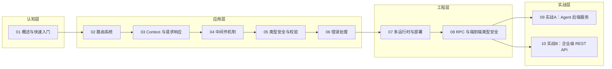

# Hono.js 学习大纲

本大纲面向「快速上手、理解理念、能做项目」的目标，把 Hono.js 学习拆解成 **10 篇**（8 篇教学 + 2 个实战项目），每天 1~2 小时，**约 12~14 天完成**。实战项目拆为两篇：**Agent 后端服务**（SSE 流式 + MCP 接入）与**企业级 REST API**（认证、权限、文档、测试），分别对应两套高频使用场景。

---

## 🎯 定位

| 项目 | 内容 |
|------|------|
| 目标读者 | 资深前端 / 全栈工程师（Bun 生态为主），无需框架基础科普 |
| 前置要求 | 熟悉 TypeScript ES6+；了解 HTTP 协议基础（方法、状态码、Headers）；有 Express/Koa 使用经验 |
| 学习目标 | 理解 Hono 设计理念；掌握路由、中间件、类型安全、错误处理；能独立完成 Agent 后端服务与企业级 API 两个项目 |
| 面试目标 | 能答 Hono vs Express/Koa/Elysia/tRPC 的差异、洋葱模型、RegExpRouter 快的原因、端到端类型安全原理 |
| 技术基线 | **Bun 优先**：`bun create hono` / `bun test` / oxlint / oxfmt（仓库 Demo 规范，见 agents.md §5.6） |

---

## 🗺️ 学习路径图



---

## 📋 篇目规划总览

| 序号 | 篇名 | 层 | 一句话定位 | 预计 |
|------|------|----|-----------|------|
| 01 | 概述与快速入门 | 认知层 | 这是什么、为什么选它、和谁比 | 0.5 天 |
| 02 | 路由系统 | 应用层 | URL → 处理函数的映射体系与快的根源 | 1 天 |
| 03 | Context 与请求响应 | 应用层 | 吃透 `c`：请求读取、响应构造、流式输出 | 1 天 |
| 04 | 中间件机制 | 应用层 | 洋葱模型 + 能在请求链中传值的中间件 | 1.5 天 |
| 05 | 类型安全与校验 | 应用层 | TypeScript 一等公民 + Zod 校验 | 1 天 |
| 06 | 错误处理 | 应用层 | 统一格式、统一出口，错误可控 | 0.5 天 |
| 07 | 多运行时与部署 | 工程层 | 同一份代码跑在不同运行时 | 1 天 |
| 08 | RPC 与端到端类型安全 | 工程层 | 服务端路由即客户端 SDK | 1 天 |
| 09 | 实战A：Agent 后端服务 | 实战层 | SSE 流式 + LLM 代理 + MCP 接入 | 2 天 |
| 10 | 实战B：企业级 REST API | 实战层 | 认证、权限、文档、测试、部署全套 | 2~3 天 |

---

## 📚 篇目详解

### 01 概述与快速入门（0.5 天｜认知层）

**面试可答**：Hono 是基于 Web Standards 的轻量级框架，零依赖，支持多运行时。

- Hono 是什么：日语「火焰」，轻量、快速的 Web 框架
- 核心特性：
  - Ultrafast：RegExpRouter 单次正则匹配，性能对标同类框架（数据引用官方 Benchmark）
  - Lightweight：`hono/tiny` 预设体积极小（具体数字成文时对照官方 README 并标注版本）
  - Multi-runtime：一套代码跑遍 Cloudflare Workers、Deno、Bun、Node.js
  - Web Standards：基于 Request/Response，不造轮子
- Bun 快速上手：`bun create hono@latest` → `bun run dev` 跑通 Hello World
- ⚖️ 对比板块：Hono vs Express（Node 生态基线）vs Elysia（Bun 同场竞品），Koa 一句带过
- 适用场景：Web API、边缘/CDN 应用、Serverless、代理服务、Agent 后端
- **练习**：Bun 脚手架创建项目，跑起 Hello World
- **参考**：[hono.dev/docs](https://hono.dev/docs/)、[GitHub Releases](https://github.com/honojs/hono/releases)

---

### 02 路由系统（1 天｜应用层）

**面试可答**：Hono 有 5 种路由器，RegExpRouter 最快（单次正则匹配），SmartRouter 默认自动选择最优。

- 路由 API 一笔带过：`app.get/post/put/delete`、`:id` 路由参数、`?query` 查询参数、`app.route()` 分组（不占篇幅）
- 路由器选型：精讲 **RegExpRouter**（单次正则匹配原理，面试高发追问）与 **SmartRouter**（默认自动选择）；TrieRouter 备选一句带过；LinearRouter / PatternRouter 了解即可
- **练习**：实现 RESTful 风格的 `/users/:id` 路由；用 `app.route()` 把它拆成模块化路由（users.ts / posts.ts——实战的组织手段）

---

### 03 Context 与请求响应（1 天｜应用层）

**面试可答**：`c.req` 读取请求数据，`c.json()`/`c.text()` 等构造响应，也支持直接返回原生 Response。

- Context API 速过（不占篇幅）：`c.req`（param/query/header/json/formData）读请求，`c.text()/c.json()/c.header()/c.redirect()` 构造响应——重点放在设计层面：基于原生 Request/Response 的薄封装
- 流式响应：`c.stream()` / `c.streamText()` / **`c.streamSSE()`**（token 级流式推送，Agent 场景刚需，本篇重点）
- **练习**：实现接收 JSON 并返回处理结果的 POST 接口 + 一个 SSE 实时推送接口

---

### 04 中间件机制（1.5 天｜应用层）

**面试可答**：中间件是 Hono 的核心扩展机制，`app.use()` 注册，洋葱模型执行；`c.set`/`c.get` 在处理链中共享数据。

- 洋葱模型：请求 → 中间件1 → 中间件2 → 路由处理 → 响应（原理 + 与 Express 线性模型对比，面试高发）
- 常用内置中间件：`logger`、`cors`、`jwt` / `bearerAuth`、`secureHeaders`、`bodyLimit`（其余如 `compress` / `etag` / `prettyJSON` 随查文档即可，不占篇幅）
- 自定义中间件与类型补全：

  ```ts
  import { createMiddleware } from 'hono/factory'

  const timing = createMiddleware(async (c, next) => {
    const start = Date.now()
    await next()
    c.header('X-Response-Time', `${Date.now() - start}ms`)
  })
  ```

- **Context 传值**：`c.set()` / `c.get()` / `c.var` + `Variables` 类型（认证中间件向路由传递 `userId` 的标准姿势）
- **Cookie**：`hono/cookie` 的 `getCookie` / `setCookie`（httpOnly Cookie 认证的基础，实战 B 铺垫）
- 中间件作用范围：`app.use('/api/*', middleware)`
- **练习**：实现请求耗时统计中间件 + JWT 认证中间件（验证通过后 `c.set('userId', ...)`）

---

### 05 类型安全与校验（1 天｜应用层）

**面试可答**：Hono 一等公民 TypeScript 支持，路径参数自动推导为字面量类型。

- 路径参数类型推导：`/posts/:id` 自动推导为 `{ id: string }`
- 类型化 Context：

  ```ts
  type Env = {
    Variables: { userId: string }
    Bindings: { DB: D1Database }
  }
  const app = new Hono<Env>()
  ```

- Validator：`@hono/zod-validator` + Zod，`c.req.valid('json')` 拿到完整类型的校验结果
- **练习**：用 Zod 校验用户输入，实现类型安全的 CRUD 接口

---

### 06 错误处理（0.5 天｜应用层，新增）

**面试可答**：`HTTPException` 抛标准 HTTP 异常，`app.onError` 全局兜底，`app.notFound` 处理 404。

- `HTTPException`：status / message / cause，自定义业务异常类继承它
- `app.onError()`：全局错误兜底，统一错误响应格式
- `app.notFound()`：404 兜底路由
- 洋葱模型中的错误传播：中间件 `try/catch` 与异常上抛（面试追问高发）
- 统一错误响应格式设计（`{ code, message, details }`，实战 B 直接复用）
- **练习**：实现全局错误处理 + 业务异常分层（参数错误 / 未认证 / 未授权 / 服务器错误）

---

### 07 多运行时与部署（1 天｜工程层）

**面试可答**：Hono 通过 Adapter 模式支持多平台，应用代码统一（fetch Handler），入口文件不同。

- 重点运行时（精讲）：**Bun / Cloudflare Workers / Node.js**（Deno 及 Lambda、Vercel、Fastly 等其余平台一行带过）
- 各运行时入口：
  - Bun：原生 `Bun.serve`，零适配
  - Node.js：**`@hono/node-server`（v2.x）** 的 `serve()` 入口
  - Workers：`wrangler deploy`
- `c.env` 与平台差异：Bindings（Workers）vs `process.env`（Node/Bun）
- 长连接场景（SSE / WebSocket）的运行时选择：Node/Bun 优于 Workers（连接时长与 CPU 限制）
- **练习**：同一个应用分别部署到 Bun 与 Cloudflare Workers

---

### 08 RPC 与端到端类型安全（1 天｜工程层）

**面试可答**：RPC 模式让客户端和服务端共享类型定义，`typeof routes` 导出 AppType，`hc` 客户端自动推导请求与响应类型。

- Hono Client `hc`：

  ```ts
  // 服务端
  const routes = app.get('/api/users', (c) => c.json(users))
  export type AppType = typeof routes

  // 客户端
  import { hc } from 'hono/client'
  const client = hc<AppType>('http://localhost:3000')
  const data = await client.api.users.$get().then((r) => r.json()) // 类型自动推导
  ```

- ⚖️ 对比板块：**Hono RPC vs tRPC**——同为端到端类型安全，Hono RPC 零代码生成、无独立 router 层、前后端同构优势
- RPC 错误处理：`hc` 客户端对 4xx/5xx **不抛异常**，需按 `res.ok` / `res.status` 判别 `ClientResponse` 联合类型后再取数据（实战必踩）
- JSX SSR 与 SSG：了解即可（你有 React 前端栈，服务端渲染不是 Hono 主战场）
- **练习**：实现前后端类型共享的 Todo 应用

---

### 09 实战A：Agent 后端服务（2 天｜实战层，新增）

**一句话定位**：面向 AI Agent 场景的后端——SSE 流式输出、LLM 代理、MCP 接入，对应 Agent 开发工程师的主战场。

**面试可答**：SSE 用 `c.streamSSE()` 实现 token 级流式推送；MCP 服务通过官方 TS SDK 的 Streamable HTTP transport 挂载到 Hono 路由。

**功能清单**：

- SSE 流式接口：`c.streamSSE()` 转发 LLM 流式输出（OpenAI / GLM 兼容 SDK 的 streaming 代理）
- MCP Server：`@modelcontextprotocol/sdk` Streamable HTTP transport 挂载到 Hono 路由，对外暴露 Tools
- A2A 接入：拓展了解（按官方 A2A SDK 现状成文时核实）
- 认证：API Key / Bearer Token 中间件
- 限流：Redis 计数自实现或社区中间件
- 会话上下文：Redis（生产）/ Map（演示）

**技术栈**：Bun + TypeScript strict + oxlint / oxfmt；部署选 Node / Bun（长连接友好）

**项目结构建议**：

```
/src
  index.ts            # 入口（Bun.serve）
  routes/
    chat.ts           # SSE 对话接口
    mcp.ts            # MCP Streamable HTTP 挂载
  middleware/
    api-key.ts        # API Key 认证
    rate-limit.ts     # 限流
  services/
    llm.ts            # LLM 流式代理
    session.ts        # 会话上下文
  types/
    index.ts
```

**练习**：完成 SSE chat 接口 + MCP 工具暴露，用 MCP Inspector 调试验证

---

### 10 实战B：企业级 REST API（2~3 天｜实战层）

**一句话定位**：补齐生产级后端全套工程能力——认证、权限、校验、文档、测试、数据库、部署。

**面试可答**：JWT + httpOnly Cookie 认证、RBAC 权限模型、`@hono/zod-openapi` 自动生成 OpenAPI 文档、`testClient` 做类型安全集成测试。

**功能清单**：

- 认证：`hono/jwt` 签发 JWT + httpOnly Cookie 传递（含刷新机制讨论）
- 权限：RBAC 中间件（角色 → 资源 → 操作）
- CRUD 接口：用户管理、文章管理，支持分页、过滤、排序
- 参数校验：Zod Schema 全量校验（05 篇落地）
- 统一响应与错误格式（04/06 篇落地）
- API 文档：`@hono/zod-openapi` 生成 OpenAPI Schema + Swagger UI / Scalar 展示
- 数据层：Prisma 7 + PostgreSQL（driver adapter；Drizzle 为备选，取舍见 10 篇）
- 单元/集成测试：`bun test` + `app.request()` / `testClient`（`hono/testing`）
- 生产加固：请求 ID + 结构化日志、env fail-fast、HTTP/Redis 双层缓存、Redis 限流、健康检查与优雅停机
- 部署：Docker（Bun 镜像）+ CI 流水线

**项目结构建议**：

```
/src
  index.ts            # 入口
  routes/
    auth.ts           # 认证路由
    users.ts          # 用户路由
    posts.ts          # 文章路由
  middleware/
    auth.ts           # JWT + RBAC 中间件
    logger.ts         # 日志中间件
  lib/
    db.ts             # Drizzle/Prisma 客户端
    response.ts       # 统一响应格式
    errors.ts         # 业务异常类
  schemas/            # Zod Schema
  types/
    index.ts
  tests/              # app.request 集成测试
```

**验收标准**：全部接口有测试覆盖，OpenAPI 文档可访问，错误格式全局统一，生产加固项（日志/限流/优雅停机）逐项可验证

---

## ✅ 练习递进线

| 阶段 | 篇目 | 练习特征 |
|------|------|----------|
| 基础操作 | 01~03 | 单 API 点操作：跑通项目 → 路由 → 请求/响应/SSE |
| 组合应用 | 04~08 | 多概念组合：中间件传值 + 认证、Zod 校验 + 类型、错误分层、跨运行时、前后端类型共享 |
| 实战整合 | 09~10 | 完整项目：Agent 后端（SSE/MCP）、企业级 API（认证/权限/文档/测试） |

---

## 🎯 面试覆盖图

| 高频面试点 | 覆盖篇目 |
|-----------|---------|
| Hono 为什么快（RegExpRouter 原理） | 01、02 |
| Hono vs Express / Koa / Elysia | 01 |
| Web Standards（Request/Response）意味着什么 | 01、03 |
| 洋葱模型、中间件执行顺序与错误传播 | 04、06 |
| 端到端类型安全：Hono RPC vs tRPC | 08 |
| 多运行时差异与 Adapter 模式 | 07 |
| Zod 校验与类型推导 | 05 |
| SSE / 流式响应 | 03、09 |
| JWT 认证与 Cookie 安全 | 04、10 |
| fetch-based 框架怎么测试 | 10 |

---

## 📌 版本与安全基线

- **Hono ≥ 4.13**：v4.12.x~v4.13.x 连续修复多个安全漏洞（含 JWT 中间件 `exp`/`nbf`/`iat` 校验缺陷、query parser、`hono/jsx` XSS 等），所有示例以 4.13.x 为基线
- **@hono/node-server ≥ 2.x**：Node.js 部署入口
- 包体积、性能等版本敏感数字，成文时以官方 README / 文档为准并标注出处与版本
- 成文约定：各篇在版本断言与关键 API 处附官方文档 / Release Notes 链接，便于核对与深挖

---

## 📖 学习资源

- 官方文档：https://hono.dev/docs/
- GitHub：https://github.com/honojs/hono（Releases 页关注安全修复）
- 示例代码：https://github.com/honojs/examples
- Node 适配器：https://github.com/honojs/node-server

---

## 📝 文档目录

| 序号 | 文件 | 内容 |
|------|------|------|
| 01 | 01-概述与快速入门.md | 理念、特性、对比（Express/Elysia）、Hello World |
| 02 | 02-路由系统.md | 5 种路由器、路由参数、路由分组 |
| 03 | 03-Context与请求响应.md | Context、参数获取、请求体解析、流式/SSE |
| 04 | 04-中间件机制.md | 洋葱模型、内置/自定义中间件、Context 传值、Cookie |
| 05 | 05-类型安全与校验.md | TypeScript、Env、Zod、zValidator |
| 06 | 06-错误处理.md | HTTPException、onError、统一错误格式 |
| 07 | 07-多运行时与部署.md | Bun/Workers/Node/Deno、Adapter、c.env |
| 08 | 08-RPC与端到端类型安全.md | Hono Client、对比 tRPC、JSX 简述 |
| 09 | 09-实战A-Agent后端服务.md | SSE 流式、LLM 代理、MCP 接入、限流 |
| 10 | 10-实战B-企业级REST-API.md | JWT/RBAC、OpenAPI、测试、数据库、Docker |
| 附 | 11-备查-中间件与平台速查.md | 链接索引（不计入学习篇数）：全部内置中间件、5 种路由器、各平台 Adapter 的官方文档锚点 |
