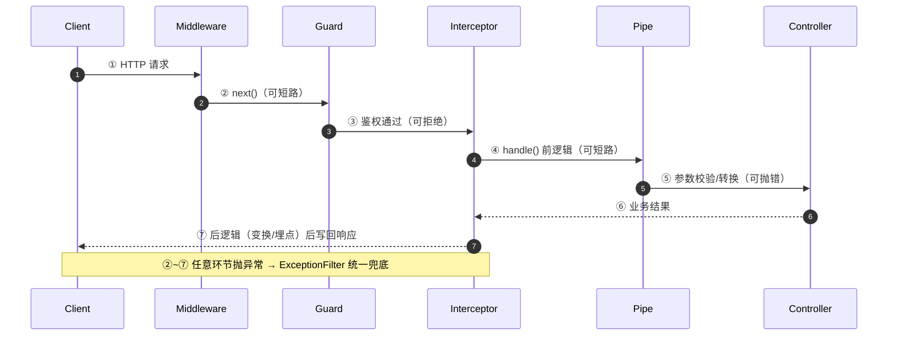

# 01 架构定位与全景

> 所属大纲：[readme.md](../readme.md) ｜ 预计：0.5 天 ｜ 前置：无

**一句话定位**：建立全景认知——Nest 解决什么问题、一个请求如何穿过框架管线、Nest 12 变了什么。本篇的「请求生命周期」是全大纲的主线，04/05 篇会反复回来收口。

**面试可答**：Nest 是架构框架（对标 Spring Boot / Angular），在 Express/Fastify 之上提供 DI、模块化与 AOP 管线；Hono 这类库解决 HTTP 层，Nest 解决架构层。一个请求依次穿过 Middleware → Guard → Interceptor(前) → Pipe → Controller → Interceptor(后)，任何环节抛出的异常最终由 ExceptionFilter 统一兜底。

---

## 1. 库 vs 框架：为什么企业级需要架构约束

Express/Hono 是**库**：你调用它——`app.get('/users', handler)` 由你发起，路由怎么组织、依赖怎么传递全凭自觉。Nest 是**框架**：它调用你——你把类标记成 `@Controller()` / `@Injectable()`，骨架交出去，框架在运行时实例化、组装并驱动。

控制反转在这里发生了两次：

| 层次 | 反转了什么 | 谁负责 |
|------|-----------|--------|
| HTTP 层 | 调用权：你写 handler，框架调它 | 所有框架都有 |
| 架构层 | 组装权：类的依赖由容器注入，模块边界由装饰器声明 | Nest / Spring / Angular |

第二次反转让「架构约束」从口号变成机制，带来三个企业级红利：

1. **结构即命名**：`Controller / Service / Module` 的命名就是架构分层，新人上手路径统一，代码评审有据可依
2. **依赖方向可治理**：模块间依赖必须显式 `imports`，循环依赖在启动期就会暴露（02 篇详述）
3. **横切关注点统一收口**：鉴权、校验、日志、错误格式各有专属挂点（本篇第 2 节的管线），不需要「自觉遵守的约定」

> 💡 代价同样明确：概念多、心智成本高、脚手架重。单人维护的轻量 API 用 Nest 是负资产——见第 5 节。

## 2. 请求生命周期全景图（面试高发，全大纲主线）



每一环的职责边界——**「谁能中断请求」是记忆这张表的钩子**：

| 环节 | 职责一句话 | 能否中断 | 典型用途 | 详见 |
|------|-----------|:---:|---------|------|
| Middleware | 进入路由前的通用预处理 | ✅ 不调 next | 日志、CORS、body 解析 | 04 |
| Guard | 认证 / 授权决策 | ✅ 抛 401/403 | JWT 校验、RolesGuard | 07 |
| Interceptor（前） | 包裹 handler 的 AOP | ✅ 不调 handle() | 缓存命中直接返回 | 05 |
| Pipe | 单个参数的校验与转换 | ✅ 抛 400 | Zod 校验、类型收窄 | 04 |
| Controller | 编排业务（只调 Service，别写业务） | — | 调 Service 返回结果 | 04 |
| Interceptor（后） | 响应变换、埋点 | — | `map` 包装、`timeout` | 05 |
| ExceptionFilter | 异常统一出口（终点） | — | 错误码格式化 | 05 |

> ⚠️ 两个高频混淆：**Guard vs Middleware**——Guard 拿得到执行上下文（知道下一个要执行哪个 handler），Middleware 只拿得到 Request/Response；**Pipe vs Interceptor**——Pipe 作用在单个参数上，Interceptor 包裹整个 handler。
>
> 全链路每一环都支持 DI（Guard/Filter 等通过 `APP_GUARD` 等 token 注册为全局 Provider，02 篇讲机制）。

## 3. Nest 12 亮点速览（2026-08-27 发布）

| 变化 | 一句话影响 |
|------|-----------|
| **ESM 化** | 所有官方包改为 ESM；存量 CJS 项目靠 `require(esm)` 兼容，不强制迁移 |
| **Standard Schema 一等公民** | `@Body({ schema })` 直接收 Zod schema，配 `StandardSchemaValidationPipe` 完成校验与类型收窄（04 篇主线） |
| **@nestjs/observe** | 官方托管可观测平台（SaaS，appKey 直传仪表盘）；自托管 / 本地 Grafana 走 OpenTelemetry SDK，两条独立路线（11 篇展开） |
| **CLI 重建** | Rspack 替代 webpack（monorepo 默认，`tsc` 仍是标准项目默认编译器）；`nest upgrade` 一键迁移；新 ESM 项目默认 Vitest + oxlint |
| **生命周期钩子顺序调整** | 钩子按组件层级调用——依赖同一 Provider 的初始化顺序可能变化（03 篇注意） |
| **machine-readable error codes** | `HttpExceptionOptions.errorCode`（05 篇落地） |

版本基线：运行时 **Node ≥ 20.19 / 22.12**（`require(esm)` 门槛）；注意 **CLI schematics 门槛更高**（`nest new` / `nest upgrade` 需 22.22.3+ / 24.15+ / 26+），低版本直接拒跑。完整基线见大纲「版本与安全基线」节。

## 4. ⚖️ 对比板块：Nest vs 同类

| 维度 | Nest | Express | Fastify | Hono | AdonisJS |
|------|------|---------|---------|------|----------|
| 定位 | 架构框架 | HTTP 库 | HTTP 库 | HTTP 库（多运行时） | 全功能 MVC 框架 |
| DI | 内置 IoC 容器 | 无 | 无 | 无 | 内置 IoC |
| 校验 / AOP 挂点 | 管线内置（Guard/Pipe/Interceptor/Filter） | 社区中间件拼装 | 插件拼装 | 中间件拼装 | 内置但自成体系 |
| TS 体验 | 一等（装饰器 + DI 类型推导） | 手动 | 手动 | 路由级端到端推导 | 一等 |
| 性能定位 | 管线开销 + 取决于 adapter | 基线 | 显著快于 Express | RegExpRouter 极快 | 中等 |
| 学习曲线 | 陡（概念多） | 平 | 平 | 平 | 中陡 |
| 适合规模 | 多团队、长周期、复杂域 | 存量 / 极简 | 追求 HTTP 性能的裸服务 | 边缘 / Agent / 轻量 API | 喜欢 Laravel 式全家桶 |

**选型结论**：

- 多团队协作、长周期演进、域复杂（认证授权 / 队列 / 事务 / 可观测都要）→ **Nest**
- Agent 后端、边缘部署、轻量 API、单体文件交付 → **Hono**（与本教程同题异构对照）
- 已有 Fastify 沉淀、只缺一层薄结构 → 直接用 Fastify 插件体系，不必上 Nest
- 喜欢 Ruby on Rails / Laravel 式「全家桶 + 约定优先」→ AdonisJS 可选，但 TS 生态与国内招聘面不如 Nest

## 5. 不适用场景

- 边缘部署 / Serverless 冷启动敏感：Nest 启动要装配整个 IoC 容器，Worker 环境是天然短板 → Hono
- 一次性服务、内部小工具：架构层投资回收不了 → Express/Hono 直写
- 极致吞吐的单一路由服务：管线反射与抽象有开销（实际瓶颈通常在 IO，但「不为用不到的架构付费」）

---

## 6. ✍️ 练习：起项目并观察架构

**要求**：

1. 安装 CLI 并创建 ESM 项目（CLI 装法与交互提示详见 00 篇；注意 CLI 的 Node 版本门槛）：

```bash
npm i -g @nestjs/cli@latest @nestjs/schematics@latest
nest new nest-playground
# 交互提示 CJS or ESM → 选 ESM
```

2. 换 Fastify adapter：

```bash
npm i @nestjs/platform-fastify
```

```ts
// main.ts
import { NestFactory } from '@nestjs/core'
import {
  FastifyAdapter,
  NestFastifyApplication,
} from '@nestjs/platform-fastify'
import { AppModule } from './app.module'

async function bootstrap() {
  const app = await NestFactory.create<NestFastifyApplication>(
    AppModule,
    new FastifyAdapter(),
  )
  await app.listen(3000)
}
bootstrap()
```

3. 打开生成的 `app.controller.ts` / `app.service.ts` / `app.module.ts`，口头回答：每个文件在架构里扮演什么角色？`AppService` 是怎么被注入进 `AppController` 的？

**预期效果**：`npm run start:dev` 后访问 `localhost:3000` 拿到 `Hello World!`；能说出「Controller 声明路由骨架、Service 是被容器组装的 Provider、Module 是装配清单」。

---

## 7. 💬 面试问答

**Q1：Nest 和 Express/Fastify 是什么关系？**

适配器模式：Nest 的 HTTP 层可插拔（`FastifyAdapter` / `ExpressAdapter`），Nest 本身不处理 HTTP，它在 adapter 之上提供 IoC 容器、模块系统与 AOP 管线。所以「Nest 慢」这类说法要拆开——HTTP 性能归 adapter，架构开销归容器装配（启动一次）。

**Q2：完整说出一个请求在 Nest 里的生命周期。**

Middleware → Guard → Interceptor(前) → Pipe → Controller → Interceptor(后) → 写回响应；任意环节抛异常由 ExceptionFilter 统一处理。要点是每一环「能不能中断请求」以及为什么（见第 2 节表格）——追问基本都落在 Guard vs Middleware、Pipe vs Interceptor 的职责边界上。

**Q3：什么规模才值得上 Nest？**

三个维度同时满足：多团队并行（需要模块边界与统一结构）、长周期演进（需要依赖治理与可测试性）、域复杂（认证/队列/事务/可观测需要统一挂点）。单人轻量 API 上 Nest，维护的是架构而非业务——负资产。

---

## 8. 🔗 参考资料

- 官方文档：https://docs.nestjs.com/
- v12 Migration Guide：https://docs.nestjs.com/migration-guide
- GitHub Releases：https://github.com/nestjs/nest/releases
- Trilon 官宣博客：https://trilon.io/blog/nestjs-12-is-now-available

---

## 📌 小结

- Nest 的本质：在 HTTP adapter 之上做**第二次控制反转**——组装权归容器，结构由装饰器声明
- 请求生命周期七环 + ExceptionFilter 兜底，记忆钩子是「每环能否中断请求」——全大纲主线
- Nest 12 = ESM + Standard Schema 一等公民 + CLI 重建（Rspack/Vitest/oxlint）+ @nestjs/observe
- 选型一句话：重架构 → Nest；轻 HTTP → Hono；两者在本教程里同题异构、互相照镜
