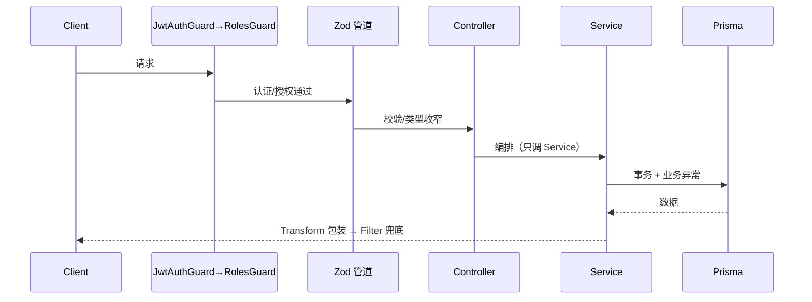

# Mini 文章 API — 需求文档

> 教学出处：[09-阶段实战-Mini文章API.md](../doc/09-阶段实战-Mini文章API.md)（融汇 04~08 篇的纵切练手项目）
> 性质：**练手项目**——照本文档与 [TODO.md](./TODO.md) 自己动手实现，代码不提供答案，验收清单说了算。

---

## 1. 项目定位与边界

模块化单体的最小纵切：注册登录 + 文章 CRUD + 横切三件套，全部走「真实挂点」而非硬编码。

**刻意不做**（对应教学篇目还没讲到，做了就失去递进意义）：

| 不做 | 原因 | 何时补 |
|------|------|--------|
| 队列 / 定时任务 | 10 篇内容 | 学完 10 篇回补欢迎邮件（Outbox） |
| 可观测（traces/健康检查/优雅关闭） | 11 篇内容 | 学完 11 篇回补 |
| 测试 / CI | 12 篇内容 | 学完 12 篇回补（本项目正好是现成素材） |
| 评论模块 / 文件上传 | 15 篇全量版内容 | 大实战再加 |

## 2. 技术栈

| 层面 | 选型 | 说明 |
|------|------|------|
| 运行时 | **Node 22 LTS** | 全程 Node（12 篇基线：测试与运行统一 Node） |
| 包管理 | **pnpm** | `pnpm dlx` 起 CLI，`pnpm add` 装依赖 |
| 框架 | NestJS 12（ESM 项目）+ Fastify adapter | `nest new` 选 ESM |
| 校验 | Zod + `StandardSchemaValidationPipe`（全局） | 04 篇主线 |
| ORM | Prisma 7 + **PostgreSQL** | v7 连接配置在 `prisma.config.ts`，client 走 driver adapter（`@prisma/adapter-pg`）；本地 docker 起 Postgres（见 M0） |
| 文档 | @nestjs/swagger | 13 篇先尝鲜，一行级配置即可 |
| 测试 | **暂无** | 12 篇后回补，见「刻意不做」 |

## 3. 功能需求

### FR-1 认证（07 篇）

- 注册：email 唯一，密码 bcrypt 哈希入库，**明文密码任何地方不落日志**
- 登录：签发 access（15m）+ refresh（30d）双 token；refresh `jti` 入会话表（family 聚合同一次登录链）
- 刷新：refresh 轮换——吊销旧 jti、签发新 jti；**重放检测**：已吊销/不存在的 jti 再次使用 → 吊销全家族 + 401 `TOKEN_REUSED`
- 登出：吊销当前 refresh（access 靠短有效期自然失效）
- 授权：`@Roles('admin')` + 全局 RolesGuard；**全局 Guard 顺序必须 Jwt → Roles**（07 篇陷阱二）

### FR-2 文章 CRUD + 分页（04 / 08 篇）

- 入参全部走 Zod schema（创建 / 更新 / 分页查询），`updateSchema` 用 `.partial()`
- 列表：cursor 分页，返回 `{ items, nextCursor }`；过滤条件至少含「按标题模糊」
- 软删除：删除置 `deletedAt`，列表与详情统一不可见
- 删除走事务：软删除 + 审计落表原子完成，文章不存在抛 `POST_NOT_FOUND`(404)

### FR-3 横切三件套（05 / 06 篇）

- 统一响应：`{ code, data, message }`（TransformInterceptor）
- 统一错误：`GlobalExceptionFilter`——业务异常透传 errorCode；无 errorCode 的 400 归为 `VALIDATION_ERROR`；未知异常脱敏为 `INTERNAL_ERROR`(500)，细节只进日志
- 审计：写操作（POST/PATCH/DELETE）Interceptor 自动记录「谁在何时对什么做了什么」；**排除 `/api/auth` 前缀**——register/login/refresh 虽是 POST 但属认证行为，无用户上下文，记进去全是噪音
- 耗时日志：Interceptor 计算请求耗时

### FR-4 文档（13 篇尝鲜）

- Swagger 挂在 `/docs`，`addBearerAuth` + 认证路由 `@ApiBearerAuth()`，能在 UI 里完成全流程调试

## 4. 非功能需求

- 启动期 env 校验：`DATABASE_URL` / `JWT_SECRET`(≥32 字符) 缺失**启动即拒**（06 篇）
- 全局路由前缀 `api`（`setGlobalPrefix`，暂不做版本化——13 篇正式内容）
- 代码风格：单引号无分号 2 空格（oxfmt，与仓库规范一致）；lint 用 oxlint

## 5. 数据模型（Prisma / PostgreSQL）

```prisma
enum Role {
  USER
  ADMIN
}

model User {
  id           String    @id @default(uuid())
  email        String    @unique
  passwordHash String
  role         Role      @default(USER)
  posts        Post[]
  sessions     Session[]
  createdAt    DateTime  @default(now())
}

model Session {
  id        String   @id @default(uuid()) // 即 refresh token 的 jti
  userId    String
  family    String                        // 同一次登录链；重放时整族吊销
  revoked   Boolean  @default(false)
  expiresAt DateTime
  createdAt DateTime @default(now())
  @@index([family, revoked])
}

model Post {
  id        String    @id @default(uuid())
  title     String
  content   String
  authorId  String
  author    User      @relation(fields: [authorId], references: [id])
  deletedAt DateTime?
  createdAt DateTime  @default(now())
  updatedAt DateTime  @updatedAt
  @@index([deletedAt, createdAt])
}

model AuditLog {
  id        String   @id @default(uuid())
  userId    String?
  action    String                          // 如 post.remove
  refId     String?
  path      String?
  createdAt DateTime @default(now())
}
```

## 6. API 清单

| 方法 | 路径 | 鉴权 | 说明 | 主要出处 |
|------|------|------|------|---------|
| POST | `/api/auth/register` | `@Public()` | 注册 | 07 |
| POST | `/api/auth/login` | `@Public()` | 登录 → 双 token | 07 |
| POST | `/api/auth/refresh` | `@Public()`* | 刷新（refresh token 本身是凭证）→ 轮换 + 重放检测 | 07 §3 |
| POST | `/api/auth/logout` | `@Public()`* | 登出 → 吊销当前 jti | 07 |
| GET | `/api/posts` | 登录用户 | cursor 分页 + 标题模糊过滤 | 04/08 |
| GET | `/api/posts/:id` | 登录用户 | 详情（软删除不可见） | 08 |
| POST | `/api/posts` | 登录用户 | 创建（Zod 校验） | 04 |
| PATCH | `/api/posts/:id` | 登录用户 | 更新（partial schema） | 04 |
| DELETE | `/api/posts/:id` | `@Roles('admin')` | 软删除 + 审计（事务） | 05/07/08 |
| GET | `/docs` | 无 | Swagger UI | 13 |

\* refresh/logout 走 `@Public()`（不要求 access token），但请求体必须带合法 refresh token。注意 logout 的口径与 doc/07 练习（带登录态、吊销全家族）**有意不同**：本项目凭 refresh token 登出、只吊销当前 jti——access 过期后也能登出，更贴近真实产品语义；对照学习时不要当成漏做。

## 7. 请求穿层（实现时对照自检）



每写完一个接口，对照上面说得出它穿了几层、每层干了什么。

## 8. 目录结构

```
/src
  main.ts                    # Fastify + 全局管道 + Swagger + setGlobalPrefix
  app.module.ts              # 装配清单（全局 Guard 顺序！）
  app.factory.ts             # 装配工厂（M5 收尾时抽出，12 篇 E2E 复用）
  common/
    decorators/public.decorator.ts
    decorators/roles.decorator.ts
    filters/global-exception.filter.ts
    interceptors/transform.interceptor.ts
    interceptors/audit.interceptor.ts
    interceptors/timing.interceptor.ts
  config/env.schema.ts       # Zod env 校验
  infra/prisma/prisma.service.ts
  modules/
    auth/                    # controller / service / jwt.strategy / guards / session repo
    post/                    # controller / service / repository / post.schema.ts
```

## 9. 验收清单（全部可演示才算过）

- [ ] 缺 `DATABASE_URL` 或 `JWT_SECRET` 启动即拒，报错指明缺什么（06）
- [ ] 非法 body → 400 且 `code === 'VALIDATION_ERROR'`（04/05）
- [ ] 重复 email 注册 → 409 `EMAIL_TAKEN`（07）
- [ ] 未登录访问 `/api/posts` → 401；普通用户 `DELETE /api/posts/:id` → 403（07）
- [ ] 同一 refresh token 第二次使用 → 401 `TOKEN_REUSED`，且该 family 其余 refresh 全部失效（07 §3）
- [ ] 登出后该 refresh 不可再用（07）
- [ ] **cursor 翻三页行数守恒**：造 25 条数据、每页 10 条，三页共取回 25 条且无重复（08 §3 ⚠️ 实测陷阱）
- [ ] `GET /api/posts?keyword=xx` 只返回标题匹配项，软删除项不出现（04/08）
- [ ] 删除后列表/详情不可见；auditLog 有「谁在何时删了什么」（05/08）
- [ ] 全接口响应统一 `{ code, data, message }`，未知异常（如手动抛 Error）脱敏为 `INTERNAL_ERROR`（05）
- [ ] `/docs` 里完成「登录 → 建文章 → 分页 → 删除」全流程（13）

## 10. 练手防翻车指引（前人实测踩坑，动工前先读）

| # | 陷阱 | 出处 |
|---|------|------|
| 1 | cursor 分页：`take+1` 探头**勿与 `skip:1` 混搭**——每页静默丢一条；验收用第 9 节「行数守恒」 | [08 §3](../doc/08-数据访问.md) ⚠️ |
| 2 | Guard：JwtAuthGuard 必须全局注册且在 RolesGuard 之前；「全局 RolesGuard + 路由级 AuthGuard」组合下 RolesGuard 读不到 `request.user`（实测 TypeError） | [07 §4](../doc/07-认证与授权.md) ⚠️ |
| 3 | `BizException` 构造器必须把 `code` 挂成实例属性（`readonly code`），否则 Filter 读到 `undefined` | [05 §2.1](../doc/05-RxJS速通与过滤器拦截器.md) |
| 4 | Zod：`z.infer` 是**输出**类型；带 `.default()` 的字段输入可省、输出必有，需要部分输入形状用 `z.input` | [04 §3](../doc/04-HTTP层与请求处理.md) |
| 5 | 字符串 token 注入必须 `@Inject()`；类 token 不用（02 篇） | [02 §2](../doc/02-IoC容器与DI.md) |
| 6 | 生命周期钩子里连库（PrismaService `onModuleInit`）走 03 篇范式；v12 钩子按层级调用，别假设兄弟初始化顺序 | [03 §3](../doc/03-模块系统与动态模块.md) |
| 7 | 本项目无文件上传需求——如果手痒想加，注意 multer 与 Fastify 不兼容，走 `@fastify/multipart`（04 篇 §5） | [04 §5](../doc/04-HTTP层与请求处理.md) |

## 附录 A：完成后回补计划

- 10 篇后：注册欢迎邮件入队 + Outbox（Q2 复盘问题的正式答案）
- 11 篇后：request id 贯穿 + terminus 探针 + 优雅关闭
- 12 篇后：为本项目补单测 + E2E（`app.factory.ts` 已预留）+ GitHub Actions
