# NestJS 学习大纲

面向「企业级后端」的学习路线：以 **NestJS 12**（2026-08 发布）为基线，**不做基础科普**（路由、装饰器语法等一笔带过），火力集中在三块——**IoC/DI 心智模型**、**请求生命周期**、**企业级技术栈集成**。CQRS、微服务、GraphQL 等高级低频特性以简介为主。约 **15 篇**，每天 1~2 小时，**15~17 天完成**。

---

## 🎯 定位

| 项目 | 内容 |
|------|------|
| 目标读者 | 资深前端 / 全栈（熟悉 TS 与至少一个 HTTP 框架），有 Angular/Angular-like DI 心智加分 |
| 前置要求 | TypeScript 熟练（装饰器、反射元数据概念）；用过 Express/Hono 任一框架；了解 HTTP 与 REST 基础；RxJS 可零基础（05 篇开头有速通小节，只讲 Nest 用到的子集） |
| 学习目标 | 能独立设计并交付企业级 NestJS 服务：模块化架构、认证授权、队列、可观测、测试、部署 |
| 面试目标 | 请求生命周期全链路、DI 原理与作用域、动态模块设计（forRoot/forFeature）、Guard/Pipe/Interceptor/Filter 职责边界、微服务选型 |
| 技术基线 | Node 22 LTS + NestJS 12（ESM）+ Zod（Standard Schema）+ Vitest + oxlint + Fastify adapter + Prisma + PostgreSQL + Redis + Docker |

> 💡 与 Hono 的分工：Agent 后端 / 边缘 / 轻量 API 用 Hono；多团队协作、长周期演进的企业服务用 Nest。两套大纲在 CRUD / 认证 / OpenAPI 等业务层**同题异构**（同一套业务跨框架对照学习），差异化在架构层与异步 / 可观测层。

---

## 🏢 企业级技术栈总表

| 能力 | 选型 | 说明 |
|------|------|------|
| 框架 | NestJS 12 | ESM 化、Standard Schema、原生可观测 |
| HTTP Adapter | **Fastify**（性能）/ Express（兼容兜底） | `NestFactory.create(AppModule, { adapter })` |
| 配置 | @nestjs/config + Zod 校验 env | v12 调整了 config validation 选项 |
| 参数校验 | **Zod**（Standard Schema，v12 一等公民） | class-validator 为存量项目兼容路线 |
| ORM | **Prisma**（主推）/ TypeORM / Drizzle | v12 注意第三方 peer 兼容滞后 |
| 数据库 | PostgreSQL + Redis | 企业默认组合 |
| 认证 | @nestjs/passport + @nestjs/jwt | access/refresh 双 token + RBAC |
| 队列 | @nestjs/bullmq | Redis 底座，重试/延迟/速率控制 |
| 定时任务 | @nestjs/schedule | cron / interval / timeout |
| 缓存 | cache-manager + Redis | 多级缓存按需 |
| 日志 | nestjs-pino | 结构化日志（注：v12 structured params 默认开启是内置 ConsoleLogger 的变化，与 pino 无关） |
| 可观测（SaaS 路线） | **@nestjs/observe**（v12 新） | 官方托管平台：appKey/appSecret 直传 observe.nestjs.com 仪表盘，Free 30 万事件/月；不走 OTLP 导出、不能自托管 |
| 可观测（自托管路线） | OpenTelemetry JS SDK（`@opentelemetry/sdk-node`）为主 + `nestjs-otel`（社区包装）可选 | OTLP → Grafana/Jaeger，vendor 中立；SDK 在 main.ts 首个 import 前启动，本地看板与本大纲练习、15 篇验收统一走这条 |
| 健康检查 | @nestjs/terminus | liveness/readiness |
| 限流 | @nestjs/throttler | |
| API 文档 | @nestjs/swagger | Zod schema 可直接喂 OpenAPI（v12） |
| 测试 | **Vitest**（v12 新项目默认）/ Jest（存量） | SWC 保留装饰器元数据（esbuild 不行） |
| 构建 | tsc / SWC / Rspack（v12 CLI 新默认） | webpack 已退出 CLI 默认 |
| 部署 | Docker + Node 22 LTS + 优雅关闭 | 生产基线 Node，Bun 兼容性不作生产建议 |

---

## 🗺️ 学习路径图

```mermaid
graph LR
  subgraph L1["认知层"]
    A["01 架构定位与全景"]
  end
  subgraph L2["核心层"]
    B["02 IoC 容器与 DI"] --> C["03 模块系统与动态模块"]
  end
  subgraph L3["应用层"]
    D["04 HTTP 层与请求处理"] --> E["05 RxJS 速通与过滤器拦截器"]
    E --> F["06 配置与安全基线"]
    F --> G["07 认证与授权"]
    G --> H["08 数据访问"]
    H --> S["09 阶段实战：Mini 文章 API"]
  end
  subgraph L4["工程层"]
    I["10 缓存队列与定时任务"] --> J["11 日志与可观测性"]
    J --> K["12 测试与工程化"]
    K --> L["13 Swagger 与 API 文档"]
    L --> N["14 高级特性速览"]
  end
  subgraph L5["实战层"]
    M["15 实战：企业级单体服务"]
  end
  A --> B
  C --> D
  S --> I
  N --> M
```



---

## 📋 篇目规划总览

| 序号 | 篇名 | 层 | 一句话定位 | 预计 |
|------|------|----|-----------|------|
| 01 | 架构定位与全景 | 认知层 | Nest 解决什么问题、请求生命周期全景 | 0.5 天 |
| 02 | IoC 容器与 DI | 核心层 | 一切的基础：Provider、作用域、循环依赖 | 1 天 |
| 03 | 模块系统与动态模块 | 核心层 | 读懂所有第三方集成的钥匙：forRoot/forFeature | 1 天 |
| 04 | HTTP 层与请求处理 | 应用层 | Middleware + Controller/管道 + Zod 一等公民 | 1.5 天 |
| 05 | RxJS 速通与过滤器拦截器 | 应用层 | Nest 所需 RxJS 子集速通 + 统一错误、AOP 横切 | 1.5 天 |
| 06 | 配置与安全基线 | 应用层 | 配置管理、安全头、限流、密钥管理 | 1 天 |
| 07 | 认证与授权 | 应用层 | Passport/JWT/RBAC 完整链路 | 1 天 |
| 08 | 数据访问 | 应用层 | Prisma 集成与 ORM 选型、事务、分页 | 1 天 |
| 09 | 阶段实战：Mini 文章 API | 应用层 | 融汇 04~08：校验/错误/认证/数据层完整纵切 | 1 天 |
| 10 | 缓存队列与定时任务 | 工程层 | 异步任务三件套：cache/BullMQ/schedule | 1 天 |
| 11 | 日志与可观测性 | 工程层 | pino + observe/OTel 双路线 + 健康检查 | 1 天 |
| 12 | 测试与工程化 | 工程层 | 单测/E2E、Vitest、构建工具链 | 1 天 |
| 13 | Swagger 与 API 文档 | 工程层 | OpenAPI 自动生成：Zod schema 同源联动 + 鉴权文档化 | 0.5 天 |
| 14 | 高级特性速览 | 工程层 | 微服务/CQRS/GraphQL/WS——知道何时启用 | 0.5 天 |
| 15 | 实战：企业级单体服务 | 实战层 | 全栈技术点串联交付 | 2~3 天 |

---

## 📚 篇目详解

### 01 架构定位与全景（0.5 天｜认知层）

**面试可答**：Nest 是架构框架（对标 Spring Boot/Angular），在 Express/Fastify 之上提供 DI、模块化与 AOP；Hono 这类库解决 HTTP 层，Nest 解决架构层。

- 库 vs 框架的本质差异（为什么企业级需要架构约束）
- **请求生命周期全景图**：Middleware → Guard → Interceptor(前) → Pipe → Controller → Interceptor(后) → ExceptionFilter（面试高发，全大纲主线）
- Nest 12 亮点速览：ESM 化、Standard Schema、@nestjs/observe、CLI 重建（Rspack/`nest upgrade`）、新项目默认 Vitest + oxlint
- ⚖️ 对比板块：Nest vs Express/Fastify vs Hono vs AdonisJS（选型边界：什么规模上 Nest）
- 不适用场景：边缘部署、轻量 API（→ Hono）
- **参考**：[docs.nestjs.com](https://docs.nestjs.com/)、[v12 Migration Guide](https://docs.nestjs.com/migration-guide)、[GitHub Releases](https://github.com/nestjs/nest/releases)

---

### 02 IoC 容器与 DI（1 天｜核心层）

**面试可答**：Nest 通过装饰器 + `reflect-metadata` 收集类型元数据，容器按 token 解析并缓存实例；DI 让测试时可在模块级替换任意 Provider。

- Provider 与 token：class provider / value / `useFactory` / `useExisting` / `useValue`；异步 Provider
- **三种作用域**：DEFAULT / REQUEST / TRANSIENT——REQUEST 每请求重建实例的性能代价（面试追问高发）
- 循环依赖：`forwardRef` 与设计层面的解法（面试高频）
- `ModuleRef` 运行时解析；全局 Provider
- 可测试性红利：`.overrideProvider()` 模块级换 mock（呼应「关键函数依赖注入可测」原则）
- **练习**：手写一个迷你 IoC 容器（50 行内），理解 metadata 解析流程

---

### 03 模块系统与动态模块（1 天｜核心层）

**面试可答**：动态模块（`forRoot`/`forFeature`/`register`）是 Nest 生态的通用契约——ConfigModule、BullModule 全是这一模式。

- Module 边界：imports/exports/providers 的依赖图管理
- **动态模块三大模式**：`forRoot`（全局单例配置）vs `forFeature`（局部注册）vs `register`（每处独立）——以 ConfigModule / BullModule 为实例源码级拆解
- 模块生命周期钩子：`onModuleInit` / `onModuleDestroy` / `OnApplicationBootstrap` 等（v12 调整了钩子顺序，注意）
- Lazy modules；模块引用与 `ModuleRef` 联动
- **练习**：实现一个自己的 `forRoot/forFeature` 风格动态模块（如 Redis 客户端封装）

---

### 04 HTTP 层与请求处理（1.5 天｜应用层）

**面试可答**：v12 的 `@Body({ schema })` 直接接收 Standard Schema（Zod），配合 `StandardSchemaValidationPipe` 完成校验与类型收窄。

- Controller / DTO / 参数装饰器快速过（不占篇幅）
- **Middleware**（请求链第一环）：class vs functional、模块 `configure(consumer)` 注册、DI 可用但有路由粒度局限——与 Guard 的职责边界（生命周期全景收口，面试必追问）
- **管道**：内置 ValidationPipe（class-validator，存量路线）vs `StandardSchemaValidationPipe`（Zod，主推路线）
- Zod 实战：`@Body({ schema: createUserSchema })` → `StandardSchemaValidationPipe` → 拿到完整类型；schema 复用喂 OpenAPI
- 自定义参数装饰器（`createParamDecorator`）
- 文件上传：`@nestjs/platform-multer`（FileInterceptor）；企业实践引子——对象存储（S3/OSS/MinIO）+ 预签名 URL 直传，multer 仅适合本地/小体量
- **练习**：Zod 校验的完整 CRUD 接口（与 Hono 实战 B 同一套 Schema 风格）

---

### 05 RxJS 速通与过滤器拦截器（1.5 天｜应用层）

**面试可答**：Filter 处理异常统一出口，Interceptor 包裹请求前后实现 AOP（日志/缓存/超时/响应变换）；两者都有全局、控制器、方法三级作用域。

**Part 1：RxJS 速通（0.5 天，零基础可入，只讲 Nest 用到的子集）**

- Observable 与**冷流**语义：不订阅不执行、按订阅次数执行（Nest 的 `handle()` 返回的就是冷流——理解这个，Interceptor 的日志重复/丢失问题就全通了）
- subscription 与取消订阅；错误沿流传播（`error` 回调 → 异常过滤器）
- 操作符子集：`map`（响应变换）/ `tap`（埋点）/ `timeout`（超时）/ `mergeMap`（并发展平）/ `firstValueFrom` / `lastValueFrom`（流转 Promise，Service 里最常用）
- RxJS vs async/await 的边界：Interceptor 返回流、Service 直接 async——什么时候需要流，什么时候 await 就够

**Part 2：过滤器与拦截器（1 天）**

- ExceptionFilter：`HttpException` 体系、自定义业务异常、**v12 machine-readable error codes**、统一错误响应格式
- Interceptor：响应变换（`map`）、超时（`timeout`）、缓存、日志埋点；`StandardSchemaSerializerInterceptor`（v12 出参校验序列化）
- 审计日志：企业后台标配（谁在何时改了什么）——写操作 Interceptor 自动记录，落审计表
- 执行顺序验证实验：写两个 Interceptor + 一个 Filter 打日志验证顺序（面试题实锤）
- 全局 vs 局部注册的差异与坑
- **练习**：统一响应包装 `{ code, data, message }` + 全局异常过滤器 + 耗时日志 Interceptor + 写操作审计落表（全部用 Part 1 刚学的操作符实现）

---

### 06 配置与安全基线（1 天｜应用层）

**面试可答**：@nestjs/config 支持命名空间与 env 校验，v12 调整了 validation 选项；安全基线 = helmet + CORS + throttler。

- @nestjs/config：命名空间配置、Zod 校验环境变量（防脏启动）；v12 起 `validationSchema` 接受 Standard Schema，存量 Joi 需升级 v18+ 且库专属设置迁入 `validationOptions.libraryOptions`
- 安全头 helmet、CORS 策略、`@nestjs/throttler` 限流（全局 + 路由级）
- 敏感配置与密钥管理实践（env 分层、secrets 不进库）
- **练习**：带 env 校验的配置模块 + 全局限流

---

### 07 认证与授权（1 天｜应用层）

**面试可答**：Passport 策略封装认证方式，Guard 做授权决策；JWT 双 token + RBAC 是企业默认组合。

- @nestjs/passport：Local / JWT 策略；Passport 生命周期（策略注册 → validate）
- JWT：@nestjs/jwt 签发、access/refresh 双 token、httpOnly Cookie vs Bearer 的取舍
- JWT 登出的真实实现：无状态 token 如何登出——refresh token 轮换 / 黑名单 / token 版本号（面试 + 实战双高频）
- Guards + RBAC：`@SetMetadata` + 自定义 `RolesGuard` + 自定义装饰器 `@Roles()`；认证/授权全局注册（`APP_GUARD` 顺序 Jwt → Roles）+ `@Public()` 豁免公开路由——全局 Guard 恒先于路由级执行（实测陷阱）
- CASL 进阶简介（属性级权限，了解即可）
- **练习**：注册/登录/刷新/登出 + RolesGuard 的完整认证链路

---

### 08 数据访问（1 天｜应用层）

**面试可答**：Prisma 提供类型安全的 schema-first 数据层；事务用 `prisma.$transaction`；分页用游标或 offset 视场景。

- Prisma 集成：PrismaService（`onModuleInit` 连接）、schema → 迁移流程
- 事务：交互式事务、并发与隔离级别（`@nestjs-cls` 事务传播简介）
- 分页封装（offset vs cursor）、软删除策略
- 数据权限 / 多租户（进阶点）：RBAC 之外的行级隔离——Prisma client extension 按 tenantId 自动过滤
- ⚖️ 对比板块：Prisma vs TypeORM vs Drizzle（类型安全、迁移、生态、Nest 12 peer 兼容现状）
- **练习**：文章模块的 Repository 封装 + 事务 + 分页

---

### 09 阶段实战：Mini 文章 API（1 天｜应用层）

**一句话定位**：融汇 04~08 的纵切 demo——先拼乐高小件，15 篇大实战是它的全量版。刻意不含队列/可观测/测试（10~12 篇才讲），保持切口小、可完成。

**功能清单**：

- 文章 CRUD + 分页过滤：Zod schema + `StandardSchemaValidationPipe`（04）
- 注册 / 登录 + RolesGuard：JWT 双 token 简化版，单角色 RBAC 即可（07）
- 统一响应 `{ code, data, message }` + 全局异常过滤器 + 审计 Interceptor（05 篇练习直接复用）
- Prisma 数据层：软删除 + cursor 分页（08）
- Swagger 文档顺手生成（13 篇正式展开，这里先尝鲜）

**验收标准**：Swagger 可调试的完整 CRUD + 认证链路；与 Hono 实战 B **同题异构**对照——同一套业务，对比两边的架构层差异

---

### 10 缓存队列与定时任务（1 天｜工程层）

**面试可答**：BullMQ 基于 Redis 提供可靠异步任务（重试/延迟/速率/优先级）；进程内任务用 @nestjs/schedule。

- cache-manager + Redis：缓存装饰器式 API、失效策略；批量键操作用 SCAN 不用 KEYS（生产纪律）
- @nestjs/bullmq：队列/Worker/Job 生命周期、重试与退避、延迟任务、速率控制、失败告警、**消费幂等**（幂等键 + Redis / DB 唯一约束兜底——重试必然带来重复投递）
- @nestjs/schedule：cron / interval / 分布式锁问题（多实例部署时任务去重——企业实战高频坑）
- Outbox 模式引子：「DB 写成功但入队失败」的最终一致性——本地事务表 + 轮询/CDC 投递（15 篇注册欢迎邮件场景回看）
- **练习**：邮件发送队列（重试 + 延迟 + 消费幂等）+ 每日报表 cron

---

### 11 日志与可观测性（1 天｜工程层）

**面试可答**：v12 的 @nestjs/observe 是官方托管 SaaS 可观测平台（appKey 直传仪表盘，不走 OTLP）；自托管 / 本地 Grafana 走 OpenTelemetry SDK——两条独立路线按需选。日志用 pino 结构化输出。

- nestjs-pino：结构化日志、请求上下文（request id 贯穿）
- **@nestjs/observe（v12 新）**：官方托管 SaaS 平台（observe.nestjs.com）——appKey/appSecret 直传仪表盘，自动埋点覆盖 controller/provider/队列/cron，Free 30 万事件/月；**不走 OTLP 导出、不能自托管**
- **OpenTelemetry 自托管路线（与 observe 相互独立）**：OTel JS SDK（`@opentelemetry/sdk-node`，在 main.ts 首个 import 前启动）为主；`nestjs-otel` 为可选社区包装（注意：无官方 @nestjs scope，pragmaticivan 维护，v8.1.1+ peer 已声明支持 Nest 12）→ OTLP → Grafana/Jaeger，vendor 中立——本大纲练习与 15 篇验收统一走这条
- @nestjs/terminus：liveness/readiness 探针（K8s 就绪）；v12 移除 legacy `HealthIndicator` 基类，自定义指标改用 `HealthIndicatorService`
- 优雅关闭：`enableShutdownHooks`、连接清理、零停机发布
- **练习**：全链路 request id + OpenTelemetry traces（SDK 直配 `@opentelemetry/sdk-node`）接入本地 Grafana 看板；再用 @nestjs/observe 接一次官方仪表盘，对比两条路线的取舍

---

### 12 测试与工程化（1 天｜工程层）

**面试可答**：Nest 的 DI 天然可测——`Test.createTestingModule` 换 provider 即可；v12 新项目默认 Vitest。

- 单元测试：`Test.createTestingModule` + `.overrideProvider()` mock；Service 层测试范式
- E2E 测试：supertest 起全量应用，打真实 HTTP
- **Vitest（v12 默认）**：与 Jest 差异、SWC 插件保留装饰器元数据（esbuild 不支持——选型关键）
- 构建工具链：tsc / SWC / Rspack（v12 CLI 默认）；oxlint + oxfmt
- 运行时基线：统一 **Node**——Bun 装包 / 跑脚本没问题，但 bun test 与 `@nestjs/testing`、SWC 装饰器元数据的兼容未充分验证，不作推荐（生产基线同为 Node）
- **练习**：为 08/09/10 篇的模块补单测 + 一条 E2E 流程，覆盖率 > 80%

---

### 13 Swagger 与 API 文档（0.5 天｜工程层）

**面试可答**：@nestjs/swagger 从 DTO/Zod schema 自动生成 OpenAPI；v12 起 Standard Schema 可直接喂 OpenAPI 生成，校验与文档同源。

- @nestjs/swagger 深入：Zod schema → OpenAPI（v12 联动，与 04 篇校验同源）、装饰器补充、全局前缀与版本化
- 鉴权文档化：Bearer 认证标注、`@ApiTags` 组织、文档驱动联调
- **练习**：给实战项目全量接口生成可访问、可调试的 Swagger 文档

---

### 14 高级特性速览（0.5 天｜工程层，简介级）

**一句话定位**：知道有这些东西、知道何时启用——需要时再回来查，不在主线展开。

**面试可答**：微服务 transport 选型取决于一致性与吞吐需求；CQRS 适合读写分离的复杂域——普通 CRUD 场景是过度设计。

- 微服务 transports：Redis / Kafka / gRPC / NATS（v12 换 NATS v3 包）——选型对照表，不深入
- CQRS（@nestjs/cqrs，读写分离场景）、事件总线（EventEmitter2）
- GraphQL（@nestjs/graphql）与 WebSocket 网关：知道何时启用即可
- 外部调用弹性：熔断 / 重试 / 超时封装（一句带过，需要时回补）
- **练习**：无（速览篇，需要时回补）

---

### 15 实战：企业级单体服务（2~3 天｜实战层）

**一句话定位**：模块化单体——09 阶段实战的全量版，把全部技术点串成一个可交付的生产级项目。

**功能清单**：

- 业务：用户 / 文章 / 评论 CRUD + 分页过滤
- 认证授权：JWT 双 token + RBAC（07 篇落地）
- 数据层：Prisma + PostgreSQL + 事务 + 迁移（08 篇落地）
- 异步：注册欢迎邮件走 BullMQ 队列（Outbox 保证 DB 写入与入队一致）；每日统计 cron（10 篇落地）
- 横切：统一响应/错误格式（05）、审计日志（05）、Zod 校验（04）、限流（06）
- 可观测：pino + OpenTelemetry（OTLP → Grafana）+ terminus + 优雅关闭（11）
- 质量：Vitest 单测 + E2E，核心链路全覆盖（12）
- 文档与部署：Swagger + Dockerfile（多阶段构建）+ docker-compose（app/pg/redis）+ GitHub Actions CI

**项目结构建议**：

```
/src
  main.ts                # Fastify adapter + Swagger + shutdown hooks
  app.module.ts
  common/                # filters/interceptors/dto/装饰器
  config/                # env 校验配置
  modules/
    auth/                # controller/service/guards/strategies
    user/  post/  comment/
  infra/
    prisma/  redis/  bullmq/
  health/
/test                    # E2E
```

**验收标准**：`docker compose up` 一键起全栈，Swagger 可调试，核心链路测试全绿，GitHub Actions CI 通过，Grafana 能看到 traces

---

## ✅ 练习递进线

| 阶段 | 篇目 | 练习特征 |
|------|------|----------|
| 原理内化 | 01~03 | 手写迷你 IoC 容器、自实现 forRoot/forFeature——验证心智模型而非 API 记忆 |
| 能力构建 | 04~08 | 每篇一个可组合的纵向切片（校验/错误/认证/数据），互相喂给后续篇目 |
| 阶段验收 | 09 | Mini 文章 API：把 04~08 的切片拼成完整纵切（15 篇的预演） |
| 生产补齐 | 10~14 | 异步、可观测、测试、文档、高级特性速览——从「能跑」到「敢上生产」 |
| 实战交付 | 15 | 一键起全栈的完整单体，验收标准量化 |

---

## 🎯 面试覆盖图

| 高频面试点 | 覆盖篇目 |
|-----------|---------|
| 请求生命周期全链路（Middleware→Guard→Interceptor→Pipe→Controller→Filter） | 01、04、05 |
| DI 原理（reflect-metadata）与三种作用域、REQUEST 性能代价 | 02 |
| 循环依赖的解决 | 02 |
| 动态模块 forRoot/forFeature 原理 | 03 |
| Guard/Pipe/Interceptor/Filter 职责边界 | 04、05 |
| Nest vs Express/Fastify/Hono 选型 | 01 |
| JWT 双 token 与 RBAC 设计 | 07 |
| ORM 选型与事务 | 08 |
| BullMQ 可靠性（重试/幂等/多实例任务去重） | 10 |
| Nest 单测为什么容易（DI mock） | 12 |
| 启动期配置校验（v12 Standard Schema） | 06 |
| 可观测双路线选型（observe vs OTel） | 11 |
| 文档与实现零漂移（schema 同源） | 13 |
| 模块化单体与拆分时机 | 15 |
| 微服务 transport 选型 | 14 |

---

## 📌 版本与安全基线

- **NestJS 12**（2026-08-27 发布，官宣博客 08-28）：所有示例以 12.x 为基线；`nest upgrade` 迁移；Node ≥ 20.19 / 22.12（推荐 22 LTS）；注意 **CLI schematics 门槛更高**——`nest new` / `nest generate` / `nest upgrade` 需 Node 22.22.3+ / 24.15+ / 26+，低版本直接拒跑
- **第三方 peer 兼容滞后**：部分生态包（如 @nestjs/typeorm）尚未跟进 12，集成前核对 peer 声明，必要时 `overrides` 锁版本
- 新项目默认 ESM + Vitest + oxlint；存量 CJS 项目靠 `require(esm)` 兼容，不强制迁移
- 生产部署以 **Node LTS** 为基线（Bun 跑 Nest 兼容性不完整，不作生产建议）
- 成文约定：各篇在版本断言与关键 API 处（如 03 的生命周期钩子顺序、06 的 config 校验切换、11 的 Terminus 指标 API、13 的 Swagger 配置）附官方文档 / Migration Guide 链接

---

## 📖 学习资源

- 官方文档：https://docs.nestjs.com/
- v12 迁移指南：https://docs.nestjs.com/migration-guide
- GitHub：https://github.com/nestjs/nest（Releases 关注变更）
- 官方示例：https://github.com/nestjs/nest/tree/master/sample

---

## 📝 文档目录

| 序号 | 文件 | 内容 |
|------|------|------|
| 01 | 01-架构定位与全景.md | 理念对比、请求生命周期图、Nest 12 亮点 |
| 02 | 02-IoC容器与DI.md | Provider/作用域/循环依赖/手写迷你容器 |
| 03 | 03-模块系统与动态模块.md | forRoot/forFeature 源码级拆解、生命周期钩子 |
| 04 | 04-HTTP层与请求处理.md | Controller/DTO、Zod + Standard Schema、文件上传 |
| 05 | 05-RxJS速通与过滤器拦截器.md | RxJS 子集速通、统一错误、AOP、执行顺序实验 |
| 06 | 06-配置与安全基线.md | config、helmet、CORS、throttler |
| 07 | 07-认证与授权.md | Passport/JWT/RBAC 完整链路 |
| 08 | 08-数据访问.md | Prisma 集成、ORM 对比、事务、分页 |
| 09 | 09-阶段实战-Mini文章API.md | 04~08 融汇纵切：CRUD + 认证 + 数据层 |
| 10 | 10-缓存队列与定时任务.md | cache-manager、BullMQ、schedule |
| 11 | 11-日志与可观测性.md | pino、@nestjs/observe 与 OpenTelemetry 双路线、terminus、优雅关闭 |
| 12 | 12-测试与工程化.md | Vitest、单测/E2E 范式、构建工具链 |
| 13 | 13-Swagger与API文档.md | Zod schema → OpenAPI、鉴权文档化、全局前缀与版本化 |
| 14 | 14-高级特性速览.md | 微服务 transports、CQRS、GraphQL、WebSocket 简介 |
| 15 | 15-实战-企业级单体服务.md | 全技术点串联 + Docker/CI 交付 |
